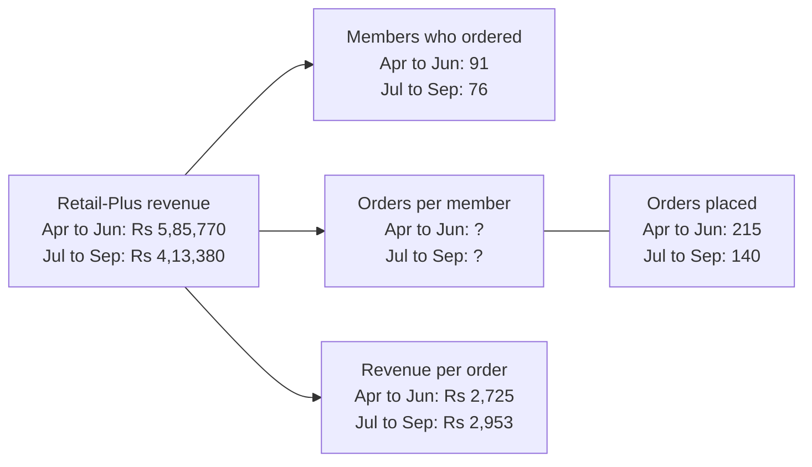
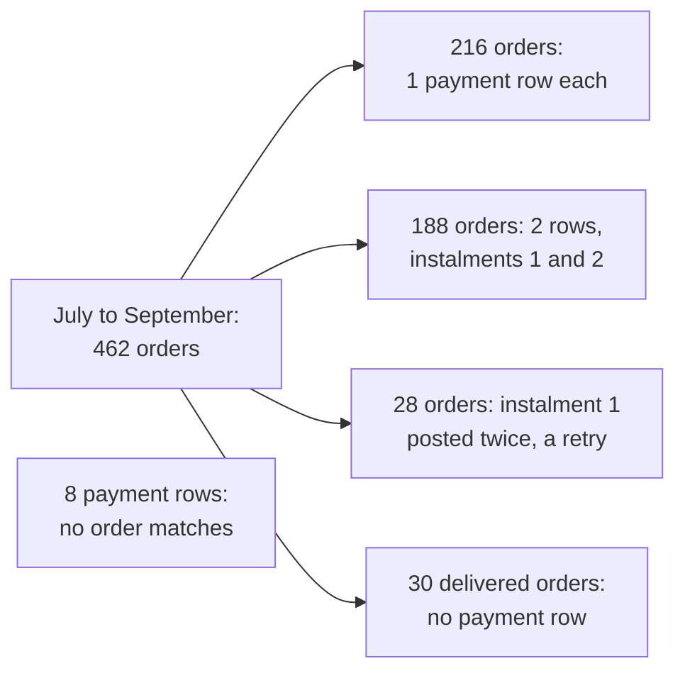
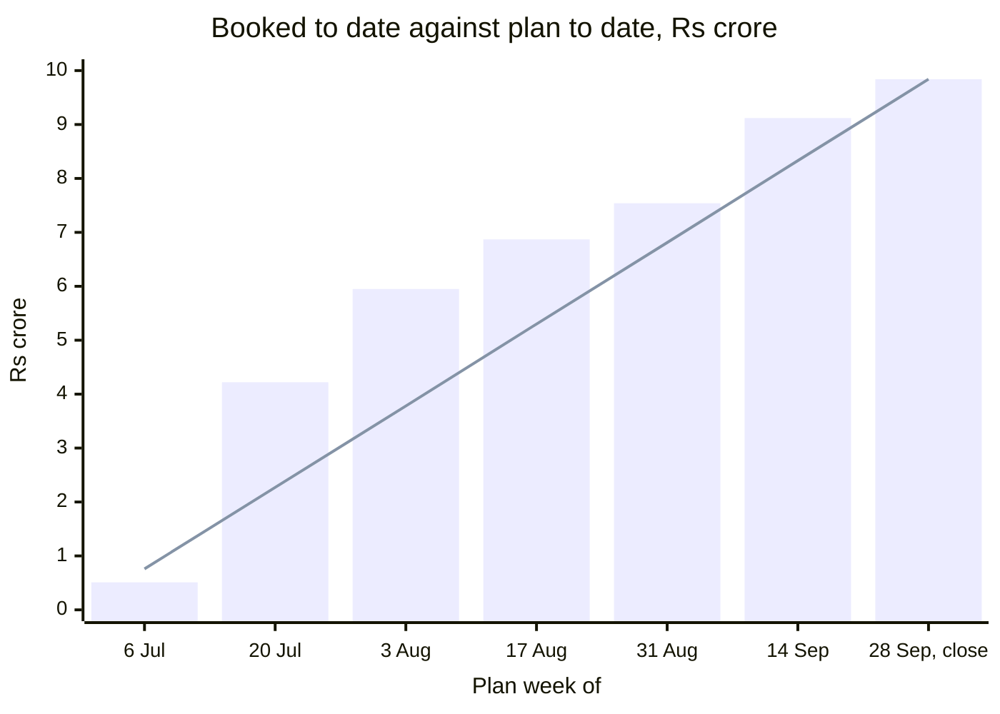
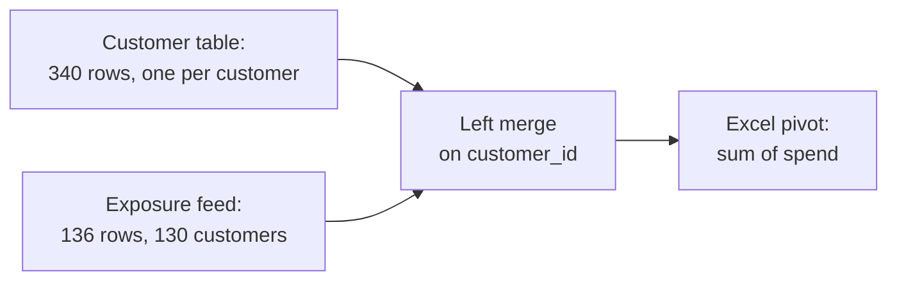
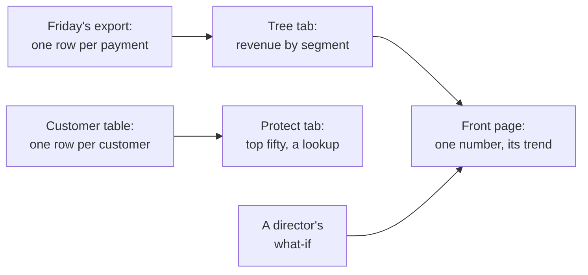
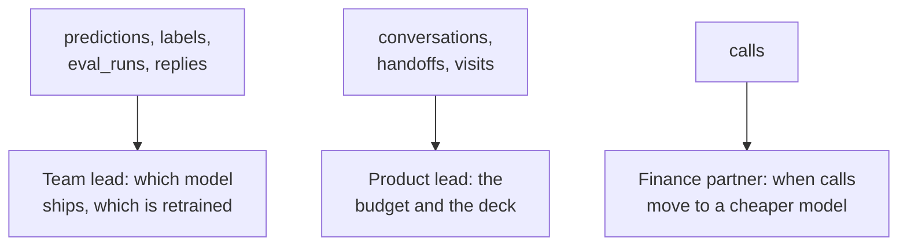

# Week 2 recap paper

Saturday 17 October 2026 · 120 minutes · 33 items in 6 parts · pen and paper, no assistant, no notes

Name: ____________________    Marked by: ____________________    Items right: ____ of 33

## What this paper is for

This week you computed Anand's Monday numbers in the warehouse, set what Kalpa collected against what it booked, drew up Marketing's protect list with its flag on falling spend, built the growth team's table of customers in pandas, and carried the numbers to Monday's growth review in Excel. This paper puts those decisions to you again, on the week's own tables, on six public cases and on the tables an AI team keeps. The room's score in each part, set beside the rating you give that part in step one, tells Monday's session where to start.

## How this paper works

- 120 minutes in one sitting. Each part gives its minutes as a guide, not a limit.
- Every item names its format beside its number, and a word bank or a match table names it once, above its items: circle one letter, circle every correct letter, write the letter from the word bank, write the matching letter, show the working and the answer, or write the letters in order.
- Every item also names its level, easy, medium or hard, so you can plan your time. A hard item is several steps on an exhibit, never an obscure fact.
- A wrong answer costs nothing, so answer every item on the line under it.
- Pen and this paper only: no laptop, no phone, no notes and no assistant.
- Afterwards the papers are swapped and marked against the key, and the discussion takes the items the room missed most. The paper is ungraded and ranks nobody; the room's rates by part and by tag set Monday's revision.
- Parts 1 to 4 and the workbook in Part 5 are set inside Kalpa Retail, where you work as a trainee engineer in the data and AI team of its Global Capability Centre, the in-house centre that builds Kalpa's data and AI systems. Anand Iyer is Kalpa Retail's finance controller, Kavya Nair the senior analyst on your team and Meera Raghavan the CEO; the head of Retail-Plus, the marketing lead, the growth team, the data platform lead and Meera's chief of staff are named by role. Six items draw on public cases (Facebook, Public Health England, genomics journals, an economics paper, JPMorgan and Uber), each with its source beside it. Part 6 imagines the AI team of a food-delivery company, and its tables and numbers are illustrative. Every number an item needs is on the page.

## Step one, before Part 1

Before you read any item, rate yourself from 1 to 4 on each part in the table below, as you are today. The comparison between your rating and your score in each part is the most useful thing this paper produces for Monday.

- 1: I have not used this
- 2: I can follow it when someone shows me
- 3: I can do it alone on a small problem
- 4: I can find and fix mistakes in someone else's version

Your ratings: Part 1 ___ · Part 2 ___ · Part 3 ___ · Part 4 ___ · Part 5 ___ · Part 6 ___

## The paper at a glance

| Part | What it shows | Items | Minutes | Easy | Medium | Hard |
|---|---|---|---|---|---|---|
| 1. Can the warehouse give Anand Monday numbers that his analyst can audit line by line? | whether you can write the Monday queries so every ratio, average and sample counts what it says | Q1 to Q6 (6) | 16 | 2 | 2 | 2 |
| 2. Can Anand sign what Kalpa collected against what it booked, with nothing lost or counted twice? | whether you can join payments to orders without losing or repeating one, and hold what fails a check | Q7 to Q11 (5) | 19.5 | 0 | 1 | 4 |
| 3. Which members should Marketing protect and call, and did July to September keep pace with the plan? | whether you can rank and flag members inside each segment and read a running total against its plan | Q12 to Q16 (5) | 17 | 0 | 2 | 3 |
| 4. What must Monday's customer table check before the growth team acts on it? | whether you can build and check a table of one row per customer through merges and pivots in pandas | Q17 to Q20 (4) | 16 | 0 | 0 | 4 |
| 5. Which numbers in Monday's workbook can a director trust, and where did three public cases go wrong? | whether you can build the workbook a director changes in the room and catch a wrong range, formula or base in a number | Q21 to Q27 (7) | 22 | 0 | 4 | 3 |
| 6. Can a food-delivery company's AI team trust the numbers behind its model and budget decisions? | whether you can read an AI team's tables and code and say which decision a wrong number would change | Q28 to Q33 (6) | 22.5 | 0 | 1 | 5 |
| Total | | 33 | 113 | 2 | 10 | 21 |

---

## Part 1. Can the warehouse give Anand Monday numbers that his analyst can audit line by line? (Q1 to Q6)

*What it shows: whether you can write the Monday queries so every ratio, average and sample counts what it says. 6 items, about 16 minutes.*

Anand Iyer, Kalpa Retail's finance controller, keeps the books every revenue figure has to match, and he asked the team for the same numbers every week: "I want these numbers every Monday, for every segment and channel, computed from the warehouse itself. No notebooks, no exports, nothing a person can mistype." The numbers are revenue, orders and customers for each segment, the groups Kalpa sells to (Business, its corporate buyers; Retail-Core, its everyday shoppers; Retail-Plus, the paid membership tier; and Student), and for each channel (app, web and store). Revenue means booked revenue: every order at its amount, whatever its status. The warehouse is Kalpa's Postgres database, and its two quarters of orders, called the book, are the one copy everybody reads; it stores April to June as quarter 'Q1' and July to September as 'Q2'. The saved queries that produce the numbers are the Monday suite. Anand signs the Monday sheet after his analyst has audited every query in the suite line by line, and the head of Retail-Plus reads the tier's line to decide which members the team works to keep, so a ratio or an average that counts the wrong people sends the tier's retention budget the wrong way.

**Exhibit 1A.** The Retail-Plus branch of Anand's revenue tree, as the warehouse holds it: revenue is the product of the tree's three leaves, members who ordered, orders per member and revenue per order.



#### Q1 · Hard · show the working, then the answer · Predict and read the leaf

Anand's analyst fills the missing leaf with SELECT quarter, count(*) / count(DISTINCT customer_id) FROM rp_orders GROUP BY quarter, where rp_orders holds the Retail-Plus orders above, and drafts a note to the head of Retail-Plus from what it returns. What does the query print for each quarter, and what should the note say orders per member did from the first quarter to the second? Show the working.

Working:

Answer: ____________________

**Word bank 1.** Write the letter of the word or phrase that completes each statement. Each is used once at most, and some are not used.

| Letter | Word or phrase |
|---|---|
| a | sort |
| b | CTE |
| c | view |
| d | guarantee |
| e | subquery |

#### Q2 · Easy · write the letter from Word bank 1 · Complete the LIMIT rule

Without ORDER BY, the database makes no ____ about which five rows LIMIT 5 returns.

Answer: ____________________

#### Q3 · Easy · write the letter from Word bank 1 · Complete the WITH rule

A named query step introduced by the keyword WITH is called a ____.

Answer: ____________________

**Exhibit 1B.** The analyst's query for the head of Retail-Plus.

```sql
WITH member_step AS (
    SELECT c.customer_id, sum(o.amount) AS spend
    FROM   customers c
    LEFT   JOIN orders o
           ON o.customer_id = c.customer_id AND o.quarter = 'Q2'
    WHERE  c.segment = 'Retail-Plus'
    GROUP  BY c.customer_id)
SELECT round(avg(spend)) AS avg_spend
FROM   member_step;
```

#### Q4 · Medium · circle one letter · Predict the average

Retail-Plus has 120 members on its books, and from July to September 76 of them ordered, spending Rs 4,13,380 between them. The head of Retail-Plus asks for the average spend across all 120 members on the books, whether they ordered or not, and the analyst runs the query above. What does it print?

a) An error, since avg cannot read a spend that is NULL
b) 3445, the average over all 120 members on the books
c) 5439, the average over the 76 members who placed an order
d) NULL, since one missing spend leaves the whole average empty

#### Q5 · Medium · circle one letter · Choose where it runs

On Monday afternoon the head of Retail-Plus asks the analyst for a chart of orders per member, week by week across both quarters, to see how the figure moved before anyone decides what to report. With Anand's rule in mind, where should that work happen?

a) In a notebook that reads the warehouse, since this chart is none of the Monday figures the rule governs
b) In the Monday suite as a saved query, since Anand's rule covers every number that anyone at Kalpa looks at
c) In a workbook built from Monday's export, since a weekly chart is what Excel does best for a tier's head
d) Nowhere yet, since a chart of a figure Finance has not defined will mislead whoever reads it

**Exhibit 1C.** Five illustrative people who played a video and the seconds each watched, with the average Facebook defined and the one it calculated (TechCrunch, 2016).

```sql
WITH viewers (viewer_id, seconds) AS (VALUES
    (1, 2.0), (2, 14.0), (3, 1.0), (4, 9.0), (5, 4.0))
SELECT round(sum(seconds) / count(CASE WHEN seconds >= 3 THEN 1 END), 1) AS calculated,
       round(sum(seconds) / count(*), 1)                                AS defined
FROM viewers;
```

#### Q6 · Hard · circle one letter · Size the overstatement

In 2016 Facebook told advertisers that it had defined the average duration of video viewed as the total time spent watching a video divided by the number of people who played it, and had calculated it by dividing by only the people who watched for three seconds or more (TechCrunch, 2016). The query above rebuilds both on five illustrative viewers. By how much does the calculated average overstate the defined one?

a) About 40 percent
b) 50 percent
c) Not at all; the two agree
d) About 67 percent

---

## Part 2. Can Anand sign what Kalpa collected against what it booked, with nothing lost or counted twice? (Q7 to Q11)

*What it shows: whether you can join payments to orders without losing or repeating one, and hold what fails a check. 5 items, about 19.5 minutes.*

Anand replied to the Monday numbers: "Booked revenue is not collected revenue. Some orders are paid in two instalments, some are refunded, some were never paid at all. Show me, order by order, what we actually collected against what we booked in Q2. If there is a gap, I want to know which orders and which channel." Collected is the cash that arrived for the booked orders, each payment counted once. The data platform lead added that "the payments feed sometimes double-posts when the gateway retries": in a gateway retry, the payment service posts the same instalment of the same order twice. Anand signs the collected figure for the CEO's Monday page, and his collections team rings every customer on the unpaid list, so an order the report drops goes unchased and a payment counted twice shows cash Kalpa never received. The bridge walks from booked to collected in named moves, each with its list of orders: booked, less the orders never paid, less any paid short, is collected.

### Set 1

**Situation.** The quarter from July to September, stored as quarter 'Q2', holds 462 orders booked at Rs 9,84,00,000. In the payments feed, 216 of them have one payment row; 188 have two rows, instalments 1 and 2 of one invoice; 28 have two rows that differ only in payment_id, because the gateway retried and posted instalment 1 twice; and 30 delivered orders have no payment row at all. Every order with a payment row was paid in full. Eight further payment rows carry an order_id that no order has.

**Exhibit 2A.** The quarter's orders by their payment rows, as the situation describes them.



**Exhibit 2B.** The first query in Anand's report, run before any rupee is summed.

```sql
SELECT count(*)            AS rows_out,
       count(p.payment_id) AS payment_rows
FROM   orders o
LEFT   JOIN payments p ON p.order_id = o.order_id
WHERE  o.quarter = 'Q2';
```

#### Q7 · Hard · circle one letter · Size the join first

Before the report goes to Anand, the analyst sizes the join by hand. What will the query above return?

a) 678 and 648
b) 462 and 432
c) 650 and 620
d) 686 and 656

#### Q8 · Hard · write the letters in order · Order the report's steps

Five of these six steps make Anand's collected-revenue report, and one would spoil it. Leave that step out, and write the other five in the order they must run.

a) Send booked, collected and the gap to Anand, channel by channel
b) LEFT JOIN the quarter's 462 orders to each order's collected figure
c) Check that the result has one row for each of the 462 orders, and that each channel's gap equals its unpaid orders' booked value
d) Drop every order that has two payment rows, since those are the gateway's double posts
e) Keep one payment row for each order and instalment number
f) Sum the payment rows to one collected figure for each order

Order: ____________________

**Exhibit 2C.** The analyst's query, with three illustrative orders and their payment rows written into it.

```sql
WITH orders (order_id, amount) AS (VALUES
    ('O-1', 1200), ('O-2', 800), ('O-3', 500)),
payments (order_id, paid_date, paid) AS (VALUES
    ('O-1', DATE '2026-07-04', 600), ('O-1', DATE '2026-08-04', 600),
    ('O-2', DATE '2026-10-01', 800))
SELECT count(*) AS rows_out, sum(o.amount) AS booked
FROM orders o
LEFT JOIN payments p ON p.order_id = o.order_id
WHERE p.paid_date BETWEEN DATE '2026-07-01' AND DATE '2026-09-30';
```

#### Q9 · Hard · circle one letter · Run the query by hand

Anand wants every order of the quarter beside what was collected on it within the quarter, so the analyst adds a date filter on the payments. Before the report goes to him, the analyst runs the query above to count its rows and their booked value. What does it return?

a) 1 row, booked Rs 1,200
b) 2 rows, booked Rs 2,400
c) 3 rows, booked Rs 2,900
d) 4 rows, booked Rs 3,700

**Exhibit 2D.** Suppose these are the report's figures by channel at the end of a later reporting day; the figures are illustrative. The report's row count and its booked total both match their sources.

| Channel | Booked, Rs | Collected, Rs | Unpaid orders' booked value, Rs |
|---|---|---|---|
| App | 4,25,90,270 | 4,25,82,150 | 8,120 |
| Store | 3,21,48,730 | 3,11,90,920 | 9,57,810 |
| Web | 2,36,61,000 | 2,28,50,250 | 7,89,000 |

#### Q10 · Medium · circle one letter · Decide what leaves tonight

It is the end of the reporting day, and Anand expects the report tonight. His rule for a check that fails this late: booked always leaves, because it ties to the orders table alone; a collected figure that does not reconcile never leaves, and an open line goes with the report, naming the failed check, what it means and when it will close. No order on this report was paid short, so a channel's collected reconciles when its gap, booked less collected, equals its unpaid orders' booked value. What do you send?

a) Booked and collected for every channel, with any unexplained gap added to that channel's unpaid list
b) Booked for every channel, collected for app and web, and store's collected held back
c) Booked for every channel, collected for app and store, and web's collected held back
d) Booked for every channel, with all collected held back until every bridge closes

**Exhibit 2E.** Suppose one day's files from three labs looked like this; the counts are illustrative. An .xls sheet holds 65,536 rows, one of them the header.

| Lab file | Rows in the lab's CSV | Data rows in the .xls sheet | Rows loaded | Rows loaded the day before |
|---|---|---|---|---|
| Lab A | 41,200 | 41,200 | 41,200 | 39,850 |
| Lab B | 70,900 | 65,535 | 65,535 | 61,020 |
| Lab C | 12,480 | 12,480 | 12,480 | 13,110 |

#### Q11 · Hard · circle every correct letter · Choose the checks

In October 2020 Public Health England found that 15,841 positive COVID-19 cases from 25 September to 2 October had been left out of the daily figures, because some files had exceeded the maximum size the load could take (GOV.UK, 2020). The labs' CSV files had been converted to the older .xls format, and records past its limit were "simply left off and not counted when imported" (The Register, 2020). Which of these checks, run on every file, would have stopped Lab B's file on the day in the table? Mark every correct option.

a) Compare rows loaded with data rows in the .xls sheet, and stop the file when they differ
b) Remove duplicate rows from each file before it is loaded, so that no case counts twice
c) Compare rows loaded with rows in the lab's CSV, and stop the file when they differ
d) Stop any file whose rows loaded fall below that lab's rows loaded the day before
e) Stop any file whose sheet holds exactly 65,535 data rows, the most the format allows

---

## Part 3. Which members should Marketing protect and call, and did July to September keep pace with the plan? (Q12 to Q16)

*What it shows: whether you can rank and flag members inside each segment and read a running total against its plan. 5 items, about 17 minutes.*

The marketing lead wrote to the team: "Retail-Plus frequency is the problem, so we want to protect our best members before they drift. Give us the top fifty customers by Q2 revenue in each segment, and flag anyone whose monthly spend has fallen for two months running. And Meera wants to see revenue accumulate week by week against the plan line, so we know by mid-quarter whether we are on track." Each segment's top fifty make its protect list, and Marketing spends its retention budget, a call and a renewal offer, on the members the lists name, so a list cut by the wrong rule, or a flag that misreads a member, rings the wrong people. Meera Raghavan, the CEO, decides at mid-quarter whether to hold the plan, push a campaign or move budget, and a false gap against the plan sends Marketing after it with discounts. The plan line sets Rs 75,69,230 of revenue for each of the quarter's 13 plan weeks, which start on Mondays from 6 July; plan to date adds up the plan weeks to the end of the one being read, and booked to date does the same for the orders.

**Exhibit 3A.** Retail-Plus members at places 46 to 53 when sorted by revenue for July to September, highest first, with tied members in order of their ids.

| Place, highest revenue first | Member | Revenue, July to September, Rs |
|---|---|---|
| 46 | C-0162 | 3,600 |
| 47 | C-0264 | 3,540 |
| 48 | C-0189 | 3,480 |
| 49 | C-0206 | 3,480 |
| 50 | C-0185 | 3,350 |
| 51 | C-0242 | 3,350 |
| 52 | C-0259 | 3,200 |
| 53 | C-0252 | 3,150 |

#### Q12 · Hard · circle one letter · Apply the head's rule

Retail-Plus had 76 members who ordered from July to September. Sorted by their revenue for the quarter, highest first, the top 45 each spent a different amount, all above Rs 3,600, and places 46 to 53 are in the table. The head of Retail-Plus set the rule for the protect list: "Ties matter. If two members spent the same, I want them ranked the same, and I want to know how many made the top fifty, not forty-nine because of a tie." The list keeps every member who spent at least as much as the fiftieth member in the table's order, and nobody who spent less. Which ranking gives that list, and how many members does it keep?

a) DENSE_RANK, keeping every member ranked 50 or better: 51 members
b) ROW_NUMBER with member id as tiebreaker, keeping places 1 to 50: 50 members
c) Whole ties only, cutting before any tie that crosses the fiftieth place: 49 members
d) RANK, keeping every member whose rank is 50 or better: 51 members

#### Q13 · Medium · circle one letter · Choose the approach

Marketing's first protect list sorted every customer by revenue for July to September and kept the top fifty: all 35 Business customers who ordered, because the smallest of their spends is more than ten times the largest retail spend, then 11 Retail-Plus members and 4 Retail-Core customers, and no Student. For a pilot, Marketing now wants the top three customers in each segment. Which approach answers it?

a) GROUP BY segment with LIMIT 3, which applies the limit to each group in turn
b) A rank within PARTITION BY segment, which an outer query keeps at 3 or better
c) ORDER BY revenue DESC with LIMIT 3, which returns the top rows of each segment
d) HAVING count(*) <= 3, which keeps the three largest rows inside each group

#### Q14 · Medium · circle one letter · Choose the share query

Marketing wants each Retail-Plus member's spend beside the member's share of the tier's spend for July to September. The table member_step holds one row per member who ordered, with the columns customer_id and spend. Which query gives each member's share?

a) SELECT customer_id, spend, spend / sum(spend) OVER () FROM member_step
b) SELECT customer_id, spend, spend / sum(spend) FROM member_step GROUP BY customer_id, spend
c) SELECT customer_id, spend, spend / sum(spend) OVER (ORDER BY spend DESC) FROM member_step
d) SELECT customer_id, spend, spend / avg(spend) OVER () FROM member_step

**Exhibit 3B.** Four Retail-Plus members' monthly spend in rupees, from the warehouse's orders.

| Member | Apr | May | Jun | Jul | Aug | Sep |
|---|---|---|---|---|---|---|
| C-0161 | 3,520 |  |  | 4,200 | 3,100 | 1,900 |
| C-0171 |  | 2,210 | 4,130 | 3,800 | 2,600 | 1,400 |
| C-0185 | 3,880 | 6,990 | 2,690 | 1,900 |  | 1,450 |
| C-0216 |  | 6,440 |  | 4,300 |  | 2,540 |

#### Q15 · Hard · circle one letter · Run the falling flag

The falling flag reads member_month, which sums each member's orders by calendar month. It takes prev1 = LAG(spend, 1) and prev2 = LAG(spend, 2), each partitioned by member and ordered by month, and flags a member whose September spend is below prev1 while prev1 is below prev2. Marketing will call every member the flag names and say that their spend fell in both August and September. How many calls does Marketing make, and how many of them say something untrue?

a) 2 calls, none of them untrue
b) 4 calls, two of them untrue
c) 3 calls, one of them untrue
d) 1 call, and it is true

**Exhibit 3C.** Booked to date against plan to date, read at the end of every other plan week and at the close. Each plan week is named by the Monday it starts on, and the first also carries the orders of 1 to 5 July, before the plan's first Monday. The bars are booked, the line is plan, and the table gives both.



| Plan week of | 6 Jul | 20 Jul | 3 Aug | 17 Aug | 31 Aug | 14 Sep | 28 Sep, the close |
|---|---|---|---|---|---|---|---|
| Booked to date | 0.51 | 4.22 | 5.95 | 6.87 | 7.54 | 9.12 | 9.84 |
| Plan to date | 0.76 | 2.27 | 3.78 | 5.30 | 6.81 | 8.33 | 9.84 |

#### Q16 · Hard · circle one letter · Read the plan line

The quarter closed at Rs 9,84,00,000 against a plan of Rs 9,83,99,990. Meera's chief of staff wants one sentence for Monday's front page on how it got there, and the figures above are all there is. Which sentence do they support?

a) Furthest ahead in the week of 20 July, by about Rs 2.0 crore, and back level with the plan by the week of 31 August
b) Behind the plan from mid-August until the last fortnight, after two strong fortnights in July
c) Furthest ahead in the week of 3 August, by about Rs 2.2 crore, and about Rs 0.8 crore ahead in the week of 14 September
d) The lead grew at every reading from the week of 20 July to the week of 14 September, and the quarter closed level with the plan

---

## Part 4. What must Monday's customer table check before the growth team acts on it? (Q17 to Q20)

*What it shows: whether you can build and check a table of one row per customer through merges and pivots in pandas. 4 items, about 16 minutes.*

Kalpa Retail's growth team, with the data platform lead, asked for one thing it would use every week: "One table, one row per customer, refreshed every Monday: how recently each customer bought, how often, how much, their segment, whether the monsoon sale reached them, and the flags we act on. Marketing's analysts live in Python, so build it in pandas, from the warehouse, and make it refresh in one run." The three numbers are recency, the days from a customer's last order to the data's last date, 28 September 2026; frequency, the orders placed; and spend, the rupees those orders booked. The monsoon sale was a campaign Kalpa ran in August 2026. Every Monday the growth team sends a win-back code to customers who have gone quiet and a first-order nudge to those who never ordered, straight from the table and with no analyst watching, so a customer missing from it gets no offer and a customer counted twice inflates every total built on it. Kavya Nair, the senior analyst, reviews the table before it leaves the team. The last two items take the same checks to a months view for the head of Retail-Plus and to a genomics lab's gene list.

### Set 2

**Situation.** The customer table has 340 rows, one per customer, and its spend column adds up to the book's Rs 19,84,00,000 for both quarters. The monsoon sale's exposure feed, which lists the customers the sale reached, holds 136 rows for 130 customers. The analyst merges the feed onto the table with how='left' and sends the result to Excel, where a pivot sums spend.

**Exhibit 4A.** Monday's refresh, as the situation describes it.



#### Q17 · Hard · circle one letter · Size the merge

How many rows does the merged table hold, and what should Monday's refresh carry before the pivot is built?

a) 346 rows, and validate='one_to_one' on the merge, which raises a MergeError
b) 340 rows, and nothing more, since a left merge keeps the customer table's rows
c) 352 rows, and drop_duplicates() on the merged table to take out the extra rows
d) 136 rows, and indicator=True on the merge to flag the rows before the pivot

**Exhibit 4B.** Next Monday's feed from the campaign tool, its rows for three customers, and the step the refresh now runs on the feed before the merge.

| customer_id | campaign_id | exposed_date |
|---|---|---|
| C-0001 | CMP-MONSOON-26 | 2026-08-11 |
| C-0002 | CMP-MONSOON-26 | 2026-08-11 |
| C-0001 | CMP-MONSOON-26 | 2026-08-03 |
| C-0002 | CMP-MONSOON-26 | 2026-08-03 |
| C-0012 | CMP-MONSOON-26 | 2026-08-03 |

```python
first = feed.drop_duplicates(subset="customer_id")
```

#### Q18 · Hard · circle one letter · Trace the first exposure

The growth team's rule is one exposure per customer, the first by date, and the sale's report credits the sale with every order a customer places from that exposure on. Which exposure does the step above keep for C-0001, and what does the report make of C-0001's orders?

a) The 3 August send, so each order C-0001 placed from then on is credited to the sale
b) Both sends, since they differ in exposed_date, so C-0001's orders after its second send count twice
c) Neither send, since the step drops every customer the feed repeats, so none of C-0001's orders count
d) The 11 August send, so the orders C-0001 placed in the eight days before it go uncredited

**Exhibit 4C.** The analyst's months view for the head of Retail-Plus, on five illustrative orders.

```python
import pandas as pd
plus = pd.DataFrame({
    "member": ["M1", "M1", "M1", "M2", "M2"],
    "month":  ["Jun", "Jun", "Jul", "Jun", "Jun"],
    "amount": [3000, 1000, 2400, 1800, 600]})
wide = plus.pivot_table(index="member", columns="month", values="amount")
long = wide.reset_index().melt(id_vars="member", value_name="amount")
print(wide.loc["M1", "Jun"], len(long), long["amount"].sum())
```

#### Q19 · Hard · circle one letter · Predict the months view

The head of Retail-Plus wants one row per member and one column per month, to read who is drifting, and a long copy of the same view for a trend chart. What does the code above print?

a) 4000.0 5 8800.0
b) 2000.0 4 5600.0
c) 3000.0 3 7200.0
d) 4000.0 3 8800.0

**Exhibit 4D.** A lab's gene list after a trip through Excel, and the lab's reference table of gene panels; the values are illustrative (Genome Biology, 2016).

```python
import pandas as pd
lab = pd.DataFrame({"symbol": ["TP53", "2-Sep", "BRCA1", "1-Mar"],
                    "fold_change": [2.1, 0.4, 1.8, 3.2]})
ref = pd.DataFrame({"symbol": ["TP53", "TP53", "SEPT2", "BRCA1", "MARCH1"],
                    "panel": ["A", "D", "B", "A", "C"]})
m = lab.merge(ref, on="symbol", how="left")
print(len(m), m["panel"].notna().sum())
```

#### Q20 · Hard · circle one letter · Predict the merge

Gene symbols are the short names genes go by in papers and databases. Ziemann and colleagues found that Excel's default settings turn some symbols into dates, and that about a fifth of genomics papers with Excel gene lists carried such errors (Genome Biology, 2016). The code above merges a lab's list, after a trip through Excel, onto the lab's reference table of panels, the sets of genes it tests together. What does it print?

a) 4 4
b) 5 3
c) 7 5
d) 4 2

---

## Part 5. Which numbers in Monday's workbook can a director trust, and where did three public cases go wrong? (Q21 to Q27)

*What it shows: whether you can build the workbook a director changes in the room and catch a wrong range, formula or base in a number. 7 items, about 22 minutes.*

Meera's chief of staff builds the deck for Monday's growth review and works only in Excel: "Monday's growth review deck needs three things I can open on my laptop without a login: the revenue tree by segment for both quarters, the top-fifty protect list with a lookup so I can find any member by id, and one number on the front page with its trend. Nothing that needs Python. If a director changes an assumption in the room, the sheet must recalculate in front of them." The directors read the front page first and may read nothing else, and the head of Retail-Plus sizes each city's retention budget from the protect list in the room, so a wrong total with nothing red beside it becomes a director's decision or a city's budget before any analyst sees it. The protect list in the workbook is Friday's: the fifty Retail-Plus members with the highest revenue across both quarters. The three public cases after the workbook are numbers people relied on: an economics paper's average, a bank's risk figure and a ride-hailing company's commission.

**Exhibit 5A.** The chief of staff's workbook for Monday's review, and two rows of Friday's export: one row per payment, with the order's booked amount, order_amount, repeated on each.



| order_id | segment | order_amount | paid_amount |
|---|---|---|---|
| KR-00028 | Business | 6,35,000 | 3,81,000 |
| KR-00028 | Business | 6,35,000 | 2,54,000 |

**Match table 1.** Each numbered row is a job the chief of staff's workbook must do. Write the letter of the technique that does it. Each letter is used once at most, and two are not used.

| Item | To match | Letter | Match |
|---|---|---|---|
| Q21 (Medium) | Find any member by id, and print a plain message for an unknown id | a | SUBTOTAL with function number 109 |
| Q22 (Medium) | A figure under the protect list that adds the spend of only the members a filter to Mumbai leaves on screen | b | VLOOKUP with its fourth argument left out |
| Q23 (Medium) | Booked revenue by segment from Friday's export, in which an invoice paid in two instalments appears twice | c | a labelled input cell feeding a scenario line |
| Q24 (Medium) | Let a director try Rs 5,00,000 for Retail-Plus in July to September, with the warehouse's figures untouched | d | XLOOKUP with its if_not_found argument set |
|  |  | e | Remove Duplicates across every column |
|  |  | f | a first-row flag per order, then SUMIFS |

Answers: Q21 ____    Q22 ____    Q23 ____    Q24 ____

**Exhibit 5B.** An illustrative sheet that sets growth in high-debt years against growth in other years for six countries, in percent.

| Row | A: Country | B: High-debt years | C: Other years |
|---|---|---|---|
| 2 | Country 1 | -1.0 | 2.0 |
| 3 | Country 2 | 1.0 | 1.0 |
| 4 | Country 3 | -3.0 | 2.0 |
| 5 | Country 4 | 1.0 | 1.0 |
| 6 | Country 5 | 6.0 | 2.0 |
| 7 | Country 6 | 5.0 | 1.0 |
| 8 | Average | =AVERAGE(B2:B5) | =AVERAGE(C2:C7) |

#### Q25 · Hard · show the working, then the answer · Reproduce the comparison

In 2013 Herndon, Ash and Pollin rebuilt an influential 2010 paper by Reinhart and Rogoff from the authors' own working spreadsheet, and found that the paper's average growth for countries with public debt over 90 percent of GDP, the value of everything a country produces in a year, published as -0.1 percent, was 2.2 percent once a coding error in the spreadsheet, the exclusion of some available data and an unusual weighting of the averages were corrected (PERI working paper 322, 2013). The illustrative sheet above goes to a review today. What does it report for the two columns, what do the six countries' figures give, and does its comparison hold? Show the working.

Working:

Answer: ____________________

**Exhibit 5C.** Illustrative rates and the sheet's formula for a day's change (JPMorgan Chase, 2013).

| Row | Old rate, column B | New rate, column C | The sheet's change, column D |
|---|---|---|---|
| 2 | 2.00 | 2.60 | =(C2-B2)/(B2+C2) |
| 3 | 3.00 | 2.40 | =(C3-B3)/(B3+C3) |
| 4 | 1.50 | 1.80 | =(C4-B4)/(B4+C4) |

#### Q26 · Hard · show the working, then the answer · Work the risk figure

JPMorgan's task force on the 2012 losses in its Chief Investment Office reported on a value-at-risk model, an estimate of how much a trading book can lose on a bad day, that ran through Excel spreadsheets filled by copying and pasting (JPMorgan Chase, 2013). Suppose the model's documentation defines a day's change as the difference between the new and old rates divided by their average, and that its value at risk moves in proportion to the size of those changes. The sheet above reports a value at risk of 70 million dollars against the desk's limit of 120 million dollars; both figures are illustrative. What value at risk should the sheet have reported, and is the desk inside its limit? Show the working.

Working:

Answer: ____________________

**Exhibit 5D.** Three illustrative trips and the commission charged on each.

| Trip | Gross fare, dollars | Taxes and fees, dollars | Commission charged, dollars |
|---|---|---|---|
| 1 | 30.00 | 2.40 | 7.50 |
| 2 | 20.00 | 1.60 | 5.00 |
| 3 | 44.00 | 4.00 | 11.00 |

#### Q27 · Hard · show the working, then the answer · Size the commission

In 2017 Uber told New York City drivers that it had been taking too much commission from them, and that each affected driver would get a refund of about 900 dollars, interest included (CBS News, 2017). Suppose the drivers' terms set the commission at 25 percent of the fare after taxes and fees. How much commission did the three trips above overcharge the driver, and what share of the commission charged is that? Show the working.

Working:

Answer: ____________________

---

## Part 6. Can a food-delivery company's AI team trust the numbers behind its model and budget decisions? (Q28 to Q33)

*What it shows: whether you can read an AI team's tables and code and say which decision a wrong number would change. 6 items, about 22.5 minutes.*

Suppose a food-delivery company runs a support assistant, a chatbot that answers customers and hands hard cases to a person. Its AI team scores each model version on a fixed set of test tickets, which is an evaluation run, collects customers' ratings of the replies, and logs every conversation, every handoff to a person, every call to the model and every visit. The team lead decides which model ships and which is retrained, the product lead sets the assistant's budget, and the finance partner pays the model's bill, which is charged by the token, a unit of text the model reads or writes. A wrong number in these tables changes one of those decisions. The company, its tables and every number below are illustrative.

**Exhibit 6A.** Who acts on which of the assistant team's tables, and the tables as this part imagines them.



| Table | One row per | Columns |
|---|---|---|
| predictions | test ticket | ticket, pred |
| labels | label, set by hand at an outside firm | ticket, label |
| eval_runs | evaluation run | model, run_id, finished_on, accuracy |
| replies | reply to a customer | reply_id, model, rating |
| conversations | conversation | conversation_id |
| handoffs | handoff to a person | conversation_id |
| calls | call to the model | call_id, day, tokens |
| visits | a user's use of the assistant on a day | day, user_id |

**Exhibit 6B.** The team's scoring code, on five illustrative test tickets.

```python
import pandas as pd
preds = pd.DataFrame({"ticket": ["T1", "T2", "T3", "T4", "T5"],
                      "pred": ["refund", "late", "refund", "late", "other"]})
labels = pd.DataFrame({"ticket": ["T1", "T2", "T3", "T4", "T5", "T3", "T5"],
                       "label": ["refund", "late", "late", "late", "refund",
                                 "late", "refund"]})
m = preds.merge(labels, on="ticket")
print(round((m["pred"] == m["label"]).mean(), 2))
```

#### Q28 · Hard · circle one letter · Predict the accuracy

The team scores a model that sorts support tickets into refund, late and other against labels that an outside firm set by hand, and ships a model only if it scores 0.5 or better. What does the code above print, and what happens to the model?

a) 0.6, so the model clears the 0.5 bar and ships this week
b) 0.71, so the model clears the bar with room to spare and ships
c) 0.43, so the model falls short of the bar and is held back
d) A MergeError, since the two frames differ in length, so the model waits

**Exhibit 6C.** The table eval_runs: the team's evaluation runs, illustrative.

| model | run_id | finished_on | accuracy |
|---|---|---|---|
| bot-a | 7 | 1 September | 0.81 |
| bot-b | 8 | 2 September | 0.84 |
| bot-a | 9 | 8 September | 0.78 |
| bot-b | 10 | 9 September | 0.86 |
| bot-b | 11 | 9 September | 0.74 |

#### Q29 · Hard · circle one letter · Choose the query

The team promotes bot-b over bot-a if bot-b's latest run scores higher than bot-a's latest. Runs are numbered in the order they start, and of two runs that finish on the same day, the one that started later counts as the latest. Which query gives the team the right call, and what is the call?

a) ROW_NUMBER partitioned by model, by finished_on descending, then run_id descending, keeping row 1: bot-b's latest scores 0.74, so bot-a stays
b) ROW_NUMBER partitioned by model, by finished_on descending, then run_id ascending, keeping row 1: bot-b's latest scores 0.86, so bot-b is promoted
c) GROUP BY model with max(finished_on) and max(accuracy): bot-b's latest reads 0.86, so bot-b is promoted
d) RANK partitioned by model, by finished_on descending, keeping rank 1: bot-b's latest scores 0.86, so bot-b is promoted

**Exhibit 6D.** Nine replies, the ratings customers gave them and the analyst's query, illustrative.

```sql
WITH replies (reply_id, model, rating) AS (VALUES
    (1, 'bot-a', 1), (2, 'bot-a', 4), (3, 'bot-a', 2), (4, 'bot-a', 2),
    (5, 'bot-b', 2), (6, 'bot-b', 5), (7, 'bot-b', 4),
    (8, 'bot-c', 5), (9, 'bot-c', 1))
SELECT model, count(*) AS low_rated
FROM replies
WHERE rating <= 2
GROUP BY model
HAVING count(*) >= 3;
```

#### Q30 · Hard · circle one letter · Predict the rows

Customers rate each reply from 1 to 5. The team lead asks for every model with at least three replies this week, beside how many of its replies were rated 2 or below, and will retrain every model on the list. What does the query above return, and which models are retrained?

a) bot-a and bot-b, each beside its low ratings, so the lead retrains both
b) bot-a and bot-b, each beside its count of all its replies, so the lead retrains both
c) bot-a, bot-b and bot-c, each beside its low ratings, so the lead retrains all three
d) bot-a alone, beside its count of 3 low ratings, so the lead retrains bot-a

**Exhibit 6E.** Four conversations and the handoff log, illustrative.

```sql
WITH conversations (conversation_id) AS (VALUES ('c1'), ('c2'), ('c3'), ('c4')),
handoffs (conversation_id) AS (VALUES ('c2'), ('c4'), (NULL))
SELECT count(*) AS resolved_by_bot
FROM conversations
WHERE conversation_id NOT IN (SELECT conversation_id FROM handoffs);
```

#### Q31 · Hard · circle one letter · Predict the count

The weekly review reads how many of the four conversations the assistant resolved without a person, and the product lead cuts the assistant's budget if that is under 40 percent. What does the query above return, and what happens to the budget?

a) 2, half the conversations, so the budget stays
b) 0, none of the conversations, so the budget is cut
c) 3, three of the four, so the budget stays
d) An error, so no figure reaches the review and the budget waits

**Exhibit 6F.** Four model calls and the tokens each used, illustrative.

```sql
WITH calls (call_id, day, tokens) AS (VALUES
    (1, DATE '2026-09-21', 400), (2, DATE '2026-09-22', 300),
    (3, DATE '2026-09-22', 500), (4, DATE '2026-09-23', 200))
SELECT call_id, sum(tokens) OVER (ORDER BY day) AS tokens_so_far
FROM calls
ORDER BY call_id;
```

#### Q32 · Hard · circle one letter · Find the first routed call

The model's bill is charged per token, so the finance partner routes to the cheaper model every call whose tokens_so_far, read from the query above, is over 1,000. Which is the first call routed?

a) Call 2
b) Call 3
c) Call 4
d) None of them

**Exhibit 6G.** One week of the visits log, illustrative: the users who opened the assistant on each day.

| Day | Mon | Tue | Wed | Thu | Fri | Sat | Sun |
|---|---|---|---|---|---|---|---|
| Users | U1, U2, U3 | U1, U4 | U2, U3, U5 | U1, U2 | U3, U4, U6 | U1 | U2, U6 |

#### Q33 · Medium · circle one letter · Count the week's users

The product lead wants the week's active users for the deck. Which number goes on the slide?

a) 16
b) 2.3
c) 3
d) 6

---

## Stretch: untimed, and not marked

For anyone who finishes early. Nothing here is counted; each item is the kind an interviewer asks after your first answer, so write the answer you would say.

### Stretch 1

Anand now wants collected revenue week by week instead of for the whole quarter. Which date decides the week a rupee is collected in, and what happens to an order paid in two instalments?

### Stretch 2

The head of Retail-Plus asks whether members who ordered in both quarters spent more in the second. How would you build that comparison, and what would you say about members who ordered in only one quarter?

### Stretch 3

In 2020 the body that names human genes renamed every gene whose symbol Excel turned into a date. Explain to a product manager in two sentences why the fix went into the gene names, and what you would still check in every file you receive.

### Stretch 4

A director says the front page should read Rs 19.84 crore because "that is the real number". Answer in two sentences.
