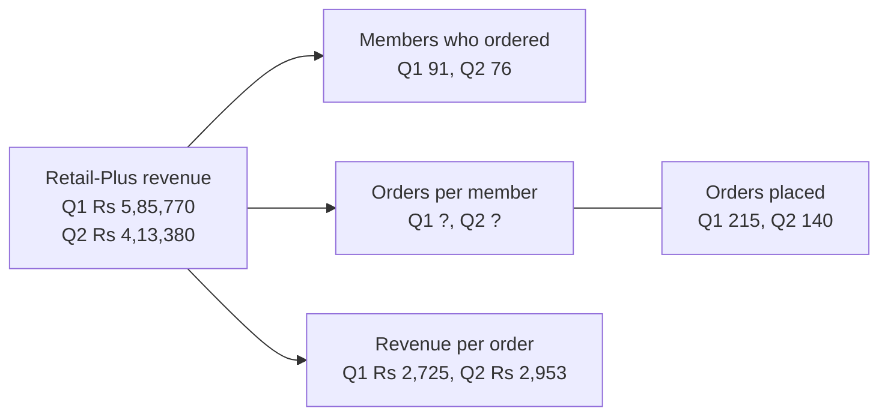
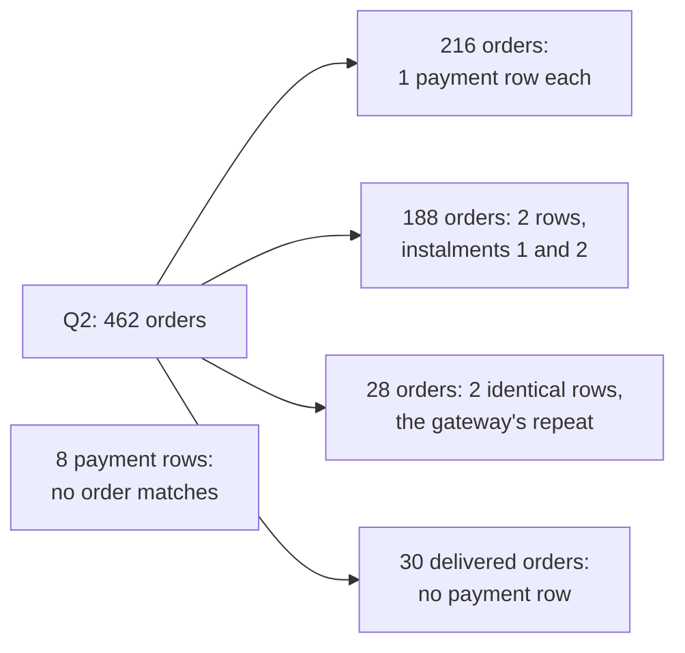
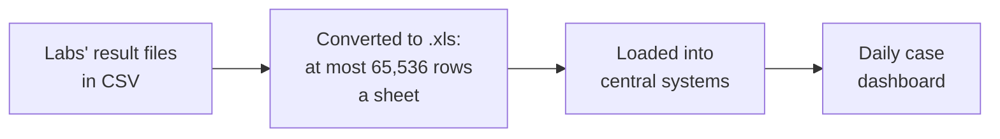
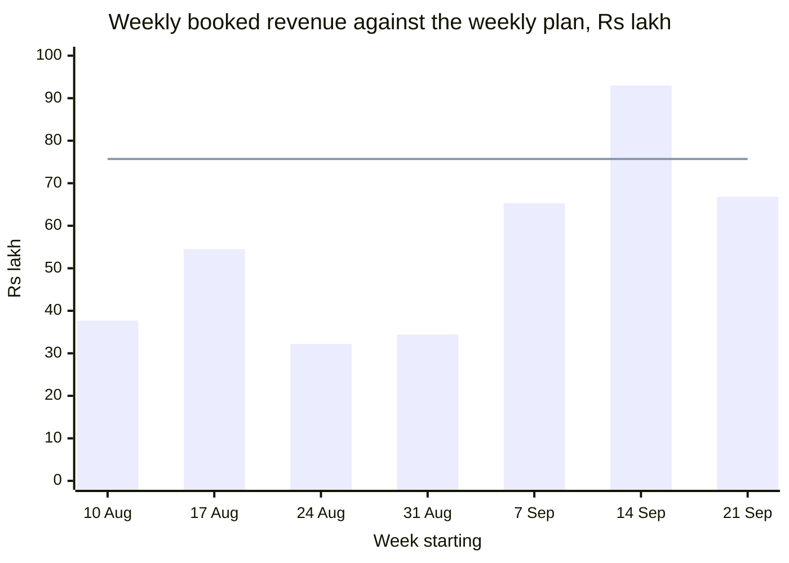
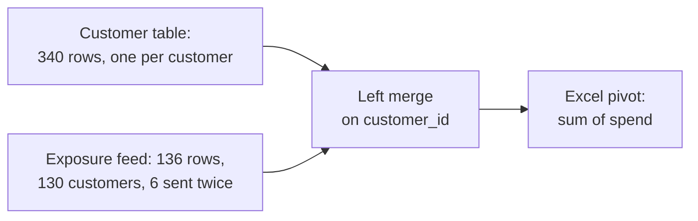
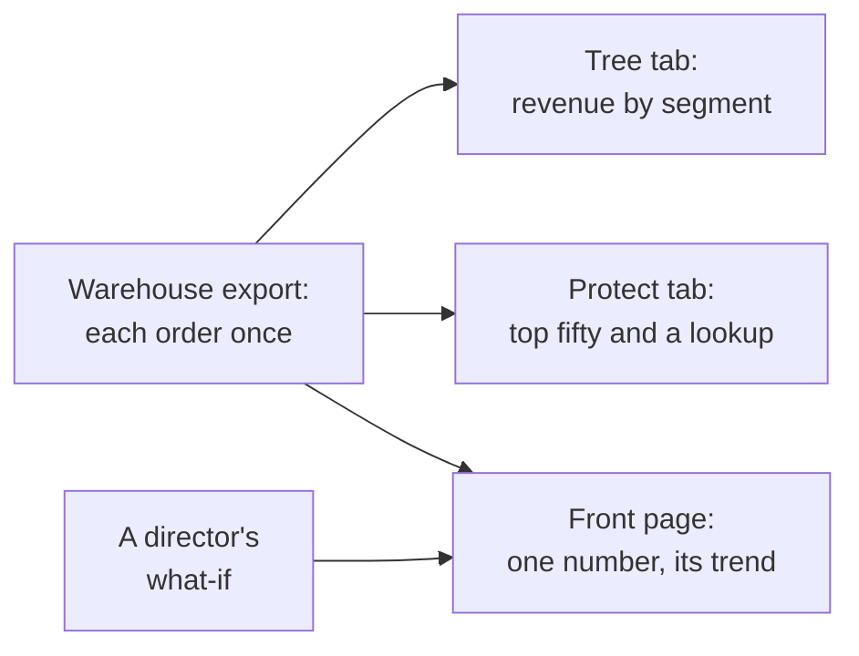
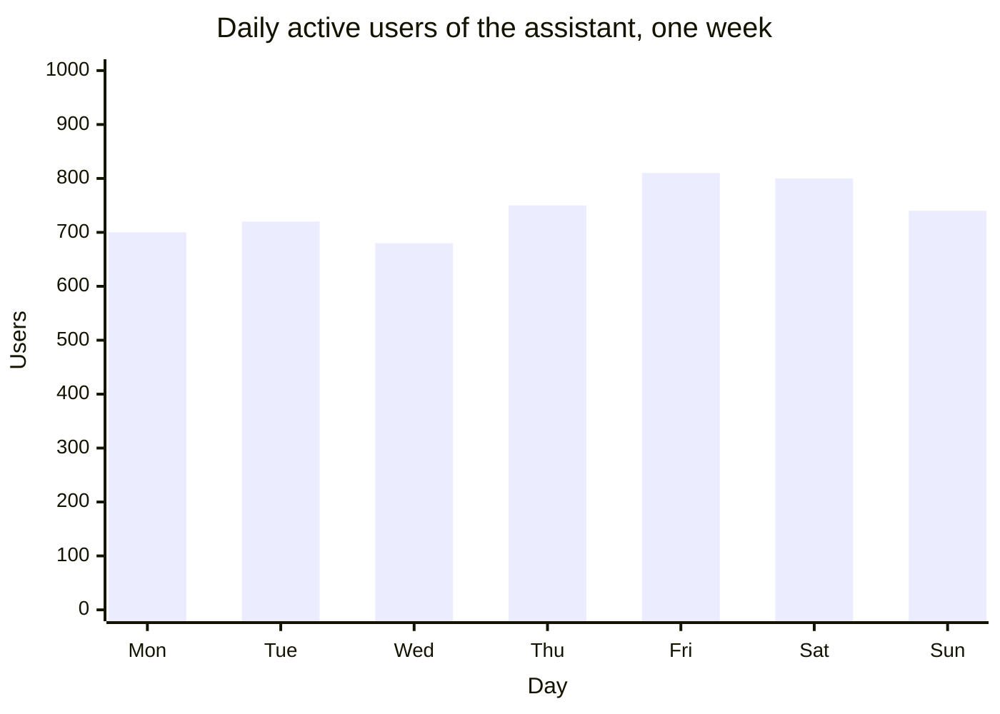

# Week 2 recap paper

Saturday 17 October 2026 · 120 minutes · 35 items in 6 parts · pen and paper, no assistant, no notes

Name: ____________________    Marked by: ____________________    Items right: ____ of 35

## What this paper is for

This week you computed Anand's Monday numbers in the warehouse, set booked revenue against the cash actually collected, drew up Marketing's protect list, built the customer table in pandas and carried it to the leadership deck in Excel. This paper finds which of those decisions you can make cold, with no notes and no assistant: sizing a join before it runs, choosing the tie rule the business asked for, placing the check that stops a wrong number, and reading a query or a few lines of pandas before anyone acts on what it returns. Some items take the same traps to public cases and to an AI team's tables. The room's scores by part, set beside the ratings you give in step one, tell Monday's session where to start.

## How this paper works

- 120 minutes in one sitting. Each part gives its minutes as a guide, not a limit.
- Every item names its format beside its number: circle one letter, circle every correct letter, write T or F, write a letter from a word bank or a match table, write the word or number, show the working, or write the letters in order.
- Every item also names its level, easy, medium or hard, so you can plan your time. A hard item is several steps on an exhibit, never an obscure fact.
- A wrong answer costs nothing, so answer every item on the line under it.
- Pen and this paper only: no laptop, no phone, no notes and no assistant.
- Afterwards the papers are swapped and marked against the key, and the discussion takes the items the room missed most. The paper is ungraded and ranks nobody; the room's rates by part and by tag set Monday's revision.
- Parts 1 to 4 and the workbook in Part 5 are set inside Kalpa Retail, the fictional company of Weeks 1 and 2: Anand Iyer is its finance controller, Kavya Nair its senior analyst and Meera Raghavan its CEO, and the head of Retail-Plus, the data platform lead and Meera's chief of staff are named by role. Six items draw on public cases at Facebook, Public Health England, genomics journals, an economics paper, JPMorgan and Uber, each with its source beside it. Part 6 imagines an AI team at a food-delivery company such as Swiggy or Zomato, and its tables and numbers are illustrative. Every number an item needs is on the page.

## Step one, before Part 1

Before you read any item, rate yourself from 1 to 4 on each part in the table below, as you are today. The comparison between your rating and your score in each part is the most useful thing this paper produces for Monday.

- 1: I have not used this
- 2: I can follow it when someone shows me
- 3: I can do it alone on a small problem
- 4: I can find and fix mistakes in someone else's version

Your ratings: Part 1 ___ · Part 2 ___ · Part 3 ___ · Part 4 ___ · Part 5 ___ · Part 6 ___

## The paper at a glance

| Part | What it shows | Items | Minutes | Easy | Medium | Hard |
|---|---|---|---|---|---|---|
| 1. Anand's Monday numbers | whether you read a query the way the database runs it, and choose where a number Finance audits is computed | Q1 to Q6 (6) | 17.5 | 2 | 1 | 3 |
| 2. Booked against collected | whether you size a join before it runs, order the steps of a reconciliation, and decide what leaves when a check fails | Q7 to Q11 (5) | 20 | 0 | 0 | 5 |
| 3. The protect list and the plan line | whether you rank within a segment with the tie rule the business asked for, and read a monthly flag and a run rate before anyone acts | Q12 to Q16 (5) | 18.5 | 0 | 1 | 4 |
| 4. One row per customer | whether you size a merge, place the guard that stops a double count, and read a pivot that averages or a key that changed on its way in | Q17 to Q22 (6) | 19.5 | 0 | 3 | 3 |
| 5. The last mile, and spreadsheets in public | whether you match each workbook job to the technique that does it, and name the check that catches a spreadsheet error before the room sees it | Q23 to Q29 (7) | 20.5 | 0 | 5 | 2 |
| 6. Read the code, read the data: an AI team's tables | whether you catch the week's traps in the tables an AI team keeps, from evaluation runs to an assistant's logs | Q30 to Q35 (6) | 21 | 0 | 2 | 4 |
| Total | | 35 | 117 | 2 | 12 | 21 |

---

## Part 1. Anand's Monday numbers (Q1 to Q6)

*What it shows: whether you read a query the way the database runs it, and choose where a number Finance audits is computed. 6 items, about 17.5 minutes.*

Anand Iyer, Kalpa Retail's finance controller, keeps the books every revenue figure has to match. Every Monday he wants revenue, orders and customers for each segment, the groups Kalpa sells to (Business, Retail-Core, Retail-Plus, which is the paid-membership tier, and Student), and for each channel (app, web and store). His words: "Compute them from the warehouse itself. No notebooks, no exports, nothing a person can mistype." The warehouse is the company's central Postgres database, and his analyst will audit every query line by line before a number is used.

**Exhibit 1A.** The Retail-Plus branch of Anand's revenue tree, as the warehouse holds it: revenue is members who ordered, times orders per member, times revenue per order.



#### Q1 · Hard · circle one letter · Predict and read the leaf

Anand's analyst fills the missing leaf with SELECT quarter, count(*) / count(DISTINCT customer_id) FROM rp_orders GROUP BY quarter, where rp_orders holds the Retail-Plus orders above. What does the query return, and what should the note to the head of Retail-Plus say?

a) 2.36 and 1.84; dividing two counts keeps the decimals, a fall of 22 percent
b) 2 and 2; Postgres rounds each ratio to a whole number, so frequency held
c) 2 and 1; the counts divide as integers, and the true 2.36 and 1.84 fell 22 percent
d) 2 and 1; orders per member halved, so Retail-Plus needs the retention budget first

#### Q2 · Medium · write the letters in order · Order the clauses

Put the clauses in their logical execution order.

a) SELECT
b) WHERE
c) FROM
d) ORDER BY
e) GROUP BY
f) HAVING

Order: ____________________

**Word bank 1.** Write the letter of the word or phrase that completes each statement. Each is used once at most, and some are not used.

| Letter | Word or phrase |
|---|---|
| a | sort |
| b | CTE |
| c | view |
| d | guarantee |
| e | subquery |

#### Q3 · Easy · write the letter from Word bank 1 · Complete the LIMIT rule

Without ORDER BY, LIMIT 5 returns five rows in an order the database does not ____.

Answer: ____________________

#### Q4 · Easy · write the letter from Word bank 1 · Complete the WITH rule

A named query step introduced by the keyword WITH is called a ____.

Answer: ____________________

#### Q5 · Hard · circle one letter · Name the deciding fact

The Monday suite runs as saved queries in the warehouse, so each Monday it reruns unchanged on the source, and Anand's analyst can read every step. Which fact, if it became true of one of its numbers, would make an Excel workbook the better home for that number?

a) Directors will change it in the room as a what-if, and nothing is filed from it
b) It must reach Anand at the start of Monday, before the warehouse finishes loading
c) Anand's analyst wants to audit it line by line before it reaches the board
d) It is revenue per segment, which a pivot gives in two clicks from an export

**Exhibit 1B.** Five illustrative video views; the metric follows the definition Facebook corrected in 2016 (TechCrunch, 2016).

```sql
WITH views (view_id, seconds) AS (VALUES
    (1, 2), (2, 14), (3, 1), (4, 9), (5, 4))
SELECT round(sum(seconds)::numeric
             / count(CASE WHEN seconds >= 3 THEN 1 END), 1) AS reported,
       round(sum(seconds)::numeric / count(*), 1)          AS per_view
FROM views;
```

#### Q6 · Hard · circle one letter · Size the overstatement

In 2016 Facebook told advertisers that its average duration of video viewed had divided the total time watched by the number of views lasting 3 seconds or more, where it should have divided by every view (TechCrunch, 2016). The query above rebuilds both versions of the metric. What does it return, and by how much does the reported figure overstate the average per view?

a) 10.0 and 6.0; the reported figure is about 40 percent too high
b) 9.0 and 6.0; the reported figure is 50 percent too high
c) 6.0 and 6.0; count(CASE ...) counts all five views, so both agree
d) 10.0 and 6.0; the reported figure is about 67 percent too high

---

## Part 2. Booked against collected (Q7 to Q11)

*What it shows: whether you size a join before it runs, order the steps of a reconciliation, and decide what leaves when a check fails. 5 items, about 20 minutes.*

Booked revenue is the value of the orders customers placed; collected revenue is the cash that actually arrived for them. The two differ when an order is never paid, when a large invoice is paid in two instalments (two payments against one order), or when the payment gateway records one payment twice. Anand asks: "Show me, order by order, what we actually collected against what we booked in Q2. If there is a gap, I want to know which orders and which channel." A reconciliation is the written account of every rupee between the two figures, and Anand will not use a collected number that arrives without one.

### Set 1

**Situation.** Q2 holds 462 orders, booked at Rs 9,84,00,000. In the payments feed, 216 of them have one payment row; 188 have two rows, instalments 1 and 2 of one invoice; 28 have two identical rows, because the gateway posted instalment 1 twice; and 30 delivered orders have no payment row at all. Eight further payment rows carry an order_id that no order has.

**Exhibit 2A.** Q2's orders by their payment rows, as the situation describes them.



**Exhibit 2B.** The first query in Anand's report, run before any rupee is summed.

```sql
SELECT count(*)                   AS rows_out,
       count(DISTINCT o.order_id) AS orders,
       count(p.payment_id)        AS payment_rows
FROM   orders o
LEFT   JOIN payments p ON p.order_id = o.order_id
WHERE  o.quarter = 'Q2';
```

#### Q7 · Hard · circle one letter · Size the join first

Before the report goes to Anand, the analyst sizes the join by hand. What will the query above return?

a) 462, 462 and 432
b) 678, 462 and 648
c) 678, 462 and 678
d) 686, 470 and 656

#### Q8 · Hard · write the letters in order · Order the report's steps

Put the steps of Anand's collected-revenue report in the order they must run.

a) LEFT JOIN the 462 orders to those per-order payments
b) Send booked, collected and the gap to Anand, by channel
c) Keep one row per order and instalment, dropping the gateway's repeats
d) Check for 462 rows out, and a gap equal to the unpaid orders' booked value
e) Sum the remaining payments to one row per order

Order: ____________________

**Exhibit 2C.** The analyst's query, with three Q2 orders and their payment rows written into it.

```sql
WITH orders (order_id, amount) AS (VALUES
    ('O-1', 1200), ('O-2', 800), ('O-3', 500)),
payments (order_id, paid_date, paid) AS (VALUES
    ('O-1', DATE '2026-07-04', 600), ('O-1', DATE '2026-08-04', 600),
    ('O-2', DATE '2026-10-01', 800))
SELECT count(*) AS rows_out, sum(o.amount) AS booked
FROM orders o
LEFT JOIN payments p ON p.order_id = o.order_id
WHERE p.paid_date BETWEEN DATE '2026-07-01' AND DATE '2026-09-30';
```

#### Q9 · Hard · circle one letter · Run the query by hand

Anand wants every Q2 order beside what was collected on it within the quarter, so the analyst adds a date filter on the payments. Before the report goes to him, the analyst runs the query above to count its rows and their booked value. What does it return?

a) 1 row, booked Rs 1,200
b) 2 rows, booked Rs 2,400
c) 3 rows, booked Rs 2,900
d) 4 rows, booked Rs 3,700

**Exhibit 2D.** Suppose these are the report's checks at the end of a later reporting day; the figures are illustrative.

| Check | Expected | Found | Result |
|---|---|---|---|
| Rows out against the orders in | 462 | 462 | Passes |
| Booked after the join against Monday's figure | Rs 9,84,00,000 | Rs 9,84,00,000 | Passes |
| The gap against the unpaid list's booked value | Rs 17,33,180 | Rs 17,54,930 | Fails by Rs 21,750 |

#### Q10 · Hard · circle one letter · Decide what leaves tonight

It is the end of reporting day, and Anand expects the report tonight. Two checks pass, and the third fails by Rs 21,750 that nobody has explained yet. What do you send?

a) Booked and collected, with Rs 21,750 added to the unpaid list so the bridge closes
b) Collected alone, as the figure Anand asked for, with the failed check in a footnote
c) Booked as it stands, with collected held back and the Rs 21,750 named as an open line
d) Nothing tonight, since a report with one failed check is trusted in none of its figures

**Exhibit 2E.** Public Health England's case data path in autumn 2020, as reported (GOV.UK, 2020; The Register, 2020).



#### Q11 · Hard · circle every correct letter · Choose the checks

In October 2020 Public Health England found that 15,841 positive COVID-19 cases from 25 September to 2 October had been left out of the daily figures, because some files were larger than the load could take (GOV.UK, 2020); rows past the old format's limit were dropped without a warning (The Register, 2020). Which of these, run on every file, would have told the team that cases were missing on the day they went missing? Mark every correct option.

a) Saving the files in the newer .xlsx format, whose sheets hold about a million rows
b) Counting each file's records against the rows loaded, and stopping when they differ
c) Removing duplicate rows from each file before it is loaded, so no case counts twice
d) Tying the day's loaded total to the sum of the counts the labs themselves reported
e) Building a pivot of the loaded cases by lab and by day, for the team that runs the dashboard

---

## Part 3. The protect list and the plan line (Q12 to Q16)

*What it shows: whether you rank within a segment with the tie rule the business asked for, and read a monthly flag and a run rate before anyone acts. 5 items, about 18.5 minutes.*

Retail-Plus, Kalpa's paid-membership tier, is where orders per member fell. Marketing will offer a retention benefit to the members it most wants to keep: "Give us the top fifty customers by Q2 revenue in each segment, and flag anyone whose monthly spend has fallen for two months running." That list is the protect list. The head of Retail-Plus adds: "If two members spent the same, I want them ranked the same, and I want to know how many made the top fifty, not forty-nine because of a tie." Meera also wants Q2's revenue to build up week by week against the plan line, the revenue the growth plan expects each week.

### Set 2

**Situation.** Retail-Plus had 76 members who ordered in Q2. Sorted by Q2 revenue from the highest, the top 45 each spent a different amount, all above Rs 3,600, and rows 46 to 53 are in the table. The protect list keeps the members numbered 50 or better.

**Exhibit 3A.** Retail-Plus members in rows 46 to 53 when sorted by Q2 revenue, highest first, with tied members in order of their ids.

| Row, highest revenue first | Member | Q2 revenue, Rs |
|---|---|---|
| 46 | C-0162 | 3,600 |
| 47 | C-0264 | 3,540 |
| 48 | C-0189 | 3,480 |
| 49 | C-0206 | 3,480 |
| 50 | C-0185 | 3,350 |
| 51 | C-0242 | 3,350 |
| 52 | C-0259 | 3,200 |
| 53 | C-0252 | 3,150 |

#### Q12 · Hard · circle one letter · Count what each rule ships

The analyst computes RANK(), DENSE_RANK() and ROW_NUMBER() over Q2 revenue, highest first, and keeps the members numbered 50 or better under each. How many members does each keep?

a) 51, 52 and 50
b) 51, 51 and 50
c) 50, 51 and 50
d) 52, 51 and 50

#### Q13 · Hard · circle one letter · Make the head's call

Which list meets the head of Retail-Plus's ask, and what does the note to Marketing say?

a) DENSE_RANK, since it ranks tied members the same and leaves no gaps in the list
b) ROW_NUMBER by member id, dropping C-0242 because its id sorts after C-0185
c) Whole ties only, leaving both members tied at the line off the list
d) RANK, with a note naming C-0185 and C-0242 as tied at fiftieth on Rs 3,350

#### Q14 · Medium · circle one letter · Choose the approach

Marketing's first protect list sorted every member by Q2 revenue and kept the top fifty: 35 Business members, 11 Retail-Plus, 4 Retail-Core and no Student, because one Business order outweighs a year of a retail member's orders. For a pilot, Marketing now wants the top three customers in each segment. Which approach answers it?

a) GROUP BY segment with LIMIT 3, because the limit is applied to each group in turn.
b) A window function ranked within PARTITION BY segment, filtered in an outer query.
c) ORDER BY revenue DESC with LIMIT 3, run once, since it returns the top of each segment.
d) HAVING COUNT(*) <= 3, because HAVING keeps only the three largest rows in a group.

**Exhibit 3B.** Four Retail-Plus members' monthly spend in rupees; a blank month had no order, so the member_month table has no row for it.

| Member | Apr | May | Jun | Jul | Aug | Sep |
|---|---|---|---|---|---|---|
| C-0161 | 3,520 |  |  | 4,200 | 3,100 | 1,900 |
| C-0171 |  | 2,210 | 4,130 | 3,800 | 2,600 | 1,400 |
| C-0185 | 3,880 | 6,990 | 2,690 | 1,900 |  | 1,450 |
| C-0216 |  | 6,440 |  | 4,300 |  | 2,540 |

#### Q15 · Hard · circle one letter · Run the falling flag

The falling flag reads member_month, one row per member per month with an order. It takes prev1 = LAG(spend, 1) and prev2 = LAG(spend, 2), each partitioned by member and ordered by month, and flags a member whose September spend is below prev1 while prev1 is below prev2. Which members does it flag, and which of them should Marketing call falling two months running?

a) C-0161 and C-0171 only, since LAG steps back to the previous calendar month
b) All four, and all four go to Marketing as falling two months running
c) All four; only C-0161 and C-0171 fell in two calendar months running
d) C-0161, C-0171 and C-0185; C-0216 has too few months for LAG(spend, 2)

**Exhibit 3C.** Q2's last seven full weeks: the bars are booked revenue and the line is the plan's Rs 75.69 lakh a week.



#### Q16 · Hard · circle one letter · Read the run rate

Q2 closed at Rs 9,84,00,000 against a plan of Rs 9,83,99,990 for the quarter. At mid-quarter the running total had been Rs 1.58 crore ahead of plan, almost all of it from one week in July. Meera's chief of staff wants one line about the plan for Monday's front page. Which do you send?

a) Q2 closed on plan, but six of its last seven full weeks booked below the weekly plan
b) Q2 closed on plan, and its run rate is on plan, since the total matched it to the rupee
c) Q2 fell below plan in six of its last seven weeks, so the quarter closed below plan
d) Q2 beat plan by Rs 1.58 crore, the lead the running total showed at mid-quarter

---

## Part 4. One row per customer (Q17 to Q22)

*What it shows: whether you size a merge, place the guard that stops a double count, and read a pivot that averages or a key that changed on its way in. 6 items, about 19.5 minutes.*

Marketing chooses who gets which offer from one table with one row per customer: recency (days since the last order), frequency (orders placed) and monetary value (rupees spent), with the customer's segment and whether the monsoon sale reached them. The data platform lead: "The warehouse queries are fine for Finance, but Marketing's analysts live in Python. Build them the table in pandas, from the warehouse, and make it refreshable in one run." It is rebuilt every Monday, and Kavya Nair, the senior analyst, reviews it before it leaves the team: "Show me the evidence, and do it a second way."

### Set 3

**Situation.** The customer table has 340 rows, one per customer, and its spend column adds up to the book's Rs 19,84,00,000. The monsoon sale's exposure feed, which lists the customers the sale reached, holds 136 rows for 130 customers, because six customers were sent a second time on 11 August. The analyst merges the feed onto the table with how='left' and sends the result to Excel, where a pivot sums spend.

**Exhibit 4A.** Monday's refresh, as the situation describes it.



#### Q17 · Medium · write the word or number · Size the merge

How many rows does the merged table hold?

Answer: ____________________

#### Q18 · Medium · circle one letter · Judge the claim

The analyst tells Marketing: "The pivot's grand total will equal the book's Rs 19,84,00,000." True or false, and why?

a) True, because a left merge keeps the 340 customers and adds no spend
b) True, because the pivot sums spend by customer_id, so each counts once
c) False, because the 210 customers the sale never reached drop out
d) False, because the six customers sent twice sit on two rows each

#### Q19 · Medium · circle every correct letter · Place the guards

Which of these, added to Monday's refresh, would have stopped the run before the pivot was built? Mark every correct option.

a) validate='one_to_one' on the merge itself, so a repeated key stops it
b) drop_duplicates() on the merged table, before it goes to Excel
c) indicator=True on the merge, with the rows then counted by _merge
d) how='inner' in place of how='left', so only reached customers remain
e) an assert that the merged table has as many rows as the customer table

#### Q20 · Hard · circle one letter · Place the fix

Next Monday's feed may repeat customers again. Where does the fix belong, so the refresh runs clean without anyone editing its output?

a) In the pivot: type the book's total over the pivot's own total before it is shared
b) In the merged table: run drop_duplicates() on every column before it goes to Excel
c) In the feed: keep each customer's first exposure, then merge with validate still on
d) In the chart: show spend per reached customer, which the repeated rows cannot change

**Exhibit 4B.** The analyst's months view for the head of Retail-Plus, on four illustrative orders.

```python
import pandas as pd
plus = pd.DataFrame({
    "member": ["M1", "M1", "M1", "M2"],
    "month":  ["Jun", "Jun", "Jul", "Jun"],
    "amount": [3000, 1000, 2400, 1800]})
wide = plus.pivot_table(index="member", columns="month", values="amount")
long = wide.reset_index().melt(id_vars="member", value_name="amount")
print(wide.loc["M1", "Jun"], len(long), long["amount"].sum())
```

#### Q21 · Hard · circle one letter · Predict the months view

The head of Retail-Plus wants one row per member and one column per month, to read who is drifting, and a long copy of the same view for a trend chart. What does the code above print?

a) 4000.0 4 8200.0
b) 2000.0 4 6200.0
c) 2000.0 3 6200.0
d) 4000.0 3 8200.0

**Exhibit 4C.** A lab's gene list after a trip through Excel, with illustrative values; the conversions are the ones Ziemann and colleagues documented (Genome Biology, 2016).

```python
import pandas as pd
lab = pd.DataFrame({"symbol": ["TP53", "2-Sep", "BRCA1", "1-Mar"],
                    "fold_change": [2.1, 0.4, 1.8, 3.2]})
ref = pd.DataFrame({"symbol": ["TP53", "SEPT2", "BRCA1", "MARCH1", "EGFR"],
                    "panel": ["A", "B", "A", "C", "B"]})
m = lab.merge(ref, on="symbol", how="left", indicator=True)
print(len(m), (m["_merge"] == "both").sum())
```

#### Q22 · Hard · circle one letter · Predict the merge

A gene symbol is the short name a gene is known by, such as SEPT2 or MARCH1. Ziemann and colleagues found that Excel's default settings turn such symbols into dates, SEPT2 into 2-Sep and MARCH1 into 1-Mar, and that about a fifth of genomics papers with Excel gene lists carried such errors (Genome Biology, 2016). An analyst merges a lab's list onto a reference table. What does the code above print, and what should the analyst do?

a) 4 2; two genes lose their annotation with no error, so go back to the lab
b) 4 4; pandas parses 2-Sep back to SEPT2, so every gene finds its row
c) 5 2; the left merge also brings in EGFR, the reference row nothing matched
d) 2 2; a left merge keeps only the genes that found a match in the reference

---

## Part 5. The last mile, and spreadsheets in public (Q23 to Q29)

*What it shows: whether you match each workbook job to the technique that does it, and name the check that catches a spreadsheet error before the room sees it. 7 items, about 20.5 minutes.*

Meera's chief of staff builds the deck for Monday's growth review and works only in Excel: "The revenue tree by segment for both quarters, the top-fifty protect list with a lookup so I can find any member by id, and one number on the front page with its trend. If a director changes an assumption in the room, the sheet must recalculate in front of them." Excel is where analysis meets its audience, so an error made here reaches the room directly, as it has at larger organisations than Kalpa.

**Exhibit 5A.** The chief of staff's workbook for Monday's review.



**Match table 1.** Each numbered row is a job the chief of staff's workbook must do. Write the letter of the technique that does it. Each letter is used once at most, and two are not used.

| Item | To match | Letter | Match |
|---|---|---|---|
| Q23 (Medium) | Find any member by id, and say so plainly when the id is not in the list | a | SUBTOTAL(109, ...) at the foot of the list |
| Q24 (Medium) | A total at the foot of the protect list that follows the filter to one city | b | VLOOKUP with its fourth argument left out |
| Q25 (Medium) | Revenue by segment from an export with one row per payment, so an order paid in two instalments appears twice | c | a labelled input cell beside the actual figure |
| Q26 (Medium) | Let a director try Rs 5,00,000 for Retail-Plus in Q2 without touching the source figures | d | XLOOKUP with a message for a missing id |
|  |  | e | Remove Duplicates on the whole export |
|  |  | f | a first-row flag per order, summed with SUMIFS |

Answers: Q23 ____    Q24 ____    Q25 ____    Q26 ____

#### Q27 · Hard · circle one letter · Name the check

In 2013 Herndon, Ash and Pollin tried to reproduce an influential 2010 paper by Reinhart and Rogoff from its own spreadsheet, and found an average whose range stopped short of the data, leaving Australia, Austria, Belgium, Canada and Denmark out of one group (PERI working paper 322, 2013). The chief of staff's workbook carries the same risk: next Monday's export holds 311 customers where Friday's held 300, and the Protect tab's formulas end at row 301. Which check, run on every refresh, catches both?

a) Protect the sheet, so that nobody can edit or extend any formula once it is checked
b) Refresh every pivot and recalculate the workbook before it is shared
c) Recompute each average by hand on its first five rows and compare the two
d) Tie each total to the source's control total, and count the rows each range covers

**Exhibit 5B.** Illustrative rates; the formula's mistake is the one JPMorgan's task force reported (JPMorgan Chase, 2013).

| Row | Old rate, column B | New rate, column C | The sheet's change, column D |
|---|---|---|---|
| 2 | 2.00 | 2.60 | =(C2-B2)/(B2+C2) |

#### Q28 · Hard · circle one letter · Check the formula

JPMorgan's task force on the 2012 losses in its Chief Investment Office reported that a value-at-risk model, an estimate of how much a trading book can lose on a bad day, ran through Excel spreadsheets filled by copying and pasting, and that one step divided a change in rates by the sum of the old and new rates where the modeller meant their average (JPMorgan Chase, 2013). What does the sheet return for the row above, and which check catches the error?

a) 0.130, half the intended 0.261; recompute one row a second way
b) 0.261, as intended; only the copying between the sheets needs a check
c) 0.130, the right relative change; the formula needs no second calculation
d) 0.300, the change over the old rate; a pivot of the changes would show it

#### Q29 · Medium · show the working, then the answer · Size the overcharge

In 2017 Uber said it had been taking its commission from New York City drivers on the gross fare, before sales tax and other fees were deducted, where it should have used the fare after them, and that it would repay affected drivers about 900 dollars each on average (CBS News, 2017). Suppose a trip's gross fare is 30.00 dollars, of which 2.40 dollars is tax and fees, and the commission is 25 percent. How much more commission did the gross-fare calculation take on this trip?

Working:

Answer: ____________________

---

## Part 6. Read the code, read the data: an AI team's tables (Q30 to Q35)

*What it shows: whether you catch the week's traps in the tables an AI team keeps, from evaluation runs to an assistant's logs. 6 items, about 21 minutes.*

Kavya Nair: "AI teams interview on the same traps, on their own tables." Suppose a food-delivery company such as Swiggy or Zomato runs a support assistant, a chatbot that answers customers and hands hard cases to a person. The team scores each model version on a fixed set of test tickets, which is an evaluation run; it collects customers' ratings of the replies; and it logs every conversation and every handoff to a person. The tables and every number below are illustrative.

**Exhibit 6A.** The assistant team's tables, as this part imagines them.

| Table | One row per | Columns |
|---|---|---|
| predictions | test ticket | ticket, pred |
| labels | label from the annotation vendor | ticket, label |
| eval_runs | evaluation run | model, run_id, finished_on, accuracy |
| replies | reply to a customer | reply_id, model, rating |
| conversations | conversation | conversation_id |
| handoffs | handoff to a person | conversation_id |
| calls | call to the model | call_id, day, tokens |

**Exhibit 6B.** The team's scoring code, on five illustrative test tickets.

```python
import pandas as pd
preds = pd.DataFrame({"ticket": ["T1", "T2", "T3", "T4", "T5"],
                      "pred": ["refund", "late", "refund", "late", "other"]})
labels = pd.DataFrame({"ticket": ["T1", "T2", "T3", "T4", "T5", "T3", "T5"],
                       "label": ["refund", "late", "late", "late", "refund",
                                 "late", "refund"]})
m = preds.merge(labels, on="ticket")
print(len(m), round((m["pred"] == m["label"]).mean(), 2))
```

#### Q30 · Hard · circle one letter · Predict the accuracy

The team scores a model that sorts support tickets into refund, late and other, against labels from an annotation vendor. The vendor re-sent a batch, so two tickets carry their label twice. What does the code above print, and what is the model's accuracy on the five tickets?

a) 5 0.6; the merge keeps one row per ticket, and 0.6 is the accuracy
b) 7 0.6; the re-sent labels match their tickets, so the score holds
c) 7 0.43; the model's two misses now count twice, against a true 0.6
d) 7 0.71; the re-sent rows add correct answers, against a true 0.6

**Exhibit 6C.** The table eval_runs: the team's evaluation runs, illustrative.

| model | run_id | finished_on | accuracy |
|---|---|---|---|
| bot-a | r1 | 1 September | 0.81 |
| bot-a | r2 | 8 September | 0.78 |
| bot-b | r3 | 2 September | 0.84 |
| bot-b | r4 | 9 September | 0.86 |
| bot-b | r5 | 9 September | 0.79 |

#### Q31 · Hard · circle one letter · Choose the query

The leaderboard must show each model's latest run and its accuracy, and show the same thing every morning. bot-b finished two runs on 9 September. Which approach does that?

a) GROUP BY model, keeping max(finished_on) beside max(accuracy) from the same group
b) ROW_NUMBER over each model's runs, newest date first, and keep row 1
c) RANK over each model's runs, newest date first, and keep every rank 1
d) ROW_NUMBER over each model's runs, newest date then run_id first, keep row 1

**Exhibit 6D.** Seven replies and the ratings customers gave them, illustrative.

```sql
WITH replies (reply_id, model, rating) AS (VALUES
    (1, 'bot-a', 1), (2, 'bot-a', 4), (3, 'bot-a', 2),
    (4, 'bot-b', 2), (5, 'bot-b', 5),
    (6, 'bot-c', 5), (7, 'bot-c', 4))
SELECT model, count(*) AS low_rated
FROM replies
WHERE rating <= 2
GROUP BY model
HAVING count(*) >= 2;
```

#### Q32 · Hard · circle one letter · Predict the rows

Customers rate each reply from 1 to 5. The team lead asks which models had at least two replies rated 2 or below this week. What does the query above return?

a) bot-a 2 and bot-b 1
b) bot-a 2 alone
c) bot-a 2, bot-b 1 and bot-c 0
d) bot-a 3, bot-b 2 and bot-c 2

**Exhibit 6E.** Four conversations and the handoff log, illustrative.

```sql
WITH conversations (conversation_id) AS (VALUES ('c1'), ('c2'), ('c3'), ('c4')),
handoffs (conversation_id) AS (VALUES ('c2'), ('c4'), (NULL))
SELECT count(*) AS resolved_by_bot
FROM conversations
WHERE conversation_id NOT IN (SELECT conversation_id FROM handoffs);
```

#### Q33 · Hard · circle one letter · Predict the count

The weekly review reads how many conversations the assistant resolved without a person. This week the handoff log gained a row whose conversation_id is NULL. What does the query above return, and what will the review conclude?

a) 2, c1 and c3; the review sees the assistant resolving half the conversations
b) 3; the NULL row counts as one more conversation nobody handed off
c) 0; the review concludes the assistant resolved nothing without a person
d) An error; NOT IN cannot compare a conversation_id with a NULL

**Exhibit 6F.** Four model calls and the tokens each used, illustrative.

```sql
WITH calls (call_id, day, tokens) AS (VALUES
    (1, DATE '2026-09-21', 400), (2, DATE '2026-09-22', 300),
    (3, DATE '2026-09-22', 500), (4, DATE '2026-09-23', 200))
SELECT call_id, sum(tokens) OVER (ORDER BY day) AS tokens_so_far
FROM calls
ORDER BY call_id;
```

#### Q34 · Medium · circle one letter · Predict the running total

The model's bill is charged per token, so the finance partner wants tokens used so far, call by call, to watch the bill build up. What does tokens_so_far read for calls 1 to 4?

a) 400, 1200, 1200 and 1400
b) 400, 700, 1200 and 1400
c) 1400, 1400, 1400 and 1400
d) 400, 900, 1200 and 1400

**Exhibit 6G.** Distinct users of the assistant on each day of one week, illustrative.



#### Q35 · Medium · circle one letter · Read the chart

The seven daily counts in the chart above add up to 5,200. Counted once each, 2,100 different people used the assistant during the week. The product manager wants the week's active users for the deck. Which number do you give, and why?

a) 5,200, since each day's count is already a count of distinct users
b) 743, the daily average, since it smooths out the busy Friday
c) 810, the busiest day, since the deck should show peak demand
d) 2,100, since someone active on several days counts once

---

## Stretch: untimed, and not marked

For anyone who finishes early. Nothing here is counted; each item is the kind an interviewer asks after your first answer, so write the answer you would say.

### Stretch 1

Your report drops the gateway's repeats by order and instalment. Anand's analyst asks what you would do if a repeat ever arrived a day after the payment it copies. What makes a row a repeat, and what would you add to the check?

### Stretch 2

Next Monday three Retail-Plus members tie on the same Q2 revenue in rows 49, 50 and 51. What does RANK ship, and what does the note to the head of Retail-Plus say?

### Stretch 3

Explain the gene-name case to a product manager in two sentences: why did the fix go into the gene names, and what would you still check in every file you receive?

### Stretch 4

A director says the front page should read Rs 19.84 crore because "that is the real number". Answer in two sentences.
