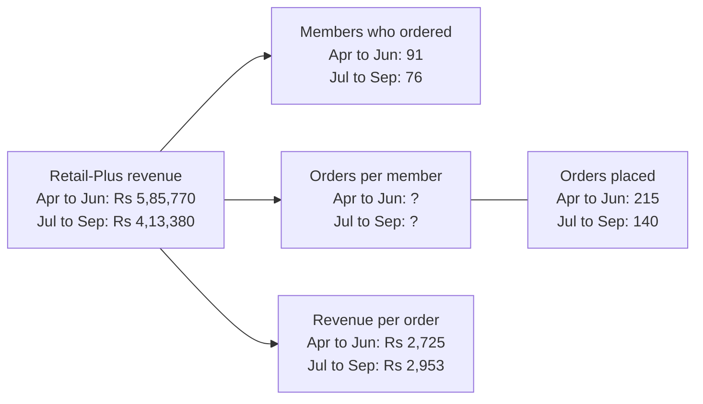
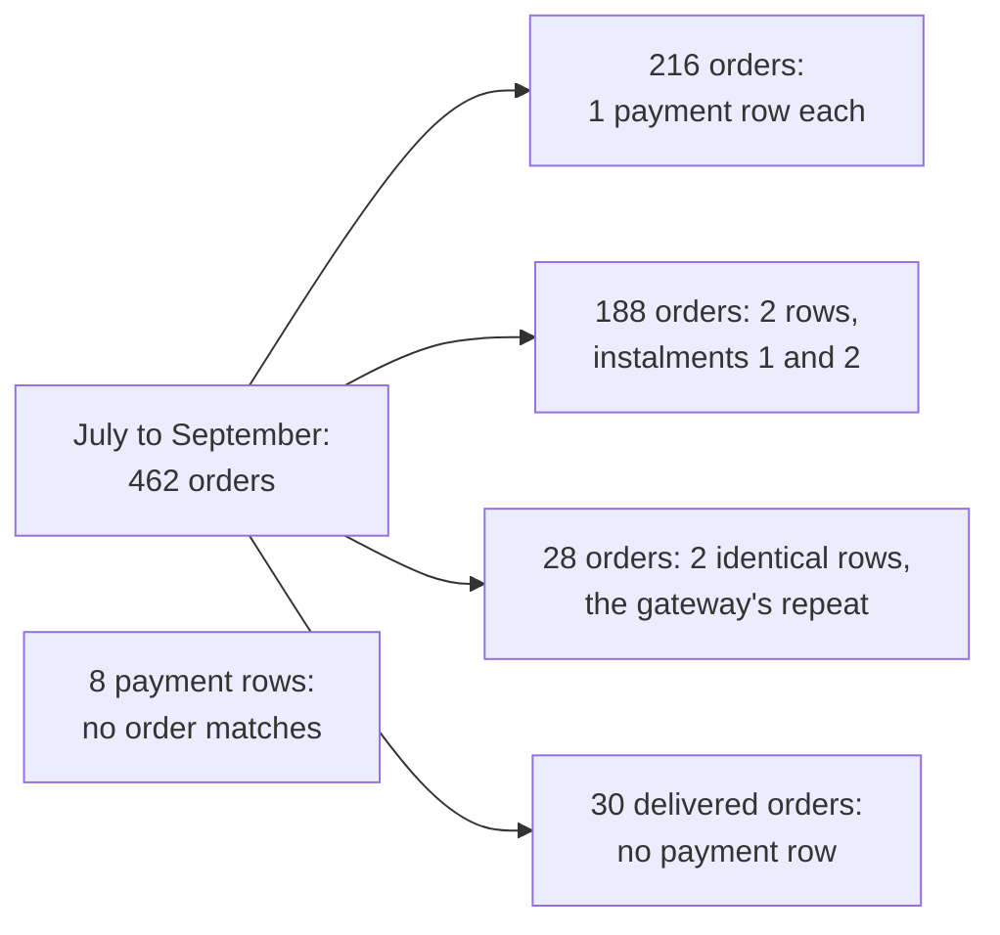
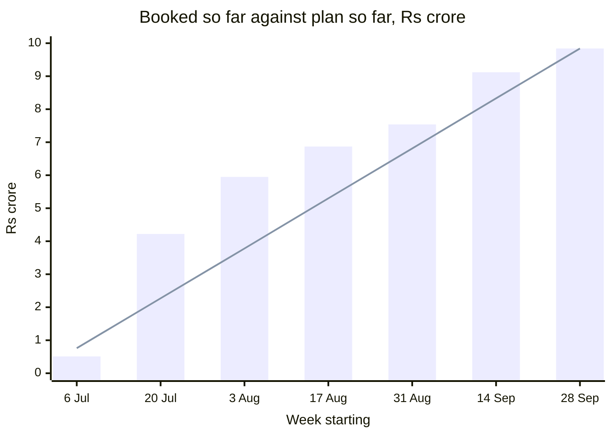
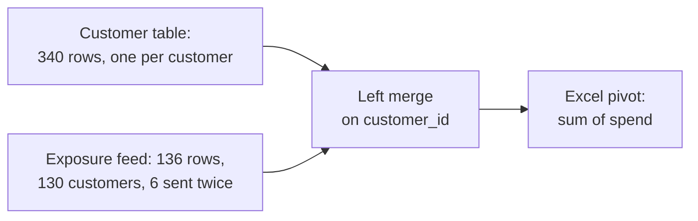
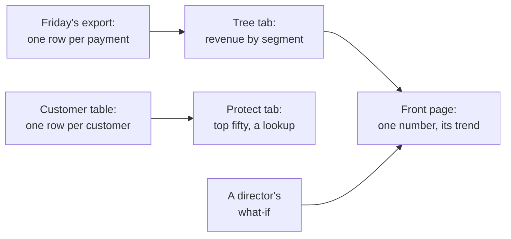

# Week 2 recap paper

Saturday 17 October 2026 · 120 minutes · 35 items in 6 parts · pen and paper, no assistant, no notes

Name: ____________________    Marked by: ____________________    Items right: ____ of 35

## What this paper is for

This week you computed Anand's Monday numbers in the warehouse, set booked revenue against the cash actually collected, drew up Marketing's protect list, built the customer table in pandas and carried it to the leadership deck in Excel. This paper finds which of those decisions you can make cold, with no notes and no assistant: sizing a join before it runs, choosing the rank the business asked for, deciding what leaves when a check fails, and reading a query or a few lines of pandas before anyone acts on what it returns. Some items come from public cases at well-known organisations, and the last part reads the tables an AI team keeps. The room's scores by part, set beside the ratings you give in step one, tell Monday's session where to start.

## How this paper works

- 120 minutes in one sitting. Each part gives its minutes as a guide, not a limit.
- Every item names its format beside its number: circle one letter, circle every correct letter, write T or F, write a letter from a word bank or a match table, write the word or number, show the working, or write the letters in order.
- Every item also names its level, easy, medium or hard, so you can plan your time. A hard item is several steps on an exhibit, never an obscure fact.
- A wrong answer costs nothing, so answer every item on the line under it.
- Pen and this paper only: no laptop, no phone, no notes and no assistant.
- Afterwards the papers are swapped and marked against the key, and the discussion takes the items the room missed most. The paper is ungraded and ranks nobody; the room's rates by part and by tag set Monday's revision.
- Parts 1 to 4 and the workbook in Part 5 are set inside Kalpa Retail, the fictional company of Weeks 1 and 2: Anand Iyer is its finance controller, Kavya Nair its senior analyst and Meera Raghavan its CEO, and the head of Retail-Plus, the data platform lead and Meera's chief of staff are named by role. Six items draw on public cases at Facebook, Public Health England, genomics journals, an economics paper, JPMorgan and Uber, each with its source beside it. Part 6 imagines the AI team of a food-delivery company, and its tables and numbers are illustrative. Every number an item needs is on the page.

## Step one, before Part 1

Before you read any item, rate yourself from 1 to 4 on each part in the table below, as you are today. The comparison between your rating and your score in each part is the most useful thing this paper produces for Monday.

- 1: I have not used this
- 2: I can follow it when someone shows me
- 3: I can do it alone on a small problem
- 4: I can find and fix mistakes in someone else's version

Your ratings: Part 1 ___ · Part 2 ___ · Part 3 ___ · Part 4 ___ · Part 5 ___ · Part 6 ___

## The paper at a glance

| Part | What it shows | Items | Minutes | Easy | Medium | Hard |
|---|---|---|---|---|---|---|
| 1. Anand's Monday numbers | whether you read a query the way the database runs it, and place each piece of work where it belongs | Q1 to Q6 (6) | 16 | 2 | 2 | 2 |
| 2. Booked against collected | whether you size a join before it runs, order the steps of a reconciliation, and decide what leaves when a check fails | Q7 to Q11 (5) | 20 | 0 | 0 | 5 |
| 3. The protect list and the plan line | whether you rank within a segment by the rule the business set, and read a monthly flag and a plan line before anyone acts | Q12 to Q16 (5) | 17 | 0 | 2 | 3 |
| 4. One row per customer | whether you size a merge, place the guard that stops a double count, and read a pivot that averages or a key that changed on its way in | Q17 to Q22 (6) | 19.5 | 0 | 3 | 3 |
| 5. The last mile, and spreadsheets in public | whether you match each workbook job to the technique that does it, and work a spreadsheet error through before the room sees it | Q23 to Q29 (7) | 22 | 0 | 4 | 3 |
| 6. Read the code, read the data: an AI team's tables | whether you catch the week's traps in the tables an AI team keeps, from evaluation runs to an assistant's logs | Q30 to Q35 (6) | 22.5 | 0 | 1 | 5 |
| Total | | 35 | 117 | 2 | 12 | 21 |

---

## Part 1. Anand's Monday numbers (Q1 to Q6)

*What it shows: whether you read a query the way the database runs it, and place each piece of work where it belongs. 6 items, about 16 minutes.*

Anand Iyer, Kalpa Retail's finance controller, keeps the books every revenue figure has to match. Every Monday he wants revenue, orders and customers for each segment, the groups Kalpa sells to (Business, Retail-Core, Retail-Plus, which is the paid-membership tier, and Student), and for each channel (app, web and store). His words: "Compute them from the warehouse itself. No notebooks, no exports, nothing a person can mistype." The warehouse is the company's central Postgres database, and his analyst audits every query line by line. It stores Kalpa's first quarter, April to June, as quarter 'Q1' and its second, July to September, as 'Q2'.

**Exhibit 1A.** The Retail-Plus branch of Anand's revenue tree, as the warehouse holds it: revenue is members who ordered, times orders per member, times revenue per order.



#### Q1 · Hard · show the working, then the answer · Predict and read the leaf

Anand's analyst fills the missing leaf with SELECT quarter, count(*) / count(DISTINCT customer_id) FROM rp_orders GROUP BY quarter, where rp_orders holds the Retail-Plus orders above. What does the query print for each quarter, what are the true figures, and how did orders per member change from the first quarter to the second? Show the working.

Working:

Answer: ____________________

#### Q2 · Medium · write the letters in order · Order the clauses

Put the clauses in their logical execution order.

a) SELECT
b) WHERE
c) FROM
d) ORDER BY
e) GROUP BY
f) HAVING

Order: ____________________

**Word bank 1.** Write the letter of the word or phrase that completes each statement. Each is used once at most, and some are not used.

| Letter | Word or phrase |
|---|---|
| a | sort |
| b | CTE |
| c | view |
| d | guarantee |
| e | subquery |

#### Q3 · Easy · write the letter from Word bank 1 · Complete the LIMIT rule

Without ORDER BY, the database makes no ____ about which five rows LIMIT 5 returns.

Answer: ____________________

#### Q4 · Easy · write the letter from Word bank 1 · Complete the WITH rule

A named query step introduced by the keyword WITH is called a ____.

Answer: ____________________

#### Q5 · Medium · circle one letter · Place the first look

On Monday afternoon the head of Retail-Plus asks the analyst for a chart of orders per member, week by week across both quarters, to see how the figure moved before anyone decides what to report. With Anand's rule in mind, where should that work happen?

a) In the Monday suite as a saved query, since Anand's rule covers every number anyone looks at
b) In a notebook that reads the warehouse, since a first look reports no number to anyone
c) In a workbook built from Monday's export, since weekly charts are what Excel does best
d) Nowhere yet, since a chart of a figure Finance has not defined will mislead its readers

**Exhibit 1B.** Five illustrative people who played a video and the seconds each watched, with the average Facebook defined and the one it calculated (TechCrunch, 2016).

```sql
WITH viewers (viewer_id, seconds) AS (VALUES
    (1, 2.0), (2, 14.0), (3, 1.0), (4, 9.0), (5, 4.0))
SELECT round(sum(seconds) / count(CASE WHEN seconds >= 3 THEN 1 END), 1) AS calculated,
       round(sum(seconds) / count(*), 1)                                AS defined
FROM viewers;
```

#### Q6 · Hard · circle one letter · Size the overstatement

In 2016 Facebook told advertisers that it had defined the average duration of video viewed as the total time spent watching a video divided by the number of people who played it, and had calculated it by dividing by only the people who watched for three seconds or more (TechCrunch, 2016). The query above rebuilds both on five illustrative viewers. What does it return, and by how much does the calculated average overstate the defined one?

a) It returns 10.0 and 6.0, so the calculated average is about 40 percent too high
b) It returns 9.0 and 6.0, so the calculated average is 50 percent too high
c) It returns 6.0 and 6.0, so the two versions agree on these five viewers
d) It returns 10.0 and 6.0, so the calculated average is about 67 percent too high

---

## Part 2. Booked against collected (Q7 to Q11)

*What it shows: whether you size a join before it runs, order the steps of a reconciliation, and decide what leaves when a check fails. 5 items, about 20 minutes.*

Booked revenue is the value of the orders customers placed; collected revenue is the cash that actually arrived for them. The two differ when an order is never paid, when a large invoice is paid in two instalments (two payments against one order), or when the payment gateway records one payment twice. Anand asks: "Show me, order by order, what we actually collected against what we booked from July to September. If there is a gap, I want to know which orders and which channel." A reconciliation is the written account of every rupee between the two figures.

### Set 1

**Situation.** The quarter from July to September, stored as quarter 'Q2', holds 462 orders booked at Rs 9,84,00,000. In the payments feed, 216 of them have one payment row; 188 have two rows, instalments 1 and 2 of one invoice; 28 have two identical rows, because the gateway posted instalment 1 twice; and 30 delivered orders have no payment row at all. Eight further payment rows carry an order_id that no order has.

**Exhibit 2A.** The quarter's orders by their payment rows, as the situation describes them.



**Exhibit 2B.** The first query in Anand's report, run before any rupee is summed.

```sql
SELECT count(*)                   AS rows_out,
       count(DISTINCT o.order_id) AS orders,
       count(p.payment_id)        AS payment_rows
FROM   orders o
LEFT   JOIN payments p ON p.order_id = o.order_id
WHERE  o.quarter = 'Q2';
```

#### Q7 · Hard · circle one letter · Size the join first

Before the report goes to Anand, the analyst sizes the join by hand. What will the query above return?

a) 462, 462 and 432
b) 678, 462 and 648
c) 678, 462 and 678
d) 686, 470 and 656

#### Q8 · Hard · write the letters in order · Order the report's steps

Five of these six steps make Anand's collected-revenue report, and one would spoil it. Leave that step out, and write the other five in the order they must run.

a) Send booked, collected and the gap to Anand, channel by channel
b) LEFT JOIN the quarter's 462 orders to the payments on order_id
c) Check that the join returned 462 rows and that the gap equals the unpaid orders' booked value
d) Drop every order that has two payment rows, since those are the gateway's double posts
e) Keep one payment row for each order and instalment number
f) Sum the payment rows to one collected figure for each order

Order: ____________________

**Exhibit 2C.** The analyst's query, with three of the quarter's orders and their payment rows written into it.

```sql
WITH orders (order_id, amount) AS (VALUES
    ('O-1', 1200), ('O-2', 800), ('O-3', 500)),
payments (order_id, paid_date, paid) AS (VALUES
    ('O-1', DATE '2026-07-04', 600), ('O-1', DATE '2026-08-04', 600),
    ('O-2', DATE '2026-10-01', 800))
SELECT count(*) AS rows_out, sum(o.amount) AS booked
FROM orders o
LEFT JOIN payments p ON p.order_id = o.order_id
WHERE p.paid_date BETWEEN DATE '2026-07-01' AND DATE '2026-09-30';
```

#### Q9 · Hard · circle one letter · Run the query by hand

Anand wants every order of the quarter beside what was collected on it within the quarter, so the analyst adds a date filter on the payments. Before the report goes to him, the analyst runs the query above to count its rows and their booked value. What does it return?

a) 1 row, booked Rs 1,200
b) 2 rows, booked Rs 2,400
c) 3 rows, booked Rs 2,900
d) 4 rows, booked Rs 3,700

**Exhibit 2D.** Suppose these are the report's figures by channel at the end of a later reporting day; the figures are illustrative. Rows out of the join, 462, and booked, Rs 9,84,00,000, both match their sources.

| Channel | Booked, Rs | Collected, Rs | Unpaid orders' booked value, Rs |
|---|---|---|---|
| App | 4,25,90,270 | 4,25,82,150 | 8,120 |
| Store | 3,21,48,730 | 3,11,90,920 | 9,57,810 |
| Web | 2,36,61,000 | 2,28,50,250 | 7,89,000 |

#### Q10 · Hard · circle one letter · Decide what leaves tonight

It is the end of the reporting day, and Anand expects the report tonight. In each channel the gap, booked less collected, should equal the unpaid orders' booked value. What do you send?

a) Booked and collected for every channel, with any unexplained gap added to that channel's unpaid list
b) Booked for every channel, collected for app and web, and store's collected held back
c) Booked for every channel, collected for app and store, and web's collected held back
d) Booked for every channel, with all collected held back until every bridge closes

**Exhibit 2E.** Suppose one day's files from three labs looked like this; the counts are illustrative. An .xls sheet holds 65,536 rows, one of them the header.

| Lab file | Records in the lab's CSV | Data rows in the .xls sheet | Rows loaded | Rows loaded the day before |
|---|---|---|---|---|
| Lab A | 41,200 | 41,200 | 41,200 | 39,850 |
| Lab B | 70,900 | 65,535 | 65,535 | 61,020 |
| Lab C | 12,480 | 12,480 | 12,480 | 13,110 |

#### Q11 · Hard · circle every correct letter · Choose the checks

In October 2020 Public Health England found that 15,841 positive COVID-19 cases from 25 September to 2 October had been left out of the daily figures, because some files had exceeded the maximum size the load could take (GOV.UK, 2020). The labs' CSV files had been converted to the older .xls format, and records past its limit were "simply left off and not counted when imported" (The Register, 2020). Which of these checks, run on every file, would have stopped Lab B's file on the day in the table? Mark every correct option.

a) Compare rows loaded with data rows in the .xls sheet, and stop the file when they differ
b) Compare rows loaded with records in the lab's CSV, and stop the file when they differ
c) Remove duplicate rows from each file before it is loaded, so that no case counts twice
d) Stop any file whose sheet holds exactly 65,535 data rows, the most the format allows
e) Stop any file whose rows loaded fall below that lab's rows loaded the day before

---

## Part 3. The protect list and the plan line (Q12 to Q16)

*What it shows: whether you rank within a segment by the rule the business set, and read a monthly flag and a plan line before anyone acts. 5 items, about 17 minutes.*

Retail-Plus is Kalpa's paid-membership tier, and Marketing will offer a retention benefit to the members it most wants to keep: "Give us the top fifty customers in each segment by revenue for July to September, and flag anyone whose monthly spend has fallen for two months running." That list is the protect list. The head of Retail-Plus sets one rule for it: "If two members spent the same, rank them the same. Keep every member who spent at least as much as the fiftieth, and nobody who spent less." Meera also wants the quarter's revenue to build up week by week against the plan line, the revenue the growth plan expects by the end of each week.

### Set 2

**Situation.** Retail-Plus had 76 members who ordered from July to September. Sorted by their revenue for the quarter, highest first, the top 45 each spent a different amount, all above Rs 3,600, and rows 46 to 53 are in the table. The protect list keeps the members numbered 50 or better.

**Exhibit 3A.** Retail-Plus members in rows 46 to 53 when sorted by the quarter's revenue, highest first, with tied members in order of their ids.

| Row, highest revenue first | Member | Revenue, July to September, Rs |
|---|---|---|
| 46 | C-0162 | 3,600 |
| 47 | C-0264 | 3,540 |
| 48 | C-0189 | 3,480 |
| 49 | C-0206 | 3,480 |
| 50 | C-0185 | 3,350 |
| 51 | C-0242 | 3,350 |
| 52 | C-0259 | 3,200 |
| 53 | C-0252 | 3,150 |

#### Q12 · Hard · circle one letter · Count what each rule ships

The analyst computes RANK(), DENSE_RANK() and ROW_NUMBER() over the quarter's revenue, highest first, and keeps the members numbered 50 or better under each. How many members does each keep?

a) 51, 52 and 50
b) 51, 51 and 50
c) 50, 51 and 50
d) 52, 51 and 50

#### Q13 · Medium · circle one letter · Follow the head's rule

Which list follows the rule the head of Retail-Plus set?

a) DENSE_RANK, keeping every member ranked 50 or better
b) ROW_NUMBER with member id as tiebreaker, keeping rows 1 to 50
c) RANK, keeping every member ranked 50 or better
d) ROW_NUMBER on revenue alone, keeping rows 1 to 50

#### Q14 · Medium · circle one letter · Choose the approach

Marketing's first protect list sorted every customer by revenue for July to September and kept the top fifty: 35 Business customers, 11 Retail-Plus members, 4 Retail-Core customers and no Student, because Business carries 99 percent of the quarter's revenue. For a pilot, Marketing now wants the top three customers in each segment. Which approach answers it?

a) GROUP BY segment with LIMIT 3, which applies the limit to each group in turn
b) A rank within PARTITION BY segment, which an outer query keeps at 3 or better
c) ORDER BY revenue DESC with LIMIT 3, which returns the top rows of each segment
d) HAVING count(*) <= 3, which keeps the three largest rows inside each group

**Exhibit 3B.** Four Retail-Plus members' monthly spend in rupees; a blank month had no order, so member_month has no row for it.

| Member | Apr | May | Jun | Jul | Aug | Sep |
|---|---|---|---|---|---|---|
| C-0161 | 3,520 |  |  | 4,200 | 3,100 | 1,900 |
| C-0171 |  | 2,210 | 4,130 | 3,800 | 2,600 | 1,400 |
| C-0185 | 3,880 | 6,990 | 2,690 | 1,900 |  | 1,450 |
| C-0216 |  | 6,440 |  | 4,300 |  | 2,540 |

#### Q15 · Hard · circle one letter · Run the falling flag

The falling flag reads member_month, one row per member per month with an order. It takes prev1 = LAG(spend, 1) and prev2 = LAG(spend, 2), each partitioned by member and ordered by month, and flags a member whose September spend is below prev1 while prev1 is below prev2. Marketing will call every member the flag names and say that their spend fell in both August and September. How many calls does Marketing make, and how many of them say something untrue?

a) 2 calls, and both of them true
b) 3 calls, and one of them untrue
c) 4 calls, and two of them untrue
d) 4 calls, and all of them true

**Exhibit 3C.** Revenue booked so far in the quarter against the plan so far, at the end of every other week: the bars are booked, the line is plan, and the table gives both.



| Week starting | 6 Jul | 20 Jul | 3 Aug | 17 Aug | 31 Aug | 14 Sep | 28 Sep |
|---|---|---|---|---|---|---|---|
| Booked so far | 0.51 | 4.22 | 5.95 | 6.87 | 7.54 | 9.12 | 9.84 |
| Plan so far | 0.76 | 2.27 | 3.78 | 5.30 | 6.81 | 8.33 | 9.84 |

#### Q16 · Hard · circle one letter · Read the plan line

Meera's chief of staff wants one line about the plan for Monday's front page, and the figures above are all there is. Which line do they support?

a) Level with plan at the close, having given back the lead it built in July
b) Well ahead of plan at the close, keeping most of the lead it built in July
c) Behind plan from mid-August on, after a strong start in the first weeks of July
d) Within a few lakh of plan all quarter, with no lead or shortfall worth a line

---

## Part 4. One row per customer (Q17 to Q22)

*What it shows: whether you size a merge, place the guard that stops a double count, and read a pivot that averages or a key that changed on its way in. 6 items, about 19.5 minutes.*

Marketing chooses who gets which offer from one table with one row per customer: recency (days since the last order), frequency (orders placed) and monetary value (rupees spent), with the customer's segment and whether the monsoon sale reached them. The data platform lead: "The warehouse queries are fine for Finance, but Marketing's analysts live in Python. Build them the table in pandas, from the warehouse, and make it refreshable in one run." It is rebuilt every Monday, and Kavya Nair, the senior analyst, reviews it before it leaves the team: "Show me the evidence, and do it a second way."

### Set 3

**Situation.** The customer table has 340 rows, one per customer, and its spend column adds up to the book's Rs 19,84,00,000 for both quarters. The monsoon sale's exposure feed, which lists the customers the sale reached, holds 136 rows for 130 customers, because six customers were sent a second time on 11 August. The analyst merges the feed onto the table with how='left' and sends the result to Excel, where a pivot sums spend.

**Exhibit 4A.** Monday's refresh, as the situation describes it.



#### Q17 · Medium · write the word or number · Size the merge

How many rows does the merged table hold?

Answer: ____________________

#### Q18 · Medium · circle one letter · Judge the claim

The analyst tells Marketing: "The pivot's grand total will equal the book's Rs 19,84,00,000." True or false, and why?

a) True, because a left merge keeps the 340 customers and adds no spend
b) True, because the pivot sums spend by customer_id, so each counts once
c) False, because the 210 customers the sale never reached drop out
d) False, because the six customers sent twice sit on two rows each

#### Q19 · Medium · circle every correct letter · Place the guards

Which of these, added to Monday's refresh, would have stopped the run before the pivot was built? Mark every correct option.

a) validate='one_to_one' on the merge itself, so a repeated key stops it
b) drop_duplicates() on the merged table, before it goes to Excel
c) indicator=True on the merge, with the rows then counted by _merge
d) how='inner' in place of how='left', so only reached customers remain
e) an assert that the merged table has as many rows as the customer table

**Exhibit 4B.** Suppose next Monday the campaign tool sends the same feed newest first; these are its rows for three customers, in the feed's three columns and in the order it sends them.

| customer_id | campaign_id | exposed_date |
|---|---|---|
| C-0001 | CMP-MONSOON-26 | 2026-08-11 |
| C-0002 | CMP-MONSOON-26 | 2026-08-11 |
| C-0001 | CMP-MONSOON-26 | 2026-08-03 |
| C-0002 | CMP-MONSOON-26 | 2026-08-03 |
| C-0012 | CMP-MONSOON-26 | 2026-08-03 |

#### Q20 · Hard · circle one letter · Apply the rule

Marketing's rule is one exposure per customer, the first by date. Which step applies it, so that the table sent to Excel has one row per customer carrying each customer's first exposure?

a) Drop the rows that repeat in every column, which removes each customer's second send
b) Keep each customer's first row as the file lists it, which is that customer's first send
c) Merge first, then drop merged rows whose customer_id repeats, keeping the first of each
d) Sort by exposed_date from the earliest, then keep each customer's first row

**Exhibit 4C.** The analyst's months view for the head of Retail-Plus, on four illustrative orders.

```python
import pandas as pd
plus = pd.DataFrame({
    "member": ["M1", "M1", "M1", "M2"],
    "month":  ["Jun", "Jun", "Jul", "Jun"],
    "amount": [3000, 1000, 2400, 1800]})
wide = plus.pivot_table(index="member", columns="month", values="amount")
long = wide.reset_index().melt(id_vars="member", value_name="amount")
print(wide.loc["M1", "Jun"], len(long), long["amount"].sum())
```

#### Q21 · Hard · circle one letter · Predict the months view

The head of Retail-Plus wants one row per member and one column per month, to read who is drifting, and a long copy of the same view for a trend chart. What does the code above print?

a) 4000.0 4 8200.0
b) 2000.0 4 6200.0
c) 2000.0 3 6200.0
d) 4000.0 3 8200.0

**Exhibit 4D.** A lab's gene list after a trip through Excel, with illustrative values; the conversions are the ones Ziemann and colleagues documented (Genome Biology, 2016).

```python
import pandas as pd
lab = pd.DataFrame({"symbol": ["TP53", "2-Sep", "BRCA1", "1-Mar"],
                    "fold_change": [2.1, 0.4, 1.8, 3.2]})
ref = pd.DataFrame({"symbol": ["TP53", "SEPT2", "BRCA1", "MARCH1", "EGFR"],
                    "panel": ["A", "B", "A", "C", "B"]})
m = lab.merge(ref, on="symbol", how="left", indicator=True)
print(len(m), (m["_merge"] == "left_only").sum())
```

#### Q22 · Hard · circle one letter · Predict the merge

Gene symbols are the short names genes go by in papers and databases, and before 2020 two of them were SEPT2 and MARCH1. Ziemann and colleagues found that Excel's default settings turned such symbols into dates, SEPT2 into 2-Sep and MARCH1 into 1-Mar, and that about a fifth of genomics papers with Excel gene lists carried such errors (Genome Biology, 2016). In 2020 the body that names human genes renamed the genes Excel turned into dates, so that MARCH1 became MARCHF1 and SEPT1 became SEPTIN1 (Nature Genetics, 2020). The code above merges a lab's list onto a reference table from before the renaming. What does it print, and what should the analyst do?

a) 4 2: two genes lost their annotation, so the list goes back to the lab
b) 4 0: pandas reads 2-Sep and 1-Mar back as symbols, so the analysis goes ahead
c) 5 2: the merge brought in EGFR unmatched, so the analyst drops that extra row
d) 2 0: the merge kept only the matched genes, so the analyst adds the two back

---

## Part 5. The last mile, and spreadsheets in public (Q23 to Q29)

*What it shows: whether you match each workbook job to the technique that does it, and work a spreadsheet error through before the room sees it. 7 items, about 22 minutes.*

Meera's chief of staff builds the deck for Monday's growth review and works only in Excel: "The revenue tree by segment for both quarters, the top-fifty protect list with a lookup so I can find any member by member code, and one number on the front page with its trend. If a director changes an assumption in the room, the sheet must recalculate in front of them." Excel is where analysis meets its audience, so an error made here reaches the room directly, as it has at larger organisations than Kalpa.

**Exhibit 5A.** The chief of staff's workbook for Monday's review, and two rows of Friday's export: one row per payment, with the order's booked amount, order_amount, repeated on each.



| order_id | segment | order_amount | paid_amount |
|---|---|---|---|
| KR-00028 | Business | 6,35,000 | 3,81,000 |
| KR-00028 | Business | 6,35,000 | 2,54,000 |

**Match table 1.** Each numbered row is a job the chief of staff's workbook must do. Write the letter of the technique that does it. Each letter is used once at most, and two are not used.

| Item | To match | Letter | Match |
|---|---|---|---|
| Q23 (Medium) | Find any member by member code, and print a plain message for an unknown code | a | SUBTOTAL with function number 109 |
| Q24 (Medium) | A figure under the protect list that adds only the members a filter to Mumbai leaves on screen | b | VLOOKUP with its fourth argument left out |
| Q25 (Medium) | Revenue by segment from Friday's export, in which an invoice paid in two instalments appears twice | c | a labelled input cell feeding a scenario line |
| Q26 (Medium) | Let a director try Rs 5,00,000 for Retail-Plus in July to September, with the warehouse's figures untouched | d | XLOOKUP with its if_not_found argument set |
|  |  | e | Remove Duplicates across every column |
|  |  | f | a first-row flag per order, then SUMIFS |

Answers: Q23 ____    Q24 ____    Q25 ____    Q26 ____

**Exhibit 5B.** An illustrative sheet with the same kind of error; column B is each country's average growth, in percent, in one debt group.

| Row | A: Country | B: Growth, percent |
|---|---|---|
| 2 | Country 1 | -1.0 |
| 3 | Country 2 | 1.0 |
| 4 | Country 3 | -3.0 |
| 5 | Country 4 | 1.0 |
| 6 | Country 5 | 5.0 |
| 7 | Country 6 | 3.0 |
| 8 | Average | =AVERAGE(B2:B5) |

#### Q27 · Hard · show the working, then the answer · Reproduce the average

In 2013 Herndon, Ash and Pollin rebuilt an influential 2010 paper by Reinhart and Rogoff from the authors' own working spreadsheet. They reported that a coding error "entirely excludes five countries, Australia, Austria, Belgium, Canada, and Denmark, from the analysis", because the averages covered lines 30 to 44 of the sheet instead of lines 30 to 49 (PERI working paper 322, 2013). The sheet above makes the same kind of error. What does B8 return, what should it return, and what does the error do to the reading of growth? Show the working.

Working:

Answer: ____________________

**Exhibit 5C.** Illustrative rates; the formula's mistake is the one JPMorgan's task force reported (JPMorgan Chase, 2013).

| Row | Old rate, column B | New rate, column C | The sheet's change, column D |
|---|---|---|---|
| 2 | 2.00 | 2.60 | =(C2-B2)/(B2+C2) |
| 3 | 3.00 | 2.40 | =(C3-B3)/(B3+C3) |
| 4 | 1.50 | 1.80 | =(C4-B4)/(B4+C4) |

#### Q28 · Hard · circle one letter · Check the formula

JPMorgan's task force on the 2012 losses in its Chief Investment Office reported that a value-at-risk model, an estimate of how much a trading book can lose on a bad day, ran through Excel spreadsheets filled by copying and pasting, and that one step divided a change in rates by the sum of the old and new rates where the modeller meant their average (JPMorgan Chase, 2013). Work out column D for the three rows and the change the modeller meant. What does the sheet do to the model's picture of risk?

a) Every change comes out twice its size, so the model braces for moves that never come
b) Every change comes out at half its size, so the model understates how far rates move
c) Only the falling rate in row 3 comes out wrong, because the formula assumes a rise
d) No change comes out wrong, because dividing by the sum is an accepted way to scale

**Exhibit 5D.** Three illustrative trips and the commission charged on each at 25 percent of the gross fare (CBS News, 2017).

| Trip | Gross fare, dollars | Sales tax and fees, dollars | Commission charged, dollars |
|---|---|---|---|
| 1 | 30.00 | 2.40 | 7.50 |
| 2 | 20.00 | 1.60 | 5.00 |
| 3 | 44.00 | 4.00 | 11.00 |

#### Q29 · Hard · show the working, then the answer · Size the overcharge

In 2017 Uber said it had been taking its commission from New York City drivers on the gross fare, before sales tax and other fees were deducted, where it should have used the fare after them, and that it would repay affected drivers about 900 dollars each on average (CBS News, 2017). The commission rate on these trips is 25 percent. How much commission did the three trips overcharge the driver, and what share of the commission charged is that? Show the working.

Working:

Answer: ____________________

---

## Part 6. Read the code, read the data: an AI team's tables (Q30 to Q35)

*What it shows: whether you catch the week's traps in the tables an AI team keeps, from evaluation runs to an assistant's logs. 6 items, about 22.5 minutes.*

The same mistakes turn up well beyond retail. Suppose a food-delivery company runs a support assistant, a chatbot that answers customers and hands hard cases to a person. Its AI team scores each model version on a fixed set of test tickets, which is an evaluation run; it collects customers' ratings of the replies; and it logs every conversation, every handoff to a person and every visit. The tables and every number below are illustrative.

**Exhibit 6A.** The assistant team's tables, as this part imagines them.

| Table | One row per | Columns |
|---|---|---|
| predictions | test ticket | ticket, pred |
| labels | label from the annotation vendor | ticket, label |
| eval_runs | evaluation run | model, run_id, finished_on, accuracy |
| replies | reply to a customer | reply_id, model, rating |
| conversations | conversation | conversation_id |
| handoffs | handoff to a person | conversation_id |
| calls | call to the model | call_id, day, tokens |
| visits | a user's use of the assistant on a day | day, user_id |

**Exhibit 6B.** The team's scoring code, on five illustrative test tickets.

```python
import pandas as pd
preds = pd.DataFrame({"ticket": ["T1", "T2", "T3", "T4", "T5"],
                      "pred": ["refund", "late", "refund", "late", "other"]})
labels = pd.DataFrame({"ticket": ["T1", "T2", "T3", "T4", "T5", "T3", "T5"],
                       "label": ["refund", "late", "late", "late", "refund",
                                 "late", "refund"]})
m = preds.merge(labels, on="ticket")
print(len(m), round((m["pred"] == m["label"]).mean(), 2))
```

#### Q30 · Hard · circle one letter · Predict the accuracy

The team scores a model that sorts support tickets into refund, late and other against labels from an annotation vendor, and ships a model only if it scores 0.5 or better. The vendor re-sent a batch, so two tickets carry their label twice. What does the code above print?

a) 5 0.6
b) 7 0.6
c) 7 0.43
d) 7 0.71

**Exhibit 6C.** The table eval_runs: the team's evaluation runs, illustrative. Run ids are issued in the order runs start.

| model | run_id | finished_on | accuracy |
|---|---|---|---|
| bot-a | r1 | 1 September | 0.81 |
| bot-a | r2 | 8 September | 0.78 |
| bot-b | r3 | 2 September | 0.84 |
| bot-b | r4 | 9 September | 0.86 |
| bot-b | r5 | 9 September | 0.79 |

#### Q31 · Hard · circle one letter · Choose the query

The leaderboard must show one row per model, its latest run and that run's accuracy, and must show the same row every morning. Two of bot-b's runs finished on 9 September. Which query does that?

a) GROUP BY model, keeping max(finished_on) beside max(accuracy), each taken over all of that model's runs
b) ROW_NUMBER partitioned by model and ordered by finished_on descending, keeping row 1 for each model
c) RANK partitioned by model and ordered by finished_on descending, keeping every row that ranks 1 for its model
d) ROW_NUMBER partitioned by model, ordered by finished_on descending, then run_id descending, keeping row 1

**Exhibit 6D.** Nine replies, the ratings customers gave them and the analyst's query, illustrative.

```sql
WITH replies (reply_id, model, rating) AS (VALUES
    (1, 'bot-a', 1), (2, 'bot-a', 4), (3, 'bot-a', 2), (4, 'bot-a', 2),
    (5, 'bot-b', 2), (6, 'bot-b', 5), (7, 'bot-b', 4),
    (8, 'bot-c', 5), (9, 'bot-c', 1))
SELECT model, count(*) AS low_rated
FROM replies
WHERE rating <= 2
GROUP BY model
HAVING count(*) >= 3;
```

#### Q32 · Hard · circle one letter · Predict the rows

Customers rate each reply from 1 to 5. The team lead asks for every model with at least three replies this week, beside how many of its replies were rated 2 or below. What does the query above return?

a) bot-a 3 alone, which misses bot-b and its three replies
b) bot-a 3 and bot-b 1, the two models the lead asked about
c) bot-a 4 and bot-b 3, the replies each model had in total
d) bot-a 3, bot-b 1 and bot-c 1, a row for every model

**Exhibit 6E.** Four conversations and the handoff log, illustrative.

```sql
WITH conversations (conversation_id) AS (VALUES ('c1'), ('c2'), ('c3'), ('c4')),
handoffs (conversation_id) AS (VALUES ('c2'), ('c4'), (NULL))
SELECT count(*) AS resolved_by_bot
FROM conversations
WHERE conversation_id NOT IN (SELECT conversation_id FROM handoffs);
```

#### Q33 · Hard · circle one letter · Predict the count

The weekly review reads how many conversations the assistant resolved without a person. This week the handoff log gained a row whose conversation_id is NULL. What does the query above return, and what will the review conclude?

a) 2, counting c1 and c3, so the review sees half the conversations resolved
b) 3, counting the NULL row as one more, so the review sees three of four resolved
c) 0, so the review concludes the assistant resolved nothing on its own
d) An error, so the review gets no figure until someone removes the NULL row

**Exhibit 6F.** Four model calls and the tokens each used, illustrative.

```sql
WITH calls (call_id, day, tokens) AS (VALUES
    (1, DATE '2026-09-21', 400), (2, DATE '2026-09-22', 300),
    (3, DATE '2026-09-22', 500), (4, DATE '2026-09-23', 200))
SELECT call_id, sum(tokens) OVER (ORDER BY day) AS tokens_so_far
FROM calls
ORDER BY call_id;
```

#### Q34 · Hard · circle one letter · Predict the running total

The model's bill is charged per token, so the finance partner wants tokens used so far, call by call, to watch the bill build up. What does tokens_so_far read for calls 1 to 4?

a) 400, 1200, 1200 and 1400
b) 400, 700, 1200 and 1400
c) 1400, 1400, 1400 and 1400
d) 400, 900, 1200 and 1400

**Exhibit 6G.** One week of the visits log, illustrative: the users who opened the assistant on each day.

| Day | Mon | Tue | Wed | Thu | Fri | Sat | Sun |
|---|---|---|---|---|---|---|---|
| Users | U1, U2, U3 | U1, U4 | U2, U3, U5 | U1, U2 | U3, U4, U6 | U1 | U2, U6 |

#### Q35 · Medium · circle one letter · Count the week's users

The product manager wants the week's active users for the deck. Which number goes on the slide?

a) 16
b) 2.3
c) 3
d) 6

---

## Stretch: untimed, and not marked

For anyone who finishes early. Nothing here is counted; each item is the kind an interviewer asks after your first answer, so write the answer you would say.

### Stretch 1

Anand now wants collected revenue week by week instead of for the whole quarter. Which date decides the week a rupee is collected in, and what happens to an order paid in two instalments?

### Stretch 2

Marketing wants each Retail-Plus member's share of the tier's revenue beside the member's own revenue, in one query and without a join. What would you write, and how would you check it?

### Stretch 3

Explain the gene-name case to a product manager in two sentences: why did the fix go into the gene names, and what would you still check in every file you receive?

### Stretch 4

A director says the front page should read Rs 19.84 crore because "that is the real number". Answer in two sentences.
