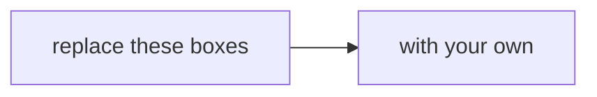

# Translation worksheet: how does Dr Menon's question map onto the method you already own?

Copy this file into your group's repository as `translation.md` and fill it in together, in your own
words. Nobody will hand you the mapping from your question to a Weeks 1 and 2 move: making it is Monday's
work.

**Group:** ______ **Sub-problem:** ______ **Members:** ______

**Who needs the answer.** Your group first, since every hour of Wednesday and Thursday is spent on
the plan this page fixes. Then the panel: the mini project's first criterion, the question
translated, is worth 8 of its 40 marks and is scored on this mapping. And Dr Menon, who acts on
whatever your plan measures, right or wrong.

**The questions on the way.** What exactly is your stakeholder asking? Which move from Weeks 1 and 2
answers it, and which way from your brief leads? Which Kalpa Health words map onto Kalpa Retail's,
and where does the map break? What are your first three moves? What does a wrong answer cost here?
What will you do this week, and what will you not do?

---

## What has Dr Menon asked, and which five questions do her heads put?

**Who needs the answer.** Every member, before Part 1. Each part below starts from your
stakeholder's exact words, so the words are on this page.

**The questions on the way.** What is Kalpa Health? What does Dr Menon see? Which question is yours?

Kalpa Health, a fictional unit of Kalpa Group, runs a laboratory, which runs the tests, and two
patient service centres, where a phlebotomist draws patients' blood, in each of six US metro areas:
Dallas, Phoenix, New York, Chicago, Atlanta and Philadelphia; patients book at all eighteen sites. It bills its patients' payers in dollars: commercial health plans,
Medicare, Medicaid and patients who pay for themselves. Its analytics and revenue-cycle work runs
from Kalpa's GCC in Bengaluru, where you are trainee engineers. Q2 is April to June 2026 and Q3 is
July to September 2026. The chief operating officer (COO), Dr Priya Menon, writes: "My dashboard says test
volumes grew 5 percent from Q2 to Q3. The plan the board approved asks for 18. Which branch of my
business is short, and what do I do next?" By a branch she means one of the parts the business splits
into, such as a payer, a metro or a kind of test.

| # | Who asks | Their words |
|---|---|---|
| 1 | The finance head | "The board will ask me where the plan's growth went. Where does our lab revenue actually come from, and which branch of it is short?" |
| 2 | The patient service centres' operations head | "Bookings fell in two of our metros in Q3. Before I send a field team or cut staff there, I need to know how far they fell, and why." |
| 3 | The finance head | "The claims we billed say one thing and the posting system says another. Which claims are unpaid, how much money is that, and can I trust the figure I report?" |
| 4 | The patient service centres' operations head | "KH-ATL-03, one of our two Atlanta patient service centres, has the worst no-show rate on my Q3 report. I am being asked to add a receptionist there or close it. Is the centre really worse?" |
| 5 | The marketing head | "Our free at-home collection offer lifted bookings 9 percent. I want to offer it to every patient in all six metros. Can you confirm it worked?" |

Your brief, `briefs/C2_W03_D01_brief_{n}_{name}_STUDENT.md`, adds the terms, the files with their row
counts and the ways a group could answer your question, and the data dictionary,
`briefs/C2_W03_D01_data_dictionary_STUDENT.md`, gives every column.

---

## Part 1. What exactly is your stakeholder asking?

**Who needs the answer.** Your stakeholder, who will judge your work against the question they meant.
A group that answers a neighbouring question, however well, scores nothing on the first criterion.

**The questions on the way.** What number do they quote, and what is it a number of? What are they
comparing? What will they decide? Which word is hardest to count? What will they ask next?

Copy your stakeholder's words from the table above, then take them apart.

> (paste the question here)

| What to find in the words | Your answer |
|---|---|
| The number they quote, and what it is a number of | |
| The comparison they make: which period, which group, against what | |
| The decision they will take on your answer | |
| The word in the question you are least sure how to count, and two ways it could be counted | |
| What they did not ask, and will ask next | |

Now write the question again as one a dataset can answer, in a single sentence: what you will count,
over which rows, for which periods, compared with what.

> (your one sentence)

---

## Part 2. Which move from Weeks 1 and 2 answers it, and which way from your brief leads?

**Who needs the answer.** Your group, which spends the week on the move it names here, and Kavya
Nair, the senior analyst on your team, who asks for the move that checks it.

**The questions on the way.** Which moves does your question call for? Which one leads, and why?
Which of your brief's ways uses it? What would make you switch? What does the Week 1 or 2 picture look
like in Kalpa Health's words?

Everything you need is something you did for Meera Raghavan, Kalpa Retail's CEO, and Anand Iyer,
its finance controller, in Weeks 1 and 2. Mark each move your question calls for and say why in one
sentence. More than one may apply.

| The move | Where you met it | What it does, in one line | Does your question call for it? Why? |
|---|---|---|---|
| The revenue tree | Week 1 Monday | Splits a total into counts and ratios, such as customers times orders per customer times order value, so that the short branch shows | |
| Which total is the number | Week 1 Monday | Names what a total counts, such as booked against delivered, before anyone uses it | |
| The typical value | Week 1 Monday | Sets the median beside the mean and asks why they differ | |
| The investigation ladder | Week 1 Tuesday | Confirms the drop, compares like with like, decomposes, isolates, and only then hypothesises | |
| Profile, clean, reconcile | Week 1 Wednesday | Profiles before touching, decides with reasons in a decisions log, and proves rows in equal rows kept plus rows set aside | |
| Real or noise | Week 1 Thursday | Asks how often luck alone produces a gap this size, with a permutation or binomial check | |
| Cause or coincidence | Week 1 Thursday | Checks that two groups differ only in the thing tested before reading the gap as its effect | |
| The one-page note | Week 1 Thursday | States the claim, its evidence, its caveat and the action | |
| The tree as queries | Week 2 Monday | Runs the revenue tree's counts as SQL on a warehouse | |
| Joins that keep or drop rows | Week 2 Tuesday | Attaches one table to another, counts the rows before and after, explains the difference, and only then sums | |
| Ranks and running totals | Week 2 Wednesday | Ranks within a group and runs a total against a plan, with window functions | |
| One row per entity, a second way | Week 2 Thursday | Builds one row per customer with pandas and reaches the same number by a second route | |
| The pivot and the lookup | Week 2 Friday | Puts the number in a workbook a director can read and cannot break | |

**The move that leads:** ______

**The way from your brief that uses it, and the way that checks it:** ______

**The fact that would make you switch:** ______

**The Week 1 or 2 picture, in Kalpa Health's words.** Draw the picture you drew for Meera or Anand
again, with Kalpa Health's words on every box. Use a Mermaid block so it renders on GitHub.

---

## Part 3. Which Kalpa Health words map onto Kalpa Retail's, and where does the map break?

**Who needs the answer.** Your group, whenever it writes code: a word mapped wrongly gets counted
wrongly, and the count looks right.

**The questions on the way.** Which Kalpa Retail word does each Kalpa Health word replace? Where in
the files does it live? Where does it behave differently? Which Kalpa Health words have no Kalpa
Retail twin at all?

The first three rows come from the curriculum. Add at least five of your own from your brief and the
data dictionary, and fill the last two columns of every row.

| Kalpa Retail | Kalpa Health | Where it lives in the files | What is different about it here |
|---|---|---|---|
| An order | A booking | | |
| An item | A test | | |
| A cancellation | A no-show | | |
| | | | |
| | | | |
| | | | |
| | | | |
| | | | |

Write down how each pair differs, since a word that behaves differently here is the one most likely
to be counted wrong, and give any Kalpa Health word with no twin a row of its own with "none" in the
first column.

---

## Part 4. What are your first three moves, and what result would change the plan?

**Who needs the answer.** Your group on Wednesday morning, when the checkpoint asks what you have
done, and the TAs, who can help a group with a named move far faster than one with a vague plan.

**The questions on the way.** What do you do first, second and third? Which file and which columns
does each move touch? What will you count? What result would make you change course?

Each move names the file, what you will count, and the result that would change your plan. Make the
first move something that checks a number before anything explains it.

| # | The move | File and columns | What you will count | What result would change the plan |
|---|---|---|---|---|
| 1 | | | | |
| 2 | | | | |
| 3 | | | | |

---

## Part 5. What does a wrong answer cost here, and how sure must you be?

**Who needs the answer.** Dr Menon, who acts on your answer, and the patients behind the rows. In
Kalpa Retail a wrong number cost a missed sale or a wasted budget; at a laboratory some wrong numbers
cost a missed diagnosis.

**The questions on the way.** What happens if your answer is wrong one way? What happens if it is
wrong the other way? Which is worse, and what does that change about the evidence you need?

1. If your answer is wrong in one direction, what happens, and to whom?
2. If it is wrong in the other direction, what happens, and to whom?
3. Which of the two is worse here, and what does that change about how sure you need to be before Dr
   Menon acts?

This part is also the interview question the week prepares you for: what changes when the cost of an
error is a missed diagnosis rather than a missed sale?

---

## Part 6. What will you do this week, and what will you not do?

**Who needs the answer.** Your group, which signs it at Monday's close, and the trainer, who pins it
where everyone can see it so that Wednesday's checkpoint can hold you to it.

**The questions on the way.** What will you answer, for whom, by counting what, in which files? What
is the one thing you will not do?

> We will answer ______ for ______, by counting ______ in ______, and we will not ______.

---

## Has your plan passed Kavya's four checks?

**Who needs the answer.** Your group, before the scope is pinned. Kavya Nair checks four things
before any work leaves the team, and a plan that fails one now fails it again in front of the panel.

**The questions on the way.** Does your sentence name its baseline? Does every rate say what it is
out of? Does every move name its evidence? Can you reach your headline number a second way?

Tick each one, or write what is missing.

- [ ] **The baseline.** Your one sentence names what the number is compared with.
- [ ] **The denominator.** Every rate or share in your plan says what it is out of.
- [ ] **The evidence.** Every one of your first three moves names a file and a count.
- [ ] **A second way.** You can say how you would reach your headline number by another route, to
  check it.

**Peer check.** Swap worksheets with a group working on a different sub-problem, run the four checks
on theirs, and write here what they found on yours:

> (what the other group found)

---

## Have you written entry one in the challenges log?

**Who needs the answer.** Your group on Thursday, when the mock interview's viva reads the log, and a
thin log is where a prepared answer breaks.

**The questions on the way.** What stopped your group first today? What did you try? What did you
decide?

Before the close, open `briefs/C2_W03_D01_challenges_log_STUDENT.xlsx` and write entry one: the first
thing today that stopped your group, where it showed, what you tried and what you decided. The
workbook's Example sheet shows the shape. A challenge that needed a cleaning or matching call goes in
the decisions log, `briefs/C2_W03_D01_decisions_log_STUDENT.xlsx`, as well.
