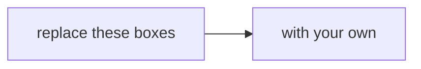

# Translation worksheet: Dr Menon's question in the method you already own

Copy this file into your group's repository as `translation.md` and fill it in together. Write in your
own words. Nobody will hand you the mapping from Kalpa Health to Weeks 1 and 2, because making it is
the whole of Monday's work, and a group that makes it has done the move this week exists to train.

**Group:** ______ **Sub-problem:** ______ **Members:** ______

---

## Part 1. The stakeholder's words

Copy your stakeholder's question from your brief, word for word. Then take it apart.

> (paste the question here)

| What to find in the words | Your answer |
|---|---|
| The number they quote, and what it is a number of | |
| The comparison they are making: which period, which group, against what | |
| The decision they will take on your answer | |
| The word in the question you are least sure how to count | |
| What they did not ask, and will ask next | |

Then write the question again as a question data can answer, in one sentence: what you will count, over
which rows, for which periods, compared with what.

> (your one sentence)

## Part 2. The Weeks 1 and 2 method it maps to

Everything you need is something you did for Meera Raghavan and Anand Iyer in Kalpa Retail. Name the
part of that method your question calls for, and say why. More than one part may apply; say which one
leads.

| The method you own | Where you met it | Does your question call for it? Why, in one sentence |
|---|---|---|
| The revenue tree, every branch a numerator over a denominator | Week 1, Monday | |
| The investigation ladder: confirm, like with like, decompose, isolate, hypothesise | Week 1, Tuesday | |
| Profile, clean and reconcile, with a decisions log: input equals clean plus rejected | Week 1, Wednesday | |
| The chance reference and the fair comparison: could chance do it, and what else differs between the groups | Week 1, Thursday | |
| Claim, evidence, caveat, action | Week 1, Thursday | |
| Joins that fan out or drop rows, and booked against collected | Week 2, Tuesday | |
| One row per entity, and the same number reached a second way | Week 2, Thursday | |

**The part that leads:** ______

**Its Kalpa Retail picture, redrawn for Kalpa Health.** Draw the picture you drew in Week 1 or 2 again,
with Kalpa Health's words on every box. Use a Mermaid block so it renders on GitHub.

## Part 3. The vocabulary map

Kalpa Retail's words are yours already. Kalpa Health uses different ones for things that behave the same
way, and some of its words have no Kalpa Retail twin at all. The first three rows come from the
curriculum; add at least five more of your own, from your brief and the data dictionary.

| Kalpa Retail | Kalpa Health | Where it lives in the files | What is different about it here |
|---|---|---|---|
| An order | A booking | | |
| An item | A test | | |
| A cancellation | A no-show | | |
| | | | |
| | | | |
| | | | |
| | | | |
| | | | |

A pair that behaves the same in both businesses is useful. A pair that behaves differently is where
the week's surprises live, so write the difference down.

## Part 4. The first three moves

What your group does first, before any analysis, in order. Each move names the file, what you will
count, and what result would change your plan.

| # | The move | File and columns | What you will count | What result would change the plan |
|---|---|---|---|---|
| 1 | | | | |
| 2 | | | | |
| 3 | | | | |

## Part 5. The cost of an error

In Kalpa Retail a wrong number cost a missed sale or a wasted budget. Answer these for your question.

1. If your answer is wrong in one direction, what happens, and to whom?
2. If it is wrong in the other direction, what happens, and to whom?
3. Which of the two is worse here, and what does that change about how sure you need to be before Dr
   Menon acts?

## Part 6. The scope, pinned

One sentence the group signs at the close, and the one thing you will not do this week.

> We will answer ______ for ______, by counting ______ in ______, and we will not ______.

---

## Kavya's review, before the scope is pinned

Kavya Nair, the senior analyst on your team, checks four things before any work leaves the team. Tick
each one, or write what is missing.

- [ ] **The baseline.** Your one sentence names what the number is compared with.
- [ ] **The denominator.** Every rate or share in your plan says what it is out of.
- [ ] **The evidence.** Every one of your first three moves names a file and a count.
- [ ] **A second way.** You can say how you would reach your headline number by another route, to check it.

## Your first entry in the challenges log

Before the close, open `C2_W03_D01_challenges_log_STUDENT.xlsx` and write entry one: the first thing
today that stopped your group, what you tried, and what you decided. The workbook's Example sheet shows
the shape.
