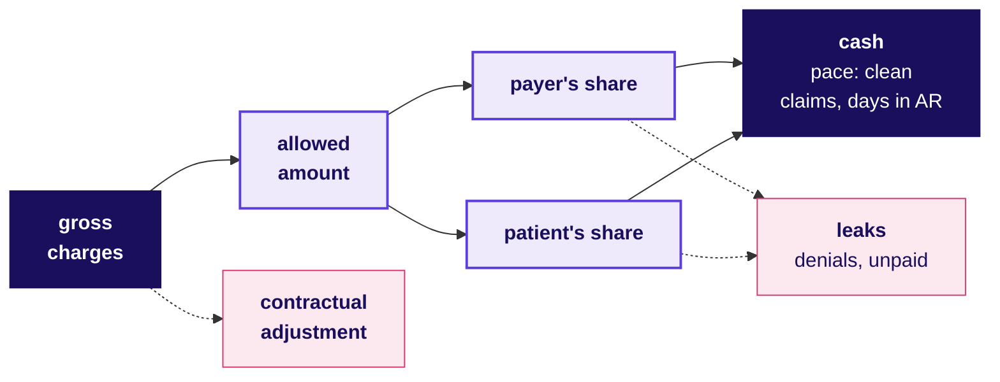

# Domain card: US healthcare at Kalpa Health

Kalpa Health, Build 1. The charge-to-cash tree, ten metrics as formulas, twenty words a revenue-cycle meeting assumes, and the rules a US lab's data team works under. Kalpa is fictional, its records are synthetic, and its numbers here are illustrative.

## Panel 1: From a test's charge to cash

**Allowed amount = payer's share + patient responsibility.** Contracts take most of the list price away before anyone pays, denials and unpaid balances leak out of what is left, and the clean claim rate and days in AR set the pace of the rest.

**Crux:** Place every revenue-cycle number on this tree, as a charge, an allowed dollar, a leak or the pace of cash, before explaining a change in it.

## Panel 2: The ten metrics, as formulas

| Metric | Formula |
|---|---|
| Gross charges | Tests billed x list price |
| Allowed amount | Payer's share + patient's share |
| Contractual adjustment | Gross charges less allowed |
| Net revenue | Gross charges less contractual adjustments less expected uncollected |
| Patient responsibility | Deductible + coinsurance + copay |
| Denial rate | Denied at first answer / submitted |
| Clean claim rate | Passed every edit untouched / entered |
| Days in AR | Receivable / net revenue per day |
| Net collection rate | Payments / (gross charges less contractual adjustments) |
| Turnaround time | Draw to released result, median |

**Crux:** Say the divisor, and whether it counts claims or dollars.

## Panel 3: Traps that make a lab's number lie

| Trap | The check |
|---|---|
| List-price rise read as growth | Track allowed dollars |
| Allowed amount read too early | Wait for slow payers |
| Denials by count against dollars | State the basis |
| Days in AR cut by write-offs | Read write-offs beside it |
| Collections over gross charges | Divide by allowed |

**Crux:** Run each check before the number leaves the team.

## Panel 4: Twenty words to say fluently

| Word | What it means |
|---|---|
| **Payer** | Whoever pays the claim |
| **Medicare** | Federal cover, mostly 65 and over |
| **Medicaid** | State cover for low incomes |
| **Requisition** | The doctor's order for tests |
| **Accession number** | Barcode tying sample to order |
| **Panel** | Tests billed under one code |
| **Chargemaster** | The lab's own price list |
| **Deductible** | Paid by the patient before the plan pays, each plan year |
| **CPT** | The AMA's procedure codes |
| **ICD-10-CM** | Diagnosis codes: why it was ordered |
| **NPI** | A provider's ten-digit number |
| **837, 835** | The claim, and the remittance |
| **Clearinghouse** | Checks and routes claims |
| **Rejection** | Bounced before the payer saw it |
| **Denial** | The payer's refusal to pay |
| **CARC** | Why a dollar went unpaid |
| **Prior authorisation** | Payer approval before a service |
| **Medical necessity** | The service fits the diagnosis |
| **Timely filing limit** | The deadline to submit a claim |
| **PHI** | Health data that identifies a patient |

## Panel 5: The rules a US lab's data team works under

| Rule | What the data team does |
|---|---|
| **HIPAA Privacy** | Treats identifiable rows as PHI |
| **Minimum necessary** | Asks only for the columns needed |
| **De-identification** | Expert-certified, or 18 identifiers out |
| **Business associate** | Works inside the agreement |
| **Security, breach** | Role-based access; notice within 60 days |
| **Medicare necessity** | Never adds a diagnosis to get paid |
| **Timely filing** | Claims nearest the limit first; Medicare one year |
| **Offshore** | Follows the agreement and contracts |

## Panel 6: Where $100 of gross charges goes

| Line | Left, $ |
|---|---|
| **Gross charges** | 100 |
| Less contractual adjustments | 40 **allowed** |
| Less denials upheld, balances unpaid | 37 **net revenue** |
| Less the cost of the tests | 12 **gross profit** |
| Less billing, sales, technology | 5.50 **operating income** |

**Crux:** On these illustrative numbers a $1 leak from the $40 allowed is 2.5 percent of it and 18 percent of the lab's operating income.
