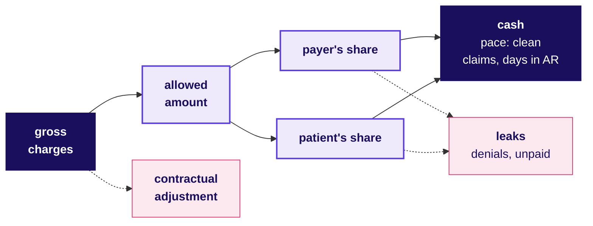

# Domain card: How does a US lab turn a test into cash, and what may its data team see?

Kalpa Health, Build 1: six US metros, four kinds of payer (commercial, Medicare, Medicaid, self-pay). Fictional, with synthetic records; illustrative numbers are neither its data nor any real company's.

## Panel 1: How does a test's charge become cash?

**Allowed = payer's share + patient's share.** James's tests: $135 charged, $64.80 written off under contract, $70.20 allowed, $56.16 from the plan, $14.04 from James.

**Crux:** Place every revenue-cycle number on this tree, as a charge, an allowed dollar, a leak or the pace of cash, before explaining a change in it.

## Panel 2: How is each revenue-cycle number worked out?

| Metric | Formula |
|---|---|
| Gross charges | Tests billed x list price |
| Allowed amount | Payer's share + patient responsibility |
| Contractual adjustment | Gross charges less allowed |
| Net revenue | Charges less contractual adjustments less what will never be collected |
| Patient responsibility | Deductible + coinsurance + copay |
| Initial denial rate | Denied at first answer / submitted |
| Clean claim rate | Passed every edit untouched / entered |
| Days in AR | Receivable / net revenue per day |
| Net collection rate | Payments / allowed, once the window closes |
| Turnaround time | Draw to released result, median |

**Crux:** Say the divisor, and whether it counts claims or dollars.

## Panel 3: Which checks stop a lab's number from lying?

| Trap | The check |
|---|---|
| A price-list rise read as growth | Track allowed dollars |
| Last year's allowed share, this year's claims | Check this year's remittances |
| Denials by count heard as dollars | State the basis |
| Days in AR cut by write-offs | Read write-offs beside it |
| Collections read before the window closes | Wait for the window |

**Crux:** Run each check before the number leaves the team.

## Panel 4: Which twenty words does a revenue-cycle meeting assume?

| Word | What it means |
|---|---|
| Payer | Whoever pays the claim |
| Medicare | Federal cover, mostly 65 and over |
| Medicaid | State cover for low incomes |
| Requisition | The doctor's order for tests |
| Accession number | Barcode tying sample to order |
| Panel | Tests ordered by one name |
| Chargemaster | The lab's own price list |
| Deductible | Paid by the patient each plan year before the plan pays |
| Coinsurance | The patient's percentage after the deductible |
| CPT | The AMA's procedure codes |
| ICD-10-CM | Diagnosis codes: why it was ordered |
| 837, 835 | The claim, and the remittance |
| Clearinghouse | Checks and routes claims |
| Rejection | Bounced before the payer saw it |
| Denial | The payer's refusal to pay |
| CARC | The 835 code saying why a dollar was adjusted |
| Prior authorisation | Payer approval before a service |
| Medical necessity | The payer's test that the diagnosis justifies it |
| Timely filing limit | The deadline to submit a claim |
| PHI | Identifiable health data a plan, provider, clearinghouse or their associate holds |

## Panel 5: Which rules bind a US lab's data team?

| Rule | What it requires |
|---|---|
| HIPAA Privacy | Use or share PHI only as the rule permits or the patient authorises |
| Minimum necessary | Only what the purpose needs |
| De-identification | Expert finding, or 18 identifiers out and no actual knowledge the rest identifies anyone |
| Business associate | Bound by its agreement, and directly by parts of HIPAA |
| Breach notice | Without unreasonable delay; 60 days at most |
| Medical necessity | Medicare pays only for needed tests; give the ABN when it may refuse |
| Timely filing | Medicare: one year from service |
| Offshore | No HIPAA border; contracts decide |

## Panel 6: Where does $100 of a lab's charges go?

| Line, illustrative | Less, $ | Left, $ |
|---|---|---|
| **Gross charges** | | 100 |
| Contractual adjustments | 55 | 45 **allowed** |
| Denials upheld, balances unpaid | 3 | 42 **net revenue** |
| Cost of the tests | 28 | 14 **gross profit** |
| Billing, sales, technology, admin | 8 | 6 **operating income** |

**Crux:** A $1 leak from the $45 allowed is 2.2 percent of it and a sixth of the lab's operating income.
