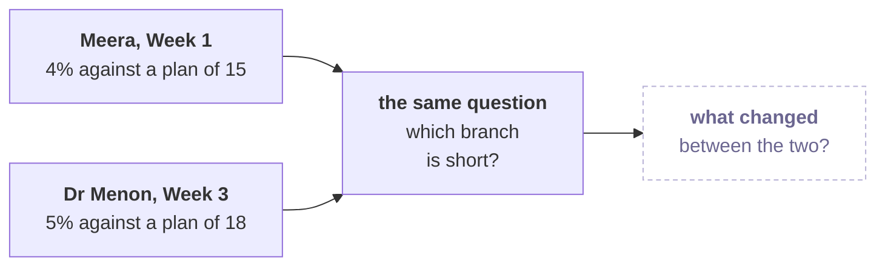
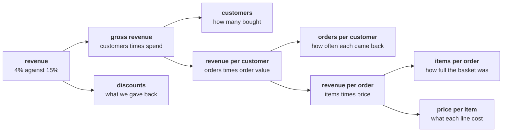
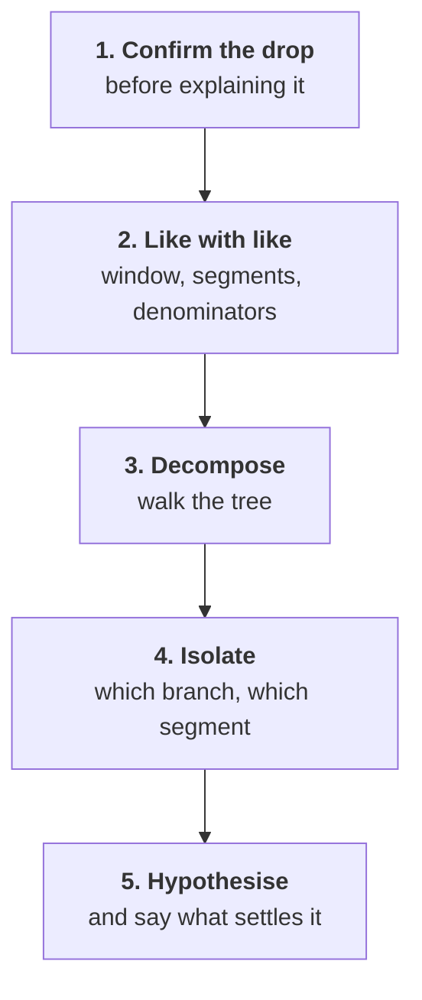
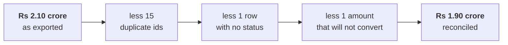
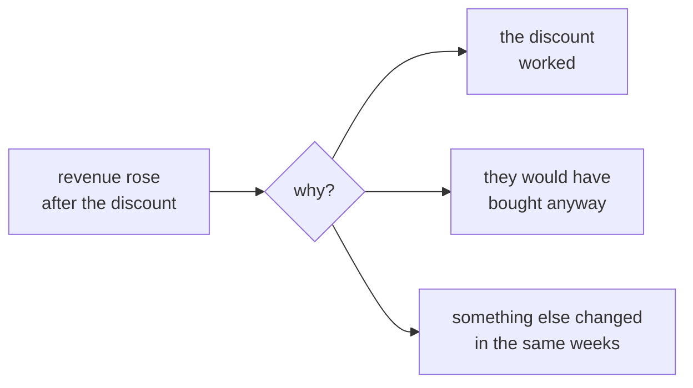
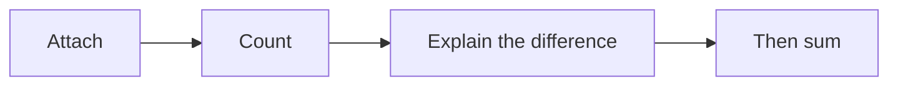

# Build 1: Kalpa Health

Week 3, Day 1. Build 1 opens.

Kicker: WEEK 3  ·  MONDAY  ·  BUILD 1
Quote: My dashboard says 5 percent. The plan says 18. Which branch of my business is short?
Who: Dr Priya Menon, COO, Kalpa Health, to the data and AI team at Kalpa's Global Capability Centre

```notes
LIVE, the Programme Head, online, one minute. Read Dr Menon's words aloud and leave them on screen.
Then say the one sentence the week rests on: this is the question Meera asked in Week 1, from a
business none of you has seen, and you already own the method that answers it. Nothing new is taught
this week. Move on.
```

---

## SECTION 1: The ask
*A second Kalpa COO has Meera's problem, in a business with its own words.*

```notes
LIVE. Chapter one runs about 15 minutes. Its job is to put Dr Menon's situation in front of the room
in her words before anyone hears the word "sub-problem". No tools, no method names yet.
```

---

## S1. A new client for the GCC team
*Kalpa Health runs laboratories and walk-in clinics in six cities.*

```cards
icon: building-2 | eyebrow: The unit | title: Kalpa Health | body: Diagnostic laboratories and walk-in clinics in Bengaluru, Mumbai, Delhi, Chennai, Hyderabad and Pune: one laboratory and two clinics in each city.
icon: user-round | eyebrow: The client | title: Dr Priya Menon, COO | body: Runs the business day to day and presents to the board shortly. She asks the questions this week answers.
icon: users | eyebrow: Your team | title: The GCC data and AI team | body: The same trainee engineers who answered Meera Raghavan. Dr Menon is your internal client for the week. | tone: dark
```

```stats
value: 5% | label: test volumes, Q1 to Q2 | note: on Dr Menon's dashboard
value: 18% | label: the plan | note: what the board approved
value: 6 | label: cities | note: 6 laboratories, 12 clinics
value: 10 | label: files | note: exported by her data team
```

```notes
LIVE, the Programme Head, 3 minutes. Kalpa Health is fictional, like every Kalpa unit; say it once.
Q1 is April to June and Q2 is July to September, Kalpa Health's financial year. Ask the room which of
the four numbers they would want to check first. Any answer is fine; the point is that the 5 percent
is a number from a dashboard, and every number from a dashboard has a definition behind it.
Do not say anything about how the 5 percent was counted. That is for the groups to find.
```

---

## S2. What Dr Menon wrote, and what her heads asked
*Five questions from four people, each put as it was put to her.*

**The client asks.** "I do not need a dashboard. I need to know where the 13 points went, and what to do on Monday."

| Who is asking | What they asked Dr Menon |
|---|---|
| The finance head | Where does our lab revenue come from, and which branch of it is short? |
| The clinics' operations head | Bookings fell in two cities in Q2: how far, and why? |
| The finance head | Invoices and collections disagree: which are unpaid, and can I trust the figure? |
| The clinics' operations head | KH-HYD-03 has the worst no-show rate: is the clinic really worse? |
| The marketing head | Our free home-collection offer lifted bookings 9 percent: did it work? |

```notes
LIVE, the Programme Head, 4 minutes. Read Dr Menon's line, then each row. These are her heads'
words, and each group will own one row by the end of the allocation. The full wording is in the
briefing note, C2_W03_D01_briefing_note_STUDENT.md, which every learner has.
Watch for learners who start explaining a row ("it must be the new system"). Say: hold that, write
it in your challenges log as a hypothesis, and test it on Wednesday. A hypothesis said aloud on
Monday is a guess the whole room hears.
```

---

## S3. Same question as Meera's: what changed?
*Meera asked it about Kalpa Retail in Week 1; Dr Menon asks it about a lab.*



**Question.** Between Meera's question and Dr Menon's, what changed? Answer as a letter: a) the method, since a laboratory business needs analytical techniques of its own; b) the vocabulary and the cost of an error, while the method holds; c) nothing at all, since bookings and invoices look like orders and payments; d) the tools, since a lab's data needs a new stack and a new language.

```notes
LIVE, the Programme Head, 3 minutes. One minute in pairs, then letters in the chat. Expect a and d
from learners who feel the domain is unfamiliar. Do not resolve it here; the answer slide does.
```

---

## S4. Answer: the words and the stakes change
*The method holds; the vocabulary and the cost of a wrong number do not.*

| What | In Kalpa Retail | In Kalpa Health |
|---|---|---|
| The method | Tree, ladder, reconcile, fair comparison | The same four, unchanged |
| The vocabulary | Orders, items, cancellations | Bookings, tests, no-shows, and words with no retail twin |
| The cost of an error | A missed sale or a wasted budget | A patient's test, a clinic, a diagnosis |

**Kavya's review.** A group that maps Kalpa Health onto the Week 1 method in its own words has done the transfer. A group that waits to be told the mapping has not.

**In the interview.** [S] You have joined a healthcare company; how would you apply what you did in retail to our data?

```notes
LIVE, the Programme Head, 3 minutes. The answer is b. Option c is the dangerous one: the data does
not look the same, and some of its words have no retail twin, which is exactly where a group must
slow down. Option a is the reason this week exists: in an interview, a candidate who says "I would
need to learn the domain's techniques" has not seen that the method travels.
Say the interview question aloud. It is the question this whole week equips them to answer, and it
is asked everywhere.
```

---

## SECTION 2: The week
*Five sub-problems, groups of four, and six days that end in front of a panel.*

```notes
LIVE. Chapter two runs about 20 minutes: what each group takes, how the days run, what every group
ships. The allocation itself runs after the deck, in its own 30 minutes.
```

---

## S5. Five sub-problems, one per group
*Every one is the Weeks 1 and 2 method in a domain you have never seen.*

```cards
icon: indian-rupee | eyebrow: Sub-problem 1 | title: Revenue | body: Where lab revenue comes from, and which branch is short.
icon: calendar-x | eyebrow: Sub-problem 2 | title: Bookings | body: Bookings fell in two cities in Q2: how far, and why.
icon: receipt | eyebrow: Sub-problem 3 | title: Billing | body: Invoices and collections disagree: which are unpaid, and what is the true figure.
icon: user-x | eyebrow: Sub-problem 4 | title: No-shows | body: One clinic's no-show rate looks worse: real or noise, and what a fair comparison needs.
icon: truck | eyebrow: Sub-problem 5 | title: Campaign | body: Free home collection "lifted bookings 9 percent": cause or coincidence.
```

```notes
LIVE, the Programme Head, 3 minutes. Name the five by number and name, and use those numbers all
week: 1 revenue, 2 bookings, 3 billing, 4 no-shows, 5 campaign. Each has its own brief in the briefs
folder, C2_W03_D01_brief_{n}_{name}_STUDENT.md.
Do not say which method each maps to. If someone asks, the reply is: that is today's work, and it is
yours.
```

---

## S6. Groups of four, and the allocation next
*Nine groups this cohort; the Programme Head allocates them in the next half hour.*

```stats
value: 35 | label: learners | note: this cohort
value: 9 | label: groups | note: of four, one of them three
value: 5 | label: sub-problems | note: each with its own brief
value: 30 min | label: the allocation | note: straight after this
```

The same data supports more than one honest answer. Where two or more groups take the same sub-problem, the panel hears them one after another, and each group defends its own caveats.

```notes
LIVE, the Programme Head, 2 minutes. Say that the allocation is decided in the next 30 minutes and
not before, and that every group holds all ten files whatever it takes.
The group of three carries the same brief as a group of four; say so plainly so nobody asks for a
lighter one.
Do not announce the allocation method here; the Programme Head chooses it on the day.
```

---

## S7. The week, day by day
*Tuesday is Dussehra, so Wednesday carries two build days.*

```timeline
label: Monday | title: Translate and scope | body: This introduction (60 min), the allocation (30 min), your sub-problem in the Weeks 1 and 2 method, the challenges log opened, scopes pinned at the close (15 min).
label: Wednesday | title: Profile, clean, reconcile | body: The checkpoint (30 min), the trainer's parallel build in the open (60 min), build time, and each group's headline claim with its denominators and caveat (20 min).
label: Thursday | title: Mock round 1, build complete | body: Every learner mocked once, about 20 minutes: half technical on Weeks 1 and 2, half a viva on your group's work.
label: Friday | title: GDs and the build freeze | body: The industry expert runs group discussions, about 30 minutes per group; builds freeze; two cold demo runs; the first presentations.
label: Saturday | title: Presentations and closure | body: The remaining GDs, then presentations with live demos, 25 to 30 minutes per group, before the expert and a senior industry leader. | tone: dark
```

```notes
LIVE, the Programme Head, 4 minutes. Walk the days left to right. Three things to land:
the headline claim is stated on Wednesday so that Thursday tests it rather than finishes it; the
mock's viva half runs on your own group's work, so the challenges log is revision material; the
group discussions run on Kalpa Health's problem space and are a thread separate from the project.
Tuesday 20 October is a gazetted holiday. The time after the second block each day is open build
time with the TAs.
```

---

## S8. Nothing new is taught this week
*Everything you need is in your Weeks 1 and 2 notes, and that is the test.*

```cards
icon: book-open | eyebrow: What you have | title: Weeks 1 and 2 | body: The tree, the ladder, profile and reconcile, the fair comparison, the four-part note, SQL, pandas and Excel.
icon: map | eyebrow: What is new | title: The domain | body: Its words, its systems and what an error costs. Nobody teaches it to you; you translate into it.
icon: life-buoy | eyebrow: When stuck | title: Log it, then ask | body: Write the challenge in the log, say what you tried, then ask a TA. A domain question is always fair to ask.
```

```notes
LIVE, the Programme Head, 2 minutes. The rule protects the week: a build week that teaches turns
into a teaching week with a project bolted on. A trainer or TA will answer a domain question (what
a phlebotomist does, what a package is) and will not answer a method question with the method.
The TAs' reply to "which method do we use?" is a question back: which one did Meera's question need?
```

---

## S9. What every group ships
*Five things, described the same way in every brief.*

| What | What it holds |
|---|---|
| A presentation slot | 25 to 30 minutes: your answer, a live demo run cold on your own Kalpa Health files, the panel's questions |
| The one-slide answer | What Dr Menon carries into her board meeting: claim, evidence, caveat, action |
| The notebook or SQL | Reproduces every number from the raw files, top to bottom |
| The decisions log | The Week 1 Wednesday shape, every file reconciled |
| The challenges log | Every time you were stuck, dated, from entry one today |

```stats
value: 40 | label: the mini project | note: marks, the presentation included
value: 30 | label: the mock interview | note: marks, round 1 this week
value: 30 | label: the group discussion | note: marks, this week
```

```notes
LIVE, the Programme Head, 3 minutes. The marks per event are locked: mini project 40 including the
presentation, mock 30, GD 30. Say nothing about criteria: the rubrics are not published yet, and a
learner who asks is told they arrive when they are approved.
The live demo runs cold: a fresh start, the raw files, top to bottom. A demo that only works warm
fails in front of the panel.
```

---

## SECTION 3: The method you already own
*The pictures you drew for Meera and Anand, and the Kalpa Health versions you draw today.*

```notes
LIVE. Chapter three runs about 15 minutes. Every picture is shown exactly as the room drew it in
Kalpa Retail. None is redrawn for Kalpa Health on screen: drawing that version is each group's work
today, in the translation worksheet.
```

---

## S10. The revenue tree, as you drew it for Meera
*Every branch a numerator over a denominator; the question is which branch is short.*



**Your turn.** What is each box called in Kalpa Health, and which box has no clean twin?

```notes
LIVE, the Programme Head, 3 minutes. This is Week 1 Monday's tree, word for word. Ask the room to
name one box's Kalpa Health word in the chat, and stop at one. Every group draws its own version in
the worksheet, and sub-problem 1 draws it in full.
Watch for a learner who draws the Kalpa Health tree in the chat. Thank them and ask them to take it
to their group; the room does not get a shared answer today.
```

---

## S11. The investigation ladder, from Week 1 Tuesday
*Confirm the drop before explaining it, then compare like with like.*



**Your turn.** Which rung does a Kalpa Health question skip most easily, and what would that cost?

```notes
LIVE, the Programme Head, 2 minutes. Week 1 Tuesday's ladder, unchanged. Remind the room that
Meera's "we are losing customers" was disproved on rung 1 in Kalpa Retail. Do not name any Kalpa
Health symptom that might fail rung 1; that is for the groups to find.
```

---

## S12. Profile, clean, reconcile: Week 1 Wednesday
*Input equals clean plus rejected, and every decision is written down.*



| Field | Issue | Rows | Decision | Reason |
|---|---|---|---|---|
| order_id | Repeated | 15 | Drop later occurrences | The migration re-ran a batch |

**Your turn.** Ten Kalpa Health files, from different systems: which do you profile first, and why?

```notes
LIVE, the Programme Head, 2 minutes. This is Anand's bridge from Week 1 Wednesday and one row of
that day's decisions log. The decisions log this week has the same five columns, in
C2_W03_D01_decisions_log_STUDENT.xlsx, and its Reconcile sheet checks input against clean plus
removed for every file.
Do not describe any Kalpa Health file's condition. "Profile before you touch" is the whole message.
```

---

## S13. The fair comparison: Week 1 Thursday
*Could chance do it, and do the two groups differ only in the thing tested?*



**Your turn.** Which Kalpa Health question compares two groups, and what would make that comparison unfair?

```notes
LIVE, the Programme Head, 2 minutes. Week 1 Thursday's picture of the monsoon discount. The
permutation test asked whether chance could produce a gap; the fair comparison asked what else
differed between the groups. Both are in the room's notes.
Do not answer the Your-turn question on screen. More than one sub-problem compares two groups, and
each group decides for itself what a fair comparison needs.
```

---

## S14. Booked against collected: Week 2 Tuesday
*Attach, count, explain the difference, and only then sum.*



**Your turn.** Two systems export the same entity with different ids. What do you do before you join them?

```notes
LIVE, the Programme Head, 2 minutes. Week 2 Tuesday's rule for joins, the one Anand's booked-against-
collected report rested on. The Your-turn question is Wednesday's interview question, asked early on
purpose; leave it open.
```

---

## S15. Today's work: translate, then log
*Four parts on one worksheet, and entry one in the challenges log before the close.*

```timeline
label: Part 1 | title: The words | body: Your stakeholder's question, word for word, taken apart: the number, the comparison, the decision.
label: Part 2 | title: The method | body: Which Weeks 1 and 2 picture it calls for, redrawn with Kalpa Health's words.
label: Part 3 | title: The vocabulary | body: The map from Kalpa Retail's words to Kalpa Health's, with what differs.
label: Part 4 | title: First three moves | body: What you do first, which file, what you count, what would change the plan. | tone: dark
```

| Kalpa Retail | Kalpa Health |
|---|---|
| An order | A booking |
| An item | A test |
| A cancellation | A no-show |

```notes
LIVE, the Programme Head, 3 minutes. The worksheet is C2_W03_D01_translation_worksheet_STUDENT.md in
the briefs folder; each group copies it into its own repository. The three pairs start the map, and
each group adds at least five of its own. The pairs that behave differently are the valuable ones.
The worksheet also asks the cost-of-error question and ends with a one-sentence scope the group pins
at the close. Entry one of the challenges log is due before the close.
```

---

## S16. The challenges log starts with entry one
*Every stop, dated as it happens: what stopped you, what you tried, what you decided.*

```cards
icon: circle-alert | eyebrow: What stopped us | title: The challenge | body: One sentence, and where it showed: a file, a column or a step.
icon: wrench | eyebrow: What we tried | title: The attempt | body: What the group did, including what did not work.
icon: check-check | eyebrow: What we decided | title: The decision | body: What you chose and why, or that it is still open. | tone: dark
```

The log is `C2_W03_D01_challenges_log_STUDENT.xlsx`. Its Example sheet shows one entry, and its Summary sheet counts what is still open.

```notes
LIVE, the Programme Head, 2 minutes. Thursday's viva reads this log. Prepared answers break where
the log is thin, so an entry written on Monday is worth more than three written on Thursday night.
A challenge that needed a cleaning or matching decision also goes in the decisions log.
```

---

## S17. The close, and Wednesday's checkpoint
*Scopes pinned today; three checkpoint questions per group on Wednesday.*

| When | What each group does |
|---|---|
| The close today, 15 min | Pins its one-sentence scope, with the one thing it will not do |
| Tonight, open build time | Starts the build against its own scope, and logs challenges as they happen |
| Wednesday, 30 min | Answers the day's three checkpoint questions in two minutes |
| Wednesday, 20 min | States its headline claim in one sentence, with its denominators and caveat |

**In the interview.** [F] What changes when the cost of an error is a missed diagnosis rather than a missed sale?

```notes
LIVE, the Programme Head, 2 minutes. The checkpoint questions are not shared today; a group that
cannot answer them on Wednesday is stuck and should say so, because Thursday opens the mocks.
Take questions for the remaining ten minutes of the hour, then close on the [F] question and leave
it on screen as the room breaks for the allocation. Each group
answers it for its own sub-problem in Part 5 of the worksheet; nobody answers it for them.
```
