# Which branch of Kalpa Health is short?

Week 3, Day 1. Build 1 opens.

Kicker: WEEK 3  ·  MONDAY  ·  BUILD 1
Quote: My dashboard says test volumes grew 5 percent. The plan says 18. Which branch of my business is short, and what do I do next?
Who: Dr Priya Menon, COO, Kalpa Health, to the data and AI team at Kalpa's Global Capability Centre

```notes
LIVE, the Programme Head, online, 1 minute. On screen as the link opens. The trainer in the room
runs the link and reads the chat aloud. Read Dr Menon's words once and leave them up. Say once that
Kalpa Health, like every Kalpa company, is fictional, and that every record in the files is
synthetic, so no real patient's information is anywhere in the programme. Then the sentence the week
rests on: this is the question Meera Raghavan asked in Week 1, from a business none of you has
worked in, and you already own the method that answers it.
Transition: the seven questions that turn her ask into each group's plan.
```

---

## S1. Seven questions turn Dr Menon's ask into a plan
*Which part of Dr Menon's question will each group answer, and with which move it already owns?*

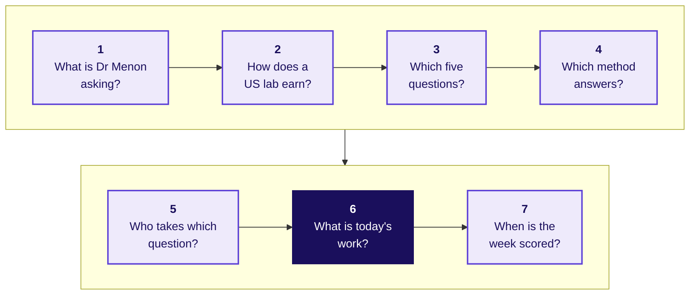

The day ends when every group has written its question in its own words, mapped it onto a move from
Weeks 1 and 2, and pinned a one-sentence scope.

```notes
LIVE, the Programme Head, 2 minutes. Read the day's question, then the seven short questions in
order. Say how the day runs around them: this hour answers all seven, the trainer then tells the
story of the US lab business in full for 45 minutes, the allocation follows the story so that groups
choose knowing the domain, and the rest of the day is each group's translation, ending on a pinned
scope at the close.
Ask: which of the seven would you most want answered before you choose a question? Hear two answers
in the chat and leave them open.
Watch for anyone who starts answering Dr Menon in the chat ("it must be a competitor"). Say: write
it down as a guess; nobody has opened a file yet.
Transition: question 1, what Dr Menon has actually asked.
```

---

## SECTION 1: What is Dr Menon asking?
*What has Kalpa Health's COO seen on her dashboard, what are her heads asking, and why is it Meera's question again?*

```notes
LIVE, the Programme Head. Section 1 runs about 10 minutes over its five slides. Its job is to put Dr
Menon's situation in front of the room in her words before anyone hears the word sub-problem. No
tools and no method names yet.
Transition: who needs the answer, and the four questions on the way.
```

---

## S2. Dr Menon needs one answer before her board meets
*Who needs the answer to Dr Menon's question, and which questions come on the way?*

**Who needs the answer.** Dr Priya Menon, COO of Kalpa Health: she moves the second half's staff and money onto the branch the team names, so a wrong branch leaves the short one falling for another quarter.

```timeline
label: 1 | title: The dashboard | body: What does Dr Menon's dashboard show, and against what plan?
label: 2 | title: Her heads | body: Which five questions do her heads ask, and what does each decide?
label: 3 | title: Meera's question | body: What changes between Meera's question and Dr Menon's?
label: 4 | title: What travels | body: What carries over from Kalpa Retail, and what does not? | tone: dark
```

```notes
LIVE, the Programme Head, 1 minute. Read who needs the answer, then the four questions. Each gets
one slide and an answer before the next is asked.
Transition: the dashboard.
```

---

## S3. Her dashboard reads 5 percent against a plan of 18
*What does Dr Menon's dashboard show, and against what plan?*

```stats
value: 5% | label: test volumes, Q2 to Q3 | note: on Dr Menon's dashboard
value: 18% | label: the plan | note: what the board approved
value: 13 | label: points short | note: what she must explain
value: 6 | label: US metro areas | note: a laboratory and two centres in each
```

**The client asks.** "I do not need another dashboard. I need to know where the 13 points went, and what to do next."

```notes
LIVE, the Programme Head, 2 minutes. Kalpa Health runs one laboratory and two patient service
centres, where blood is drawn, in each of six US metro areas: Dallas, Phoenix, New York, Chicago,
Atlanta and Philadelphia. It reports in calendar quarters: Q2 is April to June 2026, Q3 is July to
September 2026. The ten files the groups hold are the export taken on Friday 16 October 2026.
Ask: which of the four numbers would you want to check first, and why? Hear two answers and rule on
neither.
Watch for someone who treats the 5 percent as a fact. Do not correct it; say that every number on a
dashboard counts something, and that the groups will decide what this one counts.
Transition: her heads each have a question of their own.
```

---

## S4. Five heads ask five questions, each with a decision
*Which five questions do Dr Menon's heads ask, and what does each answer decide?*

| # | Who asks | What they ask | What the answer decides |
|---|---|---|---|
| 1 | Finance head | Which branch of lab revenue is short? | Where the recovery effort goes |
| 2 | Centres' operations head | How far did bookings fall in two metros, and why? | A field team, a staff cut, or neither |
| 3 | Finance head | Which claims are unpaid, and can the figure be trusted? | The figure at the close |
| 4 | Centres' operations head | Is KH-ATL-03 really worse at no-shows? | A receptionist, reminders or closure |
| 5 | Marketing head | Did the free at-home offer lift bookings 9 percent? | Extend the offer, keep it or stop it |

```notes
LIVE, the Programme Head, 3 minutes. Read each row. The full words of each head are in the briefing
note, briefs/C2_W03_D01_briefing_note_STUDENT.md, which every learner has. Each group will own one
row by the end of the allocation, and section 3 gives each row its own slide.
Watch for learners who start explaining a row ("it must be the season"). Say: hold that and write it
down as a hypothesis to test once the build starts, since a guess said aloud now steers every group
that hears it.
Transition: why this is a question you have answered before.
```

---

## S5. What changes from Meera's question to Dr Menon's?
*Meera asked it of Kalpa Retail in Week 1 and Dr Menon asks it of a US lab, so which part changes?*

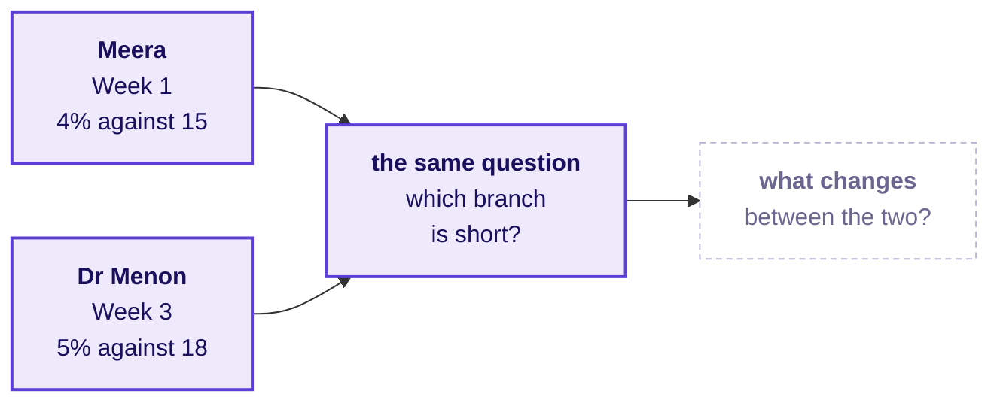

**Question.** Answer as a letter: a) the method, since a laboratory business needs techniques of its own; b) the vocabulary and the cost of an error, while the method holds; c) nothing at all, since bookings and claims behave like orders and payments; d) the tools, since a lab's data needs a new stack.

```notes
LIVE, the Programme Head, 2 minutes. One minute in pairs, then letters in the chat; the trainer
reads the count aloud. Expect a and d from learners who feel the domain is unfamiliar. Do not resolve
it here; the next slide does.
Transition: the answer.
```

---

## S6. Answer: b, the words and the stakes change
*What carries over from Kalpa Retail to Kalpa Health, and what does not?*

| What | In Kalpa Retail | In Kalpa Health |
|---|---|---|
| The method | Tree, ladder, reconcile, fair comparison | The same moves, unchanged |
| The vocabulary | Orders, items, cancellations | Bookings, tests, no-shows, and words with no retail twin |
| Who pays | The shopper, at the till or on the app | A plan, Medicare, Medicaid or the patient, weeks later |
| What an error costs | A missed sale or a wasted budget | A missed draw, a centre, a diagnosis |

**Kavya's review.** A group that maps Kalpa Health onto the Week 1 method in its own words has done the transfer; a group that waits to be told the mapping has not.

**In the interview.** [S] You have joined a healthcare company; how would you apply what you did in retail to our data?

```notes
LIVE, the Programme Head, 2 minutes. The answer is b. Option c is the dangerous one: the data does
not look the same, and some of its words have no retail twin, which is where a group must slow down.
Option a is why this week exists: a candidate who says "I would need to learn the domain's
techniques" has not seen that the method travels.
Say the interview question aloud. It is the question this whole week equips them to answer.
Transition: section 2, the business itself.
```

---

## SECTION 2: How does a US lab earn?
*How does a US laboratory make its money, who pays it, and what may its data team in Bengaluru touch?*

```notes
LIVE, the Programme Head, about 5 minutes over S7 to S9. The trainer tells the domain's story in
full straight after this hour, 45 minutes with no laptop open, so these three slides preview it and
D10 to D14 carry its depth for anyone reading alone. The domain dossier,
study-notes/C2_W03_D01_domain_us_healthcare_STUDENT.md, tells it at length.
Transition: who needs the domain before the data.
```

---

## S7. The domain comes before the data, in five questions
*Who needs the business before the files, and which questions come on the way?*

**Who needs the answer.** Every group: most of the room has never worked in a business role and nobody in it has worked in US healthcare, so a group that opens the files before it knows the business counts the wrong things with confidence.

```timeline
label: 1 | title: One test | body: What happens to one blood test between the draw and the claim?
label: 2 | title: Who pays | body: Who pays a US lab, and how much of the list price arrives?
label: 3 | title: Real companies | body: Which real companies look like Kalpa Health?
label: 4 | title: Where $100 goes | body: Where does $100 of a lab's charges go, and who asks for which number?
label: 5 | title: The rules | body: Which rules bind the data, and how far may a model or an agent go? | tone: dark
```

```notes
LIVE, the Programme Head, 1 minute. Read the five questions. Say that the next two slides answer
the first two, and that the trainer's story after this hour answers all five with drawings on the
board.
Transition: one blood test.
```

---

## S8. A test becomes a claim, and the payer decides
*What happens to one blood test between the draw and the claim?*

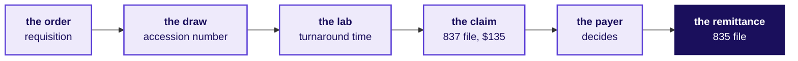

A doctor orders two tests for James Carter, a synthetic Dallas patient; a phlebotomist draws his blood, the lab runs the tests, and the claim bills his plan $135 at list price. Weeks later the plan's remittance says what it pays.

```notes
LIVE, the Programme Head, 2 minutes. The requisition is the doctor's order; the accession number is
the barcode that ties a tube to its order. The claim goes as an electronic file, an 837, and the
plan answers with another, an 835, the remittance. James and his numbers come from the domain
dossier; his $60 and $75 tests are prices in Kalpa Health's own test catalogue.
Ask: the last time you had a blood test in India, who paid, and when did you know the price? Most
paid at booking and knew the price; in the US a payer stands between the lab and its money.
Transition: how much of the $135 arrives.
```

---

## S9. Of James's $135 claim, his plan paid $56.16
*Who pays a US lab, and how much of the list price arrives?*

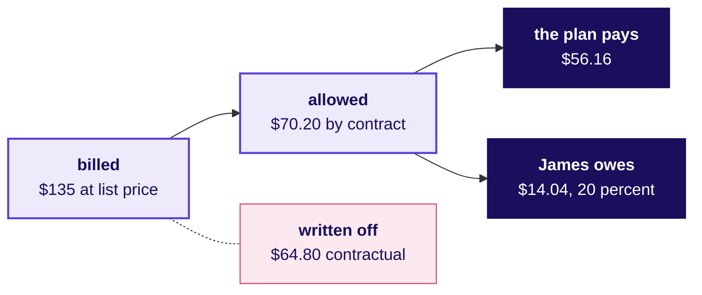

Four kinds of payer stand behind Kalpa Health's claims: commercial plans, Medicare for people aged 65 and over, Medicaid run by each state for people on low incomes, and self-pay patients. Each payer's contract or fee schedule sets the allowed amount.

```notes
LIVE, the Programme Head, 2 minutes. The list price starts the claim; the contract decides what
the test earns. The $64.80 is a contractual adjustment, written off under the contract and never
owed, so it is not a loss. James owes 20 percent coinsurance on the $70.20.
Ask: of the $135, how much reached the lab from his plan? Letters in the chat: a) nothing, b) under
$50, c) $50 to $100, d) more than $100. The answer is c, $56.16.
Transition: the trainer's story takes the rest of the domain after this hour; next, the five
questions.
```

---

## D10. Quest and Labcorp have Kalpa Health's shape
*Which real companies look like Kalpa Health, and which teams in India do its kind of work?*

```cards
icon: flask-conical | eyebrow: US lab | title: Quest Diagnostics | body: $11,035 million of net revenues in 2025 and about 2,400 patient service centres, many in large retail stores; it offers in-home draws for a fee.
icon: flask-conical | eyebrow: US lab | title: Labcorp | body: $13,951.7 million of revenues in 2025 and more than 2,200 patient service centres.
icon: building-2 | eyebrow: A company's own centre | title: Optum India | body: UnitedHealth Group's largest Global Capability Centre, for healthcare operations, technology, analytics and support.
icon: users | eyebrow: A firm serving many | title: AGS Health | body: More than 15,000 revenue-cycle staff worldwide, with Indian centres in Chennai, Hyderabad and Bengaluru among others. | tone: dark
```

Kalpa Health is fictional, and these are real companies that look like it: its US half resembles the two labs, and its GCC half resembles Optum India, one company's own centre.

```notes
SELF-STUDY, 2 minutes. Sources, each checked on 1 October 2026: Quest's and Labcorp's Form 10-K for
2025, UnitedHealth Group's careers page for India, and AGS Health's company page; the provenance
holds the links. Kalpa's GCC is the first kind of twin, one company's own centre with Kalpa Health
as one of its clients.
Transition: where $100 of charges goes.
```

---

## D11. $100 of charges leaves about $6 of operating income
*Where does $100 of a lab's charges go, on illustrative numbers?*

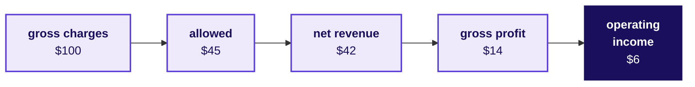

The contracts take $55, $3 is never collected, the tests cost $28 and billing, sales and administration $8. The numbers are an illustrative lab's, near Quest's cost shares, and a $1 leak from the $45 allowed is a sixth of the $6 the lab keeps.

```notes
SELF-STUDY, 2 minutes. Net revenue is what the lab expects to collect, and it is the line a lab
reports. Quest reported operating income of 14.1 percent of net revenues in 2025 (10-K for 2025, as
the dossier records it); the illustration's $6 of $42 is 14.3 percent.
Transition: who at Kalpa Health asks the data team for which number.
```

---

## D12. Each head asks the data team for a different number
*Who at Kalpa Health asks the data team for what, and what does a wrong number cost?*

| Who asks | What they ask the data team | What a wrong number costs |
|---|---|---|
| Dr Priya Menon, COO | Which part of the business is short? | Staff and money moved to the wrong place |
| Revenue cycle head | Which claims will be denied, and which come first? | Claims chased past their filing limit |
| Centres' operations head | Which centres are overloaded, and where should staff go? | Queues in one centre, idle staff in the next |
| Finance head | Do your numbers match my books? | A quarter restated after the board saw it |
| Marketing head | Which offers bring patients in, at what cost? | A campaign budget spent on the wrong number |

```notes
SELF-STUDY, 2 minutes. Only Dr Menon is named; the other heads appear by role. Payer contracting,
the lab director and compliance ask too, and the dossier's section 4 lists all of them. Kavya Nair,
the senior analyst on the team, checks every answer before it leaves.
Transition: the tree every revenue-cycle number hangs off.
```

---

## D13. Every revenue-cycle number hangs off one tree
*How does a charge become cash, and where can a number on the way mislead?*

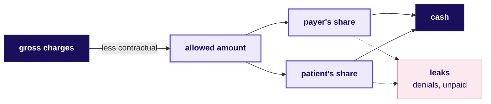

Every metric on it is a numerator over a divisor. On illustrative numbers, a lab that raises every list price 8 percent bills 8 percent more while the contracts allow what they allowed before, so not one more test was done.

```notes
SELF-STUDY, 2 minutes. Two measures set the pace: the clean claim rate, the share of claims that
pass every check before they leave, and days in accounts receivable, what the lab is owed divided by
a day's net revenue. The price-list example is the dossier's and the story's, and it is
illustrative, never Kalpa Health's.
Transition: the rules that bind the data.
```

---

## D14. Agreements decide what the team in Bengaluru may touch
*Which rules bind a US lab's data, and how far may a model or an agent go?*

```cards
icon: shield-check | eyebrow: The law | title: HIPAA and PHI | body: Health information that identifies a patient is PHI, used only for purposes the rule allows and only as much as the purpose needs.
icon: file-text | eyebrow: The agreement | title: Business associate | body: A company handling PHI for a lab signs an agreement that sets what it may do with the data.
icon: map | eyebrow: The border | title: Offshore work | body: HIPAA sets no border; agreements and payers' contracts do, and a state Medicaid contract can keep work in the US.
icon: users | eyebrow: The ladder | title: Describe to act | body: A model may rank, flag and draft; a person decides anything that asserts a diagnosis or denies care. | tone: dark
```

Every Kalpa Health record is synthetic, so no PHI exists anywhere in the programme's files.

```notes
SELF-STUDY, 2 minutes. The dossier's section 7 carries each rule with its source, among them Texas's
Medicaid managed-care contract, which requires the work under it to be done inside the US unless the
state approves in writing. Kalpa Health bills Medicaid in Texas, so what the team in Bengaluru may
touch is written in its contracts.
Transition: section 3, the five questions in full.
```

---

## SECTION 3: Which five questions?
*Which five questions do Dr Menon's heads ask, what does each answer decide, and which files does each start from?*

```notes
LIVE, the Programme Head, about 9 minutes over S15 to S24: a minute and a half on each question,
read in the asker's words with the decision it feeds. The odd-numbered D slides show each question's
files and are self-study. Each question has its own brief in briefs/, C2_W03_D01_brief_{n}_{name}_STUDENT.md,
with its terms, files, the ways a group could answer it sized, and what a finished answer looks like.
Use the numbers all week: 1 revenue, 2 bookings, 3 billing, 4 no-shows, 5 campaign.
Transition: who needs the five questions in full.
```

---

## S15. Five questions, each with its own brief and files
*Who needs the five questions in full before the allocation, and which questions come on the way?*

**Who needs the answer.** Every group: the allocation asks each group to choose, and a choice made on a question's title alone lands a group on work it cannot defend on Thursday.

```timeline
label: 1 | title: Revenue | body: Which branch of Kalpa Health's billed revenue is short of the plan?
label: 2 | title: Bookings | body: How far did bookings fall in two metros, and why?
label: 3 | title: Billing | body: Which claims are unpaid, and can finance trust its figure?
label: 4 | title: No-shows | body: Is KH-ATL-03 really worse than the other centres?
label: 5 | title: Campaign | body: Did the at-home offer cause 9 percent more bookings? | tone: dark
```

```notes
LIVE, the Programme Head, 1 minute. Read the five short questions. Every group holds all ten files,
whatever it takes, and every brief has the same shape.
Transition: question 1.
```

---

## S16. Revenue asks which branch of billed revenue is short
*What does the finance head ask, what does the answer decide, and what does a wrong one cost?*

> "The board will ask me where the plan's growth went. Where does our lab revenue actually come from, and which branch of it is short?"
> The finance head, Kalpa Health

```cards
icon: target | eyebrow: The answer decides | title: Where recovery goes | body: The second half's staff and money go to the branch the group names.
icon: triangle-alert | eyebrow: A wrong answer costs | title: The short branch falls on | body: Money goes to a branch that was never short.
icon: database | eyebrow: It starts from | title: Seven files | body: Claims, booking lines, the price list, both booking files, patients and sites.
```

```notes
LIVE, the Programme Head, 90 seconds. Read the finance head's words. Billed revenue is the dollars
on the claims at list price, which differs from the money collected, so the group says which one it
means. Do not say which method fits; that is the group's work today.
Transition: the files behind it.
```

---

## D17. Revenue reads seven files, about 81,000 rows
*Which files does the revenue question start from, and how big is each?*

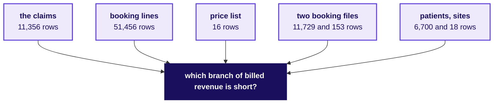

The files are `claims`, `booking_tests`, `test_catalogue`, `bookings_legacy` and `bookings_newsys`, `patients` and `sites`. The brief sizes four ways a group could answer the question, from about an hour to about seven, and names the Week 1 or 2 move each needs.

```notes
SELF-STUDY, 1 minute. The row counts exclude each file's header line. The brief is
briefs/C2_W03_D01_brief_1_revenue_STUDENT.md.
Transition: question 2.
```

---

## S18. Bookings asks how far two metros fell, and why
*What does the operations head ask, what does the answer decide, and what does a wrong one cost?*

> "Bookings fell in two of our metros in Q3. Before I send a field team or cut staff there, I need to know how far they fell, and why."
> The patient service centres' operations head, Kalpa Health

```cards
icon: target | eyebrow: The answer decides | title: A field team or a staff cut | body: Send people to the two metros, cut staff there, or leave them alone.
icon: triangle-alert | eyebrow: A wrong answer costs | title: Staff or a quarter | body: Read too large, staff patients need are cut; too small, a real decline runs on.
icon: database | eyebrow: It starts from | title: Six files | body: Both booking files, sites, patients, booking lines, and the claims as a second count.
```

```notes
LIVE, the Programme Head, 90 seconds. Read the operations head's words. Which two metros fell is
the first thing the group confirms from the files; the slide does not name them, and neither does
the brief.
Transition: the files behind it.
```

---

## D19. Bookings reads two booking files and four others
*Which files does the bookings question start from, and how big is each?*

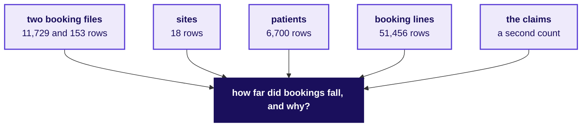

The files are `bookings_legacy` and `bookings_newsys`, `sites`, `patients`, `booking_tests` and `claims`, whose 11,356 rows bill the completed bookings. The brief sizes four ways a group could answer the question, from about an hour to about six, and names the Week 1 or 2 move each needs.

```notes
SELF-STUDY, 1 minute. The brief is briefs/C2_W03_D01_brief_2_bookings_STUDENT.md.
Transition: question 3.
```

---

## S20. Billing asks which claims are unpaid, in dollars
*What does the finance head ask, what does the answer decide, and what does a wrong one cost?*

> "The claims we billed say one thing and the posting system says another. Which claims are unpaid, how much money is that, and can I trust the figure I report?"
> The finance head, Kalpa Health

```cards
icon: target | eyebrow: The answer decides | title: The figure at the close | body: What finance reports, and which claims the revenue-cycle team chases first.
icon: triangle-alert | eyebrow: A wrong answer costs | title: A figure, or a deadline | body: A wrong figure reaches the board; a claim chased late passes its filing limit.
icon: database | eyebrow: It starts from | title: Two big files | body: The claims billed and the postings received, with patients and both booking files.
```

```notes
LIVE, the Programme Head, 90 seconds. Read the finance head's words. A claim the contract never
meant to pay in full is not unpaid, so the group defines paid, part paid, denied and unpaid before
it counts.
Transition: the files behind it.
```

---

## D21. Billing reads 11,356 claims and 11,343 postings
*Which files does the billing question start from, and how big is each?*

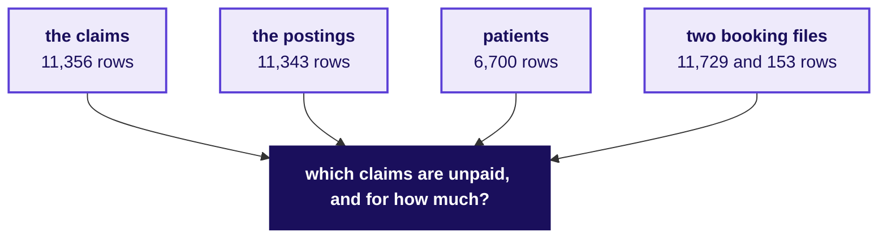

The files are `claims`, `remittances`, `patients`, and `bookings_legacy` and `bookings_newsys`. The brief sizes four ways a group could answer the question, from about an hour to about six, and names the Week 1 or 2 move each needs.

```notes
SELF-STUDY, 1 minute. The postings run up to the export on Friday 16 October 2026. The brief is
briefs/C2_W03_D01_brief_3_billing_STUDENT.md.
Transition: question 4.
```

---

## S22. No-shows asks whether KH-ATL-03 is really worse
*What does the operations head ask, what does the answer decide, and what does a wrong one cost?*

> "KH-ATL-03, one of our two Atlanta patient service centres, has the worst no-show rate on my Q3 report. I am being asked to add a receptionist there or close it. Is the centre really worse?"
> The patient service centres' operations head, Kalpa Health

```cards
icon: target | eyebrow: The answer decides | title: Staff, reminders or closure | body: A second receptionist, new reminder calls, or a closure notice.
icon: triangle-alert | eyebrow: A wrong answer costs | title: A centre, or the slots | body: A neighbourhood loses its draws on a misread rate, or a real problem goes on.
icon: database | eyebrow: It starts from | title: Two files | body: The centres' visit register for Q3 and the site list.
```

```notes
LIVE, the Programme Head, 90 seconds. Read the operations head's words. A missed draw can be a missed
diagnosis, which is why this question carries more than a staffing cost.
Transition: the files behind it.
```

---

## D23. No-shows reads 7,133 visits at twelve centres
*Which files does the no-show question start from, and how big is each?*

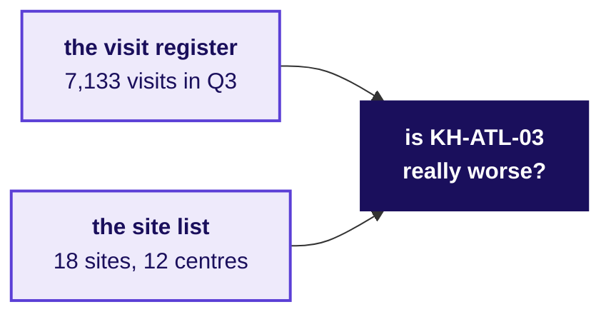

The files are `appointments` and `sites`. The brief sizes four ways a group could answer the question, from under an hour to about three, and names the Week 1 or 2 move each needs.

```notes
SELF-STUDY, 1 minute. Laboratories keep no visit register, so the file covers the twelve patient
service centres only. The brief is briefs/C2_W03_D01_brief_4_noshows_STUDENT.md.
Transition: question 5.
```

---

## S24. Campaign asks whether the offer caused 9 percent more
*What does the marketing head ask, what does the answer decide, and what does a wrong one cost?*

> "Our free at-home collection offer lifted bookings 9 percent. I want to offer it to every patient in all six metros. Can you confirm it worked?"
> The marketing head, Kalpa Health

```cards
icon: target | eyebrow: The answer decides | title: Extend, keep or stop | body: The offer to every patient in all six metros, as it is, or not at all.
icon: triangle-alert | eyebrow: A wrong answer costs | title: Visits paid for nothing | body: Every free collection sends a phlebotomist to a home.
icon: database | eyebrow: It starts from | title: Five files | body: The offer list, patients, both booking files and the sites.
```

```notes
LIVE, the Programme Head, 90 seconds. Read the marketing head's words. A collection at home means a
phlebotomist visits the patient; the offer waived its fee from 15 July, and the report counts the
weeks to 14 September.
Transition: the files behind it.
```

---

## D25. Campaign reads 2,381 offers against every booking
*Which files does the campaign question start from, and how big is each?*

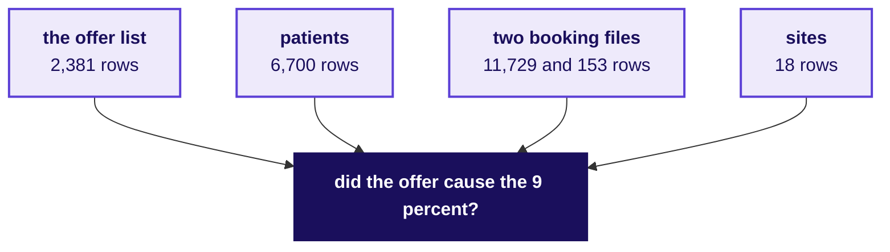

The files are `campaign`, `patients`, `bookings_legacy` and `bookings_newsys`, and `sites`. The brief sizes four ways a group could answer the question, from about two hours to about five, and names the Week 1 or 2 move each needs.

```notes
SELF-STUDY, 1 minute. The brief is briefs/C2_W03_D01_brief_5_campaign_STUDENT.md.
Transition: section 4, the method you already own.
```

---

## SECTION 4: Which method answers?
*Which moves from Weeks 1 and 2 could answer each of the five questions, and why does the week teach nothing new?*

```notes
LIVE, the Programme Head, about 7 minutes over S26, S27, S33 and S34. D28 to D32 show each Week 1
and 2 picture as the room drew it, for self-study. Nothing on these slides maps a question to a move;
that mapping is each group's work today.
Transition: who needs the method map.
```

---

## S26. Weeks 1 and 2 hold every move the week needs
*Who needs the method map today, and which questions come on the way?*

**Who needs the answer.** Every group, for Part 2 of its translation: the mini project's first criterion scores Dr Menon's words mapped to the right Weeks 1 and 2 method, and the mapping is the group's to make.

```timeline
label: 1 | title: The moves | body: Which moves do you own from Weeks 1 and 2?
label: 2 | title: The pictures | body: What did each look like when you drew it for Meera and Anand?
label: 3 | title: Nothing new | body: Why does the week teach nothing new, and where does help come from?
label: 4 | title: Your call | body: Who decides which move answers which question? | tone: dark
```

```notes
LIVE, the Programme Head, 1 minute. Read the four questions.
Transition: the moves, on one picture.
```

---

## S27. Ten moves from Weeks 1 and 2, on one picture
*Which moves do you own from Weeks 1 and 2?*

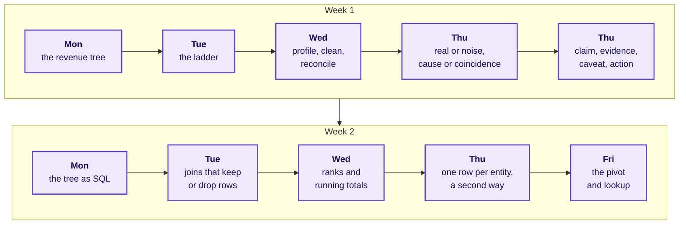

Every one of the five questions can be answered with these moves; the domain changes the words around them.

```notes
LIVE, the Programme Head, 2 minutes. Walk Week 1 left to right, then Week 2. Each box is a day the
room has done: Meera's tree, the drop investigated rung by rung, Anand's reconciliation with its
decisions log, the chance check and the fair comparison, the one-page note; then the same thinking
as SQL, joins proved before any sum, window functions, one row per customer in pandas, and the
workbook a director cannot break.
Ask: which of these did you find hardest? Hear two answers. Do not ask which fits which question.
Transition: the pictures, for anyone reading alone, then why nothing new is taught.
```

---

## D28. The revenue tree splits a total into branches
*What did the revenue tree look like when you drew it for Meera?*

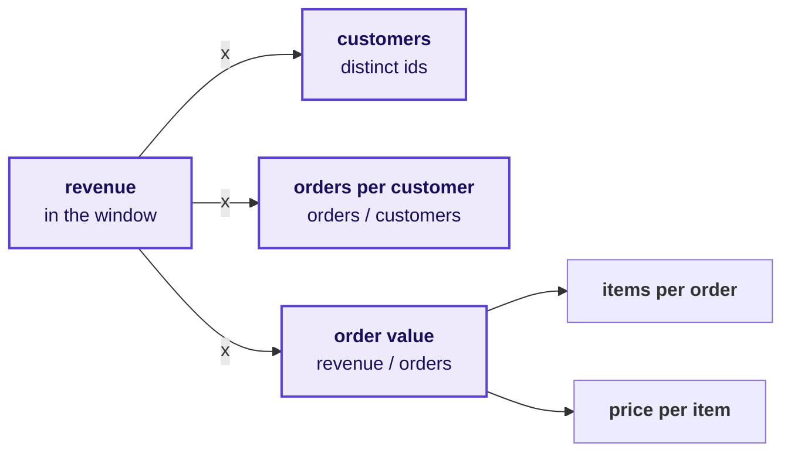

Every branch is a count over a denominator, and the branch that falls furthest short of the plan is where the question points.

```notes
SELF-STUDY, 1 minute. Week 1 Monday, Kalpa Retail: revenue as customers times orders per customer
times average order value, with the order's items and prices beneath. Redrawing it in Kalpa Health's
words is a group's work in Part 2 of the worksheet, and nobody draws it for the room.
Transition: the investigation ladder.
```

---

## D29. The ladder confirms a drop before explaining it
*What did the investigation ladder look like in Week 1, Tuesday?*

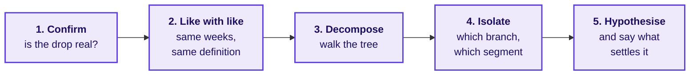

A reason offered before rung 1 is a guess about a number nobody has checked.

```notes
SELF-STUDY, 1 minute. Week 1 Tuesday asked whether revenue really fell from Q1 to Q2 once both
quarters covered the same weeks, before any branch was blamed.
Transition: profile, clean, reconcile.
```

---

## D30. Rows in must equal rows kept plus rows set aside
*What did Week 1, Wednesday prove before any number left the team?*

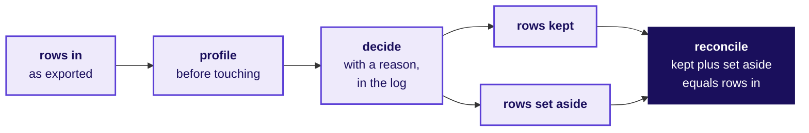

The decisions log records field, issue, rows, decision and reason, so that Anand's analyst could replay every call.

```notes
SELF-STUDY, 1 minute. This week's decisions log, briefs/C2_W03_D01_decisions_log_STUDENT.xlsx,
has the same five columns, and its Reconcile sheet checks rows in against clean plus removed for
every file.
Transition: real or noise, cause or coincidence.
```

---

## D31. A gap is read only after chance and fairness checks
*Which two questions did Week 1, Thursday ask before reading a gap as an effect?*

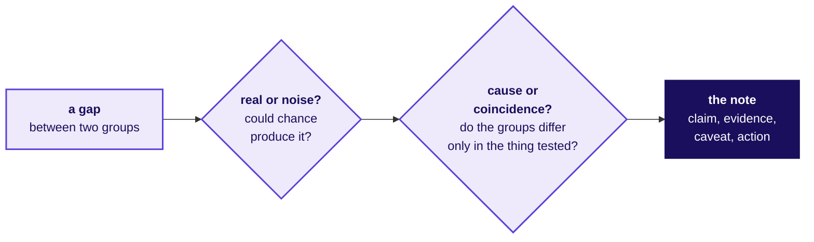

A permutation test answers the first question; checking that the two groups were alike before the thing tested answers the second.

```notes
SELF-STUDY, 1 minute. Week 1 Thursday ran both checks on Meera's numbers and wrote the answer as a
one-page note: the claim, the evidence, the caveat and the action.
Transition: joins.
```

---

## D32. A join is counted before anything is summed
*What did Week 2, Tuesday require before a joined number was trusted?*

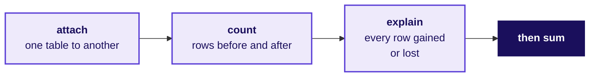

A join can drop rows it cannot match or repeat rows it matches twice, and the sum moves either way without a warning.

```notes
SELF-STUDY, 1 minute. Week 2 Tuesday: booked against collected, Anand's report, where the join was
proved before the number.
Transition: why nothing new is taught.
```

---

## S33. Nothing new is taught: the domain is what is new
*Why does the build week teach nothing new, and where does help come from?*

```cards
icon: book-open | eyebrow: What you have | title: Weeks 1 and 2 | body: The tree, the ladder, profile and reconcile, the chance and fairness checks, the note, SQL, pandas and Excel.
icon: map | eyebrow: What is new | title: The domain | body: Its words, its systems and what an error costs; you translate into it.
icon: life-buoy | eyebrow: When stuck | title: Log it, then ask | body: Write the challenge in the log, say what you tried, then ask a TA. | tone: dark
```

A trainer or TA answers every domain question, such as what a phlebotomist does, and answers a method question with a question back.

```notes
LIVE, the Programme Head, 2 minutes. The rule protects the week: a build week that teaches turns
into a teaching week with a project bolted on. The TAs' reply to "which method do we use?" is a
question back: which one did Meera's question need?
Transition: who decides which move fits which question.
```

---

## S34. Each group maps its own question onto a move
*Who decides which move answers which of the five questions?*


**Kavya's review.** Kavya Nair checks the baseline, the denominator, the evidence and a second way to the same number, so a plan needs a move that leads and a move that checks it.

```notes
LIVE, the Programme Head, 90 seconds. Say it plainly: nobody in this room will tell a group which
move fits its question. Each brief lists the ways a group could answer it, with what each costs, and
choosing among them, and saying why, is the translation.
Transition: section 5, who takes which question.
```

---

## SECTION 5: Who takes which question?
*How are the groups allocated to the five questions, and what happens where groups share one?*

```notes
LIVE, the Programme Head, about 5 minutes over S35 to S38. The allocation itself runs after the
domain's story, in its own 30 minutes; these slides say how it will run.
Transition: who needs the allocation settled.
```

---

## S35. The allocation runs after the domain's story
*Who needs the allocation settled, and which questions come on the way?*

**Who needs the answer.** Every learner: the question your group takes is the one you defend alone in Thursday's viva and together on Friday or Saturday.

```timeline
label: 1 | title: The groups | body: How many groups are there, and how big is each?
label: 2 | title: The allocation | body: How does the allocation run in its 30 minutes?
label: 3 | title: Shared questions | body: What happens where two or three groups take the same question? | tone: dark
```

```notes
LIVE, the Programme Head, 1 minute. Read the three questions. The allocation runs after the story so
that every group chooses knowing what a claim, a payer and a denial are.
Transition: the groups.
```

---

## S36. The plan is nine groups for five questions
*How many groups are there, and how big is each?*

```stats
value: 35 | label: learners | note: the plan for this cohort
value: 9 | label: groups | note: the plan: eight of four, one of three
value: 5 | label: questions | note: each with its own brief
value: 10 | label: files | note: every group holds all of them
```

A group of three carries the same brief as a group of four, and narrows its scope sentence where it must.

```notes
LIVE, the Programme Head, 1 minute. Every group holds all ten files whatever it takes. The group of
three asks for no lighter brief; its "we will not" says what it leaves out.
Transition: how the allocation runs.
```

---

## S37. The Programme Head allocates, then briefs are read
*How does the allocation run in its 30 minutes?*

```timeline
label: 1 | title: Groups confirmed | body: Every learner knows their group and its members.
label: 2 | title: The allocation | body: The Programme Head allocates the five questions to the groups.
label: 3 | title: The brief | body: Each group reads its own brief and opens the translation worksheet. | tone: dark
```

The allocation is settled in these 30 minutes and not before, so no group starts on a question it may not hold.

```notes
LIVE, the Programme Head, 90 seconds. Say how the allocation will run today, and say nothing that
promises a group a question before it runs. The trainer sheet holds the ways to allocate; the
Programme Head chooses one.
Transition: what happens where groups share a question.
```

---

## S38. Where groups share a question, the panel hears each
*What happens where two or three groups take the same question?*

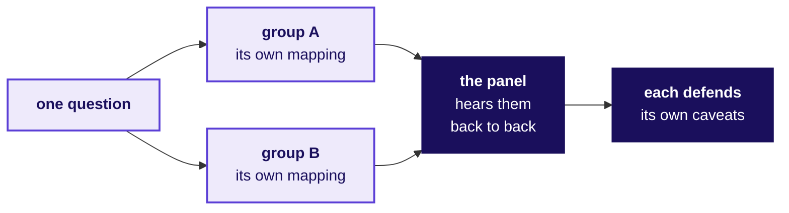

The same data supports more than one honest answer, so groups on the same question may talk about the domain and keep their mappings to themselves until the panel.

```notes
LIVE, the Programme Head, 90 seconds. The panel wants different viewpoints on the same question,
which is why the mapping stays inside each group until Saturday.
Transition: section 6, today's work.
```

---

## SECTION 6: What is today's work?
*How does a group turn its question into a plan by the close, and what goes in its logs?*

```notes
LIVE, the Programme Head, about 9 minutes over S39 to S45.
Transition: who needs a plan by tonight.
```

---

## S39. Today ends on a pinned scope and entry one
*Who needs each group's plan by tonight, and which questions come on the way?*

**Who needs the answer.** Your group on Wednesday: the checkpoint opens the day with three questions, and a group with no pinned scope spends the build week deciding what to build.

```timeline
label: 1 | title: The day | body: How do today's two blocks run?
label: 2 | title: The worksheet | body: What are the six parts of the translation?
label: 3 | title: The words | body: Which words map, and where does the map break?
label: 4 | title: The logs | body: What goes in the challenges log, and why today?
label: 5 | title: The checks | body: What do Kavya's four checks ask of a plan?
label: 6 | title: The scope | body: What does a pinned scope sentence say? | tone: dark
```

```notes
LIVE, the Programme Head, 1 minute. Read the six questions.
Transition: the day in two blocks.
```

---

## S40. Two blocks: listen and choose, then translate
*How do today's two blocks of 180 minutes run?*

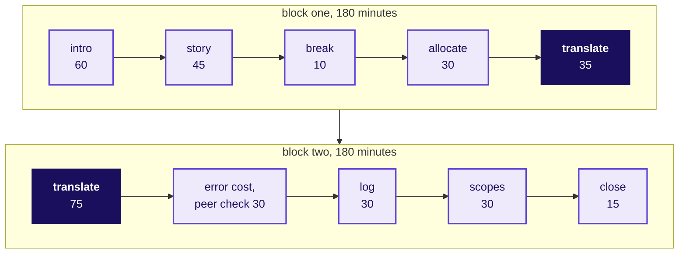

After the second block the time is open build time with the TAs; there is no practice set, quiz or test this week.

```notes
LIVE, the Programme Head, 2 minutes. Walk block one, then block two. The translation runs 35
minutes before lunch and 75 after it, then the cost of an error with a peer check between two groups
on different questions, entry one in the challenges log, the scope rounds, and the close.
Transition: the worksheet's six parts.
```

---

## S41. The worksheet asks six questions in order
*What are the six parts of the translation worksheet?*

```timeline
label: Part 1 | title: The words | body: What exactly is your stakeholder asking, as a question a dataset can answer?
label: Part 2 | title: The move | body: Which move from Weeks 1 and 2 leads, which checks it, and what would make you switch?
label: Part 3 | title: The vocabulary | body: Which Kalpa Health words map onto Kalpa Retail's, and where does the map break?
label: Part 4 | title: First three moves | body: Which file, which count, and what result would change the plan?
label: Part 5 | title: The cost of an error | body: What does a wrong answer cost, and to whom?
label: Part 6 | title: The scope | body: What will you do this week, and what will you not do? | tone: dark
```

```notes
LIVE, the Programme Head, 90 seconds. The worksheet is briefs/C2_W03_D01_translation_worksheet_STUDENT.md;
each group copies it into its repository as translation.md. It carries all five questions and the
Weeks 1 and 2 moves in a line each, so it is filled with nothing else open.
Transition: the vocabulary map.
```

---

## S42. Three pairs start the vocabulary map, you add five
*Which words map from Kalpa Retail to Kalpa Health, and where does the map break?*

| Kalpa Retail | Kalpa Health | What a group writes beside it |
|---|---|---|
| An order | A booking | Where it lives in the files, and what differs |
| An item | A test | Where it lives in the files, and what differs |
| A cancellation | A no-show | Where it lives in the files, and what differs |
| Five or more of your own | From your brief and the dictionary | Including words with no retail twin |

A pair that behaves the same in both businesses is useful; a pair that behaves differently is where the week's surprises live.

```notes
LIVE, the Programme Head, 1 minute. The three pairs come from the curriculum. Each group adds at
least five of its own, and the pairs that behave differently are the valuable ones. Do not add
pairs for the room.
Transition: the challenges log.
```

---

## S43. The challenges log starts with entry one today
*What goes in the challenges log, and why write entry one today?*

```cards
icon: circle-alert | eyebrow: What stopped us | title: The challenge | body: One sentence, and where it showed: a file, a column or a step.
icon: wrench | eyebrow: What we tried | title: The attempt | body: What the group did, including what did not work.
icon: check-check | eyebrow: What we decided | title: The decision | body: What you chose and why, or that it is still open. | tone: dark
```

Thursday's viva reads this log, so an entry written today is worth more than three written the night before.

```notes
LIVE, the Programme Head, 1 minute. The log is briefs/C2_W03_D01_challenges_log_STUDENT.xlsx; its
Example sheet shows one entry and its Summary sheet counts what is still open. A challenge that
needed a cleaning or matching call also goes in the decisions log.
Transition: Kavya's four checks.
```

---

## S44. A plan passes four checks before it is pinned
*What do Kavya's four checks ask of a group's plan?*

```cards
icon: ruler | eyebrow: Check 1 | title: The baseline | body: The scope sentence names what the number is compared with.
icon: divide | eyebrow: Check 2 | title: The denominator | body: Every rate in the plan says what it is out of.
icon: search-check | eyebrow: Check 3 | title: The evidence | body: Every first move names a file and a count.
icon: repeat | eyebrow: Check 4 | title: A second way | body: The headline number can be reached by another route. | tone: dark
```

In the peer check, two groups on different questions swap worksheets and run these four checks on each other.

```notes
LIVE, the Programme Head, 90 seconds. These are the four things Kavya Nair checks before any work
leaves the team, the same four the room met in Weeks 1 and 2.
Transition: the scope sentence.
```

---

## S45. A scope names what you count and what you will not do
*What does a pinned scope sentence say?*

> "We will answer ______ for ______, by counting ______ in ______, and we will not ______."
> The scope sentence each group signs at the close

```cards
icon: shopping-cart | eyebrow: A Kalpa Retail example | title: Meera's question | body: We will answer whether acquisition is the short branch for Meera, by counting customers, orders each and order value in the orders file, and we will not forecast next quarter.
```

```notes
LIVE, the Programme Head, 1 minute. The example is from Kalpa Retail on purpose; each group writes
its own for Kalpa Health. The "we will not" is what keeps a group of four from spending Thursday on
something nobody asked.
Transition: section 7, when the week is scored.
```

---

## SECTION 7: When is the week scored?
*Which events are scored this week, on which days, on what criteria, and what happens if a demo fails?*

```notes
LIVE, the Programme Head, about 12 minutes over S46 to S53, with a minute spare for questions.
Transition: who needs the week's scoring.
```

---

## S46. Three scored events, each on its own day
*Who needs the week's scoring today, and which questions come on the way?*

**Who needs the answer.** Every learner: the mock and the group discussion score you alone, and the presentation scores every member on the caveat, so nobody can leave the understanding to a teammate.

```timeline
label: 1 | title: The week | body: How does the week run, day by day?
label: 2 | title: What ships | body: What does every group ship, and when is it seen?
label: 3 | title: The project | body: How is the mini project scored, and what if the demo fails?
label: 4 | title: The mock | body: How is Mock R1 scored?
label: 5 | title: The discussion | body: How is the group discussion scored? | tone: dark
```

```notes
LIVE, the Programme Head, 1 minute. Read the five questions.
Transition: the week, day by day.
```

---

## S47. Five days of build, and Tuesday is Dussehra
*How does the week run, day by day?*

```timeline
label: Monday 19 October | title: Translate and scope | body: This introduction, the domain's story, the allocation, the translation, and scopes pinned at the close.
label: Wednesday 21 October | title: Profile, clean, reconcile | body: The checkpoint, the trainer's build of a smaller slice in the open, build time, and each group's headline claim.
label: Thursday 22 October | title: Mock R1, build complete | body: Every learner sits Mock R1, about 20 minutes, half technical and half a viva on the group's work.
label: Friday 23 October | title: Discussions and the freeze | body: The expert's group discussions, about 30 minutes per group; builds freeze; two cold demo runs; the first presentations.
label: Saturday 24 October | title: Presentations and closure | body: The remaining discussions, presentations with live demos of 25 to 30 minutes, and every Build 1 grade closed. | tone: dark
```

```notes
LIVE, the Programme Head, 2 minutes. Tuesday 20 October is Dussehra, a holiday with no session, so
Wednesday carries two build days. Three things to land: the headline claim is stated on Wednesday
so that Thursday tests it; the mock's viva runs on the group's own work, so the challenges log is
revision; the group discussions run on prompts separate from the project. The time after the
second block each day is open build time with the TAs.
Transition: what every group ships.
```

---

## S48. Every group ships five things, one of them live
*What does every group ship, and when is each piece seen?*

| What | What it holds | When it is seen |
|---|---|---|
| The presentation | The answer, a live demo run cold, the panel's questions | Friday 23 or Saturday 24 October |
| The one-slide answer | Claim, evidence, caveat, action, for Dr Menon's board | The presentation |
| The notebook or SQL | Every number reproduced from the raw files, top to bottom | The live demo |
| The decisions log | Every cleaning call, with every file reconciled | Scored in the mini project |
| The challenges log | Every stop, dated as it happened, from entry one today | Read in Thursday's viva |

```stats
value: 40 | label: mini project | note: marks, the presentation included
value: 30 | label: mock interview | note: marks, Thursday 22 October
value: 30 | label: group discussion | note: marks, Friday and Saturday
```

```notes
LIVE, the Programme Head, 90 seconds. The marks per event are locked: mini project 40 with the
presentation inside it, mock 30, group discussion 30. The live demo runs cold: a fresh start, the raw
files, top to bottom.
Transition: how the mini project is scored.
```

---

## S49. The mini project is 40 marks, and 6 are yours alone
*How is the mini project scored?*

<!-- sync:rubric:W03/mini-project -->
**Mini project, 40 marks.** The first four criteria are scored once for the group, and every member receives those 34 marks; presentation and defence is scored for each learner on 6 marks, so a silent teammate cannot ride the group's score.

| Criterion | Marks | What full marks look like |
|---|---|---|
| The question translated | 8 | Dr Menon's words are mapped to the right Weeks 1 and 2 method, with the metric defined and the decision it feeds named. |
| The data made trustworthy | 10 | The data is profiled before it is touched, every cleaning call is in the decisions log with its reason, and counts and dollars reconcile across files. |
| The analysis | 10 | The tree, ladder or fair comparison reaches the branch that explains the symptom, on the right denominator, with a chance test where one is needed. |
| The claim | 6 | One sentence carries its number, denominator, period and caveat, plus an action Dr Menon can take. |
| Presentation and defence | 6 | The live demo runs cold, and every member answers a challenge on the caveat. |
<!-- /sync:rubric:W03/mini-project -->

```notes
LIVE, the Programme Head, 2 minutes. Read the five criteria and stop on the first and the last. The
first, the question translated, is scored on exactly the work the groups do today. The last means
every member answers a challenge on the caveat, so a group that splits the work and not the
understanding loses marks one learner at a time.
Transition: what happens if the live demo fails.
```

---

## S50. A failed demo costs its own marks, never the analysis
*What happens if the live demo fails in front of the panel?*

```mermaid
flowchart LR
    R["<b>the demo runs once</b><br/>cold, on the raw files"] --> F{"<b>it fails</b>"}
    F --> T["<b>two minutes</b><br/>to recover it live"]
    T --> S{"<b>still fails</b>"}
    S --> E["<b>present from</b><br/>the executed notebook"]
    E --> M["<b>the demo scores</b><br/>as not run cold;<br/>34 marks from the run"]
    classDef known fill:#EEEAFB,stroke:#5B3FD6,color:#1A0F5C,stroke-width:2px
    classDef bad fill:#FBE9EF,stroke:#D63A6A,color:#1A0F5C
    class R,T,E known
    class F,S,M bad
```

The other 34 marks are scored from the executed run, so a demo that fails costs the live demo's share of presentation and defence and nothing more.

```notes
LIVE, the Programme Head, 1 minute. The rule runs on both expert days, as it would in front of a
client: one cold run, two minutes to recover, then the executed notebook.
Transition: Mock R1.
```

---

## S51. Mock R1 is 30 marks: a technical half and a viva
*How is Mock R1 scored on Thursday 22 October?*

<!-- sync:rubric:W03/mock -->
**Mock interview R1, 30 marks.** Each learner is scored alone, 15 marks on the technical half and 15 on the project viva.

| Half | Criterion | Marks |
|---|---|---|
| Technical | Correctness | 8 |
| Technical | Reasoning aloud with numbers | 4 |
| Technical | Handling a follow-up | 3 |
| Project viva | The translation, with one decision defended by evidence | 6 |
| Project viva | Defending a caveat under challenge | 6 |
| Project viva | What they would do differently | 3 |
<!-- /sync:rubric:W03/mock -->

```notes
LIVE, the Programme Head, 1 minute. The technical half is Weeks 1 and 2; the viva half is the
group's own work, which is why the challenges log is revision.
Transition: the group discussion.
```

---

## S52. The group discussion is 30 marks, each learner alone
*How is the group discussion scored on Friday and Saturday?*

<!-- sync:rubric:W03/gd -->
**Group discussion, 30 marks.** Each learner is scored alone.

| Criterion | Marks | What full marks look like |
|---|---|---|
| Structures the problem | 8 | The learner frames the decision and the metric before arguing. |
| Uses evidence | 8 | The learner takes a position and defends it with a number from the exhibit. |
| Engages | 8 | The learner builds on or challenges another member's point and brings a quiet member in. |
| Lands a conclusion | 6 | The discussion ends on a recommendation and its main risk. |
<!-- /sync:rubric:W03/gd -->

The group discussion rounds run on Friday 23 October and close on the morning of Saturday 24 October.

```notes
LIVE, the Programme Head, 1 minute. The group discussion is a thread separate from the project.
Point at "Engages": bringing a quiet member in earns marks, and talking over one does not.
Transition: how Monday closes.
```

---

## S53. Monday closes on pinned scopes and two questions
*What does Monday end on, and what does Wednesday open with?*

| When | What each group does |
|---|---|
| The close today, 15 minutes | Reads its one-sentence scope aloud, with the one thing it will not do |
| After today's blocks | Starts the build against its own scope, and logs challenges as they happen |
| Wednesday 21 October, 30 minutes | Answers the day's three checkpoint questions, two minutes per group |
| Wednesday 21 October, 20 minutes | States its headline claim, with its denominators and caveat |

**In the interview.** [F] What changes when the cost of an error is a missed diagnosis rather than a missed sale?

```notes
LIVE, the Programme Head, 2 minutes, then the spare minute for questions. The checkpoint questions
are not shared today; a group that cannot answer them on Wednesday is stuck, and Wednesday is the
day to say so, because Thursday opens the mocks.
Close on the [F] question and leave it on screen as the room breaks for the domain's story. Each
group answers it for its own question in Part 5 of the worksheet; nobody answers it for them.
```
