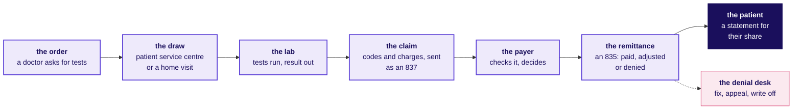
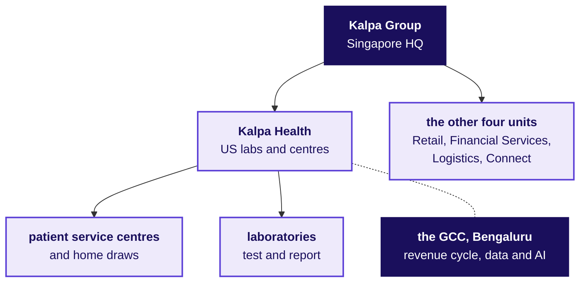
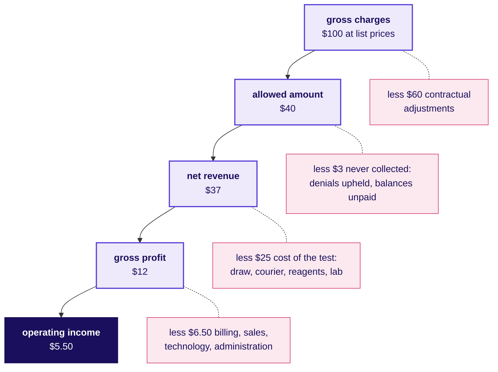
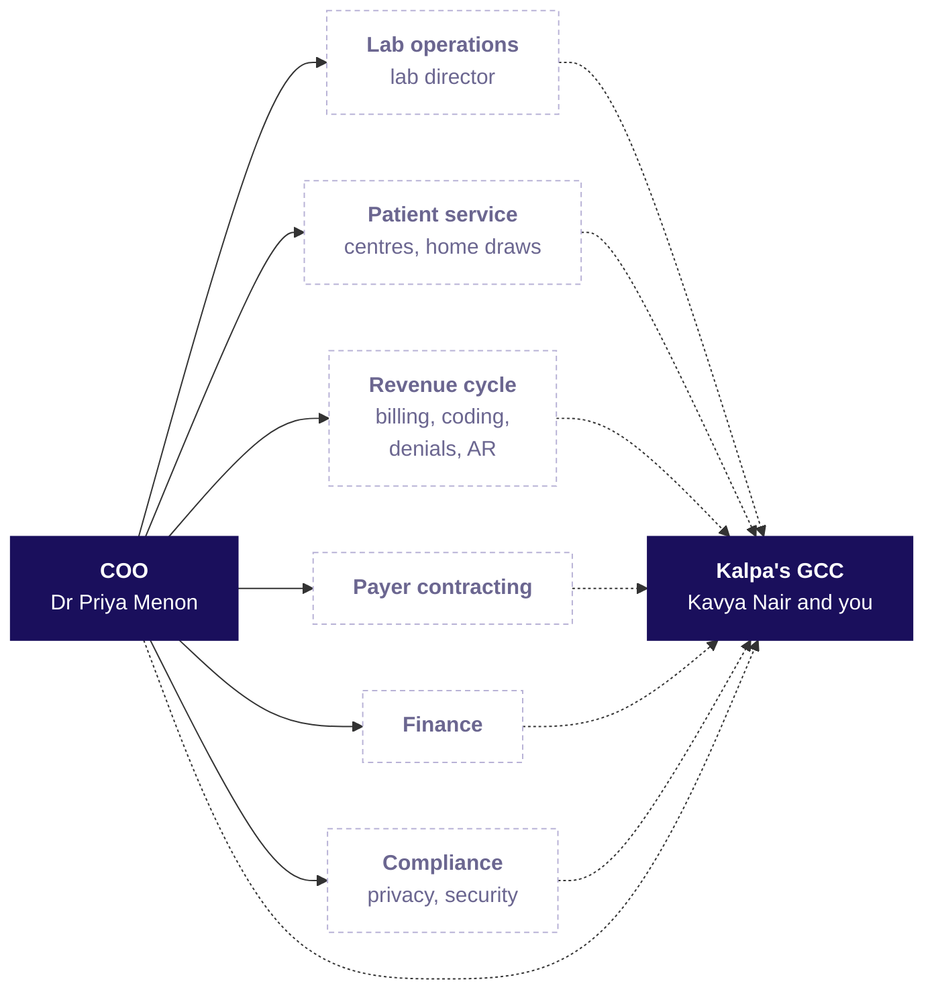
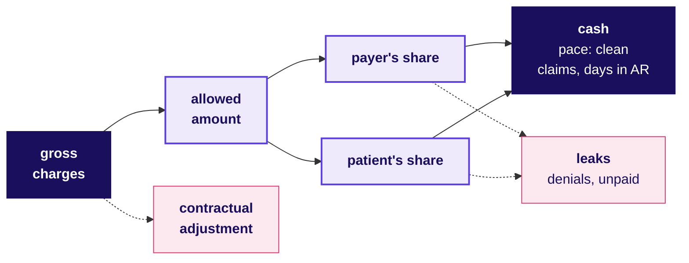
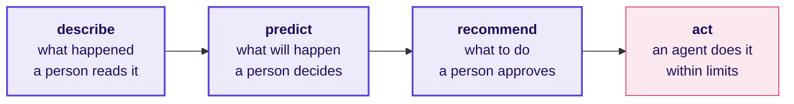

# Kalpa Health from the inside: how a US lab gets paid, who decides, and where data earns its keep

**Build 1, Monday · The domain before the data · US healthcare, and the real companies Kalpa Health resembles**

The business you work inside for Build 1: how a blood test in a US city becomes a claim, a payment and a line in a profit and loss statement, who pays for it, who at Kalpa Health asks the data team for what, every revenue-cycle metric as a formula with a worked number and the trap it hides, the words a stakeholder meeting assumes you know, and the rules that decide what an analyst in Bengaluru may see.

About a 40 minute read · 6 diagrams and 25 tables

> Kalpa Group, Kalpa Health, its people, its patients and its numbers are fictional, and every Kalpa Health record is synthetic, so no real patient's information exists anywhere in the programme. The real companies named here are analogies, each fact about them checked on 30 September 2026 against the source named beside it, and none of them is Kalpa's model. A number marked illustrative is a round number chosen for easy arithmetic, neither Kalpa's data nor any real company's.

---

## 1. A day in the life of a US lab

One weekday at one Kalpa Health patient service centre in a US metro area, at the laboratory its samples travel to, and at the GCC in Bengaluru introduces the roles and most of the numbers the rest of the dossier uses. The numbers are illustrative, chosen for easy arithmetic, except Dr Priya Menon's figures at the end, which are the story's own. The patient, James Carter, is as synthetic as every Kalpa Health record.

**The order comes first.** A week earlier James's doctor saw him for his diabetes and wrote an order, which a lab calls a **requisition**: a blood sugar test that shows his average over about three months, the HbA1c, and a cholesterol panel, a group of tests ordered and billed together. The requisition carries the reason for the tests as a diagnosis code, E11.9 for type 2 diabetes without complications, the doctor's identifier and James's insurance. Nothing about the tests is Kalpa Health's choice; a lab tests what a doctor orders.

**At the front desk** of the patient service centre, the place where a lab draws blood, the registration clerk scans James's insurance card, and an electronic question to his health plan comes back in seconds: the plan is active, the lab is in its network, and James still has $400 of his yearly deductible to pay before the plan pays anything. The clerk tells him, before a needle is out, that today's tests may land on that deductible. An older patient behind him is on Medicare and has an order for a test that Medicare may not pay for with the reason his doctor gave; the clerk hands her a form to sign that says so, before the draw, so that the bill can go to her if Medicare refuses (section 7 names the form).

**In the draw room** a phlebotomist, the person trained to draw blood, fills two tubes and sticks a barcode on each. The barcode is the **accession number**, the key that ties each tube to James's requisition for the rest of its life. The centre draws blood from 90 patients in the day, and a mobile phlebotomist visits 8 patients at home who cannot travel.

**At the laboratory** a courier brings the day's tubes in the evening. Machines called analysers run the tests overnight, a technologist checks the results that fall outside the usual range, and James's results are released to his doctor's system and his patient portal the next morning, 18 hours after they were drawn. That time, from the draw to the released result, is the lab's **turnaround time**, and it is what doctors notice first.

**In the billing system**, James's requisition becomes a claim. Each test gets its procedure code, the diagnosis code travels with it, and the price comes from the lab's own price list, the **chargemaster**: $180 of **gross charges** for the two tests. The claim leaves as an electronic file called an 837, through a **clearinghouse** that checks its format and forwards it to the plan. That day one of the centre's 90 claims bounces back from the clearinghouse within minutes because a member ID was typed with a digit missing. It was never seen by the plan, so it is a **rejection**, fixed and resent the same day.

**Three weeks later** the plan's answer arrives as another electronic file, an 835, the **remittance**. Of James's $180, the plan's contract with Kalpa Health allows $60, the **allowed amount**; the other $120 is a **contractual adjustment** that the lab agreed never to collect. The plan pays nothing, because the $60 falls inside James's deductible, and a code on the remittance says so: the $60 is **patient responsibility**, and James gets a statement. On the same remittance another patient's claim is **denied**, with a code that says the plan's approval was needed before that test and was never asked for. That claim is now work.

**At the GCC in Bengaluru**, where it is already the next day, Kalpa Health's revenue-cycle team picks up what the US day left. Coders check the claims that failed the billing system's checks. The accounts receivable team works claims still unpaid after 30 days, asking each plan where the money is. Kavya Nair's data and AI team refreshes the revenue-cycle dashboard from the day's claims and remittances, and none of them sees James's name, because the tables they query carry an identifier in its place (section 7 says why).

**On Monday** the COO, Dr Priya Menon, reads one page: the business grew 5 percent against a plan of 18, and she wants to know which part of it is short. That is the question Build 1 answers.

---

## 2. Which real company is Kalpa Health like

If you have had a blood test in India, you probably paid at the counter or on an app, and the lab's bill ended there. In the US the same draw usually starts a conversation between three parties, the lab, the patient's health plan and the patient, which can take weeks to settle. The US spent $5.3 trillion on health care in 2024, $15,474 a person and 18.0 percent of its economy (CMS, National Health Expenditure fact sheet, updated 24 June 2026), and a great deal of the work inside that number is the paperwork of who owes whom.

### The labs Kalpa Health resembles

Kalpa Health is a diagnostics business serving the US market: its laboratories and patient service centres test US patients and bill US payers (client zero, section 1c). Two real companies have that shape at national scale.

**Quest Diagnostics** reported net revenues of $11,035 million for 2025, $10,785 million of them from diagnostic testing. It processed about 244 million test requisitions that year, and many of its about 2,400 patient service centres sit inside large retail stores (Quest Diagnostics, Form 10-K for 2025, filed 26 February 2026). Since November 2023 it has also sent phlebotomists to patients' homes, launching with 5,000 of them (Quest newsroom, 9 November 2023).

**Labcorp** reported revenue of $13,951.7 million for 2025, $10,876.5 million of it from its diagnostics laboratories, with more than 2,200 patient service centres and more than 7,000 phlebotomists placed inside doctors' offices (Labcorp Holdings, Form 10-K for 2025, filed 24 February 2026).

Both measure their testing business the same way: how many requisitions came in, and how much revenue each brought. Quest defines the requisition as the form that travels with the specimens, "indicating the test(s) to be performed and the party to be billed for the test(s)" (10-K for 2025). That last phrase is the whole of section 3: every requisition names someone to bill, and it is often someone other than the patient.

### The team you join, and its real twins

Kalpa Health's analytics and revenue-cycle work runs from Kalpa's GCC in Bengaluru (client zero, section 1c). India has many teams doing that work for US health care, of two kinds.

| Kind | Real examples, each as the company describes itself | What the work is |
|---|---|---|
| The Indian centre of a US health company, its own team in India | Optum India, which UnitedHealth Group calls its largest Global Capability Centre, with hubs in Gurugram, Noida, Bengaluru, Hyderabad, Pune and Chennai (UnitedHealth Group careers, India); Carelon Global Solutions, "born out of one of the largest health plans in the U.S.", in Bengaluru, Hyderabad and Gurugram (carelonglobal.in); Evernorth, part of The Cigna Group, which opened a hub in Hyderabad in 2024 (The Cigna Group careers, Evernorth India) | Technology, analytics and operations for the parent's own business |
| A revenue-cycle company serving many US providers | AGS Health, with Indian centres including Chennai, Hyderabad and Bengaluru and more than 15,000 revenue-cycle staff (agshealth.com); Access Healthcare, with Indian centres including Chennai, Bengaluru and Hyderabad, offering coding, accounts receivable and denial management (accesshealthcare.com); Omega Healthcare, offering coding, billing, accounts receivable follow-up and denials and appeals management (omegahms.com) | Coding, billing, denial management and follow-up on unpaid claims, for hospitals, labs and doctors' practices |

Kalpa's GCC is the first kind: one company's own centre, serving its units, with Kalpa Health among them. Your stakeholders run a business in US cities and judge you by whether their decision improved, and at Kalpa a senior on your own team, Kavya Nair, checks every number first.

Quest and Labcorp are listed companies with thousands of centres. Kalpa Health is fictional, and the story fixes only its setting: dollars, US metro areas, payers, claims, denials and prior authorisation, Dr Priya Menon as COO, and synthetic records; every size in this dossier is illustrative.

---

## 3. How the business makes money

James's tests went out at $180 and brought $60, and not a cent of it came from his plan. Where the rest went is the lab's profit and loss statement, and it starts with who pays.

### Who pays for a test

A US lab bills four kinds of payer, and Quest's own split shows how differently each weighs.

| Payer | Who they are | Share of Quest's 2025 testing requisitions | Share of its testing revenue | Share of what it was owed at year end |
|---|---|---|---|---|
| Health insurers | Commercial plans, most bought through an employer, and the private plans that run Medicare Advantage and many Medicaid programmes | 43 percent | 39 percent | 27 percent |
| Government payers | Traditional Medicare and Medicaid, paying from their own fee schedules | 17 percent | 16 percent | 8 percent |
| Clients | Doctors, hospitals and employers the lab bills directly, who may bill onward | 37 percent | 31 percent | 43 percent |
| Patients | Patients without coverage, and every insured patient's deductible, coinsurance and copay | 1 percent | 12 percent | 20 percent |

Source: Quest Diagnostics, Form 10-K for 2025, which says the patient line includes coinsurance and deductibles. Read the last row twice: patients sent 1 percent of the requisitions billed to them and carried 20 percent of what Quest was waiting to collect, because a patient's balance is small, arrives late and is paid last.

Behind those payers: employment-based insurance covered 53.5 percent of Americans in 2025 and 7.9 percent had no coverage all year (US Census Bureau, 15 September 2026), and 55 percent of the Medicare beneficiaries able to choose were in a Medicare Advantage plan run by a private insurer in March 2026 (KFF, 5 June 2026). A lab's payer mix, the share of its tests each payer pays for, decides its prices more than its price list does.

### From gross charges to operating income

Below, $100 of gross charges travels through an illustrative lab shaped like Kalpa Health. The amounts are illustrative, set close to Quest's reported shape, and the order of the lines is every lab's.

**Gross charges** are the tests billed at the lab's own list prices, and almost nobody pays them. Each payer's contract or fee schedule sets an **allowed amount** for each test, and the difference is a **contractual adjustment**, written off because the lab signed a contract saying so. The allowed amount splits into the payer's share and the patient's responsibility. Some of it never arrives, because a denial is upheld or a patient never pays, and what the lab expects to collect is **net revenue**. That is the number labs report: Quest records revenue at the amount it expects to receive, and its estimate includes "the impact of contractual allowances (including payer denials), and patient price concessions" (10-K for 2025).

Below net revenue the P&L looks like any other business. **Cost of services** is what performing the tests costs: the draw, the courier, the reagents, the analysers, the lab staff and the buildings. What is left is **gross profit**, and after selling, general and administrative costs, billing and technology among them, **operating income**. Quest reported cost of services of 66.8 percent of net revenues in 2025, selling, general and administrative costs of 17.8 percent, and an operating income of 14.1 percent, $1,556 million (10-K for 2025). The illustration's $5.50 of $37 is 14.9 percent.

So of every $100 a lab bills at list price, about $37 is revenue and about $5 is operating income. A $1 leak from the $40 allowed, a denial upheld or a balance unpaid, is 2.5 percent of the allowed amount and 18 percent of the operating income.

### One claim, from charge to contribution

| Line | $, illustrative | What it is |
|---|---|---|
| Gross charges | 180 | James's two tests at chargemaster prices |
| Contractual adjustment | 120 | Written off under his plan's contract |
| Allowed amount | 60 | The contract's price for the two tests |
| Paid by the plan | 0 | The $60 fell inside his deductible |
| Patient responsibility | 60 | Billed to James on a statement |
| Cost of performing the tests | 40 | The draw, the courier, the reagents and the lab's time, at the same share of revenue as the illustration above |
| Cost of billing and collecting | 5 | The claim, the remittance posting and two patient statements |
| Contribution if James pays | 15 | What the claim adds towards fixed costs |
| Contribution if James never pays | minus 45 | The tests were performed and paid for by the lab alone |

The same tests for a patient whose deductible was met would have brought most of the $60 from the plan within weeks, less any coinsurance or copay. For a patient on traditional Medicare they bring the fee schedule's price and, for most covered lab tests, nothing from the patient (section 7). Those prices are small: Medicare's fee schedule for the last quarter of 2026 pays between $7.77 and $13.39 for each of four routine blood-test codes, 85025, 80053, 83036 and 80061 (CMS, Clinical Laboratory Fee Schedule file for 2026, fourth quarter). The test is identical in all three cases, and the payer and the plan year decide what it earns.

### The paperwork: codes and transactions

A claim is a set of codes, and a lab gets paid only when every one is right. Five code sets and five electronic transactions carry James's tests from the order to the cash.

| Code or transaction | What it says | Who keeps it |
|---|---|---|
| CPT | Which procedure was performed: each test or panel has a five-digit code, and the pathology and laboratory codes run from 80000 to 89999 (CMS, NCCI policy manual for 2026, chapter 10) | The American Medical Association, whose CPT Editorial Panel is appointed by the AMA Board of Trustees; the descriptions are the AMA's copyright (AMA, CPT overview) |
| HCPCS Level II | Supplies, services and some tests that CPT does not cover, as one letter and four digits; CPT itself is HCPCS Level I | CMS, which publishes the files every quarter (CMS, HCPCS pages) |
| ICD-10-CM | Why the test was ordered: the diagnosis. James's is E11.9, "Type 2 diabetes mellitus without complications" | The National Center for Health Statistics at CDC; each year's code set takes effect on 1 October, so the set in use from 1 October 2026 is the 2027 one (CDC; CMS ICD-10 page) |
| NPI | Who ordered and who billed: "a unique 10-digit number used to identify health care providers" | CMS, through its provider registry, NPPES (CMS, NPI page) |
| 270 and 271 | The eligibility question at the front desk and the plan's answer | X12, as HIPAA's adopted standard, version 5010 since 1 January 2012 (CMS, adopted standards) |
| 278 | A request for a plan's review of a service, prior authorisation among them | X12 |
| 837 | The claim itself, in its professional (837P) or institutional (837I) form | X12 |
| 276 and 277 | "Where is my claim?" and the plan's answer | X12 |
| 835 | The remittance: what was paid, adjusted or denied, claim by claim, with the reasons as codes | X12; Medicare sends every electronic remittance as an 835 in version 5010 (CMS) |

**The reason codes on an 835.** Each dollar not paid carries a group code, which says who bears it, and a claim adjustment reason code, a CARC, which says why; remittance advice remark codes, RARCs, add detail. A committee under X12 maintains the CARCs and CMS maintains the RARCs, and X12 publishes both lists, updated three times a year (CMS, Claims Processing Manual, chapter 22). The four group codes are CO, a contractual obligation the lab absorbs; PR, patient responsibility; OA, other adjustments; and PI, a reduction the payer initiated. Six CARCs a lab sees every week, in X12's own words:

| CARC | X12's description | What the lab does next |
|---|---|---|
| 1 | "Deductible Amount" | Bills the patient |
| 2 | "Coinsurance Amount" | Bills the patient |
| 16 | "Claim/service lacks information or has submission/billing error(s)." | Corrects the claim and sends it again |
| 29 | "The time limit for filing has expired." | Writes it off, and asks why it went late |
| 50 | "These are non-covered services because this is not deemed a 'medical necessity' by the payer." | Checks the diagnosis and the documentation, then appeals or bills the patient where an ABN was signed |
| 197 | "Precertification/authorization/notification/pre-treatment absent." | Asks whether approval was needed and missed, and fixes the step that missed it |

James's remittance carried group code PR with CARC 1: the $60 is his, and the reason is his deductible.

### Working capital: the wait for the money

A lab pays for reagents, couriers and staff the week it performs a test, and collects weeks or months later, so it lives on the gap. The measure is **days in accounts receivable**, the receivable divided by a day's net revenue. Quest calls its version days sales outstanding, "a measure of billing and collection efficiency", and reported 48 days at the end of both 2025 and 2024 (10-K for 2025). Plans pay in weeks, patients in months, appeals in months more, and every payer sets a **timely filing limit** after which a claim that was never sent, or sent wrong, cannot be paid at all (section 7 gives Medicare's).

---

## 4. Who decides what: the org chart and who asks

On Monday morning, before any analysis runs, several people at Kalpa Health already want something from the data team, and each loses something different when a number is wrong. The chart shows the usual shape of a US diagnostics business, drawn for orientation: the story names Dr Priya Menon and leaves the other heads unnamed, so their boxes are dashed.

Solid arrows are reporting lines, and every dotted arrow is an ask that reaches the data team. The revenue-cycle work itself runs from the GCC too (client zero section 1c), so some of the people who ask sit a floor away from you in Bengaluru, and the people they answer to sit in the US.

| Role | Owns | Asks the data team | What a wrong number costs them | At Kalpa Health |
|---|---|---|---|---|
| COO | Growth against plan, and where money and staff go | Which part of the business is short, and what do I do about it? | Staff and money moved to the wrong centres or the wrong payers | Dr Priya Menon |
| Lab director | Test quality, the analysers, turnaround time, the lab's certificate (section 7) | Where is turnaround slipping, and how many samples will arrive tomorrow? | Late results that doctors notice, or a night shift staffed for the wrong volume | Not named |
| Patient service operations | The centres, the phlebotomists and the home visits | Which centres are overloaded, and where should the next one open? | Queues in one centre and idle staff in the next | Not named |
| Revenue cycle | Coding, claims, denials, appeals, the accounts receivable | Which claims will be denied, which denials are worth appealing, and which unpaid claims to chase first? | Money left uncollected, or claims chased past the payer's filing deadline | Not named; the team works from the GCC |
| Payer contracting | The contracts that set each plan's allowed amounts | What does each plan really pay us for each test, against what the contract says? | A contract renewed at rates the plan quietly underpays | Not named |
| Finance | The books, the monthly close, cash | Do your numbers match my books, and when does the cash arrive? | Revenue reported that never turns into cash | Not named |
| Compliance, with the privacy and security officials | What data may be used, by whom, for what | Does this analysis need patient-level data at all, and who can see it? | A breach of patients' data, with fines and patients to notify | Not named |
| Physician and client services | The doctors' practices that send orders | Which practices wait longest for their results, and what do they order most? | A practice lost to a faster lab without anyone noticing | Not named |
| Data platform | The warehouse and its pipelines | Query it, do not export it; tell me before you break it. | One broken feed reaches every dashboard | The data platform lead |
| Data and AI team | The analyses and models, and whether they are trusted | Show me the baseline, the evidence, and a second way to reach the number. | Trust, which one wrong number can lose | Kavya Nair, the senior analyst, and the trainees |

The tension that runs through a lab sits between the first rows and the last ones: operations is measured on tests performed and results out on time, the revenue cycle on dollars collected, and a test that was performed perfectly can still earn nothing if its claim went out wrong.

---

## 5. The metrics, as formulas

James's tests were charged at $180, allowed at $60 and owed by James. When a lab's cash falls short, each of those numbers is a suspect: the lab charged less, the plans allowed less, more claims were refused, or the money is still on its way, and a metric exists to say which.

A lab earns when it performs a test and collects for it. How many tests it performs, and where, is a tree you have drawn before in Kalpa Retail's words, and Build 1 is where you draw it again in these. This section is the other half: what happens to a test's charge on its way to cash, which a retail tree never needed because a shopper pays at the till. Below, the ten metrics on the card come as a formula, a worked number, the trap that most often makes each lie, and who asks for it.

The picture to keep from this dossier is the tree below. Gross charges are what the lab bills at its own prices; the contracts take most of that away before anyone pays, and what is left, the allowed amount, splits between the payer and the patient. Denials and unpaid patient balances leak out before the money arrives, and two measures set the pace of the rest: how clean the claims are when they leave, and how long the money takes to come back.

Every worked number below is illustrative, from one month at one Kalpa Health laboratory: 12,000 claims went out carrying $2,400,000 of gross charges, the plans' contracts allowed $960,000 of it, and the lab expects to collect $888,000 in the end.

### Gross charges

| | |
|---|---|
| Formula | Gross charges = each test billed x its price on the lab's chargemaster, summed |
| Worked | $2,400,000 for the month, an average of $200 a claim; James's two tests, $180 |
| The trap | A price-list rise reads as growth: raise every chargemaster price 8 percent and gross charges rise 8 percent while the contracts allow the same dollars, so no test and no dollar was added |
| Who asks | Finance, and anyone who sees gross charges on a dashboard and mistakes them for money |

### Allowed amount

| | |
|---|---|
| Formula | Allowed amount = the most the payer's contract or fee schedule permits for a covered test = the payer's share + the patient's responsibility |
| Worked | $960,000 of the month's $2,400,000, 40 percent; James's $60 of $180 |
| The trap | The allowed amount arrives only on the remittance, weeks after the claim, so an average allowed amount for last month counts the claims the quick-paying plans have already answered and leaves out the slow ones |
| Who asks | Payer contracting and finance |

### Contractual adjustment

| | |
|---|---|
| Formula | Contractual adjustment = gross charges less the allowed amount |
| Worked | $2,400,000 less $960,000 is $1,440,000, 60 percent of charges; James's $120 |
| The trap | Calling it a loss: nobody expected to collect it, so "we lose 60 percent of revenue to write-offs" describes a price list, and the leaks worth chasing are the denials and unpaid balances inside the allowed amount |
| Who asks | Finance, and every new analyst the first time they see it |

### Net revenue

| | |
|---|---|
| Formula | Net revenue = gross charges less contractual adjustments, less what the lab expects never to collect (denials it will not overturn and patient balances that will go unpaid) |
| Worked | $2,400,000 less $1,440,000 less $72,000 is $888,000, 37 percent of charges |
| The trap | Last month's net revenue is an estimate, because most of its money has not arrived, and it is corrected as the remittances and patient payments come in, so the latest months move after they are first reported |
| Who asks | Finance, the COO and investors |

### Patient responsibility

| | |
|---|---|
| Formula | Patient responsibility = deductible + coinsurance + copay, the part of the allowed amount the patient owes |
| Worked | $144,000 of the month's $960,000 allowed, 15 percent; all of James's $60, because it fell inside his deductible |
| The trap | A deductible runs for a plan year, so patients owe more of each bill early in the plan year and less once their deductibles are met; a month early in the plan year set beside a month late in it shows patients paying worse when their bills only changed shape |
| Who asks | The revenue cycle and finance, since a patient balance is slower and less certain money than a plan's |

### Denial rate

| | |
|---|---|
| Formula | Initial denial rate = claims denied in full or in part on their first answer from the payer / claims submitted, in the same period and on one stated basis, counts or dollars |
| Worked | 1,080 of the month's 12,000 claims were denied at first, 9 percent by count; they carried $96,000 of the $2,400,000 of charges, 4 percent by dollars |
| The trap | Counts and dollars tell different stories: many small claims denied for a missing code can make 9 percent by count while the dollars at risk are 4, and a team that quotes one to a stakeholder who reads it as the other is misread before it starts |
| Who asks | The revenue cycle, first and always |

For scale: insurers selling plans on HealthCare.gov denied 19 percent of in-network claims in 2024, and the rate ran from 3 to 36 percent across insurers (KFF, 24 March 2026). The rate of one payer says little about another.

### Clean claim rate

| | |
|---|---|
| Formula | Clean claim rate = claims that pass the billing system's edits with no manual intervention / claims entered for billing, counted before any claim leaves |
| Worked | 10,560 of 12,000 passed every edit untouched, 88 percent |
| The trap | Clean is not paid: the rate is counted before the claim leaves, so it says the lab's own checks found nothing, and the plan can still deny the claim; a clean claim rate near 100 percent can sit beside a rising denial rate |
| Who asks | The revenue cycle and the billing team |

### Days in accounts receivable

| | |
|---|---|
| Formula | Days in AR = accounts receivable outstanding / average net revenue per day |
| Worked | $1,332,000 outstanding against $29,600 a day ($888,000 over 30 days) is 45 days |
| The trap | Writing off old unpaid claims shrinks the receivable, so days in AR fall with no dollar collected; watch the write-offs beside it, and the share of the receivable older than 90 days |
| Who asks | Finance and the revenue cycle |

### Net collection rate

| | |
|---|---|
| Formula | Net collection rate = payments collected / (gross charges less contractual adjustments), on the same claims, once their collection window has closed |
| Worked | $888,000 collected on $960,000 allowed is 92.5 percent |
| The trap | Dividing by gross charges gives $888,000 / $2,400,000, 37 percent, which looks like a collapse and measures the price list; and measured before the window closes, every recent month looks worse than it will end |
| Who asks | Finance, the COO and the revenue cycle |

### Turnaround time

| | |
|---|---|
| Formula | Turnaround time = the time from the draw to the released result, per test; reported as the median and the share released within the promised time |
| Worked | James's results, drawn one day and released 18 hours later |
| The trap | Timing from the moment the sample reaches the lab leaves out the courier's hours, which the doctor and the patient waited through, so a lab can improve its own clock while the doctor's wait grows |
| Who asks | The lab director and the doctors' practices |

---

## 6. The domain language

At the Monday revenue-cycle meeting the head of the accounts receivable team says: "Days in AR are up to 52, the denials on the new plan are mostly authorisation, and we have a filing limit coming on the oldest batch, so do we appeal or rebill?" Anyone who has to ask what an authorisation denial or a filing limit is has lost the thread before the question arrives. Each word below is defined in plain language and then used as someone at Kalpa Health would use it; the numbers in those sentences are illustrative.

| Term | In plain words | Said in a meeting |
|---|---|---|
| Payer | Whoever pays the claim: a health plan, Medicare, Medicaid, or the patient | "Split the denials by payer before you split them by anything else." |
| Commercial plan | Health insurance sold by a private company, most often through an employer | "Commercial plans allow more per test than Medicare, and deny more often." |
| Medicare | The federal health insurance programme for people 65 and older and some younger people with disabilities | "Medicare pays lab tests from its own fee schedule, whatever our price list says." |
| Medicaid | Health coverage for people with low incomes, run by each state with federal money | "Each state's Medicaid has its own rules, so check the state before the code." |
| Requisition | The order for tests, from a doctor, with the patient, the tests and the reason | "No diagnosis code on the requisition means no clean claim." |
| Accession number | The barcode that ties a sample to its requisition inside the lab | "Trace it by accession number; the patient's name never leaves the lab system." |
| Panel | A group of tests ordered and billed together under one code | "The cholesterol panel is one line on the claim." |
| Turnaround time | The time from the draw to the released result | "Turnaround slipped past 24 hours on Mondays, when the weekend's samples pile up." |
| Chargemaster | The lab's own price list for every test it bills | "Nobody pays the chargemaster price; it is where the claim starts." |
| Gross charges | The tests billed at chargemaster prices | "Gross charges rose because the price list did." |
| Allowed amount | The most a payer's contract permits for a covered test, payer's and patient's shares together | "This plan's allowed amount for the panel is below what it costs us to run it." |
| Contractual adjustment | Gross charges less the allowed amount, written off because the contract says so | "Contractual adjustments are not bad debt; we never expected that money." |
| Deductible | What a patient pays for covered care before the plan starts to pay, each plan year | "Most of our January patient balances are deductibles." |
| Coinsurance and copay | The patient's share after the deductible: a percentage, or a fixed amount | "Twenty percent coinsurance on a $60 allowed amount is $12 from the patient." |
| Patient responsibility | Deductible, coinsurance and copay together | "Patient responsibility is 15 percent of allowed, and the slowest money we have." |
| Eligibility check | The electronic question to the plan, before the draw, about whether the patient is covered | "Run eligibility at registration, not after the claim is denied for it." |
| CPT | The five-digit codes, kept by the AMA, that say which procedure or test was performed | "The claim has the right CPT code and the wrong diagnosis for it." |
| ICD-10-CM | The diagnosis codes, kept by CDC's statistics centre, that say why the test was ordered | "The new code set takes effect on 1 October; update the edits before then." |
| NPI | The ten-digit number that identifies a provider, such as the ordering doctor | "Denied for an invalid NPI: the practice gave us the group's number, not the doctor's." |
| 837 and 835 | The claim file a lab sends, and the remittance file a payer sends back | "The 837 went out on Tuesday, and the 835 came back three weeks later with one line denied." |
| Claim | The bill to a payer: patient, codes, charges, the ordering doctor | "The claim left on Tuesday and the clearinghouse accepted it within the hour." |
| Clearinghouse | The company that checks claims' format and routes them to payers | "The clearinghouse rejects the typos so that the plan never sees them." |
| Rejection | A claim sent back before the payer processed it, usually for a format error; it is fixed and sent again | "Rejections are cheap to fix and should be gone by lunch." |
| Denial | A payer's decision, after processing, not to pay all or part of a claim | "Denials cost money to work, so find out why they happen before we hire more people." |
| Remittance | The payer's answer: what was allowed, paid, adjusted or denied, and why | "Post the remittance before you call the plan; the answer may already be there." |
| Appeal | A request to the payer to reverse a denial, with evidence | "Appeal the necessity denials; the documentation is on file." |
| Prior authorisation | A payer's approval, required before some services, that it will cover them | "The genetic panels need prior authorisation, and nobody asked for it." |
| Medical necessity | A payer's test of whether a service is needed for the patient's condition | "The diagnosis code on the order did not support medical necessity for that test." |
| Timely filing limit | The deadline after the date of service by which a payer must receive the claim | "Those claims pass their timely filing limit next week, so they go first." |
| Days in AR | How many days of net revenue are still owed to the lab | "Days in AR are up because one large plan is paying ten days slower." |
| PHI | Protected health information: health information that can identify a patient, held by a covered organisation | "The extract goes offshore without PHI, or it does not go." |
| Business associate | A company that handles PHI for a covered organisation under a written agreement | "An offshore coding vendor works as a business associate, inside the agreement's limits." |
| Minimum necessary | The rule to use or share only the PHI a task needs | "The denial model needs the codes and the payer, not the patient's address." |

---

## 7. Compliance and the rules the data team works under

James's morning passed through most of the rules below: the lab's certificate on the wall, the Medicare form the patient behind him signed, the codes on his claim, and the identifier that stands in for his name in Bengaluru. The right-hand column is what an analyst or an AI system answers for.

| Rule, and what it requires | What it means for an analyst or an AI system |
|---|---|
| **HIPAA's Privacy Rule.** It binds covered entities: health plans, clearinghouses, and providers that send health information electronically in the standard transactions (45 CFR 160.103). It protects identifiable health information they hold "in any form or media, whether electronic, paper, or oral", which is **protected health information**, PHI (HHS, Summary of the HIPAA Privacy Rule), and each covered entity designates a privacy official (45 CFR 164.530(a)). | A lab that bills electronically is a covered entity. A name on a claim, a date of service beside a ZIP code, a phone number in a note: each makes a row PHI. |
| **Minimum necessary.** Covered entities and business associates "must make reasonable efforts to limit protected health information to the minimum necessary to accomplish the intended purpose" (45 CFR 164.502(b)); disclosures to a provider for treatment are among the few exceptions. | A denial model needs the payer, the codes and the dates, and asking for the patient's address is a finding in an audit. |
| **De-identification.** Data stops being PHI when an expert certifies a very small risk of identification, or when the eighteen kinds of identifier on the safe-harbour list are removed: every date element except the year, ZIP codes beyond their first three digits (and those too where the area has 20,000 people or fewer), and ages over 89, which become one group (45 CFR 164.514(b); HHS de-identification guidance). | Safe harbour removes the dates that turnaround time and days in AR are built from, so teams use expert-certified extracts or keep date work inside the US system (section 9). |
| **Business associates.** A company that handles PHI for a covered entity, for claims processing, data analysis or billing among others, is a business associate, and so is its subcontractor (45 CFR 160.103). A written agreement sets what it may do with the data, binds it to the Security Rule, requires it to report breaches and passes the same terms down (45 CFR 164.504(e)), and since 2013 business associates are directly liable for Security Rule compliance (HHS, business associate fact sheet). | Whether an offshore centre is part of the covered entity's workforce or a business associate depends on how the companies are set up, which lawyers settle, and the story does not say how Kalpa's is. Work as if the agreement's limits bind every table you touch. |
| **The Security Rule and breach notice.** Administrative, physical and technical safeguards, with a required risk analysis (45 CFR 164.308 to 164.312); a stricter version proposed on 6 January 2025 was not final on 30 September 2026 (Federal Register; reginfo.gov, RIN 0945-AA22). After a breach, each affected person is told within 60 calendar days of discovery at the latest, HHS is told, and prominent media too when more than 500 residents of a state are affected (45 CFR 164.404 to 164.408). | Access by role, logged queries, and no PHI on laptops, in chat tools or in an outside AI service that has not signed an agreement. A spreadsheet of patient rows sent to the wrong person can start the 60-day clock, and uncorrected willful neglect costs at least $73,011 per violation (45 CFR 102.3, 2025 amounts). |
| **CLIA.** CMS regulates testing on human specimens for diagnosis through the Clinical Laboratory Improvement Amendments, which cover about 320,000 laboratory entities, and a lab must be certified to be paid by Medicare or Medicaid (CMS, CLIA page, 9 September 2026). | Quality data, such as repeated tests and results outside range, is regulated evidence, and a model that changes how the lab works goes through the lab director. |
| **Medical necessity and the ABN.** Medicare pays nothing for services "not reasonable and necessary for the diagnosis or treatment of illness or injury" (Social Security Act, section 1862(a)(1)(A)). A provider, an independent lab among them, that expects Medicare to refuse gives the patient an Advance Beneficiary Notice of Noncoverage, form CMS-R-131, which moves the potential cost to the patient (CMS, ABN page). Otherwise Medicare patients "usually pay nothing for Medicare-covered diagnostic laboratory tests" (Medicare.gov), which Medicare pays mostly from its Clinical Laboratory Fee Schedule (CMS). | The diagnosis code is what shows necessity. A person or a model who adds a diagnosis the doctor did not give, to get a claim paid, has made a false claim, whatever the accuracy score says. |
| **Timely filing.** A Medicare claim must be filed within one calendar year of the date of service, with listed exceptions (42 CFR 424.44); commercial plans set their own limits by contract. | Whatever sorts a work queue, claims near their filing limit go first, since after it the money is gone. |
| **Prior authorisation.** CMS's 2024 rule makes Medicare Advantage plans, Medicaid and CHIP programmes and their managed-care plans decide requests within 72 hours for urgent ones and 7 calendar days for standard ones, with a specific reason for each denial, generally from 1 January 2026, and electronic interfaces generally from 1 January 2027 (CMS fact sheet, CMS-0057-F, 17 January 2024). | Authorisation status becomes data a lab can check before the draw, and a denial comes back with a reason a model can learn from. |
| **Algorithms in coverage decisions.** CMS told Medicare Advantage plans in February 2024 that an algorithm may assist a coverage decision, which must rest on the individual patient's circumstances (CMS memo, 6 February 2024). California's SB 1120, approved 28 September 2024, says such a tool "shall not deny, delay, or modify health care services based, in whole or in part, on medical necessity", a decision for a licensed physician or a competent licensed health care professional. | These bind payers, and the principle holds on the lab's side of the claim too: a model may rank, flag and draft, and a person decides anything that denies care or asserts a diagnosis. |

### What offshore work may touch

HIPAA has no rule that keeps PHI inside the US. Asked whether a covered entity or business associate may use a cloud provider that stores electronic PHI outside the US, HHS answers "Yes, provided the covered entity (or business associate) enters into a business associate agreement", adds that the rules have no requirements specific to data held abroad, and says the location belongs in the risk analysis (HHS, cloud computing guidance). The limits on offshore work come mostly from contracts.

| Where the limit comes from | What it says | Statute or contract |
|---|---|---|
| The business associate agreement | What the offshore team may do with PHI, which safeguards it keeps, and that its subcontractors sign the same terms | Required by the HIPAA rules, with its limits written into the contract |
| Medicare Advantage and Part D plans | The plan gives CMS information and an attestation for each offshore subcontractor that "receives, processes, transfers, handles, stores, or accesses" beneficiaries' PHI (CMS, Part C application for 2024) | A CMS requirement on the plan, passed to vendors by contract |
| State Medicaid contracts, Texas for example | The state's confidential information may not be "moved outside the United States by any means (physical or electronic) at any time, for any period of time, for any reason", and nobody outside the US may have remote access, for the plan and its subcontractors (Texas HHSC, Managed Care Uniform Terms and Conditions, version 1.3) | Contractual, and state by state |
| India's data protection law | Most of the Digital Personal Data Protection Act 2023 does not apply to personal data of people outside India processed in India under a contract with a person outside India, though the duties to keep reasonable security safeguards and to answer for processing on one's behalf still do (section 17(1)(d), with sections 8(1) and 8(5)) | Statute |

So whether the team in Bengaluru may see a table is answered by documents: the business associate agreement, the plans' contracts and the states' Medicaid contracts. The safe default is de-identified or synthetic data offshore, patient-level work inside the US system, and results that travel instead of rows.

**Why a clearinghouse is everyone's risk.** On 21 February 2024 ransomware hit Change Healthcare, a UnitedHealth Group company whose network carries eligibility checks, claims and payments, 15 billion transactions a year by the American Hospital Association's count (AHA). UnitedHealth's chief executive told a Senate committee that the server attacked "did not have MFA on it" (CBS News, 1 May 2024), and on 31 July 2025 Change Healthcare told HHS that about 192.7 million individuals were affected (HHS, Change Healthcare FAQ). For a lab it meant claims that could not leave and remittances that did not arrive, so cash stopped while testing went on.

---

## 8. Where analytics, ML, NLP and agents earn their keep

In James's day a person made every decision: the clerk read the eligibility answer, the coder checked the codes, the accounts receivable team chose which claims to chase. Each technique below takes over part of one decision, and each row names its rung on this ladder: the further right, the less a person checks before the decision takes effect, so the more a wrong answer costs.

| Where it earns | The problem, and why the technique | How it works, in outline | Value measured by | What it costs when wrong |
|---|---|---|---|---|
| Revenue-cycle reporting (describe) | Leaders decide weekly on denials, days in AR and collections, payer by payer | Governed SQL on claims and remittances, one definition per metric, the definitions of section 5 | Decisions taken on it, and no restatements | A contract renegotiated or a team hired on a wrong number |
| Denial prediction (predict, then recommend) | A denied claim costs rework and sometimes the money, and most denials repeat a pattern | Score each claim before it leaves from its payer, codes, practice and the payer's recent answers; send the risky ones to a person | Denial rate and dollars recovered against the reviewers' time | Good claims held back and cash delayed, or bad ones sent anyway |
| Coding assistance (recommend, with language models) | Orders arrive with free text and missing or vague codes, and certified coders are scarce | A model reads the order and suggests codes with the words it relied on; a coder accepts or changes each one | Coder minutes per claim, and the share of suggestions accepted on an audited sample | A code the documentation does not support, which is a false claim however it was produced |
| Patient cost estimates (predict) | Patients who know their share before the draw pay more of it | The eligibility answer and the contract's allowed amount give the patient's share, test by test | Patient collections, and complaints about surprise bills | A promise the plan does not keep, and a patient who blames the lab |
| Prior-authorisation agents (act, within limits) | Some tests need the plan's approval first, and asking by portal or phone takes staff hours | An agent reads the order, checks the plan's rules, fills the request with the documentation on file and tracks the answer; a person signs anything clinical | Share of requests filed before the draw, and authorisation denials | A request filed with the wrong documentation, or a test run without approval |
| Claim-status agents (act, within limits) | The accounts receivable team spends its day asking plans where money is | An agent asks each plan's system or portal for the status of unpaid claims, records the answer and queues what needs a person | Claims checked per hour, and days in AR | A claim marked "in process" that was denied, found after its appeal window closed |
| No-show prediction (predict) | Patients who book and do not come leave phlebotomists idle and the day's schedule uneven | Classify each booking's chance of being missed from its history, lead time and day; send reminders or offer the slot twice | Reminders sent against visits kept | Reminders nobody needed, or a double-booked slot with two patients in it |
| Volume forecasting (predict) | Couriers, analysers and night shifts are booked before the samples arrive | Forecast each lab's daily samples from its history, weekday and holidays, baselines first | Error against last week's weekday, overtime hours | Samples waiting overnight, and turnaround time broken |

**A claim-status agent, worked through (act).** Suppose, as an illustration, that the accounts receivable team in Bengaluru checks 3,000 unpaid claims a day and each check by portal or phone takes six minutes: 300 staff-hours a day. An agent that checks the status electronically and brings a person only the claims that need one could return most of those hours to appeals, which need judgement. Now suppose it misreads one payer's status code, and for a month records 400 denied claims a week as "in process". Each denial had an appeal window, and a claim that passes it is lost: at $150 a claim, 1,600 claims is $240,000 of revenue gone before anyone looks. The gain shows in days in AR and staff hours; the risk is measured by checking a sample of the agent's readings against the remittances every week, and the error on that sample decides whether it keeps running alone.

Two real cases show why the right-hand end of the ladder is watched. Quest Diagnostics says it uses AI and automation among its efforts to reduce "denials and patient concessions", and has broadened AI in customer service (Form 10-K for 2025). On the payers' side, lawsuits allege that UnitedHealth's naviHealth unit used an algorithm, nH Predict, to deny post-acute care to Medicare Advantage patients; in February 2025 a federal judge let breach-of-contract and good-faith claims go forward (Skilled Nursing News, 14 February 2025). Those are allegations, and they are why CMS told plans that an algorithm may assist and the decision must rest on the patient (section 7). A model on either side of a claim is only as safe as the person and the limits around it.

---

## 9. The common technical problems, with their options

On a weekday the revenue-cycle team in Bengaluru has more unpaid claims than people to chase them, and more than one honest way to decide which to work first. Most data problems in a lab's revenue cycle look like that, with several defensible answers chosen by the rows each needs, its cost, its time and the accuracy it must reach. The six below reach every such team; their sizes are illustrative, on the month of section 5.

**Catching the claims that will be denied, before they go out.**

| Option | How to size it |
|---|---|
| Rules, called edits: a missing diagnosis code, a test the plan needs approved, a patient whose coverage ended | Days to write the first hundred from the reason codes of past denials; each catches only what someone thought to write |
| A model that scores each claim's chance of denial from its payer, tests, diagnosis codes, ordering practice and the payer's recent answers | A year of claims with their first answers, about 144,000 rows, and weeks to build and test; it finds patterns nobody wrote down, and cannot say why a claim is risky |
| Both: the edits stop the certain failures, and the model sends the doubtful claims to a person before they leave | The edits' cost plus the model's, and a reviewer's time on the claims the model flags |

The best fit for Kalpa Health is the edits first, built from the reason codes that cost the most dollars, since each one is cheap and explains itself, with the model added once the edits stop moving the denial rate. It changes if a few payers change their rules every quarter, because edits written by hand then fall behind and a model retrained monthly keeps up. A wrongly held claim delays cash by a day or two; a denied one costs the rework and sometimes the money, so the model's threshold is set on dollars, never on accuracy alone.

**Choosing which unpaid claims to chase first.**

| Option | How to size it |
|---|---|
| Oldest first | No model; the team's own habit; it chases small claims that will pay anyway and reaches some large ones too late |
| Largest first | No model; recovers dollars quickly and ignores the claims nearest their filing limit |
| Rank by expected recovery: the dollars at stake x the chance a call recovers them, raised for claims near their filing limit | A year of past follow-ups with their outcomes, and a week to build a first score |

For Kalpa Health the ranked list fits best, because the team's hours are the limit and each call is worth a different amount; a claim within a few weeks of its filing limit goes to the top whatever its score, since after the limit it cannot be recovered at all. It changes if the queue is small enough to clear every week, when oldest first is simpler and loses nothing.

**Suggesting diagnosis codes when an order arrives without them.**

| Option | How to size it |
|---|---|
| Send the order back to the doctor's office for the code | No build; the claim waits days, and the practice tires of the calls |
| A lookup from the doctor's words to the codes coders chose for the same words before | Weeks of past orders; exact matches only, and silent on anything new |
| A language model that reads the order and suggests a code with the words it relied on, for a certified coder to accept or change | Weeks to build and test on a few thousand coded orders; each suggestion costs a model call and a coder's glance |

The lookup with a coder behind it is the best fit to start, since most orders repeat the same few phrasings, with the model added for the rest. It changes if coders accept the model's suggestions almost always on a checked sample, when the model can take the common cases; it never changes to the model choosing a code alone, since a code that says more than the doctor wrote is a false claim (section 7).

**Telling a patient what a test will cost them before the draw.**

| Option | How to size it |
|---|---|
| A flat estimate by test from last year's average patient payment | Minutes; wrong for anyone whose deductible is met or unmet |
| The patient's plan from the eligibility answer, with the remaining deductible and coinsurance, applied to the contract's allowed amount for each test | An eligibility call per patient and the contract table per payer; right when the contract table is current |
| The same, plus a model of how often each test on each plan is denied, stated as a range | The denial history of section 9's first problem; a range that patients find harder to read |

For Kalpa Health the eligibility answer applied to the contract fits best, since it uses what the clerk already fetches at the desk and is right for the common case, with a line on the estimate that the plan decides the final amount. It changes if a large share of estimates miss by more than a few dollars, which points at a stale contract table before it points at the method.

**Getting data to the analysts in Bengaluru without sending patients' identities.**

| Option | How to size it |
|---|---|
| Remove the eighteen kinds of identifier HIPAA's safe-harbour method lists (section 7), dates reduced to the year and ZIP codes to three digits or dropped | A pipeline built once and run on every extract; loses the dates that turnaround and days in AR need |
| Ask a qualified expert to certify that a richer extract, with dates shifted or kept, carries a very small risk of identifying anyone | Weeks and a fee per design; keeps the dates, and needs re-certifying when the extract changes |
| Work on a synthetic copy that keeps the tables' shape and their statistics, and run anything patient-level inside the US system | A generator built and checked against the real data's profile; good for building and teaching, never for reporting a real number |

The best fit for a team like Kalpa's is the expert's certified extract for the analyses that need dates, safe harbour for everything else, and synthetic data for building and training, which is what the programme's own Kalpa Health files are. It changes with the business associate agreement: if the contract bars any patient-level data offshore, the analysis moves to where the data sits and only results travel.

**Forecasting tomorrow's samples at the lab.**

| Option | How to size it |
|---|---|
| The same weekday last week | No build; misses holidays and the Monday after a weekend |
| The same weekday averaged over recent weeks, adjusted for holidays | An hour a lab on a year of daily counts |
| A model on daily counts with weekday, holiday, season and the orders already booked for tomorrow | Two years of daily counts, 730 rows a lab, and days to build |

Kalpa Health is best served by the averaged weekday with holidays, compared honestly against last week's weekday before anything fancier is tried, since staffing is set by the shift and an error of a few percent rarely changes a shift. It changes when the error costs real money, for example when couriers are booked the day before and an empty van is paid for.

---

## 10. Relatable examples, converted

Most learners have lived through something like the five scenes below, and each turns into the metrics of section 5 and a data problem hidden in it.

| The scene | Its metrics and formulas | The data and AI problem hidden in it |
|---|---|---|
| A home blood draw booked on an app in India: you pay at booking, a phlebotomist comes to the door, and the report arrives on your phone the next day | Turnaround time = draw to released result; in India the price at booking is most of the revenue, so there is no allowed amount and no claim | Routing phlebotomists between homes, and the contrast that makes the US different: the same draw in the US produces a claim, a wait and often a patient balance, because a payer stands between the lab and the money |
| A friend in the US posts a hospital bill online: thousands of dollars charged, a large "adjustment", and a small amount owed | Gross charges, contractual adjustment = gross charges less allowed amount, patient responsibility = deductible + coinsurance + copay | Reading which number is money and which is a price list, and the estimate problem of section 9: telling a patient their share before the service |
| A relative's planned surgery on a cashless health policy in India, where the hospital's insurance desk asks the insurer to approve it before admission | The US equivalent is prior authorisation; its measures are the share of requests decided in time and the share denied | An agent that assembles the request from the documents on file, and a rule that a person, never the agent, signs anything clinical |
| An insurance claim, for a phone or a car, returned because one document was missing | Denial rate = claims denied on first answer / claims submitted; clean claim rate = claims that pass edits untouched / claims entered for billing | Denial prediction: most denials repeat a pattern that edits or a model can catch before the claim leaves |
| A long wait on hold with a customer-care line to ask where a refund is | Days in AR = accounts receivable / average net revenue per day; cost to collect = revenue-cycle cost / cash collected | The accounts receivable team makes that call to payers every day, and a claim-status agent that asks electronically returns the hours to work that needs judgement |

---

## 11. Interview questions this domain asks

Picture the first round for a healthcare analytics role at a GCC: before any code, the interviewer asks how a lab gets paid. Tags: [S] staple, asked everywhere; [F] frequent in GCC and product screens; [D] differentiator. The tagging is this programme's own calibration for candidates with 0 to 3 years of experience in the Indian market, and the answers belong in the day packs.

1. [S] You have joined a healthcare company; how would you apply what you did in retail to our data?
2. [S] Walk me through how a US lab gets paid for a blood test, from the order to the cash.
3. [S] What is the difference between gross charges, the allowed amount and net revenue, and which one does finance report?
4. [S] Define the denial rate and days in accounts receivable, and say what each is divided by.
5. [F] What changes when the cost of an error is a missed diagnosis rather than a missed sale?
6. [F] A claim is rejected by the clearinghouse and another is denied by the payer; what is the difference, and who fixes each?
7. [F] What patient data may an offshore analytics team see, and how would you prepare a claims extract for it?
8. [F] How would you predict which claims will be denied, and how would you show the model saves money?
9. [D] Design an agent that checks claim status with payers: what may it do alone, what must it hand to a person, and how do you know it is reading the answers right?
10. [D] A model suggests diagnosis codes for lab orders; what can go wrong, legally and financially, and how do you guard against it?

---

## 12. Go deeper

With an evening to spare, start where a lab explains itself to its investors and read on in this order; each source was checked on the date shown.

| Order | What | Time | Why this one |
|---|---|---|---|
| 1 | Quest Diagnostics, Form 10-K for 2025, the business section and the revenue discussion, https://www.sec.gov/Archives/edgar/data/1022079/000102207926000015/dgx-20251231.htm (verified 30 Sep 2026) | 40 minutes | Requisitions, payers, price concessions and days sales outstanding in a lab's own words |
| 2 | HFMA, "Healthcare Revenue Cycle Management (RCM): What It Is and How It Works", https://www.hfma.org/reference/revenue-cycle-management/ (verified 30 Sep 2026) | 15 minutes | The revenue cycle end to end, from the finance professionals' association |
| 3 | AAPC, "Revenue cycle challenges and opportunities", a video of 7 minutes 59 seconds after a free sign-up, https://www.aapc.com/video/revenue-cycle-challenges-and-opportunities (verified 30 Sep 2026) | 8 minutes | Posting, collections, denials and appeals, from the coders' professional body |
| 4 | X12, claim adjustment reason codes, https://x12.org/codes/claim-adjustment-reason-codes (verified 30 Sep 2026) | 15 minutes | The reasons a dollar goes unpaid, in the standard's own words |
| 5 | HHS, "Summary of the HIPAA Privacy Rule", https://www.hhs.gov/hipaa/for-professionals/privacy/laws-regulations/index.html (verified 30 Sep 2026) | 20 minutes | Who is covered and what PHI is |
| 6 | HHS, guidance on de-identification, https://www.hhs.gov/hipaa/for-professionals/special-topics/de-identification/index.html (verified 30 Sep 2026) | 25 minutes | The two methods and the eighteen identifiers, which decide what an offshore extract may carry |
| 7 | HHS, guidance on cloud computing, question on servers outside the US, https://www.hhs.gov/hipaa/for-professionals/special-topics/health-information-technology/cloud-computing/index.html (verified 30 Sep 2026) | 10 minutes | Why offshore limits live in contracts |
| 8 | CMS, fact sheet on the Interoperability and Prior Authorization Final Rule (CMS-0057-F), https://www.cms.gov/newsroom/fact-sheets/cms-interoperability-and-prior-authorization-final-rule-cms-0057-f (verified 30 Sep 2026) | 10 minutes | What payers owe providers on prior authorisation from 2026 |
| 9 | KFF, "Claims Denials and Appeals in ACA Marketplace Plans in 2024", https://www.kff.org/patient-consumer-protections/claims-denials-and-appeals-in-aca-marketplace-plans-in-2024/ (verified 30 Sep 2026) | 15 minutes | How often and how differently insurers deny, from public data |
