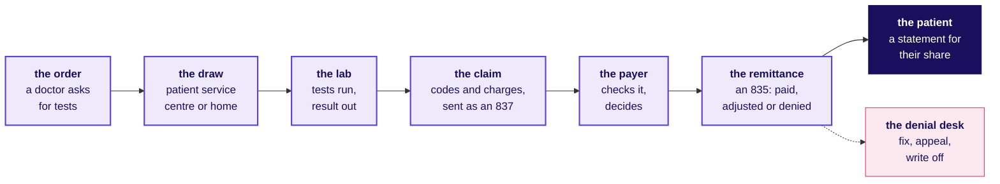
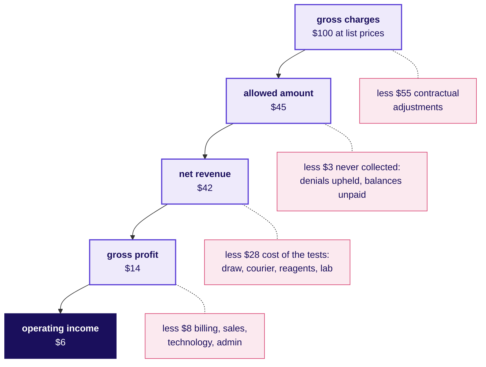
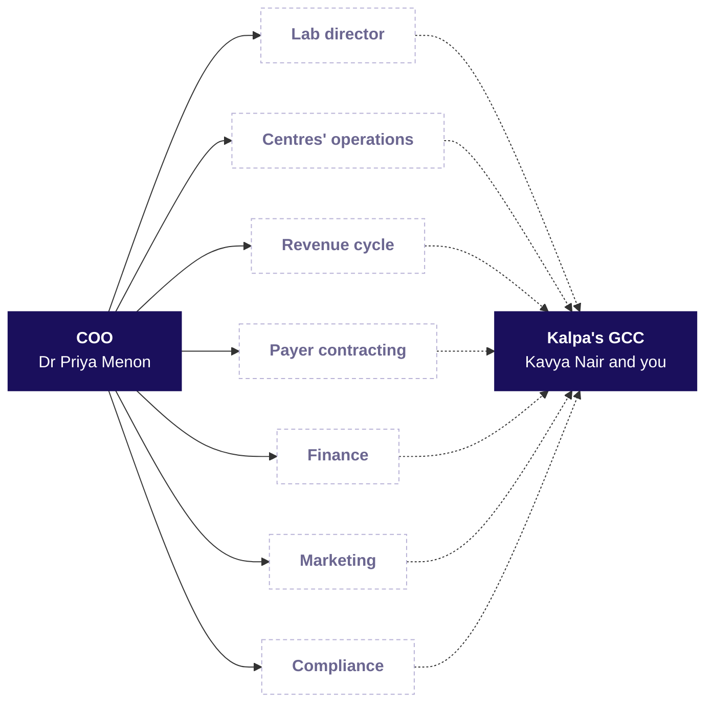
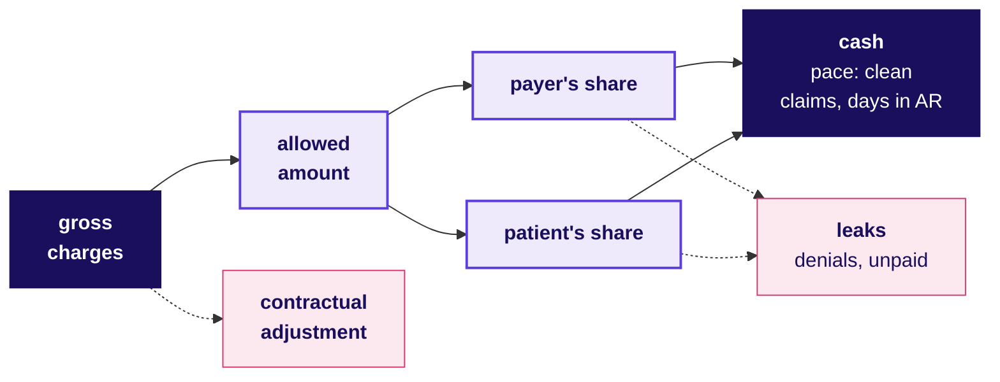
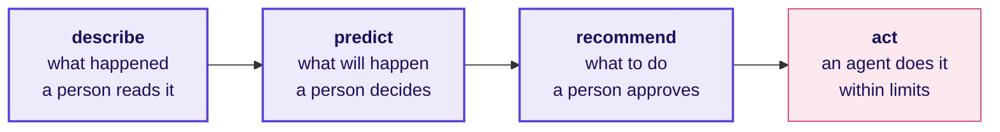

# How does a US lab get paid, who at Kalpa Health asks for what, and where does data earn its keep?

**Build 1, Monday · The domain before the data · US healthcare, and the real companies Kalpa Health resembles**

About a 45-minute read · 5 diagrams and 34 tables

> Kalpa Health, its people and its patients are fictional, and every Kalpa Health record is synthetic, so no real patient's information exists in the programme. Real companies appear as analogies, each fact checked on 30 September 2026 against the source beside it. A number marked illustrative is neither Kalpa Health's data nor any real company's.

---

## 1. What happens at a Kalpa Health centre in one working day, and who makes it happen?

James Carter, 58, walks into Kalpa Health's patient service centre in Dallas, the place where the lab draws blood, with an order for two blood tests. He is out in ten minutes, and the money for those ten minutes takes weeks to settle. James is as synthetic as every Kalpa Health record.

**Who needs the answer.** You do, before Dr Priya Menon's first question reaches you. Kalpa Health runs a laboratory and two patient service centres in each of six US metro areas: Dallas, Phoenix, New York, Chicago, Atlanta and Philadelphia. A team that cannot follow one test from the order to the cash will misread every file built from those steps.

**The questions on the way.** What does the doctor's order carry? What does the front desk check? What happens to a blood sample after the draw? How does a test become a claim? What does the plan send back? What does the team in Bengaluru do with the day?

### What does the doctor's order carry?

James's doctor wrote an order, which a lab calls a **requisition**, for an HbA1c, which shows average blood sugar over about three months, and a cholesterol panel, which measures the fats in the blood. It carries the reason as a diagnosis code, E11.9 for type 2 diabetes without complications, with the doctor's identifier and James's insurance.

### What does the front desk check before the draw?

The clerk sends James's health plan an electronic **eligibility check**: the plan is active, and Kalpa Health is in its network, so a contract between plan and lab sets the prices. James met his yearly **deductible**, the sum a patient pays each plan year before the plan starts to pay, in the spring, so he owes 20 percent of whatever the plan allows. The patient behind him is on traditional Medicare, the federal insurance for people 65 and older, and her order includes a test Medicare may not pay for with the reason given; she signs a notice before the draw so that the bill can go to her if Medicare refuses (section 7).

### What happens to a blood sample after the draw?

A phlebotomist, trained to draw blood, fills two tubes and labels each with an **accession number**, the barcode that ties a tube to its requisition. A courier takes the day's tubes to Kalpa Health's Dallas laboratory, analysers run the tests, and James's results are released to his doctor. The time from draw to released result is the **turnaround time**, and doctors notice it first.

### How does a test become a claim?

The billing system turns the requisition into a **claim**, the bill to his plan: a procedure code per test, the diagnosis code, and a price from the lab's own list, the **chargemaster**. Kalpa Health's test catalogue lists the HbA1c at $60 and the cholesterol panel at $75, so the claim carries $135 of **gross charges**. It leaves as an electronic file called an 837, through a **clearinghouse** that checks its format and forwards it. Another patient's claim bounces back within minutes because the ordering doctor's ten-digit identifier is missing; the plan never saw it, so it is a **rejection**, fixed and resent the same day.

### What does the plan send back, and when?

A few weeks later the plan answers with an 835, the **remittance**. Of James's $135 its contract allows $70.20, the **allowed amount**; the other $64.80 is a **contractual adjustment** the lab agreed never to collect. The plan pays $56.16, and $14.04 is James's 20 percent **coinsurance**, the patient's percentage share after the deductible (a **copay** is the fixed-sum kind), which makes it his **patient responsibility**, billed to him on a statement. On the same remittance another patient's claim is **denied**, with a code saying the plan's approval was needed first and never asked for, and it goes to the denial desk.

### What does the team in Bengaluru do with the day?

At Kalpa's GCC in Bengaluru, Kalpa Health's revenue-cycle team picks up what the US day left. The **revenue cycle** is the work of turning a test into cash: coding, billing, posting the payers' answers, fixing denials and chasing unpaid claims. Coders, who assign the procedure and diagnosis codes, fix claims that failed the billing system's checks; the accounts receivable team, which chases the money owed, asks plans about claims unpaid past the usual time; and the data and AI team, where Kavya Nair is the senior analyst, refreshes the dashboard. Each works under the limits in section 7.

On Monday Dr Priya Menon, the COO, reads one page: test volumes grew 5 percent from calendar Q2 (April to June) to Q3 (July to September) of 2026 against a plan of 18, and she wants to know which branch of the business is short. That is the question Build 1 answers.

---

## 2. Which real companies work the way Kalpa Health does, and what does each teach?

If you have had a blood test in India, you probably paid at the counter or on an app, and the bill ended there. In the US the same draw starts weeks of exchange between the lab, the patient's plan and the patient. The US spent $5.3 trillion on health care in 2024, 18.0 percent of its economy (CMS, the Centers for Medicare & Medicaid Services, the federal agency that runs Medicare; National Health Expenditure fact sheet, updated 24 June 2026).

**Who needs the answer.** Kavya Nair, before a Kalpa figure goes to Dr Menon: real labs publish their numbers every year, and without a benchmark from one, a wrong figure looks as plausible as a right one.

**The questions on the way.** Which US labs have Kalpa Health's shape? What does a lab's annual report say about who pays? Which teams in India already do this work?

### Which US labs have Kalpa Health's shape, at national scale?

| Company | What it reported | What it teaches |
|---|---|---|
| Quest Diagnostics | Net revenues of $11,035 million for 2025; about 2,400 patient service centres, many inside large retail stores (Form 10-K for 2025, filed 26 February 2026) | The patient meets a lab at a draw site, and the testing happens at a laboratory elsewhere, as it does in each of Kalpa Health's metros |
| Labcorp | Revenue of $13,951.7 million for 2025, $10,876.5 million from diagnostics; more than 2,200 patient service centres; more than 7,000 phlebotomists placed in customers' offices (Labcorp Holdings, Form 10-K for 2025, filed 24 February 2026) | Samples also arrive from doctors' offices |

### What does a lab's annual report say about who pays?

Quest defines the requisition as the form that travels with the specimens, "indicating the test(s) to be performed and the party to be billed for the test(s)" (10-K for 2025), and the party billed is often not the patient. Patients still brought 12 percent of Quest's 2025 revenue and owed 20 percent of what it was waiting to collect at year end, its receivables, because insured patients' deductibles and coinsurance are billed to them (10-K for 2025).

### Which teams in India already do this work for US health care?

| Kind | Real examples, each as the company describes itself | The work |
|---|---|---|
| The Indian centre of a US health company | Optum India, which UnitedHealth Group calls its largest Global Capability Centre (UnitedHealth Group careers, India); Carelon Global Solutions, "born out of one of the largest health plans in the U.S.", in Bengaluru, Hyderabad and Gurugram (carelonglobal.in) | Technology, analytics and operations for the parent's own business |
| A revenue-cycle firm serving many US providers | AGS Health, with Indian centres including Chennai, Hyderabad and Bengaluru and more than 15,000 revenue-cycle staff worldwide (agshealth.com) | Coding, billing, denials and follow-up on unpaid claims for many providers |

Kalpa's GCC is the first kind: one company's own centre, serving Kalpa Health among Kalpa Group's five business units.

---

## 3. How does a US lab make money, and where does each dollar go?

James's tests went out at $135 and brought $70.20. Where the rest went is the lab's profit and loss statement, the P&L, and it starts with who pays.

**Who needs the answer.** Kalpa Health's finance head, who reports the quarter to Dr Menon and the board. Gross charges are the lab's list prices and net revenue is what it expects to collect, and finance reports net revenue, so an analyst who mixes the two lines hands finance the wrong number.

**The questions on the way.** Who pays for a test at Kalpa Health? How does $100 of charges become operating income? What does one $135 claim leave the lab once the cost of the tests is paid? How long does the lab wait for its money?

### Who pays for a test at Kalpa Health?

| Payer | Who they are | How the price is set |
|---|---|---|
| Commercial plans | Private health insurance, most often through an employer | The plan's contract with the lab sets an allowed amount per test |
| Medicare | Federal insurance for people 65 and older and some younger people with disabilities | Traditional Medicare pays lab tests mostly from its Clinical Laboratory Fee Schedule (CMS), and its patients "usually pay nothing for Medicare-covered diagnostic laboratory tests" (Medicare.gov) |
| Medicaid | Coverage for people with low incomes, run by each state with federal money | Each state sets its rules, and Kalpa Health's six metros sit in Texas, Arizona, New York, Illinois, Georgia and Pennsylvania |
| Self-pay | Patients with no plan, or who choose not to use one | The patient pays the lab directly, at a price the lab sets |

Employment-based insurance covered 53.5 percent of Americans for some or all of 2025, and 7.9 percent had no coverage all year (US Census Bureau, 15 September 2026). Which payers a lab's patients carry decides its prices more than its price list does.

### How does $100 of charges become operating income?

Below, $100 of gross charges travels through an illustrative lab whose cost shares sit near Quest's.

Almost nobody pays **gross charges**. Each payer's contract or fee schedule sets an **allowed amount** per test, and the difference is a **contractual adjustment**, written off under the contract. Some of the allowed amount never arrives, because a denial is upheld or a patient never pays, and what the lab expects to collect is **net revenue**, the number labs report: Quest's estimate includes "the impact of contractual allowances (including payer denials), and patient price concessions" (10-K for 2025).

Below net revenue, **cost of services** (the draw, courier, reagents, analysers, staff and buildings) leaves **gross profit**, and selling, general and administrative costs leave **operating income**. Quest reported cost of services at 66.8 percent of net revenues in 2025, selling, general and administrative costs at 17.8 percent, and operating income at 14.1 percent, $1,556 million (10-K for 2025); the illustration's $6 of $42 is 14.3 percent.

### What does one $135 claim leave the lab once the cost of the tests is paid?

The first five lines are James's claim; the costs are the illustrative lab's shares, since Kalpa Health's costs are not in its files.

| Line | $ | What it is |
|---|---|---|
| Gross charges | 135.00 | Both tests at list price |
| Contractual adjustment | 64.80 | Written off under his plan's contract |
| Allowed amount | 70.20 | The contract's price for the two tests |
| Paid by the plan | 56.16 | 80 percent of the allowed amount |
| Patient responsibility | 14.04 | His 20 percent coinsurance |
| Cost of the tests, illustrative | 46.80 | Two thirds of the revenue |
| Cost of billing and collecting, illustrative | 5.00 | The claim, the remittance, one statement |
| Contribution if James pays | 18.40 | What the claim adds towards fixed costs |
| Contribution if James never pays | 4.36 | The plan's $56.16 less both costs |
| Contribution if the plan had denied it for good | minus 51.80 | Tests performed and paid for by the lab alone |

### How long does the lab wait for its money?

A lab pays for reagents and staff the week it tests and collects weeks or months later. The measure is **days in accounts receivable**, the receivable divided by a day's net revenue; Quest's days sales outstanding, "a measure of billing and collection efficiency", were 48 at the end of both 2025 and 2024 (10-K for 2025). Every payer also sets a **timely filing limit**, after which a claim never sent, or sent wrong, cannot be paid.

Of every $100 billed at list price, then, about $42 is revenue and about $6 is operating income, and a $1 leak from the $45 allowed is 2.2 percent of the allowed amount and a sixth of the operating income.

---

## 4. Who at Kalpa Health decides what, and what does each of them ask the data team?

On Monday morning, before any analysis runs, several people at Kalpa Health already want something from the data team, and each loses something different when a number is wrong.

**Who needs the answer.** Every trainee who takes a request: the same denial figure means a contract to renegotiate for payer contracting and a queue to reorder for the revenue cycle, and a number built for the wrong decision costs a week.

**The questions on the way.** Who reports to Dr Menon? What does each head ask, and what does a wrong number cost them? Where do two heads pull against each other?

### Who reports to Dr Menon?

Kalpa Health's heads report to Dr Menon; only she is named, and the others appear by role.

Solid arrows are reporting lines; every dotted arrow is an ask that reaches the data team.

### What does each head ask, and what does a wrong number cost them?

| Role | Asks the data team | What a wrong number costs them |
|---|---|---|
| COO, Dr Priya Menon | Which part of the business is short, and what do I do? | Staff and money moved to the wrong place |
| Lab director | Where is turnaround slipping, and how many samples arrive tomorrow? | Late results, or a night shift staffed for the wrong volume |
| Patient service centres' operations head | Which centres are overloaded, and where should staff go? | Queues in one centre and idle staff in the next |
| Revenue cycle head | Which claims will be denied, and which unpaid claims come first? | Claims chased past their filing limit |
| Payer contracting | What does each plan pay for each test, against its contract? | A contract renewed at rates the plan underpays |
| Finance head | Do your numbers match my books, and when does the cash arrive? | A quarter restated after the board has seen it |
| Marketing head | Which offers bring patients in, and at what cost per patient? | A quarter's campaign budget committed on the wrong number |
| Compliance and the privacy official | Does this analysis need patient-level data? | A breach, with patients to notify |
| Data platform lead | Query it, do not export it; tell me before you break it. | One broken feed reaches every dashboard |
| Kavya Nair, senior analyst | Show me the baseline, the evidence, and a second way to the number. | The team's trust |

### Where do two heads pull against each other?

Lab operations is measured on results out on time and within cost, the revenue cycle on dollars collected. A test performed perfectly still earns nothing if its claim goes out wrong: had the plan denied James's claim for good, his tests would have cost the lab $51.80 with nothing back.

---

## 5. Which numbers run a lab's revenue cycle, and how is each one worked out?

When a lab's cash falls short, each number on James's claim is a suspect: the lab charged less, the plans allowed less, more claims were refused, or the money is still on its way, and each metric below says which.

**Who needs the answer.** The revenue cycle head, who decides each week which claims to fix and chase, and the finance head, who reports the cash; a metric with the wrong divisor sends a team after a problem the business does not have.

**The questions on the way.** How much did the lab bill, and how much do the contracts accept? How much will it never ask for, and how much will it collect? How much do patients owe? What share of claims is refused, and what share leaves clean? How many days of revenue is it owed, and how much of what was allowed arrived? How long does a doctor wait?

These ten follow a test's charge to cash, a road a retailer never needed because a shopper pays at the till.

Every worked number below is illustrative, from one month at a made-up lab: 10,000 claims carrying $2,000,000 of gross charges, $900,000 allowed, and $840,000 expected in the end.

### How much did the lab bill at its own list prices?

| | |
|---|---|
| Formula | Gross charges = each test billed x its chargemaster price, summed |
| Worked | $2,000,000, an average of $200 a claim; James's two tests, $135 |
| The trap | Raise every list price 8 percent and gross charges reach $2,160,000 while the contracts allow the same $900,000: growth on the dashboard, and no test or dollar added |
| Who asks | Finance |

### How much of a bill do the payers' contracts accept?

| | |
|---|---|
| Formula | Allowed amount = the most the contract or fee schedule permits for a covered test = payer's share + patient responsibility |
| Worked | $900,000, 45 percent of charges; James's $70.20 of $135 |
| The trap | A forecast at last year's 45 percent, after a large plan cut its prices in January, books revenue the remittances will never bring |
| Who asks | Payer contracting and finance |

### How much of the bill did the lab agree never to collect?

| | |
|---|---|
| Formula | Contractual adjustment = gross charges less the allowed amount |
| Worked | $1,100,000, 55 percent of charges; James's $64.80 |
| The trap | The same 8 percent price rise lifts the adjustment from 55 to 58 percent of charges on the same $900,000 allowed, which reads as payers squeezing the lab when only the price list moved |
| Who asks | Finance |

### How much does the lab expect to collect in the end?

| | |
|---|---|
| Formula | Net revenue = gross charges less contractual adjustments, less what the lab expects never to collect |
| Worked | $2,000,000 less $1,100,000 less $60,000 is $840,000, 42 percent of charges |
| The trap | Last month's figure is an estimate, corrected as remittances and patient payments arrive, so the latest months move after they are first reported |
| Who asks | Finance, the COO and investors |

### How much of the allowed amount do patients owe?

| | |
|---|---|
| Formula | Patient responsibility = deductible + coinsurance + copay |
| Worked | $135,000 of the $900,000 allowed, 15 percent; James's $14.04 |
| The trap | Deductibles reset each plan year, so January's bills lean on patients and October's on plans; set side by side, they show patients paying worse when their bills only changed shape |
| Who asks | The revenue cycle and finance |

### What share of claims does a payer refuse on its first answer?

| | |
|---|---|
| Formula | Initial denial rate = claims denied in full or in part on first answer / claims submitted, in one period, on one stated basis, counts or dollars |
| Worked | 500 of 10,000 claims, 5 percent by count; $70,000 of $2,000,000 of charges, 3.5 percent by dollars |
| The trap | Many small claims denied for a missing code make the count look worse than the dollars, and a stakeholder told 5 percent hears 5 percent of the money |
| Who asks | The revenue cycle, first and always |

For scale, insurers selling plans on HealthCare.gov, the federal marketplace where people buy their own insurance, denied 19 percent of in-network claims in 2024, from 3 to 36 percent by insurer (KFF, 24 March 2026).

### What share of claims leaves the lab with nothing to fix?

| | |
|---|---|
| Formula | Clean claim rate = claims that pass the billing system's checks, called edits, untouched / claims entered for billing |
| Worked | 8,800 of 10,000, 88 percent |
| The trap | It is counted before the claim leaves, so a clean claim can still be denied, and a rate near 100 percent can sit beside rising denials |
| Who asks | The revenue cycle and the billing team |

### How many days of revenue is the lab still owed?

| | |
|---|---|
| Formula | Days in AR = receivable outstanding, net of contractual adjustments / average net revenue per day |
| Worked | $1,260,000 against $28,000 a day ($840,000 over 30 days) is 45 days |
| The trap | Writing off old claims shrinks the receivable, so days in AR fall from 45 to 38 with no dollar collected; read the write-offs beside it |
| Who asks | Finance and the revenue cycle |

### Of the money the contracts allow, how much did the lab collect?

| | |
|---|---|
| Formula | Net collection rate = payments / (gross charges less contractual adjustments), on the same claims, once their collection window has closed |
| Worked | $840,000 of $900,000 allowed, 93.3 percent |
| The trap | Measured before the window closes, the latest month shows only the payments already in, say $540,000, 60 percent, a collapse the next two months erase |
| Who asks | Finance, the COO and the revenue cycle |

### How long does a doctor wait from the draw to the result?

| | |
|---|---|
| Formula | Turnaround time = draw to released result, per test, reported as the median and the share within the promised time |
| Worked | A median of 18 hours, 92 percent within 24 |
| The trap | Timing from the sample's arrival at the lab leaves out the courier's hours, so the lab's clock improves while the doctor's wait grows |
| Who asks | The lab director and the doctors' practices |

A finance head reads net revenue first, $840,000 on the illustrative month, because it is the number the lab reports, and days in AR next, because 45 days of revenue owed is cash already spent on reagents and staff.

---

## 6. Which words will you hear in a revenue-cycle meeting, and what do they mean?

At the Monday revenue-cycle meeting the accounts receivable head asks: "Days in AR are up to 52, the denials on the new plan are mostly authorisation, and a filing limit is coming on the oldest batch, so do we appeal or rebill?"

**Who needs the answer.** A trainee in the first week: the revenue-cycle team uses these words without defining them, and a trainee who mixes up a rejection and a denial sends a fix to the wrong team.

**The questions on the way.** Who pays, and on what terms? What happens to a sample? What turns a test into money? What do payers check first? Which words decide who may see the data? Which codes and files does a claim carry? Which reason codes explain an unpaid dollar?

The numbers in the sentences below are illustrative.

### Who pays, and on what terms?

| Term | Meaning | In a sentence |
|---|---|---|
| Payer | Whoever pays the claim: a plan, Medicare, Medicaid or the patient | "The payer is Texas Medicaid, so its rules apply." |
| In network | The plan has a contract with the lab that sets its prices | "We are in network with our three large commercial plans." |
| Deductible | What a patient pays each plan year before the plan pays | "Most January balances are deductibles." |
| Coinsurance and copay | The patient's share after the deductible, a percentage or a fixed sum | "Twenty percent of $70.20 is $14.04 from the patient." |

### What happens to a sample on its way to a result?

| Term | Meaning | In a sentence |
|---|---|---|
| Requisition | A doctor's order: patient, tests and reason | "No diagnosis code on the requisition means no clean claim." |
| Accession number | The barcode tying a sample to its requisition | "Trace the tube by its accession number, which is as much PHI as the name." |
| Panel | Tests a doctor orders by one name | "The doctor ordered the panel by its name." |
| Turnaround time | Draw to released result | "Turnaround slipped past 24 hours on Mondays." |

### What turns a test into money?

| Term | Meaning | In a sentence |
|---|---|---|
| Chargemaster | The lab's own price list | "Hardly anyone but a self-pay patient pays the chargemaster price; for everyone else it is where the claim starts." |
| Allowed amount | The most a contract or fee schedule permits, payer's and patient's shares together | "This plan's allowed amount for the panel is below our cost." |
| Contractual adjustment | Charges less the allowed amount, written off under the contract | "Contractual adjustments are not bad debt; we never expected that money." |
| Clearinghouse | The company that checks claims' format and routes them | "The clearinghouse catches typos before the plan sees them." |
| Rejection | A claim returned before the payer processed it, fixed and resent | "Rejections should be gone by lunch." |
| Denial | A payer's decision, after processing, not to pay all or part of a claim | "Find out why denials happen before we hire people to work them." |
| Appeal | A request to reverse a denial, with evidence | "Appeal the necessity denials; the documentation is on file." |
| Timely filing limit | The deadline after the service date for the payer to receive the claim | "Those claims hit their filing limit next week, so they go first." |

### What do payers check before they pay?

| Term | Meaning | In a sentence |
|---|---|---|
| Eligibility check | The electronic question to the plan, before the draw, about coverage | "Run eligibility at registration, before the claim is denied for it." |
| Prior authorisation | A payer's approval, required before some services | "The genetic panels need prior authorisation, and nobody asked." |
| Medical necessity | A payer's test of whether a service is needed for the patient's condition | "The diagnosis on the order did not support necessity." |

### Which words decide who may see the data?

| Term | Meaning | In a sentence |
|---|---|---|
| PHI | Protected health information: identifiable health data held by a covered entity or its business associate | "A claim number beside a service date makes that row PHI." |
| Covered entity | A health plan, a clearinghouse, or a provider billing electronically | "As a lab that bills electronically, we are a covered entity." |
| Business associate | A company handling PHI for a covered entity under a written agreement | "The coding vendor works as our business associate." |
| Minimum necessary | Only the PHI a purpose needs | "The denial model needs the codes and the payer; the address stays out." |
| De-identified | No longer identifying anyone, by one of section 7's two methods | "Send Bengaluru the de-identified extract." |

### Which codes and files does a claim carry?

| Code or file | What it says |
|---|---|
| CPT | Which procedure was performed, in five digits kept by the American Medical Association; lab codes run from 80000 to 89999 (CMS, NCCI policy manual for 2026, chapter 10) |
| ICD-10-CM | Why the test was ordered; James's E11.9 is "Type 2 diabetes mellitus without complications", and each year's code set takes effect on 1 October (CDC; CMS ICD-10 page) |
| NPI | "a unique 10-digit number used to identify health care providers" (CMS, NPI page) |
| 270 and 271, 278, 276 and 277, 837, 835 | The eligibility question and answer, a request for review, "where is my claim?" and its answer, the claim, and the remittance: X12 files, the standard adopted under HIPAA, the health data law of section 7, in version 5010 since 1 January 2012 (CMS, adopted standards) |

### Which reason codes explain a dollar the payer did not pay?

On an 835 each unpaid dollar carries a group code, saying who bears it, and a **claim adjustment reason code**, a CARC, saying why; a committee under X12 maintains the CARCs (CMS, MLN article MM12478). The group codes are CO, a contractual obligation the lab absorbs; PR, patient responsibility; OA, other adjustments; and PI, a payer-initiated reduction. James's remittance carried CO with CARC 45 on his $64.80 and PR with CARC 2 on his $14.04; Kalpa Health's posting file writes the reason in words and keeps the patient's share in its own column. Its claims file names each denial by one of seven categories modelled on these codes.

| Kalpa Health's denial category | A typical CARC, in X12's words | What the lab does next |
|---|---|---|
| eligibility or coverage | 27, "Expenses incurred after coverage terminated." | Checks coverage, then bills the right payer or the patient |
| missing or invalid information | 16, "Claim/service lacks information or has submission/billing error(s)." | Corrects the claim and resends it |
| medical necessity | 50, "These are non-covered services because this is not deemed a 'medical necessity' by the payer." | Checks the diagnosis and documentation, then appeals, or bills a Medicare patient who signed the advance notice |
| prior authorization | 197, "Precertification/authorization/notification/pre-treatment absent." | Fixes the step that missed the approval |
| non-covered service | 96, "Non-covered charge(s)." | Checks the plan's benefits before billing anyone else |
| duplicate claim | 18, "Exact duplicate claim/service" | Confirms the first claim is being paid, and closes the second |
| timely filing | 29, "The time limit for filing has expired." | Writes it off, and asks why it went late |

Decoded, the accounts receivable head's question says: the lab is owed 52 days of revenue, most of the new plan's denials say approval was never asked for, and the oldest claims are close to the payer's filing deadline, so the team must choose, claim by claim, between appealing and correcting and resending before the deadline passes.

---

## 7. Which rules bind a US lab's data, and what do they forbid an analyst or an AI system?

James's morning passed through most of the rules below: the lab's federal certificate, the Medicare notice the patient behind him signed, the codes on his claim, and the claim number that stands in for his name in Bengaluru, which the law still counts as identifying him.

**Who needs the answer.** Kalpa Health's compliance head and privacy official, who answer for every table that leaves the lab, and every analyst before the first extract. A breach means notices to each person affected and to HHS, the federal Department of Health and Human Services, and a claim carrying a diagnosis the doctor's record does not support is false, whether a person or a model chose the code.

**The questions on the way.** Which data is protected, and how much may a task use? How does data stop being protected? What binds a company that handles it for the lab? What follows a breach? Which rules decide whether a test is paid? What may the team in Bengaluru touch?

### Which rules decide who may see a patient's data?

HIPAA is the US federal law whose rules govern health data held by health plans, clearinghouses, most providers and the companies working for them; the rules sit in title 45 of the Code of Federal Regulations, cited as 45 CFR.

| Rule, and what it requires | What it means for an analyst or an AI system |
|---|---|
| The Privacy Rule binds covered entities, which are health plans, clearinghouses, and providers that send health information electronically in the standard transactions (45 CFR 160.103), and applies to their business associates where it says so (164.500(c)). It protects "individually identifiable health information" held or transmitted by a covered entity or its business associate, "in any form or media, whether electronic, paper, or oral", which is **protected health information**, PHI (HHS, Summary of the HIPAA Privacy Rule). Its basic rule: they "may not use or disclose protected health information, except as permitted or required" by the rule (164.502(a)), which permits treatment, payment and health care operations (164.506) and uses the patient authorises in writing. | A lab that bills electronically is a covered entity, and a company that analyses its data for it is its business associate unless it is part of the lab's own workforce. A row with the name removed stays PHI while it carries a service date, a ZIP code, or a claim, member or accession number. |
| Minimum necessary. A covered entity or business associate that uses, discloses or requests PHI "must make reasonable efforts to limit protected health information to the minimum necessary to accomplish the intended purpose of the use, disclosure, or request" (45 CFR 164.502(b)), with six exempt cases such as disclosures for treatment, and a covered entity limits each role to the categories of PHI it needs (164.514(d)). | A denial model's purpose needs the payer, the codes and the dates, so a request for the patient's address fails the test unless the task needs it. |
| De-identification. De-identified data is not PHI, by one of two methods (45 CFR 164.514(b)). Expert determination: a qualified expert finds the risk "very small" that the data could be used, alone or with other reasonably available information, by an anticipated recipient to identify a person, and documents the methods and results. Safe harbor: eighteen kinds of identifier of the patient and of relatives, employers and household members are removed, among them names, all geography smaller than a state except a three-digit ZIP whose area holds more than 20,000 people, every element but the year of a date tied to the patient, ages over 89 (grouped as 90 or older) and any other unique number or code; and the covered entity has no actual knowledge that what is left could identify the person. | Safe harbor keeps only the year of a draw or a result, which leaves nothing to build turnaround or days in AR from, so date work uses an expert-certified extract or stays where the PHI sits. |
| Business associates. Anyone outside the workforce who handles PHI for a covered entity's regulated work, claims processing, data analysis and billing among it, is a business associate, and so is a subcontractor handling that PHI on its behalf (45 CFR 160.103). Among its required terms, the written agreement sets the permitted uses and allows none the covered entity could not make itself, requires Security Rule safeguards, requires reports of misuse, security incidents and breaches, binds subcontractors to the same restrictions, supports the patient's rights to see, amend and get an accounting of their data, opens the associate's books and records to HHS, returns or destroys the PHI at the end where feasible, and lets the covered entity end the contract for a material breach (164.504(e), 164.314(a)). HHS can act against a business associate directly for ten listed failures, among them Security Rule failures, impermissible uses and disclosures, and ignoring minimum necessary (HHS, direct liability fact sheet). | Whether an offshore centre counts as the covered entity's workforce or as a business associate depends on how the companies are set up, which lawyers settle; work as if the agreement's limits bind every table you touch. |
| Security and breach notice. The Security Rule requires administrative, physical and technical safeguards and a risk analysis (45 CFR 164.308 to 164.312). After a breach of unsecured PHI, meaning PHI not made "unusable, unreadable, or indecipherable to unauthorized persons" by a method HHS specifies (164.402), each person affected is told without unreasonable delay and within 60 calendar days of discovery, and HHS is told too, along with prominent media when more than 500 residents of a state are affected (164.404 to 164.408). | PHI only on approved, secured systems, and never in a chat tool or outside AI service without a business associate agreement. |

### Which rules decide whether a test is paid?

| Rule, and what it requires | What it means for an analyst or an AI system |
|---|---|
| CLIA. Under the Clinical Laboratory Improvement Amendments "all laboratories must be properly certified to receive Medicare or Medicaid payments" (CMS, CLIA page), and the lab director answers for the lab's overall operation (42 CFR 493.1445). | A model that changes how the lab works goes through the lab director. |
| Medical necessity and the advance notice. Medicare pays nothing for services "not reasonable and necessary for the diagnosis or treatment of illness or injury" (Social Security Act, section 1862(a)(1)(A)). A provider, an independent lab among them, that expects Medicare to refuse a service gives the patient an Advance Beneficiary Notice of Noncoverage, form CMS-R-131, which transfers the potential cost to the patient (CMS, ABN page). | The diagnosis code is how the claim states necessity, and the doctor's records have to back it. Whoever "knowingly presents, or causes to be presented, a false or fraudulent claim for payment" to a federal programme such as Medicare or Medicaid is liable under the False Claims Act (31 U.S.C. 3729), and "knowingly" covers deliberate ignorance and reckless disregard of the truth, so every code is checked against the doctor's record, whoever or whatever suggested it. |
| Timely filing. A Medicare claim must be filed within one calendar year of the date of service, with listed exceptions (42 CFR 424.44); commercial plans set their limits by contract. | Claims near their limit go first in any work queue. |
| Prior authorisation. CMS's 2024 rule makes Medicare Advantage plans, "offered by Medicare-approved private companies that must follow rules set by Medicare" (Medicare.gov), and Medicaid and CHIP (the Children's Health Insurance Program) with the managed-care plans that run them for the states decide requests within 72 hours for urgent ones and 7 calendar days for standard ones, with a specific reason for each denial, generally from 1 January 2026 (CMS fact sheet on CMS-0057-F, 17 January 2024). | A denial comes back with a stated reason a model can learn from. |

### What may the team in Bengaluru touch?

HIPAA has no rule that keeps PHI inside the US. Asked whether a covered entity or business associate may use a cloud provider that stores electronic PHI outside the US, HHS answers "Yes, provided the covered entity (or business associate) enters into a business associate agreement (BAA) with the CSP and otherwise complies with the applicable requirements of the HIPAA Rules", notes that the rules "do not include requirements specific to" such data held abroad, and places the location in the risk analysis (HHS, cloud computing guidance). The limits on offshore work come from agreements, contracts and programme rules.

| Where the limit comes from | What it says |
|---|---|
| The business associate agreement | What the offshore team may do with PHI and which safeguards it keeps, with its subcontractors bound to the same restrictions |
| Medicare Advantage | A Medicare Advantage plan gives CMS information and an attestation for each offshore subcontractor that "receives, processes, transfers, handles, stores, or accesses Medicare beneficiary PHI" (CMS, Part C application for 2027, section 3.17) |
| State Medicaid contracts, Texas for example | Unless the state approves in writing, a Medicaid managed-care plan and "all Subcontractors, vendors, agents, and service Providers" perform all services under the contract, laboratory services and customer support among them, inside the US; none may let the state's confidential information "be moved outside the United States by any means (physical or electronic) at any time, for any period of time, for any reason", or allow remote access to it from outside the US (Texas HHSC, Managed Care Uniform Terms and Conditions, section 4.10). Kalpa Health bills Medicaid in Texas, so what these terms leave its Bengaluru team is written in its contracts with the Texas plans |
| India's Digital Personal Data Protection Act 2023 | For personal data of people outside India processed in India under a contract with a person outside India, the Act's duties on whoever decides the processing (Chapter II, except sections 8(1) and 8(5)), the rights of the people the data is about (Chapter III) and its section on processing outside India (section 16) do not apply (section 17(1)(d)). What remains is the responsibility for processing done on one's behalf, 8(1), and the duty to keep reasonable security safeguards, 8(5). The date these sections take effect was not verified; the Rules that detail the safeguards come into force eighteen months after their publication on 13 November 2025 (MeitY) |

A cautious team keeps offshore analysis on de-identified or synthetic data wherever the task allows, and leaves patient-level work to the people whose role and agreement cover it. The Change Healthcare attack of 21 February 2024 shows how far one breach reaches: the UnitedHealth Group company's network processes 15 billion health care transactions a year by the American Hospital Association's count, claims and payments among them (AHA), and on 31 July 2025 it told HHS that about 192.7 million individuals were affected (HHS, Change Healthcare FAQ).

What the team in Bengaluru may touch is settled by documents: HIPAA permits uses only for allowed purposes and to the minimum necessary, allows two ways to de-identify, eighteen identifiers in the second, and requires breach notice without unreasonable delay and within 60 days, while the agreement and the payers' and states' contracts decide where PHI may go.

---

## 8. Where do analytics, machine learning, language models and agents pay for themselves in a lab, and how is that measured?

In James's day a person made every decision, from reading the eligibility answer to choosing which claims to chase. Each technique below takes over part of one.

**Who needs the answer.** The revenue cycle head, who decides where the next automation budget goes, and Dr Menon, who approves it; an agent that misreads a payer can lose money for weeks before anyone looks.

**The questions on the way.** How far does each technique go from describing to acting? Where does each earn, and how is its value measured? What does a claim-status agent save, and what can it lose? What do real companies say about AI on each side of a claim?

### How far does each technique go from describing to acting?

The further right on this ladder, the less a person checks before a decision takes effect, and the more a wrong answer costs.

### Where does each technique earn, and how is its value measured?

| Where it earns, and its rung | The problem, and why this technique | How it works, in outline | Value measured by | What it costs when wrong |
|---|---|---|---|---|
| Revenue-cycle reporting (describe) | Leaders decide weekly on denials and cash, and need one number per question | Governed SQL, one definition per metric | Decisions taken on it, and no restatements | A team hired on a wrong number |
| Denial prediction (predict, then recommend) | A denied claim costs rework, and a payer's past answers predict its next ones | Scores each claim before it leaves; a person reviews the risky ones | Denials avoided and dollars recovered, against reviewers' time | Good claims held, or bad ones sent |
| Coding assistance (recommend, with a language model) | Orders arrive as free text, and each takes a certified coder's time | Suggests codes with the words it relied on; a coder decides each | Coder minutes per claim, and suggestions accepted on an audited sample | A code the documentation does not support, which makes the claim false |
| Prior-authorisation agents (act, within limits) | Asking plans for approval by portal or phone takes staff hours | Files the request with the documentation on file; a person signs anything clinical | Requests filed before the draw | A test run without approval |
| Claim-status agents (act, within limits) | The accounts receivable team spends its day asking plans where money is | Asks each plan's system for claim status; queues what needs a person | Claims checked per hour, and days in AR | A denied claim recorded as in process |

### What does a claim-status agent save, and what can it lose?

Suppose, as an illustration, that an accounts receivable team working for several labs checks 3,000 unpaid claims a day at six minutes each, 300 staff-hours a day, and an agent takes the checks over. Now suppose it misreads one payer's status code and, for four weeks, records 400 denied claims a week as in process: at $90 allowed a claim, 1,600 claims carry $144,000, lost if nobody looks before their appeal windows close. So a weekly sample of the agent's readings is checked against the remittances, and its error decides whether the agent keeps running alone.

### What do real companies say about AI on each side of a claim?

Quest Diagnostics says it started or widened its use of AI and automation in several areas in 2025, names reducing "denials and patient concessions" among its other areas of focus, and continues to broaden AI in customer service (Form 10-K for 2025). On the payers' side, lawsuits allege that UnitedHealth used an algorithm, nH Predict, to deny post-acute care, the nursing and rehabilitation that follow a hospital stay, to Medicare Advantage patients; in February 2025 a federal judge let breach-of-contract and good-faith claims go forward (Skilled Nursing News, 14 February 2025). Those are allegations. CMS told Medicare Advantage plans in February 2024 that an algorithm may assist a coverage decision, which must rest on the individual patient's circumstances (CMS memo, 6 February 2024), and the programme holds a lab's models to the same line: a person decides anything that denies care or asserts a diagnosis.

Each technique earns where one decision repeats thousands of times a day, and the further right it sits on the ladder, the more a weekly check of its output is worth: 300 staff-hours a day returned, against $144,000 at stake.

---

## 9. Which technical problems does a lab's data team meet, and how do you choose a fix?

On a weekday the revenue-cycle team in Bengaluru has more unpaid claims than people to chase them, and more than one honest way to choose which to work first, like most data problems in a lab.

**Who needs the answer.** Kavya Nair, who approves the approach before any build starts, and the head the build serves; picking by habit, or by what is newest, spends weeks on the wrong build.

**The questions on the way.** How do you catch claims that will be denied? Which unpaid claims come first? How do you suggest a missing diagnosis code? How do you tell a patient their share? How do you get data to Bengaluru without identities? How many samples arrive tomorrow?

The options below are sized for the made-up lab of section 5, billing 10,000 claims a month.

### How do you catch the claims a payer will deny before they leave?

| Option | Size |
|---|---|
| Rules, called edits: a missing diagnosis code, a test needing approval, lapsed coverage | Days to write the first hundred from past denials' reason codes; each catches only what someone thought to write |
| A model scoring each claim from its payer, tests, codes and the payer's recent answers | A year of claims, about 120,000 rows, and weeks to build; it finds unwritten patterns and cannot say why a claim is risky |
| Edits for the certain failures, the model routing doubtful claims to a person | Both costs, plus a reviewer's time |

Edits come first, built from the costliest reason codes, since each is cheap and explains itself, and the model joins once edits stop moving the denial rate. That changes if payers rewrite their rules every quarter, when a model retrained monthly keeps up.

### Which unpaid claims should the team chase first?

| Option | Size |
|---|---|
| Oldest first | No model; chases small claims that pay anyway |
| Largest first | No model; ignores claims near their filing limit |
| Rank by dollars at stake x the chance a call recovers them, raised near the filing limit | A year of past follow-ups with outcomes, and a week to build |

The ranked list fits, because the team's hours are the limit, and a claim within weeks of its filing limit goes to the top whatever its score. That changes if the queue clears every week, when oldest first loses nothing.

### How do you suggest a diagnosis code when an order arrives without one?

| Option | Size |
|---|---|
| Send the order back to the doctor's office | No build; the claim waits days |
| A lookup from the doctor's words to the codes coders chose before | Weeks of past orders; exact matches only |
| A language model suggesting a code with the words it relied on, for a certified coder to accept or change | Weeks to test on a few thousand coded orders |

The lookup with a coder behind it starts, since most orders repeat a few phrasings, and the model takes the rest once coders accept its suggestions almost always on a checked sample. It never chooses a code alone, since a code that says more than the doctor wrote makes the claim false.

### How do you tell a patient their share before the draw?

| Option | Size |
|---|---|
| A flat estimate per test from last year's average patient payment | Minutes; wrong for most patients, whose deductibles differ |
| The eligibility answer's remaining deductible and coinsurance, applied to the contract's allowed amount | One eligibility call per patient and a contract table per payer |

The eligibility answer applied to the contract fits, since the clerk already fetches it. That changes if many estimates miss by more than a few dollars, which points at a stale contract table first.

### How do you get data to Bengaluru without patients' identities?

| Option | Size |
|---|---|
| Safe harbor: the eighteen identifiers removed, dates cut to the year | A pipeline built once; loses the dates turnaround and days in AR need |
| An expert-certified extract with dates shifted or kept | Weeks and a fee per design; re-certified when the extract changes |
| A synthetic copy with the tables' shape and statistics | A generator checked against the real data; used for building and teaching only |

Use the expert's extract where dates matter, safe harbor for the rest, and synthetic data for building and training, as the programme's Kalpa Health files are. That changes if the business associate agreement bars patient-level data offshore: then the analysis moves to the data and only results travel.

### How many samples will the lab receive tomorrow?

| Option | Size |
|---|---|
| The same weekday last week | No build; misses holidays |
| The same weekday averaged over recent weeks, adjusted for holidays | An hour a lab on a year of daily counts |
| A model with weekday, holiday, season and booked orders | Two years of daily counts, 730 rows a lab |

The averaged weekday serves, since a few percent of error rarely changes a shift. That changes when the error costs money, as when couriers are booked the day before and an empty van is paid for.

In five of the six, the simplest option that does the job and explains itself comes first, and the chase list is the exception, because the team's hours are the limit; a named fact, such as payers rewriting rules every quarter, is what moves a choice to a model or an expert.

---

## 10. How does an everyday scene turn into a lab's metrics and a data problem?

Most learners have lived through something like the five scenes below.

**Who needs the answer.** A trainee explaining a metric to a stakeholder or an interviewer, who judges in one sentence whether the metric is understood; a scene the listener has lived through carries the formula.

**The questions on the way.** Which metric hides in each scene, with its formula, and which data problem does each point to?

| The scene | Its metrics and formulas | The data and AI problem in it |
|---|---|---|
| A home blood draw booked on an app in India, paid at booking | Turnaround time = draw to released result | Routing phlebotomists; in the US the same draw also produces a claim and a wait |
| A friend's US hospital bill: thousands charged, a large "adjustment", a small amount owed | Contractual adjustment = gross charges less allowed | Telling a patient their share before the service |
| A relative's planned surgery on a cashless policy in India, approved before admission | Prior authorisation: requests decided in time / requests filed | An agent assembling the request, with a person signing anything clinical |
| A phone or car insurance claim refused after assessment | Denial rate = claims denied on first answer / claims submitted | Edits or a model that catch a likely denial before the claim leaves |
| A long hold on a customer-care line to ask where a refund is | Days in AR = receivable / average net revenue per day | A claim-status agent that makes the accounts receivable team's calls |

---

## 11. Which questions will an interviewer in US healthcare ask?

In the first round for a healthcare analytics role at a GCC, the interviewer asks how a lab gets paid before asking for any code.

**Who needs the answer.** The interviewer, who decides in the first ten minutes whether you understand the business behind the data.

**The questions on the way.** Which questions come up in every screen, which in most, and which set a candidate apart?

Tags: [S] staple, asked everywhere; [F] frequent in GCC and product screens; [D] differentiator. The tagging is this programme's own calibration for candidates with 0 to 3 years of experience in the Indian market.

1. [S] You have joined a healthcare company; how would you apply what you did in retail to our data?
2. [S] Walk me through how a US lab gets paid for a blood test, from the order to the cash.
3. [S] What is the difference between gross charges, the allowed amount and net revenue, and which one does finance report?
4. [S] Define the denial rate and days in accounts receivable, and say what each is divided by.
5. [F] What changes when the cost of an error is a missed diagnosis instead of a missed sale?
6. [F] A claim is rejected by the clearinghouse and another is denied by the payer; what is the difference, and who fixes each?
7. [F] What patient data may an offshore analytics team see, and how would you prepare a claims extract for it?
8. [F] How would you predict which claims will be denied, and how would you show the model saves money?
9. [D] Design an agent that checks claim status with payers: what may it do alone, what must it hand to a person, and how do you know it reads the answers right?
10. [D] A model suggests diagnosis codes for lab orders; what can go wrong, legally and financially, and how do you guard against it?

---

## 12. Where do you read next, and what does each source add?

With an evening to spare, start where a lab explains itself to its investors.

**Who needs the answer.** A trainee who meets a term this dossier did not cover, with a stakeholder waiting for the answer; each source adds one layer, from a lab's own report to the rules.

**The questions on the way.** Which source explains a lab's business, which the revenue cycle, which the codes, and which the rules?

| Order | What | Time | What it adds |
|---|---|---|---|
| 1 | Quest Diagnostics, Form 10-K for 2025, https://www.sec.gov/Archives/edgar/data/1022079/000102207926000015/dgx-20251231.htm (verified 30 Sep 2026) | 40 minutes | Requisitions, payers, price concessions and days sales outstanding in a lab's own words |
| 2 | HFMA, "Healthcare Revenue Cycle Management (RCM): What It Is and How It Works", https://www.hfma.org/reference/revenue-cycle-management/ (verified 30 Sep 2026) | 15 minutes | The cycle end to end |
| 3 | AAPC, "Revenue cycle challenges and opportunities", a video of 7 minutes 59 seconds after a free sign-up, https://www.aapc.com/video/revenue-cycle-challenges-and-opportunities (verified 30 Sep 2026) | 8 minutes | Posting, collections, denials and appeals, from the coders' professional body |
| 4 | X12, claim adjustment reason codes, https://x12.org/codes/claim-adjustment-reason-codes (verified 30 Sep 2026) | 15 minutes | Every reason a dollar goes unpaid, in the standard's words |
| 5 | HHS, "Summary of the HIPAA Privacy Rule", https://www.hhs.gov/hipaa/for-professionals/privacy/laws-regulations/index.html (verified 30 Sep 2026) | 20 minutes | Who is covered and what PHI is |
| 6 | HHS, guidance on de-identification, https://www.hhs.gov/hipaa/for-professionals/special-topics/de-identification/index.html (verified 30 Sep 2026) | 25 minutes | The two methods and the eighteen identifiers |
| 7 | HHS, guidance on cloud computing, https://www.hhs.gov/hipaa/for-professionals/special-topics/health-information-technology/cloud-computing/index.html (verified 30 Sep 2026) | 10 minutes | The question on servers outside the US |
| 8 | CMS, fact sheet on CMS-0057-F, https://www.cms.gov/newsroom/fact-sheets/cms-interoperability-prior-authorization-final-rule-cms-0057-f (verified 30 Sep 2026) | 10 minutes | What payers owe providers on prior authorisation from 2026 |
| 9 | KFF, "Claims Denials and Appeals in ACA Marketplace Plans in 2024", https://www.kff.org/patient-consumer-protections/claims-denials-and-appeals-in-aca-marketplace-plans-in-2024/ (verified 30 Sep 2026) | 15 minutes | How often, and how differently, insurers deny |
