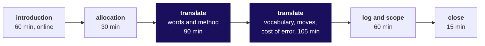

# Day sheet: Week 3, Monday. Build 1 opens in Kalpa Health

**TRAINER ONLY.** Nothing on this page reaches a learner. It names every plant in the Kalpa Health
data, and a learner who reads it has lost the week.

Posts to <!-- sync:module:W03/D1 -->Module 1: Foundations of AI and Data<!-- /sync:module:W03/D1 -->, on <!-- sync:day-date:W03/D1 -->Mon 19 Oct 2026<!-- /sync:day-date:W03/D1 -->.

| | |
|---|---|
| **Start from** | Dr Priya Menon's words: her dashboard says test volumes grew 5 percent from Q1 to Q2 against a plan of 18, and she cannot say which branch of Kalpa Health is short. No tool opens before her question is on the table. |
| **Go as far as** | Every group allocated, its sub-problem written in its own words, mapped onto the Weeks 1 and 2 method with a vocabulary map and three first moves, the cost-of-error question answered, the scope pinned in one sentence, and entry one in the challenges log. |
| **Stop before** | Any teaching. Any mapping handed to a group. Any analysis past row counts before the group's scope is pinned. Any Kalpa Health tree, ladder or comparison drawn for the room. |
| **Comes later** | Wednesday: the checkpoint, the trainer's parallel build, profile, clean and reconcile, and the headline claim. Thursday: Mock R1 and build completion. Friday and Saturday: the expert's GDs and the presentations. |
| **Cut first** | The peer check in block two, to 15 minutes. **Never cut the translation time, entry one of the log, or the close.** |

The spine is `docs/detailing/W03_build1_spine.md`, approved on 29 September 2026. It is the gate for
this day, so this pack was built from it without a spine of its own.

---

## Who runs what

| Role | What they do today |
|---|---|
| The Programme Head | Runs the introduction online (the deck, 60 minutes) and the allocation (30 minutes), and chooses how the nine groups are allocated. |
| The trainer | In the room: sets up the online link, reads the letters in the chat for the Programme Head, runs the translation on the floor, runs the close. |
| The Academic TA and the TAs | On the floor with the trainer during the translation; own the open build time after the second block. |
| The Principal Advisor | Not in today's run. Takes a share of Thursday's mocks and of the GDs online. |
| The industry expert and the senior industry leader | Not in the room until Friday and Saturday respectively. |

## The day, block by block

The campus day is two blocks of 180 minutes with lunch between them (`data/programme/facts.yaml`).
After the second block the time is open build time with the TAs. There is no practice set, no Kahoot
and no test this week.

| Block | Duration | What happens | Who | What must be true at the end |
|---|---|---|---|---|
| One | 60 min | The introduction deck, `slides/C2_W03_D01_introduction_STUDENT.pptx`, delivered online | Programme Head | Everyone has heard Dr Menon's question, the five sub-problems, the week's shape and the rule that nothing new is taught |
| One | 30 min | The allocation (see below) | Programme Head | Every group holds one sub-problem and its brief |
| One | 90 min | Translation, Parts 1 and 2 of the worksheet: the stakeholder's words taken apart, the one-sentence question, the method it maps to, the Kalpa Retail picture redrawn in Kalpa Health words | Groups; trainer and TAs on the floor | Each group can say which part of the method leads, and why |
| Two | 75 min | Translation, Parts 3 and 4: the vocabulary map past the three seeded pairs, the first three moves. Groups open the data dictionary and may open a file to see what a column holds | Groups | Five or more pairs of the group's own; three moves, each with a file and a count |
| Two | 30 min | Part 5, the cost of an error, then a peer check: two groups on **different** sub-problems swap worksheets and run Kavya's four checks on each other | Groups | Every worksheet has been read by someone outside the group |
| Two | 30 min | Entry one in the challenges log; the group's repository holds the worksheet, both logs and the brief | Groups; Academic TA checks the logs | Nine logs with one dated entry each |
| Two | 30 min | Scope rounds: the trainer hears each group's one-sentence scope, about three minutes a group | Trainer | Nine scopes heard, each with its "we will not" |
| Two | 15 min | The close (words below) | Trainer | Scopes pinned; Wednesday's checkpoint stated |
| After | Open | Build time with the TAs: groups start the build against their own scope | TAs | Challenges logged as they happen |

Block one is 60 plus 30 plus 90, which is 180 minutes. Block two is 75, 30, 30, 30 and 15, which is
180 minutes.

## The words to say

**Before the link opens, the trainer, one minute.** "For the next hour the Programme Head runs the
session online. Keep your chat open, because you will answer in letters. Every file you need is in the
`briefs` and `data` folders of today's pack, and you have them now."

**After the allocation, the trainer, two minutes.** "Each group has a brief and the translation
worksheet. For the next hour and a half, do one thing: write Dr Menon's question in your own words, and
say which part of what you did for Meera and Anand answers it. Nobody in this room will tell you the
mapping. We will answer any question about the domain, like what a phlebotomist does. We will answer a
question about the method with a question back. If you are stuck, write it in the challenges log first,
then call one of us."

**To a group waiting to be told.** Never the mapping. Ask, in this order, and stop at the first one that
moves them: "What number did your stakeholder quote, and what is it a number of?" Then: "When Meera
said sales, what did you draw first?" Then: "Which of your Week 1 pictures has a box for the thing your
stakeholder is worried about?"

**The close, the trainer, 15 minutes.** "Read me your scope in one sentence, and the one thing you
will not do this week." Hear each group; pin each sentence on the board or in the channel. Then:
"Wednesday opens with the checkpoint: three questions, two minutes per group. A group that cannot
answer them is stuck, and Wednesday is the day to say so, because Thursday opens the mocks. On
Wednesday, before the day ends, each group states its headline claim in one sentence, with its
denominators and its caveat. Tuesday is Dussehra. Tonight is build time with the TAs."

## Allocating nine groups: the two ways

The tracker's build-week anatomy locks five sub-problems and three groups per sub-problem, which is
fifteen groups. The handover plans 35 learners in nine groups (`facts.yaml`, conflict `groups`), which
is eight groups of four and one of three. Both locked numbers cannot hold with nine groups, so the
Programme Head chooses on the day, and this sheet gives both.

| | Option A: three sub-problems, three groups each | Option B: all five sub-problems |
|---|---|---|
| **Shape** | Three sub-problems with three groups each; two briefs spare | Four sub-problems with two groups each; one with a single group |
| **Keeps** | The tracker's three groups per sub-problem, so Saturday's panel hears three answers to one question back to back | The tracker's five sub-problems, so every one of Dr Menon's five questions gets an answer on Saturday |
| **Gives up** | Two of Dr Menon's questions go unanswered, so her board answer is partial | Trios become pairs, and one group has no counterpart to be compared with |
| **Wednesday's parallel build** | The trainer's smaller slice can come from a spare sub-problem, so solving it in the open hands no group its answer | The slice sits inside a sub-problem some group holds, so it must stop before that group's finding |
| **Thursday's viva** | Viva prompts for three sub-problems | Viva prompts for five |
| **Which sub-problems** | 1 revenue, 3 billing and 5 campaign, with 2 and 4 spare | All five, with the group of three on sub-problem 4 no-shows |

**Running the 30 minutes.** If the group list is not ready when the allocation opens, the Programme
Head settles it first. One way to allocate that fits the time: each group reads the five cards on
slide S5 and writes a first and a second choice (5 minutes); the Programme Head allocates by choice,
breaking ties by lot (10 minutes); each group reads its brief (15 minutes).

## What a sound translation looks like, per sub-problem

This is what a group that has done the transfer writes by the close. It is for the trainer's ear on
the floor and is never read out, shown or paraphrased to a group.

| Sub-problem | The method that leads | Vocabulary a strong group adds | Three first moves a strong group writes | The tell of a group waiting to be told |
|---|---|---|---|---|
| 1 revenue | The revenue tree (Week 1 Monday), with the ladder's like with like | Patient for customer; bookings per patient for orders per customer; tests per booking for items per order; a package for a basket sold as one line, with no clean twin; a corporate account for Week 1's corporate order | Decide what one test is, and count Q1 and Q2 tests both ways from `booking_tests`; total invoiced revenue by quarter and reconcile it to the billing export; split revenue by channel and account, and describe the typical invoice with the median | Writes "revenue = sum of amount" and asks which chart to draw |
| 2 bookings | The investigation ladder (Week 1 Tuesday), rung 1 first, then reconciliation across two systems | Booking for order; a clinic or centre for a store; the new system's codes for the old ones; a system change for Week 1's migration | Count bookings per city per quarter in `bookings_legacy`; profile `bookings_newsys` (rows, cities, dates) and map its centre codes through `clinics`; recount with both systems, one row per booking id, and compare | Explains the fall (competition, season, staff) before confirming it |
| 3 billing | Booked against collected (Week 2 Tuesday) on top of reconcile (Week 1 Wednesday) | Invoice for order; `invoice_ref` against `invoice_no`; a double post for a retry; a refund; a corporate receivable | Profile the shapes of `invoice_ref`; count an exact join, then normalise the key and count again; classify what is left (unpaid, double posted, refunded) before any sum | Runs one join, sums it, and asks why the totals differ |
| 4 no-shows | The fair comparison with the chance reference (Week 1 Thursday) | No-show for cancellation; a scheduled visit against a walk-in, which cannot be a no-show; a clinic for a segment | Count visits per clinic by kind; compute the rate on scheduled visits only; ask whether chance produces the gap on this many visits | Ranks the clinics and debates receptionists |
| 5 campaign | The fair comparison (Week 1 Thursday's monsoon discount) | Free home collection for the discount; offered and not offered for exposed and control; a city for a segment; bookings per patient for revenue per customer | Count who was offered, by city, as a share of each city's patients; bookings per patient in the offer's window, offered against not, overall and within each city; the campaign cities' trend in the weeks before the offer | Recomputes the 9 percent and calls it confirmed |

**The tell of a group waiting to be told, in any sub-problem.** It asks "which method?" It copies the
brief's panel questions as its plan. Its vocabulary map holds only the three seeded pairs. Its first
move is "clean the data". Its one sentence restates the stakeholder's question word for word.

## What is planted, where it surfaces, and what to do if nobody finds it

**TRAINER ONLY.** Every number below is recomputed from the ten CSV files by
`internal/C2_W03_D01_witness_check_INTERNAL.py`, which checks each against the spine and ends
`RESULT: PASS` on the shipped data. None of this reaches a learner, and nothing on Monday confirms or
denies a plant.

| Sub-problem | What is planted | The numbers | The file that shows it | Where it surfaces | If nobody finds it by Wednesday's checkpoint |
|---|---|---|---|---|---|
| The headline, every group | Dr Menon's 5 percent is her dashboard's count: tests booked in the old system only, a package counted as its component tests, without the corporate contract | Dashboard reading 23,213 to 24,406 tests, 5.1 percent. Tests booked in both systems 23,213 to 25,022, 7.8 percent. Tests performed 22,468 to 24,399, 8.6 percent. Bookings 5,692 to 6,009, 5.6 percent. The corporate contract adds 6,000 tests to Q2 on top. Every reading is short of 18 | `bookings_legacy`, `bookings_newsys`, `booking_tests` | Any group that defines "a test" and counts both systems; sub-problems 1 and 2 first | "What did the dashboard count, and from which system?" |
| 1 revenue | One corporate health-check contract in Q2; packages billed as one line | Rs 18,00,000 on one invoice (KH/26-27/007802, 6 August, Bengaluru, account CORP-0007), 16.2 percent of Q2 revenue of Rs 1,11,31,711. Q2 mean invoice Rs 1,904 with it, Rs 1,596 without, median Rs 1,499. 48,235 test rows behind 22,152 invoice lines, corporate excluded, of which 46,867 sit on the completed bookings the lines bill. 35 invoice amounts carry a thousands comma and read as text | `invoices`, `booking_tests`, `test_catalogue` | Sorting invoices by amount; comparing the mean with the median; counting tests against lines | "Which one invoice moves your average most?" |
| 2 bookings | Chennai and Pune moved to the new system on 18 September, and the old export carries only its own bookings; the old export repeats rows from a mid-quarter re-export | The two cities: 1,415 bookings in Q1, 1,090 in Q2 in the old export (down 23.0 percent), 1,243 in Q2 across both systems (down 12.2 percent). 11,729 rows in the old export over 11,549 booking ids: 180 ids appear twice, dated 1 June to 26 September. 153 bookings in the new system | `bookings_legacy`, `bookings_newsys`, `clinics` | Rung 1: confirming the fall in every system; the distinct count of `booking_id` | "How many rows, and how many distinct booking ids?" Then: "Where are Chennai's bookings after mid-September?" |
| 3 billing | The payment feed keys invoices as bare digits or INV-numbers; gateway retries double-post; the corporate invoice is unpaid | 11,289 payments; an exact join on `invoice_ref` matches 247, 2.2 percent. Normalised (strip to the six-digit serial), every payment matches. 229 double posts (same reference and amount, both successful). 102 refunds, each a negative amount. 398 invoices with no payment, including the Rs 18,00,000 corporate invoice. 199 payments are recorded after 30 September | `invoices`, `payments` | Profiling the shapes of `invoice_ref` before joining | "Show me five `invoice_ref` values beside five `invoice_no` values." |
| 4 no-shows | KH-HYD-03 runs by appointment, while the other clinics' visit counts include walk-ins, who cannot miss | KH-HYD-03: 52 visits, 50 scheduled and 2 walk-in. On all visits 19.2 percent against 8.7 percent for the other eleven clinics. On scheduled visits 20.0 percent (10 of 50) against 15.2 percent. A gap that size or larger arises by chance with probability 0.22 (binomial, 50 visits at 15.2 percent) | `appointments` | Splitting visits by `kind`; asking what the rate is out of | "What is the rate out of, for KH-HYD-03 and for the others?" Then: "Could chance do it on 50 visits?" |
| 5 campaign | The offer went at random to half the patients in three cities already rising and to a fifth of patients elsewhere; inside the three cities offered patients booked less while the offer ran | 2,381 patients offered, 948 took it up. Offered patients book 9.0 percent more than the rest overall, and less in every campaign city: Bengaluru down 10.8, Hyderabad down 19.9, Mumbai down 13.0 percent. The offer reached 50.5 percent of patients in the three campaign cities against 21.4 percent elsewhere. Before the offer the two groups booked within about 6 percent of each other in every campaign city. The campaign cities' booking rate rose 6.9 percent in the two months before the offer | `campaign`, `patients`, `bookings_legacy` | Splitting the comparison by city; counting who was offered where | "Does the lift hold inside Bengaluru alone?" |

**Profiling will also find** 180 rows in `bookings_legacy` with no `channel`, and one booking whose
channel is `corporate`. Neither is a spine plant; both belong in the decisions log with a reason.

**If a group finds a plant on Monday.** Do not confirm it, praise it to the room or let it be announced.
Say: "Write it in the challenges log as a hypothesis, with the count you saw, and say what would settle
it on Wednesday." Another group's finding it for itself is the lesson.

## When the day goes wrong

| What happens | What to do |
|---|---|
| The online link fails | The trainer runs the deck from the pptx in the room; every slide's notes carry the words to say. The Programme Head joins the allocation by phone or runs it once the link returns. |
| The group list is not ready | The allocation cannot start without it. The Programme Head settles groups first; the translation time absorbs the delay, and the scope rounds shrink to two minutes a group. |
| A group asks which method to use | Ask the question back (words above). If it asks twice, ask which Week 1 picture has a box for its stakeholder's worry. Never name the method. |
| A group opens a notebook and starts analysing | Ask for the one-sentence question first. A group may open a file to see what a column holds; analysis waits for the pinned scope. |
| Two groups on the same sub-problem compare notes | They may talk about the domain. They keep their mappings to themselves until Saturday, since the panel wants their different viewpoints. |
| The group of three asks for a lighter brief | No. The brief is the same; the scope sentence can be narrower, and the group says so in its "we will not". |
| Someone asks for the scoring criteria | Point to slides S9a to S9c and the briefing note, which carry all three rubrics; every brief carries the mini project's. Mock R1 runs on Thursday 22 October, the GD rounds on Friday 23 October closing on the morning of Saturday 24 October, and the presentations on Friday 23 October where the roster allows and on Saturday 24 October. |
| Someone asks whether the data is real | It is synthetic, Kalpa Health is fictional, and every learner holds the same bytes, so a group's number can be checked against another's. |
| Codespaces will not open | Nothing today needs code. The CSV files open in VS Code or Excel; the worksheet is markdown. |
| A learner is absent | The group carries on; the worksheet in the group's repository is how the learner catches up. |

## The interview angle, with answers

The questions appear in the deck with their tags. The answers live here and are never copied into
the curriculum row.

**[S] You have joined a healthcare company; how would you apply what you did in retail to our data?**

A strong answer, in about a minute: "I would start from the stakeholder's question rather than the
data. I restate the number they quote and the decision it feeds, then map their words onto what I know,
so a booking is an order and a test is an item, and I write down where the map breaks: a health
package is one invoice line and many tests, which changes what 'volume' means. Then the method is the
same as in retail. I lay the business out as a tree to find the branch that is short. I confirm a
fall in every system before I explain it. I profile, clean and reconcile with a decisions log, so
rows in equal clean plus removed. When I compare two groups, I check that they differ only in the
thing tested and that chance cannot produce the gap." The example that lands: on the Kalpa Health files
the same quarter's growth reads 5.1, 5.6, 7.8 or 8.6 percent depending on whether bookings, tests
booked or tests performed are counted and which system is read, and every reading is short of the plan. What loses the interviewer: "I would
first learn the domain", or a list of tools.

**[F] What changes when the cost of an error is a missed diagnosis rather than a missed sale?**

A strong answer, in about a minute: "The errors stop being symmetric. In retail a false alarm and a
missed signal both cost money, roughly in proportion. In healthcare, reassuring someone wrongly costs a
diagnosis, and that cost falls on a patient rather than on the budget. So three things change. I raise
the bar of evidence before any action that reduces care, like closing a clinic or cutting an offer that
brings patients in, and I prefer actions that can be reversed. I report uncertainty explicitly, with
the base the number rests on, because a rate on 50 visits is not a rate on 5,000. And I treat every
dropped row as a patient, so the decisions log and the reconciliation matter more, not less." The
sharp addition: not every Kalpa Health question carries clinical risk; revenue and billing do not
directly, while no-shows and home collection do, and a strong candidate names which is which.

## What goes out today

| File | Folder | Audience |
|---|---|---|
| `C2_W03_D01_introduction_STUDENT.pptx` and its markdown | `slides/` | STUDENT |
| `C2_W03_D01_briefing_note_STUDENT.md` | `briefs/` | STUDENT |
| `C2_W03_D01_brief_1_revenue_STUDENT.md` to `C2_W03_D01_brief_5_campaign_STUDENT.md` | `briefs/` | STUDENT, one per allocated sub-problem, all five to every group |
| `C2_W03_D01_data_dictionary_STUDENT.md` | `briefs/` | STUDENT, with the data team's two notes |
| `C2_W03_D01_translation_worksheet_STUDENT.md` | `briefs/` | STUDENT |
| `C2_W03_D01_challenges_log_STUDENT.xlsx` and `C2_W03_D01_decisions_log_STUDENT.xlsx` | `briefs/` | STUDENT |
| The ten CSV files | `data/` | STUDENT, the whole week's data |
| This sheet and everything in `internal/` | `trainer/`, `internal/` | Never |

The two recalc manifests in `briefs/` carry the INTERNAL tag and are not handed out.

Wednesday's pack carries the checkpoint questions, the parallel build and the catch-up plan. Saturday's
presentation format, `content/W03/SAT/slides/C2_W03_SAT_presentation_format_STUDENT.md`, is handed out
at Wednesday's close.
