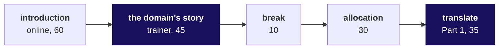
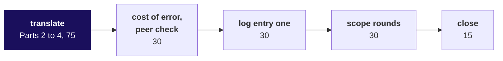

# Day sheet, Build 1 Monday: which branch of Kalpa Health is short, and how will each group answer its part?

**TRAINER ONLY.** Nothing on this page reaches a learner. It names every plant in the Kalpa Health
data with its witness number, and a learner who reads it has lost the week.

Posts to <!-- sync:module:W03/D1 -->Module 1: Foundations of AI and Data<!-- /sync:module:W03/D1 -->, on <!-- sync:day-date:W03/D1 -->Mon 19 Oct 2026<!-- /sync:day-date:W03/D1 -->.

There is no IITGN faculty block on this day. Build 1 opens, and US healthcare enters the programme
today, so the day carries the domain's story. The Programme Head introduces the build week online
for 60 minutes from the introduction deck. The trainer then tells the US healthcare story for 45
minutes, before the allocation, so that groups choose knowing the domain. The Programme Head
allocates the five questions in 30 minutes, and each group translates its question into the Weeks 1
and 2 method in its own words until the 15-minute close. Nothing new is taught this week. The spine,
`docs/detailing/W03_build1_spine.md`, approved on 29 September 2026, is this day's gate, so the pack
was built from it without a spine of its own.

## Which questions does the room climb on Monday, in the order you ask them?

Dr Menon's question is the week's: **which branch of Kalpa Health is short of the plan, and what
should she do?** In full: her dashboard shows test volumes up 5 percent from Q2 to Q3 against a plan
of 18, and she wants to know where the 13 points went before she takes the second half's plan to the
board. Monday's question, in the room's words, is **which part of Dr Menon's question will each
group answer, and with which move it already owns?** Ask each question below before its answer
reaches the screen, take one or two answers in the chat or the room, then show it.

### 1. What has Dr Menon seen, what are her heads asking, and why is it Meera's question again?

Deck section 1, S2 to S6, about 10 minutes, the Programme Head online.

**Who needs the answer.** Every learner, before any file opens: a group that starts from the data
answers a question nobody asked, and Dr Menon carries its number to her board.

**The questions on the way.**

| | Ask the room | Show once the room has answered |
|---|---|---|
| 1 | What does Dr Menon's dashboard show, and against what plan? | Test volumes up 5 percent from Q2 to Q3 against a plan of 18, which leaves 13 points to explain, across six US metros. |
| 2 | Which five questions do her heads ask, and what does each decide? | Revenue, bookings, billing, no-shows and the campaign, each tied to a decision: where recovery goes, a field team or a staff cut, the figure at the close, a receptionist or a closure, extending an offer. |
| 3 | What changes between Meera's question and Dr Menon's? | The letters in the chat, then the answer, b: the vocabulary and the cost of an error change, and the method holds. |
| 4 | What carries over from Kalpa Retail, and what does not? | The tree, the ladder, reconcile and the fair comparison carry over unchanged; the words, who pays and what an error costs do not. |

### 2. How does a US laboratory make its money, who pays it, and what may its data team touch?

Deck section 2, S7 to S9 live for about 5 minutes, D10 to D14 for self-study; then the trainer's
story, 45 minutes, from `trainer/C2_W03_D01_domain_story_TRAINER.md`.

**Who needs the answer.** Every group, before it chooses a question: nobody in the room has worked in
US healthcare, and a group that chooses billing without knowing what a remittance is chooses on the
title alone.

**The questions on the way.**

| | Ask the room | Show once the room has answered |
|---|---|---|
| 1 | What happens to one blood test between the draw and the claim? | James Carter's order, draw, lab and claim at $135, with the plan's 835 coming back weeks later. |
| 2 | Of James's $135, how much reached the lab from his plan? | $56.16; the contract allowed $70.20, wrote off $64.80, and James owes $14.04. |
| 3 | Which real companies look like Kalpa Health? | Quest and Labcorp on the US side, Optum India and AGS Health on the Bengaluru side, with the facts on D10. |
| 4 | Where does $100 of a lab's charges go? | On illustrative numbers, $45 allowed, $42 of net revenue and $6 of operating income. |
| 5 | Who asks the data team for what, and which rules bind the data? | Each head's number and its cost, then HIPAA, the agreements and the ladder from describing to acting. |

### 3. Which five questions do Dr Menon's heads ask, and which files does each one start from?

Deck section 3, S15 to S24 live for about 9 minutes, the odd D slides for self-study.

**Who needs the answer.** Every group, at the allocation: a choice made on a question's title lands a
group on work it cannot defend on Thursday.

**The questions on the way.**

| | Ask the room | Show once the room has answered |
|---|---|---|
| 1 | What does the finance head ask about revenue, and which files does it start from? | Which branch of billed revenue is short; seven files, about 81,000 rows, from the claims to the price list. |
| 2 | What does the operations head ask about bookings? | How far bookings fell in two metros, and why; both booking files, sites, patients, booking lines and the claims as a second count. |
| 3 | What does the finance head ask about billing? | Which claims are unpaid and for how much; 11,356 claims against 11,343 postings. |
| 4 | What does the operations head ask about KH-ATL-03? | Whether the centre is really worse at no-shows; 7,133 visits at twelve centres. |
| 5 | What does the marketing head ask about the offer? | Whether the at-home offer caused 9 percent more bookings; 2,381 offers against every booking. |

### 4. Which moves from Weeks 1 and 2 could answer each question, and why does the week teach nothing new?

Deck section 4, S26, S27, S33 and S34 live for about 7 minutes, D28 to D32 for self-study.

**Who needs the answer.** Every group, for Part 2 of its worksheet, which the mini project's first
criterion scores at 8 of 40 marks.

**The questions on the way.**

| | Ask the room | Show once the room has answered |
|---|---|---|
| 1 | Which moves do you own from Weeks 1 and 2? | Ten, on S27: the tree, the ladder, profile and reconcile, real or noise and cause or coincidence, the note; the tree as SQL, joins, windows, one row per entity, the pivot. |
| 2 | Which of these did you find hardest? | Hear two answers; the slide answers nothing about fit. |
| 3 | Why does the week teach nothing new? | The domain is what is new; a domain question is always answered, and a method question gets a question back. |
| 4 | Who decides which move fits which question? | Each group, in Parts 1 and 2 of its worksheet; nobody in the room names a mapping. |

### 5. How are the groups allocated to the five questions, and what happens where groups share one?

Deck section 5, S35 to S38, about 5 minutes in the introduction; the allocation itself runs after
the story, 30 minutes.

**Who needs the answer.** Every learner: the question a group takes is the one each member defends
alone in Thursday's viva.

**The questions on the way.**

| | Ask the room | Show once the room has answered |
|---|---|---|
| 1 | How many groups are there, and how big is each? | The plan is 35 learners in nine groups, eight of four and one of three, for five questions. |
| 2 | How does the allocation run? | Groups confirmed, the Programme Head allocates, each group reads its brief. |
| 3 | What happens where groups share a question? | The panel hears them back to back, and each defends its own caveats. |

### 6. How does a group turn its question into a plan by the close, and what goes in its logs?

Deck section 6, S39 to S45, about 9 minutes in the introduction; the translation runs 35 minutes in
block one and 75 in block two, then the cost of an error, the log and the scope rounds.

**Who needs the answer.** Each group on Wednesday, when the checkpoint opens the day: a group with no
pinned scope spends the build week deciding what to build.

**The questions on the way.**

| | Ask the room | Show once the room has answered |
|---|---|---|
| 1 | How do today's two blocks run? | S40's two rows: 60, 45, 10, 30 and 35; then 75, 30, 30, 30 and 15. |
| 2 | What are the six parts of the worksheet? | The words, the move, the vocabulary, the first three moves, the cost of an error, the scope. |
| 3 | Which words map, and where does the map break? | Three seeded pairs (order and booking, item and test, cancellation and no-show), and five or more of each group's own. |
| 4 | What goes in the challenges log, and why today? | What stopped the group, what it tried, what it decided; Thursday's viva reads it. |
| 5 | What do Kavya's four checks ask? | The baseline, the denominator, the evidence and a second way. |
| 6 | What does a pinned scope say? | What the group will answer, for whom, by counting what in which files, and the one thing it will not do. |

### 7. Which events are scored this week, on which days, and on what criteria?

Deck section 7, S46 to S53, about 12 minutes, with a minute for questions.

**Who needs the answer.** Every learner: the mock and the group discussion score each learner alone,
and the presentation scores every member on the caveat.

**The questions on the way.**

| | Ask the room | Show once the room has answered |
|---|---|---|
| 1 | How does the week run? | Monday to Saturday, with Dussehra on Tuesday 20 October. |
| 2 | What does every group ship? | The presentation, the one-slide answer, the notebook or SQL, the decisions log and the challenges log. |
| 3 | How is the mini project scored, and what if the demo fails? | 40 marks, 34 for the group and 6 per learner; a failed demo costs the demo's share and never the analysis. |
| 4 | How is Mock R1 scored? | 30 marks per learner, on Thursday 22 October. |
| 5 | How is the group discussion scored? | 30 marks per learner, on Friday 23 October and the morning of Saturday 24 October. |

### What does Dr Menon hear at the close, in answer to Monday's question?

No number yet, and none is due. She hears nine scopes, each one sentence with what the group will
count, in which files, and the one thing it will not do, pinned where every group can see them, and
she hears that each group states its headline claim, with its denominators and caveat, at
Wednesday's close.

## What does Monday cover, and where does it stop?

| | |
|---|---|
| **Start from** | Dr Menon's words: her dashboard says test volumes grew 5 percent from Q2 to Q3 against a plan of 18, and she cannot say which branch of Kalpa Health is short. No tool opens before her question is on the table, and nobody in the room has worked in US healthcare. |
| **Go as far as** | Every group allocated, its question written in its own words, mapped onto the move that leads and the move that checks it, a vocabulary map of eight pairs or more, three first moves each with a file and a count, the cost-of-error question answered, the scope pinned in one sentence with its "we will not", and entry one in the challenges log. |
| **Stop before** | Any teaching. Any mapping handed to a group. Any analysis past opening a file to see what a column holds before the group's scope is pinned. Any Kalpa Health tree, ladder or comparison drawn for the room. Any confirmation or denial of a plant. |
| **Comes later** | Tuesday 20 October is Dussehra. Wednesday: the checkpoint, the trainer's parallel build on a smaller slice, profile, clean and reconcile, and the headline claim. Thursday: Mock R1 and build completion. Friday and Saturday: the expert's group discussions and the presentations. |
| **Cut first** | The peer check in block two, to 15 minutes, then the scope rounds to two minutes a group. **Never cut the story's money and tree parts, the translation, entry one in the log, or the close.** |

## Who runs what today?

| Role | What they do today |
|---|---|
| The Programme Head | Runs the introduction online from the deck (60 minutes) and the allocation (30 minutes), and chooses how the nine groups are allocated. |
| The trainer | In the room: runs the link and reads the chat aloud, tells the domain's story (45 minutes), runs the translation on the floor, hears the scope rounds and runs the close. |
| The Academic TA and the TAs | On the floor with the trainer during the translation; check that every group's log has entry one; own the open build time after the second block. |
| The Principal Advisor | Not in today's run. Takes a share of Thursday's mocks and of the group discussions, online. |
| The industry expert and the senior industry leader | Not in the room until Friday and Saturday respectively. |

## How do block one's 180 minutes run, and which slides carry each part?

The story's 45 minutes come from block one's translation block. The first wave ran that block at 90
minutes; it now runs at 35, and 10 of the minutes it gave up are a break after 105 minutes of
listening.

| Part | Slides or file | Who | What must land | If short of time |
|---|---|---|---|---|
| The introduction, 60 | `slides/C2_W03_D01_introduction_STUDENT.pptx`, cover to S53, the D slides left for self-study | The Programme Head, online | Dr Menon's question in her words, the five questions with their files, the method map with no mapping handed over, how the allocation runs, today's work, and the three scored events with their days | Section 2 to S7 alone, since the story follows; never sections 3, 6 or 7 |
| The domain's story, 45 | `trainer/C2_W03_D01_domain_story_TRAINER.md`, parts 1 to 6; the deck's D10 to D14 carry the same ground for self-study | The trainer, no laptop open | Each learner can say what gross charges, the allowed amount, a contractual adjustment, patient responsibility and net revenue are, tell a rejection from a denial, and say what an offshore team may touch and why that lives in agreements and contracts | The talk track's own order: part 2 to its drawing and question, then part 6's asides; never part 3, the money, or part 5, the tree |
| Break, 10 | | | | |
| The allocation, 30 | Deck S36 to S38 on screen; the briefs in `briefs/` | The Programme Head | Every group holds one question and its brief, and every learner knows their group | The brief-reading minutes come out of the translation, never the allocation |
| Translation, Part 1, 35 | `briefs/C2_W03_D01_translation_worksheet_STUDENT.md`, Part 1 and the start of Part 2 | Groups, with the trainer and TAs on the floor | Each group has its stakeholder's words taken apart and its one-sentence question written, and can name the moves that apply | Nothing; a group that is slow here is slow all week |

**Where the story sits today, and its last line.** The talk track's table puts the story before the
introduction and calls that placement proposed. This pack runs it after the introduction and before
the allocation, so that groups choose knowing the domain. Tell it unchanged, and end on its hand-over
line, which now brings the room back to the
question it heard an hour earlier: "That is the business. Its COO, Dr Priya Menon, has sent us one
page: Kalpa Health's test volumes grew 5 percent from Q2 to Q3 against a plan of 18, and she wants
to know which branch of the business is short." Then add one sentence: "After the break, the
Programme Head allocates her five questions."

**What the story never says.** The talk track's list holds: no count of a test, a booking or a panel,
no large order or contract, nothing on how a file is exported, keyed or dated, no repeated rows or
postings, nothing on who is in a rate's denominator, whether a gap is chance, or who was offered
what.

## How do block two's 180 minutes run, and which slides carry each part?

| Part | File | Who | What must be true at the end | If short of time |
|---|---|---|---|---|
| Translation, Parts 2 to 4, 75 | The worksheet; the group's brief and the data dictionary; a group may open a file to see what a column holds | Groups; trainer and TAs on the floor | Each group has named the move that leads, the way from its brief that uses it and the way that checks it, with the fact that would make it switch, redrawn its Week 1 or 2 picture in Kalpa Health's words, mapped eight pairs or more, and written three first moves each with a file and a count | Nothing |
| The cost of an error and the peer check, 30 | Part 5, then two groups on different questions swap worksheets and run Kavya's four checks | Groups | Every worksheet has been read by someone outside the group | The peer check to 15 minutes |
| Entry one in the challenges log, 30 | `briefs/C2_W03_D01_challenges_log_STUDENT.xlsx`; the group's repository holds the worksheet, both logs and the brief | Groups; the Academic TA checks the logs | Nine logs with one dated entry each | Nothing |
| Scope rounds, 30 | Each group's Part 6 | The trainer, about three minutes a group | Nine scopes heard, each with its "we will not" | Two minutes a group |
| The close, 15 | Deck S53 on screen | The trainer | Scopes pinned where every group can see them; Wednesday's checkpoint and headline claim stated | Nothing |
| After the second block | Open build time | TAs | Groups start the build against their own scope and log challenges as they happen | |

Block one is 60, 45, 10, 30 and 35, which is 180 minutes. Block two is 75, 30, 30, 30 and 15, which
is 180 minutes.

**How you know each group is on track, before the close.** Three checks on the floor, one learner from
each group, under a minute each. After Part 1: read me your one-sentence question. After Part 2:
which move leads, which checks it, and what would make you switch? After Part 4: which file does
your first move open, and what will it count?

## Which words does the trainer say at each turn of the day?

**Before the link opens, one minute.** "For the next hour the Programme Head runs the session online.
Keep your chat open, because you will answer in letters. Every file you need is in the `briefs` and
`data` folders of today's pack, and you have them now."

**After the introduction, before the story.** "Laptops closed. Before anyone chooses a question, the
business: 45 minutes on how a US lab gets paid."

**After the allocation, two minutes.** "Each group has its brief and the translation worksheet. For
the next half hour, do one thing: take your stakeholder's words apart and write their question in
one sentence a dataset can answer. Nobody in this room will tell you the mapping. We will answer any
question about the domain, like what a phlebotomist does or what a remittance is. We will answer a
question about the method with a question back. If you are stuck, write it in the challenges log
first, then call one of us."

**To a group waiting to be told.** Never the mapping. Ask, in this order, and stop at the first one
that moves them: "What number did your stakeholder quote, and what is it a number of?" Then: "When
Meera said sales, what did you draw first?" Then: "Which of your Week 1 pictures has a box for the
thing your stakeholder is worried about?"

**The close, 15 minutes.** "Read me your scope in one sentence, and the one thing you will not do this
week." Hear each group and pin each sentence on the board or in the channel. Then: "Wednesday opens
with the checkpoint: three questions, two minutes per group. A group that cannot answer them is
stuck, and Wednesday is the day to say so, because Thursday opens the mocks. Before Wednesday ends,
each group states its headline claim in one sentence, with its denominators and its caveat. Tuesday
is Dussehra. Tonight is build time with the TAs."

## How are nine groups allocated to five questions, and which way does the Programme Head choose?

The tracker's build-week anatomy locks five sub-problems with three groups each, which is fifteen
groups. The plan is 35 learners in nine groups, eight of four and one of three
(`data/programme/facts.yaml`, cohort, and its `groups` conflict, whose working rule leaves the
allocation to this sheet). Both locked numbers cannot hold with nine groups, so the Programme Head
chooses on the day, and this sheet gives both ways.

| | Option A: three questions, three groups each | Option B: all five questions |
|---|---|---|
| **Shape** | Three questions with three groups each; two briefs spare | Four questions with two groups each, and one with a single group |
| **Keeps** | The tracker's three groups per sub-problem, so Saturday's panel hears three answers to one question back to back | The tracker's five sub-problems, so every one of Dr Menon's five questions gets an answer on Saturday |
| **Gives up** | Two of Dr Menon's questions go unanswered, so her board answer is partial | Trios become pairs, and one group has no counterpart to be compared with |
| **Wednesday's parallel build** | The trainer's smaller slice is New York's revenue tree, a metro where neither the employer contract nor the booking-system switch sits, so it shows the revenue method without handing any group its finding; under A it sits beside the three revenue groups | The same slice and the same limit, beside the two revenue groups |
| **Thursday's viva** | Viva prompts for three questions | Viva prompts for five |
| **Which questions** | 1 revenue, 3 billing and 5 campaign, with 2 and 4 spare | All five, with the group of three on question 4, no-shows, whose files are the smallest |

**Running the 30 minutes.** If the group list is not ready when the allocation opens, the Programme
Head settles it first. One way that fits the time: each group reads the five cards in section 3 of
the deck and writes a first and a second choice (5 minutes); the Programme Head allocates by choice,
breaking ties by lot (10 minutes); each group reads its brief (15 minutes). The deck promises no
method, so the Programme Head may use another.

## What does a sound translation sound like, question by question?

This is what a group that has made the transfer writes by the close. It is for the trainer's ear on
the floor and is never read out, shown or paraphrased to a group.

| Question | The move that leads | Vocabulary a strong group adds | Three first moves a strong group writes | The tell of a group waiting to be told |
|---|---|---|---|---|
| 1 revenue | The revenue tree (Week 1 Monday), with which total is the number and the typical value, and the mix split of Week 1 Tuesday | Patient for customer; bookings per patient for orders per customer; tests per booking for items per order; a panel for a basket priced as one line, with no clean twin; billed charges against the allowed amount, which retail never had; an employer account for Week 1's business order | Decide what one test is, and count Q2 and Q3 both ways from `booking_tests`; total billed charges by quarter and reconcile them to the claims file, converting every amount; split billed charges by payer and by single test against panel, with the median beside the mean | Writes "revenue is the sum of billed_amount" and asks which chart to draw |
| 2 bookings | The investigation ladder (Week 1 Tuesday), rung 1 first, with reconcile across two systems (Week 1 Wednesday) | Booking for order; a patient service centre for a store; the new system's codes for the old ones; a system change for Week 1's migration | Count bookings per metro per quarter in `bookings_legacy`, one row per `booking_id`; profile `bookings_newsys` (rows, metros, dates) and map its sites through `sites.new_system_code`; recount with both systems and compare | Explains the fall (competition, season, staff) before confirming it |
| 3 billing | Booked against collected (Week 2 Tuesday) on top of reconcile (Week 1 Wednesday) | Claim for order; posting for payment; `claim_ref` against `claim_id`; a denial with nothing paid; a reversal for a refund; a contractual adjustment, which retail never had | Profile the shapes of `claim_ref`; count an exact join, then normalise the key and count again; classify what is left (no posting, double posted, reversed, denied) before any sum | Runs one join, sums it, and asks why the totals differ |
| 4 no-shows | The fair comparison with the chance reference (Week 1 Thursday) | No-show for cancellation; a scheduled visit against a walk-in, who cannot miss a slot; a centre for a store | Count visits per centre by kind; compute the rate on scheduled visits only; ask whether chance produces the gap on this many visits | Ranks the centres and debates receptionists |
| 5 campaign | The fair comparison (Week 1 Thursday's discount: did it work?) | At-home collection for the discount; offered and not offered for exposed and control; a metro for a segment; bookings per patient for revenue per customer | Count who was offered, by metro, as a share of each metro's patients; bookings per patient in the offer's weeks, offered against not, overall and within each metro; the campaign metros' trend in the weeks before the offer | Recomputes the 9 percent and calls it confirmed |

**The tell of a group waiting to be told, on any question.** It asks "which method?" It copies its
brief's ways or the panel's questions as its plan without choosing. Its vocabulary map holds only
the three seeded pairs. Its first move is "clean the data". Its one sentence restates the
stakeholder's question word for word.

## What is planted in each brief's files, and what do you do if nobody finds it?

**TRAINER ONLY.** Every number below is recomputed from the ten CSV files by
`internal/C2_W03_D01_witness_check_INTERNAL.py`, which checks each against the spine or this sheet
and ends `RESULT: PASS`. None of it reaches a learner, and nothing on Monday confirms or denies a
plant. Percentages are changes from Q2 to Q3 unless the row says otherwise.

| Question | What is planted | The numbers | The file that shows it | Where it surfaces | If nobody finds it by Wednesday's checkpoint |
|---|---|---|---|---|---|
| The headline, every group | Dr Menon's 5 percent is her dashboard's count: tests booked in the old booking system only, a panel counted as its component tests | Dashboard 23,213 to 24,406 tests, 5.1 percent. Tests booked across both systems 23,213 to 25,022, 7.8 percent. Tests performed 22,468 to 24,399, 8.6 percent. Bookings 5,692 to 6,009, 5.6 percent. All without the employer contract, whose 1,200 wellness screenings of 5 tests each add 6,000 tests to Q3. Every reading is short of 18 | `bookings_legacy`, `bookings_newsys`, `booking_tests` | Any group that defines one test and counts both systems; questions 1 and 2 first | "What did the dashboard count as one test, and from which system?" |
| 1 revenue | One employer wellness contract in Q3, and panels billed as one claim line | Claim KH-CLM-007802, account EMP-0007, Dallas, 6 August, $180,000 for 1,200 screenings: 14.6 percent of Q3 billed charges of $1,231,001. Billed charges grow 26.9 percent from Q2's $970,098 with it, ahead of the plan, and 8.3 percent without it. The Q3 mean claim is $210.50 with it and $179.75 without; the median is $150 in both quarters, and Q2's mean is $176.13. 22,152 claim lines bill 46,867 tests on the completed bookings behind them (48,235 counting cancelled bookings, which `booking_tests` also lists). 60 billed amounts are text with a dollar sign, such as "$265.00" | `claims`, `booking_tests`, `test_catalogue` | Sorting claims by amount; setting the median beside the mean; counting tests against claim lines; converting the amount column | "Which one claim moves your Q3 average most?" Then: "What does one claim line count?" |
| 2 bookings | Chicago and Philadelphia moved to the new booking system on 18 September, and the old system's export carries only its own bookings; the old export repeats rows from a mid-quarter re-export; the new system writes dates month first | The two metros fall 23.0 percent in the old export (1,415 to 1,090 bookings) and 12.2 percent across both systems (1,415 to 1,243): Chicago 754 to 571 in the old export, minus 24.3 percent, and 656 in truth, minus 13.0; Philadelphia 661 to 519, minus 21.5, and 587, minus 11.2. The other four metros grow: Dallas 7.7, Phoenix 13.0, New York 6.8 and Atlanta 21.2 percent. The old export holds 11,729 rows over 11,549 booking ids: 180 ids twice, booked 1 June to 26 September, 30 of the pairs differing in `updated_at` and 6 in `channel`. The new system holds 153 bookings, dated `09/18/2026` to `09/30/2026` | `bookings_legacy`, `bookings_newsys`, `sites` | Rung 1, confirming the fall in every system; a distinct count of `booking_id`; the sites' `new_system_code` | "How many rows, and how many distinct booking ids?" Then: "Where are Chicago's bookings after mid-September?" |
| 3 billing | The posting system keys claims as bare digits or CLM-numbers; duplicate ERA loads double-post; the employer claim is unpaid; denials post with nothing paid | An exact join on `claim_ref` matches 216 of 11,343 postings, 1.9 percent: 216 carry the claim id, 2,269 a CLM-number and 8,858 bare digits. Normalised to the six-digit serial, every posting matches. 280 double posts, the same claim and amount paid twice, worth $19,204.63; 105 reversals. The claims file marks 1,175 of the 11,355 retail claims denied, 10.4 percent (Medicaid 14.9, commercial 11.3, Medicare 8.8, self-pay none), billing $230,132; 1,137 of them carry a denial posting that pays $0.00, and the other 38 have no posting at all. 398 claims have no posting, the $180,000 employer claim among them, spread across all six months. Paid net of the double posts is $801,314 against $2,201,099 billed, 36.4 percent, since payers allow a contracted share of list price | `claims`, `remittances` | Profiling the shapes of `claim_ref` before joining; counting postings per claim | "Show me five `claim_ref` values beside five `claim_id` values." |
| 4 no-shows | KH-ATL-03 runs by appointment, while the other centres' visit counts include walk-ins, who cannot miss a slot | KH-ATL-03: 52 visits, 50 scheduled and 2 walk-in. On all visits 19.2 percent against 8.7 percent for the other eleven centres, the next worst at 9.6. On scheduled visits 20.0 percent (10 of 50) against 15.2 percent, the next worst at 16.8. A gap that size or larger arises by chance with probability 0.22 (binomial, 50 visits at 15.2 percent) | `appointments` | Splitting visits by `kind`; asking what the rate is out of | "What is the rate out of, for KH-ATL-03 and for the others?" Then: "Could chance do it on 50 visits?" |
| 5 campaign | The offer went at random to half the patients in three metros already rising, Dallas, Atlanta and Phoenix, and to a fifth of the patients elsewhere; inside the three metros an offered patient booked less while the offer ran | 2,381 patients offered, 948 took it up. Offered patients book 9.0 percent more than the rest over 15 July to 14 September, and less in every campaign metro: Dallas minus 10.8, Atlanta minus 19.9, Phoenix minus 13.0 percent. The offer reached 50.5 percent of the three metros' patients against 21.4 percent elsewhere. Before the offer the two groups booked within about 6 percent of each other (Dallas plus 1.4, Atlanta minus 5.2, Phoenix minus 6.1), so nothing in the files shows a targeted patient. The campaign metros rose 6.9 percent in the two months before the offer. Outside them the gaps are chance: Chicago minus 4.8, Philadelphia plus 0.6, and New York plus 23.5 percent, a random draw that a permutation test puts at p of 0.03 (two-sided, 10,000 shuffles), so a group that finds it has met a false positive | `campaign`, `patients`, `bookings_legacy`, `bookings_newsys` | Splitting the comparison by metro; counting who was offered where | "Does the lift hold inside Dallas alone?" Then: "What share of each metro's patients got the offer?" |

**Profiling will also find** 180 rows in `bookings_legacy` with no `channel`, 6 of them on repeated
ids, and the one employer booking, whose channel is `employer`. Neither empty channels nor that
channel is a spine plant beyond the contract itself; both belong in the decisions log with a reason.

**If a group finds a plant on Monday.** Do not confirm it, praise it to the room or let it be
announced. Say: "Write it in the challenges log as a hypothesis, with the count you saw, and say what
would settle it on Wednesday." Another group finding it for itself is the lesson.

**The payer mix, which is no plant.** Of the 11,355 retail claims, 53.9 percent bill commercial plans,
23.9 percent Medicare, 14.5 percent Medicaid and 7.7 percent self-pay patients. Every list price and
allowed share is synthetic.

## Which real companies does the deck name, and which dated source backs each?

| Company | What the deck says | Source, checked on 1 October 2026 |
|---|---|---|
| Quest Diagnostics | $11,035 million of net revenues in 2025; about 2,400 patient service centres, many in large retail stores; mobile phlebotomy, an in-home draw, for a fee | Form 10-K for 2025 |
| Labcorp | $13,951.7 million of revenues in 2025; more than 2,200 patient service centres | Form 10-K for 2025 |
| Optum India | UnitedHealth Group's largest Global Capability Centre, for healthcare operations, technology, analytics and support | UnitedHealth Group careers, India |
| AGS Health | More than 15,000 revenue-cycle professionals worldwide; Indian delivery centres including Chennai, Hyderabad and Bengaluru | AGS Health, company page |

The links are in `internal/C2_W03_D01_provenance_INTERNAL.md`. Quest's operating income of 14.1
percent of net revenues, on D11's notes, is the dossier's figure from the same 10-K, checked on 30
September 2026.

## How does each interview question sound when answered in one breath?

The questions appear in the deck with their tags. The answers live here and are never copied into the
curriculum row.

**[S] You have joined a healthcare company; how would you apply what you did in retail to our data?**
"I start from the stakeholder's question and open the data after it: I restate the number they quote and the
decision it feeds, then map their words onto what I know, a booking as an order and a test as an
item, and I write down where the map breaks, such as a payer who stands between the lab and its
money, or an allowed amount the contract sets below the list price. Then the method is the same: a tree
to find the short branch, every fall confirmed in every system before it is explained, profile and
reconcile with a decisions log, and any comparison of two groups checked for chance and for fairness."
The example that lands, once Saturday is over: on the Kalpa Health files the same quarter's growth
reads 5.1, 5.6, 7.8 or 8.6 percent depending on what is counted and from which system, and every reading is short of the
plan. What loses the interviewer: "I would first learn the domain," or a list of tools.

**[F] What changes when the cost of an error is a missed diagnosis rather than a missed sale?**
"The errors stop being symmetric. In retail a false alarm and a missed signal both cost money, in
proportion; in health care a wrong reassurance costs a patient. So I raise the bar of evidence before
any action that reduces care, such as closing a centre or ending an offer that brings patients in,
and I prefer actions that can be reversed; I report uncertainty with the base each rate rests on,
because a rate on a few dozen visits is not a rate on thousands; and I treat every dropped row as a patient, so
the decisions log matters more." The sharp addition: not every Kalpa Health question carries
clinical risk; revenue and billing do not directly, while no-shows and home collection do, and a
strong candidate says which is which.

## What do you do when the day goes wrong?

| What happens | What to do |
|---|---|
| The online link fails | The trainer runs the deck from the pptx in the room; every slide's notes carry the words to say. The Programme Head joins the allocation by phone or runs it once the link returns. |
| The introduction overruns | Cut section 2 to S7, since the story follows, and give the deck's last minute of questions back. Never take the minutes from the story or the allocation. |
| The group list is not ready | The allocation cannot start without it. The Programme Head settles groups first; the translation absorbs the delay, and the scope rounds shrink to two minutes a group. |
| A group asks which method to use | Ask the question back (the words above). If it asks twice, ask which Week 1 picture has a box for its stakeholder's worry. Never name the method. |
| A group opens a notebook and starts analysing | Ask for the one-sentence question first. A group may open a file to see what a column holds; analysis waits for the pinned scope. |
| Two groups on the same question compare notes | They may talk about the domain. They keep their mappings to themselves until the panel, which wants their different viewpoints. |
| The group of three asks for a lighter brief | No. The brief is the same; the scope sentence can be narrower, and the group says so in its "we will not". |
| Someone asks for the scoring criteria | Point to S49 to S52 and the briefing note, which carry all three rubrics; every brief carries the mini project's. Mock R1 runs on Thursday 22 October, the group discussions on Friday 23 October closing on the morning of Saturday 24 October, and the presentations on Friday 23 October where the roster allows and on Saturday 24 October. |
| Someone asks whether the data is real | It is synthetic, Kalpa Health is fictional, and every learner holds the same bytes, so a group's number can be checked against another's. |
| Someone asks whether a US lab may send this data to India | Point to D14 and the story's part 6: HIPAA sets no border, agreements and payer contracts do, and every Kalpa Health record is synthetic. |
| Codespaces will not open | Nothing today needs code. The CSV files open in VS Code or Excel, and the worksheet is markdown. |
| A learner is absent | The group carries on; the worksheet in the group's repository is how the learner catches up, and the deck carries every section for reading alone. |

## Which file serves which moment of the day?

| Moment | File | Audience |
|---|---|---|
| The introduction | `slides/C2_W03_D01_introduction_STUDENT.pptx`, built from its markdown by `internal/C2_W03_D01_build_deck_INTERNAL.py` | STUDENT |
| The domain's story | `trainer/C2_W03_D01_domain_story_TRAINER.md` | TRAINER |
| Reading after the story, and all week | `study-notes/C2_W03_D01_domain_us_healthcare_STUDENT.md` and `cheatsheets/C2_W03_D01_us_healthcare_domain_card_STUDENT.pdf` | STUDENT |
| Before the allocation | `briefs/C2_W03_D01_briefing_note_STUDENT.md` | STUDENT |
| The allocation and the translation | `briefs/C2_W03_D01_brief_1_revenue_STUDENT.md` to `briefs/C2_W03_D01_brief_5_campaign_STUDENT.md`, one to each allocated group, all five open to every group | STUDENT |
| The translation | `briefs/C2_W03_D01_translation_worksheet_STUDENT.md` and `briefs/C2_W03_D01_data_dictionary_STUDENT.md` | STUDENT |
| Entry one and every cleaning call | `briefs/C2_W03_D01_challenges_log_STUDENT.xlsx` and `briefs/C2_W03_D01_decisions_log_STUDENT.xlsx` | STUDENT |
| The whole week's data | The ten CSV files in `data/` | STUDENT |
| This sheet, the witness check and the provenance | `trainer/`, `internal/` | Never |

The two recalc manifests in `briefs/` carry the INTERNAL tag and are not handed out. Wednesday's pack
carries the checkpoint questions, the parallel build and the catch-up plan.
