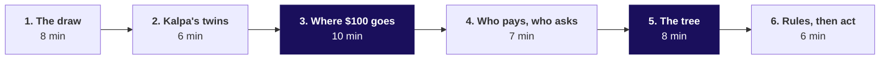
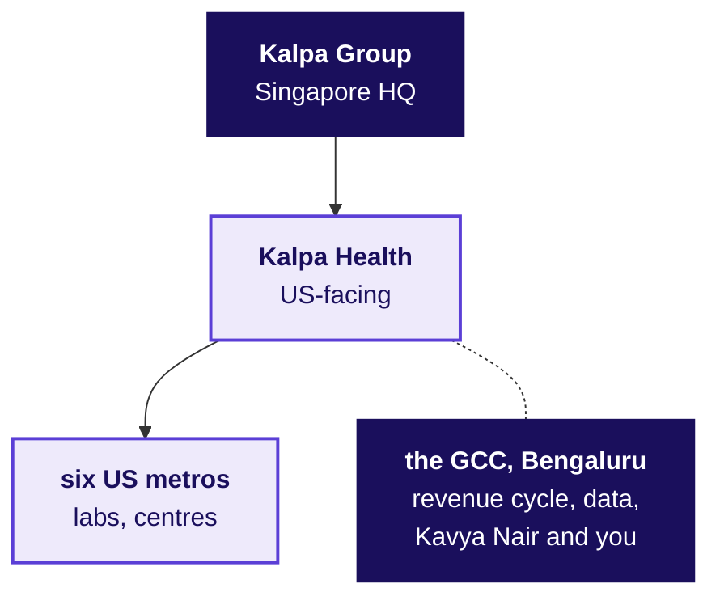
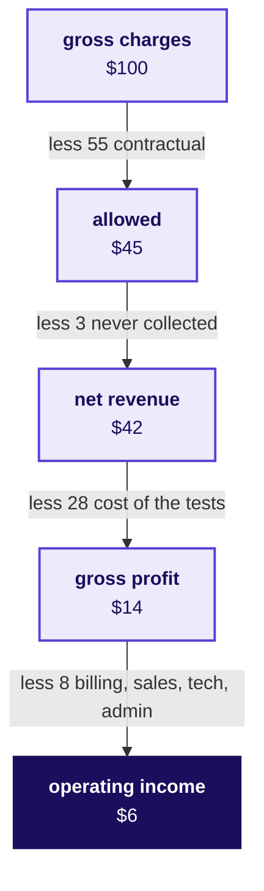
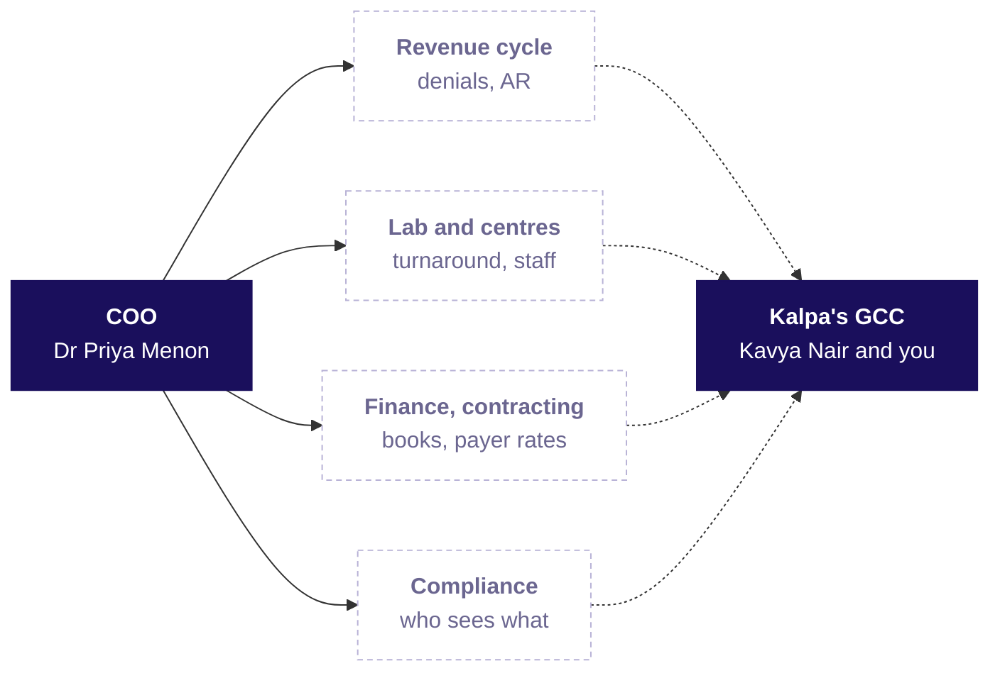
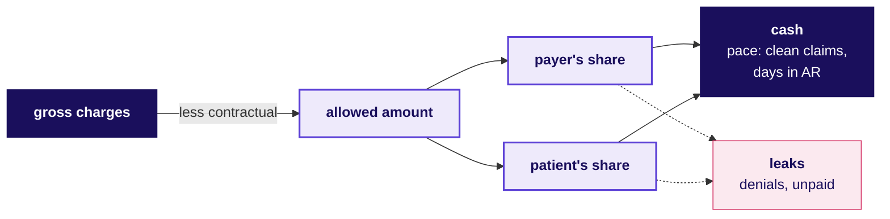
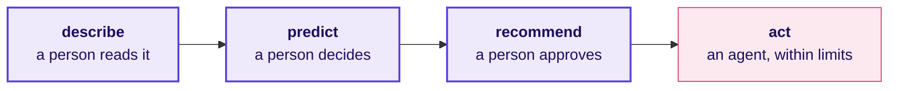

# Talk track: how does a US lab get paid, and who at Kalpa Health will ask us for what?

**TRAINER ONLY.** Nothing on this page reaches a learner. The learner's version of everything said here is `study-notes/C2_W03_D01_domain_us_healthcare_STUDENT.md`, and the one-page summary is `cheatsheets/C2_W03_D01_us_healthcare_domain_card_STUDENT.pdf`.

Most of the room has never worked in a business role, and nobody in it has worked in US healthcare. For 45 minutes before Dr Priya Menon's ask, the trainer tells the story of the business the room works inside for Build 1: one weekday at Kalpa Health's Dallas patient service centre, the real companies Kalpa Health resembles, where $100 of a lab's charges goes, who pays and who asks the data team for what, the charge-to-cash tree and its traps, and the rules and the ladder from describing to acting. No laptop opens. Each part puts one drawing of four to seven boxes on the board, the board version of a fuller drawing in the dossier. The $100 journey and the charge-to-cash tree stay up for the day; the others are wiped as the next part begins.

| | |
|---|---|
| **Start from** | Nothing about US healthcare. Assume the room has had a blood test in India, paid at a counter or on an app, and knows nothing of insurers paying labs. |
| **Go as far as** | Every learner can say what gross charges, the allowed amount, a contractual adjustment, patient responsibility and net revenue are, place a revenue-cycle metric on the tree with its divisor, tell a rejection from a denial, and say what an offshore team may touch and why that answer lives in agreements and contracts. |
| **Stop before** | Any Build 1 answer. The story never draws Kalpa Health's volume tree and never says which metro, centre, payer or quarter moved, how any Kalpa Health file is keyed, counted or exported, whether the claims and the remittances agree, why a rate differs between centres, or whether the at-home collection offer worked. Those are the groups' to find. |
| **Where it sits** | It opens Build 1 Monday, before the Programme Head's online introduction. That placement is proposed: the approved Build 1 spine gives Monday's minutes to the introduction, the allocation, the translation and the close, with no slot for the story, so the Monday day sheet has to set its minutes. |
| **Hands over to** | Dr Priya Menon's ask, read as the story's last line, which the Programme Head's introduction then opens on. |
| **Cut first** | Part 2 to its drawing and question, then part 6's last paragraph on algorithms. Never cut part 3, the money, or part 5, the tree. |

The parts add to 8, 6, 10, 7, 8 and 6, which is 45 minutes.

**Before the room arrives.** The board is clean. The trainer has read the dossier's sections 1 to 5 and 7 and the facts table at the end of this page, since a learner will ask about a real company or a law and the answer has to be the checked one. The card is printed, one per learner, and stays in its box until the day's last activity is over.

**What never gets said.** The story previews nothing the Build 1 data is built for the groups to find, under any numbers: how a test, a booking or a panel is counted; a large order, contract or account; how any file is exported, keyed or dated; repeated rows or postings; which rows count as money received; who is in a rate's denominator; whether a gap is chance; or who was offered what. Kalpa Health's numbers in the story are the ones on James's claim, which come from the data pack's own test catalogue and a commercial plan's contract terms; every other number is illustrative and is never called Kalpa Health's. Kalpa Health is never described as modelled on a real company; say "Kalpa Health is fictional, and these are real companies that look like it."

---

## Part 1: What happens to one blood test between the draw and the claim? (8 minutes)

**Say.** "Before any data, the business. Kalpa Health runs a laboratory and two patient service centres in each of six US metro areas: Dallas, Phoenix, New York, Chicago, Atlanta and Philadelphia. Picture one weekday at the Dallas centre, the place where the lab draws blood. James Carter, 58, comes in; like every Kalpa Health record he is synthetic. His doctor has ordered two tests for his diabetes, an HbA1c and a cholesterol panel, and the order, which a lab calls a requisition, carries the reason as a diagnosis code, E11.9, type 2 diabetes without complications. At the desk the clerk asks his plan electronically whether he is covered. The answer comes back in seconds: covered, the lab is in network, and he met his deductible in the spring, so he owes 20 percent of whatever the plan allows.

"A phlebotomist draws two tubes and sticks a barcode on each, the accession number, which ties the tube to his order for the rest of its life. A courier takes the day's tubes to the Dallas lab, the machines run overnight, and his results reach his doctor the next morning. That is turnaround time, and it is what doctors notice.

"Then the part that India mostly skips. The billing system turns his order into a claim: a code for each test, his diagnosis code, the doctor's ten-digit identifier, and a price from the lab's own list, $60 and $75, $135 in all. The claim goes as an electronic file called an 837 through a clearinghouse to his plan, and a few weeks later the plan answers with another file, an 835. Hold on to that $135; part 3 follows it."

**Ask the room.** "The last time you had a blood test in India, who paid, and when did you know what it would cost?"

Listen for: I paid at the counter or on the app, and I knew the price when I booked. Likely wrong answer: "My insurance paid, so it works the same way as in the US." Correct it: the test most of the room remembers was paid at booking, with the price known before the draw; in the US the lab usually bills the plan first, the plan decides weeks later what it allows, and the patient learns their share after that. Land it in one sentence: in the US a payer stands between the lab and its money, and most of a lab's data work lives in that gap.

**Draw: the claim's journey, six boxes.** Left to right, naming the file or the number on each arrow as it goes up. The dossier's section 1 carries the fuller drawing.

**If the room asks** whether James and the numbers are real: "James is invented and every Kalpa Health record is synthetic, so no real patient's information exists in the programme. His $135 is the two tests' list prices in Kalpa Health's test catalogue, the one in your data pack."

---

## Part 2: Which real companies look like Kalpa Health, and which of their work sits in India? (6 minutes)

**Ask the room first.** "A US lab has to draw blood in the US. Which of its work could sit in Bengaluru, and which could never?"

Listen for: the draw, the courier and the testing stay where the patient is; the coding, the billing, the follow-up on unpaid claims and the analysis are information work that can move. Likely wrong answer: "All of it could move, since it is cheaper here." Correct it: a sample is drawn near the patient and tested in a US lab that holds the federal certificate Medicare requires; what moves is the paperwork and the analysis, and even that moves only inside what the agreements and contracts allow, which part 6 comes back to. Land it: the GCC does the half of a lab's work that is made of data.

**Say.** "Kalpa Health tests US patients and bills US payers, and its revenue-cycle and analytics work runs from Kalpa's GCC here in Bengaluru. Two real companies have its shape at national scale. Quest Diagnostics reported $11.0 billion of net revenues for 2025, processed about 244 million requisitions and runs about 2,400 patient service centres, many inside large retail stores. Labcorp reported $14.0 billion of revenue, with more than 2,200 centres.

"The Bengaluru half has twins too. Optum India is what UnitedHealth Group calls its largest Global Capability Centre. Companies such as AGS Health and Access Healthcare do coding, billing and denial management for many US providers from Indian cities, Chennai, Hyderabad and Bengaluru among them. So there are two kinds of twin: a US health company's own centre in India, like Optum India, and a firm serving many providers, like AGS Health. Kalpa's GCC is the first kind: one company's own team, and Kalpa Health is one of its clients."

**Draw: the group, four boxes.** The group at the top, Kalpa Health below it, its US half under it and the GCC dotted to the side.

**If the room asks** whether Quest or Labcorp run billing from India: Quest's 10-K for 2025 says it has sites outside the US "including in Canada, Finland, Puerto Rico and Mexico", and its list of subsidiaries names two Indian companies without saying what they do. Labcorp's lists a leased Bangalore facility for its biopharma laboratory business, which is drug-development work, and does not describe billing there. Do not say either runs its revenue cycle from India.

---

## Part 3: Where does $100 of a lab's charges go? (10 minutes)

**Say.** "James's claim said $135. Start with that number: gross charges, every test at the lab's own list price, the chargemaster. Almost nobody pays it. James's plan has a contract with the lab that sets a price for each test, the allowed amount, and for his two tests it was $70.20. The other $64.80 is a contractual adjustment: the lab agreed in its contract never to collect it, so it is not a loss.

"The $70.20 splits in two, the plan's share and the patient's. James owes 20 percent coinsurance, $14.04, and the plan pays the other $56.16. The 835 says so with codes: group CO, reason code 45, on the $64.80 the contract takes away, and group PR, patient responsibility, reason code 2, coinsurance, on James's $14.04.

"Now take $100 of charges at an illustrative lab. The contracts take $55, which leaves $45 allowed. A few dollars of that never arrive, a denial the lab loses or a balance a patient never pays, so the lab expects $42, its net revenue. Performing the tests, the draw, the courier, the reagents and the lab, costs $28, leaving $14 of gross profit, and billing, sales, technology and administration take $8, leaving $6 of operating income. Quest reported operating income of 14.1 percent of net revenues in 2025, and $6 of $42 is 14.3."

**Ask the room.** "Of James's $135, how much reached the lab from his plan? Nothing, under $50, $50 to $100, or more than $100?" Take a show of hands for each, then reveal: $56.16 from the plan, with $14.04 owed by James, who may pay in weeks or never. The rooms that guess above $100 are the ones that most need this part.

Likely wrong answer: "All $135, since he is insured", or "about $125, and he pays a small copay." Correct it: the price list only starts the claim; the contract sets $70.20, and the coinsurance moves a fifth of that to James. Land it: in a US lab the payer and its contract decide what a test earns, and the list price decides almost nothing.

**Draw: $100's journey, five boxes.** Top to bottom, writing each deduction on its arrow. It stays up for the day.

Then one sentence beside the drawing: a $1 leak from the $45 allowed is 2.2 percent of it and a sixth of the $6, which is why a lab watches its denials so closely.

**If the room asks** what a Medicare patient would have paid: "Usually nothing for a covered lab test; traditional Medicare pays labs mostly from its own fee schedule."

---

## Part 4: Who pays Kalpa Health, and who at Kalpa Health asks us for what? (7 minutes)

**Say.** "Kalpa Health bills four kinds of payer. Commercial plans, the private insurance most Americans get through an employer. Medicare, the federal programme for people 65 and older, which pays labs from its own fee schedule. Medicaid, run by each state for people with low incomes, so Kalpa Health's six metros answer to six state programmes, Texas's among them. And self-pay patients, who have no plan or choose not to use one and pay the lab directly."

**Ask the room.** "In 2025 requisitions billed only to patients, such as uninsured ones, were 1 percent of all Quest's requisitions. What share of the money Quest was waiting to collect at year end do you think patients owed: about 1 percent, about 5, about 20, or about 50?"

Listen for the reasons. Likely wrong answer: "About 1 percent, the same as their share of requisitions." Correct it: 20 percent, because every insured patient's deductible and coinsurance is billed to the patient too, though Quest counts those requisitions under insurers, and a patient's balance is small, arrives late and is paid last, so it piles up in the receivable. Land it: who pays decides how fast the money comes, and patients are the slowest payer a lab has.

**Then say.** "Now the people at Kalpa Health who want something from us. Dr Priya Menon, the COO, wants to know which part of the business is short. The revenue-cycle head wants to know which claims will be denied and which unpaid ones to chase first, and that team works from the GCC. The lab director watches turnaround time, and the centres' operations head watches where staff are short. Payer contracting wants to know whether each plan pays what its contract says. The finance head wants our numbers to match the books, the marketing head wants to know which offers bring patients in, and compliance wants to know whether we need patient-level data at all. Kavya Nair checks everything before it leaves the team. Of Kalpa Health's heads, only Dr Menon is named."

**Draw: who asks, six boxes.** The COO on the left, the functions in the middle, dashed for the unnamed heads, the GCC on the right, and a dotted arrow from every function to the GCC. The dossier's section 4 shows each head.

**If short of time**, draw the chart, ask the question, take one answer and move on.

---

## Part 5: How does a charge become cash, and which numbers on the way can lie? (8 minutes)

**Say.** "Every revenue-cycle number hangs off one tree. Gross charges at the top. The contracts take the contractual adjustment away and leave the allowed amount. The allowed amount splits into the payer's share and the patient's. Some of both leaks out, denials the lab never overturns and balances never paid, and the rest arrives as cash. Two measures set the pace: the clean claim rate, the share of claims that pass every check before they leave without anyone touching them, and days in accounts receivable, what the lab is owed divided by a day's net revenue. Every metric is a numerator over a divisor, and each trap below changes one of them."

Then two traps, each with one illustrative example, spoken rather than drawn.

- A price list read as growth: "The lab raises every price on its chargemaster 8 percent. Gross charges go from $2,000,000 to $2,160,000 in a month. The contracts allow the same $900,000 as before, so not one more test was done and not one more dollar will arrive."
- Counts against dollars: "In a month, 500 of 10,000 claims were denied at first, 5 percent. Those claims carried $70,000 of $2,000,000 of charges, 3.5 percent. Both are right. Say which one you mean, every time."

**Ask the room.** "Days in accounts receivable fell from 45 to 38 in a month. Did the lab start collecting faster?"

Likely wrong answer: "Yes, seven days faster." Correct it: maybe, and maybe the team wrote off a block of old claims, which shrinks what is owed without a dollar collected; read the write-offs beside days in AR before calling it progress. Land it: before a number means anything, ask what its numerator and its divisor hold.

**Draw: the charge-to-cash tree, six boxes.** Gross charges on the left, the contractual adjustment written on its arrow, the allowed amount splitting into the two shares, cash and leaks on the right. It is the board version of the tree in the dossier and on the card, and it stays up for the day.

**Leave it on the board.** It is the picture of how a US lab's money arrives, and the volume half is the groups' to draw.

---

## Part 6: Which rules bind the data, and how far may a model or an agent go? (6 minutes)

**Say.** "A US lab's data sits under rules. HIPAA, the US health privacy law, protects health information that identifies a patient, which it calls PHI, held by health plans, clearinghouses and providers that send claims electronically, a lab among them. When the lab or a company working for it uses, shares or asks for PHI, it limits the data to the minimum the purpose needs, with a few exceptions such as treatment. Data stops being PHI in one of two ways: an expert finds the risk of identifying anyone very small, or eighteen kinds of identifier come out, every date down to the year among them, and the lab knows of no way to identify anyone from what is left. A claim number counts among them, so a table without names can still be PHI. A company that handles PHI for the lab signs a business associate agreement, which sets what it may do with the data, how it guards it and that it reports breaches.

"HIPAA itself has no rule keeping PHI inside the US: HHS, the US health department, says a provider may store it abroad under such an agreement. The limits on offshore work come from the agreement and from payers' contracts. Texas's Medicaid managed-care contract, for example, requires the plan and all its subcontractors, vendors, agents and service providers to do the contract's work inside the US unless the state approves in writing, and forbids moving the state's confidential information outside the US. Kalpa Health bills Medicaid in Texas, so what those terms leave the team in Bengaluru is written in its contracts with the Texas plans.

"Then the ladder. Analytics describes, and a person reads it. A model predicts, and a person decides. A model recommends, and a person approves. An agent acts within limits, and nobody checks before it takes effect. The further right, the more a wrong answer costs. On the payers' side, lawsuits allege that an algorithm was used to deny care to Medicare Advantage patients, and in February 2024 CMS, the agency that runs Medicare, told those plans that an algorithm may assist while the decision rests on the individual patient."

**Ask the room.** "Which of these should the team in Bengaluru do: read a patient's name to call a plan about a claim, train a denial model on de-identified claims, let an agent send an appeal with no person reading it, or accept a diagnosis code a model suggested to get a claim paid?"

Listen for the reasons as much as the choices: the de-identified model is the safest; reading the name depends on what the agreement and the payers' contracts allow; the agent's appeal needs a person because it asserts facts about care; and the suggested diagnosis is never acceptable on its own, since a diagnosis the doctor did not give is a false claim. Likely wrong answer: "The diagnosis code, since the model is 95 percent accurate." Correct it: a code must match what the doctor documented, and a model's accuracy cannot make an unsupported code true; a coder accepts or changes every suggestion. Land it: in a lab, a model may rank, flag and draft, and a person decides anything that asserts a diagnosis or denies care.

**Draw: the ladder, four boxes.** Left to right, the last one in rose.

**Hand over.** Say the line that opens the case: "That is the business. Its COO, Dr Priya Menon, has sent us one page: Kalpa Health's test volumes grew 5 percent from Q2 to Q3 against a plan of 18, and she wants to know which branch of the business is short." The Programme Head's introduction begins on her question.

---

## Which facts may the trainer quote, and where does each come from?

Each was checked on 30 September 2026. The URLs are in `internal/C2_W03_D01_domain_sources_INTERNAL.md`.

| Fact | Source |
|---|---|
| Quest had net revenues of $11,035 million in 2025, processed about 244 million requisitions and had about 2,400 patient service centres, many in large retail stores | Quest Diagnostics, Form 10-K for 2025, filed 26 February 2026 |
| Quest's 2025 operating income was $1,556 million, 14.1 percent of net revenues, with cost of services at 66.8 percent and selling, general and administrative costs at 17.8 percent; days sales outstanding were 48 at the end of 2025 and 2024 | Quest 10-K for 2025 |
| Requisitions billed to patients alone were 1 percent of Quest's volume, patients 12 percent of revenue and 20 percent of receivables, since insured patients' deductibles and coinsurance count as patient revenue while their requisitions count under insurers | Quest 10-K for 2025 |
| Quest's 10-K for 2025 names sites outside the US "including in Canada, Finland, Puerto Rico and Mexico", and its subsidiaries list (exhibit 21.1) names two Indian companies without describing their work | Quest 10-K for 2025 and its exhibit 21.1 |
| Labcorp had revenue of $13,951.7 million in 2025, more than 2,200 patient service centres, and lists a leased biopharma laboratory facility in Bangalore | Labcorp Holdings, Form 10-K for 2025, filed 24 February 2026 |
| Optum India is UnitedHealth Group's largest Global Capability Centre | UnitedHealth Group careers, India |
| AGS Health reports more than 15,000 revenue-cycle staff worldwide and Indian centres including Chennai, Hyderabad and Bengaluru | agshealth.com, company page |
| Medicare patients usually pay nothing for Medicare-covered diagnostic lab tests | Medicare.gov |
| James's list prices, $60 for the HbA1c and $75 for the cholesterol panel, and his plan's terms, $70.20 allowed on $135 with 20 percent coinsurance | The Build 1 data pack: the test catalogue, and the remittances file's commercial postings |
| The minimum necessary standard binds covered entities and business associates when they use, disclose or request PHI, with six exceptions, among them disclosures for treatment; HHS can act against a business associate directly for ignoring it | 45 CFR 164.502(b), eCFR; HHS, direct liability fact sheet |
| De-identification is by expert determination or by removing the eighteen safe-harbor identifiers, any unique number or code among them, with no actual knowledge that the rest identifies anyone | 45 CFR 164.514(b), eCFR |
| A business associate agreement sets the permitted uses, requires safeguards and breach reporting, binds subcontractors to the same restrictions, and returns or destroys the PHI at the end where feasible | 45 CFR 164.504(e), eCFR |
| HHS says a covered entity or business associate may use a provider that stores electronic PHI outside the US under a business associate agreement | HHS, cloud computing guidance |
| Texas's Medicaid managed-care contract requires the plan and "all Subcontractors, vendors, agents, and service Providers" to perform all services under it, laboratory services included, inside the US unless the state approves in writing, and forbids moving the state's confidential information outside the US or remote access from outside it | Texas HHSC, Managed Care Uniform Terms and Conditions, section 4.10 |
| CMS told Medicare Advantage plans on 6 February 2024 that an algorithm may assist and the decision must rest on the individual patient | CMS memo, 6 February 2024 |
| The lawsuit over naviHealth's nH Predict is allegations; in February 2025 a judge let breach-of-contract and good-faith claims proceed | Skilled Nursing News, 14 February 2025 |
