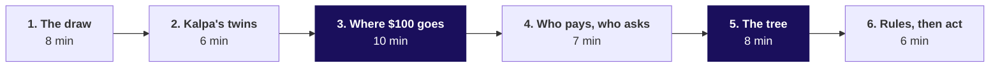
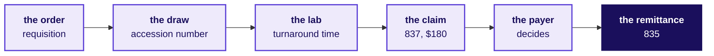
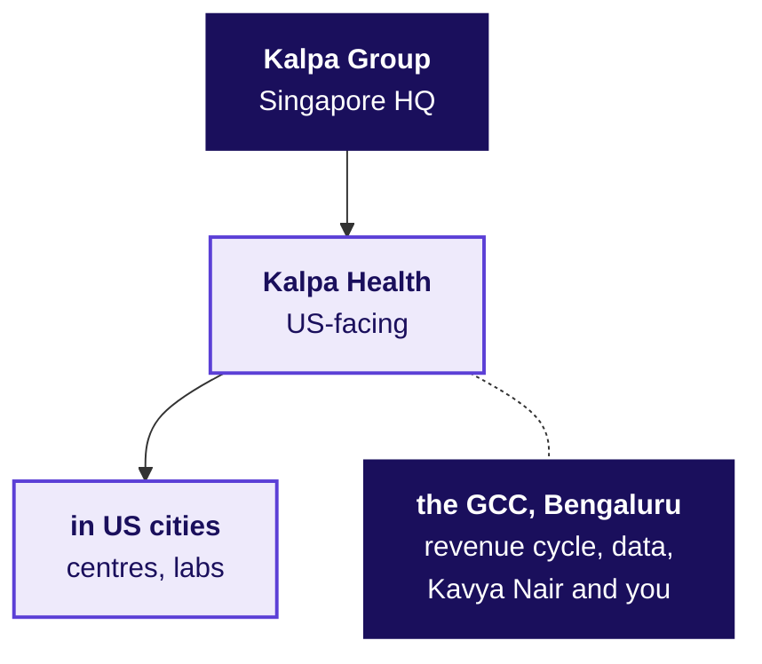
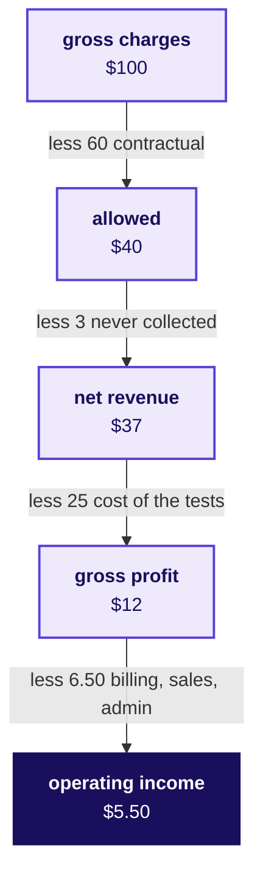
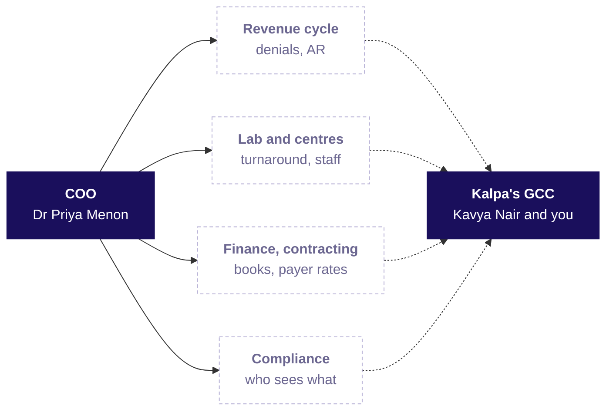
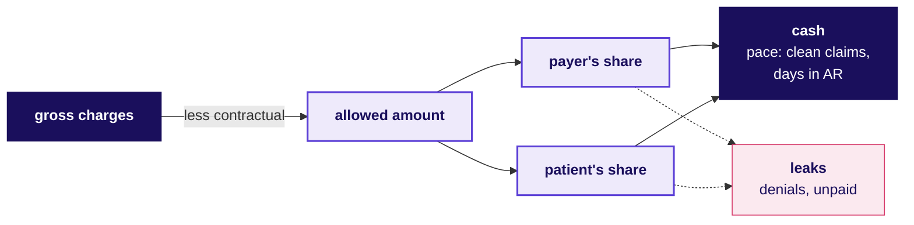
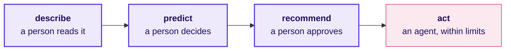

# Talk track: the domain story that opens Build 1

**TRAINER ONLY.** Nothing on this page reaches a learner. The learner's version of everything said here is `study-notes/C2_W03_D01_domain_us_healthcare_STUDENT.md`, and the one-page summary is `cheatsheets/C2_W03_D01_us_healthcare_domain_card_STUDENT.pdf`.

Most of the room has never worked in a business role, and nobody in it has worked in US healthcare. For 45 minutes before Dr Priya Menon's ask, the trainer tells the story of the business the room will work inside for Build 1: one weekday at a Kalpa Health patient service centre, which real companies Kalpa Health resembles, where $100 of a lab's charges goes, who pays and who asks the data team for what, the charge-to-cash tree and three of its traps, and the rules and the ladder from describing to acting. No laptop opens. Each part puts one drawing of four to six boxes on the board, the board version of a fuller drawing in the dossier. The $100 journey and the charge-to-cash tree stay up for the day, and the others are wiped as the next part begins.

| | |
|---|---|
| **Start from** | Nothing about US healthcare. Assume the room has had a blood test in India, paid at a counter or on an app, and knows nothing of insurers paying labs. |
| **Go as far as** | Every learner can say what gross charges, the allowed amount, a contractual adjustment, patient responsibility and net revenue are, place a revenue-cycle metric on the tree with its divisor, tell a rejection from a denial, and say what an offshore team may touch and why that answer lives in contracts. |
| **Stop before** | Any Build 1 answer. The story never draws Kalpa Health's volume tree, never says which metro, centre or payer moved, never says whether billed and collected agree, and never says whether the at-home collection offer worked. Those are the groups' to find. |
| **Where it sits** | It opens Build 1 Monday, before the Programme Head's online introduction, in the place a teaching day gives the 20-minute ask; the Monday day sheet sets which minutes of the day it takes. |
| **Hands over to** | Dr Priya Menon's ask, read as the story's last line, which the Programme Head's introduction then opens on. |
| **Cut first** | Part 2 to its drawing and question, then part 6's last two sentences, from "On the payers' side". Never cut part 3, the money, or part 5, the tree. |

The parts add to 8, 6, 10, 7, 8 and 6, which is 45 minutes.

**Before the room arrives.** The board is clean. The trainer has read the dossier's sections 1 to 5 and 7 and the facts table at the end of this page, since a learner will ask about a real company or a law and the answer has to be the checked one. The card is printed, one per learner, and stays in its box until the day's last activity is over; nothing said this morning mentions it.

**What never gets said.** The story does not preview anything the Build 1 data is built for the groups to find: which metro area, centre, payer or period moved; whether any two files agree; why a rate differs between centres; what any offer or campaign did; or how any Kalpa Health file is keyed or counted. Every number in the story is illustrative and is never called Kalpa Health's data, which is synthetic and is being regenerated for the US setting. Kalpa Health is never described as modelled on a real company; say "Kalpa Health is fictional, and these are real companies that look like it." The story names no Kalpa Health metro area, since the story's lock names none.

---

## Part 1: The draw (8 minutes)

**Say.** "Before any data, the business. Picture one weekday at one Kalpa Health patient service centre in a US city, the place where a lab draws blood. James Carter, 58, comes in. Like every Kalpa Health record he is synthetic. His doctor has ordered two tests for his diabetes, and the order, which a lab calls a requisition, carries the reason as a diagnosis code, E11.9, type 2 diabetes without complications. At the desk the clerk scans his insurance card and asks his plan electronically whether he is covered. The answer comes back in seconds: covered, the lab is in network, and he still has $400 of his deductible to pay before the plan pays anything.

"A phlebotomist draws two tubes and sticks a barcode on each, the accession number, which ties the tube to his order for the rest of its life. A courier takes the day's tubes to the lab, the machines run overnight, and his results reach his doctor 18 hours after the draw. That is turnaround time, and it is what doctors notice.

"Then the part that India mostly skips. The billing system turns his order into a claim: a code for each test, his diagnosis code, the doctor's ten-digit identifier, and a price from the lab's own list, $180. The claim goes as an electronic file called an 837 through a clearinghouse to his plan. Three weeks later the plan answers with another file, an 835. Hold on to that $180; part 3 follows it."

**Ask the room.** "The last time you had a blood test in India, who paid, and when did you know what it would cost?"

Listen for: I paid at the counter or on the app, and I knew the price when I booked. Likely wrong answer: "My insurance paid, so it works the same way as in the US." Correct it: the test most of the room remembers was paid at booking, and the price was known before the draw; in the US the lab usually bills the plan first, the plan decides weeks later what it allows, and the patient learns their share after that. Land it in one sentence: in the US a payer stands between the lab and its money, and most of a lab's data work lives in that gap.

**Draw: the claim's journey, six boxes.** Left to right, naming the file or the number on each arrow as it goes up. The dossier's section 1 carries the fuller drawing.

**If the room asks** whether James and the numbers are real: "James is invented and every Kalpa Health record is synthetic, so no real patient's information exists in the programme. The numbers are round illustrative ones chosen for easy arithmetic. Two are the story's own, and you will hear them at the end."

---

## Part 2: Which real company Kalpa Health is like (6 minutes)

**Ask the room first.** "A US lab has to draw blood in the US. Which of its work could sit in Bengaluru, and which could never?"

Listen for: the draw, the courier and the testing stay where the patient is; the coding, the billing, the follow-up on unpaid claims and the analysis are information work that can move. Likely wrong answer: "All of it could move, since it is cheaper here." Correct it: a sample has to be drawn and tested within hours near the patient, and a lab needs a US certificate to be paid by Medicare; what moves is the paperwork and the analysis, and even that moves only inside what the contracts allow, which part 6 comes back to. Land it: the GCC does the half of a lab's work that is made of data.

**Say.** "Kalpa Health tests US patients and bills US payers, and its revenue-cycle and analytics work runs from Kalpa's GCC here in Bengaluru. Two real companies have its shape at national scale. Quest Diagnostics reported $11.0 billion of revenue for 2025, processed about 244 million requisitions and runs about 2,400 patient service centres, many inside large retail stores. Labcorp reported $14.0 billion, with more than 2,200 centres.

"The Bengaluru half has twins too. Optum India is what UnitedHealth Group calls its largest Global Capability Centre. Companies such as AGS Health and Access Healthcare do coding, billing and denial management for many US providers from Indian cities, Chennai, Hyderabad and Bengaluru among them. So there are two kinds of twin: a US health company's own centre in India, like Optum India, and a firm serving many providers, like AGS Health. Kalpa's GCC is the first kind: one company's own team, and Kalpa Health is one of its clients."

**Draw: the group, four boxes.** The group at the top, Kalpa Health below it, its US half under it and the GCC dotted to the side. The dossier's section 2 names the real twins.

**If the room asks** which US cities Kalpa Health is in: "US metro areas; the story does not name them."

**If the files the room opens are still in the India setting**, because the Build 1 data is being regenerated for the US setting: "These files were built before Kalpa Health moved to the US and are being regenerated. The method you apply is the same; read each rupee column as the lab's billed or collected money, and the payer words attach when the new files arrive." Say it only if the room notices.

**If the room asks** whether Quest or Labcorp run billing from India: Quest's 10-K for 2025 names sites in Canada, Finland, Puerto Rico and Mexico and does not mention India. Labcorp's lists a leased Bangalore facility for its biopharma laboratory business, which is drug-development work, and does not describe billing there. Do not say either runs its revenue cycle from India.

---

## Part 3: Where $100 of a lab's charges goes (10 minutes)

**Say.** "James's claim said $180. Start with that number: gross charges, every test at the lab's own list price, the chargemaster. Almost nobody pays it. James's plan has a contract with the lab that sets a price for each test, the allowed amount, and for his two tests it was $60. The other $120 is a contractual adjustment. The lab agreed in its contract never to collect it, so nobody should count it as lost.

"The $60 splits in two: the plan's share and the patient's. James had $400 of deductible left, so the plan paid nothing, and the 835 said so with a code: group PR, patient responsibility, reason code 1, deductible. James owes $60 and gets a statement.

"Now on $100 of charges. The contracts take $60, which leaves $40 allowed. A few dollars of that never arrive, a denial the lab loses or a balance a patient never pays, so the lab expects $37, which is its net revenue. Performing the tests, the draw, the courier, the reagents and the lab, costs $25, leaving $12 of gross profit, and billing, sales, technology and administration take $6.50, leaving $5.50 of operating income. Quest reported an operating margin of 14.1 percent of net revenue in 2025, and the $5.50 of $37 is close to that shape."

**Ask the room.** "Of James's $180, how much reached the lab from his plan? Nothing, under $50, $50 to $150, or more than $150?" Take a show of hands for each, then reveal: nothing from the plan, and $60 is owed by James, who may pay in weeks or never. The rooms that guess high are the ones that most need this part.

Likely wrong answer: "All $180 from the plan, since he is insured", or "most of it, say $150, and he pays a small copay." Correct it: the price list only starts the claim; the contract sets $60, and the deductible moves all of it to James. Land it: in a US lab the payer and the plan year decide what a test earns, and the list price decides almost nothing.

**Draw: $100's journey, five boxes.** Top to bottom, writing each deduction on its arrow. It stays up for the day.

Then one sentence beside the drawing: a $1 leak from the $40 allowed is 2.5 percent of it and 18 percent of the $5.50, which is why a lab watches its denials so closely.

**If the room asks** what a Medicare patient would have paid: "Usually nothing for a covered lab test; Medicare pays from its own fee schedule, and in the last quarter of 2026 that schedule pays between $7.77 and $13.39 for each of four routine blood-test codes."

---

## Part 4: Who pays, and who asks (7 minutes)

**Say.** "A US lab bills four kinds of payer. Health insurers, the commercial plans most Americans get through an employer, and the private plans that run Medicare Advantage. Government payers, traditional Medicare for people 65 and older, and Medicaid, run by each state for people with low incomes. Clients, the doctors, hospitals and employers the lab bills directly. And patients, for their deductibles, coinsurance and copays."

**Ask the room.** "In 2025 Quest's patients were billed for 1 percent of its testing requisitions. What share of the money Quest was waiting to collect at year end do you think patients owed: about 1 percent, about 5, about 20, or about 50?"

Listen for the reasons. Likely wrong answer: "About 1 percent, the same as their share of requisitions." Correct it: 20 percent, because every insured patient's deductible and coinsurance is billed to the patient too, and a patient's balance is small, arrives late and is paid last, so it piles up in the receivable. Land it: who pays decides how fast the money comes, and patients are the slowest payer a lab has.

**Then say.** "Now the people at Kalpa Health who want something from us. Dr Priya Menon, the COO, wants to know which part of the business is short. The revenue-cycle head wants to know which claims will be denied and which unpaid ones to chase first, and that team works from the GCC. The lab director watches turnaround time. Payer contracting wants to know whether each plan pays what its contract says. Finance wants our numbers to match its books, and compliance wants to know whether we need patient-level data at all. Kavya Nair checks everything before it leaves the team. Among Kalpa Health's heads, the story names only Dr Menon."

**Draw: who asks, six boxes.** The COO on the left, the functions in the middle, dashed for the unnamed heads, the GCC on the right, and a dotted arrow from every box to the GCC. The dossier's section 4 shows each function.

**If short of time**, draw the chart, ask the question, take one answer and move on.

---

## Part 5: From charge to cash, and three traps (8 minutes)

**Say.** "Every revenue-cycle number hangs off one tree. Gross charges at the top. The contracts take the contractual adjustment away and leave the allowed amount. The allowed amount splits into the payer's share and the patient's. Some of both leaks out, denials the lab never overturns and balances never paid, and the rest arrives as cash. Two measures set the pace: the clean claim rate, the share of claims that pass every check before they leave without anyone touching them, and days in accounts receivable, what the lab is owed divided by a day's net revenue. Every metric is a numerator over a divisor, and each trap below quietly changes one of them."

Then the three traps, each with one illustrative example, spoken rather than drawn.

- A price list read as growth: "The lab raises every price on its chargemaster 8 percent. Gross charges rise 8 percent. The contracts allow the same dollars as before, so not one more test was done and not one more dollar will arrive."
- Counts against dollars: "In a month, 1,080 of 12,000 claims were denied at first, 9 percent. Those claims carried $96,000 of $2,400,000 of charges, 4 percent. Both are right. Say which one you mean, every time."
- Write-offs that look like progress: "Days in AR fall from 45 to 38 in a month. Nobody collected faster; the team wrote off a block of old claims. Read the write-offs beside days in AR, always."

**Ask the room.** "A lab collected $888,000 on $2,400,000 of gross charges. That is 37 percent. Is its revenue cycle broken?"

Likely wrong answer: "Yes: it lost 63 percent of its revenue." Correct it: most of the $2.4 million was never owed, since the contracts allowed $960,000, and $888,000 of $960,000 is 92.5 percent, the net collection rate; divide by what was allowed, never by the price list. Land it: before a rate means anything, ask what it is divided by.

**Draw: the charge-to-cash tree, six boxes.** Gross charges on the left, the contractual adjustment written on its arrow, the allowed amount splitting into the two shares, cash and leaks on the right. It is the board version of the tree in the dossier and on the card, and it stays up for the day.

**Leave it on the board.** It is the picture of how a US lab's money arrives, and the volume half is the groups' to draw.

---

## Part 6: The rules, and from describing to acting (6 minutes)

**Say.** "A US lab's data sits under rules. HIPAA, the US health privacy law, protects health information that identifies a patient, which it calls PHI, held by labs, plans and clearinghouses. Use only the minimum a task needs. A company that handles PHI for a lab works under a written business associate agreement. And HIPAA itself has no rule keeping PHI inside the US: HHS, the US health department, says data may be stored abroad under such an agreement. The limits on offshore work come from contracts: the agreement, the plans' contracts, and some states' Medicaid contracts, such as Texas's, which forbids moving the state's data outside the US at all.

"Then the ladder. Analytics describes and a person reads it. A model predicts and a person decides. A model recommends and a person approves. An agent acts within limits, and nobody checks before it takes effect. The further right, the more a wrong answer costs. On the payers' side, lawsuits allege that an algorithm was used to deny care to Medicare Advantage patients, and in February 2024 CMS, the agency that runs Medicare, told those plans that an algorithm may assist while the decision rests on the individual patient."

**Ask the room.** "Which of these should the team in Bengaluru do: read a patient's name to call a plan about a claim, train a denial model on de-identified claims, let an agent send an appeal with no person reading it, or accept a diagnosis code a model suggested to get a claim paid?"

Listen for the reasons as much as the choices: the de-identified model is the safest; reading the name depends on what the agreement and the plan's contract allow; the agent's appeal needs a person because it asserts facts about care; and the suggested diagnosis is never acceptable on its own, since a diagnosis the doctor did not give is a false claim. Likely wrong answer: "The diagnosis code, since the model is 95 percent accurate." Correct it: a code must match what the doctor documented, and a model's accuracy cannot make an unsupported code true; a coder accepts or changes every suggestion. Land it: in a lab, a model may rank, flag and draft, and a person decides anything that asserts a diagnosis or denies care.

**Draw: the ladder, four boxes.** Left to right, the last one in rose.

**Hand over.** Say the line that opens the case: "That is the business. Its COO, Dr Priya Menon, has sent us one page: Kalpa Health grew 5 percent against a plan of 18, and she wants to know which part of it is short." The Programme Head's introduction begins on her question.

---

## Facts you may quote, with their source

Each was checked on 30 September 2026. The URLs are in `internal/C2_W03_D01_domain_sources_INTERNAL.md`.

| Fact | Source |
|---|---|
| Quest had net revenues of $11,035 million in 2025, processed about 244 million requisitions, had about 2,400 patient service centres, many in large retail stores, and nearly 57,000 employees | Quest Diagnostics, Form 10-K for 2025, filed 26 February 2026 |
| Quest's 2025 operating income was $1,556 million, 14.1 percent of net revenues, with cost of services at 66.8 percent and selling, general and administrative costs at 17.8 percent; days sales outstanding were 48 at the end of 2025 and 2024 | Quest 10-K for 2025 |
| Patients were 1 percent of Quest's testing volume, 12 percent of its testing revenue and 20 percent of its receivables; insurers were 43, 39 and 27 percent | Quest 10-K for 2025 |
| Quest's 10-K for 2025 names sites in Canada, Finland, Puerto Rico and Mexico and does not mention India | Quest 10-K for 2025 |
| Labcorp had revenue of $13,951.7 million in 2025, $10,876.5 million from diagnostics, more than 2,200 patient service centres and more than 7,000 in-office phlebotomists, and lists a leased biopharma laboratory facility in Bangalore | Labcorp Holdings, Form 10-K for 2025, filed 24 February 2026 |
| Quest launched at-home collection in November 2023 with 5,000 mobile phlebotomists | Quest newsroom, 9 November 2023 |
| Optum India is UnitedHealth Group's largest Global Capability Centre | UnitedHealth Group careers, India |
| AGS Health reports more than 15,000 revenue-cycle staff and Indian centres including Chennai, Hyderabad and Bengaluru | agshealth.com, company page |
| The US spent $5.3 trillion on health care in 2024, $15,474 a person, 18.0 percent of GDP | CMS, National Health Expenditure fact sheet |
| Medicare patients usually pay nothing for Medicare-covered diagnostic lab tests; Medicare's 2026 fourth-quarter fee schedule pays $7.77, $10.56, $9.71 and $13.39 for codes 85025, 80053, 83036 and 80061 | Medicare.gov; CMS Clinical Laboratory Fee Schedule file |
| HealthCare.gov insurers denied 19 percent of in-network claims in 2024, from 3 to 36 percent by insurer | KFF, 24 March 2026 |
| HHS says a covered entity or business associate may use a provider that stores electronic PHI outside the US under a business associate agreement | HHS, cloud computing guidance |
| Texas's Medicaid managed-care contract forbids moving the state's confidential information outside the US and remote access from outside it | Texas HHSC, Managed Care Uniform Terms and Conditions, version 1.3 |
| Prior-authorisation decisions within 72 hours for urgent and 7 calendar days for standard requests, with a specific denial reason, generally from 1 January 2026, for Medicare Advantage, Medicaid and CHIP | CMS fact sheet on CMS-0057-F, 17 January 2024 |
| CMS told Medicare Advantage plans on 6 February 2024 that an algorithm may assist and the decision must rest on the individual patient | CMS memo, 6 February 2024 |
| The lawsuit over naviHealth's nH Predict is allegations; in February 2025 a judge let breach-of-contract and good-faith claims proceed | Skilled Nursing News, 14 February 2025 |
| Change Healthcare told HHS on 31 July 2025 that about 192.7 million individuals were affected by the February 2024 attack | HHS, Change Healthcare FAQ |
