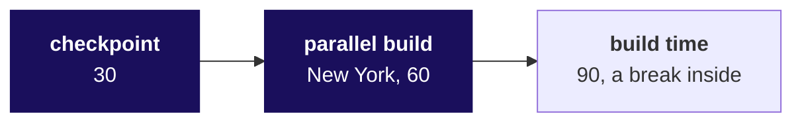
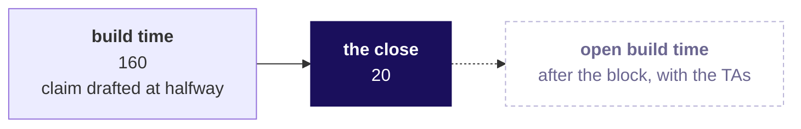

# Day sheet, Build 1 Wednesday: what will each group tell Dr Menon tonight, and can it prove every number in that sentence?

**TRAINER ONLY.** Nothing on this page reaches a learner. It names every plant in the Kalpa Health
data with its witness number, and a learner who reads it has lost the week.

Posts to <!-- sync:module:W03/D3 -->Module 1: Foundations of AI and Data<!-- /sync:module:W03/D3 -->, on <!-- sync:day-date:W03/D3 -->Wed 21 Oct 2026<!-- /sync:day-date:W03/D3 -->.

There is no IITGN faculty block on this day. Tuesday was Dussehra, so today carries build days two
and three, and the time the week held back for catching up has already gone to that. Nothing new is
taught. The day runs in four parts: the daily checkpoint (30), the trainer's parallel build on a
smaller slice, in the open (60), build time, and each group's headline claim with its denominators
and caveat at the close (20). The plant table below is the answer key for everything the groups will
find, and a headline claim in this sheet is a group's one sentence, never a bill to a payer.

## Which questions does the room climb on Wednesday, in the order you ask them?

Dr Menon's question is the week's: **which branch of Kalpa Health is short of the plan, and what
should she do?** Her dashboard shows test volumes up 5 percent from Q2 to Q3 against a plan of 18,
and her briefing note asks for "one answer per question: a sentence I can carry into the board
meeting, the evidence behind it, what would change it, and what you would have me do."
Wednesday's question, in the room's words, is **what will each group tell Dr Menon tonight, and can
it prove every number in that sentence?** Ask each question below before its answer reaches the
screen, take one or two answers, then show it.

### 1. Where does each group stand: what did its files hold, what has it matched, and what will its headline claim be counted over?

The daily checkpoint, 30 minutes, from `checkpoints/C2_W03_D03_checkpoint_questions_STUDENT.md` on
screen and `checkpoints/C2_W03_D03_checkpoint_guide_TRAINER.md` in hand.

**Who needs the answer.** Every group, and the Academic TA: Thursday opens Mock R1, so a group that
cannot answer its three questions this morning is stuck, and today is the day to say so.

**The questions on the way.**

| | Ask the room | Show once the room has answered |
|---|---|---|
| 1 | What three things does every checkpoint question ask, whatever the brief? | What the files held before anything changed, what was matched against what with the leftovers named, and what each number in the headline claim is counted over (Week 1 Wednesday's profile and rows in equal rows kept plus rows set aside; Week 1 Monday's denominators). |
| 2 | What counts as an answer in the two minutes? | A number, the file it came from, and what one row or record was when it was counted; "not yet, because" is an answer, and a guess is not. |
| 3 | What happens to a group that cannot answer one? | It names the blocker in a sentence, the trainer writes it down, and the trainer and then the TA go to that table first. |

### 2. Did New York's billed revenue grow from Q2 to Q3, and did more claims or bigger claims carry it?

The parallel build, 60 minutes, from
`parallel-build/C2_W03_D03_new_york_revenue_tree_STUDENT.ipynb`, run from
`parallel-build/C2_W03_D03_run_sheet_TRAINER.md`, which gives each step's minutes, words and
prediction letters.

**Who needs the answer.** The finance head, for New York's line on the board's page, and every group,
which watches the moves its own build needs run once on a question no brief asks in full.

**The questions on the way.**

| | Ask the room | Show once the room has answered |
|---|---|---|
| 1 | Which of four ways could answer it, and what does each cost? | The claims grow 8.0 percent and the export's rows 4.8, so only a reconciliation can say which counts New York (Week 1 Tuesday's rung 1, confirm before explaining); option C reads both files, 4,160 rows, against option B's 2,032, for about 0.7 of an hour more. |
| 2 | How many New York bookings does the old booking export hold? | 2,095 in 2,128 rows: 33 ids twice, 26 of the extra rows in Q2, so bookings grew 6.8 percent where rows grew 4.8. |
| 3 | Does every amount convert, and what does the quick fix do to the total? | Six dollar-text amounts; coerce leaves billed revenue $903 short, $668 in Q2 and $235 in Q3, and growth reads 5.7 percent against 5.5. |
| 4 | Do the claims and the completed bookings describe the same visits? | Yes: 2,095 = 2,032 completed + 63 cancelled, and 2,032 claims match one to one; the raw join fans out to 2,065 rows and $5,458 too much. |
| 5 | More claims, or a bigger mean claim? | More claims at a lower mean: 977 to 1,055 claims, $179.03 to $174.87; plus $13,964 and minus $4,389; per day, claims up 6.8 percent and billed revenue 4.3. |
| 6 | Which site carried it, and where does the build stop? | The three sites add back to every claim and dollar; KH-NYC-02 billed 69 of the 78 extra claims; the build stops at what a claim holds. |
| 7 | Does SQL, reading the raw files itself, reach the same numbers? | Yes, 977 and 1,055 claims, $174,910 and $184,485, to the cent. |
| 8 | What sentence can the finance head carry? | "Over Q2's 91 days and Q3's 92, New York's billed revenue rose 5.5 percent, from $174,910 on 977 claims to $184,485 on 1,055 claims, carried by 78 more claims at a mean claim $4.16 lower", with the caveat below it: billed is not collected. |

### 3. Can each group take its own question through the same moves, with both logs moving?

Build time, 90 minutes in block one and 160 in block two, with the trainer circulating and stuck
groups first.

**Who needs the answer.** Every group: the mini project scores the data made trustworthy at 10 of 40
marks and the analysis at 10, and both are built this afternoon.

**The questions on the way.**

| | Ask a group at its table | Listen for |
|---|---|---|
| 1 | What did your profile change about your group's plan of work? (Week 1 Wednesday's profile) | A count that surprised the group, and a decisions-log row with its reason. |
| 2 | Do rows in equal rows kept plus rows set aside, for your main file? (Week 1 Wednesday's reconciliation) | The arithmetic written out, with the set-aside rows named. |
| 3 | Which number would you put in Dr Menon's sentence right now, and over what? (Week 1 Monday's count over a denominator) | A number with its denominator and period, even if it changes by the close. |
| 4 | What is in your challenges log since this morning? (Week 1 Thursday's "not yet", with what would turn it) | A dated entry with what the group tried and what it decided. |

### 4. What is each group's headline claim, with its denominators, its period and its caveat, or what is blocking it?

The close, 20 minutes, from `checkpoints/C2_W03_D03_headline_claim_STUDENT.md` on screen.

**Who needs the answer.** Dr Menon, and every member: Thursday's viva and the weekend's panel start
from the sentence each group pins tonight.

**The questions on the way.**

| | Ask the room | Show once the room has answered |
|---|---|---|
| 1 | What four things must the sentence carry? | The number, its denominator, its period, and the caveat on its own line, with a reason inside the sentence no stronger than the evidence (Week 1 Thursday's note, claim first). |
| 2 | Which of the five wrong New York sentences would you have sent this morning? | The headline sheet's five sentences first, then its table: no base, rows as bookings, a fanned join, billed called collected, totals over unequal windows. |
| 3 | What does a group say if its headline claim is not ready? | A smaller claim with its caveat, a "not yet" with what would turn it, or the blocker in one sentence. |
| 4 | What must every learner hold before leaving, with the first mock ten minutes into Thursday? | Thursday's mock brief and the seat list, sent at the close, with each learner's slot, its minutes and the assessor. |

### What does Dr Menon hear at the close, in answer to Wednesday's question?

She hears nine sentences, one per group, each with its number, its denominator, its period and its
caveat, or a named blocker, written down word for word and pinned where every group can see them,
with the New York headline claim beside them as the model of shape. She hears that every number in a
pinned sentence reproduces from the raw files, or that the group said it does not yet.

## What does Wednesday cover, and where does it stop?

| | |
|---|---|
| **Start from** | Monday's pinned scopes, the translation worksheets and entry one in each challenges log. The files went out on Monday with the data dictionary, so every group has met them; today opens on the checkpoint, not on a drop of files. |
| **Go as far as** | Every group past profiling and into analysis, both logs moving, and one testable headline claim stated at the close with its denominators and caveat, or a named blocker. |
| **Stop before** | Any new technique; any answer to a group's question; any confirmation or denial of a plant; any comparison of New York with another metro. Learners may see the rubrics, so quote them, and never give a verdict against them. |
| **Comes later** | Thursday 22 October: Mock R1 for every learner, about 20 minutes each, the first slot starting ten minutes into the day, a technical half on Weeks 1 and 2 and a viva on the group's work, with build completion around the roster. Friday 23 October: the group discussions, the build freeze, two cold demo runs and the first presentations. Saturday 24 October: the remaining group discussions, the presentations with live demos, and grade closure. |
| **Cut first** | Build time, never the checkpoint or the close. Inside the parallel build, step 7 to its result table, then step 6 to its prediction. **Never cut the reconciliation, the headline claim or its caveat.** |

## Who runs what today?

| Role | What they do today |
|---|---|
| The trainer | Runs the checkpoint, the parallel build and the close; circulates in build time, stuck groups first. |
| The Academic TA and the TAs | On the floor in build time; read the checkpoint grid before the open build time and run the catch-up plan there. |
| The Programme Head | Not in today's run of the day; fills the Groups sheet of Thursday's roster from Monday's allocation before the close, so that the seat list can go out at the close; hears today about any group the catch-up plan names, and decides what happens next for it. |
| The Principal Advisor | Not in today's run; takes a share of Thursday's mocks and of the group discussions, online. |
| The industry expert and the senior industry leader | Not in the room until Friday and Saturday respectively. |

**The groups.** The plan is 35 learners in nine groups, eight of four and one of three. The
Programme Head allocated the groups to the five briefs on Monday; run today on whatever Monday
settled. Every part of the day works per group, so the count
changes only how long the checkpoint and the close take.

## How do block one's 180 minutes run, and which file carries each part?

| Part | File | Who | What must land | If short of time |
|---|---|---|---|---|
| The checkpoint, 30 | `checkpoints/C2_W03_D03_checkpoint_questions_STUDENT.md` on screen, opened in markdown preview and zoomed so the back row can read a table cell; the guide in hand | The trainer | Every group heard on its three questions, each written on one line of the grid as on track, slow or stuck, with any blocker | Nothing: two minutes a group is the floor |
| The parallel build, 60 | The New York notebook, run from the run sheet | The trainer | The moves in order, each prediction asked before its cell runs, four traps with their wrong numbers, the second route agreeing, and the headline claim with its caveat | Step 7 to its result table, then step 6 to its prediction |
| Build time, 90 | The group's own notebook or SQL, the decisions log and the challenges log in `content/W03/D1/briefs/` | Groups; the trainer circulates, stuck groups first | Every group past profiling, with its rows-in arithmetic written down | Build time absorbs any overrun from the first two parts |

Block one is 30, 60 and 90, which is 180 minutes. Take a break of about ten minutes inside the
build time at a point that suits the room.

## How do block two's 180 minutes run, and which file carries each part?

| Part | File | Who | What must be true at the end | If short of time |
|---|---|---|---|---|
| Build time, 160 | The group's own work; halfway through it, `checkpoints/C2_W03_D03_headline_claim_STUDENT.md` | Groups; the trainer circulates | Each group has drafted its headline claim in the sheet's shape and run it against the six tests | The draft claim moves earlier, never later |
| The close, 20 | The headline sheet on screen, in markdown preview and zoomed; the presentation format deck, `content/W03/SAT/slides/C2_W03_SAT_presentation_format_STUDENT.pptx`, handed out; Thursday's mock brief and seat list sent to every learner | The trainer | Every group's sentence heard and written down word for word, or its blocker named, and every learner holding the mock brief and their slot | Skip the reply to any group whose sentence carries all four parts; every group still speaks, and the brief and the seat list still go out |
| After the second block | Open build time | The Academic TA and the TAs | Stuck groups first, on `checkpoints/C2_W03_D03_catchup_plan_TRAINER.md` | |

Block two is 160 and 20, which is 180 minutes; a break of about ten minutes comes out of the build
time.

## Which words does the trainer say at each turn of the day?

**Before the checkpoint, one minute.** "Two minutes a group, three questions, a different member on
each. Every answer is a number and the file it came from. If you cannot answer one, say which one
and what is in the way; that is the most useful thing you can say this morning."

**After the checkpoint, before the parallel build.** "For the next hour I build in the open on a
question none of you holds in full: New York's billed revenue. Watch the order of the moves; New
York's numbers settle none of your briefs."

**The hand-over, after the parallel build, word for word.** "That is one metro and one branch,
stopped at the headline claim. Your question is bigger and messier. Run the same moves on it: say
what one row is, convert every amount, reconcile one file against another, then split, then reach
the number a second way. Bring me your headline claim at the close, with its denominators, its
period and its caveat."

**Halfway through block two's build time.** "Write your headline claim now, in the four parts of
Week 1 Thursday's note on the headline sheet, before it is finished. Run it against the six tests. A
claim written now can still change; a claim first written at the close meets its first test in front
of the room."

**The close.** "One member says the headline claim, a different member says the caveat. About a
minute a group." Then, after the last group: "Tonight's task is the presentation skeleton on claim,
evidence, caveat and action, and closing whatever gap your headline claim exposed today. Tomorrow every one of you sits Mock
R1, and the viva starts from the sentence you just said. I am sending each of you the mock brief and
the seat list now. Find your slot and your assessor before you leave: the first mocks start ten
minutes into tomorrow, so if your slot is early, tonight is your preparation."

## What does every group ship by Saturday?

| Deliverable | What it is |
|---|---|
| The presentation | A slot of 25 to 30 minutes with a live demo run cold on the group's own copy of the files, and the panel's questions to every member |
| The one-slide answer | The slide Dr Menon carries into her board meeting: claim, evidence, caveat, action |
| The reproduction | The notebook or SQL that rebuilds every number from the raw files, top to bottom |
| The decisions log | One row per cleaning or matching call: field, issue, rows, decision and reason, which is Week 1 Wednesday's rule, rows and reason with the field and the issue added, including one row kept (`content/W03/D1/briefs/C2_W03_D01_decisions_log_STUDENT.xlsx`) |
| The challenges log | Every obstacle and open question, dated as it happened (`content/W03/D1/briefs/C2_W03_D01_challenges_log_STUDENT.xlsx`) |

**Marks, if a learner asks.** Learners may see all three rubrics, and the mini project's rubric is
below.

<!-- sync:rubric:W03/mini-project -->
**Mini project, 40 marks.** The first four criteria are scored once for the group, and every member receives those 34 marks; presentation and defence is scored for each learner on 6 marks, so a silent teammate cannot ride the group's score.

| Criterion | Marks | What full marks look like |
|---|---|---|
| The question translated | 8 | Dr Menon's words are mapped to the right Weeks 1 and 2 method, with the metric defined and the decision it feeds named. |
| The data made trustworthy | 10 | The data is profiled before it is touched, every cleaning call is in the decisions log with its reason, and counts and dollars reconcile across files. |
| The analysis | 10 | The tree, ladder or fair comparison reaches the branch that explains the symptom, on the right denominator, with a chance test where one is needed. |
| The claim | 6 | One sentence carries its number, denominator, period and caveat, plus an action Dr Menon can take. |
| Presentation and defence | 6 | The live demo runs cold, and every member answers a challenge on the caveat. |
<!-- /sync:rubric:W03/mini-project -->

Today's close is where the claim criterion is first heard, so hear each headline claim against its
line, and say nothing about where a group stands against it.

## What does the trainer watch for while circulating, brief by brief?

Ask a question at each table and let the group find the answer. Each line gives the move that shows a
group is working well, the mistake it is most likely to make today, the question that turns it back
without handing over the find, and the Week 1 or 2 move the question calls for.

| Brief | A group is working well when it | The likely mistake today | Ask | The move it calls for |
|---|---|---|---|---|
| 1. Revenue | Has converted every amount, matched the claims to completed bookings in both booking files, and sorted the amounts to see the largest | Reads a mean claim as typical, or divides billed dollars by `line_items` and calls it revenue per test | "What is your largest single claim, and what is it for?" and "How many tests sit behind one claim line?" | Week 1 Monday's typical value, and Week 1 Wednesday's profile |
| 2. Bookings | Has opened both booking files, kept one row per booking id in the old export, and mapped the new system's ids, site codes, channels and dates onto the old ones | States the old export's fall as the finding, or forces a day-first format on the new system's dates | "Could a Q3 booking sit in a file you have not counted, and how would you check?" and "Read one new-system date aloud: which part is the day?" | Week 1 Tuesday's rung 1, confirm the drop before explaining it, and Week 1 Wednesday's profile |
| 3. Billing | Has counted the shapes `claim_ref` takes, written one normalisation rule and anti-joined both ways | Tries a fuzzy match, or sums every posting as money received | "What rule, in one sentence, turns a reference into a claim id?" and "What does the same reference and amount twice mean?" | Week 2 Tuesday's join counted first, its anti-join, and booked against collected |
| 4. No-shows | Has row counts per centre beside every rate and has read the values of `kind` | Calls KH-ATL-03 more than twice as bad, from 18.8 against 7.9 percent | "Which visits could never be a no-show?" and "How often would chance give a gap like this on 79 slots?" | Week 1 Thursday's count beside every rate, and real, or the wobble |
| 5. The campaign | Has split offered against not offered inside each metro and fixed a window | Quotes the 9 percent across all six metros as the offer's effect | "Run it inside one metro. Does it hold?" and "Were those metros rising before the offer?" | Week 1 Thursday's comparison inside each segment, and is the split fair |

**For every group, Dr Menon's 5 percent.** A group that tries to explain her 5 percent with its own
number is doing the right thing. Ask, "What does her dashboard count, and from which file?", and
leave it there.

## What is planted in each brief's files, and what do you do if nobody has found it by the close?

**TRAINER ONLY.** `internal/C2_W03_D03_numbers_INTERNAL.py` recomputes every number below from the
ten files and asserts each one, against the generator's witness where it prints the number, against
the spine or Monday's day sheet where only they give it, and against the value this sheet quotes
otherwise, and it ends on PASS. Nothing today confirms or denies a plant. Percentages
are changes from Q2 to Q3 unless the row says otherwise.

| Brief | What is planted | The numbers | Where a group meets it today | If nobody has found it by the close |
|---|---|---|---|---|
| The headline, every group | Dr Menon's 5 percent is her dashboard's count: tests booked in the old booking system only, a panel counted as its component tests | Dashboard 23,213 to 24,406 tests, 5.1 percent; tests booked across both systems 23,213 to 25,022, 7.8 percent; tests performed 22,468 to 24,399, 8.6 percent; bookings 5,692 to 6,009, 5.6 percent; all without the employer contract, whose 1,200 screenings add 6,000 tests to Q3; every reading short of 18 | Defining one test and counting both systems; briefs 1 and 2 first | Ask any claim that quotes 5 percent: "Whose count is that, and what does it count?" Write the group's answer down for Thursday's viva |
| 1. Revenue | One employer wellness contract in Q3, and panels billed as one claim line; 60 billed amounts written as dollar text | Claim KH-CLM-007802, EMP-0007, Dallas, 6 August, $180,000: 14.6 percent of Q3 billed charges of $1,231,001. Billed charges grow 26.9 percent from $970,098 with it and 8.3 percent without. Q3 mean claim $210.50 with it and $179.75 without; median $150 in both quarters. 22,152 retail claim lines bill 46,867 tests on completed bookings (48,235 counting cancelled ones). Coerce hides $10,559 | Sorting the claims by amount; the median beside the mean; converting the amount column | "Which one claim moves your Q3 average most?" Then: "What does one claim line count?" |
| 2. Bookings | Chicago and Philadelphia moved to the new booking system on 18 September, and the old system's export carries only its own bookings; the old export repeats 180 rows from a mid-quarter re-export; the new system writes dates month first | The two metros fall 23.0 percent in the old export (1,415 to 1,090) and 12.2 percent across both (1,415 to 1,243): Chicago 754 to 571 or 656, Philadelphia 661 to 519 or 587. The old export: 11,729 rows over 11,549 ids, the repeats booked 1 June to 26 September. The new system: 153 bookings, 09/18/2026 to 09/30/2026 | Confirming the fall against the claims (79 and 64 more claims than old-export completed bookings); a distinct count of `booking_id`; the sites' `new_system_code` | "How many rows, and how many distinct booking ids?" Then: "Where are Chicago's bookings after mid-September?" |
| 3. Billing | The posting system keys claims as bare digits or CLM-numbers; duplicate ERA loads double-post; the employer claim is unpaid; denials post with nothing paid | An exact join matches 216 of 11,343 postings, 1.9 percent (216 full ids, 2,269 CLM-numbers, 8,858 bare digits); normalised, every posting matches. 280 double posts worth $19,204.63; 105 reversals, $8,662.87. 398 claims with no posting, $253,165, the $180,000 employer claim among them. 1,175 of 11,355 retail claims marked denied, 10.4 percent (Medicaid 14.9, commercial 11.3, Medicare 8.8, self-pay none), billing $230,132; 1,137 carry a denial posting paying $0.00. Paid net of double posts $801,314 against $2,201,099 billed, 36.4 percent | Profiling `claim_ref` before the join; counting postings per claim | "Show me five `claim_ref` values beside five `claim_id` values." |
| 4. No-shows | KH-ATL-03 runs by appointment, while the other centres' visit counts include walk-ins, who cannot miss a slot; the register is drawn from the bookings, so a rebooked patient's missed slot is a row beside the kept one | KH-ATL-03: 80 visits, 79 scheduled and 1 walk-in, 15 missed. All visits: 18.8 percent against 7.9 (285 of 3,605), next worst 9.8. Scheduled only: 19.0 percent (15 of 79) against 15.1 (285 of 1,885), next worst 18.5; chance gives a gap that size or larger with probability 0.21, and the same check on all visits returns 0.0014. Per booking: 15 of 64 against 17.3 percent, 0.13. 253 bookings carry two rows | Splitting visits by `kind`; asking what the rate is out of | "What is the rate out of, for KH-ATL-03 and for the others?" Then: "Could chance do it on 79 slots?" |
| 5. The campaign | The offer went at random to half the patients in three metros already rising, Dallas, Atlanta and Phoenix, and to a fifth elsewhere; inside the three metros an offered patient booked less while it ran | 2,381 offered, 948 accepted; offered patients book 9.0 percent more overall (0.633 against 0.581 bookings per patient, 15 July to 14 September) and less in every campaign metro: Dallas minus 10.8, Atlanta minus 19.9, Phoenix minus 13.0. Offered share 50.5 percent there against 21.4 elsewhere. Before the offer the groups were within about 6 percent (Dallas plus 1.4, Atlanta minus 5.2, Phoenix minus 6.1); the campaign metros' bookings per day from 14 May to 14 July ran 6.9 percent above those from 1 April to 13 May. Outside them: Chicago minus 4.8, Philadelphia plus 0.6, New York plus 23.5, a chance draw at a permutation p of 0.03 | Splitting the comparison by metro; counting who was offered where | "Does the lift hold inside Dallas alone?" Then: "What share of each metro's patients got the offer?" |

**Profiling also finds** 180 old-export rows with no `channel` (43 of them in New York, none on a
repeated id there); the one employer booking, whose channel is `employer`; and a $20 collection fee
on 1,102 claims for a home draw, which no row of the price list carries. None of these is planted,
apart from the contract, and each belongs in the decisions log with a reason.

**If a group finds a plant today.** Do not confirm it, praise it to the room or let it be announced.
Say: "Write it in the challenges log with the count you saw, and say in your headline claim what it
changes." Let another group on the same brief find it for itself.

## How does the trainer hear the headline claims at the close?

Twenty minutes, about a minute a group. One member says the headline claim and a different member
says the caveat. Write each sentence down word for word; Thursday's viva and the weekend's panel
start from these sentences. Say one thing to each group, chosen by the kind of headline claim it
brings, and if the close runs long, skip the reply to any group whose sentence carries all four
parts. Never give a verdict, never say whether a number matches this sheet, and never compare two
groups.

| The headline claim you hear | What to say |
|---|---|
| Number, denominators, period and caveat, all there | "What single finding would make you withdraw it?" Then: "Pin it." |
| A number with no base ("Atlanta is short") | "Short against what, and per what?" |
| Dr Menon's own number said back ("growth is 5 percent") | "Whose count is that, and what does it count?" |
| A cause read from a comparison ("the offer lifted bookings") | "Compared with whom, and were they alike before?" |
| A rate on a small base ("the centre is more than twice as bad") | "How many visits is that, and which ones?" |
| A number no one can reproduce ("about 20 percent") | "Which cell prints it?" |
| A caveat folded into the claim until the claim disappears | "Say the claim alone, then the caveat alone." |
| A blocker, named | "Thank you. The Academic TA will be at your table first." Add it to the catch-up list. |

## What must every learner hold when they leave, since Mock R1 starts ten minutes into Thursday?

**Who needs the answer.** The trainer and the Programme Head, before the close. Thursday's first
mocks start ten minutes into the day, so a learner whose slot comes early prepares tonight or not at
all, and Thursday's open has time only to hand out printed copies.

**The questions on the way.** What must be ready before the close? What goes to every learner at the
close? What stays with the assessors?

1. Before the close, the Programme Head fills the Groups sheet of Thursday's roster,
   `content/W03/D4/mocks/C2_W03_D04_roster_TRAINER.xlsx`, from Monday's allocation, and reads the
   checks on its Settings sheet as Thursday's day sheet gives them, so that no two members of a group
   are out at once.
2. At the close, after the last headline claim, the trainer sends every learner Thursday's mock
   brief, `content/W03/D4/mocks/C2_W03_D04_mock_brief_STUDENT.md`, and the seat list, printed from
   the roster's Seat list sheet, which shows each seat's slot, its minutes and its assessor and
   nothing else.
3. The roster's Grid sheet never leaves the assessors, since its question ids would tell a learner
   mocked early what the learners after them will be asked.

The trainer's last words at the close name both (the words are in the section on each turn of the
day), and the catch-up plan's last step checks that every member of a group on the plan knows their
slot.

## How does each interview question sound when answered in one breath?

The notebook asks both questions with their tags and answers them on Kalpa Retail's and New York's
examples; the Kalpa Health example below stays with the trainer until Saturday is over.

**[F] Two systems export the same entity with different id formats; how do you reconcile them?**
"I profile both keys first, the shapes each system writes and how many rows carry each, then write
one rule that maps every shape to one canonical key and apply it to both sides, leaving both exports
untouched. I prove the rule: the match count before and after, an anti-join both ways, and every
leftover classified as a real gap or a defect in the rule, with the grain checked so a repeated key
cannot double a total, and the rule in the decisions log. When no rule maps one format to the other,
I ask the system's owner for a crosswalk and report the share still unmatched." The example that
lands, once Saturday is over: Kalpa Health's posting system writes a claim as bare digits on 8,858 postings, as a CLM-number
on 2,269 and in full on 216, so an exact join matches 1.9 percent; one rule that pads the digits to
the six-digit serial matches all 11,343, and the anti-join the other way leaves 398 claims with no
posting at all, each to be classified before anyone calls it unpaid. What loses the interviewer: a fuzzy match
with no stated rule, or a match rate reported without the leftovers.

**[D] State your finding in one sentence a COO can carry into a board meeting.** "Over Q2's 91 days
and Q3's 92, New York's billed revenue rose 5.5 percent, from about $175,000 on 977 claims to about
$184,000 on 1,055, carried by more claims at a slightly lower mean claim." Then the caveat alone on
the next line: billed is not collected, since the payers pay a contracted share weeks later. The
number, both bases, the period and the branch that carried it sit in one sentence, rounded the way a
board reads them, the caveat comes second, and nothing in it needs a chart.

## Which real company does the pack name, and which dated source backs it?

| Company | What the pack says, and where | Source, checked on 1 October 2026 and again on 4 October 2026 |
|---|---|---|
| Quest Diagnostics | Net revenues of $11,035 million for 2025 against $9,872 million for 2024, "increased by 11.8% compared to the prior year"; "organic growth was 5.3% compared to the prior year", the growth that did not come from its recent acquisitions; revenue estimated including "the impact of contractual allowances (including payer denials), and patient price concessions" (the notebook's section 8, the run sheet) | Form 10-K for 2025, with the link in `internal/C2_W03_D03_provenance_INTERNAL.md` |

## What do you do when the day goes wrong?

| What happens | What you do |
|---|---|
| A Codespace will not open for a group | That group works from one member's laptop for the checkpoint, and a TA sorts the environment in the first build stretch. The data is in the repository at `content/W03/D1/data/`. |
| Half the room is stuck on the same step | Stop build time for five minutes and ask the checkpoint guide's weak-answer question for that step to the whole room. Never demonstrate the answer on a group's brief. |
| A group finishes its question early | Ask for a second way to its headline number, then for the headline claim's weakest assumption, tested. Keep it out of another group's brief. |
| A group asks what the rubric rewards | Point at the rubric on the headline sheet and read the line for the criterion it asks about. Never say where the group stands against it. |
| Two groups on one brief reach opposite headline claims | Tell both to keep their caveats; the panel hears different answers to one question on purpose. |
| The parallel build overruns | Follow the run sheet's cuts; never take the minutes from the checkpoint or the close. |
| The close runs long | Skip the reply to any group whose sentence carries all four parts, and hear every group's sentence. A group that does not speak today enters tomorrow's viva with no headline claim. |
| The seat list is not ready at the close | Send the mock brief at the close and the seat list the moment the Programme Head has filled the roster that evening; tell the room when to expect it. Thursday's open still hands out printed copies of both. |

## Which file serves which moment of the day?

| Moment | File | Audience |
|---|---|---|
| The checkpoint | `checkpoints/C2_W03_D03_checkpoint_questions_STUDENT.md` on screen, `checkpoints/C2_W03_D03_checkpoint_guide_TRAINER.md` in hand | STUDENT, TRAINER |
| The parallel build | `parallel-build/C2_W03_D03_new_york_revenue_tree_STUDENT.ipynb`, run from `parallel-build/C2_W03_D03_run_sheet_TRAINER.md` | STUDENT, TRAINER |
| Build time and the close | `checkpoints/C2_W03_D03_headline_claim_STUDENT.md` | STUDENT |
| Open build time | `checkpoints/C2_W03_D03_catchup_plan_TRAINER.md` | TRAINER |
| Monday's pack, used all day | `content/W03/D1/briefs/` (the briefing note, the five briefs, the data dictionary, the translation worksheet and both logs) and the ten files in `content/W03/D1/data/` | STUDENT |
| Handed out at the close | The presentation format deck, `content/W03/SAT/slides/C2_W03_SAT_presentation_format_STUDENT.pptx` | STUDENT |
| Sent at the close, for Thursday | `content/W03/D4/mocks/C2_W03_D04_mock_brief_STUDENT.md`, and the seat list printed from the Seat list sheet of `content/W03/D4/mocks/C2_W03_D04_roster_TRAINER.xlsx` | The brief and the printed seat list go to learners; the workbook stays TRAINER |
| Every number, and where it came from | `internal/C2_W03_D03_numbers_INTERNAL.py` and `internal/C2_W03_D03_provenance_INTERNAL.md` | Never |
