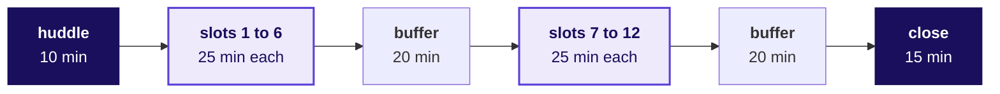

# How do three assessors run 35 mocks in one day and score them all the same way?

**TRAINER ONLY.** For the Programme Head and the Academic TA, who assess in person, and the Principal
Advisor, who assesses online. Nothing on this page reaches a learner.

**Who needs the answer.** The three assessors of Mock R1 need it on Thursday 22 October 2026. Each
hears every member of three groups, about twelve learners, and scores each on 30 marks that count
towards a Build 1 grade closing on Saturday 24 October. Two assessors who read the same answer
differently give two learners different marks for the same work, and the mark a moderator questions
is the one with no evidence written beside it.

**The questions on the way.** What does an assessor's day look like? What happens in the huddle? How
do the 20 minutes of one mock run, word for word? How do you run the technical half so the follow-up
earns its 3 marks? How does the viva climb? What goes in the evidence note, and how does it become the
six criterion marks? What changes online? What do you do when a mock goes wrong? What happens at the
close, and how do the three of you check that you scored alike?

Kalpa Health, the business behind Build 1, is a fictional US diagnostics business: a laboratory and
two patient service centres in each of six US metro areas, billing patients' payers in dollars. Its
analytics and revenue-cycle work runs from Kalpa's Global Capability Centre (GCC) in Bengaluru, the
offshore centre where the learners work as trainee engineers. Its chief operating officer (COO), Dr
Priya Menon, sees test volumes up 5 percent from Q2 to Q3 of 2026 against a plan of 18, and nine
groups of learners each answer one of her five heads' questions from ten synthetic files exported on
16 October 2026. The files hold plants: patterns placed in the data on purpose for a group to find,
each with a witness number, the figure the data generator prints for it. Build 1's approved plan, its
spine, lists them (`docs/detailing/W03_build1_spine.md`).

Mock R1 questions each learner alone while the group finishes the build: a technical half on the
Weeks 1 and 2 method, from `C2_W03_D04_mock_question_bank_TRAINER.md`, and a viva, a spoken defence of
the group's work, from `C2_W03_D04_viva_prompts_TRAINER.md`. The roster,
`C2_W03_D04_roster_TRAINER.xlsx`, says who sits when, with which assessor, which question set and
which viva probe, and the marks go into `../rubrics/C2_W03_D04_mock_scoring_sheet_TRAINER.xlsx`.

The mock is scored on the rubric approved on 29 September 2026, from `data/programme/facts.yaml`:

<!-- sync:rubric:W03/mock -->
**Mock interview R1, 30 marks.** Each learner is scored alone, 15 marks on the technical half and 15 on the project viva.

| Half | Criterion | Marks |
|---|---|---|
| Technical | Correctness | 8 |
| Technical | Reasoning aloud with numbers | 4 |
| Technical | Handling a follow-up | 3 |
| Project viva | The translation, with one decision defended by evidence | 6 |
| Project viva | Defending a caveat under challenge | 6 |
| Project viva | What they would do differently | 3 |
<!-- /sync:rubric:W03/mock -->

No mark is said in the room. Each assessor writes evidence during the mock and enters the six marks
in the changeover that follows it, while the learner's words are fresh.

---

## What does an assessor's day look like?

**Who needs the answer.** Each assessor needs it to plan the day's breaks and hand-offs: the slots run
back to back, and the only slack is a 20-minute buffer at the end of each block.

**The questions on the way.** How many slots, and how long is each? Who hears which groups? When does
each assessor's last mock end?

Every slot is 20 minutes of mock and 5 of changeover. Block 1 runs the huddle and six slots, then a
buffer of 20 minutes. Block 2 runs six slots from its first minute, so its last mock ends at minute
145, and the close starts at minute 165 after a buffer of 20. Twelve slots for three assessors make
36 places for 35 learners.

| Assessor | Mode | Groups | Learners | Last mock ends |
|---|---|---|---|---|
| Programme Head | In person | G1, G4 and G7 | 12 | Block 2, minute 145 |
| Academic TA | In person | G2, G5 and G8 | 12 | Block 2, minute 145 |
| Principal Advisor | Online | G3, G6 and G9 | 11, with slot 12 spare | Block 2, minute 120 |

One assessor hears every member of the same three groups, so work one member carried for another
shows against the others' answers. The roster's Settings sheet recomputes all of this if the slot
length, the changeover or the cohort changes.

---

## What happens in the 10-minute huddle?

**Who needs the answer.** The three assessors need it together before the first mock, with the
Principal Advisor on the call: three people who have not agreed what a middling answer is worth will
mark the same answer two or three marks apart all day.

**The questions on the way.** Which groups are yours, and which sub-problems did they take? How do you
agree what an answer is worth before anyone is scored? What do you agree about the data?

1. **The split, 2 minutes.** Each assessor confirms their groups on the roster's Grid sheet and reads
   from its Groups sheet which sub-problem each group took on Monday. Open those sections of the viva
   prompts, and the bank entries for the question ids the Grid prints for your learners, since a swap
   can replace one of a set's questions for a learner whose group works close to it.
2. **The sub-problems, 2 minutes.** For each of your groups, read the viva section's plant paragraph
   once, so the numbers are in your head and never on your lips, and read the viva file's rule that
   no probe, follow-up or push names what the data holds.
3. **Calibration, 5 minutes.** One assessor reads the model answer and the weak answer of T04-L2
   aloud, the new phlebotomist with 2 rejected samples in 25. Each assessor says in one sentence what
   they would write in the evidence note for an answer halfway between the two, and what that answer
   earns on correctness out of 8. Agree the note's words first, then the mark, to within one mark.
4. **The data, 1 minute.** Agree once more that no assessor names, hints at or confirms anything in
   the data, in either half, and that a learner's guess is met with "What would you check?"

---

## How do the 20 minutes of one mock run, word for word?

**Who needs the answer.** Each assessor needs it so that every learner meets the same mock with the
same timings, whichever room they sit in; a mock that overruns by five minutes pushes every later
learner in that assessor's day.

**The questions on the way.** What happens in each minute? What are the three scripts? When do you
call time?

| Minutes | Part | What the assessor does |
|---|---|---|
| 1 | Opening | Reads the opening script and confirms the seat, the group and the sub-problem |
| 9 | The technical half | Asks three questions from the learner's set, L1, L2 and L3 in that order, each with its follow-up |
| 0.5 | The switch | Reads the switch script |
| 8 | The viva | Runs the opener, the translation probe, the seat probe, the caveat challenge and the looking-back probe |
| 1.5 | Close | Reads the close script and answers one question about the mock |

**The opening script.** "You are seat [S] of group [G], and your group took sub-problem [n]. This mock
runs about 20 minutes in two halves: nine minutes on Weeks 1 and 2, then eight minutes on your group's
Kalpa Health work. The first half's questions are set in Kalpa Health's business, and the numbers in
them are mine, invented for the question; none of them is in your group's files. I will ask a
follow-up to every answer, and that is how it works for everyone. Take a few seconds to think before
you answer if you need them. Is your notebook open and run? Let us start."

**The switch script.** "That is the technical half. Now your group's work. I will ask you to show me
where things come from, so keep your notebook and logs on screen."

**The close script.** "Thank you; that is the mock. The marks come once every mock is done. Do you
have one question about the mock itself? Please keep the questions to yourself when you go back,
since the learners after you are asked different ones. Your group needs you, so head straight back."

**Calling time.** Say "one minute" at the eighth minute of the technical half, and move on at the
ninth, even mid-answer: "Thank you, I need to move us on." Say "last question" before the
looking-back probe. The mock ends at twenty minutes; a learner who is mid-sentence finishes the
sentence.

---

## How do you run the technical half so that every follow-up shows what the learner understood?

**Who needs the answer.** Each assessor does, since 3 of the half's 15 marks rest on the follow-up
alone, and a memorised answer survives only until it.

**The questions on the way.** How do you ask each question? When do you rephrase? What do you do with
an answer about the learner's own files?

Ask the learner's three questions, as the Grid prints them, in the bank's words, reading every number
aloud. After each answer, ask the follow-up whatever the answer was, since a strong answer and a weak
one both need it to be read. Keep each question to about three minutes: a minute of answer, then the
follow-up. If a learner stalls for more than twenty seconds, ask the entry's anchor question instead,
the Week 1 or 2 row's own words, and note that you did. If a learner answers with their own group's
finding, say "Thank you; keep that for the second half" and move on without confirming it. If a
learner gives a model answer word for word, go straight to the follow-up, then ask the reserve at the
same level from the bank's reserve table.

---

## How does the viva climb from what the group did to what would change its call?

**Who needs the answer.** Each assessor does, since 12 of the viva's 15 marks rest on the translation
and the caveat, and both show only when the questions climb.

**The questions on the way.** In which order do the probes run? Which probe does each seat take? What
must you never do?

Run the five probes in the viva prompts' order: the opener, the translation probe for the group's
sub-problem, the seat probe that matches the seat (seat 1 takes P1, and so on), the caveat challenge
pushed as the asker on the caveat the learner gives, and the looking-back probe. The first two ask
what the group did, the seat probe asks why it chose its way and what the alternative would have
given, and the caveat challenge asks what would change its call. Read every probe, follow-up and push
as written: each asks without telling, and none names what the data holds. Ask to see the cell or the log line behind one number at least once. Never
correct a learner's number and never say what the data contains; if an answer is wrong, ask the
follow-up and write down what was said.

---

## What goes in the evidence note, and how does it become the six criterion marks?

**Who needs the answer.** Each assessor needs it in the changeover, and so does the moderator who
later asks why a learner got the mark they got: a mark with no note behind it cannot be defended or
corrected.

**The questions on the way.** What do you write, and when? How do the three ways of reading an answer
fit together? Which rows of the note feed which criterion? What do full marks look like on each
criterion?

Write during the mock, in the learner's words: what was said, the number given, what happened at the
follow-up, and what the learner could show. Write facts, never judgements. The five-minute changeover
is for finishing the note and entering the marks, before the next learner sits down. Keep one note
per learner, on paper or in a copy of this table, until Saturday's closure.

| Field | What goes in it |
|---|---|
| Seat, group, sub-problem, set, viva probe | From the roster's Grid |
| Technical, L1 | The question id; the learner's words; the follow-up: held, partly held or broke, and what they said |
| Technical, L2 | As above, with the number or mechanism they named |
| Technical, L3 | As above, with the position they held, the number they held it with and what they said would change it |
| Viva, the opener | The decision they chose to defend, and the alternative they named |
| Viva, the translation | The mapping they gave, in their words |
| Viva, the seat probe | The probe id; the choice they defended, its number with its unit, the alternative they named; whether they could show the cell |
| Viva, the caveat challenge | The caveat they stated; whether it held under the push, and the number they held it with |
| Viva, looking back | What they would do differently, and whether it came from their own log entry |
| Carried work | Any point where the learner explained a piece as a group-mate's and could not go past the headline, with the probe |
| Reserves used | Any reserve question, and why |
| Anything unusual | A late start, a dropped connection, an AI tool on screen, a learner unwell |

The bank and the viva prompts read answers in two pairs of words, and the note records both the same
way. In the technical half, an answer the learner understood holds at the follow-up and a memorised
one breaks. In the viva, a learner who did the work holds and one who carried a group-mate's work
breaks. The note writes held, partly held or broke for every follow-up.

Three rules hold for every note. Quote, never paraphrase, wherever a number or a mechanism was named.
Record the follow-up in every row, since two criteria rest on it. Enter the six marks on the learner's
row of the scoring sheet in the changeover, and never enter a mark with no line of evidence behind it.

| Criterion | The note's rows it is scored from |
|---|---|
| Correctness, 8 | Technical L1, L2 and L3: the answers against the model answers |
| Reasoning aloud with numbers, 4 | Technical L1, L2 and L3: the numbers the learner used unprompted |
| Handling a follow-up, 3 | The follow-up in the three technical rows |
| The translation, with one decision defended by evidence, 6 | The opener, the translation and the seat probe |
| Defending a caveat under challenge, 6 | The caveat challenge |
| What they would do differently, 3 | Looking back |

The approved rubric gives each criterion and its marks. The descriptions below are this pack's
reading of it, written so that three assessors mark alike; they set no new marks.

| Criterion | Full marks look like | About half looks like | Little or nothing looks like |
|---|---|---|---|
| Correctness, 8 | All three answers reach the model answer's point, with the mechanism behind the number named | Two of the three, or all three with a mechanism missing | The move named and misapplied, or a definition with no case |
| Reasoning aloud with numbers, 4 | Uses the question's numbers unprompted, each with its denominator, and works out at least one | Uses numbers only when asked | No numbers |
| Handling a follow-up, 3 | Moves one step past the first answer on all three follow-ups | On one or two of them | Repeats the first answer, or stops |
| The translation, with one decision defended by evidence, 6 | Maps the asker's words to the Week 1 or 2 move in their own words, defends one decision with a count or dollars and its alternative, and shows the cell | Defends a decision in general words, or cannot show where a number comes from | Recites Week 1's retail method with laboratory words swapped in |
| Defending a caveat under challenge, 6 | Holds the caveat with a number, says what would change it and what to check next, without dropping it or overclaiming | Holds it without a number, or gives part of it up | Drops it, or overclaims |
| What they would do differently, 3 | Names a step from their own log entry, with the time or error it would have saved | A real change, put in general words | A general lesson |

The scoring sheet is one copy for all three assessors, kept where the Programme Head keeps the
programme's score sheets and never in the repository, since learners' marks never go into a public
file. Each assessor enters only the rows of their own three groups, and the Principal Advisor enters
from the call.

---

## What changes when the mock is online?

**Who needs the answer.** The Principal Advisor needs it, and so does the trainer who sends each
learner to the quiet room: an online mock that starts late or loses its connection costs a slot the
day cannot give back.

**The questions on the way.** Where does the learner sit, and on which laptop? How does a learner show
the work over a call? What happens to the timing, a dropped connection and integrity?

The trainer sets up the quiet room and the call link before the first slot. Every learner is called
five minutes before their slot, and an online learner takes their own laptop to the quiet room and
joins the call from it, camera on, with the group's files open, by two minutes before the slot.

| What differs | How it runs |
|---|---|
| Showing the work | The learner shares the screen for the viva, and the Principal Advisor asks for the cell or the log line by name, since pointing does not carry over a call |
| Timing | The same 20 minutes; the first minute of the changeover goes to the trainer confirming the next learner has joined, and the Principal Advisor scores in the other four |
| A dropped connection | Wait two minutes and reconnect. If the mock lost less than five minutes, finish it in the time left. If it lost more, stop, note the point reached, and restart the whole mock in the spare slot, slot 12, or the next buffer if slot 12 is taken: the technical half on the reserves the question bank names for the learner's sub-problem, since the learner has heard the first questions, and the viva with the headline probe in place of the seat probe. Score the restart only, and note the reason |
| Integrity | Ask the learner to turn the camera round the room once at the start; no second screen and no phone in reach |
| The notes and the marks | The same template; the marks go into the Principal Advisor's rows of the shared scoring sheet, and the notes reach the Programme Head in the buffer after each block, so all of them are held in one place |

---

## What do you do when a mock goes wrong?

**Who needs the answer.** Each assessor needs it in the moment, with the next learner already
waiting; a wrong move here costs either the learner's fair mark or the next learner's time.

**The questions on the way.** What do you do in each case below, and what do you note?

| What happens | What the assessor does |
|---|---|
| The learner says they heard a question from someone mocked earlier | Thank them, switch that question to the reserve at the same level that the question bank's reserve table names for the learner's sub-problem, and note it |
| A word-perfect model answer | Go straight to the follow-up, then ask the reserve at the same level from the bank's reserve table |
| The learner freezes | Wait twenty seconds, ask the anchor question in the row's own words, then move on, and note it without judging |
| "My group-mate did that part" | "Walk me through it as far as you can", then the follow-up; note what they could and could not explain |
| The learner asks whether something is hidden in the data | "What would you check?", and nothing more |
| The learner answers a technical question with their group's finding | "Thank you; keep that for the second half", without confirming it |
| An AI assistant is open on the screen | Ask the learner to close it, note the time, and continue |
| The notebook does not run | Continue from the saved outputs and note it, since Friday's cold demo depends on it; tell the trainer at the changeover so the group gets help |
| Running more than five minutes behind | Use the block's buffer; if the buffer is gone, shorten the next mocks' L1 questions to two minutes and keep the viva whole |
| The learner is upset by the mock | Close kindly, say the marks come later, and tell the trainer so someone checks on them |

---

## What happens at the close, and how do the three of you check that you scored alike?

**Who needs the answer.** The Programme Head needs it to record the day, and the trainer needs it to
carry two things into Friday: the probes that broke most and the groups whose notebooks did not run.

**The questions on the way.** How do the 15 minutes split? What does each assessor say? What does the
calibration check read, and when does a mark move?

The close runs 15 minutes at the end of block 2. In the first 10, the assessors and the trainer meet
away from the room while the groups keep building; in the last 5, the trainer speaks to the room
about Friday, never about one learner's mock.

The first 6 minutes are the assessors' impressions, two minutes each, from their notes, in the same
order:

1. Across your groups, which part of the Week 1 and 2 method carried into Kalpa Health cleanly, and
   which did learners recite without adapting? Name the probe.
2. Did any group show a clear gap between the member who built a piece and the ones who explained it?
   Name the group and the probe, never the learner.
3. Which technical question broke most often at the follow-up?

The Programme Head writes one line per point into the day's record. The trainer takes two things into
Friday: the probes that broke most often, which become the first questions before the build freezes,
and every group whose notebook did not run cold at the afternoon's check.

The last 4 minutes are the calibration check. Open the scoring sheet's Assessors sheet, which shows
each assessor's average on each half. A gap of more than two marks between assessors on one half is
worth one sentence each on what drove it, before any mark moves. A mark changes only against its
evidence note, and never on an impression or a comparison of learners by name.
