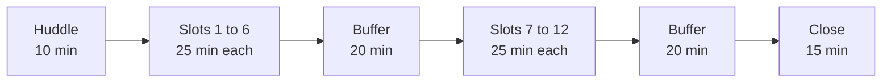

# Mock R1: the assessors' guide

**TRAINER ONLY.** For the Programme Head, the Academic TA and the Principal Advisor. Read it with
`C2_W03_D04_mock_question_bank_TRAINER.md` (the technical half), `C2_W03_D04_viva_prompts_TRAINER.md`
(the viva), `C2_W03_D04_roster_TRAINER.xlsx` (who, when, which set, which sub-problem) and
`../rubrics/C2_W03_D04_mock_scoring_sheet_TRAINER.xlsx` (the scores).

The mock carries 30 marks and is scored alone for each learner against the rubric the requester
approved on 29 September 2026, rendered here from `data/programme/facts.yaml`:

<!-- sync:rubric:W03/mock -->
**Mock interview R1, 30 marks.** Each learner is scored alone, 15 marks on the technical half and 15 on the project viva.

| Half | Criterion | Marks |
|---|---|---|
| Technical | Correctness | 8 |
| Technical | Reasoning aloud with numbers | 4 |
| Technical | Handling a follow-up | 3 |
| Project viva | The translation, with one decision defended by evidence | 6 |
| Project viva | Defending a caveat under challenge | 6 |
| Project viva | What they would do differently | 3 |
<!-- /sync:rubric:W03/mock -->

Each assessor writes evidence during the mock and scores in the changeover that follows it, into
`rubrics/C2_W03_D04_mock_scoring_sheet_TRAINER.xlsx`, while the learner's words are fresh. No score
is said in the room. Grades close in-week, at Saturday's closure, and the evidence note is what a
score is checked against if a learner or a moderator asks.

## The day in one picture

Block 1 runs the huddle and six slots, then a buffer of 20 minutes. Block 2 runs six slots from its
first minute; the last mock ends at minute 145, and the Programme Head and the Academic TA then have a
buffer of 20 minutes before the close starts at minute 165. The Principal Advisor's last learner sits
in slot 11 and slot 12 is the spare. Every slot is 20 minutes of mock and 5 minutes of changeover.
The roster's Settings sheet recomputes all of this if a slot length changes.

## The huddle, 10 minutes, before the first mock

The three assessors, with the Principal Advisor on the call.

1. **The split (2 minutes).** Each assessor confirms their groups on the roster: the Programme Head
   G1, G4 and G7, the Academic TA G2, G5 and G8, the Principal Advisor G3, G6 and G9. Each hears every
   member of their three groups, which is how carried work shows.
2. **The sub-problems (2 minutes).** Read the Groups sheet: which sub-problem each of your groups took
   on Monday. Open those sections of the viva file.
3. **Calibration (5 minutes).** One assessor reads the model answer and the weak answer of one
   question aloud, T04-L2 is a good one, and each assessor says in one sentence what they would write
   in the evidence note for an answer halfway between them, and what that answer earns on
   correctness out of 8. Agree the note's words first, then the mark, to within one mark.
4. **The plants (1 minute).** Agree once more that no plant is named, hinted at or confirmed to a
   learner, in either half.

## The 20 minutes

| Minutes | Part | What the assessor does |
|---|---|---|
| 1 | Opening | Reads the opening script, confirms the seat, group and sub-problem |
| 9 | The technical half | Three questions from the learner's set, one per level, each with its follow-up |
| 0.5 | The switch | Reads the switch script |
| 8 | The viva | The opener, the translation probe, the seat's plant probe, the caveat challenge, the looking-back probe |
| 1.5 | Close | Reads the close script; answers one question about the mock |

**The opening script.** "You are seat [S] of group [G], and your group took sub-problem [n], [name].
This mock runs about 20 minutes in two halves: nine minutes on Weeks 1 and 2, then eight minutes on
your group's Kalpa Health work. I will ask follow-up questions, and that is how it works for everyone.
Take a few seconds to think before you answer if you need them. Is your notebook open and run? Let us
start."

**The technical half.** Ask the set's L1, L2 and L3 questions in that order, in the question bank's
words. After each answer, ask the follow-up whatever the answer was, since a strong answer and a weak
one both need it to be read. Keep each question to about three minutes: a minute of answer, then the
follow-up. If the learner stalls for more than twenty seconds, rephrase once in the definitional form
and note that you did.

**The switch script.** "That is the technical half. Now your group's work. I will ask you to show
me where things come from, so keep your notebook and logs on screen."

**The viva.** Run the five probes in order from the viva file: the opener, the translation probe for
the sub-problem, the plant probe that matches the seat (seat 1 takes P1, and so on), the caveat
challenge and the looking-back probe. Ask to see the cell or the log line behind a number at least once. Never correct a learner's
number and never say what the data contains; if they are wrong, ask the follow-up and write down what
they said.

**The time calls.** Say "one minute" at the eighth minute of the technical half, and move on at the
ninth even mid-answer: "Thank you, I need to move us on." Say "last question" at the start of the
looking-back probe. The mock ends at twenty minutes; a learner who is mid-sentence finishes the sentence.

**The close script.** "Thank you. That is the mock. The score comes after all the mocks are done, not
now. Do you have one question about the mock itself? Please keep the questions to yourself when you go
back; the learners after you are asked other ones. Your group needs you, so head straight back."

## Noting evidence as it happens

Write during the mock, in the words the learner used. Write facts, not judgements: what was said, the
number cited, what happened at the follow-up, what the learner could show. The five-minute changeover
is for finishing the note, before the next learner sits down. One note per learner, on the template
below, on paper or in a copy of this table; the assessor keeps the notes until the scoring sitting.

| Field | What goes in it |
|---|---|
| Seat, group, sub-problem, set | From the roster |
| Technical, L1 | Question ID; the learner's key words; the follow-up: held, partly held or broke, and what they said |
| Technical, L2 | As above; the number or mechanism they named, if any |
| Technical, L3 | As above; the position they held and the number they held it with |
| Viva, the opener | The decision they chose to defend; what they said the alternative was |
| Viva, the translation | The mapping they gave, in their words |
| Viva, the plant probe | Probe ID; the number they gave with its unit; whether they could show the cell |
| Viva, the caveat challenge | The caveat they stated; whether it held under the push, and the number they held it with |
| Viva, looking back | What they would do differently; whether it came from their own log entry |
| Carried work | Any point where the learner explained a piece as a group-mate's and could not go past the headline, with the probe |
| Reserves used | Any reserve question, and why |
| Anything unusual | A late start, a connection drop, an AI tool on screen, a learner unwell |

Three rules for the note. Quote, do not paraphrase, wherever a number or a mechanism was named.
Record the follow-up in every row, since handling a follow-up and defending a caveat rest on it. Score
from the note in the changeover, and enter the six marks on the learner's row of the scoring sheet;
a mark with no line of evidence behind it is the one a moderator will question.

| Rubric criterion | The note's rows it is scored from |
|---|---|
| Correctness (8) | Technical L1, L2 and L3: the answers against the model answers |
| Reasoning aloud with numbers (4) | Technical L1, L2 and L3: the numbers the learner used unprompted |
| Handling a follow-up (3) | The follow-up column of the three technical rows |
| The translation, with one decision defended by evidence (6) | The opener, the translation and the plant probe |
| Defending a caveat under challenge (6) | The caveat challenge |
| What they would do differently (3) | Looking back |

## The online mock, with the Principal Advisor

The learner sits at the online-mock laptop in the quiet room the trainer set up, camera on, with the
group's files open. The trainer sends the learner two minutes before the slot starts.

| What differs | How it runs |
|---|---|
| Showing the work | The learner shares the screen for the viva. The Principal Advisor asks for the cell or the log line by name, since pointing does not carry over a call. |
| Timing | The Principal Advisor keeps the same 20 minutes. The first minute of the changeover goes to the trainer confirming the next learner is at the laptop; the Principal Advisor scores in the remaining four. |
| A connection drop | Wait two minutes and reconnect. If the mock lost less than five minutes, finish it in the remaining time. If it lost more, stop, note the point reached, and move the learner to the spare slot, slot 12; note the reason. |
| Integrity | Ask the learner to show the room with the camera once at the start. No second screen and no phone in reach. |
| The note and the scores | Written in the same template; the scores go into the Principal Advisor's rows of the shared scoring sheet, and the notes reach the Programme Head in the buffer after each block so they are held in one place. |

## When the mock goes wrong

| What happens | What the assessor does |
|---|---|
| The learner says they heard a question from someone mocked earlier | Thank them, switch that question to a reserve at the same level, and note it |
| A word-perfect answer | Go straight to the follow-up, then ask one reserve at the same level |
| The learner freezes | Wait twenty seconds, rephrase in plain words, then move on; note it without judging |
| "My group-mate did that part" | "Walk me through it as far as you can", then the follow-up; note what they could and could not explain |
| The learner asks whether something is hidden in the data | "What would you check?" and nothing more |
| An AI assistant is open on the screen | Ask the learner to close it, note the time, continue |
| The notebook does not run | Continue from the saved outputs; note it, since Friday's cold demo depends on it; tell the trainer at the changeover so the group gets help |
| Running more than five minutes behind | Use the block's buffer; if the buffer is gone, shorten the next mocks' L1 questions to two minutes and keep the viva whole |
| The learner is upset by the mock | Close kindly, remind them the score comes later, and tell the trainer so someone checks on them |

## The close, 15 minutes, at the end of block 2

The trainer runs it. The first 10 minutes are for the assessors only, away from the room; the last 5
are the trainer's with the room, and they are about Friday, never about individual mocks.

**The assessors' impressions (10 minutes).** Each assessor speaks for three minutes, from their notes,
in the same order:

1. **The translation.** Across your groups, which part of the Week 1 and 2 method carried into Kalpa
   Health cleanly, and which did learners recite without adapting? Name the probe.
2. **The carried work.** Did any group show a clear gap between the member who built a piece and the
   ones who explained it? Name the group and the probe, not the learner, in this room.
3. **The technical half.** Which question broke most often at the follow-up?

The Programme Head writes one line per point into the day's record, and the trainer takes two things
into Friday: the probes that broke most often, which become build-completion checks before the freeze,
and any group whose notebook did not run.

**The calibration check (inside the 10 minutes).** Open the scoring sheet's Assessors sheet: each
assessor's average on each half. A gap of more than about two marks between assessors on one half is
worth one sentence each on what drove it, before any score moves. A score changes only against its
evidence note.

**What the close never does.** It never compares learners by name in front of the room, and it never
changes a score on an impression.
