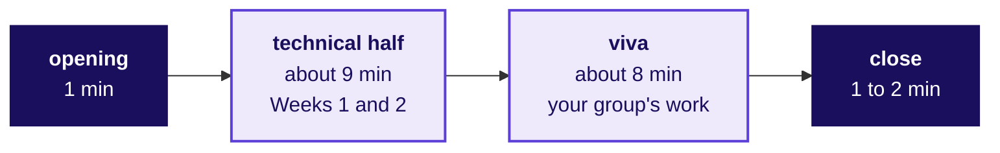

# How will Mock R1 question you on Thursday 22 October, and how do you get ready without leaving the build?

Kalpa Health, Kalpa Group and everyone in them are fictional, and every record in the Build 1 files
is synthetic.

**Who needs the answer.** You, before your slot. Mock R1 is a mock interview: one assessor questions
you alone for about 20 minutes while your group keeps building, the way a first-round screen runs at
a Global Capability Centre (GCC), the offshore centre where a global company does its own work. A
learner who knows how the 20 minutes run spends them answering, and one who does not loses the first
five minutes working out what is being asked.

**The questions on the way.** What is Mock R1, and where does it sit in Dr Menon's week? How are the
20 minutes spent? What does the technical half ask, and what will it never ask? What does the viva
ask about your group's work? How is the mock scored? Who questions you, and what changes online? What
should you have open, and what must be closed? How do you prepare in about 30 minutes? What happens
after your mock, and what does your group still owe today?

---

## What is Mock R1, and where does it sit in Dr Menon's week?

**Who needs the answer.** Every learner, before the day starts. The mock tests you on the question
your group has been answering since Monday, so it helps to hold the whole week in view.

**The questions on the way.** What has Dr Menon asked? Which question is your group's? What is the
mock worth, and when does it run?

Kalpa Health is a US diagnostics business: a laboratory, which runs the tests, and two patient
service centres, where a phlebotomist draws patients' blood, in each of six US metro areas. It bills
each patient's payer in dollars: a commercial health plan, Medicare (the federal programme for people
aged 65 and over), Medicaid (each state's programme for people on low incomes) or the patient, who
pays for themselves (self-pay). Its revenue-cycle and analytics work runs from Kalpa's GCC in
Bengaluru, where you are a trainee engineer in the data and AI team. It reports in calendar
quarters: Q2 is April to June 2026 and Q3 is July to September 2026.

Its COO, Dr Priya Menon, wrote to your team: her dashboard shows test volumes up 5 percent from Q2 to
Q3, against a plan of 18, and she wants to know which branch of her business is short. Five of her
heads each asked her one question, and your group is answering one of them:

| # | Who asks | What they asked, word for word |
|---|---|---|
| 1 | The finance head | "The board will ask me where the plan's growth went. Where does our lab revenue actually come from, and which branch of it is short?" |
| 2 | The patient service centres' operations head | "Bookings fell in two of our metros in Q3. Before I send a field team or cut staff there, I need to know how far they fell, and why." |
| 3 | The finance head | "The claims we billed say one thing and the posting system says another. Which claims are unpaid, how much money is that, and can I trust the figure I report?" |
| 4 | The patient service centres' operations head | "KH-ATL-03, one of our two Atlanta patient service centres, has the worst no-show rate on my Q3 report. I am being asked to add a receptionist there or close it. Is the centre really worse?" |
| 5 | The marketing head | "Our free at-home collection offer lifted bookings 9 percent. I want to offer it to every patient in all six metros. Can you confirm it worked?" |

Build 1 carries three scores for each learner: the mini project, worth 40 marks with the
presentation; the group discussion, worth 30; and Mock R1, worth 30. Mock R1 runs for every learner on
Thursday 22 October, one learner at a time, while the group finishes the build around it. Your slot,
and the assessor you sit with, are on the seat list the trainer hands out at the start of the day,
and your group-mates' slots are spread through the day, so your group is never more than one person
short.

Mock R1 is worth 30 of your Build 1 marks: one 20-minute conversation, alone, on the method you
learned in Weeks 1 and 2 and on what your group did with it in Kalpa Health, sitting between
Wednesday's headline claim and Friday's build freeze.

---

## How are the 20 minutes spent?

**Who needs the answer.** You, so you know when one half ends and the other begins.

**The questions on the way.** How long is each part? What happens between the two halves?

1. The assessor opens with your seat, your group and your group's question, and says how the two
   halves run.
2. The technical half runs for about nine minutes. The assessor says when it ends and moves straight
   on to your group's work, so keep your notebook and logs on screen.
3. The viva runs for about eight minutes, on your group's files, notebook and logs.
4. The assessor closes. You may ask one question about the mock itself; the assessor does not give
   a score in the room.
5. You go straight back to your group.

The 20 minutes are about nine on Weeks 1 and 2, about eight on your group's work, and three of
opening and close.

---

## What does the technical half ask, and what will it never ask?

**Who needs the answer.** You, before you plan what to revise. The technical half carries half the
mock's marks, and it tests the method of the fortnight, so revising the files your group already
knows does not prepare you for it.

**The questions on the way.** How many questions, and at which levels? Which moves can it ask about?
Where are the questions set? What will it never ask?

Three questions, one at each level, each asked the way a stakeholder would ask it with numbers on the
table:

| Level | What it asks | What a good answer does |
|---|---|---|
| The move | A business ask that one of the fortnight's moves answers | Names the move, applies it, and says the first check |
| The number | A plausible wrong number, and where it came from | Names what produced the number, the check that catches it, and the fix |
| The judgement | A stakeholder pushing back, or a choice between ways to answer | Weighs the ways, holds a position with a number, and says what would change it |

Every question has a follow-up that takes the case one step further, so a rehearsed answer carries
you only as far as the first question.

The questions come from the moves the ten taught days of Weeks 1 and 2 trained:

| Day | The move |
|---|---|
| Week 1 Monday | Which total is the number, the revenue tree, and the typical value one large record cannot move |
| Week 1 Tuesday | Is a drop real, which branch and which segment moved, and did the price change or the mix |
| Week 1 Wednesday | Profile before you touch, what makes two records one, and the bridge between two totals |
| Week 1 Thursday | Real or the wobble, how many stand behind a rate, and did a change work |
| Week 1 Friday | The note in four parts, held when someone pushes |
| Week 2 Monday | The warehouse query: its logical order, and a number an auditor can rerun |
| Week 2 Tuesday | Which rows a join keeps, drops or repeats, and the checks before a number leaves |
| Week 2 Wednesday | Ranking inside groups, ties at the line, and change month to month |
| Week 2 Thursday | One row per member in pandas, the merge that must not repeat a row, and the as-of date |
| Week 2 Friday | Which tool owns which number, and what a director can break in a workbook |

The questions are set in Kalpa Health's US business, in parts of it your group's files do not cover,
on numbers the assessor invents for the question and reads aloud. You need nothing open to answer
them. No question asks you to write code from memory. A question may ask what a query, a join, a
groupby or a lookup returns and why, and you answer in words. No question asks about your group's
files, or any other group's; that is the viva's job.

---

## What does the viva ask about your group's work?

**Who needs the answer.** You and your group, because the viva is where the work you did together is
tested on you alone.

**The questions on the way.** In what order do the questions climb? What is the first question? What
will you be asked to show? What if a group-mate built the part you are asked about?

A viva is a spoken defence of your own work. This one climbs in three steps, the way an interviewer
moves from your work to your judgement:

1. **What did your group do?** How you carried the Week 1 or 2 move into Kalpa Health, and what you
   had to change to make it fit. The first question is the day's interview question, `[S]`: "Walk me
   through the analysis you did on unfamiliar data and one decision you would defend."
2. **Why that way, rather than another?** A question on one decision your group made, the numbers
   behind it and the alternative you did not take.
3. **What would change your call?** Your group's headline claim, the one sentence with its number,
   what the number is out of, its quarter and its caveat that your group stated at Wednesday's close.
   The caveat is the one thing that could make the claim wrong. The assessor pushes on it the way Dr
   Menon or one of her heads would, and you hold it, give it up or change it, with a number either
   way.

Last comes the question your challenges log answers: what you would do differently if you started
again tomorrow. The challenges log is where your group records each time it was stuck, what it tried
and what it decided; the decisions log holds every cleaning or matching call, with the rows it moved
and its reason.

The assessor will ask you at least once to show where a number comes from: the cell in your notebook,
the query, or the line in your decisions log. You answer for the whole group's work, including the
parts a group-mate built. You do not need to have written every cell; you do need to explain every
number your group will put in front of Dr Menon, and to say where it came from.

---

## How is the mock scored?

**Who needs the answer.** You, so you know what earns marks on the day. The requester approved this
rubric on 29 September 2026 and ruled that learners may see it.

**The questions on the way.** Which six rows score the mock? What does each row reward?

You are scored alone, 15 marks on each half:

<!-- sync:rubric:W03/mock -->
**Mock interview R1, 30 marks.** Each learner is scored alone, 15 marks on the technical half and 15 on the project viva.

| Half | Criterion | Marks |
|---|---|---|
| Technical | Correctness | 8 |
| Technical | Reasoning aloud with numbers | 4 |
| Technical | Handling a follow-up | 3 |
| Project viva | The translation, with one decision defended by evidence | 6 |
| Project viva | Defending a caveat under challenge | 6 |
| Project viva | What they would do differently | 3 |
<!-- /sync:rubric:W03/mock -->

| Row | What it rewards |
|---|---|
| Correctness | The right move for each question, with what produced the number named |
| Reasoning aloud with numbers | Using the numbers you are given, each with what it is out of, and working one out aloud |
| Handling a follow-up | Taking each answer one step further when the case moves |
| The translation, with one decision defended by evidence | Saying in your own words how the Week 1 or 2 move fits your group's question, and defending one decision with a count or dollars |
| Defending a caveat under challenge | Holding your group's caveat with a number when it is pushed, and saying what would change it |
| What they would do differently | A real step you would move or change, taken from your own log |

Three of the six rows, 12 of the 30 marks, reward what happens after your first answer: the
follow-up, the caveat under a push, and looking back.

---

## Who questions you, and what changes if your mock is online?

**Who needs the answer.** You, once you have your slot from the seat list.

**The questions on the way.** Who are the assessors? Where does an online mock happen? What do you do
on the call?

One of three assessors questions you: the Programme Head or the Academic TA, in person, or the
Principal Advisor, online. All three use the same questions, the same timings and the same rubric.
For an online mock you sit at the laptop in the quiet room the trainer points you to, with your camera
on and your group's files open, ready to share your screen when the viva starts. The assessor will ask
you to show the room once with the camera at the start.

---

## What should you have open, and what must be closed?

**Who needs the answer.** You, before you walk to your slot. Searching for a file costs viva minutes,
and an assistant left open costs more.

**The questions on the way.** Which files do you open? Which must be closed?

Have these open, ready to show:

- your group's notebook or SQL, run top to bottom so every output is showing;
- your group's copy of the challenges log, `content/W03/D1/briefs/C2_W03_D01_challenges_log_STUDENT.xlsx`;
- your group's copy of the decisions log, `content/W03/D1/briefs/C2_W03_D01_decisions_log_STUDENT.xlsx`;
- your group's translation worksheet from Monday, and the headline claim it stated on Wednesday.

No AI assistant is open during the mock, on any screen or device, and your phone stays out of reach.

---

## How do you prepare in about 30 minutes without leaving the build?

**Who needs the answer.** You and your group, since the build comes first today and the group needs
you at the keyboard.

**The questions on the way.** When do you prepare, and on what? How does a group prepare together?

Preparation takes about 30 minutes in all, in three short pieces:

| When | Minutes | What to do |
|---|---|---|
| Before the day starts | 10 | Reread your group's challenges log and decisions log end to end. For every entry, say aloud what happened and why. Mark any entry you cannot explain, and ask its author before your slot. |
| During the build | 10 | Pick one number your group will give Dr Menon. Find the cell that produces it, say what it is out of and over which quarter, and say what would make it wrong. Swap with a group-mate and quiz each other on one number each. |
| Two slots before yours | 10 | Say your answer to "walk me through the analysis you did on unfamiliar data and one decision you would defend" in under two minutes. Then say your group's headline claim with its caveat, and let a group-mate push on the caveat as hard as they can. Then say one move from each day in the table above, in a stakeholder's words. |

A thin log is the easiest place for a viva to find a gap, so a group that writes its challenges and
decisions down as they happen is preparing its mocks as it builds.

---

## What happens after your mock, and what does your group still owe today?

**Who needs the answer.** You, on your way back to the group, and the group, which needs its build
finished before Friday.

**The questions on the way.** What do you say about the questions? What do you add to the log? What
must the build reach by the end of the day? When do the scores come?

Say nothing to anyone about the questions you were asked. The follow-ups move, so a question passed
on gives the next learner little, and it makes the mock less useful as practice for the screens it
prepares you for.

Back at your group, add one line to the challenges log if the viva found a gap in the work, and close
the gap before the build freezes.

By the end of today your group's build should be complete enough to freeze on Friday:

- the notebook or SQL runs top to bottom from the raw files, on a machine that is not its author's;
- the decisions log and the challenges log are current;
- the one-slide answer for Dr Menon is drafted: the claim, the evidence, the caveat and the action.

The trainer visits each group three times during the day, for a few minutes each: once to ask who
is out when and what would stop your notebook running cold; once to pick one number from your
one-slide answer and ask what it is out of, which cell makes it and what would make it wrong; and
once to watch your notebook run from a fresh start on a machine that is not its author's, then ask
which sentence of your answer is the caveat. Tonight's task is the presentation draft and one
rehearsal of the demo, start to finish, on the raw files. On Friday the build freezes, and each group
runs its demo cold twice. Every Build 1 grade, the mock's among them, closes on Saturday 24 October,
the last day of the presentations.
