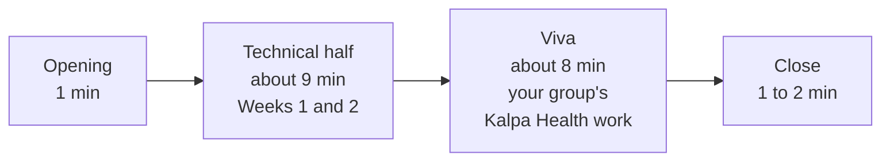

# Mock R1: what it is and how to prepare

Your first mock interview runs during Build 1, one learner at a time, while your group keeps
building. It lasts about 20 minutes. Your slot, and the assessor you sit with, come from the roster
the Programme Head shares at the start of the day. Your group-mates' slots are spread through the
day, so the group is never more than one person short.

The mock is one of the three Build 1 scores, alongside the mini project and the group discussion.
It carries 30 marks. The mini project carries 40, including the presentation, and the group
discussion 30.

## Who interviews you

One of three assessors: the Programme Head or the Academic TA, in person, or the Principal Advisor,
online. For an online mock you sit at the laptop in the quiet room the trainer points you to, camera
on, with your group's files open and ready to share your screen.

## The two halves

**The technical half, about nine minutes.** Three questions on the method of Weeks 1 and 2, each asked
the way a client would ask it: Meera Raghavan, Anand Iyer or the marketing lead, with a number on the
table. Expect a question about what a number is made of, a question where a number looks wrong and you
say what produced it, and a question where a stakeholder pushes back and you hold a position. Each
question has a follow-up that takes the case one step further, so a rehearsed answer carries you only
as far as the first question. No question asks you to write code from memory.

**The viva, about eight minutes.** Questions on your own group's Kalpa Health sub-problem. The viva asks
how you carried the fortnight's method into a business you had never seen: why the tree, the ladder,
the reconciliation or the comparison you chose fits Kalpa Health, and what you had to change to make
it fit. It asks about a decision your group made and whether you would defend it.
It asks you to show where a number comes from, in your notebook or SQL, and to talk through your
group's challenges log and decisions log.

You answer for the whole group's work, including parts a group-mate built. You do not need to have
written every cell. You do need to explain every number your group will put in front of Dr Menon, and
to say where it came from.

## What to have open

- Your group's notebook or SQL, run top to bottom so every output is showing.
- `content/W03/D1/briefs/C2_W03_D01_challenges_log_STUDENT.xlsx`, in your group's copy.
- `content/W03/D1/briefs/C2_W03_D01_decisions_log_STUDENT.xlsx`, in your group's copy.
- Your group's translation worksheet from Monday,
  `content/W03/D1/briefs/C2_W03_D01_translation_worksheet_STUDENT.md`.

No AI assistant is open during the mock, on any screen or device.

## How to prepare, in the time the build leaves

The build comes first; your group needs you at the keyboard. Preparation takes about 30 minutes in
total, in short pieces.

| When | Minutes | What to do |
|---|---|---|
| Before the day starts | 10 | Reread your group's challenges log and decisions log end to end. For every entry, say aloud what happened and why. Mark any entry you could not explain, and ask its author before your slot. |
| During the build | 10 | Pick one number your group will give Dr Menon. Find the cell that produces it, say its denominator and its window, and say what would make it wrong. Swap with a group-mate and quiz each other on one number each. |
| Two slots before yours | 10 | Say your answer to "walk me through the analysis you did on unfamiliar data and one decision you would defend" in under two minutes. Then say one move from each week of the fortnight in a stakeholder's words: the revenue tree, the investigation ladder, profile and reconcile, real or noise, booked against collected, and choosing the tool. |

A thin log is the easiest place for a viva to find a gap, so a group that writes its challenges and
decisions down as they happen is also preparing its mocks.

## How the 20 minutes run

1. The assessor opens with your seat, your group and your sub-problem, and says the two halves.
2. The technical half runs for about nine minutes. The assessor says when it ends.
3. The viva runs for about eight minutes, on your group's files.
4. The assessor closes. You can ask one question about the mock itself; the assessor does not give
   the score in the room.
5. You go straight back to your group.

## After your mock

Say nothing to anyone about the questions you were asked. Other learners are mocked after you, and a
question passed on changes nothing for them, because the follow-ups move. It does make the mock less
useful as practice for the interviews it is preparing you for.

Back at your group, add one line to your challenges log if the viva exposed a gap in the work, and fix
it before the build freezes.
