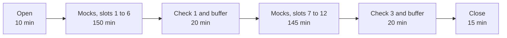

# Day sheet: Week 3, Build 1, Thursday. Mock R1, and the build completed around it

**TRAINER ONLY.** Nothing on this page reaches a learner.

Posts to <!-- sync:module:W03/D4 -->Module 1: Foundations of AI and Data<!-- /sync:module:W03/D4 -->, on <!-- sync:day-date:W03/D4 -->Thu 22 Oct 2026<!-- /sync:day-date:W03/D4 -->.

| | |
|---|---|
| **The client's ask** | Dr Priya Menon, COO of Kalpa Health, still has one question: test volumes grew 5 percent against a plan of 18, so which branch of her business is short? Each group owes her one sub-problem's answer on Saturday. Today every learner is questioned on it alone. |
| **What runs** | Mock R1 for every learner, about 20 minutes each, individual and asynchronous: a technical half on Weeks 1 and 2 and a viva on the group's Kalpa Health work. Groups complete the build around the roster. |
| **Who does what** | The Programme Head and the Academic TA run mocks in person; the Principal Advisor runs a share online. The trainer runs the build floor, the queue for the mocks and the build-completion checks, and chairs the close. |
| **Nothing new is taught** | A build week transfers the Week 1 and 2 method into a domain the room has never seen. No practice set, no Kahoot, no test. |
| **Comes before** | Monday's translation worksheet and challenges log; Wednesday's checkpoint, the parallel build and each group's headline claim with its denominators and caveat. Today tests that claim. |
| **Comes after** | Friday: the build freezes, two cold demo runs, GDs with the industry expert, the first presentations. Saturday: the remaining presentations and grade closure. |

The files this day uses: the roster, `mocks/C2_W03_D04_roster_TRAINER.xlsx`; the question bank,
`mocks/C2_W03_D04_mock_question_bank_TRAINER.md`; the viva prompts,
`mocks/C2_W03_D04_viva_prompts_TRAINER.md`; the assessors' guide,
`mocks/C2_W03_D04_assessors_guide_TRAINER.md`; and the learner's brief,
`mocks/C2_W03_D04_mock_brief_STUDENT.md`, which goes out at the start of the day; and the scoring
sheet, `rubrics/C2_W03_D04_mock_scoring_sheet_TRAINER.xlsx`, one shared copy that all three assessors
score into during their changeovers.

The mock is scored on the rubric approved on 29 September 2026:

<!-- sync:rubric:W03/mock -->
**Mock interview R1, 30 marks.** Each learner is scored alone, 15 marks on the technical half and 15 on the project viva.

| Half | Criterion | Marks |
|---|---|---|
| Technical | Correctness | 8 |
| Technical | Reasoning aloud with numbers | 4 |
| Technical | Handling a follow-up | 3 |
| Project viva | The translation, with one decision defended by evidence | 6 |
| Project viva | Defending a caveat under challenge | 6 |
| Project viva | What they would do differently | 3 |
<!-- /sync:rubric:W03/mock -->

---

## The run

### Block 1, 180 minutes

| Minutes | What runs | The trainer | The assessors |
|---|---|---|---|
| 10 | The open | Reads the opening words to the room, hands out the learner's brief and the roster's seat list (seat labels, slots and assessors), sets up the online-mock laptop in the quiet room | The huddle, from the assessors' guide |
| 150 | Slots 1 to 6, 25 minutes each | Calls each learner five minutes before the slot; runs check 2 across the nine groups from the second slot on | Mocks |
| 20 | Check 1 and the buffer | Runs check 1, the running-order check, with every group | Catch up any overrun; the Principal Advisor sends block 1's notes to the Programme Head |

### Block 2, 180 minutes

| Minutes | What runs | The trainer | The assessors |
|---|---|---|---|
| 145 | Slots 7 to 12 | Calls each learner; runs check 2's second pass on groups that were behind | Mocks; the Principal Advisor's slot 12 is the spare |
| 20 | Check 3 and the buffer | Runs check 3, the handover to Friday, with every group | Finish notes; take a late learner in a free slot |
| 15 | The close | Chairs it | Their impressions, from the assessors' guide |

### After the second block

Open build time with the TAs. The row's after-class task: the presentation drafted and the demo path
rehearsed once. A group whose notebook failed check 3 spends this time on that and nothing else.

**The opening words, to the room, under two minutes.** "Today every one of you meets a mock
interview, about 20 minutes, while your group keeps building. The brief in your hands says what it
covers. Your slot and your assessor are on the seat list; I will call you five minutes before your
slot, so keep working until I do. Nobody in a group is out at the same time as a group-mate, so every
group always has at least two people at the keyboard. When you come back, say nothing about the
questions. And by the end of today, your notebook runs cold from Dr Menon's raw files, your logs are
current, and your one-slide answer is drafted, because tomorrow the build freezes."

---

## What every group ships, and what "materially complete" means tonight

Every group ships five things on Saturday, described in the same words across the week's packs:

| Deliverable | Materially complete by the end of today |
|---|---|
| A presentation slot of 25 to 30 minutes, with a live demo run cold on the group's own Kalpa Health files and the panel's questions | The skeleton exists in the Saturday format (`content/W03/SAT/slides/C2_W03_SAT_presentation_format_STUDENT.md`, handed out at Wednesday's close), and the demo path is written down as the cells or queries in the order they will be run |
| The one-slide answer Dr Menon carries into her board meeting: claim, evidence, caveat, action | Drafted in four sentences; every number on it has a denominator and a window, and each traces to one cell |
| The notebook or SQL that reproduces every number from the raw files, top to bottom | Runs cold from `content/W03/D1/data/` to the last cell with no hand-edited file in between, on a machine that is not the author's |
| The decisions log, in the Week 1 Wednesday shape | A line for every cleaning or joining decision, with the rule, the rows and rupees it moved, and the reason; input equals clean plus rejected |
| The challenges log | Current to today, with the viva's lessons added by learners after their mocks |

---

## The build-completion checks

Three rounds, three minutes per group, nine groups. Ask; do not fix, and never name what is in the
data. A group that is stuck gets one question, from the table after the checks, and the Wednesday
catch-up plan, `content/W03/D3/checkpoints/C2_W03_D03_catchup_plan_TRAINER.md`.

### Check 1, the running order (block 1 buffer)

Ask each group: "Who is out when today, and who takes their piece while they are?" Then: "What is the
one thing left that would stop the notebook running cold?" Write the answer on the group's line of the
floor sheet. A group that cannot name its gap is further behind than it thinks.

### Check 2, the numbers (through the mocks)

Pick one number from the group's draft one-slide answer and ask the member at the keyboard:

1. "What is the denominator, and what is the window?"
2. "Show me the cell that makes it."
3. "What would make it wrong?"

A group that answers all three in under two minutes is on track. A group that cannot find the cell
needs to rerun from the raw files now, while there is still the afternoon.

### Check 3, the handover to Friday (block 2 buffer)

Watch the notebook run from the kernel restart to the last cell on a group member's machine, or the
SQL run in order against a fresh load. Count it as a pass only if it runs clean with no manual step. Friday's cold-demo checklist,
`content/W03/D5/checkpoints/C2_W03_D05_cold_demo_checklist_STUDENT.md`, is the same test run twice; a
group that passes check 3 is ready for it.
Then read the one-slide answer aloud and ask: "Which sentence is the caveat?" A group that fails either
part spends the open build time after the second block on it, with a TA.

### The one question for a stuck group, per sub-problem

These point at where to look and never at what is there. Use one, once, and leave.

| Sub-problem | The question |
|---|---|
| All | "What did Dr Menon's dashboard count, and did you count the same thing?" |
| 1 revenue | "Sort your Q2 invoices by amount and read me the top five. What kind of customer is that?" |
| 2 bookings | "What is the last booking date in each export, city by city?" |
| 3 billing | "What share of payments matched on your first join, and what do the payment references look like?" |
| 4 no-shows | "What share of each clinic's visits were walk-ins, and can a walk-in miss an appointment?" |
| 5 campaign | "Split your 9 percent by city. Does it hold in each one?" |

---

## The close, 15 minutes

The first 10 minutes are the assessors' impressions on the fixed rubric, away from the room, run from
the assessors' guide: the translation, the carried work and the technical half, three minutes each,
with the scoring sheet's Assessors sheet open for the calibration check. Write one line
per point. Take two things into Friday: the probes that broke most often, which become the first
build-completion check before the freeze, and every group whose notebook did not run cold at check 3.

The last 5 minutes are with the room. Say: "Every mock is done. Scores close with every other Build 1 grade on Saturday.
Tomorrow the build freezes and each group runs its demo cold twice. Tonight: draft the presentation and
rehearse the demo path once, start to finish, on the raw files." Name the groups that passed check 3
and say that every other group spends its open build time on that run.

---

## When the day goes wrong

| What happens | What to do |
|---|---|
| A learner is absent at their slot | The slot becomes free for that assessor. If the learner arrives later, they take the Principal Advisor's spare slot (slot 12) or the first free slot. Absent all day: list them for a make-up, which the Programme Head schedules. Do not edit the roster on the day. |
| Two learners are absent from one group | The group builds with two; check it first at check 2. |
| An assessor is out for part of the day | Their learners move to the free and spare slots of the other two, then into the open build time after the second block with whichever assessor stays. Protect the in-person assessors' order; the Principal Advisor's online slots are the easiest to move. |
| The online link fails | The assessors' guide covers it: reconnect within two minutes; a mock that lost more than five minutes restarts in the spare slot. |
| Mocks run behind | Each block has a buffer of 20 minutes. If a block's buffer is gone, the assessors shorten L1 questions to two minutes. Never shorten the viva. |
| A group's notebook does not run cold | It is today's problem, not Friday's. Put a TA on it after the second block, with the group's decisions log open: rerun from the raw files, one section at a time. |
| A group has found nothing unusual in its data | Ask the table's one question for its sub-problem and walk away. Never name the plant; the viva and the panel will ask the same thing. |
| A learner reports questions being passed around | Thank them and tell the assessors at the next changeover; they switch to the reserves. The follow-ups carry the half either way. |
| A learner comes back from the mock upset | Two minutes with the trainer away from the group: the score comes later, the mock is practice for the interviews it prepares them for, and the group needs them. Tell the Programme Head. |
| Sub-problem allocation is not in the roster | Fill the Groups sheet from Monday's allocation before the huddle; the Seats and Roster sheets update from it. |

---

## The interview angle

**`[S]` Walk me through the analysis you did on unfamiliar data and one decision you would defend.**

A written answer, in the voice of a learner from a sub-problem 3 group, for the trainer to use as the
bar and to say aloud at Friday's open if the room asks what good sounds like. About 90 seconds spoken.

> Kalpa Health's COO asked why invoices and collections disagree. I had never seen lab billing data,
> so I did what I did with Kalpa Retail's orders: profile first. The billing export had one invoice
> per completed booking and the payment feed had about eleven thousand rows. My first join on the
> invoice number matched about 2 percent of payments, and a 2 percent match is a data problem before it
> is a finance problem. The profile showed the feed writes the invoice reference three ways: the full
> number, bare digits, and an INV prefix. I normalised all three to the invoice's trailing number and
> checked that the amounts agreed on the matched pairs, and every payment then matched. The decision I
> would defend is how we treated a second successful payment on the same reference and amount two
> minutes after the first. We counted it once, as a gateway retry, and logged all 229 for finance to
> confirm. A patient paying twice for two invoices keeps two different references, so the rule does not
> touch them. With that, the gap between invoiced and collected is the unpaid invoices plus the refunds,
> to the rupee, and one corporate invoice of Rs 18 lakh is most of what is unpaid, which is the first
> thing the finance head needs to hear.

What makes it good, for the trainer: it opens on the stakeholder's question, names the transfer from
Week 1 and 2 explicitly, gives the number that exposed the problem, defends a decision with the case
that would break it, and ends on the action. A weak version narrates the tools in the order they were
opened.

The calibration link on the row for the technical half, GeeksforGeeks, "Data Analyst Interview
Questions and Answers", resolves and was re-checked for this pack:
https://www.geeksforgeeks.org/data-analysis/data-analyst-interview-questions-and-answers/ (verified 29 September 2026).
