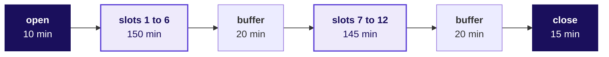

# Day sheet, Build 1 Thursday: can every learner use the fortnight's method on an unseen question, defend their group's answer alone, and get the build to run cold before Friday's freeze?

**TRAINER ONLY.** Nothing on this page reaches a learner. It names every plant in the Kalpa Health
data with its witness number, and a learner who reads it has lost the week.

Posts to <!-- sync:module:W03/D4 -->Module 1: Foundations of AI and Data<!-- /sync:module:W03/D4 -->, on <!-- sync:day-date:W03/D4 -->Thu 22 Oct 2026<!-- /sync:day-date:W03/D4 -->.

There is no IITGN faculty block on this day. Build 1's spine, `docs/detailing/W03_build1_spine.md`,
approved on 29 September 2026, sets the day: Mock R1 for every learner, about 20 minutes each, a
technical half on Weeks 1 and 2 and a viva on the group's work, with the build completed around the
roster. Nothing new is taught in a build week, and the day carries no practice set, no Kahoot and no
test.

Kalpa Health is a US diagnostics business, a laboratory and two patient service centres in each of
six US metro areas, billing patients' payers in dollars, with its analytics and revenue-cycle work
run from Kalpa's Global Capability Centre (GCC) in Bengaluru, where the learners are trainee
engineers. Its chief operating officer (COO), Dr Priya Menon, sees test volumes up 5 percent from Q2
to Q3 of 2026 against a plan of 18. Thirty-five learners in nine groups each answer one of her five
heads' questions, their sub-problem, from ten files exported on Friday 16 October 2026, and each group
stated a headline claim, with its denominators and its caveat, at Wednesday's close. The files hold
plants, patterns placed in them on purpose for a group to find, each with a witness number, the
figure the data generator prints for it.

## Which questions does Thursday ask, and in what order?

**Who needs the answer.** The trainer and the three assessors, before the open. The day asks each
learner three things in one room at once, and an adult who loses the order asks the viva's question
in the technical half or teaches on the floor.

**The questions on the way.** What is the day's question, in the room's words? Which part of the day
asks which smaller question? What evidence does each part leave, and what is it worth? What does the
close answer?

The day's question, in the room's words: **can I carry the Weeks 1 and 2 method into a question I
have not seen, defend my group's work on my own, and get our notebook to run cold before the
freeze?** Ask it at the open. The technical half asks the first part, the viva the second, and the
three build checks the third; the close answers all three for the room.

| Part | Its question | The smaller questions, in order | Evidence and marks |
|---|---|---|---|
| The open, 10 min | How does a mock fit around the build today, and when is each of you out? | What does the mock test? Who sits when, and with whom? What does the group owe by tonight? | Every learner can name their slot and assessor from the seat list; no marks |
| The technical half, 9 min a learner | Can you carry a Week 1 or 2 move into a Kalpa Health question you have not seen? | The move, the number and the judgement: one question at each level, each with a follow-up | The three answers and follow-ups in the evidence note; 15 marks, correctness 8, reasoning aloud with numbers 4, handling a follow-up 3 |
| The viva, first step | What did your group do, and which Week 1 or 2 move did it carry? | Which analysis, on which files, and which decision would you defend? Where does your tree, ladder or comparison differ from Week 1's? | The opener and the translation probe in the note; part of the translation's 6 marks |
| The viva, second step | Why did your group choose that way rather than another? | The seat's probe: one decision, why that one, and what the alternative would have given; show the cell | The seat probe's answer and the cell the learner showed; the rest of the translation's 6 marks |
| The viva, third step | What would change your group's call, and does the caveat hold when the asker pushes? | What is your claim and its caveat? What would make the caveat smaller? | The caveat, and whether it held under the push with a number; defending a caveat, 6 marks |
| Looking back | What would you do differently if you started again tomorrow? | Which log entry shows the moment to change course? | The entry the learner names from their own log; what they would do differently, 3 marks |
| The build, three checks | Does every number on your one-slide answer come from a notebook that runs cold on the raw files? | Who is out when, and what would stop the run? What is each number out of, and which cell makes it? Does the run finish clean on a machine that is not its author's? | Each group's line on the floor sheet at checks 1, 2 and 3; no marks today |
| The close, 15 min | Can every learner use the method on an unseen question and defend the group's answer alone, and will every build run cold before Friday's freeze? | Which moves carried and which were recited? Which probes broke most? Which groups did not run cold at check 3? | The assessors' impressions and check 3's results; no mark is said |

**The day's answer, at the close.** The assessors' impressions and check 3 answer the day's question
for the room without naming a learner: which moves carried into Kalpa Health and which were recited,
which probes broke, and which groups still have to make their notebook run cold tonight.

## What does Thursday cover, and where does it stop?

**Who needs the answer.** The trainer, before the open. The day teaches nothing, and an answer given
on the floor hands a group a plant before its panel scores it.

**The questions on the way.** Where does the day start? How far does it go? What does it never do?
What comes later? What is cut first if time runs short?

| | |
|---|---|
| **Start from** | Each group's headline claim from Wednesday, with its denominators and caveat, and the build where Wednesday left it. Every learner has the Week 1 and 2 method, the domain's story from Monday and their own sub-problem. |
| **Go as far as** | Every learner mocked once against the approved rubric, every mock's six marks entered with evidence behind them, every group's notebook run cold at check 3, and every group's one-slide answer drafted. |
| **Stop before** | Any teaching. Any confirmation, hint or denial of what is in the data, in a mock or on the floor. Any technical question asked about the ten files. Any score said in the room. |
| **Comes later** | Friday: the build freezes, two cold demo runs, the group discussions with the industry expert, and the first presentations. Saturday: the remaining group discussions, the presentations with live demos, and grade closure. |
| **Cut first** | Check 2's second pass, then check 1 to one question a group, then the L1 questions to two minutes. **Never cut the viva, check 3 or the close.** |

## What has to happen before Thursday starts?

**Who needs the answer.** The Programme Head and the trainer, on Wednesday evening after Wednesday's
close. The first mocks start ten minutes into Thursday, so a learner whose slot comes early prepares
on Wednesday evening or not at all.

**The questions on the way.** Who fills the roster, and what must it read? What reaches every learner
on Wednesday evening? What does the online mock need?

1. The Programme Head fills the roster's Groups sheet from Monday's allocation and reads four zeros
   on its Settings sheet: no two group-mates out at once, no seat asked two questions from one
   family, no question shared by two group-mates, and no reserve that repeats a family in its seat or
   a question a group-mate is asked.
2. The trainer sends every learner the brief, `mocks/C2_W03_D04_mock_brief_STUDENT.md`, and the seat
   list, which shows each seat's slot, minutes and assessor and nothing else. Export the roster's Seat
   list sheet alone to PDF and send the PDF, never the workbook: its Grid sheet's question ids would
   tell a learner mocked early what the learners after them will be asked.
3. The trainer books the quiet room for the online mocks and sends the Principal Advisor the call
   link.

## Who runs what today?

**Who needs the answer.** Every adult in the room, so that no learner waits for an assessor and no
group goes without its checks.

**The questions on the way.** What does each role do today?

| Role | What they do today |
|---|---|
| The Programme Head | Runs mocks in person for G1, G4 and G7, and writes the day's record at the close |
| The Academic TA | Runs mocks in person for G2, G5 and G8, and leads the open build time after the second block |
| The Principal Advisor | Runs mocks online for G3, G6 and G9, and holds the spare slot, slot 12 |
| The trainer | Runs the open and the close, calls each learner to their slot, opens the quiet room and the call link for the online mocks, and runs the three build-completion checks on the floor |
| The groups | Build all day around the roster, one member out at a time |

## How does the day run, block by block and slot by slot?

**Who needs the answer.** The trainer and the three assessors, before the open. The slots run back to
back, so a learner called late costs every later learner in that assessor's day.

**The questions on the way.** What fills each block? What runs in each block, and who does what? Who
sits in which slot?

A slot is 20 minutes of mock and 5 of changeover, in which the assessor finishes the note and enters
the marks. Block 1 is 10, 150 and 20 minutes, which is 180. Block 2 is 145 minutes of slots, since the
last changeover falls away, then 20 of buffer and 15 of close, which is 180.

### What runs in block 1?

| Minutes | What runs | The trainer | The assessors |
|---|---|---|---|
| 0 to 10 | The open | Reads the opening words, hands out printed copies of the brief and the seat list, which every learner had on Wednesday evening, and opens the quiet room and the call link | The huddle, from the assessors' guide |
| 10 to 55 | Slots 1 and 2 | Calls each learner five minutes before the slot; runs check 1, two minutes a group | Mocks |
| 60 to 155 | Slots 3 to 6 | Calls the learners; runs check 2, three minutes a group | Mocks |
| 160 to 180 | The buffer | Runs check 2's second pass on groups that were behind | Catch up any overrun; the Principal Advisor sends block 1's notes to the Programme Head |

### What runs in block 2?

| Minutes | What runs | The trainer | The assessors |
|---|---|---|---|
| 0 to 45 | Slots 7 and 8 | Calls the learners; helps any group whose check 2 found a number with no cell | Mocks |
| 50 to 145 | Slots 9 to 12 | Calls the learners; runs check 3, five minutes a group | Mocks; the Principal Advisor's slot 12 is the spare |
| 145 to 165 | The buffer | Reruns check 3 for any group that failed it | Finish notes; take a late learner in a free slot |
| 165 to 180 | The close | Chairs it | Their impressions, from the assessors' guide |

After the second block, the groups have open build time with the TAs. The row's after-class task is
the presentation drafted and the demo path rehearsed once, and a group whose notebook failed check 3
spends this time on that and nothing else.

### Who sits in which slot?

This is the roster's default for 35 learners in nine groups, eight of four and G9 of three. The call
order takes seat 1 of every group, then seat 2 of every group, and so on, so the three learners in a
slot always come from three different groups. Each seat's set letter picks its three technical
questions. Once the Groups sheet carries Monday's allocation, a question close to a group's own
sub-problem is swapped for the question at the same level from the set four letters on, and the Grid
prints each learner's three questions, three reserves and viva probe, so the assessors read all of
them from the roster's Grid sheet, which is also the one to print if Monday's allocation changed the
groups. The probes rotate: a group's members take four different ones, and a second group on the same
sub-problem starts one probe on, so a seat number tells a learner nothing about the probe. The table
below shows each slot's seat and set; the questions, reserves and probes appear once the groups are
allocated.

| Slot | Block, minutes | Programme Head, in person | Academic TA, in person | Principal Advisor, online |
|---|---|---|---|---|
| 1 | Block 1, 10 to 30 | G1-S1, set A | G2-S1, set B | G3-S1, set C |
| 2 | Block 1, 35 to 55 | G4-S1, set D | G5-S1, set E | G6-S1, set F |
| 3 | Block 1, 60 to 80 | G7-S1, set G | G8-S1, set H | G9-S1, set A |
| 4 | Block 1, 85 to 105 | G1-S2, set B | G2-S2, set C | G3-S2, set D |
| 5 | Block 1, 110 to 130 | G4-S2, set E | G5-S2, set F | G6-S2, set G |
| 6 | Block 1, 135 to 155 | G7-S2, set H | G8-S2, set A | G9-S2, set B |
| 7 | Block 2, 0 to 20 | G1-S3, set C | G2-S3, set D | G3-S3, set E |
| 8 | Block 2, 25 to 45 | G4-S3, set F | G5-S3, set G | G6-S3, set H |
| 9 | Block 2, 50 to 70 | G7-S3, set A | G8-S3, set B | G9-S3, set C |
| 10 | Block 2, 75 to 95 | G1-S4, set D | G2-S4, set E | G3-S4, set F |
| 11 | Block 2, 100 to 120 | G4-S4, set G | G5-S4, set H | G6-S4, set A |
| 12 | Block 2, 125 to 145 | G7-S4, set B | G8-S4, set C | Spare |

The Programme Head and the Academic TA hear 12 learners each and finish at minute 145 of block 2; the
Principal Advisor hears 11 and finishes at minute 120. A group's members sit three slots apart, so
each group always has its other members at the keyboard.

## Which words does the trainer say at each turn of the day?

**Who needs the answer.** The trainer, who speaks at the open, at every call and at the close. A
learner who hears the questions discussed in the room, or hears a score, loses what the mock was for.

**The questions on the way.** What are the opening words? What does the trainer say when calling a
learner? What closes the day?

**The opening words, to the room, under two minutes.** "Today each of you sits Mock R1, a mock
interview of about 20 minutes, while your group keeps building. The brief you had last night says
how it runs and how it is scored, and the seat list says your slot and your assessor. I will call you
five minutes before your slot, so keep working until I do. No two people from one group are out at
the same time. When you come back, say nothing about the questions. Here is the question for the day:
can each of you use the method on a question you have not seen, defend your group's work on your own,
and get your notebook to run cold before tomorrow's freeze? By tonight, your notebook runs from Dr
Menon's raw files on a machine that is not its author's, your logs are current, and your one-slide
answer is drafted."

**Calling a learner, five minutes before the slot.** "Your mock is in five minutes with [assessor],
[in this room, or online from your own laptop in the quiet room]. Take your laptop with your notebook
run top to bottom and your two logs open. Hand your piece of the build to [the group-mate who covers
it]."

**The close, the last 5 minutes, with the room.** "Every mock is done, and the scores close with
every other Build 1 grade on Saturday. Tomorrow the build freezes and each group runs its demo cold
twice. Tonight: draft the presentation and rehearse the demo once, start to finish, on the raw
files." Name the groups that passed check 3, and say that every other group spends its open build
time on that run.

## What does "materially complete" mean tonight, deliverable by deliverable?

**Who needs the answer.** Every group, and the trainer at check 3. Friday's freeze stops the code
changing, so anything not complete tonight goes in front of the panel as it stands.

**The questions on the way.** Which five things does a group ship by Saturday, and what does each need
by the end of today?

| Deliverable | Materially complete by the end of today |
|---|---|
| A presentation slot of 25 to 30 minutes, with a live demo run cold on the group's own copy of the files, and the panel's questions | The skeleton exists in Saturday's presentation format, and the demo path is written down as the cells or queries in the order they will run |
| The one-slide answer for Dr Menon's board: claim, evidence, caveat and action | Drafted in four sentences; every number has its denominator and its quarter, and each traces to one cell |
| The notebook or SQL that reproduces every number from the raw files | Runs from a fresh start to the last cell on `content/W03/D1/data/`, with no hand-edited file in between, on a machine that is not its author's |
| The decisions log, in the Week 1 Wednesday shape | A line for every cleaning or matching call, with the rule, the rows and dollars it moved, and the reason; each file's rows reconciled |
| The challenges log | Current to today, with each learner's line after their mock where the viva found a gap |

## How do the three build-completion checks run, and what does each catch?

**Who needs the answer.** The trainer, who runs all three on the floor while the mocks run. A group
that cannot rerun its notebook from the raw files tonight demos a number on Friday that nobody can
reproduce.

**The questions on the way.** What does each check ask, and when? What does a group on track sound
like? Which one question goes to a group that is stuck?

Ask; never fix, and never name what is in the data. A stuck group gets one question from the table at
the end of this section, once, and the trainer walks on.

### Check 1: who is out when, and what would stop the notebook running cold?

Block 1, slots 1 and 2, two minutes a group, 18 minutes for nine. Ask: "Who is out when today, and who
takes their piece while they are?" Then: "What is the one thing left that would stop your notebook
running cold?" Write the answer on the group's line of the floor sheet. A group that cannot name its
gap goes first at check 2.

### Check 2: what is each number out of, and which cell makes it?

Block 1, slots 3 to 6, three minutes a group, 27 minutes. Pick one number from the group's draft
one-slide answer and ask the member at the keyboard:

1. "What is it out of, and over which quarter?"
2. "Show me the cell that makes it."
3. "What would make it wrong?"

A group that answers all three in under two minutes is on track. A group that cannot find the cell
reruns from the raw files now, while the afternoon is still there.

### Check 3: does the run finish clean on a machine that is not its author's?

Block 2, slots 9 to 12, five minutes a group, 45 minutes. Watch the notebook run from a kernel restart
to the last cell on a member's machine that is not the author's, or the SQL run in order against a
fresh load; start it, move to the next group, and come back for the end. It passes only if it runs
clean with no manual step. Then read the one-slide answer aloud and ask, "Which sentence is the
caveat?" Friday's cold demo is this check run twice, so a group that passes check 3 is ready for it.
A group that fails either part spends the open build time after the second block on it, with a TA.

### Which one question goes to a group that is stuck?

Each question points at where to look and never at what is there, and each is the question Monday's
day sheet gives for a group that has found nothing. For sub-problems 2 and 4 only Monday's first
question stays: sub-problem 2's second names a metro brief 2 asks the group to find, and sub-problem
4's names a planted count.
Use one, once, and leave.

| Sub-problem | The question |
|---|---|
| Every group | "What did the dashboard count as one test, and from which system?" |
| 1, revenue | "Which one claim moves your Q3 average most?" Then: "What does one claim line count?" |
| 2, bookings | "How many rows, and how many distinct booking ids?" |
| 3, billing | "Show me five `claim_ref` values beside five `claim_id` values." |
| 4, no-shows | "What is the rate out of, for KH-ATL-03 and for the others?" |
| 5, campaign | "Does the lift hold inside Dallas alone?" Then: "What share of each metro's patients got the offer?" |

## What is planted in each sub-problem, and what should a group have found by Thursday?

**Who needs the answer.** The trainer on the floor and the assessors in the viva, who must recognise
a plant when a group names it and never name one first.

**The questions on the way.** What is planted, with which witness numbers? What should each group
have by Thursday? What if a group has found nothing?

**TRAINER ONLY.** Every number below is recomputed from the ten files by
`internal/C2_W03_D04_numbers_INTERNAL.py`, which ends `RESULT: PASS` while the data pack is unchanged.
None of it reaches a learner, and nothing today confirms or denies it. The viva prompts carry each
plant in full, with the probes that test it.

| Sub-problem | What is planted | The witness numbers | What a group should have by Thursday |
|---|---|---|---|
| The headline, every group | Dr Menon's 5 percent is her dashboard's count: tests booked in the old booking system only, a panel counted as its component tests | 23,213 to 24,406 tests, 5.1 percent; across both systems 7.8 percent (to 25,022); tests performed 8.6 percent (22,468 to 24,399); bookings 5.6 percent (5,692 to 6,009); all without the employer contract, whose 1,200 screenings add 6,000 tests to Q3 | Its own growth number with its unit, both systems in it and the contract shown apart, against the plan of 18 |
| 1, revenue | One employer wellness contract in Q3, and panels billed as one claim line | Claim KH-CLM-007802, account EMP-0007, Dallas, 6 August, $180,000: 14.6 percent of Q3's $1,231,001; mean claim $210.50 with it and $179.75 without, median $150; outside it, billed charges grow 8.3 percent, $93,715 short of the plan, $63,436 of it in Chicago and Philadelphia; 60 amounts written as text with a dollar sign | The contract shown apart, the tree reaching the two falling metros, the shortfall in dollars, and the payers' uneven growth as a second finding |
| 2, bookings | Chicago and Philadelphia moved to the new booking system on 18 September, and the old export carries only its own bookings; the old export repeats 180 rows; the new system writes dates month first | 23.0 percent fall in the old export (1,415 to 1,090), 12.2 percent in truth (to 1,243); 11,729 rows for 11,549 ids; 153 new-system bookings from 18 to 30 September | Both systems stacked, one row per booking, and the fall of about 12 percent, under way before the switch |
| 3, billing | Claim keys in three formats, double posts from duplicate remittance loads, the employer claim unpaid, and denials posted with nothing paid | An exact join matches 216 of 11,343 postings, 1.9 percent; 280 double posts, $19,204.63; 398 claims with no posting, $253,165, the employer claim among them; 1,175 retail claims denied, 10.35 percent; paid $801,314 against $2,201,099 billed | Every posting matched after normalising the key, the double posts counted once, and every claim classed with its dollars |
| 4, no-shows | KH-ATL-03 runs by appointment while the other centres' visits include walk-ins; the register is drawn from the bookings, so a rebooked patient's missed slot is a row beside the kept one | 18.8 against 7.9 percent on all visits; 19.0 percent (15 of 79) against 15.1 percent on scheduled visits; a gap chance produces with probability 0.21; on all visits the same check gives 0.0014 | The rate on scheduled visits, and a chance check that says the gap is inside the wobble |
| 5, campaign | The offer went at random to half the patients in three metros already rising and to a fifth elsewhere, and inside the three metros offered patients booked less | Offered patients book 9.0 percent more overall and less in every campaign metro (Dallas minus 10.8, Atlanta minus 19.9, Phoenix minus 13.0); 50.5 against 21.4 percent offered; the three metros rose 6.9 percent before the offer; New York's plus 23.5 percent is a false positive at p of about 0.03 | The split by metro, the trend before the offer, the two groups compared before it, and a hold-back proposed for the next wave |

**If a group has found nothing by Thursday.** Ask its stuck-group question once and walk on. The viva
asks about the same ground without naming it, and the panel will too, so a plant a group never found
costs it on the mini project rubric's analysis row, and never because a trainer or an assessor named
it.

## Which numbers does the day carry, and where does each come from?

**Who needs the answer.** The Programme Head, who answers for every minute and mark the day uses.

**The questions on the way.** Where does each number on this sheet come from?

| Number | What it is | Where it comes from |
|---|---|---|
| 35 learners in 9 groups | Eight groups of four and G9 of three | `data/programme/facts.yaml`, cohort, both stated; the roster's default until Monday's allocation |
| 20 and 5 minutes | A mock and its changeover | The row's "roughly 20 minutes each"; the changeover is this pack's choice |
| 10 and 15 minutes | The huddle and the close | The huddle is this pack's choice; the close is the row's 15 minutes |
| 180 minutes | Each block | `data/programme/facts.yaml`, campus day |
| 12 slots, 36 places | Six slots a block for three assessors | The roster's Settings sheet: 170 minutes over 25 is 6, and 165 over 25 is 6 |
| Minute 145 and minute 120 | The last mock of the day, and the Principal Advisor's last | The roster's Settings sheet |
| 18, 27 and 45 minutes | Checks 1, 2 and 3 across nine groups | Two, three and five minutes a group |
| 30 marks | The mock, 15 a half | `data/programme/facts.yaml`, `evaluation.rubrics.W03`, approved 29 September 2026 |

The mock is scored on the approved rubric:

<!-- sync:rubric:W03/mock -->
**Mock interview R1, 30 marks.** Each learner is scored alone, 15 marks on the technical half and 15 on the project viva.

| Half | Criterion | Marks |
|---|---|---|
| Technical | Correctness | 8 |
| Technical | Reasoning aloud with numbers | 4 |
| Technical | Handling a follow-up | 3 |
| Project viva | The translation, with one decision defended by evidence | 6 |
| Project viva | Defending a caveat under challenge | 6 |
| Project viva | What they would do differently | 3 |
<!-- /sync:rubric:W03/mock -->

## How does the day's interview question sound when answered in one breath?

**Who needs the answer.** The trainer and the assessors, who hold the opener's answer to a bar: an
answer that narrates the tools in order scores below one that starts from the stakeholder.

**The questions on the way.** What does a strong one-breath answer say? What makes it strong? Which
page calibrates the technical half?

**`[S]` Walk me through the analysis you did on unfamiliar data and one decision you would defend.**

One breath, in the voice of a learner from a billing group: "The finance head asked which claims were
unpaid, so I profiled before I joined, found my first join matched 2 percent of postings because the
posting system writes the claim three ways, normalised the key so every posting matched, and the
decision I would defend is counting a second identical payment minutes after the first once, as a
file loaded twice, with all 280 listed for the posting team to check against the bank; two payments
on two claims keep two keys, so the rule cannot touch them."

The trainer keeps this answer as the bar and never reads it to the room, on Thursday or Friday, since
it names sub-problem 3's plants. It is strong because it opens on the stakeholder's question, names
the Week 1 move (profile first) and the Week 2 move (count what a join matched before summing), gives
the number that exposed the problem, and defends a decision with the case that would break it. A weak
version narrates the tools in the order they were opened.

The row names GeeksforGeeks, "Data Analyst Interview Questions and Answers", to calibrate the
technical half:
https://www.geeksforgeeks.org/data-analysis/data-analyst-interview-questions-and-answers/ (verified 1 October 2026)

## What do you do when the day goes wrong?

**Who needs the answer.** The trainer, in the moment, with the next learner already waiting.

**The questions on the way.** What do you do in each case below?

| What happens | What to do |
|---|---|
| A learner is absent at their slot | The slot becomes free for that assessor. A learner who arrives later takes the spare slot or the first free one. A learner absent all day is listed for a make-up, which the Programme Head schedules. Do not edit the roster on the day. |
| Two learners from one group are absent | The group builds with two; check it first at check 2 |
| An assessor is out for part of the day | Their learners move to the other two assessors' free and spare slots, then into the open build time after the second block with whichever assessor stays. The Principal Advisor's online slots are the easiest to move. |
| The online link fails | Reconnect within two minutes. A mock that lost less than five minutes finishes in the time left. One that lost more stops, the point it reached is noted, and the whole mock restarts in the spare slot, slot 12, or the next buffer if slot 12 is taken: each technical question the learner had already heard is replaced by the reserve the Grid prints at its level, the viva takes the headline probe in place of the seat probe if the learner had heard the seat probe, and only the restart is scored. The assessors' guide gives the step for a reserve already asked of a group-mate. |
| Mocks run behind | Each block has a buffer of 20 minutes. Once a buffer is spent, the assessors shorten L1 questions to two minutes. Never shorten the viva. |
| A group's notebook does not run cold | Fix it today: put a TA on it after the second block, with the decisions log open, rerunning from the raw files one section at a time |
| A group has found nothing unusual in its data | Ask its stuck-group question once and walk away; never name the plant |
| A learner reports questions being passed around | Thank them and tell the assessors at the next changeover; they switch each passed-around question to the reserve the Grid prints for the learner who meets it, and the follow-ups carry the half either way |
| A learner comes back from the mock upset | Two minutes with the trainer away from the group: the score comes later, the mock is practice for the screens ahead, and the group needs them. Tell the Programme Head. |
| The sub-problem allocation is not in the roster | Fill the roster's Groups sheet from Monday's allocation before the huddle; the Seats, Roster, Grid and Seat list sheets update from it |

## Which file does each moment of the day need?

**Who needs the answer.** Anyone running the day who has to find a file fast.

**The questions on the way.** Which file, for which moment, and for whom?

| Moment | File | Audience |
|---|---|---|
| Wednesday evening and the open, every learner | `mocks/C2_W03_D04_mock_brief_STUDENT.md` | STUDENT |
| Wednesday evening and the open, the seat list | `mocks/C2_W03_D04_roster_TRAINER.xlsx`, its Seat list sheet exported alone to PDF | The PDF goes to learners; the workbook stays TRAINER |
| The huddle and every mock, the grid of questions, reserves and probes | `mocks/C2_W03_D04_roster_TRAINER.xlsx`, printed from its Grid sheet | TRAINER |
| The huddle, the scripts, the evidence note and the close | `mocks/C2_W03_D04_assessors_guide_TRAINER.md` | TRAINER |
| The technical half | `mocks/C2_W03_D04_mock_question_bank_TRAINER.md` | TRAINER |
| The viva | `mocks/C2_W03_D04_viva_prompts_TRAINER.md` | TRAINER |
| The marks, entered in each changeover | `rubrics/C2_W03_D04_mock_scoring_sheet_TRAINER.xlsx`, one shared copy | TRAINER |
| The floor and the three checks | This sheet | TRAINER |
| Every number on this sheet | `internal/C2_W03_D04_numbers_INTERNAL.py` and `internal/C2_W03_D04_provenance_INTERNAL.md` | INTERNAL |

The two recalc manifests beside the workbooks carry the INTERNAL tag and are never handed out, and
`internal/C2_W03_D04_build_workbooks_INTERNAL.py` rebuilds both workbooks from
`data/programme/facts.yaml`.
