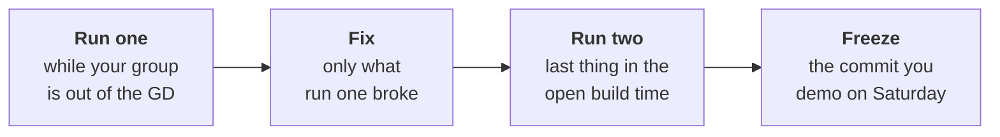

# Cold demo checklist: two runs before the freeze

On Saturday your group opens its Kalpa Health files in front of the panel and runs the demo cold. Dr
Menon's finance head will ask the same thing the panel asks: can someone who was not in your group get
your number from the raw files. A demo that works only warm, in the Codespace where you built it with
cells run in the order you remember, fails tomorrow. Today you prove it twice.

## What your group ships on Saturday

| Deliverable | What it is |
|---|---|
| The presentation | A slot of 25 to 30 minutes: the talk, a live demo run cold on your group's own Kalpa Health files, and the panel's questions. The format is in `content/W03/SAT/slides/C2_W03_SAT_presentation_format_STUDENT.md`. |
| The one slide | The answer Dr Menon carries into her board meeting: the claim, the evidence, the caveat and the action. |
| The notebook or SQL | The code that reproduces every number on the one slide from the ten raw files, top to bottom, with nothing run by hand in between. |
| The decisions log | Every cleaning and reconciling decision, in the Week 1 Wednesday shape, in `C2_W03_D01_decisions_log_STUDENT.xlsx` from Monday's `briefs/` folder. |
| The challenges log | What blocked you and how you got past it, in `C2_W03_D01_challenges_log_STUDENT.xlsx` from the same folder. |

## When the two runs happen



Run one happens in the first block, while your group is not in its GD, or in the second block if your
GD fell in the first. The trainer calls a roll call in the second block where each group reads out its
run-one line. Run two is the last thing your group does before the builds freeze at the end of the open
build time.

## The run, step by step

Tick each box on both runs.

- [ ] **Push everything.** Commit and push the notebook or SQL, the one slide, both logs and the
      `slide_numbers.txt` file from step 5. Write down the commit hash.
- [ ] **Open a new Codespace, never your working one.** On the repository page on GitHub, pick your
      branch, click **Code**, open the **Codespaces** tab and click **Create a codespace on BRANCH**
      (steps from GitHub's documentation,
      https://docs.github.com/en/codespaces/developing-in-a-codespace/creating-a-codespace-for-a-repository, verified 29 September 2026).
      A fresh Codespace holds no variable, no file and no package you added by hand.
- [ ] **Use the raw files as the data team dropped them.** The ten Kalpa Health CSV files, unedited.
      A file opened in Excel and saved again has changed, even if it looks the same; the script in
      step 6 catches it.
- [ ] **Install only what `requirements.txt` says.** If the notebook needs a package the file does not
      list, the run fails, and that is the fix to make now.
- [ ] **Write the slide's numbers down.** A text file, `slide_numbers.txt`, one number per line, written
      exactly as the one slide prints it, with a label after a `|` if you like. Every number on the
      slide goes in: the claim's number, the evidence's numbers, and the numbers in the caveat.
- [ ] **Run the check.** From the terminal in the new Codespace:

      ```bash
      python3 C2_W03_D05_cold_run_STUDENT.py --notebook analysis.ipynb --slide slide_numbers.txt --data data --run 1
      ```

      Use your own paths. The script checks the ten raw files, runs the notebook top to bottom in a
      fresh kernel, times it, and looks for every slide number in what the notebook prints. A number
      the notebook computes but never prints does not count, so print each one in the slide's format.
      A group working in SQL runs its load and query files against a fresh database with
      `time psql -f load.sql -f analysis.sql` and ticks each slide number off the output by hand.
- [ ] **Read every FAIL line.** A missing number means the slide and the code disagree. Decide which one
      is right, fix the other, and log the decision.
- [ ] **Check the time.** Past about five minutes for the whole run, the live demo eats the panel's
      questions. Find the slow cell now, and decide which cells the demo runs live.
- [ ] **Log the run** in the table below: paste the line the script prints and add the fix.
- [ ] **Add a decisions log entry** for every change the cold run forced, and a challenges log entry if
      it cost your group more than ten minutes.

## Kavya Nair's review, before the slide leaves the team

For your headline number, reach it a second way: a different cut, a different file, or a count done by
hand on a small slice. If the two ways disagree, the slide is not ready, whatever the cold run says.

## What usually breaks a cold run

| What broke | What it looks like | The fix |
|---|---|---|
| A path that only exists on one laptop | `FileNotFoundError` naming `/Users/...` or a Downloads folder | A relative path from the notebook's folder |
| A cell that depends on one run later | `NameError` on a variable you are sure you defined | Move the defining cell up; run all from the top again |
| A cleaned file read back in place of the raw one | The run passes in the old Codespace and fails in the new | Build the clean table in the notebook from the raw files every time |
| A package installed by hand | `ModuleNotFoundError` | Add it to `requirements.txt` |
| A number typed into the slide from memory | The script reports the number as not printed | Print it from the code and copy it from the output |
| A random sample with no seed | A different number on each run | Set the seed, or drop the sample |

## The freeze

The builds freeze at the end of the open build time. The commit your group pushed last before the
freeze is the commit you demo on Saturday, and the TA records its hash. After the freeze, the wording
on the slide may change and no number may. If you find an error after the freeze, you say it on
Saturday as a caveat, with the right number and why it moved, and you log it; a group that finds and
states its own error has done what the week asks.

## The cold-run log

| Run | Date | Minutes | Slide numbers reproduced | What broke | The fix |
|---|---|---|---|---|---|
| 1 | | | | | |
| 2 | | | | | |

## Today's interview question

**[F]** Take a position in a group discussion and defend it with one number.
