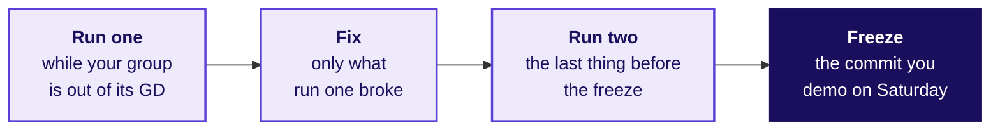

# Will your demo reproduce every number on your slide from the raw files, cold, in front of the panel?

Build 1, Friday 23 October 2026. Kalpa Health, its people and its patients are fictional, and every
record in its files is synthetic.

> "Before I put your number in front of the board, someone who was not in your group has to get it
> from the files we sent you, with nothing typed in by hand."
> The finance head, Kalpa Health

**Who needs the answer.** Your group, before the builds freeze tonight, and Dr Priya Menon, Kalpa
Health's COO, on Saturday. A demo that works only in the Codespace where it was built fails in
front of the panel, and the live demo is part of each member's presentation and defence marks.

**The questions on the way.** How does Friday run for your group? What do you ship, and which part
must run cold? When do the two cold runs happen, and what does the freeze lock? How do you run one?
What does each line the check script prints mean? Does your headline number survive a second way?
What usually breaks a cold run? What happens if the demo fails in front of the panel? Where do you
log each run?

---

## How does Friday run for your group?

**Who needs the answer.** Every member, who has a group discussion, two cold runs and perhaps a
presentation to fit into one day.

**The questions on the way.** When is your group's discussion? When do you run the demo cold? Who
presents today?

The day opens with the industry expert, and the Programme Head draws the order of the group
discussions, the GDs: thirty minutes a group, on a Kalpa Health question your group has not seen,
separate from your project. While your group is out of its GD, you do cold run one. After lunch a
first tranche of presentations runs, drawn by sub-problem, and every group reads its run-one line
aloud at a roll call. Run two is the last thing your group does before the builds freeze when the
open build time closes. Saturday's presentation order is drawn at the close.

## What does your group ship on Saturday, and which part must run cold?

**Who needs the answer.** Every member, since the panel may ask any of you about any piece.

**The questions on the way.** What is in the shipment? Which piece is tested cold?

| Deliverable | What it is |
|---|---|
| The presentation | A slot of 25 to 30 minutes: your answer, a live demo run cold on your group's own copy of the Kalpa Health files, and the panel's questions; every member answers |
| The one-slide answer | The slide Dr Menon carries into her board meeting: the claim, the evidence, the caveat and the action |
| The notebook or SQL | The code that reproduces every number on the one slide from the ten raw files, top to bottom, with nothing run by hand in between; this is the piece the cold run tests |
| The decisions log | Every cleaning and matching call, in the Week 1 Wednesday shape (field, issue, rows, decision, reason), in `C2_W03_D01_decisions_log_STUDENT.xlsx` from Monday's `briefs/` folder |
| The challenges log | What stopped your group, what you tried and what you decided, dated as it happened, in `C2_W03_D01_challenges_log_STUDENT.xlsx` from the same folder |

## When do the two cold runs happen, and what does the freeze lock?

**Who needs the answer.** Your group, which has two chances today to find what breaks, and none
after tonight.

**The questions on the way.** When is each run? What may change after the freeze, and what may not?



Run one happens in the first block, while your group is out of its GD, or in the second block if
your GD fell in the first. Run two is your group's last act before the freeze. The last commit your
group pushes before the freeze is the commit you demo on Saturday, and the TA records its hash.
After the freeze the wording on your slide may change and no number may. An error you find after
the freeze is said on Saturday as a caveat, with the right number and why it moved, and logged; a
group that finds and states its own error has done what the week asks.

## How do you run a cold run, step by step?

**Who needs the answer.** The member at the keyboard, with the rest of the group watching for a step
done from memory.

**The questions on the way.** Where does the run happen? What does it read? What does it check?

Tick each box on both runs.

- [ ] **Push everything.** Commit and push the notebook or SQL, the one slide, both logs and the
      `slide_numbers.txt` file from the step below. Write down the commit hash.
- [ ] **Open a new Codespace, never your working one.** On your repository's page on GitHub, choose
      your branch from the branch menu, click **Code**, open the **Codespaces** tab and click
      **Create a codespace on BRANCH** (GitHub Docs, "Creating a codespace for a repository",
      https://docs.github.com/en/codespaces/developing-in-a-codespace/creating-a-codespace-for-a-repository,
      verified 1 October 2026). A fresh Codespace holds no variable, no file and no package you
      added by hand. Labels on GitHub's pages move, so look for the step it describes.
- [ ] **Use the raw files as the data team exported them.** The ten Kalpa Health CSV files,
      unedited. A file opened in Excel and saved again has changed even if it looks the same, and
      the check script catches it.
- [ ] **Install only what `requirements.txt` says.** If the notebook needs a package the file does
      not list, the run fails, and that is the fix to make now. The check script needs `jupyter` and
      `nbconvert` too.
- [ ] **Write the slide's numbers down.** A text file, `slide_numbers.txt`, one number per line,
      written exactly as the one slide prints it, with a label after a `|` if you like. Every
      number on the slide goes in: the claim's, the evidence's and the caveat's.
- [ ] **Run the check.** From the terminal in the new Codespace, with your own paths:

      ```bash
      python3 C2_W03_D05_cold_run_STUDENT.py --notebook analysis.ipynb --slide slide_numbers.txt --data data --run 1
      ```

      The script, `C2_W03_D05_cold_run_STUDENT.py` in this folder, checks the ten raw files, runs
      the notebook top to bottom in a fresh kernel, times it, and looks for every slide number in
      what the notebook prints. A number the notebook computes and never prints does not count, so
      print each one in the slide's format. A group working in SQL runs its load and query files
      against a fresh database with `time psql -f load.sql -f analysis.sql` and ticks each slide
      number off the output by hand.
- [ ] **Read every FAIL line,** using the table below.
- [ ] **Check the time.** Past about five minutes for the whole run, the live demo eats the panel's
      questions. Find the slow cell now and decide which cells the demo runs live.
- [ ] **Log the run** in the table at the end: paste the line the script prints and add the fix.
- [ ] **Add a decisions log entry** for every change the cold run forced, and a challenges log entry
      if it cost your group more than ten minutes.

## What does each line the check script prints mean, and what do you do about it?

**Who needs the answer.** The member reading the output, who has to decide what to fix before the
next run.

**The questions on the way.** Which lines mean the files, the run or the slide is wrong?

| The line | What it means | What to do |
|---|---|---|
| `PASS  the ten raw files match` | Every file is byte for byte the data team's export of Friday 16 October 2026 | Nothing |
| `FAIL  raw file changed since the data team dropped it` | A raw file was edited or saved again | Copy the raw file back from the data pack, and clean in the notebook instead |
| `FAIL  raw file missing` | The data folder lacks a file | Check the `--data` path, then copy the file in |
| `FAIL  the notebook stopped after N minutes` | A cell raised an error, and the last line of the error follows | Fix that cell and rerun from the top |
| `FAIL  slide number ...` | The slide shows a number the notebook never prints in that form | Decide which is right, the slide or the code, fix the other, and log the decision |
| `RESULT: PASS` | The files match, the run is clean and every slide number was found | Log it and push |

## Does your headline number survive a second way?

**Who needs the answer.** Kavya Nair, the senior analyst on your team at the GCC, who checks every
group's work before it leaves the team.

**The questions on the way.** What counts as a second way? What if the two disagree?

Kavya's review asks for the baseline your number is compared with, the denominator every rate is out
of, the evidence behind the claim, and a second way to reach the same number. Reach your headline
number a second time by a different route: another file that counts the same thing, a different
cut of the same file, or a count done by hand on a small slice. If the two routes disagree, the
slide is not ready, whatever the cold run says.

## What usually breaks a cold run, and what is the fix?

**Who needs the answer.** The group whose run one failed, with an hour to find out why.

**The questions on the way.** What does each break look like, and what is its fix?

| What broke | What it looks like | The fix |
|---|---|---|
| A path that exists only on one laptop | `FileNotFoundError` naming `/Users/...` or a downloads folder | A relative path from the notebook's folder |
| A cell that depends on one run later | `NameError` on a variable you are sure you defined | Move the defining cell up, then run all from the top again |
| A cleaned file read back in place of a raw one | The run passes in the old Codespace and fails in the new one | Build the clean table in the notebook from the raw files every time |
| A package installed by hand | `ModuleNotFoundError` | Add it to `requirements.txt` |
| A number typed onto the slide from memory | The script reports the number as not printed | Print it from the code and copy it from the output |
| A random sample with no seed | A different number on each run | Set the seed, or drop the sample |

## What happens if the demo fails in front of the panel?

**Who needs the answer.** Every member, since presentation and defence is scored for each learner.

**The questions on the way.** How long do you have to recover? What is scored if the demo still
fails?

The demo runs once, cold, on the raw files. If it fails, your group has two minutes to recover it
live, as it would in front of a client. If it still fails, you present from your executed notebook,
and the panel scores the live demo, inside presentation and defence, as not run cold. The other 34
marks are scored from the executed run, so a failed demo costs its own marks and never the
analysis. The rubric the panel scores against, as approved:

<!-- sync:rubric:W03/mini-project -->
**Mini project, 40 marks.** The first four criteria are scored once for the group, and every member receives those 34 marks; presentation and defence is scored for each learner on 6 marks, so a silent teammate cannot ride the group's score.

| Criterion | Marks | What full marks look like |
|---|---|---|
| The question translated | 8 | Dr Menon's words are mapped to the right Weeks 1 and 2 method, with the metric defined and the decision it feeds named. |
| The data made trustworthy | 10 | The data is profiled before it is touched, every cleaning call is in the decisions log with its reason, and counts and dollars reconcile across files. |
| The analysis | 10 | The tree, ladder or fair comparison reaches the branch that explains the symptom, on the right denominator, with a chance test where one is needed. |
| The claim | 6 | One sentence carries its number, denominator, period and caveat, plus an action Dr Menon can take. |
| Presentation and defence | 6 | The live demo runs cold, and every member answers a challenge on the caveat. |
<!-- /sync:rubric:W03/mini-project -->

## Where does your group log each run?

**Who needs the answer.** The trainer at the roll call, and the TA who checks run two before the
freeze.

**The questions on the way.** Which line goes in each row?

| Run | Date | Minutes | Slide numbers reproduced | What broke | The fix |
|---|---|---|---|---|---|
| 1 | | | | | |
| 2 | | | | | |

Today's interview question, which your group discussion rehearses: **[F]** Take a position in a
group discussion and defend it with one number.
