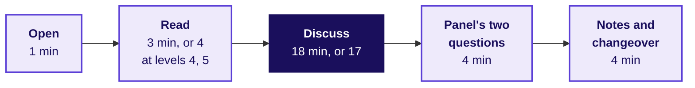

# How does a chair run a 30-minute Build 1 GD round, and score each learner fairly?

**TRAINER ONLY.** Written for the industry expert, who chairs stream A in the GD room, and the
Principal Advisor, who chairs stream B online. Neither wrote this pack, so everything needed to run
a round is on this page. The numbers behind each card, the move it asks for and what full marks
look like on it are in `C2_W03_D05_gd_prompts_TRAINER.md`.

**Who needs the answer.** The two chairs and the two timekeepers. Two rooms that run the round
differently score the same move differently, and the learners compare notes the same evening.

**The questions on the way.** What is the GD for? Who runs which room? How do the 30 minutes run?
What does the chair say to open? Which moves count, and for which criterion? When does the chair
step in? How does evidence become a score, and how are the levels kept fair? What goes wrong online?
What does each card add?

---

## What is the GD for, and what is it not?

**Who needs the answer.** The chair, before round one, who is judging a skill and has no answer key.

**The questions on the way.** What is being trained? Why is the card unseen? What is off limits?

The group discussion trains structured articulation under time pressure on Kalpa Health's problem
space: whether four trainee engineers can turn a COO's question into a decision, a metric and one
number, and hear each other while they do it. It is separate from the mini project and unprepared
by design. A group that steers into its own build is steered back to the card, and the chair never
says what any group's data shows.

## Who runs which room, and what does each room need?

**Who needs the answer.** The trainer and the Academic TA, who set both rooms up before round one.

**The questions on the way.** Who chairs and who keeps time? What goes on the table?

| Stream | Chair | Where | Timekeeper and host |
|---|---|---|---|
| A | The industry expert | The GD room on campus | The trainer, who hands out the cards |
| B | The Principal Advisor, online | A second room, with one laptop at the head of the table whose camera takes in all four seats, and one speakerphone in the middle | The Academic TA, who hands out the cards and holds the laptop |

Four chairs round one table, the chair's seat or the laptop at its head. Print five copies of each
card, four for the group and one for the chair. Pen and paper, and one phone calculator for the
group in the middle of the table; no laptops, since the discussion is the product.

## How do the 30 minutes run?

**Who needs the answer.** Both timekeepers, who hold every round to the same clock.

**The questions on the way.** How long is each part? What does each person do in it? Why do levels
4 and 5 read for longer?

| Part | Minutes | What the chair does | What the timekeeper does |
|---|---|---|---|
| Open | 1 | Says the opening instruction below, word for word, then the card's own line | Lays the cards face down, then says "turn them over" |
| Read | 3, or 4 for cards 07 to 10 | Stays silent; the learners read alone and may write | Calls "one minute" before the end |
| Discuss | 18, or 17 for cards 07 to 10 | Listens and writes evidence; steps in only on the triggers below | Shows a card at 5 minutes left and at 1 minute left, then calls time |
| The panel's two questions | 4 | Asks the card's two questions, each to a named learner, the quietest learner among them, and lets one other learner add | Keeps each answer near a minute |
| Notes and changeover | 4 | Finishes the evidence notes while the group leaves and the next sits | Collects the cards and the group's paper, and brings the next group in |

Cards 07 to 10 carry more exhibit, so they read for four minutes and discuss for seventeen; the
cards say so themselves.

## What does the chair say to open every round?

**Who needs the answer.** Every group, which should hear the same instruction in both rooms.

**The questions on the way.** What is the group asked to deliver? What will the chair not do?

> "You are Kalpa's GCC team, and Dr Menon has sent you the question on this card. Read it alone,
> then reach a position as a group. When I call time I want one position, the one number that
> carries it, and what would change your mind. If you cannot agree, tell me where you split and
> why. Any row marked as an assumption or an illustration is yours to challenge. I will not answer
> questions about the numbers once you start, so read carefully."

Then add the card's own line, given in the card-by-card section below.

## Which moves show structure, and which criterion does each feed?

**Who needs the answer.** The chair, whose notes are the only evidence the scores rest on.

**The questions on the way.** What does each move sound like? Which criterion does it count toward?

Listen for these in roughly the order a discussion needs them. Write each one down with the learner
who made it and the minute.

| Move | What it sounds like | Evidence for |
|---|---|---|
| Framing the decision | "So Dr Menon chooses between signing and walking, and she has to decide this month." | Structures the problem |
| Naming the metric | "We should judge this on margin, since revenue flatters the cut." | Structures the problem |
| Putting numbers on one footing | "The plan's forty percent is of its members' tests, and Houston's fifteen is of all tests, so let us convert." | Structures the problem |
| Naming the Week 1 or 2 move | "This is the fair comparison from Week 1 Thursday: labs without the model, over the same months." | Structures the problem |
| Using one number | "Break-even is 42 percent and they expect 40, so on their own numbers it loses." | Uses evidence |
| Challenging an assumption | "The one in six comes from sixty calls; that could be nine percent or twenty-eight." | Uses evidence |
| Building on another member | "To take your point about margin further: at 40 percent we are still $360 down." | Engages |
| Bringing in a quiet member | "You have not said anything about the older patients. Where do you land?" | Engages |
| Stating what would change the mind | "If more than half the January buyers are new, I would switch sides." | Lands a conclusion |
| Closing with the risk | "So our position is a pilot, the number is 24 percent, and the risk is a year's delay." | Lands a conclusion |

## When does the chair step in, and with which words?

**Who needs the answer.** The chair, who steps in at most twice in a discussion and writes each
intervention down with its minute, so no learner is marked for a silence the chair created.

**The questions on the way.** Which situations call for a word? What is the word?

| What is happening | When | What to say |
|---|---|---|
| One voice dominates | The same learner has spoken for most of three minutes | "Hold that thought. [Name], you have not spoken yet; where do you land?" |
| The room stalls | Thirty seconds of silence after the first five minutes | "Say what you would tell Dr Menon if she walked in now, even if you are not sure." |
| Two camps, no movement | Past minute 12 with the same two positions repeated | "Each side: what number would make you switch?" |
| The group argues about arithmetic | More than two minutes on one sum | "Agree the sum, or agree to disagree on it; which way does it tip the decision?" |
| A learner steers into the group's own build | Any time | "Stay with the card. Your build is Saturday's conversation." |
| A learner asks the chair a factual question | Any time after reading | "Use the card. If the card does not say, state your assumption out loud." |
| A learner is talked over twice | Any time | "Let [Name] finish." |

Never give an answer, confirm a number, say which position is right, or say anything about what
the week's data shows. If a group asks whether its reading of the card is correct, say "that is the
group's call".

## How does the chair keep evidence, and how does it become a score?

**Who needs the answer.** The chair, who scores each learner alone, and the Academic TA, who
gathers both streams' notes before the close of block two.

**The questions on the way.** What goes in the notes? When are scores entered? What is the rubric?

Nothing is scored in the room. During the discussion the chair keeps one line per contribution: the
minute, the learner's seat, what was said in their words and which move from the table above it
was. Building on or challenging another member's point is evidence for Engages too, so note who
answered whom. In the four-minute changeover the chair turns the notes into the four scores for
each learner in `rubrics/C2_W03_D05_gd_scoring_sheet_TRAINER.xlsx`, which totals them and flags a
score above a criterion's maximum. A learner who spoke once is scored on that once. The Principal
Advisor's notes reach the Academic TA in the changeover, typed in the call's chat or sent as a photo
of the page.

The rubric, approved by the requester on 29 September 2026, renders here from
`data/programme/facts.yaml`, so a change reaches this page with one sync:

<!-- sync:rubric:W03/gd -->
**Group discussion, 30 marks.** Each learner is scored alone.

| Criterion | Marks | What full marks look like |
|---|---|---|
| Structures the problem | 8 | The learner frames the decision and the metric before arguing. |
| Uses evidence | 8 | The learner takes a position and defends it with a number from the exhibit. |
| Engages | 8 | The learner builds on or challenges another member's point and brings a quiet member in. |
| Lands a conclusion | 6 | The discussion ends on a recommendation and its main risk. |
<!-- /sync:rubric:W03/gd -->

The evidence page the chair writes on, printed one per round:

| Minute | Seat | What was said, in their words | Move | Criterion |
|---|---|---|---|---|
| | | | | |

## How is a level 5 round scored fairly beside a level 1 round?

**Who needs the answer.** The chair, whose later rounds meet harder cards, since the draw fixes which
group sits which slot.

**The questions on the way.** What does the rubric reward at every level? What does a harder card
change?

The rubric scores the moves, never the card. A level 1 group earns full marks under Uses evidence by
defending its position with the break-even it computed; a level 5 group earns the same by defending
its order of moves with the weeks of cash or the clause it read. A level 5 card has no clean answer,
so Lands a conclusion is met by a recommendation with its main risk, even where the group names a
split. A level 1 group earns nothing extra for arithmetic alone, and a level 5 group loses nothing
for leaving a sum unfinished if its framing and its one number hold. The prompts file gives, for
every card, what full marks look like on each criterion, and the chair reads that block before the
round.

## What goes wrong online, and what is the fix?

**Who needs the answer.** The Principal Advisor and the Academic TA, who run stream B.

**The questions on the way.** What fails, and who acts?

| Problem | Fix |
|---|---|
| The Principal Advisor's audio drops | The Academic TA pauses the clock and the group waits in silence. Past two minutes, the TA reads the card's two panel questions from this page, and the Principal Advisor scores from the TA's notes. |
| The camera misses a seat | Move the laptop, never the learners; every face is in frame before the cards are turned over. |
| The group talks to the laptop instead of to each other | The Principal Advisor says once: "Talk to each other; I am listening." |
| The whole call fails before the round | Swap the round with the next stream A round on the roster and tell the trainer; the roster workbook recomputes the ends. |

---

## What does each card add to the round?

**Who needs the answer.** The chair, who reads the card's block here in the minute before it opens.

**The questions on the way.** Which line does the chair add? Which two questions follow the
discussion? What do the strongest and the weakest discussions sound like?

Each block carries the line added to the opening, the panel's two questions, and the strongest and
the weakest discussion. After the two questions, if a minute remains, the chair may ask one learner
"Which move from Weeks 1 and 2 did your group's argument use?", and an answer that names it is
evidence for Structures the problem.

### Card 01: should Kalpa cut the self-pay panel's price from $299 to $249?

**Add to the opening:** "This is the first round, and the card has one trade-off in it. Find it."

**The panel's two questions.**
1. "What lift in January panels would make you change your answer?"
2. "Are January's extra buyers new patients, or people who would have come anyway? How would you tell?"

**The strongest discussion** works out the margin at both prices in the first eight minutes, finds
the 42 percent break-even against the 40 expected, and spends the rest on who the extra buyers are,
closing on a position with a condition. **The weakest** argues "cheaper sells more" against "we lose
money" for eighteen minutes and never multiplies anything.

### Card 02: should Kalpa stop posting paper statements?

**Add to the opening:** "One side of this is certain and one is a guess. Say which is which."

**The panel's two questions.**
1. "Your saving is certain and your loss is estimated. How would you check the estimate within a month?"
2. "Why do older patients receive fewer statements than their share of the register?"

**The strongest discussion** puts $19,800 against about $14,000, finds the 42 percent of older
patients it would take to lose money, notices that the survey asked 120 people, and removes the risk
by design with paper on request. **The weakest** decides on principle, "digital is the future" or
"older people matter", and never sets the two numbers side by side, or applies the register's 25.4
percent to the statements.

### Card 03: should Kalpa promise same-day results in all six metros?

**Add to the opening:** "Two people you work for disagree. Decide who is right, metro by metro if you
have to."

**The panel's two questions.**
1. "The lab director said two labs. How many did you find, and does the difference matter?"
2. "If you could buy one second shift, where would it go, and what would you advertise meanwhile?"

**The strongest discussion** applies the 15 percent rise to every lab, finds New York over 70 and
Dallas at 69, and proposes a staged promise or a cut-off time with the shift's cost against it.
**The weakest** picks a side, or averages the six labs and finds room everywhere.

### Card 04: should Kalpa close its phone booking line?

**Add to the opening:** "Watch whose estimate each number is, and how many people stand behind it."

**The panel's two questions.**
1. "What share of phone bookers would have to leave before closing the line loses money?"
2. "The estimate came from 60 calls. What would you ask about them before you believed it?"

**The strongest discussion** turns 15 percent into 3,450 bookings, finds 575 at risk worth $48,875
against $65,000, names the 22 percent break-even and says the sample of 60 cannot tell 17 from 22;
it proposes a staged close and a measure of who leaves. **The weakest** treats the register's 25.4
percent aged 65 and over as the share of phone bookers who leave, or treats one in six as exact.

### Card 05: is the vendor's "30 percent fewer denials" good enough to buy on?

**Add to the opening:** "One number on this card carries the whole case. Decide how much of it you
believe."

**The panel's two questions.**
1. "Against what would you compare the 30 percent, and what does that comparison give?"
2. "What would you need to see at Kalpa before you signed, and how long would it take?"

**The strongest discussion** compares the client lab with the fourteen labs that did not buy the
model, notices that the payer's rule change alone could explain most of the fall, finds that Kalpa
needs 24 percent, and proposes a pilot with half the claims held back. **The weakest** takes the 30
percent as the model's effect and argues only about the price. This card is never given to a
sub-problem 3 or 5 group; the roster checks it.

### Card 06: should the lab director rank the six labs on turnaround?

**Add to the opening:** "The tables are an illustration of the report's format. Decide whether the
ranking is fair."

**The panel's two questions.**
1. "Phoenix is last on the table. Where does it rank on routine tests, and why the difference?"
2. "What would you print beside each lab so that its manager believes the table?"

**The strongest discussion** reads the appendix before the ranking, finds that a quarter of
Phoenix's work is batched tests and that it leads on routine work, and proposes a table by kind of
test or at a common mix. **The weakest** ranks the labs as printed and argues about how hard to
press Phoenix. If a group asks whether the other labs count a result the same way, write it down as
the best question of the round and do not answer it. This card is never given to a sub-problem 4
group.

### Card 07: where should the board's $2 million go?

**Add to the opening:** "Three people sent numbers. Before you choose, check that they count the same
thing."

**The panel's two questions.**
1. "The outreach lab books $3.2 million a year. What would Kalpa be paid for the same tests?"
2. "Which plan's number rests on the weakest evidence, and how would you test it before the money moves?"

**The strongest discussion** puts the three numbers on one footing, about $720,000, $216,000 and
$501,600 a year, then ranks them by the strength of their evidence and by years to repay, and picks
one plan with a test or splits the money. **The weakest** backs the biggest number, or the head who
spoke last on the card.

### Card 08: should Kalpa sign the plan's preferred-lab offer?

**Add to the opening:** "Every growth figure on this card is a percentage of something. Find what."

**The panel's two questions.**
1. "The plan says 40 percent and the Houston lab says 15. Put them on one base: which is larger?"
2. "Give me your counter-offer in one sentence: the cut, the floor and what you share."

**The strongest discussion** finds the $16 margin falling to $11.20, the 42.9 percent break-even, and
that the plan's 40 percent is 12 percent of all Dallas tests while Houston's 15 is half again on the
members' base; it counters with terms. **The weakest** multiplies 1.40 by 0.88, calls it 23 percent
growth and signs.

### Card 09: what does Dr Menon do in the week the clearinghouse is down?

**Add to the opening:** "This one has no clean answer. I am listening for the order of your moves and
how you choose."

**The panel's two questions.**
1. "How many weeks of cash does Kalpa have, and when does each of your moves bring money in?"
2. "Would you sign the second clearinghouse's draft as it is? What would you change first, and why?"

**The strongest discussion** sets about four weeks of cash against three to five weeks to the first
payment from a new clearinghouse, takes the Medicare advance as a bridge and never as a fix, keys
the largest claims into the plans' websites meanwhile, and refuses the draft's use clause until it
is cut back. **The weakest** treats the $82,500 as lost, or signs the draft because speed matters
most, or waits for the outage to end. This card is never given to a sub-problem 3 group.

### Card 10: should Kalpa move its Texas Medicaid claim work to Bengaluru?

**Add to the opening:** "You work in the GCC. Argue this as Dr Menon would have to explain it to the
state."

**The panel's two questions.**
1. "The clause forbids moving the information out of the US. Does logging in from Bengaluru to files kept in Dallas get round it?"
2. "What could the team in Bengaluru do for these claims that needs no patient's record?"

**The strongest discussion** treats the clause as a bound on every option, reads its remote-access
sentence, sets the $40,000 saving against the contract and the 180 patients, and lands on keeping
the patient-level work in the US, asking the state in writing and giving Bengaluru the work that
needs no patient's record. **The weakest** moves the work because the saving beats the plans'
payments, or drops the plans without a word about the patients.
