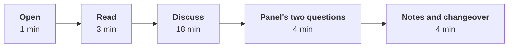

# Build 1 GD: facilitation notes for the chair

**TRAINER ONLY.** Written for the industry expert, who chairs the rounds in the room, and the Principal
Advisor, who chairs a share of them online. Neither wrote this pack, so everything needed to run a
round is on this page, and the numbers behind each card are in `C2_W03_D05_gd_prompts_TRAINER.md`.

## What the GD is, in two sentences to say to yourself before round one

The group discussion tests structured articulation under time pressure on Kalpa Health's problem
space: can four trainee engineers turn a COO's messy question into a decision, a metric and one number,
and hear each other while they do it. It is separate from the mini project and unprepared by design,
so a group that tries to steer into its own build is steered back to the card.

## The room

| Stream | Chair | Where | Who hosts |
|---|---|---|---|
| A | The industry expert | The GD room on campus | The trainer keeps time and hands out cards |
| B | The Principal Advisor, online | A second room with one laptop at the head of the table, its camera taking in all four seats, and one speakerphone in the middle | The Academic TA keeps time, hands out cards and holds the laptop |

Four chairs round one table, the chair's seat (or the laptop) at the head. Print five copies of each
card: four for the group and one for the chair. Pen and paper only; one phone calculator for the whole
group, placed in the middle. No laptops, since the discussion is the product.

## The 30 minutes

| Part | Minutes | What the chair does | What the timekeeper does |
|---|---|---|---|
| Open | 1 | Says the opening instruction below, word for word | Hands out the cards face down, then says "turn them over" |
| Read | 3 | Silent; the group reads alone and may write | Calls "one minute" at two |
| Discuss | 18 | Listens and writes; intervenes only on the triggers below | Shows a card at 5 minutes left and at 1 minute left, and calls time |
| Panel's two questions | 4 | Asks the two questions for this card, each to a named learner, and lets one other learner add | Keeps each answer near a minute |
| Notes and changeover | 4 | Writes the evidence notes while the group leaves and the next one sits | Collects the four cards and the group's paper, and brings the next group in |

## The opening instruction, the same for every card

> "You are Kalpa's GCC team, and Dr Menon has sent you the question on this card. You have three
> minutes to read it alone and eighteen to reach a position as a group. When I call time I want one
> position, the one number that carries it, and what would change your mind. If you cannot agree, tell
> me where you split and why. The rows marked as the prompt's assumption are yours to challenge. I
> will not answer questions about the numbers once you start, so read carefully."

Then add the card's own line, given in each block below.

## The moves that show structure

Listen for these in the order a discussion usually needs them. Write each one down with the learner who
made it and the minute. They are what you describe back to the group if the Programme Head asks for
feedback, and the evidence the scoring sheet is filled from. The right-hand column names the rubric
criterion each move is evidence for.

| Move | What it sounds like | Evidence for |
|---|---|---|
| Framing the decision | "So the choice is between A and B, and Dr Menon has to decide by the board meeting." | Structures the problem |
| Naming the metric | "We should judge this on margin in the month, since revenue flatters the cut." | Structures the problem |
| Putting numbers on one footing | "Marketing's nine lakh is revenue and finance's is margin, so let us convert." | Structures the problem |
| Using one number | "Break-even is 42 percent and they expect 40, so on their own numbers it loses." | Uses evidence |
| Challenging an assumption | "The 16.7 percent comes from a sample of calls; how many calls?" | Uses evidence |
| Stating what would change the mind | "If more than half the festive buyers are new, I would switch sides." | Lands a conclusion |
| Bringing in a quiet voice | "You have not said anything about the older patients, what do you think?" | Engages |
| Closing | "So our position is B, the number is 7.6 percent, and we change our mind if the comparison cities rose as much." | Lands a conclusion |

## When to intervene, and the words to use

Intervene at most twice in 18 minutes. Each intervention is written in the notes with the minute, so a
group is never marked for a silence the chair created.

| What is happening | When | What to say |
|---|---|---|
| One voice dominates | The same learner has spoken for most of three minutes | "Hold that thought. [Name], you have not spoken yet; where do you land?" |
| The room stalls | Thirty seconds of silence after the first five minutes | "Say what you would tell Dr Menon if she walked in now, even if you are not sure." |
| Two camps, no movement | Past minute 12 with the same two positions repeated | "Each side: what number would make you switch?" |
| The group argues about arithmetic | More than two minutes on one sum | "Agree the sum or agree to disagree on it; which way does it tip the decision?" |
| A learner steers into the group's own build | Any time | "Stay with the card. Your build is Saturday's conversation." |
| A learner asks the chair a factual question | Any time after reading | "Use the card. If the card does not say, state your assumption out loud." |
| A learner is talked over twice | Any time | "Let [Name] finish." |

Never give an answer, confirm a number, say which position is right, or say anything about what the
week's data shows. If a group asks whether its reading of the card is correct, say "that is the group's
call."

## The assessors' notes and the rubric

Each learner is scored alone, on 30 marks, against the rubric the requester approved on 29 September
2026. It renders here from `data/programme/facts.yaml`, so a change reaches this page with one sync:

<!-- sync:rubric:W03/gd -->
**Group discussion, 30 marks.** Each learner is scored alone.

| Criterion | Marks | What full marks look like |
|---|---|---|
| Structures the problem | 8 | The learner frames the decision and the metric before arguing. |
| Uses evidence | 8 | The learner takes a position and defends it with a number from the exhibit. |
| Engages | 8 | The learner builds on or challenges another member's point and brings a quiet member in. |
| Lands a conclusion | 6 | The discussion ends on a recommendation and its main risk. |
<!-- /sync:rubric:W03/gd -->

Nothing is scored in the room. During the round the chair keeps evidence: one line per learner per
contribution, with the minute, what was said in their words, and which move from the table above it
was. Building on or challenging another member's point is evidence for Engages too, so note who
answered whom. In the four-minute changeover the chair turns the notes into the four scores for each
learner in `rubrics/C2_W03_D05_gd_scoring_sheet_TRAINER.xlsx`, which totals them and flags a score
above a criterion's maximum. A learner who spoke once gets scored on that once; a silence the chair
created by intervening is written down and never held against anyone.

The Principal Advisor's notes go to the Academic TA in the four-minute changeover, typed in the chat
of the call or sent as a photo of the page, so both streams' notes sit in one place by the end of the
block.

## Online rounds: what goes wrong and the fix

| Problem | Fix |
|---|---|
| The Principal Advisor's audio drops | The Academic TA pauses the clock and the group keeps silent. Past two minutes, the TA reads the panel's two questions from this page, and the Principal Advisor scores from the TA's notes and the call recording if one runs. |
| The camera misses a seat | Move the laptop, never the learners; every face in frame before the card is turned over. |
| The group talks to the laptop and not to each other | The Principal Advisor says once: "Talk to each other, I am listening." |
| The whole call fails before the round | Swap the round with the next stream A round on the roster and tell the trainer; the roster workbook recomputes the ends. |

## Card by card

Each block carries the extra opening line, the panel's two questions (ask them to two different
learners, and ask the quietest learner one of them), and what the strongest and the weakest
discussions sound like.

### Card 01: the festive price (level 1)

**Add to the opening:** "This is the warm-up round, and there is one trade-off in it. Find it."

**The panel's two questions.**
1. "What lift in bookings would make you change your answer?"
2. "Are the festive buyers new patients, or this year's buyers coming a month early? What would you check?"

**The strongest discussion** computes the margin in a normal month and at the lower price inside the
first eight minutes, finds the break-even lift near 42 percent, and spends the rest on whether the 40
percent is new demand; it closes on a position with a condition.
**The weakest** argues "cheaper sells more" and "we lose money" at each other for 18 minutes and never
multiplies anything.

### Card 02: the printed report (level 1)

**Add to the opening:** "One side of this is certain and one is a guess. Say which is which."

**The panel's two questions.**
1. "Your saving is certain and your loss is estimated. How would you check the estimate in a month?"
2. "Who in the 25 percent aged 60 and over is most at risk, and what would you do for them?"

**The strongest discussion** puts Rs 4.32 lakh against about Rs 1.5 lakh, then removes the risk by
design (print on request, or at the clinic counter) and names how to measure who asks for print.
**The weakest** decides on principle ("digital is the future", "older people matter") and never puts
the two numbers side by side.

### Card 03: same-day reports in every city (level 2)

**Add to the opening:** "Two people you work for disagree. Decide who is right, city by city if you
have to."

**The panel's two questions.**
1. "The operations head said two labs. How many did you find, and does the difference matter?"
2. "If you could buy one second shift, where would it go, and what would you advertise meanwhile?"

**The strongest discussion** applies the 15 percent lift to every city, finds Bengaluru over 70 and
Mumbai at 69, and proposes a promise staged by city, or a cut-off, with the shift cost against it.
**The weakest** picks a side ("marketing is right") without running the six cities through the ceiling.

### Card 04: closing the phone line (level 2)

**Add to the opening:** "Watch whose estimate each number is."

**The panel's two questions.**
1. "What share of phone bookers would have to leave before closing the line loses money?"
2. "The estimate came from a sample of calls. What would you ask about the sample before you believed it?"

**The strongest discussion** turns 15 percent into 3,450 bookings, finds one sixth at risk, compares
Rs 8.6 lakh with Rs 6.5 lakh, and names the 12.6 percent break-even; it proposes a phased close with
the app's assisted booking for older patients and a measure of who leaves.
**The weakest** treats "25 percent of patients are over 60" as "25 percent of phone bookers are over 60"
and builds the case on it.

### Card 05: free home collection everywhere (level 3)

**Add to the opening:** "One number on this card carries the whole case. Decide how much you trust it."

**The panel's two questions.**
1. "The finance head asked for the 9 percent against the cities that did not get the offer. Why does that comparison matter, and what might it show?"
2. "At what lift does the offer stop paying for itself?"

**The strongest discussion** costs the offer at about Rs 10.6 lakh a year, finds the break-even lift
near 7.6 percent, and says the decision depends on whether the 9 percent survives a fair comparison;
it proposes the test before the rollout.
**The weakest** takes the 9 percent as given and argues about brand, or rejects the offer on cost
without asking what the 9 percent was measured against.

Do not tell the group anything about the campaign's real effect, however close it gets. This card is
never given to a sub-problem 5 group; the roster checks it.

### Card 06: the no-show league table (level 3)

**Add to the opening:** "The table is an illustration of the format, not Kalpa's figures. Decide
whether the format is fair."

**The panel's two questions.**
1. "Clinic F has 5 no-shows. What happens to its rank with one fewer?"
2. "What would you print beside every rate so that a clinic manager believes the table?"

**The strongest discussion** notices the visits column before the rate column, shows that one patient
moves F by more than 3 points, and proposes a version with the base beside each rate, a minimum
volume, or a three-month trend.
**The weakest** ranks the clinics as printed and argues about how to shame F politely.

If a group asks whether every clinic counts a visit the same way, write it down as the best question of
the round and do not answer it. This card is never given to a sub-problem 4 group.

### Card 07: pricing a corporate health-check contract (level 4)

**Add to the opening:** "Three people sent numbers. Before you choose, check that they are counting
the same thing."

**The panel's two questions.**
1. "The marketing head's families bring in nine lakh. Nine lakh of what?"
2. "Give me your counter-offer in one sentence: price, payment terms and the window."

**The strongest discussion** separates revenue from margin, converts the families to about Rs 5.1 lakh
of margin, costs the 90-day wait, finds the 23 working days on one shift, and makes a counter-offer on
all three terms.
**The weakest** accepts Rs 1,100 because the logo and the families make up for it, adding revenue to
margin without noticing.

This card is never given to a sub-problem 1 or 3 group.

### Card 08: where the next Rs 2 crore goes (level 4, the spare)

**Add to the opening:** "Every plan comes with a number. Put the three numbers on one footing before
you pick."

**The panel's two questions.**
1. "Which of the three numbers would you test first, and how, before the money moves?"
2. "Which plan's number rests on the weakest evidence?"

**The strongest discussion** converts the three numbers to revenue in year one (Rs 27 lakh, Rs 60 lakh,
Rs 41.4 lakh), then ranks them by the strength of the evidence behind each, and picks the plan whose
claim can be checked soonest, or splits the money with a test.
**The weakest** backs whichever head spoke last on the card, or averages the three.

### Card 09: the insurer's cashless tie-up (level 5)

**Add to the opening:** "This one has no clean answer. I am listening for how you choose."

**The panel's two questions.**
1. "The insurer says 40 percent, the marketing head says 20. What volume do you need to break even, and which number do you believe?"
2. "Would you hand over the clinic-level figures? What would you give instead?"

**The strongest discussion** finds the existing policyholders who now pay less, reaches a break-even
near 33 percent more volume, notices the payment delay eats most of the insurer's margin of safety,
asks "40 percent of what", and makes a conditional offer: a volume floor, a review date, a smaller
discount, or aggregate figures only.
**The weakest** multiplies 40 percent more volume by the discounted price, calls it growth, and signs.

### Card 10: the sample mix-up (level 5)

**Add to the opening:** "A patient was harmed. Decide what Dr Menon says to the board, and what it costs."

**The panel's two questions.**
1. "Two mislabels in 40,000 samples. How sure are you of the rate, and does your decision change if it is three times higher?"
2. "What does it cost to avoid one wrong diagnosis with the second check, and is that cheap?"

**The strongest discussion** separates the news story from the error rate, reaches about Rs 2 lakh per
error avoided, says two events are too few to know the rate, and chooses a position that can survive
the next incident: the check where the error happened, a fix at labelling, or the promise narrowed.
**The weakest** picks the pause because it is visible, or dismisses the check because two in 40,000 is
small, and never says what a missed diagnosis costs the patient.
