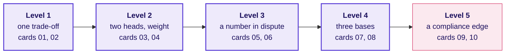

# Which ten decisions does the Build 1 GD put to the groups, and what does a strong group reach on each?

**TRAINER ONLY.** The ten STUDENT cards sit beside this file, one per prompt, and a card is turned
over only when its round opens. This file carries what the cards leave out: each card's level, the
sub-problem it sits nearest, the Week 1 or 2 move it asks for, where every exhibit number comes
from, the arithmetic a strong group reaches, the plausible wrong number a hurried group reaches, and
what full marks look like on that card. How to run a round is in
`C2_W03_D05_gd_facilitation_TRAINER.md`; which group meets which card is in
`C2_W03_D05_gd_roster_TRAINER.xlsx`.

**Who needs the answer.** The industry expert and the Principal Advisor, who chair the rounds
without having written them. A chair who does not know a card's arithmetic cannot tell a learner who
reasoned to a number from one who guessed it, and the guess gets the marks.

**The questions on the way.** How do the cards climb, and what makes each level harder? Which card
may a group not draw? Where does every number on a card come from, and why does none give a plant
away? Then, for each card: what is decided and on which metric, which move it asks for, what a
strong group computes, which wrong number a hurried group reaches, which positions hold, and what
full marks look like.

The GD is a thread separate from the mini project. It runs on Kalpa Health's business and the US
healthcare it sits in, and it is unprepared by design: no group sees its card before the round, and
nothing on a card needs the group's build. The cards do not name the Week 1 or 2 move they ask for,
because framing the problem is what the rubric's first criterion scores; this file names it, and
the panel may ask for it after the discussion.

---

## How do the ten cards climb, and what makes each level harder?

**Who needs the answer.** The chair, who scores a level 5 group on the same rubric as a level 1
group and has to know what each card asks of it.

**The questions on the way.** What does each level add? Why do levels 4 and 5 read for a minute
longer?

| Level | Cards | What makes it harder than the level before | Read, then discuss |
|---|---|---|---|
| 1 | 01, 02 | One decision and one trade-off, and every number on the card agrees with every other; the trap is a total or a base read wrongly | 3, then 18 minutes |
| 2 | 03, 04 | Two heads want different things on the same numbers, so the argument is about weight; the trap hides inside an average or inside a small sample | 3, then 18 |
| 3 | 05, 06 | One number on the card is a claim or a ranking, and whether it is fair decides the card | 3, then 18 |
| 4 | 07, 08 | Three heads send numbers on different bases, and the group has to put them on one footing before it can choose | 4, then 17 |
| 5 | 09, 10 | Several heads, numbers that pull different ways, a cost that is not money and a rule of law or contract that bounds every option; no position wins on every count | 4, then 17 |

Levels 4 and 5 carry more exhibit, so their cards say four minutes to read and seventeen to
discuss, inside the same 30-minute round.

## Which card may a group not draw, and why?

**Who needs the answer.** The trainer, who checks the roster after Friday's draw and swaps a card
before its round opens.

**The questions on the way.** Which cards sit near a sub-problem? What is the swap?

A group never meets a card that sits on ground its own sub-problem has trained it in all week, since
it would argue from rehearsal while the other groups argue cold. No card uses a number from the
files any group works on, so the rule protects fairness, and no plant rides on it.

| Card | Title in short | Level | Roster slot | Kept from the groups on |
|---|---|---|---|---|
| 01 | The self-pay panel price | 1 | 1 | none |
| 02 | Paper statements | 1 | 2 | none |
| 03 | Same-day results | 2 | 3 | none |
| 04 | The phone line | 2 | 4 | none |
| 05 | The vendor's 30 percent | 3 | 5 | 3 billing (denial rates) and 5 campaign (a claimed lift against a comparison) |
| 06 | The turnaround table | 3 | 6 | 4 no-shows (one site's rate compared fairly) |
| 07 | The $2 million | 4 | 7 | none |
| 08 | The preferred-lab offer | 4 | the spare | none |
| 09 | The clearinghouse outage | 5 | 8, Saturday | 3 billing (claims and remittances) |
| 10 | Texas Medicaid offshore | 5 | 9, Saturday | none |

The roster's Check sheet flags a clash. The fix is the other card of the same level, if its own
flag allows, or card 08, the spare, which clashes with nobody.

## Where does every number on a card come from, and why does none give a plant away?

**Who needs the answer.** The chair, who may be asked "is this Kalpa's real figure?" and answers only
"use the card"; and the reviewer who checks that no card spends a group's discovery.

**The questions on the way.** Which numbers come from Kalpa's files? Which real facts were checked,
and where? Which numbers are each card's own? What was kept off every card?

**From Kalpa Health's files.** The cards quote only three files, none of which carries a plant: the
patient register, the price list and the site list in `content/W03/D1/data/`.
`internal/C2_W03_D05_numbers_INTERNAL.py` recounts each figure from the files and checks the cards
quote it.

| Figure | Cards | Where it comes from |
|---|---|---|
| 6,700 patients on the register | 02, 04 | `patients`, its rows |
| 1,699 patients aged 65 and over, 25.4 percent | 02, 04 | `patients`, `age_band` 65+ |
| 1,250 patients in Dallas, 180 of them on Medicaid, 14.4 percent | 08, 10 | `patients`, `metro` and `payer_type` |
| The Whole-body wellness panel at $299, and the Healthy aging panel by name | 01, 04 | `test_catalogue` |
| Six laboratories, one a metro, and twelve patient service centres | 03, 06, 07 | `sites`, `kind` |

**Real facts, every one checked on 1 October 2026.** The URLs are in the provenance.

| Fact | Card | Source |
|---|---|---|
| QuestHealth.com sells consumer-initiated tests; about 2,400 patient service centres | 01 | Quest Diagnostics, Form 10-K for 2025, signed 26 February 2026 |
| Patients were 12 percent of Quest's 2025 diagnostic net revenues and 20 percent of its net receivables at the year's end | 02 | The same 10-K |
| "You usually pay nothing for Medicare-covered diagnostic laboratory tests" | 02 | Medicare.gov, diagnostic laboratory tests |
| Rapid response laboratories; 24 hours a day, 365 days a year | 03 | The same 10-K |
| More than 45 million registered users of Quest's patient portal at the end of 2025 | 04 | The same 10-K |
| 19 percent of in-network claims denied in 2024, 3 to 36 percent by insurer | 05 | KFF, "Claims Denials and Appeals in ACA Marketplace Plans in 2024", 24 March 2026 |
| Allina Health's outreach business bought for $230 million in September 2024; hospitals historically negotiated higher rates than commercial labs | 07 | The same 10-K |
| Plans steering members to "high value, lower cost providers"; UnitedHealthcare's Preferred Lab Network chose Quest | 08 | The same 10-K |
| The attack of 21 February 2024; 15 billion transactions a year; claims and payment stopped | 09 | American Hospital Association, on the Change Healthcare cyberattack |
| Medicare's advance of up to thirty days of payments, recouped over up to 90 days | 09 | CMS fact sheet, 9 March 2024 |
| A business associate only on satisfactory assurance in a written contract that allows no use the lab could not make | 09 | 45 CFR 164.502(e) and 164.504(e), eCFR, current to 29 September 2026 |
| The offshore clause, its remote-access sentence and the written approval | 10 | Texas HHSC, Managed Care Uniform Terms and Conditions, version 1.3, section 4.10 |
| AGS Health: more than 15,000 professionals; a Bengaluru centre among others; US hospitals and health systems | 10 | AGS Health, company page |

**Each card's own numbers.** Every other figure is marked on its card as an assumption, with the
head it comes from, or as an illustration. Card 09's Kalpa numbers are illustrations placed in a
real 2024 outage. The scales are kept near Kalpa's own size, so a group that knows its files sees
nothing that contradicts them, and nothing that confirms a finding either.

**Kept off every card.** Any number from the booking files, the claims, the postings, the visit
register or the campaign list; any change from Q2 to Q3, in total or by metro; any Kalpa denial,
collection or no-show rate; the employer panel; and every value the spine plants, among them the
contract's $180,000 and 1,200 screenings, the 23.0 and 12.2 percent falls, the 180 repeated rows,
the 280 double posts, the 18.8, 7.9, 19.0 and 15.1 percent no-show rates and the campaign's 9
percent. No card's own number equals one of them, and the numbers script checks it. The register's
count of Dallas patients on Medicaid is 180, the same as the repeated rows by chance, so card 10
gives it as one in seven, 14.4 percent of 1,250, and the chair says 180 only in this file's
arithmetic.

---

## Card 01: should Kalpa cut the self-pay price of its Whole-body wellness panel from $299 to $249?

**Level 1, roster slot 1.** **The decision and the metric.** January's self-pay price; the metric is
the month's margin on the panel, never its revenue.

**The Week 1 or 2 move it asks for.** Week 1 Monday: which total answers the question, and the tree's
price times volume, where a cut on one branch has to be paid for by the other.

| Line | Arithmetic | Result |
|---|---|---|
| Margin on one panel at $299 | 299 less 130 | $169 |
| Margin on one panel at $249 | 249 less 130 | $119 |
| A normal month's margin | 150 times 169 | $25,350 |
| January at $249 with 40 percent more panels | 210 times 119 | $24,990, which is $360 less |
| Panels that earn a normal month's margin at $249 | 25,350 divided by 119 | 213.0, so 214 whole panels |
| The lift that breaks even | 213.0 divided by 150, less 1 | 42.0 percent |

**The plausible wrong number.** Revenue: 210 panels at $249 is $52,290 against 150 at $299,
$44,850, up $7,440 or 16.6 percent, so "the cut pays". The check is to ask which total the decision
rides on: the cut adds revenue and loses $360 of margin, because the marketing head's 40 percent
sits just under the 42 it needs.

**Positions a group can defend.** Refuse the cut, since the expected lift falls short on the card's
own numbers. Offer it only to patients new to Kalpa, so the buyers who would have come anyway keep paying
$299. Run it as
a test in one metro and count the new patients who return within the year. A group that asks
whether January's buyers are new or simply early has found the question the margin cannot answer.

**What full marks look like on this card.** Structures the problem: names the decision and margin as
the metric in the first minutes. Uses evidence: the 42 percent break-even against the 40 expected.
Engages: someone challenges the revenue reading and brings in the member who has not spoken.
Lands a conclusion: a position with its condition, and the risk that the buyers were coming anyway.

## Card 02: should Kalpa stop posting paper statements and bill patients by text and email only?

**Level 1, roster slot 2.** **The decision and the metric.** Paper or electronic bills from
January; the metric is dollars a year, the saving against the patient money that would go unpaid.

**The Week 1 or 2 move it asks for.** Week 1 Monday: a share is a count over a stated denominator, so
the register's 25.4 percent of patients is no share of statements; and Week 1 Thursday: how many
people stand behind a percentage, here 120 surveyed.

| Line | Arithmetic | Result |
|---|---|---|
| Saving from paper | 18,000 times $1.10 | $19,800 a year |
| Older patients' balances at risk | 2,700 times 30 percent times $35 | $28,350 |
| Lost once a phone call recovers half | 28,350 times one half | $14,175 a year |
| Net, on the card's numbers | 19,800 less 14,175 | $5,625 a year saved |
| The share of older patients refusing that breaks even | 19,800 divided by (2,700 times 35 times one half) | 41.9 percent |
| The survey's 30 percent of 120 | 36 people; a 95 percent interval of about 23 to 39 percent | below the break-even even at its top |

**The plausible wrong number.** The register's base: 25.4 percent of 18,000 statements is 4,572, and
30 percent of those at $35 with half recovered loses $24,003, more than the saving, so "keep paper".
The check is the denominator: older patients receive 15 percent of statements, since Medicare
patients usually owe nothing for covered lab tests, as the card says.

**Positions a group can defend.** Electronic by default, with paper for any patient who asks or who
has not opened the message in two weeks. Electronic for patients under 65 only. A trial in one
metro, measuring payments by age. The certain saving is small, so a group may also keep paper and
say why.

**What full marks look like on this card.** Structures the problem: separates the certain saving from
the estimated loss. Uses evidence: the 41.9 percent break-even against the survey's 30. Engages:
someone asks how many patients the 30 percent rests on. Lands a conclusion: a default with its
exception, and the risk of an older patient sent to collections for a bill they never saw.

## Card 03: should Kalpa promise same-day results in all six metros?

**Level 2, roster slot 3.** **The decision and the metric.** Whether, and where, to advertise the
promise; the metric is each lab's load against its same-day capacity of 70 a day.

**The Week 1 or 2 move it asks for.** Week 1 Tuesday: split the total before explaining it, since an
average across six labs hides the one branch over the line.

| Laboratory | Today | After a 15 percent rise | Against 70 |
|---|---|---|---|
| New York | 64 | 73.6 | 105 percent, over by 3.6 |
| Dallas | 60 | 69.0 | 98.6 percent, no room for a bad day |
| Phoenix | 57 | 65.6 | 93.6 percent |
| Chicago | 48 | 55.2 | 78.9 percent |
| Philadelphia | 45 | 51.8 | 73.9 percent |
| Atlanta | 38 | 43.7 | 62.4 percent |

A second shift costs $384,000 a year at one lab and $768,000 at two.

**The plausible wrong number.** All six together: 358.8 samples a day against 420 of capacity, 85.4
percent full, so "there is room everywhere". The check is to split by lab, where New York alone is
over and Dallas is a sample from full.

**Positions a group can defend.** Promise it in the four metros with room now, and in New York and
Dallas after a shift. Promise it everywhere for samples that reach the lab by a cut-off time. Buy
one shift in New York and watch Dallas. A group that reads the lab director's "two labs" as one
over and one with no margin has read the table.

**What full marks look like on this card.** Structures the problem: frames it lab by lab with the
70-sample ceiling. Uses evidence: New York's 73.6 against 70. Engages: someone tests the 15 percent
rise, which the card gives as the marketing head's expectation. Lands a conclusion: a staged
promise, with the risk of the first missed promise in New York.

## Card 04: should Kalpa close its phone booking line and move every patient online?

**Level 2, roster slot 4.** **The decision and the metric.** Close the line by March or keep it; the
metric is dollars a year, the line's cost against the bookings that would leave with it.

**The Week 1 or 2 move it asks for.** Week 1 Thursday: how far a sample can be off, and whether the
decision flips inside that range.

| Line | Arithmetic | Result |
|---|---|---|
| Phone bookings a year | 23,000 times 15 percent | 3,450 |
| Phone bookers who may leave | 3,450 divided by 6 | 575 |
| What they bring in | 575 times $85 | $48,875 a year |
| Net, on the estimate | 65,000 less 48,875 | $16,125 a year saved by closing |
| The leaving share that breaks even | 65,000 divided by (3,450 times 85) | 22.2 percent |
| The estimate's base | 10 of 60 calls | 16.7 percent, with a 95 percent interval of about 9 to 28 percent |

**The plausible wrong number.** The estimate taken as exact: "one in six leave, closing saves
$16,125, done". The check is the sample: on 60 calls the true share could be anywhere from about 9
to 28 percent, and the call flips at 22. A second wrong number reads the register's 25.4 percent
aged 65 and over as the share of phone bookers who leave, $74,486 at risk, more than the saving.

**Positions a group can defend.** Close in stages, metro by metro, measuring who leaves. Keep a
smaller line for patients over 65 or for the Healthy aging panel. Listen to more calls before
deciding. A group that asks how the 60 calls were chosen has found the weakest number.

**What full marks look like on this card.** Structures the problem: frames saving against loss in
dollars a year. Uses evidence: the 22.2 percent break-even against an estimate from 60 calls.
Engages: someone separates the register's 25.4 percent from the phone bookers. Lands a conclusion: a
staged close or a test, with the risk that the older patients who leave never come back.

## Card 05: is the vendor's "30 percent fewer denials" good enough for Kalpa to buy on?

**Level 3, roster slot 5.** **The decision and the metric.** Sign a $240,000 contract or not; the
metric is the fall in the initial denial rate that the model itself caused.

**The Week 1 or 2 move it asks for.** Week 1 Thursday: did the change cause it, or would it have
happened anyway; compare against a group that differs only in the thing tested, and ask what else
changed.

| Line | Arithmetic | Result |
|---|---|---|
| The vendor's fall | 1 less 8.4 divided by 12.0 | 30.0 percent |
| The fourteen labs without the model | 1 less 9.9 divided by 11.5 | 13.9 percent |
| The fall beyond the other labs' | 1 less (8.4 divided by 12.0) divided by (9.9 divided by 11.5) | 18.7 percent |
| The same in points | 3.6 points less 1.6 points | 2.0 points, 16.7 percent of 12.0 |
| The payer's rule change alone | a quarter of 12.0 | up to 3.0 of the 3.6 points |
| The fall Kalpa needs to cover the price | 30 times 240,000 divided by 300,000 | 24 percent |
| What the model saves at 18.7 percent | 300,000 times 18.7 divided by 30 | about $186,900, below the price |

**The plausible wrong number.** The 30 percent taken whole, which says the model saves $300,000
against a $240,000 price. A second reads the after-rates side by side, 8.4 against 9.9, and calls
the client lab 1.5 points better, ignoring that it started higher. The check is the comparison
group and the rule change: on either, the model's share falls under the 24 percent Kalpa needs.

**Positions a group can defend.** Refuse on this evidence. Pilot it on half of Kalpa's claims, scored
and unscored at random, for three months, and buy if the scored half falls 24 percent below the
other. Negotiate a price tied to the measured fall. A group that says "against what?" in its own
words in the first minutes has the card.

**What full marks look like on this card.** Structures the problem: names the comparison the 30
percent needs before arguing. Uses evidence: the 18.7 percent fall beyond the other labs, or the
rule change's 3.0 points, against the 24 percent break-even. Engages: someone takes the revenue
cycle head's side and is answered with a number. Lands a conclusion: a pilot with a holdout, and the
risk of a year's wait.

## Card 06: should the lab director rank Kalpa's six labs monthly on how fast they release results?

**Level 3, roster slot 6.** **The decision and the metric.** Publish the ranking, change it, or drop
it; the metric is the share of results released within 24 hours, compared like with like.

**The Week 1 or 2 move it asks for.** Week 1 Tuesday: did the rate move, or did the mix change; and
Week 1 Thursday: is the split fair, so that two labs differ only in the thing compared.

| Laboratory | Batched share of results | All results within 24 hours | Routine within 24 hours | At the six labs' common mix, 88.3 percent routine |
|---|---|---|---|---|
| New York | 7.8 percent | 90.7 percent | 95.0 percent | 88.6 percent |
| Chicago | 8.3 percent | 90.3 percent | 94.9 percent | 88.5 percent |
| Dallas | 9.3 percent | 90.2 percent | 95.2 percent | 89.0 percent |
| Philadelphia | 8.8 percent | 90.2 percent | 95.1 percent | 88.5 percent |
| Atlanta | 8.5 percent | 89.9 percent | 94.7 percent | 88.1 percent |
| Phoenix | 26.4 percent | 81.6 percent | 96.2 percent | 89.7 percent |

**The plausible wrong number.** Phoenix last at 81.6 percent, nine points behind the others. The
check is the mix: a quarter of Phoenix's results are batched tests, which no lab releases fast, and
on routine tests Phoenix is first at 96.2 percent; at a common mix it is first too.

**Positions a group can defend.** Publish two rankings, routine and batched, side by side. Publish
one ranking at a common mix, with the mix printed beside it. Drop the bonus link until the measure
is fair. A group that asks why Phoenix carries the batched work, and whether it should, has found
the decision behind the table.

**What full marks look like on this card.** Structures the problem: names the measure and asks
whether the labs do the same work before ranking them. Uses evidence: Phoenix's 96.2 percent on
routine tests, or its 26.4 percent batched share. Engages: someone voices the lab director's case
fairly. Lands a conclusion: a fairer table, with the risk that a lab hides behind its mix.

## Card 07: where should the board's $2 million for growth go?

**Level 4, roster slot 7.** **The decision and the metric.** One of three plans; the metric is what
Kalpa would be paid a year, then the margin on it against each plan's price.

**The Week 1 or 2 move it asks for.** Week 1 Wednesday: put two totals on one footing before
comparing them, naming every step between them; and Week 1 Monday: which total counts what.

| Plan | Arithmetic | Paid to Kalpa a year | Margin a year, at a third | Years to repay its price |
|---|---|---|---|---|
| Outreach lab | 3.2 million divided by 2, times 45 percent | $720,000, if every doctor stays | $240,000 | 7.5 on $1.8 million |
| Houston | 900 times $240 | $216,000 in year one | $72,000 | 27.8 on $2.0 million at year one's rate, falling as the metro grows |
| Online store | 40,000 times 2 percent times 12 times $95, times 55 percent | $501,600 | $167,200 | 3.6 on $0.6 million, with $1.4 million left |

**The plausible wrong number.** The headline numbers side by side: $3.2 million against 900 patients
against 2 percent, so the outreach lab "is worth six times the others". The check is the footing:
the $3.2 million is billed charges at the hospital's prices, which are twice Kalpa's list prices,
and Kalpa's contracts pay about 45 percent of its own list, so the same tests would bring Kalpa
about $720,000 a year.

**Positions a group can defend.** Buy the outreach lab, on the strongest evidence, with a clause
tied to how many of the hospital's doctors stay. Build the online store, which repays fastest, as a
test whose conversion is measured before the rest of the money moves. Split the money. A group that
ranks the three by the strength of their evidence as well as by size has done the level.

**What full marks look like on this card.** Structures the problem: names a single footing before
comparing. Uses evidence: the $720,000 against the $3.2 million, or the 3.6 years against the 7.5.
Engages: someone asks what each number rests on. Lands a conclusion: one plan with its test, and
the risk that the doctors or the conversion rate do not hold.

## Card 08: should Kalpa sign the plan's preferred-lab offer in Dallas?

**Level 4, the spare.** **The decision and the metric.** Sign, counter or walk; the metric is the
margin on the plan's tests per 100 of the Dallas lab's tests, on one base of growth.

**The Week 1 or 2 move it asks for.** Week 1 Monday: the tree, price times volume, every branch on a
stated denominator; and Week 2 Tuesday: booked against collected, where being paid later is a cost.

| Line | Arithmetic | Result |
|---|---|---|
| Margin on one of the plan's tests today | 40 less 24 | $16 |
| Under the offer | 40 times 0.88, less 24 | $11.20 |
| Per 100 Dallas tests today | 30 times 16 | $480 |
| At the plan's 40 percent more members' tests | 42 times 11.20 | $470.40, down 2 percent |
| The growth in members' tests that breaks even | 16 divided by 11.20, less 1 | 42.9 percent |
| The plan's 40 percent on the whole lab's base | 40 percent of 30 | 12 percent of all Dallas tests |
| Houston's 15 percent of all tests on the members' base | 15 divided by 30 | 50 percent more members' tests |
| At Houston's rate | 45 times 11.20 | $504, up 5 percent |
| The cost of 15 more days to be paid | 15 divided by 365, times 8 percent | 0.3 percent of the plan's dollars |

**The plausible wrong number.** Revenue: 1.40 times 0.88 is 23.2 percent more revenue from the plan,
so "sign". A second compares 40 with 15 and calls the plan the optimist; on one base the Houston
figure is the larger. The check is margin on one base.

**Positions a group can defend.** Counter at a smaller cut with a volume floor and a review at a
year. Sign with the figures shared in aggregate only, and never patient by patient. Walk, if the
group believes the plan's 40. A group that notices the two growth figures sit on different bases
has done the level.

**What full marks look like on this card.** Structures the problem: names margin and one base before
arguing. Uses evidence: the 42.9 percent break-even, or the Houston figure restated as 50 percent.
Engages: someone asks what the plan does with the centre-by-centre figures. Lands a conclusion: a
counter-offer with its terms, and the risk of next year's cut.

## Card 09: what does Dr Menon do in the week the clearinghouse is down?

**Level 5, roster slot 8, Saturday.** **The decision and the metric.** Which ways out to take this
week, and in what order; the metric is weeks of cash against weeks until plan money arrives, under
a rule on what a vendor may do with patients' claims.

**The Week 1 or 2 move it asks for.** Week 2 Tuesday: booked against collected, where money owed is
not cash in the bank; and Week 1 Friday: hold the note when every head pushes.

| Line | Arithmetic | Result |
|---|---|---|
| Weeks of cash | 75,000 divided by 18,000 | about 4.2 weeks |
| Plan money a week | 5,500 times 6 working days | $33,000 |
| Waiting since 21 February | 15 working days of 70 claims and $5,500 | 1,050 claims and $82,500 |
| The Medicare advance | thirty days of $25,000 a month | about $25,000, 1.4 weeks of net costs, repaid out of the next $25,000 of Medicare payments |
| A second clearinghouse | the agreement fixed and signed, 5 to 15 working days to enrol, then about two weeks to be paid | first plan money in about 3 to 5 weeks, against about 4 weeks of cash |
| Keying claims into plans' websites | 70 times 8 minutes | 9.3 staff-hours a working day; the backlog alone is 140 hours |
| The new clearinghouse's fee | 70 times $0.40 | $28 a working day |

**The plausible wrong number.** "$82,500 is lost", when it is delayed: the claims can still be sent,
within each payer's filing deadline. A second: "the advance solves it", when it is a month of
Medicare money that Medicare takes back. A third signs the vendor's draft as it stands, since a
contract feels like paperwork. The rule on the card says the contract may allow the vendor no use
of the claims that Kalpa could not make itself, so the use clause has to be read against what Kalpa
may do with its patients' claims before anything is signed; a group that says so has found the
card's edge, and the chair does not need to rule on the law.

**Positions a group can defend.** Request the advance, sign the second clearinghouse once its use
clause is cut back, enrol the largest payers first and key the biggest claims into the plans'
websites meanwhile. Wait a week with the advance and the websites, ready to sign. No position wins
on every count, since cash, speed and the patients' data pull three ways; judge how the group
orders its moves and names the risk.

**What full marks look like on this card.** Structures the problem: frames weeks of cash against
weeks to first payment. Uses evidence: the 4.2 weeks, or the 3 to 5 weeks of a new enrolment.
Engages: someone gives the compliance official's objection its due. Lands a conclusion: an order of
moves for this week, with its main risk, which a strong group names as the vendor or the cash.

## Card 10: should Kalpa move its Texas Medicaid claim work from Dallas to Bengaluru?

**Level 5, roster slot 9, Saturday.** **The decision and the metric.** Move, keep, ask the state, or
drop the plans; the metric is dollars a year against a contract clause and 180 patients' access to
a local lab.

**The Week 1 or 2 move it asks for.** Week 2 Monday: query it, do not export it, where the analysis
goes to the data and only results travel; and Week 1 Friday: hold the note when a head pushes, here
one whose saving is the room's own work.

| Option | Arithmetic | Result |
|---|---|---|
| Move the claims to Bengaluru and the calls to a US service | 75,000 less 15,000 less 20,000 | $40,000 a year saved, and the clause broken unless the state approves in writing |
| Keep the work and ask the state | nothing saved now | up to $40,000 a year after an answer due in 8 to 12 weeks, which may be no |
| Drop the two plans | 75,000 less 20,000 saved, $35,000 of payments lost | about $20,000 a year better before the cost of the tests those visits need, and 180 Dallas patients lose their local lab |

**The plausible wrong number.** "The $40,000 saving is more than the $35,000 the plans pay, so drop
them": a saving set against revenue, with the tests' own cost and the patients left out. A second:
"keep the files in Dallas and let Bengaluru log in", which the clause's remote-access sentence
forbids word for word.

**Positions a group can defend.** Keep the patient-level work in the US, ask the state in writing,
and give the team in Bengaluru the work that needs no patient's record, such as the denial reasons
and payer rules behind the claims. Cut the Dallas cost another way, through a US billing firm under
a business associate agreement. Drop the plans, if the group says out loud what it costs the 180
patients. No position wins on every count; judge how the group weighs a cost that is not money.

**What full marks look like on this card.** Structures the problem: frames the clause as a bound on
the options before comparing their dollars. Uses evidence: the $40,000, the 8 to 12 weeks or the 180
patients. Engages: someone names the room's own interest in the answer and sets it aside. Lands a
conclusion: a decision Dr Menon can explain to the state, and its main risk.
