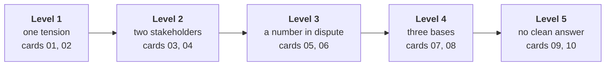

# Build 1 GD prompts: the TRAINER set

**TRAINER ONLY.** The STUDENT cards sit beside this file, one per prompt, and a card is handed out
only when its round opens. This file carries what the cards leave out: the level, the sub-problem a
prompt overlaps, where every exhibit number comes from, and the arithmetic a strong group reaches.
How to run a round is in `C2_W03_D05_gd_facilitation_TRAINER.md`; which group gets which prompt is in
`C2_W03_D05_gd_roster_TRAINER.xlsx`.

The GD is a thread separate from the mini project. It is about Kalpa Health's problem space, and it is
unprepared by design: no group sees its card before the round opens, and nothing on a card needs the
group's build.

## The ladder

| Level | What makes it harder than the one before |
|---|---|
| 1 | One decision, one trade-off, and every number on the card agrees with every other. |
| 2 | Two stakeholders want different things, and their numbers are consistent, so the argument is about weight. |
| 3 | One number on the card is a claim or a comparison whose fairness is the real question. |
| 4 | Three stakeholders send numbers on different bases (revenue against margin, a year against a quarter, a survey against a count), and the group has to put them on one footing before it can choose. |
| 5 | Three stakeholders, numbers that conflict, a cost that is not money, and no position that wins on every count; the group is judged on how it chooses, since no choice is clean. |

## The overlap rule

A group never discusses a prompt that sits on its own sub-problem, because it has spent the week inside
that data and would be arguing from the answer. The roster workbook flags a clash from the Monday
allocation; swap the prompt with the other card at the same level, or with the spare, card 08.

| Card | Title | Level | Overlaps sub-problem |
|---|---|---|---|
| 01 | The festive price | 1 | none |
| 02 | The printed report | 1 | none |
| 03 | Same-day reports in every city | 2 | none |
| 04 | Closing the phone line | 2 | none |
| 05 | Free home collection everywhere | 3 | 5 campaign |
| 06 | The no-show league table | 3 | 4 no-shows |
| 07 | Pricing a corporate health-check contract | 4 | 1 revenue and 3 billing |
| 08 | Where the next Rs 2 crore goes | 4 | none (the spare) |
| 09 | The insurer's cashless tie-up | 5 | none |
| 10 | The sample mix-up | 5 | none |

## What the exhibits take from the data pack, and what they leave

Every number a card attributes to Kalpa Health's files was computed from `content/W03/D1/data/` on
29 September 2026, and none gives a sub-problem's find away.

| Number on a card | How it was computed | Why it is safe |
|---|---|---|
| List prices: Full body Rs 2,999, Diabetes care Rs 1,499, Senior citizen Rs 3,499, Corporate health check Rs 1,500, CBC Rs 350, Lipid Rs 600, HbA1c Rs 450, Vitamin D Rs 1,200 | `test_catalogue`, `list_price` | A price list is what every learner reads first on Monday. |
| 1,685 Full body checkups booked, April to September | `booking_tests`, rows with `line == package` and `package_code == PKG-FB` | A package count says nothing about the one-line billing or the contract. |
| 6,700 patients, 1,699 aged 60 and over (25.4 percent) | `patients`, row count and `age_band == 60+` | The patient register carries no plant. |
| Patients by city: Delhi 1,500, Bengaluru 1,250, Mumbai 1,200, Chennai 1,000, Pune 950, Hyderabad 800 | `patients`, count by `city` | A register count has no quarter in it, so it cannot show the two cities' fall. |
| Channel mix: walk-in 45, app 27, phone 15, home collection 13 percent | Both booking exports, the old one de-duplicated on `booking_id`, the new system's channel codes mapped (`CALL` to phone, `HOMEVISIT` to home collection), the one corporate booking left out, shares over the rows where the channel is recorded, rounded to whole percents | Rounded shares over the half year hide the re-export, the switch date and the corporate booking. |

Left off every card on purpose: any quarter-on-quarter count, any city split by quarter, any mean or
median invoice, any clinic's visit count or no-show rate, any payment or collection figure, the
campaign's cities and any count of the corporate contract. The illustrative league table on card 06 is
invented and says so; its numbers match no Kalpa clinic.

## The prompts, one by one

Each block gives the tension, the arithmetic from the card's own numbers, and the positions a group can
defend. The facilitation notes carry the running and the panel's questions.

### Card 01: the festive price (level 1)

**Tension.** Volume at a lower price against margin on the checkups Kalpa would have sold anyway.

| Line | Arithmetic | Result |
|---|---|---|
| A normal month's Full body checkups | 1,685 divided by 6 | about 281 |
| Margin per checkup at Rs 2,999 | 2,999 minus 1,300 | Rs 1,699 |
| Margin per checkup at Rs 2,499 | 2,499 minus 1,300 | Rs 1,199 |
| Month's margin at Rs 2,999 | 281 times 1,699 | about Rs 4.77 lakh |
| Month's margin at Rs 2,499 with 40 percent more checkups | 393 times 1,199 | about Rs 4.71 lakh |
| The lift that breaks even | 1,699 divided by 1,199, minus 1 | 41.7 percent |

**The one number.** The break-even lift is 41.7 percent and the marketing head expects 40, so the cut
loses about Rs 6,000 in the month on the card's own assumptions. The position turns on whether the
festive buyers are new patients who come back (the marketing head's line) or this year's buyers
arriving a month early.

### Card 02: the printed report (level 1)

**Tension.** A certain saving against a loss concentrated in the oldest patients.

| Line | Arithmetic | Result |
|---|---|---|
| Saving from stopping print | 24,000 times Rs 18 | Rs 4.32 lakh a year |
| Patients at risk | 1,699 times 30 percent times one in ten | about 51 |
| Revenue at risk | 51 times Rs 3,000 | about Rs 1.53 lakh a year |

**The one number.** Stopping print saves roughly three times what it puts at risk on these
assumptions. The strong position keeps the saving and removes the risk: digital by default and
print on request, which a group reaches by asking who the 30 percent are.

### Card 03: same-day reports in every city (level 2)

**Tension.** The marketing head wants one national promise; the operations head says two labs cannot
keep it.

| City | Today | After a 15 percent lift | Against 70 |
|---|---|---|---|
| Bengaluru | 64 | 73.6 | over by 3.6 |
| Mumbai | 60 | 69.0 | at 99 percent |
| Delhi | 52 | 59.8 | room |
| Chennai | 45 | 51.8 | room |
| Hyderabad | 41 | 47.2 | room |
| Pune | 38 | 43.7 | room |

**The one number.** Only Bengaluru breaks the ceiling; Mumbai sits at 69 of 70, so the operations
head's "two labs" is one lab over and one with no margin for a bad day. A second shift in both costs
Rs 6.4 lakh a month. Defensible positions: promise it in four cities now and in the other two after
the shift; promise it everywhere with a cut-off for samples that reach the lab late; or buy one shift
in Bengaluru and watch Mumbai.

### Card 04: closing the phone line (level 2)

**Tension.** A fixed saving against bookings that may leave with the older patients.

| Line | Arithmetic | Result |
|---|---|---|
| Phone bookings a year | 23,000 times 15 percent | 3,450 |
| Share that may leave Kalpa | 1 minus one half minus one third | one sixth |
| Bookings at risk | 3,450 divided by 6 | 575 |
| Revenue at risk | 575 times Rs 1,500 | Rs 8.63 lakh a year |
| Saving | the card | Rs 6.5 lakh a year |
| The leaving share that breaks even | 6.5 lakh divided by (3,450 times 1,500) | 12.6 percent |

**The one number.** Closing the line pays only if fewer than 12.6 percent of phone bookers leave, and
the marketing head's estimate is 16.7. A group that notices the estimate comes from "a sample of
calls" and asks how many has found the weak joint. The 25.4 percent of patients aged 60 and over is
context, and a group that treats it as the share of phone bookers has mixed two bases.

### Card 05: free home collection everywhere (level 3)

**Tension.** The whole case rests on the marketing head's 9 percent, and the finance head has already
asked the right question: against what comparison.

| Line | Arithmetic | Result |
|---|---|---|
| Home visits today | 23,000 times 13 percent | 2,990 |
| Fee given up on them | 2,990 times Rs 150 | Rs 4.49 lakh |
| New home visits once free | 23,000 times (25 minus 13) percent | 2,760 |
| Their cost | 2,760 times Rs 220 | Rs 6.07 lakh |
| Total cost a year | the two added | Rs 10.56 lakh |
| Margin on one extra booking | Rs 1,500 times 40 percent | Rs 600 |
| Extra bookings that break even | 10.56 lakh divided by 600 | 1,760, which is 7.6 percent |
| At the claimed 9 percent | 2,070 times 600 | Rs 12.42 lakh, a net gain of Rs 1.86 lakh |
| At half the claimed lift | 1,035 times 600 | Rs 6.21 lakh, a net loss of Rs 4.35 lakh |

**The one number.** The break-even lift is 7.6 percent against a claim of 9, so a claim that is even
modestly overstated turns the offer into a loss. The strongest groups say they would not roll it out
until the 9 percent is compared with cities that did not get the offer, and name what else was moving
at the time; that is the Week 1 fair comparison, reached without the data. The card gives no answer
on whether the 9 percent holds, and the facilitator does not either.

### Card 06: the no-show league table (level 3)

**Tension.** A ranking that shames the smallest clinics, whose rates move the most by chance.

| Clinic | Visits | Rate | What one more or one fewer no-show does |
|---|---|---|---|
| A | 900 | 7.1 percent | moves it by 0.1 points |
| E | 120 | 13.3 percent | moves it by 0.8 points |
| F | 30 | 16.7 percent | moves it by 3.3 points |

**The one number.** Clinic F's 16.7 percent is 5 people; one fewer no-show puts it at 13.3, level with
E. Strong groups propose publishing with the base beside every rate, a band or a minimum number of
visits before a clinic is ranked, and a trend over three months in place of one month's order. A
group that asks whether every clinic counts a visit the same way has asked the deepest question on
the card; acknowledge it and do not expand on it, since sub-problem 4's groups are working it.

### Card 07: pricing a corporate health-check contract (level 4)

**Tension.** Three stakeholders, three bases: the marketing head counts revenue, the finance head
counts margin and cash, the operations head counts capacity.

| Line | Arithmetic | Result |
|---|---|---|
| Margin at the client's Rs 1,100 | 2,000 times (1,100 minus 780) | Rs 6.4 lakh |
| Margin at list, Rs 1,500 | 2,000 times (1,500 minus 780) | Rs 14.4 lakh |
| Cost of waiting 90 days for Rs 22 lakh | 22 lakh times 12 percent times 90 of 365 | about Rs 65,000 |
| The families, as the marketing head counts them | 300 times Rs 2,999 | Rs 9.0 lakh of revenue |
| The families, counted as margin | 300 times (2,999 minus 1,300) | Rs 5.1 lakh |
| Days the lab needs on one shift | 2,000 divided by 90 | 23 working days against the client's 10 |

**The one number.** The marketing head's Rs 9 lakh is revenue and the finance head's figures are
margin; on one footing the families add Rs 5.1 lakh, and that only if 300 of them buy. A strong
counter-offer names a price between Rs 1,100 and Rs 1,500, payment in 30 days or an advance, and a
window of about 23 working days (or the client pays toward a second shift). A group that accepts
Rs 1,100 because of the families has added revenue to margin.

### Card 08: where the next Rs 2 crore goes (level 4, the spare)

**Tension.** Three plans, three kinds of number: patients in year one, rupees a year from a survey, and
a percentage lift.

| Plan | The number sent | On one footing, revenue in year one | What the number rests on |
|---|---|---|---|
| Seventh city | 900 patients | 900 times Rs 3,000 is Rs 27 lakh | an estimate for a city Kalpa has never run |
| Second Bengaluru lab | Rs 60 lakh a year | Rs 60 lakh, if the survey holds | 200 patients asked why they left |
| Home-collection fleet | 12 percent | 12 percent of 23,000 times Rs 1,500 is Rs 41.4 lakh | the same kind of claim as a campaign lift |

**The one number.** Put on one footing, the largest number rests on the weakest evidence. Strong groups
say which number they would test first and how, and several back the plan whose number can be checked
fastest. A group that notices Delhi leads the register (1,500 of 6,700) while the operations head calls
Bengaluru the biggest booking city, and asks which count the plan should be sized on, is reading the
exhibit closely: both can be true, since a patient on the register and a booking are different counts.

### Card 09: the insurer's cashless tie-up (level 5)

**Tension.** Two volume claims on either side of break-even, cannibalised existing patients, working
capital, and a data request that changes next year's negotiation.

Take today's list-price revenue as 1.

| Line | Arithmetic | Result |
|---|---|---|
| Margin lost on existing policyholders | 0.20 of revenue times the 25 point discount | 0.05 |
| Margin on each unit of new volume at 25 percent off | 0.75 minus 0.60 | 0.15 |
| New volume that breaks even | 0.05 divided by 0.15 | 33 percent |
| At the insurer's 40 percent | 0.40 times 0.15 minus 0.05 | plus 0.010 |
| At the marketing head's 20 percent | 0.20 times 0.15 minus 0.05 | minus 0.020 |
| Cost of waiting 60 days at 40 percent volume | (0.20 plus 0.40) times 0.75 times 12 percent times 60 of 365 | about 0.009 |

**The one number.** Break-even sits at 33 percent more volume; the insurer's 40 clears it by a margin
the payment delay almost wipes out, and the marketing head's 20 loses. Neither party's number is
evidence, so no position wins cleanly: a group can sign with a volume floor and a review at six
months, counter at a smaller discount, refuse the clinic-level data or share it only in aggregate,
or walk. Judge how the group chooses, since the card has no right answer. A group that asks "40 percent of what" has
found the ambiguity on purpose: of the insurer's members' business or of all Kalpa's volume.

### Card 10: the sample mix-up (level 5)

**Tension.** A rare harm to a patient against a daily cost to every patient, on an error rate built
from two events.

| Line | Arithmetic | Result |
|---|---|---|
| Mislabels a year at today's rate | 30,000 times 2 of 40,000 | 1.5 |
| With the second check | 30,000 divided by 200,000 | 0.15 |
| Errors avoided a year | 1.5 minus 0.15 | 1.35 |
| Cost of the check | 30,000 times Rs 9 | Rs 2.7 lakh a year |
| Cost per error avoided | 2.7 lakh divided by 1.35 | about Rs 2 lakh |
| Pausing home collection for a month in the city | 600 times 13 percent times Rs 1,500 | about Rs 1.17 lakh of bookings |

**The one number.** Rs 2 lakh per wrong diagnosis avoided, and the group has to say whether that is
cheap, which is Monday's interview question in the room: what changes when the cost of an error is a
missed diagnosis. Two events in 40,000 is too few to know the rate, which could be several times
higher or lower; a strong group says so. Defensible positions include the second check on home
collection only (the channel where the error happened), the check everywhere with the same-day
promise narrowed, or a fix at the point of labelling in place of a check downstream. Pausing home
collection alone treats the news story and leaves the error rate where it was, and groups that say
that out loud have separated the two problems.
