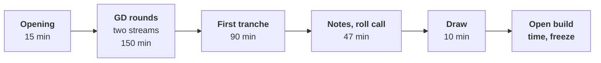

# Day sheet: Week 3, Friday. Expert day one

**TRAINER ONLY.** Nothing on this page reaches a learner.

Posts to <!-- sync:module:W03/D5 -->Module 1: Foundations of AI and Data<!-- /sync:module:W03/D5 -->, on <!-- sync:day-date:W03/D5 -->Fri 23 Oct 2026<!-- /sync:day-date:W03/D5 -->.

| | |
|---|---|
| **Start from** | Dr Menon's question is four days old: test volumes grew 5 percent against a plan of 18, and she does not know which branch is short. Every group has a claim from Wednesday and a mock from Thursday. |
| **Go as far as** | Every group through its GD or rostered for Saturday morning, a first tranche presented, every build cold-run twice and logged, the builds frozen. |
| **Stop before** | Any teaching. Build weeks teach nothing new, and a trainer who answers a group's analysis question today has done its work for it. |
| **Comes later** | Saturday: the remaining GDs, the other presentations before the expert and the senior industry leader, grade closure, and one improvement per group for Build 2. |
| **Cut first** | The slack at the end of block two. Never a GD round, never the second cold run. |

## Who is in the room

| Role | Today |
|---|---|
| The industry expert | Arrives for two days. Opens block one, chairs the in-room GD stream, then chairs the first tranche of presentations. |
| The Principal Advisor | Online. Chairs the second GD stream in block one and one Saturday round. |
| The trainer | Keeps time in the GD room, runs the first tranche, runs the roll call and the freeze. |
| The Academic TA | Hosts the online GD room, collects both streams' notes, records the freeze hashes. |
| The Programme Head | Draws the GD order at the opening and Saturday's presentation order at the close. |

Nine groups of four from 35 learners is the Programme Head's stated plan (`data/programme/facts.yaml`,
cohort, status stated); the tracker's build anatomy plans fifteen. If the Programme Head runs more
groups, the roster stretches as the last section says.

## The day, in durations

### Block one, 180 minutes

| Minutes into the block | What runs | Who leads | Groups not in a GD |
|---|---|---|---|
| 0 to 15 | The expert's opening to the whole cohort; the Programme Head draws the GD order | The industry expert, the Programme Head | All present |
| 15 to 45 | Round 1: stream A card 01, stream B card 02 | The expert; the Principal Advisor online | Cold run one |
| 45 to 75 | Round 2: stream A card 03, stream B card 04 | The expert; the Principal Advisor online | Cold run one, then fixes |
| 75 to 105 | Round 3: stream A card 05 | The expert | Fixes and logs |
| 105 to 135 | Round 4: stream A card 06 | The expert | Fixes and logs |
| 135 to 165 | Round 5: stream A card 07 | The expert | Fixes and logs |
| 165 to 180 | The expert writes up the morning's notes | The industry expert | Build |

The slot-by-slot roster, with the group each slot draws and the clash check, is
`gd/C2_W03_D05_gd_roster_TRAINER.xlsx`. The cards, the numbers behind them and the chair's notes are in
`gd/`.

**The opening, in words to say (the Programme Head, then the expert).**

> "Today is the first of two expert days. The GDs run in two rooms, one with the industry expert here and
> one with the Principal Advisor online, thirty minutes a group. You will not know the question until the
> card is turned over, and it is about Kalpa Health's business, separate from your project. While your
> group is not in a GD, you run your demo cold, in a new Codespace, from the raw files, and log it; the
> checklist is in `checkpoints/`. After lunch, a first tranche presents. The builds freeze when the open
> build time closes tonight."

Then the Programme Head draws the GD order: nine chits, one per group, drawn one by one; the first chit
drawn takes slot 1. Type the positions into the roster's Inputs sheet and read the Check sheet aloud to
yourself: if it shows a clash, swap the card on the Roster sheet with the other card of its level, or
with card 08, before round 1 starts.

### Block two, 180 minutes

| Minutes into the block | What runs | Who leads |
|---|---|---|
| 0 to 90 | The first tranche: three presentations of 30 minutes | The industry expert chairs; the trainer keeps time |
| 90 to 110 | GD notes consolidated from both streams; groups not presenting run cold run one if they have not | The expert, the Principal Advisor online, the trainer |
| 110 to 137 | Cold-run roll call: every group reads its run-one log line in three minutes | The trainer |
| 137 to 147 | Saturday's presentation order drawn | The Programme Head |
| 147 to 180 | Saturday handover and slack | The trainer, the Academic TA |

After block two the time is open build time with the TAs. Each group runs cold run two as its last act
before the freeze. No practice set, no Kahoot, no test.

## The expert's brief

Hand this section to the industry expert on arrival; it takes about ten minutes to read.

**The scenario.** Kalpa Health runs diagnostic laboratories and walk-in clinics in six Indian cities.
Its COO, Dr Priya Menon, asked why test volumes grew 5 percent against a plan of 18, and which branch of
her business is short. The cohort sits in Kalpa's Global Capability Centre as trainee engineers; Dr
Menon is their internal client for the week. Everything about Kalpa is fictional and every number is
synthetic, generated by `data/generate_kalpa_health.py`.

**The five sub-problems**, each Week 1 and 2's method in a domain the room has never seen: 1 revenue,
the revenue tree for a diagnostics business; 2 bookings, which fell in two cities in Q2; 3 billing,
invoices and collections that disagree; 4 no-shows, one clinic's rate, real or noise; 5 campaign, a
free home-collection offer that "lifted bookings 9 percent".

**The week so far.** Monday, the groups scoped their sub-problem in their own words. Wednesday, they
profiled, cleaned and reconciled, and stated a headline claim with its denominators and caveat.
Thursday, each learner sat Mock R1. Today they freeze.

**What each group ships**, described the same way in every pack: a presentation slot of 25 to 30
minutes with a live demo run cold on its own Kalpa Health files and the panel's questions; the one
slide Dr Menon carries into her board meeting (claim, evidence, caveat, action); the notebook or SQL
that reproduces every number from the raw files, top to bottom; the decisions log in the Week 1
Wednesday shape; and the challenges log.

**Your two jobs today.** Chair the in-room GD stream on the cards in `gd/`, following
`gd/C2_W03_D05_gd_facilitation_TRAINER.md`, and chair the first tranche of presentations.

**What is planted in the data, so your questions land.** Never say any of this to a learner; the room
finds each one by profiling, reconciling, splitting and asking what the denominator was. The numbers are
the generator's witness (`python3 data/generate_kalpa_health.py --witness`, run 29 September 2026) and
the approved spine, `docs/detailing/W03_build1_spine.md`.

| Sub-problem | The plant | The numbers | The question that tests whether a group found it |
|---|---|---|---|
| All | Dr Menon's 5 percent counts retail tests booked in the old system only, a package counted as its component tests | 5.1 percent on that count; 7.8 percent in tests booked across both systems, 8.6 percent in tests performed, 5.6 percent in bookings, all without the corporate contract; every reading short of 18 | "Five percent of what, counted where?" |
| 1 Revenue | One corporate health-check contract in Q2, and packages billed as one line | Rs 18,00,000, 16.2 percent of Q2 revenue; Q2 mean invoice Rs 1,904 with it and Rs 1,596 without, median Rs 1,499; 48,235 tests performed behind 22,152 invoice lines | "What happens to your average if you take out the largest invoice?" |
| 2 Bookings | Chennai and Pune moved to the new booking system on 18 September, and the old export carries only its own bookings; the old export repeats 180 rows | The two cities fall 23.0 percent in the old export and 12.2 percent in truth | "Which systems did you count, and did the fall start on one date?" |
| 3 Billing | The payment feed keys invoices as bare digits or INV-numbers; gateway retries double-post; the corporate invoice is unpaid | An exact join matches 2.2 percent of payments, and every payment matches once normalised; 229 double posts; 102 refunds; 398 unpaid invoices | "What share matched before you normalised the key?" |
| 4 No-shows | One small clinic runs by appointment; the others' visit counts include walk-ins | 19.2 percent against 8.7 on all visits; 20.0 percent (10 of 50) against 15.2 on scheduled visits, a gap chance produces with probability 0.22 | "Is every clinic's denominator the same kind of visit, and how many visits is that clinic's rate?" |
| 5 Campaign | The offer ran in three cities already rising, and reached patients who had begun to drift | Offered patients book 9.0 percent more overall and less inside every campaign city (Bengaluru minus 10.8, Hyderabad minus 19.9, Mumbai minus 13.0 percent); the campaign cities rose 6.9 percent in the two months before the offer | "What did the cities without the offer do over the same weeks?" |

When a group has missed its plant, ask it the question; its answer, its caveat and its log say how
far it got; the mini project rubric's criteria for the data and the analysis are where that shows.

## The first tranche of presentations

**Who.** Whole sub-problem clusters, so the panel hears the groups on one question back to back. At
the opening, after the GD draw, the Programme Head draws sub-problem chits until the tranche holds three
presentations; a cluster that would take it past three is put back, and the tranche runs short rather
than splitting a cluster. Change the tranche count on the roster's "Friday block two" sheet and its
ends recompute.

**Running order and timing.** Each presentation follows the Saturday format in
`content/W03/SAT/slides/C2_W03_SAT_presentation_format_STUDENT.md`, inside a 30-minute slot. The trainer
shows cards at 5 minutes and 1 minute left of the talk and demo, and at the end of the slot. The demo
runs cold on the group's own files: a kernel restarted in front of the panel, the notebook run from the
top. A demo that fails live gets two minutes to recover; after that the group presents from its
executed run and the failure goes in the panel's notes and the group's challenges log.

**What the panel keeps.** Evidence notes per learner, with the minute: what was claimed, which number,
how the caveat was defended, who answered. Silent teammates are asked a question by name, as the
Saturday row requires. The panel scores each group against the mini project rubric (in Scoring, below) after
the slot, never in front of the group.

## Scoring

The requester approved Build 1's three rubrics on 29 September 2026 (`data/programme/facts.yaml`,
evaluation.rubrics.W03), and learners may see them. The marks per event are the mini project 40 including
the presentation, the mock 30 and the GD 30. Today scores two of them.

**The GD**, each learner alone, on the chair's evidence notes, in
`rubrics/C2_W03_D05_gd_scoring_sheet_TRAINER.xlsx`:

<!-- sync:rubric:W03/gd -->
**Group discussion, 30 marks.** Each learner is scored alone.

| Criterion | Marks | What full marks look like |
|---|---|---|
| Structures the problem | 8 | The learner frames the decision and the metric before arguing. |
| Uses evidence | 8 | The learner takes a position and defends it with a number from the exhibit. |
| Engages | 8 | The learner builds on or challenges another member's point and brings a quiet member in. |
| Lands a conclusion | 6 | The discussion ends on a recommendation and its main risk. |
<!-- /sync:rubric:W03/gd -->

**The mini project**, for the first tranche's groups: the first four criteria once for the group, and
presentation and defence for each learner:

<!-- sync:rubric:W03/mini-project -->
**Mini project, 40 marks.** The first four criteria are scored once for the group, and every member receives those 34 marks; presentation and defence is scored for each learner on 6 marks, so a silent teammate cannot ride the group's score.

| Criterion | Marks | What full marks look like |
|---|---|---|
| The question translated | 8 | Dr Menon's words are mapped to the right Weeks 1 and 2 method, with the metric defined and the decision it feeds named. |
| The data made trustworthy | 10 | The data is profiled before it is touched, every cleaning call is in the decisions log with its reason, and counts and rupees reconcile across files. |
| The analysis | 10 | The tree, ladder or fair comparison reaches the branch that explains the symptom, on the right denominator, with a chance test where one is needed. |
| The claim | 6 | One sentence carries its number, denominator, period and caveat, plus an action Dr Menon can take. |
| Presentation and defence | 6 | The live demo runs cold, and every member answers a challenge on the caveat. |
<!-- /sync:rubric:W03/mini-project -->

The Principal Advisor's and the expert's GD scores are in the sheet before the close of block two, so
the Programme Head can read the Summary sheet before Saturday; every Build 1 grade closes on Saturday.

## The freeze

**The rule.** The builds freeze when the open build time closes. The last commit each group pushed
before that moment is the commit it demos on Saturday. After the freeze, slide wording may change and
no number may; an error found after the freeze is stated on Saturday as a caveat, with the right number,
and logged.

**How it is checked.**

1. At the close of block two, the trainer says the freeze rule aloud, in the words above.
2. When the open build time closes, the Academic TA takes each group's latest commit hash on its
   default branch and writes it, with the time the TA recorded it as minutes after the close, into the
   freeze table below.
3. The group's second cold-run line must be in its checklist log by then; a group with no second run
   logged has its demo run from the frozen commit by the TA first thing on Saturday, before the
   presentations start.
4. On Saturday, before each presentation, the TA checks the Codespace is on the frozen hash
   (`git rev-parse HEAD`). A later commit that changes code or a number is shown to the panel, and the
   panel decides whether the group presents from the frozen hash.

| Group | Frozen commit hash | Cold run one logged | Cold run two logged | TA's note |
|---|---|---|---|---|
| G1 | | | | |
| G2 | | | | |
| G3 | | | | |
| G4 | | | | |
| G5 | | | | |
| G6 | | | | |
| G7 | | | | |
| G8 | | | | |
| G9 | | | | |

## Drawing Saturday's presentation order, 10 minutes

1. Take out the groups that presented in the first tranche.
2. Write one chit per remaining sub-problem cluster. Draw them: the order drawn is the order of the
   clusters on Saturday, so the panel hears each sub-problem's groups back to back.
3. Inside each cluster, draw the groups' order.
4. Read the whole order aloud once, write it on the board, and send it to the Saturday session's
   closure run sheet. The two groups in Saturday's GD rounds (slots 8 and 9) present no earlier than
   the third slot, so their GD and their setup do not collide.

## When the day goes wrong

| What goes wrong | What to do |
|---|---|
| The expert arrives late | The Principal Advisor takes rounds 1 and 2 online in stream B as planned; the trainer opens stream A's round 1 with card 01 and the expert takes over from round 2. Move the unplayed stream A round to stream B's free slots (the roster sheet shows stream B's rounds 3 to 5 are open). |
| The Principal Advisor's connection fails | The Academic TA pauses the clock; past five minutes, the round moves to stream A after round 5 and runs in the expert's write-up slot. |
| A group is one learner short | The GD runs with three, and the chair notes it; the absent learner's GD is the Programme Head's decision. |
| A group's GD slot clashes with its own sub-problem | Swap the card within its level on the roster, or use card 08. Never hand a group the card on its own sub-problem. |
| A group's cold run fails and it cannot find why | The TA sits with it for ten minutes on the checklist's table of usual breaks. If it still fails, the group logs it, and on Saturday presents from its executed run with the failure stated. |
| A group asks to keep building after the freeze | The rule holds for every group; a fix after the freeze becomes a caveat on Saturday. |
| The tranche overruns | Cut from the slack at the end of block two, never from the roll call. |
| The tranche group's live demo fails | Two minutes to recover, then the executed run. |

## If the Programme Head runs more groups

At 30 minutes a group, fifteen groups need 450 minutes of GD. The roster workbook's Check sheet names
the stretch for any count: up to twelve groups, stream B runs rounds 3 to 5 in Friday block one; up to
sixteen, both streams also run up to three Saturday rounds each, which moves Saturday's presentations
back by up to 60 minutes; past sixteen, a third chair is needed. With more than ten groups, cards are
reused across half-days, never within one. Change the group count on the Inputs sheet and add the
groups' rows below the ninth.

## Interview angle

**[F]** Take a position in a group discussion and defend it with one number.

**A strong answer, in the trainee's voice.** "In our GD, Dr Menon's marketing head wanted free home
collection in all six cities on the strength of a 9 percent lift. I took the position that we should not
roll it out yet, and I defended it with one number: on the card's own costs the offer breaks even at a
7.6 percent lift. So the whole case rests on whether the 9 percent is real, and a claim overstated by
even a fifth turns a gain into a loss. I said what would change my mind: if the lift held against the
cities that did not get the offer over the same weeks, I would back the rollout. The number did the
arguing for me, and nobody could dismiss it as an opinion."

What makes it strong: a position stated first, one number with where it came from, the condition that
would change the speaker's mind, and no second or third number competing for attention.
