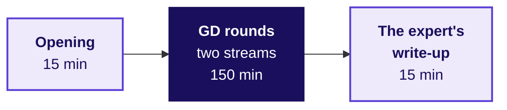
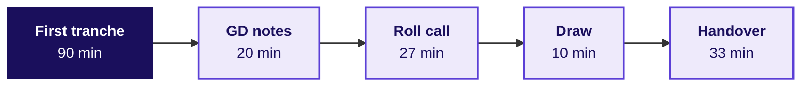

# Day sheet, Build 1 Friday: will each group's numbers hold when someone argues with them, and when someone else runs them?

**TRAINER ONLY.** Nothing on this page reaches a learner. It names every plant, a problem built into
the Kalpa Health data for a group to find, with its witness number, the count the data generator
prints to prove the plant is there, and a learner who reads it has lost the week.

Posts to <!-- sync:module:W03/D5 -->Module 1: Foundations of AI and Data<!-- /sync:module:W03/D5 -->, on <!-- sync:day-date:W03/D5 -->Fri 23 Oct 2026<!-- /sync:day-date:W03/D5 -->.

<!-- sync:faculty-day:W03/D5 -->
No IITGN faculty block on this day.
<!-- /sync:faculty-day:W03/D5 -->

Expert day one of Build 1, as the approved spine (`docs/detailing/W03_build1_spine.md`) and the
Friday row give it: GD rounds at about 30 minutes a group on prompts that climb in complexity, a
thread separate from the projects; a first tranche of presentations; two cold demo runs per group;
and the build freeze. Nothing is taught today, and there is no Kahoot, practice set or test.

## Which questions does the room climb on Friday, in the order you ask them?

The day's question, in Dr Menon's words: **"Before I take any of this to the board, will your
numbers hold when someone argues with them, and when someone else runs them?"** Her week-long
question stands behind it: her dashboard shows test volumes up 5 percent from Q2 to Q3 against a
plan of 18, and she wants to know which branch of Kalpa Health is short. Ask each part's question
before its answer is shown or heard.

| Part | Its question | The smaller questions, in the order the part takes them | What the room should reach |
|---|---|---|---|
| 1. The opening, 15 minutes | How does Friday run, and who chairs which room? | Who chairs each GD stream? How is the GD order drawn? What does a group do while it is out of its GD? When do the builds freeze? | Each group knows its GD slot, its room and its chair, runs its demo cold while out of its GD, and knows the builds freeze when the open build time closes |
| 2. The GD rounds, seven today and two on Saturday | Can a group take a position on a Kalpa Health decision it has never seen, and hold it with one number from the exhibit? | What does the card decide, and on which metric? Which number carries the position? What would change the group's mind? What does the chair ask? | One position, one number from the card with where it came from, and the fact that would change the group's mind, said aloud by named learners |
| 3. Cold run one and the roll call | Does every number on a group's slide come out of the raw files when a fresh machine runs its code? | Do the ten raw files match the export? Does the notebook run top to bottom in a fresh kernel? Is every slide number printed? How long does the run take? | A logged line for every group: minutes, slide numbers reproduced out of the total, what broke and the fix |
| 4. The first tranche of presentations | Does a group's one-slide answer survive the panel's challenge on its caveat? | What did the group find? How sure is it? What would change its mind? What should Dr Menon do on Monday? | Up to three groups' claims heard with their number, denominator, period and caveat, and every presenting learner asked a challenge |
| 5. Run two, the freeze and the draw | Which commit does each group stand behind on Saturday, and what may still change after it? | Is run two logged and pushed? Which commit did the TA's sweep record? Does run two still count against it? In which order does Saturday run? | A frozen commit for every group, run two counted or a Saturday rerun named, and Saturday's order on the board |

**What the room hears at the close, in answer to the day's question.** Dr Menon gets no new number
today, and none is due: every group has argued one Kalpa Health decision with one number in front of
a chair, the first tranche has defended its caveats, every group has a logged cold run, and the
builds freeze tonight at recorded hashes, so that what the panel sees on Saturday is what a stranger
would get from the raw files.

## What does Friday start from, and where does it stop?

| | |
|---|---|
| **Start from** | Dr Menon's question is four days old, and the five questions her heads asked on Monday are in each group's brief. Every group stated its headline claim with its denominators and caveat at Wednesday's close, and every learner sat Mock R1 on Thursday, the first mock interview: a technical half on Weeks 1 and 2 and a viva on the group's Kalpa Health work. Thursday's last check watched each notebook run once from a kernel restart. |
| **Go as far as** | Every group has sat its GD or is rostered for Saturday morning, a first tranche of up to three presentations has been heard and scored, every group has read its cold run one aloud at the roll call and logged run two before the freeze, every frozen hash is recorded, and Saturday's order is drawn. |
| **Stop before** | Nobody teaches today, since a trainer who answers a group's analysis question has done its work for it, and nobody confirms or denies a plant, in a GD, a presentation or a corridor. |
| **Comes later** | Saturday brings the remaining two GD rounds, the other presentations before the industry expert and the senior industry leader, grade closure, and one improvement per group named for Build 2. |
| **Cut first** | Cut the slack at the end of block two first; never cut a GD round, the roll call or run two. |

## Who runs what today?

| Role | Today |
|---|---|
| The industry expert | Arrives for two days, opens block one, chairs stream A's five GD rounds in the GD room, enters their scores from the evidence pages, and then chairs the first tranche. |
| The Principal Advisor | Chairs stream B's two Friday rounds and one Saturday round online, from the second room's laptop, and scores them from the evidence pages. |
| The trainer | Keeps time and hands out cards in the GD room, runs the first tranche's clock, the roll call and the freeze rule. |
| The Academic TA | Hosts the online room, keeps its time, types stream B's scores, and records the frozen commits after the open build time. |
| The Support TA | Where the TA roster has them on site, keeps the floor during block one's cold runs and points a stuck group to the checklist's table of usual breaks, fixing nothing for it. |
| The Programme Head | Draws the GD order and the tranche's clusters, the groups on one sub-problem, at the opening, and Saturday's order at the close. |

Nine groups from 35 learners, eight of four and one of three, is the Programme Head's stated plan
(`data/programme/facts.yaml`, cohort, status stated), and Thursday's and Saturday's sheets seat it
the same way; the tracker's build anatomy plans fifteen groups, and the section "What if the
Programme Head runs more than nine groups?" says how the roster stretches.

## How do block one's 180 minutes run?

| Minutes into the block | What runs | Who leads | Groups not in a GD |
|---|---|---|---|
| 0 to 15 | The expert's opening to the whole cohort; the GD order and the tranche's clusters drawn | The industry expert, the Programme Head | All present |
| 15 to 45 | Round 1: stream A card 01, stream B card 02 | The expert; the Principal Advisor online | Cold run one |
| 45 to 75 | Round 2: stream A card 03, stream B card 04 | The expert; the Principal Advisor online | Cold run one, then fixes |
| 75 to 105 | Round 3: stream A card 05 | The expert | Fixes and logs |
| 105 to 135 | Round 4: stream A card 06 | The expert | Fixes and logs |
| 135 to 165 | Round 5: stream A card 07 | The expert | Fixes and logs |
| 165 to 180 | The expert enters stream A's GD scores from the evidence pages | The industry expert | Build |

**The opening, in words to say.** The Programme Head, then the expert:

> "Today is the first of two expert days. The group discussions run in two rooms, one with our
> industry expert here and one with the Principal Advisor online, thirty minutes a group. You will
> not see the question until the card is turned over, and it is about Kalpa Health's business,
> separate from your project. While your group is out of its discussion, you run your demo cold, in
> a new Codespace, from the raw files, and log it; the checklist and the script are in today's
> `checkpoints/` folder. After lunch a first tranche presents. The builds freeze when the open build
> time closes tonight."

Then the Programme Head draws the GD order: nine chits, one per group, drawn one by one, the first
chit drawn taking slot 1. The trainer types the positions into the roster's Inputs sheet and reads
its Check sheet before round 1; a clash is fixed by the swap given under "How do the GD rounds run
today, and which card does each slot carry?".

## How do block two's 180 minutes run?

| Minutes into the block | What runs | Who leads |
|---|---|---|
| 0 to 90 | The first tranche: up to three presentations of 30 minutes | The industry expert chairs; the trainer keeps time |
| 90 to 110 | GD notes consolidated from both streams; a group not presenting that has not done cold run one does it now | The expert, the Principal Advisor online, the trainer |
| 110 to 137 | Cold-run roll call: every group reads its run-one log line, what broke and the fix, in three minutes | The trainer |
| 137 to 147 | Saturday's presentation order drawn | The Programme Head |
| 147 to 180 | Saturday handover and slack | The trainer, the Academic TA |

After block two the time is open build time with the TAs. Each group runs cold run two as its last
act before the freeze. The roster workbook's "Friday block two" sheet recomputes these end minutes
when the tranche's size changes.

## What does the industry expert read on arrival?

Hand this section to the industry expert on arrival; it takes about ten minutes to read.

**The scenario.** Kalpa Health is a US diagnostics and revenue-cycle business: a laboratory and two
patient service centres, where blood is drawn, in each of six US metros (Dallas, Phoenix, New York,
Chicago, Atlanta and Philadelphia), billing commercial plans, Medicare, Medicaid and self-pay
patients in dollars, with its analytics and revenue-cycle work run from Kalpa's Global Capability
Centre in Bengaluru. Its COO, Dr Priya Menon, asked why test volumes grew 5 percent from calendar Q2
to Q3 of 2026 against a plan of 18, and which branch of her business is short. The cohort are
trainee engineers in the GCC's data and AI team, and Dr Menon is their internal client for the
week. Kalpa is fictional, and every record is synthetic, written by `data/generate_kalpa_health.py`
as the export of Friday 16 October 2026.

**The five questions her heads asked**, each the Week 1 and 2 method in a domain the room had never
seen, as the briefs word them:

| # | Who asks | The question, word for word |
|---|---|---|
| 1 | The finance head | "The board will ask me where the plan's growth went. Where does our lab revenue actually come from, and which branch of it is short?" |
| 2 | The patient service centres' operations head | "Bookings fell in two of our metros in Q3. Before I send a field team or cut staff there, I need to know how far they fell, and why." |
| 3 | The finance head | "The claims we billed say one thing and the posting system says another. Which claims are unpaid, how much money is that, and can I trust the figure I report?" |
| 4 | The patient service centres' operations head | "KH-ATL-03, one of our two Atlanta patient service centres, has the worst no-show rate on my Q3 report. I am being asked to add a receptionist there or close it. Is the centre really worse?" |
| 5 | The marketing head | "Our free at-home collection offer lifted bookings 9 percent. I want to offer it to every patient in all six metros. Can you confirm it worked?" |

**The week so far.** On Monday each group scoped its question in its own words and met US healthcare
from the domain dossier. On Wednesday the groups profiled, cleaned and reconciled, and stated a
headline claim with its denominators and caveat. On Thursday every learner sat Mock R1. Today the
builds freeze.

**What each group ships.** Each group ships a presentation slot of 25 to 30 minutes, with a live
demo run cold on its own copy of the files and the panel's questions; the one slide Dr Menon carries
into her board meeting, with its claim, evidence, caveat and action; the notebook or SQL that
reproduces every number on that slide from the raw files, top to bottom; the decisions log in the
Week 1 Wednesday shape; and the challenges log.

**Your two jobs today.** Chair stream A's GD rounds on the cards in `gd/`, following
`gd/C2_W03_D05_gd_facilitation_TRAINER.md`, and chair the first tranche of presentations.

**What is planted in the data, so your questions land.** Never say any of this to a learner; a group
finds each plant by profiling, reconciling, splitting and asking what the denominator was. The
numbers are the generator's witness (`python3 data/generate_kalpa_health.py --witness`, run 1 and 4
October 2026), as the spine and Monday's day sheet give them, with one difference: the retail denial
rate is 10.3 percent here, where both print 10.4, since 1,175 of 11,355 is 10.348 percent, which the
witness prints to four places as 0.1035, and rounding that a second time gives 10.4. Percentages are
changes from Q2 to Q3 unless a row says otherwise.

| Question | The plant | The numbers | The question that tests whether a group found it |
|---|---|---|---|
| The headline, every group | Dr Menon's 5 percent is her dashboard's count: tests booked in the old booking system only, a panel counted as its component tests | 5.1 percent on the dashboard's count (23,213 to 24,406 tests); 7.8 percent in tests booked across both systems, 8.6 percent in tests performed and 5.6 percent in bookings, all without the employer contract, whose 1,200 wellness screenings add 6,000 tests to Q3; every reading is short of 18 | "Five percent of what, counted where?" |
| 1 Revenue | One employer wellness contract in Q3, and panels billed as one claim line | Claim KH-CLM-007802, account EMP-0007, Dallas, $180,000 for 1,200 screenings, 14.6 percent of Q3 billed charges of $1,231,001; the Q3 mean claim is $210.50 with it and $179.75 without, against a median of $150; 22,152 claim lines bill 46,867 tests on the completed bookings behind them (48,235 counting cancelled bookings); 60 billed amounts are text such as "$265.00" | "Which one claim moves your Q3 average most?" Then: "What does one claim line count?" |
| 2 Bookings | Chicago and Philadelphia moved to the new booking system on 18 September, and the old system's export carries only its own bookings; the old export repeats rows from a mid-quarter re-export; the new system writes dates month first | The two metros fall 23.0 percent in the old export (1,415 to 1,090 bookings) and 12.2 percent across both systems (1,415 to 1,243); the old export holds 11,729 rows over 11,549 booking ids, 180 of them twice | "How many rows, and how many distinct booking ids?" Then: "Where are Chicago's bookings after mid-September?" |
| 3 Billing | The posting system keys claims as bare digits or CLM-numbers, duplicate ERA loads (the electronic remittance files a payer sends) double-post, the employer claim is unpaid, and denials post with nothing paid | An exact join matches 216 of 11,343 postings, 1.9 percent, and every posting matches once normalised; 280 double posts worth $19,204.63; 105 reversals; 398 claims with no posting, the employer claim among them; 1,137 denial postings, and the claims file marks 1,175 of the 11,355 retail claims denied, 10.3 percent (Medicaid 14.9, commercial 11.3, Medicare 8.8, self-pay none), billing $230,132; paid net of double posts is $801,314 against $2,201,099 billed | "Show me five `claim_ref` values beside five `claim_id` values." |
| 4 No-shows | KH-ATL-03 runs by appointment while the other centres' visit counts include walk-ins, who cannot miss a slot; the visit register is drawn from the bookings, so a rebooked patient's missed slot is a row beside the kept one | KH-ATL-03: 80 visits, 79 scheduled and 1 walk-in. On all visits 18.8 percent against 7.9 percent for the other eleven centres; on scheduled visits 19.0 percent (15 of 79) against 15.1 percent, a gap chance produces with probability 0.21 | "What is each centre's rate out of?" Then: "Could chance do it on 79 slots?" |
| 5 Campaign | The offer went at random to half the patients in three metros already rising, Dallas, Atlanta and Phoenix, and to a fifth of the patients elsewhere, and inside the three metros an offered patient booked less while the offer ran | Offered patients book 9.0 percent more overall and less in every campaign metro (Dallas minus 10.8, Atlanta minus 19.9, Phoenix minus 13.0 percent); before the offer the two groups booked within about 6 percent of each other; the campaign metros rose 6.9 percent in the two months before the offer; outside them the gaps are chance, New York's plus 23.5 percent among them, a false positive at p of about 0.03 | "Does the lift hold inside Dallas alone?" Then: "What share of each metro's patients got the offer?" |

When a group has missed its plant, ask it the question in the last column; its answer, its caveat
and its decisions log show how far it got, and the mini project rubric's criteria for the data and
the analysis are where that shows.

## How do the GD rounds run today, and which card does each slot carry?

**The thread.** The GD runs on Kalpa Health's business and the US healthcare it sits in, separate
from the projects and unprepared by design. Ten cards climb in five levels, from one trade-off to a
call with several heads and a rule of law or contract; the arithmetic and what full marks look like
on each card are in `gd/C2_W03_D05_gd_prompts_TRAINER.md`, and the running of a round is in
`gd/C2_W03_D05_gd_facilitation_TRAINER.md`.

| Slot | Day and stream | Card | The card's question | Level | Kept from the groups on sub-problem |
|---|---|---|---|---|---|
| 1 | Friday, A | 01 | Should Kalpa cut the self-pay price of its Whole-body wellness panel from $299 to $249? | 1 | none |
| 2 | Friday, B | 02 | Should Kalpa stop mailing paper statements and bill patients by text and email only? | 1 | none |
| 3 | Friday, A | 03 | Should Kalpa promise same-day results in all six metros? | 2 | none |
| 4 | Friday, B | 04 | Should Kalpa close its phone booking line and move every patient online? | 2 | none |
| 5 | Friday, A | 05 | Is a vendor's "30 percent fewer denials" good enough to buy on? | 3 | 3 and 5 |
| 6 | Friday, A | 06 | Should the lab director rank the six labs monthly on turnaround? | 3 | 4 |
| 7 | Friday, A | 07 | Where should the board's $2 million for growth go? | 4 | none |
| 8 | Saturday, A | 09 | What does Dr Menon do in the week the clearinghouse is down? | 5 | 3 |
| 9 | Saturday, B | 10 | Should Kalpa move its Texas Medicaid claim work to Bengaluru? | 5 | 3 |
| The spare | | 08 | Should Kalpa sign a plan's preferred-lab offer in Dallas? | 4 | none |

A sub-problem is one of the five questions above, numbered as in that table. Cards 01 to 04 read for
four minutes and discuss for seventeen, cards 05 to 08 read for five and discuss for sixteen, and
cards 09 and 10 read for six and discuss for fifteen; every round is 30 minutes.

The roster (`gd/C2_W03_D05_gd_roster_TRAINER.xlsx`) flags a group drawn to a card it is kept from,
and the trainer clears every flag before round 1 with three fixes, tried in order:
1. Swap the card with the other card of its level on the Roster sheet, if neither group would then
   sit a card it is kept from.
2. Give the group card 08, the spare, if no other group has it yet.
3. Swap the group's draw position on the Inputs sheet with the nearest group for which both moves
   are allowed, and say the swap aloud.

The third fix always exists: under either of Monday's allocations, every order in which the nine
groups can be drawn ends with no clash. Never hand a group a card it is kept from.

**How the GD is scored.** Each learner is scored alone, from the chair's evidence notes, in
`rubrics/C2_W03_D05_gd_scoring_sheet_TRAINER.xlsx`, on the rubric the requester approved on 29
September 2026:

<!-- sync:rubric:W03/gd -->
**Group discussion, 30 marks.** Each learner is scored alone.

| Criterion | Marks | What full marks look like |
|---|---|---|
| Structures the problem | 8 | The learner frames the decision and the metric before arguing. |
| Uses evidence | 8 | The learner takes a position and defends it with a number from the exhibit. |
| Engages | 8 | The learner builds on or challenges another member's point and brings a quiet member in. |
| Lands a conclusion | 6 | The discussion ends on a recommendation and its main risk. |
<!-- /sync:rubric:W03/gd -->

The expert enters stream A's scores in the write-up at the end of block one; the Principal Advisor
sends stream B's to the Academic TA, who types them; both chairs settle any gap in block two's
GD-notes slot, so the sheet is complete before block two closes and the Programme Head can read its
Summary before Saturday.

## How does the first tranche run, and how is it scored?

**Who.** The tranche takes whole sub-problem clusters, so the panel hears the groups on one question
back to back. At the opening, after the GD draw, the Programme Head draws sub-problem chits until
the tranche holds up to three presentations; a cluster that would take it past three is put back,
and no cluster is split, so the tranche may hold fewer than three.

**Running order and timing.** Each group presents in the Saturday format,
`content/W03/SAT/slides/C2_W03_SAT_presentation_format_STUDENT.md`, inside a 30-minute slot. The
trainer holds up a 5-minute sign and a 1-minute sign before the end of the group's time, and calls
the end of the slot. The demo runs cold on the group's own files, a kernel restarted in front of the panel and the
notebook run from the top.

**A demo that fails in the room.** The spine's rule holds on both expert days. The demo runs once,
cold, on the raw files. If it fails, the group has two minutes to recover it live, as it would in
front of a client. If it still fails, the group presents from its executed notebook, and the panel
scores the live demo, inside presentation and defence, as not run cold. The other 34 marks are
scored from the executed run, so a failed demo costs its own marks and never the analysis.

**What the panel keeps.** The panel keeps evidence notes per learner, with the minute: what was
claimed, with which number, how the caveat was defended and who answered. A silent teammate is asked
a question by name. The panel scores each group after the slot, never in front of it, in Saturday's
mini project scoring sheet, `content/W03/SAT/rubrics/C2_W03_SAT_mini_project_scoring_TRAINER.xlsx`,
on the rubric the requester approved on 29 September 2026:

<!-- sync:rubric:W03/mini-project -->
**Mini project, 40 marks.** The first four criteria are scored once for the group, and every member receives those 34 marks; presentation and defence is scored for each learner on 6 marks, so a silent teammate cannot ride the group's score.

| Criterion | Marks | What full marks look like |
|---|---|---|
| The question translated | 8 | Dr Menon's words are mapped to the right Weeks 1 and 2 method, with the metric defined and the decision it feeds named. |
| The data made trustworthy | 10 | The data is profiled before it is touched, every cleaning call is in the decisions log with its reason, and counts and dollars reconcile across files. |
| The analysis | 10 | The tree, ladder or fair comparison reaches the branch that explains the symptom, on the right denominator, with a chance test where one is needed. |
| The claim | 6 | One sentence carries its number, denominator, period and caveat, plus an action Dr Menon can take. |
| Presentation and defence | 6 | The live demo runs cold, and every member answers a challenge on the caveat. |
<!-- /sync:rubric:W03/mini-project -->

## When does each group run its demo cold, and what does the roll call hear?

**Run one.** Each group runs it whenever it is not in its GD, and a group not finished by the end of
block one runs it in block two's GD-notes slot, after the first tranche. It runs in a new Codespace,
on the ten raw files,
with `checkpoints/C2_W03_D05_cold_run_STUDENT.py`, following
`checkpoints/C2_W03_D05_cold_demo_checklist_STUDENT.md`. The script checks the raw files' checksums,
runs the notebook top to bottom in a fresh kernel, times it and looks for every number on the
group's slide in what the notebook prints. It ends on one line that the group pastes into
`cold_run_log.md` at its repository's root and pushes; the line carries the branch and the commit
the run used, read before the notebook runs.

**The roll call, three minutes a group.** Each group reads its run-one line aloud: the minutes, how
many slide numbers were reproduced, what broke and the fix. Ask one question of each: "Which number
on your slide did the run not reproduce, and which was right, the slide or the code?" A group with
nothing broken is asked how long the demo runs live.

**Run two.** Run two is each group's last act before the freeze, logged and pushed the same way, and
after it a group pushes only its logs: `cold_run_log.md`, the decisions log and the challenges log.

## When do the builds freeze, and how does the TA prove which commit each group demos?

**The rule, said aloud at the close of block two.** "The builds freeze when the open build time
closes. After run two, push only your logs. The commit the TA records for your group at the close is
the commit you demo on Saturday. After the freeze your slide's wording may change and no number may.
An error you find after the freeze is said on Saturday as a caveat, with the right number, and
logged."

**The check.**
1. When the open build time closes, the Academic TA records every group's commit in one sweep, G1 to
   G9: the latest commit on the branch the group's run-two line names, with the minute it was read.
   The commit read in the sweep is the frozen commit, whatever is pushed after it.
2. The TA compares the frozen commit with the commit the run-two line records, in GitHub's compare
   view or with `git diff --stat <run-two commit> <frozen commit>` in any clone. Run two counts when
   the two are the same commit, or differ only in the logs or the slide's wording. It does not count
   when the notebook or SQL, `slide_numbers.txt`, `requirements.txt` or a data file changed between
   them, when the line ends "with uncommitted changes", or when there is no run-two line. A group
   working in SQL types its branch and commit into its line from `git rev-parse --abbrev-ref HEAD`
   and `git rev-parse --short HEAD`.
3. A group whose run two does not count has its demo run cold from the frozen commit by the TA first
   thing on Saturday, before the presentations start.
4. On Saturday, before each presentation, the TA checks the Codespace is on the frozen hash with
   `git rev-parse HEAD`. A later commit that changes code or a number is shown to the panel, which
   decides whether the group presents from the frozen hash.

| Group | Run-two commit, from the group's line | Frozen commit, from the sweep, and its minute | Files changed between them | Cold run one logged | Run two counts | TA's note |
|---|---|---|---|---|---|---|
| G1 | | | | | | |
| G2 | | | | | | |
| G3 | | | | | | |
| G4 | | | | | | |
| G5 | | | | | | |
| G6 | | | | | | |
| G7 | | | | | | |
| G8 | | | | | | |
| G9 | | | | | | |

## How is Saturday's presentation order drawn?

1. Take out the groups that presented in the first tranche.
2. Write one chit per remaining sub-problem cluster and draw them: the order drawn is the order of
   the clusters on Saturday, so each panel hears a sub-problem's groups back to back.
3. Inside each cluster, draw the groups' order.
4. Read the whole order aloud once, write it on the board, and send it to the Saturday closure run
   sheet. The two groups in Saturday's GD rounds, slots 8 and 9, present no earlier than the third
   slot of their room, so their GD and their setup do not collide. A group whose round moved to
   Saturday presents no earlier than the fourth slot of its room, one slot later for each moved
   round ahead of it.

## What do you do when the day goes wrong?

| What goes wrong | What to do |
|---|---|
| The expert arrives late | The Programme Head gives the opening alone, and stream B runs as planned. The trainer holds stream A's first round while its group runs cold run one. Once the expert arrives, stream A picks up at the next slot whose start minute is still ahead, and every round the expert missed runs in stream B's free slots after slot 4, in slot order, chaired by the Principal Advisor. |
| The link to the Principal Advisor drops during a round | The Academic TA pauses the clock. Back within two minutes, the round goes on; if not, the TA restarts the clock, writes the evidence page for the rest of the round and puts the card's two questions, and the Principal Advisor scores from that page. |
| The call fails before a stream B round | The round waits for the call while its group runs cold run one, and runs in stream B's first free slot after slot 4 once the call is back. |
| A group is one learner short | The GD runs with the learners present, and the chair notes it; the absent learner's GD is the Programme Head's decision. |
| A group is drawn to a card it is kept from | Clear it before round 1 with the three fixes under "How do the GD rounds run today, and which card does each slot carry?": the other card of the level, then card 08, then a swap of draw positions. |
| A group's cold run fails and it cannot find why | A TA sits with it for ten minutes on the checklist's table of usual breaks. If it still fails, the group logs it and, on Saturday, presents under the rule for a demo that fails. |
| A group asks to keep building after the freeze | The rule holds for every group; a fix after the freeze becomes a caveat on Saturday. |
| The tranche overruns | Cut from the slack at the end of block two, never from the roll call. |
| A learner asks whether the GD card's numbers are Kalpa's real figures | "Use the card": each row says where its number comes from. |

Stream B has three free slots on Friday after slot 4, starting at minutes 75, 105 and 135 of block
one, and they take every round that could not run in its own slot, in slot order. A round that finds
no free slot, because the call is still down at minute 135 or more than three rounds are waiting,
moves to Saturday morning and runs straight after slot 9, in stream B's room, under the draw rule
for a moved round.

## What if the Programme Head runs more than nine groups?

At 30 minutes a group, fifteen groups need 450 minutes of GD. The roster's Check sheet names the
stretch for any count: up to twelve groups, stream B runs more Friday rounds in block one; up to
sixteen, both streams also run up to three Saturday rounds each, which moves Saturday's presentations
back by up to 60 minutes; past sixteen, a third chair is needed. With more than ten groups, cards are
reused across half-days and never within one. The roster seats nine groups: change the group count
on the Inputs sheet to read the stretch, and seat each extra round by hand in the time the Check
sheet names. The Check sheet also flags a slot no group was drawn to and a draw position outside 1
to 9, which is how a mistyped draw shows.

## How does a trainee answer "take a position and defend it with one number" in one breath?

**[F]** How would you take a position in a group discussion and defend it with one number?

**A strong answer, in a trainee's voice.** "In our GD, the revenue cycle head wanted to buy a
denial-prediction model because a vendor said it cut a lab's denials 30 percent. I took the
position that we should pilot before we buy, and defended it with one number: against labs that did
not buy the model over the same months, the fall was about 19 percent, and the model needed 24 to
cover its price. I said what would change my mind, a three-month pilot with half our claims held
back that fell 24 percent or more."

The answer is strong because it states the position first, gives one number with where it came from
and what it is compared with, names the condition that would change the speaker's mind, and lets no
second number compete for attention.

## Which file serves which moment of the day?

| Moment | File |
|---|---|
| The opening and the draw | This sheet; `gd/C2_W03_D05_gd_roster_TRAINER.xlsx` |
| Each GD round | The card, `gd/C2_W03_D05_gd_card_{nn}_{topic}_STUDENT.md`, handed out face down; the chair's block in `gd/C2_W03_D05_gd_facilitation_TRAINER.md`; the arithmetic in `gd/C2_W03_D05_gd_prompts_TRAINER.md` |
| GD scoring | `rubrics/C2_W03_D05_gd_scoring_sheet_TRAINER.xlsx` |
| Cold runs and the roll call | `checkpoints/C2_W03_D05_cold_demo_checklist_STUDENT.md` and `checkpoints/C2_W03_D05_cold_run_STUDENT.py` |
| The first tranche | `content/W03/SAT/slides/C2_W03_SAT_presentation_format_STUDENT.md` for the format; `content/W03/SAT/rubrics/C2_W03_SAT_mini_project_scoring_TRAINER.xlsx` for the scores |
| The freeze | This sheet's freeze table |
| Saturday's handover | `content/W03/SAT/trainer/C2_W03_SAT_closure_run_sheet_TRAINER.md` |
