# Does your answer to Dr Menon hold in front of a panel?

Week 3, Build 1. The presentation.

Kicker: WEEK 3  ·  BUILD 1  ·  THE PRESENTATION
Quote: My dashboard says test volumes grew 5 percent from Q2 to Q3. The plan the board approved asks for 18. Which branch of my business is short, and what do I do next?
Who: Dr Priya Menon, COO, Kalpa Health, to the data and AI team at Kalpa's Global Capability Centre

```notes
SELF-STUDY from Wednesday's close, when each group receives this deck with its headline claim
pinned; LIVE for 30 seconds at the opening of each expert day. Read Dr Menon's words once. Kalpa
Health and everyone in it are fictional, and every record in its ten files is synthetic. The deck is
the skeleton each group builds its 25 to 30 minutes on, and every slide marked S is shown at the
opening; the D slides are read alone, while the group builds.
Transition: the six questions the deck answers.
```

---

## S1. Six questions turn her ask into your 30 minutes
*Which branch of Kalpa Health is short, and does your answer hold when a panel tests it live on the raw files?*

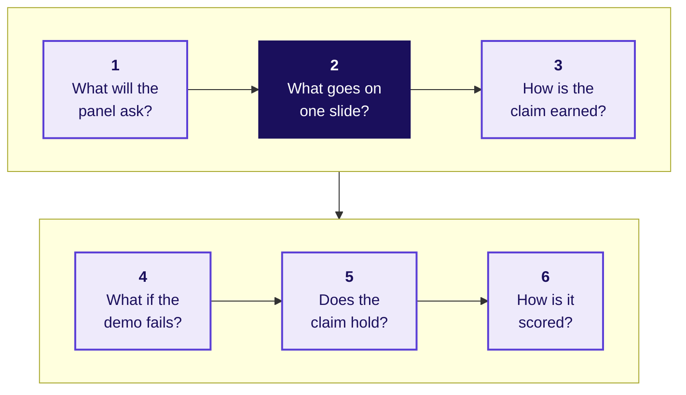

Kalpa Health runs a laboratory and two patient service centres, where blood is drawn, in each of six US metro areas and bills its patients' payers in dollars; your group answers one of the five questions its COO's heads asked on Monday.

```notes
LIVE, 1 minute, at the opening; SELF-STUDY, 1 minute, on Wednesday night. Read the day's question,
then the six in order. The dark box is the one slide Dr Menon carries into her board meeting, and
every other part of the slot exists to earn it.
Transition: question 1, what the panel will ask.
```

---

## SECTION 1: What will the panel ask?
*What does Dr Menon need from your 25 to 30 minutes, and in what order will the panel ask for it?*

```notes
SELF-STUDY, about 5 minutes over D2 to D6, with S4 and S5 shown at the opening. The section sets
who the slot is for. A group that forgets its listener builds a tour of its notebook.
Transition: who needs the answer.
```

---

## D2. The panel stands in for Dr Menon's board
*Who needs the answer from your slot, and which questions come on the way?*

**Who needs the answer.** Dr Priya Menon, COO of Kalpa Health, who carries one sentence per question into her board meeting; the panel asks what her board would ask, and a slot that tours a notebook leaves her nothing to carry.

```timeline
label: 1 | title: The panel | body: Who sits on the panel, and what has it seen before your slot?
label: 2 | title: Her questions | body: Which four questions does Dr Menon ask every group?
label: 3 | title: The minutes | body: How do the 25 to 30 minutes of a slot split?
label: 4 | title: Her heads' numbers | body: Which numbers has her team already given you? | tone: dark
```

```notes
SELF-STUDY, 1 minute. Four questions, each answered on its own slide before the next is asked.
Transition: who sits on the panel.
```

---

## D3. Two panels hear you, and neither has seen your work
*Who sits on the panel, and what have they seen before your slot?*

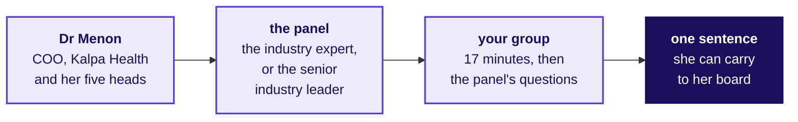

| Who | When | What they have seen |
|---|---|---|
| The industry expert | Friday and Saturday | Dr Menon's questions, and nothing of your work |
| The senior industry leader | Saturday only | The same, and they fly in for the day |

```notes
SELF-STUDY, 1 minute. The two rooms run in parallel on Saturday. Where groups took the same
question, they present one after the other in the same room, so the panel hears each honest answer
to that question in sequence. Neither panel member has read your notebook, so nothing you leave out
of the slot exists for them.
Transition: the four questions Dr Menon asks.
```

---

## S4. Dr Menon asks four questions, always in one order
*Which four questions does Dr Menon ask every group, and which part of your slot answers each?*

**The client asks.** "What did you find? How sure are you? What would change your mind? What do I do on Monday?"

| Her question | The part of your slot that answers it |
|---|---|
| What did you find? | The claim, on the one-slide answer, in your first two minutes |
| How sure are you? | The evidence: the data made trustworthy, the analysis and the live demo |
| What would change your mind? | The caveat, which the panel will challenge |
| What do I do on Monday? | The action: who does what, by when, and what it costs |

```notes
LIVE, 1 minute, at the opening; SELF-STUDY on Wednesday night. Read her four questions aloud. The
whole slot is these four questions in order, and a group that opens on its data cleaning has
answered the second before the first.
Transition: how the minutes split.
```

---

## S5. Seventeen minutes are yours, then the panel's eight
*How do the 25 to 30 minutes of a slot split, part by part?*

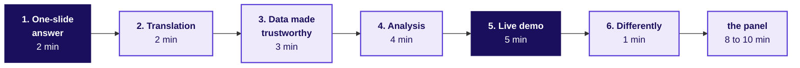

| Part | Minutes | What it carries |
|---|---|---|
| 1. The one-slide answer | 2 | Claim, evidence, caveat and action, said first |
| 2. The translation | 2 | Dr Menon's words mapped onto a move from Weeks 1 and 2 |
| 3. The data made trustworthy | 3 | The decisions log's largest calls, and the rows reconciled |
| 4. The analysis | 4 | Two or three charts, each with its denominator |
| 5. The live demo | 5 | Your main number, reproduced cold from the raw files |
| 6. What you would do differently | 1 | One change, specific enough for Build 2 to act on |

```notes
LIVE, 1 minute, at the opening. Seventeen minutes is a hard stop: the scribe shows a card at five
minutes left and at one minute left, and stops the group at 17. The panel then has 8 to 10 minutes,
and three minutes of changeover close a slot of 28 to 30. Groups overrun on part 3, because cleaning
is where the week went; the clock takes the overrun out of the analysis, and the panel's questions keep
their full time.
Transition: what Dr Menon's team has already said.
```

---

## D6. Her heads' numbers are where every answer starts
*Which numbers has Dr Menon's team already given you, and what do they leave open?*

```stats
value: 5% | label: test volumes, Q2 to Q3 | note: her dashboard, against a plan of 18
value: 2 metros | label: where bookings fell in Q3 | note: the centres' operations head
value: 9% | label: the free at-home offer's lift | note: the marketing head
value: KH-ATL-03 | label: the worst no-show rate | note: the operations head's Q3 report
```

Each number is a claim from someone's report, and the finance head adds that the claims billed and the posting system disagree; your answer says what your number counts before it agrees or disagrees with theirs.

```notes
SELF-STUDY, 1 minute. Every figure here came from Dr Menon or her heads, in Monday's briefing note.
A group that copies one onto its one-slide answer without saying what it counts has handed the client
her own number back. The week's work is what each one becomes once the group has asked what it
counts, on which files and over which window, which is Week 1 Tuesday's first rung: is the number
real?
Transition: section 2, the one slide she carries.
```

---

## SECTION 2: What goes on one slide?
*What does the one slide Dr Menon carries into her board meeting say, and why does it come first?*

```notes
SELF-STUDY, about 6 minutes over D7 to D14. The one-slide answer is Week 1 Thursday's note, moved onto
a slide and said to a panel that will push on every part of it.
Transition: who needs the one slide.
```

---

## D7. One slide carries her answer into the boardroom
*Who needs the one-slide answer, and which questions come on the way?*

**Who needs the answer.** Dr Menon, who reads for two minutes and stops; the slide she carries is the only part of your work her board sees, so a missing part costs her a question she cannot answer in the room.

```timeline
label: 1 | title: Four parts | body: Which four parts make the one-slide answer, in which order?
label: 2 | title: The claim | body: What must one sentence carry before a board can repeat it?
label: 3 | title: A real lab | body: How does a listed US lab state a quarter's growth?
label: 4 | title: Which sentence | body: Which of four sentences can Dr Menon carry?
label: 5 | title: Caveat and action | body: What makes a caveat, and what makes an action? | tone: dark
```

```notes
SELF-STUDY, 1 minute. Five questions, answered in order on the slides that follow.
Transition: the four parts.
```

---

## D8. Claim, evidence, caveat, action, in that order
*Which four parts make the one-slide answer, in the order Week 1 Thursday's note set them?*

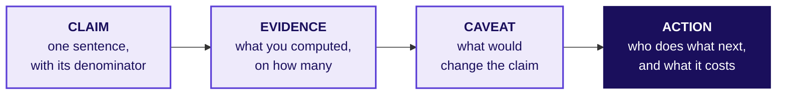

```cards
icon: quote | eyebrow: Claim | title: One sentence | body: A COO can repeat it to a board. It names what was counted, out of what, and over which window.
icon: chart-column | eyebrow: Evidence | title: Two numbers at most | body: The number and the one it is compared with, each with its count.
icon: triangle-alert | eyebrow: Caveat | title: What would change it | body: The one fact that, if it turned out otherwise, would change the claim.
icon: arrow-right | eyebrow: Action | title: Monday's move | body: Who does what, by when, and what doing it or waiting costs. | tone: dark
```

```notes
SELF-STUDY, 1 minute. The claim comes first because a COO reads two minutes and stops. The caveat is
a statement about this claim, so "the data may have quality issues" is no caveat at all.
Transition: what one sentence must carry.
```

---

## D9. A claim carries a number, a denominator and a period
*What must one sentence carry before a board can repeat it?*

```code
[What you counted] [rose or fell] [by how much],
  from [period] to [period], out of [its denominator];
  [the fact that would change it];
  so [who] [does what] [by when].
```

| Slot in the sentence | The rubric's words for it | What a panel asks when it is missing |
|---|---|---|
| The number, and what was counted | Its number | "Counted how?" |
| Out of what | Its denominator | "Per what?" |
| From when to when | Its period | "Over which window?" |
| What would change it | Its caveat | "And if that is wrong?" |
| Who does what next | An action Dr Menon can take | "So what do I do?" |

```notes
SELF-STUDY, 1 minute. The skeleton is the rubric's claim criterion, word for word: one sentence
carries its number, denominator, period and caveat, plus an action Dr Menon can take. Fill it in for
your own claim before you build a single chart.
Transition: how a real lab says it.
```

---

## D10. Quest states its growth as a count and a rate
*How does a listed US laboratory state a quarter's growth, with its denominator?*

```stats
value: 10.2% | label: revenues, Q2 2026 on 2025 | note: $3.04 billion in the quarter
value: 13.1% | label: more requisitions | note: the count: doctors' orders for tests
value: 2.8% | label: less revenue per requisition | note: the rate: dollars per order
```

Quest Diagnostics told its second quarter of 2026 as a count and a rate, so a reader sees that volume grew faster than revenue because each order brought in less (Quest's second-quarter 2026 results, 23 July 2026).

```notes
SELF-STUDY, 1 minute. Quest Diagnostics is a US laboratory company with patient service centres and
laboratories, the shape Kalpa Health copies; Monday's domain dossier has it in section 2. A requisition is
a doctor's order for tests, the nearest thing to a Kalpa Health booking. The point for your slide: a
growth number reaches a board with the count it rests on and the rate per unit beside it, so nobody
reads a price change as more patients.
Transition: which of four sentences Dr Menon can carry.
```

---

## D11. Question: which sentence can Dr Menon carry?
*Which of four sentences, on one invented quarter at a Kalpa Health laboratory, can a board repeat?*

**Question.** The lab director's invented quarter: median turnaround, from draw to released result, 22 hours in Q2 and 18 in Q3 on 9,400 tests, and 14 in Q3 when timed from the sample's arrival at the lab. Which sentence can Dr Menon carry? Answer as a letter.

a) Turnaround improved sharply across the laboratory in Q3, and the lab director's team deserves the credit for it.
b) Median draw-to-result time fell from 22 to 18 hours, Q2 to Q3, on 9,400 tests, courier included; keep the evening run.
c) Our turnaround analysis shows promising signs which may possibly point to faster results for doctors in coming quarters.
d) Turnaround is down to 18 hours in Q3, so the evening courier run can stop from Q4 and its whole cost can be saved.

```notes
SELF-STUDY, 2 minutes. The figures are invented, and they sit on the lab director's question, which
is none of the five your groups took. Choose before the next slide. Most readers split between b and
d, because d sounds decisive.
Transition: the answer.
```

---

## D12. Answer: b, the one sentence with all five parts
*Which sentence can Dr Menon carry, and why does each other one fail?*

| Option | Why it holds or fails |
|---|---|
| a | A verdict with no number, no denominator and no window; a board member's first question breaks it |
| b | Holds: the measure, the window, the count, what the number includes, and an action |
| c | Hedges every word, so nobody can act on it and nobody can disagree with it |
| d | An action with no evidence and no caveat, and it cuts the courier run whose hours sit inside the 18 |

**Kavya's review.** Read your claim aloud and ask what you counted, out of what, over which window, and what would change it; if any is missing, the panel will ask for it.

```notes
SELF-STUDY, 1 minute. The answer is b. Option d is the tempting one: the action is the fourth part,
and it cannot stand without the three before it, least of all when the claim's own caveat (courier
hours included) is what the action would remove.
Transition: what makes a caveat.
```

---

## D13. A caveat names the fact that would change the claim
*What separates a caveat from a disclaimer that protects nobody?*

| A disclaimer | A caveat, on the invented turnaround quarter |
|---|---|
| "The data may have quality issues." | "If the lab's clock and the draw site's clock disagree by an hour, the fall is 3 hours, not 4." |
| "Results may vary." | "Timed from arrival at the lab, Q3 reads 14 hours, so most of the gain could be the courier's." |
| "Further analysis is needed." | "One quarter of 9,400 tests; a second quarter at 18 or below would settle it." |

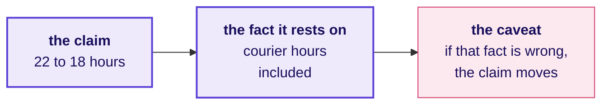

```notes
SELF-STUDY, 1 minute. A caveat is about this claim and names one fact; a disclaimer is about data in
general and names nothing, so nobody can check it. Write your caveat so the panel could test it.
Transition: what makes an action.
```

---

## D14. An action names who does what, by when, at what cost
*What makes an action one Dr Menon can take on Monday?*

| An action nobody can take | An action Dr Menon can take |
|---|---|
| "Improve turnaround further." | "The lab director keeps the evening courier run through Q4 and reports turnaround from draw again in January." |
| "Investigate the courier." | "Time 200 samples by hand at the draw site and at the lab next week, at two staff days." |
| "Monitor the situation." | "Hold the courier contract renewal until Q4's figure is in, which costs one month's delay." |


```notes
SELF-STUDY, 1 minute. The invented quarter again. An action names a person or a role, a move, a date
and a cost, and "wait and measure" is an action when it carries all four. The one-slide answer is
done when its action passes this test.
Transition: section 3, how the claim is earned.
```

---

## SECTION 3: How is the claim earned?
*How do the translation, the data made trustworthy and the analysis earn your claim in ten minutes?*

```notes
SELF-STUDY, about 7 minutes over D15 to D21. Parts 2, 3, 4 and 6 of the slot. Each exists to support
the claim already on screen, so a slide here that does not connect to the claim gets cut.
Transition: who needs the body of the slot.
```

---

## D15. Ten minutes earn the claim your first two stated
*Who needs the body of your slot, and which questions come on the way?*

**Who needs the answer.** The panel, which scores the translation (8 marks), the data made trustworthy (10) and the analysis (10) from these ten minutes, and Dr Menon, whose board will ask how sure the team is.

```timeline
label: 1 | title: The translation | body: How do you show her question is one you have answered before?
label: 2 | title: The words | body: Which Kalpa Health words play the part of words you know?
label: 3 | title: The data | body: Which log rows show the data can be trusted?
label: 4 | title: The charts | body: Which rules let a chart carry one message?
label: 5 | title: Differently | body: What one change does your group take into Build 2? | tone: dark
```

```notes
SELF-STUDY, 1 minute. Twenty-eight of the mini project's 40 marks sit on what these ten minutes
show, so build each part to earn its marks.
Transition: the translation.
```

---

## D16. The translation maps her words onto a move you own
*How do you show that her question is one you have answered before?*

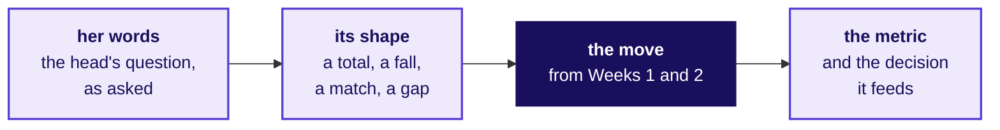

| The question's shape | The move you own | Where you learned it |
|---|---|---|
| Where does a total come from, and which part is short? | The revenue tree, every branch a count over a denominator | Week 1 Monday; Week 2 Monday, as queries |
| Did it really fall, and why? | The investigation ladder, rung 1 first: is the drop real? | Week 1 Tuesday |
| Do two files that should agree, agree? | Profile, reconcile, the bridge; a join counted before anything is summed | Week 1 Wednesday; Week 2 Tuesday |
| Is a gap real, and is the comparison fair? | Real or the wobble; did the discount work? | Week 1 Thursday |

```notes
SELF-STUDY, 1 minute. This is Monday's translation worksheet, made presentable. Name your move in
your own words and say which shape her question has; a group that cannot fill the move column for its
own question did not make the transfer, and the panel will ask about it.
Transition: the words.
```

---

## D17. The vocabulary map pairs each new word with an old one
*Which Kalpa Health words play the part of words you learned in Kalpa Retail?*

| Kalpa Health | Kalpa Retail | Where the pair stops fitting |
|---|---|---|
| A booking | An order | A booking can be a home collection, when a phlebotomist, who draws blood, visits the patient |
| A test | An item | It runs in a laboratory, often far from where the patient was seen |
| A no-show | A cancellation | The patient says nothing in advance; the centre learns it when nobody arrives |
| A claim | An order's invoice | It goes to a payer, who pays weeks later what its contract allows |
| A posting | A payment | It arrives from the payer weeks after the claim, through the posting system |
| A payer | No twin | Whoever pays the claim: a health plan, Medicare, Medicaid, or the patient when self-paying |

```notes
SELF-STUDY, 1 minute. The first three pairs are the ones Monday's worksheet seeded; your map carries
every term your analysis uses, and the right-hand column is where a group slows down, since a word
with no retail twin is where retail habits mislead. The dossier from Monday, section 6, defines each.
Transition: the data made trustworthy.
```

---

## D18. Three log rows carry the data's three minutes
*Which rows of your decisions log show the panel that the data can be trusted?*

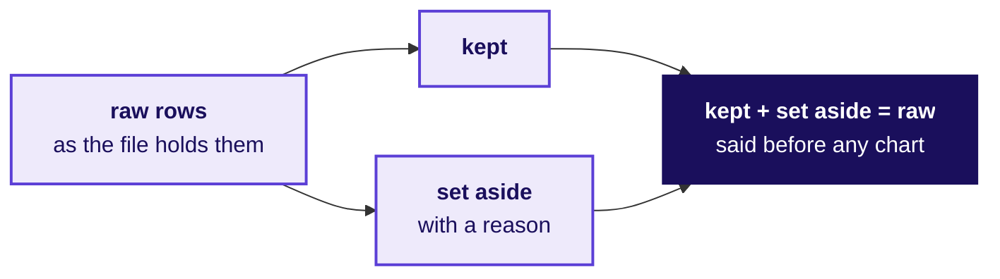

| Field | Issue | Rows | Decision | Reason |
|---|---|---|---|---|
| `age_band`, an invented row | 14 rows blank | 14 | Kept, labelled unknown | Dropping them would take 14 patients' bookings out of every count, and no claim splits by age |

```notes
SELF-STUDY, 1 minute. The log's shape is Week 1 Wednesday's: field, issue, rows, decision, reason.
Show the three calls that moved the most rows or dollars, and one row you kept, since the row you
kept is the one an auditor asks about. Say the reconciliation as counts: rows in, rows kept, rows set
aside. The row here is invented to show the shape, and the real files' age bands have no blanks.
Transition: a question on reasons.
```

---

## D19. Question: which reason would an auditor accept?
*Which of four reasons for the same invented call would an auditor accept?*

**Question.** The invented call: 14 blank age bands, kept and labelled unknown. Which reason would an auditor accept? Answer as a letter.

a) Dropping them would remove 14 patients' bookings from every count, and no claim we make splits by age.
b) The 14 age bands were blank, so they were inconsistent with the rest and needed cleaning before use.
c) Keeping blank rows and labelling them unknown follows the usual data-cleaning best practice for a column.
d) Fourteen rows out of 6,700 patients is too few to change any number we report, so the call does not matter.

```notes
SELF-STUDY, 1 minute. Choose before the next slide. The test of a reason is whether it says what the
row changes in the answer.
Transition: the answer.
```

---

## D20. Answer: a, the reason says what the call changes
*Which reason would an auditor accept, and why does each other one fail?*

| Option | Why it holds or fails |
|---|---|
| a | Holds: it names what dropping would do to the counts, and why keeping cannot touch the claim |
| b | Restates the issue as its own reason, which an auditor reads as no reason at all |
| c | Appeals to a habit, and says nothing about these rows or this answer |
| d | Asserts the size is harmless without showing which numbers it would move |

**Kavya's review.** A reason that restates the issue is no reason; say what the call changes in the counts or the dollars, and what it cannot change.

```notes
SELF-STUDY, 1 minute. The answer is a. Option d is the tempting one, because small sounds safe; the
auditor's question is which number the 14 rows sit in, and size alone never answers it.
Transition: the charts.
```

---

## D21. Each chart states its finding and its denominator
*Which rules let a chart carry one message the panel can read without you?*

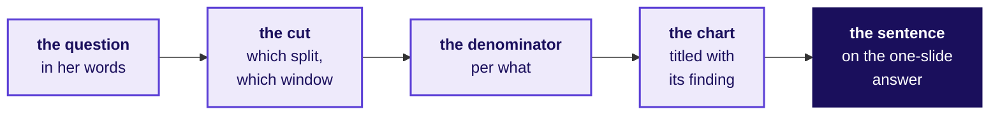

| Rule | What it prevents |
|---|---|
| The chart's title states the finding | A chart the panel has to interpret for you |
| The denominator sits on the axis or in the title | A count read as a rate, or a rate read as a count |
| Both sides of a comparison cover the same window | A change that is really a difference in days |
| Every number shown is reproduced in the demo | A chart from a cell nobody can rerun |

```notes
SELF-STUDY, 1 minute. Four minutes hold two or three charts; a fourth means the group is touring its
notebook. On the invented quarter, a chart titled "Turnaround by quarter" makes the panel do the work,
and "Median turnaround fell from 22 to 18 hours" does it for them.
Transition: the last minute of the body.
```

---

## D22. One change for Build 2, specific enough to act on
*What does the last minute of your slot say, and what makes it usable?*

| A change nobody can act on | A change Build 2 can act on |
|---|---|
| We would manage our time better | We would profile every file on day one, before choosing what to count |
| We would clean the data more | We would reconcile rows in against rows kept after every cleaning step, and log each one |
| We would communicate better | We would ask the team that owns each export what one row stands for before trusting it |

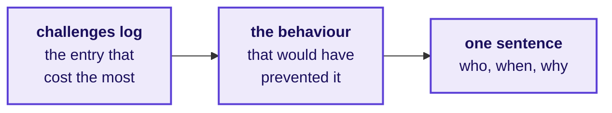

```notes
SELF-STUDY, 1 minute. The change comes from your challenges log: the entry that cost the most time is
usually the change worth naming. It names something the group will do on day one, and the week close
asks for the same sentence.
Transition: section 4, the live demo.
```

---

## SECTION 4: What if the demo fails?
*How does the live demo prove your number from the raw files, and what happens if it fails in front of the panel?*

```notes
SELF-STUDY, about 5 minutes over D23 to D29, with S24 and S26 shown at the opening. The demo is the
evidence that the claim came from the data.
Transition: who needs the demo.
```

---

## D23. The demo is the claim's evidence, shown live
*Who needs the live demo, and which questions come on the way?*

**Who needs the answer.** The panel, which trusts a number it watched arrive from the raw files more than one pasted on a slide, and every member, whose presentation and defence score begins with the demo.

```timeline
label: 1 | title: The rules | body: What makes a live demo prove your number?
label: 2 | title: Cold | body: What does a cold run mean on the day?
label: 3 | title: A failure | body: What happens if the demo fails in front of the panel?
label: 4 | title: Your plan | body: Which plan for a failure meets the rule?
label: 5 | title: The cost | body: What does a failed demo cost, and what does it leave? | tone: dark
```

```notes
SELF-STUDY, 1 minute. Five questions, each with its own slide.
Transition: the three rules.
```

---

## S24. Three rules make the demo prove your number
*What makes a live demo prove the number on your one-slide answer?*

```cards
icon: snowflake | eyebrow: Rule 1 | title: Cold | body: A fresh Codespace or a restarted kernel, run all, with no output kept from an earlier run.
icon: file-text | eyebrow: Rule 2 | title: Raw files | body: The files exactly as Dr Menon's team sent them, read straight from the data folder with no hand edits.
icon: play | eyebrow: Rule 3 | title: One run | body: One press, top to bottom, with two minutes to recover if it fails, as in front of a client. | tone: dark
```

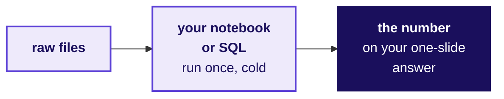

```notes
LIVE, 1 minute, at the opening. The demo shows two things: the claim's main number arriving from the
raw files, and your decisions log's largest call happening in code.
Transition: what cold means.
```

---

## D25. Cold means a fresh start on Friday's frozen commit
*What does a cold run mean on the day of your slot?*

```timeline
label: 1 | title: The frozen commit | body: The last commit you pushed before Friday's open build time closed is the one you demo.
label: 2 | title: A fresh start | body: A new Codespace, or a restarted kernel, with no output kept.
label: 3 | title: The raw files | body: The ten files as Dr Menon's team sent them, in the data folder.
label: 4 | title: Run all | body: Top to bottom, one press, in front of the panel.
label: 5 | title: The check | body: The number on your slide appears in the output. | tone: dark
```

```notes
SELF-STUDY, 1 minute. After the freeze, slide wording may change and no number may; an error found
after the freeze is stated on the day as a caveat, with the right number. Before each slot a TA checks
that the Codespace is on your frozen commit, and a later commit that changes code or a number is shown
to the panel, which decides.
Transition: what happens if it fails.
```

---

## S26. Two minutes to recover, then the executed notebook
*What happens if the live demo fails in front of the panel?*

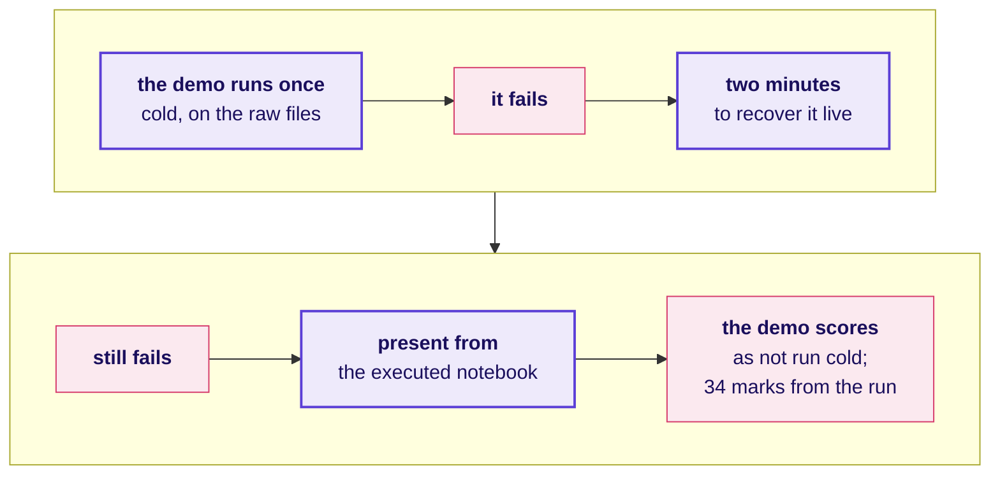

The other 34 marks of the mini project are scored from the executed run, so a failed demo costs its own marks and never the analysis.

```notes
LIVE, 1 minute, at the opening. The rule, word for word: a group's demo runs once, cold, on its raw
files. If it fails, the group has two minutes to recover it live, as it would in front of a client.
If it still fails, the group presents from its executed notebook, and the panel scores the live demo
in presentation and defence as not run cold. The other 34 marks of the mini project are scored from
the executed run.
Transition: a question on plans.
```

---

## D27. Question: which plan meets the demo rule?
*Four groups say what they will do if a cell fails on the cold run; which plan meets the rule?*

**Question.** Which plan meets the demo rule? Answer as a letter.

a) Skip the live run and open Friday's saved notebook, scrolling through the charts it holds.
b) Switch to a cleaned extract saved on Thursday night, since the raw files are what broke the run.
c) Keep debugging live for as long as it takes, so the panel sees every output in the end.
d) Fix the cell live inside two minutes; if it still fails, present from the executed notebook.

```notes
SELF-STUDY, 1 minute. Choose before the next slide. Most readers split between c and d; the two-minute
limit is what separates them.
Transition: the answer.
```

---

## D28. Answer: d, two minutes, then the executed notebook
*Which plan meets the demo rule, and which rule does each other plan break?*

| Option | Which rule it breaks, or why it holds |
|---|---|
| a | Gives up the live run a client would watch, and shows outputs nothing ran in front of the panel |
| b | Breaks the raw files rule: the extract hides every cleaning call the panel wants to see made |
| c | Breaks the two-minute limit: open-ended debugging eats the slot and the panel's questions |
| d | Holds: two minutes to recover live, then the executed notebook, and the analysis keeps its 34 |

**Kavya's review.** Rehearse the failure as well as the run: know which cell breaks most often and what you type in the two minutes.

```notes
SELF-STUDY, 1 minute. The answer is d. Option a is the comfortable one, and it scores like a failed
demo without the two minutes in which a group can recover.
Transition: what a failure costs.
```

---

## D29. A failed demo costs its own marks and leaves the 34
*What does a demo that still fails cost, and what does it leave standing?*

```stats
value: 34 | label: the group's marks | note: scored from the executed run, whatever the demo did
value: 6 | label: each learner's own | note: presentation and defence, where the live demo sits
value: 2 min | label: to recover live | note: then the executed notebook
```

Full marks on presentation and defence begin with "the live demo runs cold", so a demo that still fails keeps a learner below them; a machine that fails before the demo starts is swapped, and the demo then runs cold in the room's reserve, before the same panel.

```notes
SELF-STUDY, 1 minute. How far below full marks is the panel's call, and the analysis keeps every mark
it earned. A hardware or Codespace failure is the machine's, so the group gets its cold run later in
the same room.
Transition: section 5, whether the claim holds.
```

---

## SECTION 5: Does the claim hold?
*How do you hold your claim when the panel challenges its caveat, and when are two groups' different answers both honest?*

```notes
SELF-STUDY, about 6 minutes over D30 to D37, with S31 shown at the opening. The panel's eight to ten
minutes test whether the answer survives, and every member answers.
Transition: who needs the answers.
```

---

## D30. The panel's questions test the edge of your evidence
*Who needs your answers to the panel, and which questions come on the way?*

**Who needs the answer.** Every member: presentation and defence is scored for each learner on 6 marks, and the panel chooses who answers, so a member who knows one slice of the work answers for all of it.

```timeline
label: 1 | title: Five kinds | body: Which kinds of question does the panel ask?
label: 2 | title: Three moves | body: How do you hold a caveat without folding or overclaiming?
label: 3 | title: Which reply | body: Which reply holds when the caveat is attacked?
label: 4 | title: Two answers | body: When are two groups' different numbers both honest?
label: 5 | title: Every member | body: What must each member explain alone? | tone: dark
```

```notes
SELF-STUDY, 1 minute. Five questions, answered in order.
Transition: the five kinds.
```

---

## S31. The panel asks five kinds of question
*Which kinds of question should every group expect in its eight to ten minutes?*

| Kind | What it sounds like |
|---|---|
| The evidence | "What is the denominator of that number, and over which window?" |
| The caveat challenge | "Your caveat says this might not hold. Suppose it does not. What then?" |
| The quietest member | A question to one named person, who answers without help from the group |
| The other group | "Another group on your question reached a different claim. Can both be honest?" |
| Differently | "If you started again on Monday, what would you do first?" |

**In the interview.** [S] Present a finding to a panel and take a challenge on your caveat.

```notes
LIVE, 1 minute, at the opening. The quietest-member question goes to whoever has spoken least; every
member should be able to explain the claim, one decision from the log and one chart. Groups on the
same question present back to back, so the other-group question is real.
Transition: how to hold a caveat.
```

---

## D32. Restate, bound, offer the test
*How do you hold a caveat without folding or overclaiming, as Week 1 Friday rehearsed it?*

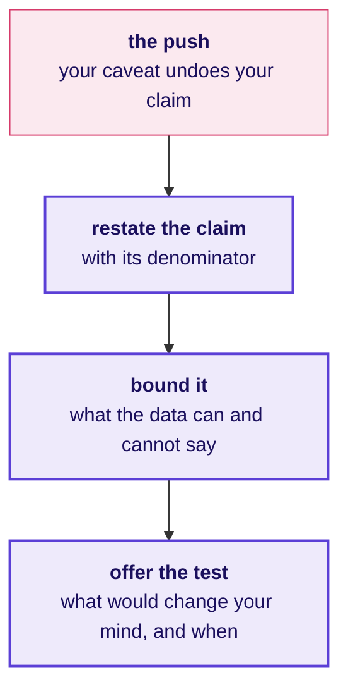

Folding drops the caveat and the claim with it, and overclaiming calls an uncertain number certain; the three moves sit between the two.

```notes
SELF-STUDY, 1 minute. These are the three moves of the Week 1 Friday rehearsal, said to a panel
instead of a partner playing Marketing. Narrowing a claim under challenge is a strong answer, and
defending an overreach is a weak one.
Transition: the three moves on one invented challenge.
```

---

## D33. The three moves, said to one invented challenge
*How do the three moves sound when a panel pushes on the invented turnaround claim?*

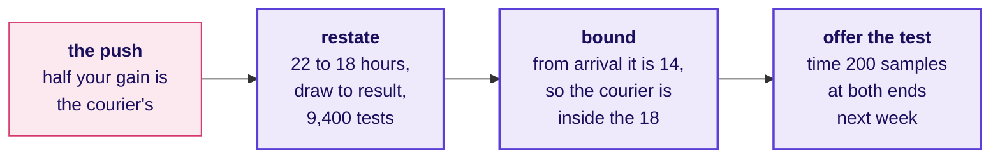

On the invented figures the claim holds as stated, draw to result, and the test settles how much of the 4 hours is the courier's.

```notes
SELF-STUDY, 1 minute. The figures are invented, on the lab director's question, which none of your
groups took. Say the answer aloud in under a minute: the claim with its count, what the data can and
cannot say, and the check with its date.
Transition: a question on replies.
```

---

## D34. Question: the panel says your caveat undoes your claim
*The panel says "your caveat is so large your claim means nothing"; which reply holds?*

**Question.** Which reply is the strongest? Answer as a letter.

a) We checked the data very carefully over three days, so we stand by the claim exactly as we stated it.
b) That is fair, and it is a limitation of the data the client gave us, which we noted in our own log.
c) It holds for the part we measured; here is that number, and here is the test that settles the rest.
d) Every analysis carries caveats, so ours is no weaker than any other group's claim on this question.

```notes
SELF-STUDY, 1 minute. Choose before the next slide. The strong reply narrows the claim and names the
check that would settle it.
Transition: the answer.
```

---

## D35. Answer: c narrows the claim and names the test
*Which reply holds under the challenge, and why does each other one fail?*

| Option | Why it holds or fails |
|---|---|
| a | Defends with effort instead of evidence, and ignores what the challenge asked |
| b | Agrees and stops, which hands the claim away with nothing in its place |
| c | Holds: keeps what the evidence supports, gives the number, names the settling test |
| d | Deflects to other groups and says nothing about this claim |

**In the interview.** [S] Present a finding to a panel and take a challenge on your caveat: restate, bound, and offer the test.

```notes
SELF-STUDY, 1 minute. The answer is c. Under challenge, narrow the claim and name the check, the move
between defending blindly and folding.
Transition: when two answers are both honest.
```

---

## D36. Two groups can reach two honest claims
*When can two groups' different numbers from the same files both be honest?*

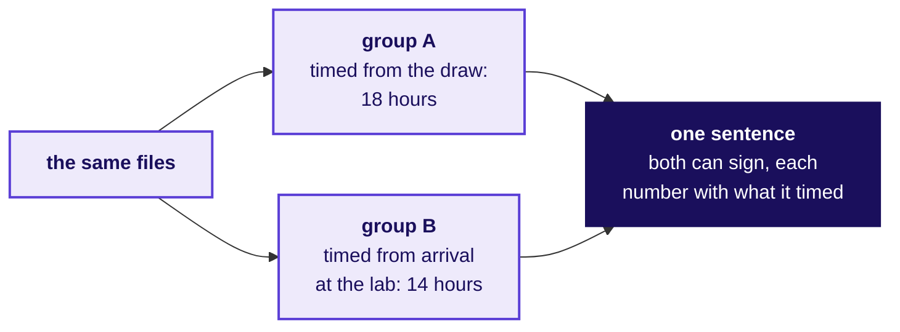

Two numbers from the same files are both honest when each says what it counted; the panel asks the second group whether both can stand, and the strong answer names the definition that separates them.

```notes
SELF-STUDY, 1 minute. The invented turnaround quarter once more: the doctor waits 18 hours from the
draw, and the lab's own clock says 14. Both are true, and a board needs to hear which one answers its
question. The panel hears groups on the same question back to back, so expect to be asked about the
group before you.
Transition: what every member explains alone.
```

---

## D37. Every member explains three things alone
*What must each member be able to explain without a teammate?*

```cards
icon: quote | eyebrow: One | title: The claim | body: With its number, denominator, window and caveat, in the member's own words.
icon: list-checks | eyebrow: Two | title: One logged decision | body: One row of the decisions log, the rows it touched, and why.
icon: chart-column | eyebrow: Three | title: One chart | body: What it shows, out of what, and which number in the demo prints it. | tone: dark
```

The panel puts its question to whoever has spoken least, and the rest of the group stays silent while that member answers.

```notes
SELF-STUDY, 1 minute. A member who cannot answer is questioned again alone, in the room's reserve,
before that member's presentation and defence is scored; the group's 34 do not wait.
Transition: section 6, how the slot is scored.
```

---

## SECTION 6: How is it scored?
*How is the mini project scored, what closes with it today, and what does every group ship before its slot?*

```notes
SELF-STUDY, about 4 minutes over D38 to S42. Learners may see the rubrics, which the requester
approved on 29 September 2026.
Transition: who needs the scoring.
```

---

## D38. The rubric is public, so aim the slot at it
*Who needs the scoring, and which questions come on the way?*

**Who needs the answer.** Every learner: 34 of the mini project's 40 marks are the group's, which every member receives, and 6 are each learner's own, so the group builds the slot to the rubric and every member answers for it.

```timeline
label: 1 | title: What ships | body: What does every group ship before its slot?
label: 2 | title: The rubric | body: How is the mini project scored?
label: 3 | title: The other two | body: Which other Build 1 scores close today?
label: 4 | title: The last hour | body: What do you check before you walk in? | tone: dark
```

```notes
SELF-STUDY, 1 minute. Four questions, in order.
Transition: what every group ships.
```

---

## D39. Every group ships five things before its slot
*What does every group bring to its slot, and where does each piece live?*

| What | Where it lives |
|---|---|
| The presentation, 25 to 30 minutes with the panel, the live demo inside it | Built on this skeleton, one-slide answer first |
| The one-slide answer Dr Menon carries into her board meeting | Claim, evidence, caveat and action, on one slide |
| The notebook or SQL that reproduces every number from the raw files | Runs cold, top to bottom, on the files in the data folder |
| The decisions log | `briefs/C2_W03_D01_decisions_log_STUDENT.xlsx`, in the Week 1 Wednesday shape |
| The challenges log | `briefs/C2_W03_D01_challenges_log_STUDENT.xlsx`, kept since Monday |

**Kavya's review.** Run the notebook cold once more before you walk in, and check that every number on your slides appears in its output.

```notes
SELF-STUDY, 1 minute. The two logs sit in Monday's briefs folder, beside the briefing note, your
question's brief, the data dictionary and the translation worksheet.
Transition: the rubric.
```

---

## D40. The mini project is 40 marks, and 6 are yours alone
*How is the mini project scored?*

<!-- sync:rubric:W03/mini-project -->
**Mini project, 40 marks.** The first four criteria are scored once for the group, and every member receives those 34 marks; presentation and defence is scored for each learner on 6 marks, so a silent teammate cannot ride the group's score.

| Criterion | Marks | What full marks look like |
|---|---|---|
| The question translated | 8 | Dr Menon's words are mapped to the right Weeks 1 and 2 method, with the metric defined and the decision it feeds named. |
| The data made trustworthy | 10 | The data is profiled before it is touched, every cleaning call is in the decisions log with its reason, and counts and dollars reconcile across files. |
| The analysis | 10 | The tree, ladder or fair comparison reaches the branch that explains the symptom, on the right denominator, with a chance test where one is needed. |
| The claim | 6 | One sentence carries its number, denominator, period and caveat, plus an action Dr Menon can take. |
| Presentation and defence | 6 | The live demo runs cold, and every member answers a challenge on the caveat. |
<!-- /sync:rubric:W03/mini-project -->

```notes
SELF-STUDY, 1 minute. Point at the last row: the live demo sits inside presentation and defence, so a
demo that still fails after its two minutes costs those marks and leaves the other 34 to the executed
run.
Transition: the other two scores.
```

---

## D41. Three Build 1 scores close for every learner today
*Which Build 1 scores close on Saturday, and out of how many marks?*

```stats
value: 40 | label: the mini project | note: the group's 34 and your own 6
value: 30 | label: the group discussion | note: rounds on Friday and Saturday morning
value: 30 | label: Mock R1 | note: Thursday 22 October, each learner alone
```

Every Build 1 grade closes on Saturday 24 October; how and when you see your scores is the Programme Head's to tell you.

```notes
SELF-STUDY, 1 minute. The marks per event are locked, and the three rubrics are public. The GD rounds
ran on Friday 23 October and close on the morning of Saturday 24 October; Mock R1 ran on Thursday 22
October. No score is read aloud in the room.
Transition: the last hour before your slot.
```

---

## S42. Before you walk in: one cold run, one claim
*What does your group check in the last hour before its slot?*

```timeline
label: 1 | title: One cold run | body: Restart and run all on the raw files; every number on your slides appears in the output.
label: 2 | title: One sentence | body: Each member says the claim, with its denominator and window, alone.
label: 3 | title: One caveat | body: Each member says the fact that would change the claim, and the test that would settle it.
label: 4 | title: One slide first | body: Open on the one-slide answer; the cleaning comes in part 3. | tone: dark
```

**In the interview.** [S] Present a finding to a panel and take a challenge on your caveat.

```notes
LIVE, 1 minute, at the opening, as the last slide shown; SELF-STUDY on the night before. The answer
to the day's question, which branch is short and whether the answer holds, is a claim with its
denominator, a caveat each member can defend, and a number the panel watched arrive from the raw files.
Close on the interview question and leave it on screen while the first group sets up.
```
