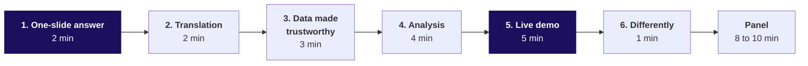
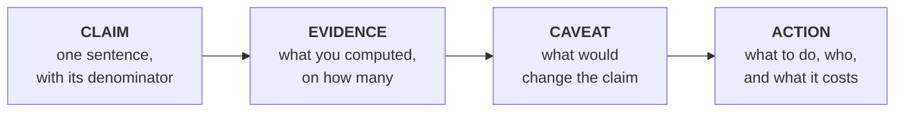
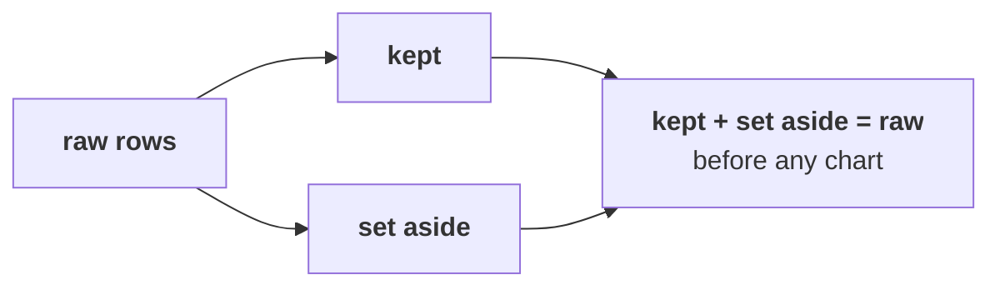
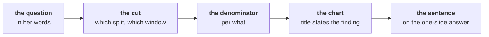
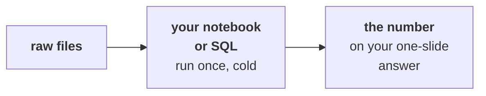
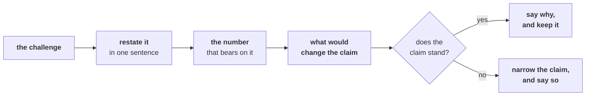

# Your answer, in front of the panel

Week 3, Build 1. The presentation.

Kicker: WEEK 3  ·  BUILD 1  ·  THE PRESENTATION
Quote: Test volumes grew 5 percent against a plan of 18. Which branch of my business is short, and what do I tell my board?
Who: Dr Priya Menon, COO, Kalpa Health, to the data and AI team at Kalpa's Global Capability Centre

```notes
This is the skeleton every group builds its presentation on. It is handed out at Wednesday's close,
once each group has pinned its headline claim, so a group reads it alone and builds from it. When a
trainer walks it, the walk takes about ten minutes: S1, S3, S4, S11 and S14 carry the load, and the
rest is there for the group to read while it builds.
```

---

## SECTION 1: The ask on the day
*Dr Menon wants one sentence she can carry into her board meeting, and the reasons it holds.*

```notes
The chapter sets what the slot is for. A group that forgets who the audience is builds a tour of
its notebook. The audience is a COO with a board meeting, and a panel that will test whether the
sentence survives.
```

---

## S1. What Dr Menon asks every group
*Four questions, in the order a COO asks them, and each has its place in your slot.*

**The client asks.** "What did you find? How sure are you? What would change your mind? What do I do on Monday?"

| Her question | The part of your slot that answers it |
|---|---|
| What did you find | The claim, on the one-slide answer, in the first two minutes |
| How sure are you | The evidence, the data you made trustworthy, and the live demo |
| What would change your mind | The caveat, which the panel will challenge |
| What do I do on Monday | The action, with who does it and what it costs |

```notes
Read her four questions aloud. Point out that the whole slot is those four questions in order, and
that a group which opens with its data cleaning has answered question two before question one.
```

---

## S2. What her team has already told you
*These are her team's own words and numbers; everything past them, your group found.*

```stats
value: 5% | label: test volume growth | note: the dashboard, against a plan of 18
value: 2 metros | label: bookings down | note: in Q3, per the booking data
value: 9% | label: the campaign's lift | note: free at-home collection, per marketing
value: 1 centre | label: a worse no-show rate | note: per the centres' operations head
```

**The claim.** Her data team adds two things it knows: two metros changed booking systems in Q3, and the posting system keys claims in its own format. Claims and collections disagree, says the finance head.

```notes
Every number on this slide came from Dr Menon or her team. A group that repeats one of them on its
one-slide answer without checking it has repeated the client's number back to the client. The
point of the week is what each number turns into once the group has asked what it counts.
```

---

## S3. The slot, part by part
*Seventeen minutes are yours, then the panel takes eight to ten, inside a slot of 25 to 30.*



| Part | Minutes | What it carries |
|---|---|---|
| 1. The one-slide answer | 2 | Claim, evidence, caveat, action, on one slide, said first |
| 2. The translation | 2 | Dr Menon's words mapped onto the Weeks 1 and 2 method |
| 3. The data made trustworthy | 3 | The decisions log's largest calls, and the reconciliation |
| 4. The analysis | 4 | The charts that carry the claim, each with its denominator |
| 5. The live demo | 5 | The claim's main number, reproduced from the raw files |
| 6. What we would do differently | 1 | One thing, specific enough to act on |

```notes
Seventeen minutes is a hard stop. Groups overrun on part 3, because cleaning is where the work
went. The panel's clock stops the group at seventeen and moves to questions, so a group that
spends eight minutes on cleaning loses its analysis, not its question time.
```

---

## SECTION 2: The one-slide answer
*The slide Dr Menon takes into her board meeting, and the reason it comes first.*

```notes
The one-slide answer is the Week 1 Thursday note, moved onto a slide. Groups know the four parts;
what is new is saying it to a panel that will push on every part.
```

---

## S4. Claim, evidence, caveat, action
*The same four parts as the Week 1 Thursday note, in the same order, on one slide.*



```cards
icon: quote | eyebrow: Claim | title: One sentence | body: A COO can repeat it to a board. It names what was counted and over which window.
icon: chart-column | eyebrow: Evidence | title: Two numbers at most | body: The number and the one it is compared against, each with its count.
icon: triangle-alert | eyebrow: Caveat | title: What would change it | body: The one thing that, if it turned out otherwise, would change the claim.
icon: arrow-right | eyebrow: Action | title: Monday's move | body: Who does what, and the cost of doing it or of waiting. | tone: dark
```

```notes
Claim first because a COO reads two minutes and stops. The caveat is a statement about the claim,
never a disclaimer about data in general; "the data may have quality issues" is not a caveat.
```

---

## S5. Question: which sentence can Meera carry?
*Four versions of one Week 1 finding about Kalpa Retail's paid tier.*

**Question.** Meera Raghavan wants one sentence on Retail-Plus for her board. Which one does she carry? Answer as a letter.

| | The sentence |
|---|---|
| a | Retail-Plus is collapsing, and it needs a rescue plan this quarter before the members leave. |
| b | Retail-Plus revenue per member fell from Rs 3,279 to Rs 2,169 on 22 members, against Retail-Core's Rs 110, and 135 of 5,000 shuffles made a fall that large. |
| c | Several indicators in the Retail-Plus data could suggest there may possibly be a movement in member ordering that the team might want to keep watching over the coming quarters. |
| d | Retail-Plus fell, so cut the membership price by ten percent next quarter. |

```notes
One minute in pairs, then letters. Most rooms split between b and d. The example is deliberately
from Week 1, so no group's Kalpa Health answer is on the slide.
```

---

## S6. Answer: b carries its denominator and its test
*A sentence a board can repeat is precise about what was counted and how sure the team is.*

| Option | Why it fails or holds |
|---|---|
| a | A verdict with no number, no count and no comparison; a board member's first question breaks it |
| b | Holds: the measure, the comparison, the count and the chance test (0.027), in one sentence |
| c | Hedges every word, so nobody can act on it and nobody can disagree with it |
| d | An action with no evidence and no caveat; the price was never tested as the cause |

**Kavya's review.** Read your claim aloud and ask: what did I count, over which window, against what, and on how many? If any of the four is missing, the panel will ask for it.

```notes
The answer is b. d is the tempting one because it sounds decisive; point out that the action is
the fourth part of the answer, and it cannot stand without the three before it.
```

---

## SECTION 3: The body of the slot
*The translation, the data made trustworthy, the analysis and what you would change.*

```notes
Parts 2, 3, 4 and 6 of the slot. Each one exists to support the claim already on screen; a slide
here that does not connect to the claim gets cut.
```

---

## S7. The translation, in your own words
*Show that Dr Menon's question is a question you have answered before, in new vocabulary.*

| On your slide | What it shows |
|---|---|
| Her words | The sentence from her briefing that your sub-problem answers |
| The method it maps to | Which Weeks 1 and 2 move you used, named in your own words |
| The vocabulary map | Each Kalpa Health term beside the Kalpa Retail term it plays the part of |
| The first three moves | What you did first, second and third, and why in that order |

**The claim.** The vocabulary map is the translation: a booking plays the part of an order, a test plays the part of an item, and a no-show plays the part of a cancellation. Your map carries every term your analysis uses.

```notes
This is the translation worksheet from Monday, made presentable. A group that cannot fill the
method row in its own words did not do the transfer; the panel will ask about it.
```

---

## S8. The data made trustworthy
*Show the three calls from your decisions log that moved the most rows or the most money.*



| Field | Issue | Rows | Decision | Reason |
|---|---|---|---|---|
| The field | What you saw in it | How many rows it touched | What you did | Why, in a sentence an auditor accepts |

**Kavya's review.** Show one row you kept as well as rows you changed, because the row you kept is the one an auditor asks about. Say the reconciliation as counts: rows in, rows kept, rows set aside.

```notes
The log shape is the Week 1 Wednesday one: field, issue, rows, decision, reason. Three calls fit in
three minutes. A reason that restates the issue is not a reason.
```

---

## S9. The analysis, with its charts
*Every chart carries one message, and the message is part of the claim.*



| Rule | What it prevents |
|---|---|
| The chart's title states the finding | A chart the panel has to interpret for you |
| The denominator is on the axis or in the title | A count read as a rate, or a rate read as a count |
| Both sides of a comparison cover the same window | A change that is really a difference in days |
| Every number shown can be reproduced in the demo | A chart from a cell nobody can rerun |

```notes
Four minutes holds two or three charts. More than that and the group is touring its notebook.
```

---

## S10. What you would do differently
*One minute, one change, specific enough that Build 2 can act on it.*

| A weak version | A usable version |
|---|---|
| We would manage time better | We would profile every file on day one before choosing a sub-question |
| We would clean the data more | We would reconcile row counts after every cleaning step, and log each one |
| We would communicate better | We would ask Dr Menon's team what each export counts before trusting it |

**The claim.** The change comes from your challenges log: the entry that cost the most time is usually the change worth naming.

```notes
The week close asks each group for one improvement for Build 2; this slide is where the group
names it first. It should be a behaviour, never a feeling.
```

---

## SECTION 4: The live demo
*Cold, from the raw files, in one run with two minutes to recover: the number on your one-slide answer, reproduced in front of the panel.*

```notes
The demo is the evidence that the claim came from the data. Groups rehearse it cold twice on
Friday; the rules here are the ones the panel holds them to.
```

---

## S11. The three demo rules
*A demo that only works warm, or on a tidied copy, proves nothing about the claim.*

```cards
icon: snowflake | eyebrow: Rule 1 | title: Cold | body: A fresh kernel or a fresh Codespace. Restart and run all, with no output kept from an earlier run.
icon: file-text | eyebrow: Rule 2 | title: Raw files | body: The files exactly as Dr Menon's team sent them, read from the data folder. No hand-edited copy, no pre-cleaned extract.
icon: play | eyebrow: Rule 3 | title: One run | body: One press, top to bottom. If it fails, you have two minutes to recover it live, as you would with a client. | tone: dark
```



**The claim.** The demo shows two things: the claim's main number arriving from raw files, and your decisions log's largest call happening in code.

```notes
The rule, word for word: a group's demo runs once, cold, on its raw files. If it fails, the group
has two minutes to recover it live, as it would in front of a client. If it still fails, the group
presents from its executed notebook, and the panel scores the live demo in presentation and defence
as not run cold. The other 34 marks of the mini project are scored from the executed run, so a
failed demo costs its own marks and never the analysis.
```

---

## S12. Question: which demo meets the rules?
*Four groups say what they will do if a cell fails on the cold run.*

**Question.** Which plan meets the demo rules? Answer as a letter.

| | The plan |
|---|---|
| a | Skip the recovery and open the notebook as saved on Friday night, scrolling through its charts. |
| b | Switch to a cleaned extract the group saved on Thursday, since the raw files are what broke. |
| c | Keep debugging live for as long as it takes, so the panel sees every output in the end. |
| d | Fix the cell live inside two minutes; if it still fails, present from the executed notebook. |

```notes
Thirty seconds. Most rooms split between c and d; the two-minute limit is what separates them.
```

---

## S13. Answer: d, a live fix inside two minutes
*A client gives you two minutes to recover, and never an open-ended debugging session.*

| Option | Rule it breaks |
|---|---|
| a | Gives up the two minutes a client would allow, and shows outputs nothing ran in front of the panel |
| b | Breaks the raw files rule: the extract hides every cleaning decision the panel wants to see made |
| c | Breaks the two-minute limit: open-ended debugging eats the slot and the panel's questions |
| d | Holds: two minutes to recover live, then the executed notebook, and the analysis keeps its marks |

```notes
The answer is d. If the demo still fails after two minutes, the group presents from its executed
notebook and the panel scores the live demo in presentation and defence as not run cold; the other
34 marks are scored from the executed run, so a failed demo costs its own marks and never the analysis.
```

---

## SECTION 5: The panel's questions
*Eight to ten minutes in which the panel tests whether the answer survives.*

```notes
The panel is the industry expert or the senior industry leader. Neither has seen the group's
work before the slot. Their questions come in five kinds, and every group should expect all five.
```

---

## S14. The five kinds of question
*Expect every kind; the panel chooses who answers.*

| Kind | What it sounds like |
|---|---|
| The evidence | "What is the denominator of that number, and over which window?" |
| The caveat challenge | "Your caveat says this might not hold. Suppose it does not. What then?" |
| The teammate | A question to one named person, who answers without help from the group |
| The other group | "Another group on your sub-problem reached a different claim. Can both be honest?" |
| Differently | "If you started again on Monday, what would you do first?" |

**In the interview.** [S] Present a finding to a panel and take a challenge on your caveat.

```notes
The teammate question goes to whoever has spoken least; every member should be able to explain
the claim, one decision from the log and one chart. Groups on the same sub-problem present back
to back where there are more than one, so the other-group question is real.
```

---

## S15. Taking a challenge on your caveat
*Restate, show the number, say what would change it, then say whether the claim stands.*



**Kavya's review.** Narrowing a claim under challenge is a strong answer; defending an overreach is a weak one. Two groups can reach different honest claims from the same files when each states its caveat.

```notes
The move the room practises is the narrowing: "you are right that it depends on that, so the
claim holds for this part and I would not state it for the rest."
```

---

## S16. Question: your caveat undoes your claim
*The panel says: "Your caveat is so large that your claim means nothing." Four replies.*

**Question.** Which reply is the strongest? Answer as a letter.

| | The reply |
|---|---|
| a | "We checked the data very carefully over three days, so we are confident the claim is right exactly as we stated it." |
| b | "That is fair, and it is a limitation of the data we were given by the client." |
| c | "It holds for the part we could measure; here is that number, and here is what would settle the rest." |
| d | "Every analysis has caveats, so ours is no different from any other group's claim on this." |

```notes
Thirty seconds. The strong reply narrows the claim and names the check that would settle it.
```

---

## S17. Answer: c narrows the claim and names the check
*The panel is testing whether you know the edge of your own evidence.*

| Option | Why it fails or holds |
|---|---|
| a | Defends with effort instead of evidence, and ignores the challenge |
| b | Agrees and stops, which hands the claim away with nothing in its place |
| c | Holds: keeps what the evidence supports, gives the number, names the settling check |
| d | Deflects to other groups, and says nothing about this claim |

**In the interview.** [S] Present a finding to a panel and take a challenge on your caveat.

```notes
The answer is c. This is the interview move of the week: under challenge, narrow and name the
check, never defend and never fold.
```

---

## S18. Before your slot: what every group ships
*Kavya checks these five before the work leaves the team.*

| What | Where it lives |
|---|---|
| The presentation, 25 to 30 minutes with the panel, including the live demo | Built on this skeleton, one-slide answer first |
| The one-slide answer Dr Menon carries into her board meeting | Claim, evidence, caveat, action, on one slide |
| The notebook or SQL that reproduces every number from the raw files | Runs cold, top to bottom, on the files in the data folder |
| The decisions log | `C2_W03_D01_decisions_log_STUDENT.xlsx`, in the Week 1 Wednesday shape |
| The challenges log | `C2_W03_D01_challenges_log_STUDENT.xlsx`, kept since Monday |

**Kavya's review.** Run the notebook cold once more before you walk in, and check that every number on your slides appears in its output.

```notes
Point groups to Monday's pack: the briefing note, their sub-problem brief, the data dictionary and
the translation worksheet sit in the briefs folder of Monday's day. The five items here are the
same for every group.
```

---

## S19. How the mini project is scored
*The approved rubric: 34 marks for the group's work and 6 for each learner's presentation and defence.*

<!-- sync:rubric:W03/mini-project -->
**Mini project, 40 marks.** The first four criteria are scored once for the group, and every member receives those 34 marks; presentation and defence is scored for each learner on 6 marks, so a silent teammate cannot ride the group's score.

| Criterion | Marks | What full marks look like |
|---|---|---|
| The question translated | 8 | Dr Menon's words are mapped to the right Weeks 1 and 2 method, with the metric defined and the decision it feeds named. |
| The data made trustworthy | 10 | The data is profiled before it is touched, every cleaning call is in the decisions log with its reason, and counts and dollars reconcile across files. |
| The analysis | 10 | The tree, ladder or fair comparison reaches the branch that explains the symptom, on the right denominator, with a chance test where one is needed. |
| The claim | 6 | One sentence carries its number, denominator, period and caveat, plus an action Dr Menon can take. |
| Presentation and defence | 6 | The live demo runs cold, and every member answers a challenge on the caveat. |
<!-- /sync:rubric:W03/mini-project -->

```notes
Point groups to the last row: the live demo sits inside presentation and defence, so a demo that
fails after its two minutes costs those marks and leaves the other 34 to the executed run.
```
