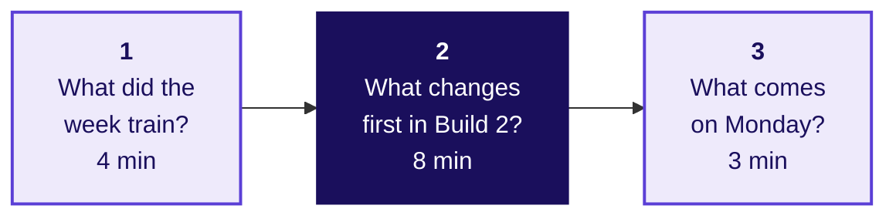
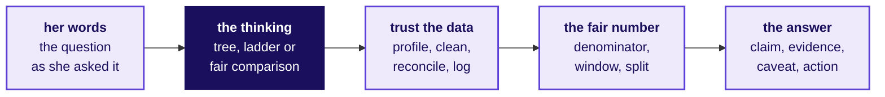
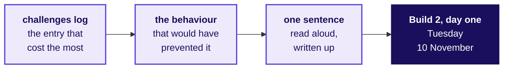
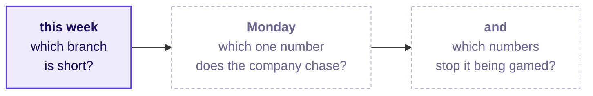

# What did Build 1 prove, and what changes first in Build 2?

Week 3, Build 1. The week close.

Kicker: WEEK 3  ·  BUILD 1  ·  THE WEEK CLOSE
Quote: Which branch of my business is short, and what do I do next?
Who: Dr Priya Menon, COO, Kalpa Health, to the data and AI team at Kalpa's Global Capability Centre

```notes
LIVE, 30 seconds, after grade closure; the last 15 minutes of the week. Four minutes on what the week
trained, eight on the nine improvements, three on Monday. Dr Menon asked which branch of her business
is short and what to tell her board, and every group gave her an answer today, before a panel that had
never seen its work. Kalpa Health and everyone in it are fictional, and every record in its files is
synthetic.
Transition: the three questions that close the week.
```

---

## S1. Three questions close Build 1 in fifteen minutes
*What did Build 1 prove, and what does each group change first in Build 2?*



Kalpa Health is the US diagnostics business the week was built on; each group's answer to its COO, Dr Menon, is its own one-slide answer, said to the panel today, and these fifteen minutes are about the method behind it.

```notes
LIVE, 30 seconds. Read the three questions. The middle one is the room's work and takes eight of the
fifteen minutes.
Transition: question 1, what the week trained.
```

---

## SECTION 1: What did the week train?
*Which moves from Weeks 1 and 2 did the week carry into a business you had never seen, and what changed on the way?*

```notes
LIVE, 4 minutes over S3, S4 and S6; D2 and D5 are read alone. Nothing new was taught this week,
and that is the point to land: the method transferred, the vocabulary changed, and the cost of an
error rose.
Transition: who needs the answer.
```

---

## D2. The same moves answered a business nobody had seen
*Who needs to know what the week trained, and which questions come on the way?*

**Who needs the answer.** Every learner, who will be asked in an interview how they handled data from a business they did not know, and whose honest answer is now a story from this week with a number in it.

```timeline
label: 1 | title: The moves | body: Which moves from Weeks 1 and 2 did the week use?
label: 2 | title: What changed | body: What changed between Kalpa Retail and Kalpa Health?
label: 3 | title: Who does it | body: Which teams in India do this work for US health care?
label: 4 | title: The questions | body: Which interview questions can you now answer from your own work? | tone: dark
```

```notes
SELF-STUDY, 1 minute. Four questions, answered in order.
Transition: the moves.
```

---

## S3. Five moves carried from Kalpa Retail into Kalpa Health
*Which moves from Weeks 1 and 2 did the week use, and what did each one do?*



| The move | Where you first met it | What it did this week |
|---|---|---|
| Translate her words into a tree, a ladder or a comparison | Week 1 Monday and Tuesday | Turned a COO's worry into a question the files could answer |
| Profile before you touch | Week 1 Wednesday | Showed what each export held before any number was trusted |
| Reconcile, and count a join before you sum it | Week 1 Wednesday; Week 2 Tuesday | Accounted for every row and dollar before any number was reported |
| Ask what the denominator holds, and compare like with like | Week 1 Monday and Thursday | Decided which rates and changes could be compared at all |
| Claim, evidence, caveat, action; restate, bound, offer the test | Week 1 Thursday and Friday | Put the answer in the order a board reads it, and held it under challenge |

```notes
LIVE, 90 seconds. Read the diagram once, left to right. Then hand each move to the groups that used
it, from the chairs' findings list in the trainer's notes: ask one group which row did the most work
for it, and take one sentence. Do not let this become a recap of every group's finding, and name no
finding a group did not reach.
Transition: what changed.
```

---

## S4. A new domain changed the words and the cost of error
*What changed between Kalpa Retail and Kalpa Health, and what stayed?*

| What | In Kalpa Retail | In Kalpa Health |
|---|---|---|
| The thing ordered | An order | A booking |
| The unit inside it | An item | A test |
| The one that did not happen | A cancellation | A no-show |
| Who pays, and when | The shopper, at the till | A plan, Medicare, Medicaid or the patient, weeks later |
| The cost of an error | A missed sale | A missed diagnosis, or a claim never paid |

**In the interview.** [S] You have joined a healthcare company; how would you apply what you did in retail to our data? [F] What changes when the cost of an error is a missed diagnosis rather than a missed sale?

```notes
LIVE, 1 minute. "The words changed and the cost of being wrong rose; the moves stayed, and that is the
week." These are Monday's two interview questions, asked again now that the room can answer them from
its own work. Take one answer to the [F] question and ask what the group checked twice because of it.
Transition: who does this work for real.
```

---

## D5. Teams in India already do this work for US health care
*Where is this week's kind of work done for real, and by whom?*

```cards
icon: building-2 | eyebrow: A health company's own centre | title: Optum India | body: UnitedHealth Group's largest Global Capability Centre, with hubs in Gurugram, Noida, Bengaluru, Hyderabad, Pune and Chennai.
icon: receipt | eyebrow: A revenue-cycle firm | title: AGS Health | body: More than 15,000 revenue-cycle professionals worldwide, with centres in Chennai, Hyderabad, Bengaluru and other Indian cities.
icon: landmark | eyebrow: Fictional, like Kalpa | title: Kalpa's GCC | body: One company's own centre in Bengaluru, serving Kalpa Health among Kalpa Group's five business units. | tone: dark
```

Claims, postings and denials read from Bengaluru for a US laboratory are the daily work of both kinds of team (UnitedHealth Group careers, India; agshealth.com; both read on 1 October 2026).

```notes
SELF-STUDY, 1 minute. Optum India calls itself UnitedHealth Group's largest Global Capability
Center, providing healthcare operations, technology, analytics and support services; AGS Health is a
revenue-cycle management firm working for US providers. Kalpa's GCC is the first kind: one company's
own centre. Monday's domain dossier, section 2, has both.
Transition: the questions the week equips you to answer.
```

---

## S6. Seven questions this week equips you to answer
*Which interview questions can you now answer from your own group's work?*

| Tag | The question |
|---|---|
| [S] | You have joined a healthcare company; how would you apply what you did in retail to our data? |
| [F] | What changes when the cost of an error is a missed diagnosis rather than a missed sale? |
| [F] | Two systems export the same entity with different id formats; how do you reconcile them? |
| [D] | State your finding in one sentence a COO can carry into a board meeting. |
| [S] | Walk me through the analysis you did on unfamiliar data and one decision you would defend. |
| [F] | Take a position in a group discussion and defend it with one number. |
| [S] | Present a finding to a panel and take a challenge on your caveat. |

**In the interview.** [S] Present a finding to a panel and take a challenge on your caveat: restate the claim with its denominator, bound it, and offer the test.

```notes
LIVE, 1 minute. Tags: [S] staple asked everywhere, [F] frequent in GCC and product screens, [D] a
differentiator, as the curriculum calibrates them for 0 to 3 year candidates in the Indian market.
Tell the room to write their own one-breath answer to each tonight, from their own group's work,
because each answer is now a true story with a number in it.
Transition: section 2, the one change per group.
```

---

## SECTION 2: What changes first in Build 2?
*What one change does each group make on day one of Build 2, and which entry in its challenges log earns it?*

```notes
LIVE, 8 minutes over S8 and S9, with D7 read alone. Two minutes in groups to agree the sentence, then
each group reads it aloud and the trainer writes all nine where the room can see them.
Transition: who needs the change.
```

---

## D7. Nine sentences become Build 2's first-day sheet
*Who needs each group's change, and which questions come on the way?*

**Who needs the answer.** Each group, on Tuesday 10 November, when Build 2 opens in Kalpa Financial Services; a change named as a feeling gives that first day nothing to do differently.

```timeline
label: 1 | title: The entry | body: Which challenges-log entry cost your group the most time?
label: 2 | title: The behaviour | body: What would your group have done that would have prevented it?
label: 3 | title: The sentence | body: How does the change read as one sentence: who, when and why?
label: 4 | title: The board | body: Where do the nine sentences go after today? | tone: dark
```

```notes
SELF-STUDY, 1 minute. Build 2 opens on Tuesday 10 November, after the Monday holiday for Diwali.
Transition: the sentence.
```

---

## S8. One improvement, one sentence, two minutes
*How does a group turn its costliest challenge into one change for Build 2?*

```code
In Build 2 we will [a behaviour] on [which day],
because this week [what it cost us, from the challenges log].
```

| A sentence nobody can act on | A sentence Build 2 can act on |
|---|---|
| We will manage our time better | We will profile every file on day one before choosing what to count, because this week we chose before we had opened two of the files |
| We will communicate better as a team | We will have each member run the notebook cold once before the freeze, because this week only one of us could |
| We will check our numbers more | We will write rows in, kept and set aside after every cleaning step, because this week a count moved and we found it on the last day |

```notes
LIVE, 2 minutes in groups, then the reading. Push back on any sentence that names a feeling or a
virtue with one question: "What would I see you doing differently on day one of Build 2?" Take the
rewrite and move on.
Transition: the nine sentences.
```

---

## S9. Nine sentences go on the board, one per group
*How does each group's change reach Build 2?*



Each group reads its sentence aloud once, exactly as written, and the sentence goes into Build 2's first-day sheet unchanged.

```notes
LIVE, 6 minutes: nine groups at about 40 seconds each. Write each sentence up exactly as said. A
sentence that blames a teammate is rewritten as the group's behaviour before it goes up.
Transition: section 3, Monday.
```

---

## SECTION 3: What comes on Monday?
*Where does Week 4 open, and which question does Meera Raghavan bring back?*

```notes
LIVE, 3 minutes over S11 and S12, with D10 read alone. The bridge is the same question moving up a
level: this week asked which branch is short, and Monday asks which one number the whole company should
chase.
Transition: who needs Monday's answer.
```

---

## D10. Meera's growth plan needs the number it chases
*Who needs Monday's answer, and which questions come on the way?*

**Who needs the answer.** Meera Raghavan, CEO of Kalpa Retail, who is building a growth plan on frequency and wants one number the whole company chases, with the numbers that stop anyone gaming it.

```timeline
label: 1 | title: Her ask | body: What does Meera ask on Monday, in her words?
label: 2 | title: What carries | body: Which move from this week carries straight into Monday?
label: 3 | title: The week in three lines | body: What does the week leave you with? | tone: dark
```

```notes
SELF-STUDY, 1 minute. Three questions, answered on the last two slides.
Transition: Meera's ask.
```

---

## S11. Monday opens back in Kalpa Retail, on Meera's number
*What does Meera ask on Monday, and which move from this week carries into it?*

**The client asks.** "One number the whole company chases, and the numbers that stop us gaming it. If the target moves and the business does not, I want to know before the board does." Meera Raghavan, CEO, Kalpa Retail



```notes
LIVE, 2 minutes. Read Meera's words from the slide. Say the three proposals without judging them:
marketing wants orders per month, operations wants app sessions, and the head of Retail-Plus wants
reorders per member. Stop there; Monday opens on it.
Transition: the week in three lines.
```

---

## S12. The week in three lines, and Monday left open
*What does Build 1 leave you with, in lines you can say aloud?*

```timeline
label: 1 | title: Count first | body: Before you explain a number, say what it counts and in which file.
label: 2 | title: Out of what | body: Every rate is out of something; say what before you compare.
label: 3 | title: Hold the caveat | body: Under challenge, restate the claim, bound it, and offer the test. | tone: dark
```

**Kavya's review.** On Monday, before anyone argues for a target, ask what its numerator and its denominator hold.

```notes
LIVE, 1 minute. Read the three lines, then Kavya's review, which is Monday's first move. Leave Meera's
question open on the slide before this one in the room's mind. After class: rest. Week 4 opens on
Monday 26 October.
```
