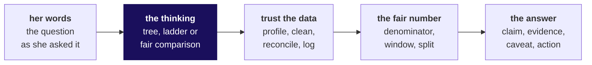
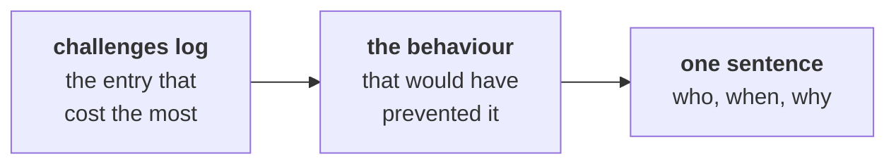
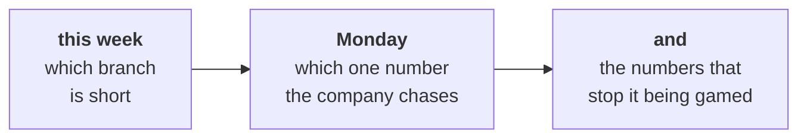

# The same method, in a business you had never seen

Week 3, Build 1. The week close.

Kicker: WEEK 3  ·  BUILD 1  ·  THE WEEK CLOSE
Quote: Which branch of my business is short, and what do I tell my board?
Who: Dr Priya Menon, COO, Kalpa Health, to the data and AI team at Kalpa's Global Capability Centre

```notes
Fifteen minutes, the last of the week. Four minutes on what the week trained, eight on the nine
improvements, three on Monday. The trainer's notes for this close, with what the room found, are
the TRAINER file beside the run sheet; say what groups found in their own words, and never list
a finding no group reached.
```

---

## SECTION 1: What the week trained
*Nothing new was taught; everything you used came from Weeks 1 and 2.*

```notes
The point to land: the method transferred. The vocabulary changed and the cost of an error
changed; the moves did not.
```

---

## S1. Five moves, carried into Kalpa Health
*Each one came from Weeks 1 and 2, and each one had work to do this week.*



| The move | Where you first met it | What it did this week |
|---|---|---|
| Translate her words into a tree, a ladder or a comparison | Week 1, Monday and Tuesday | Turned a COO's worry into a question the files could answer |
| Profile before you touch | Week 1, Wednesday | Showed what each export actually held before any number was trusted |
| Reconcile rows in against rows kept and set aside | Week 1, Wednesday; Week 2 | Accounted for every row before any number was reported |
| Ask what the denominator holds, and compare like with like | Week 1, Tuesday and Thursday | Decided which rates and changes could be compared at all |
| Claim, evidence, caveat, action | Week 1, Thursday | Put the answer in the order a board reads it |

```notes
Read the diagram left to right once. Then ask two or three groups which row did the most work for
them this week; take one sentence each. Do not let this become a recap of every group's finding.
```

---

## S2. What changed, and what did not
*A new domain changes the words and the cost of being wrong; the moves stay the same.*

| What changed | In Kalpa Retail | In Kalpa Health |
|---|---|---|
| The thing ordered | An order | A booking |
| The unit inside it | An item | A test |
| The one that did not happen | A cancellation | A no-show |
| The cost of an error | A missed sale | A missed diagnosis |

**In the interview.** [S] You have joined a healthcare company; how would you apply what you did in retail to our data? [F] What changes when the cost of an error is a missed diagnosis rather than a missed sale?

```notes
These are Monday's two interview questions, asked again now that the room can answer them from
its own work. Take one answer to the [F] question and ask what the group checked twice because of
it.
```

---

## S3. The questions this week equips you to answer
*Every one of them is a question a panel asked someone in this room.*

| Tag | The question |
|---|---|
| [F] | Two systems export the same entity with different id formats; how do you reconcile them? |
| [D] | State your finding in one sentence a COO can carry into a board meeting. |
| [S] | Walk me through the analysis you did on unfamiliar data and one decision you would defend. |
| [F] | Take a position in a group discussion and defend it with one number. |
| [S] | Present a finding to a panel and take a challenge on your caveat. |

**In the interview.** [S] Present a finding to a panel and take a challenge on your caveat: narrow the claim, give the number, and name the check that would settle the rest.

```notes
Tags: [S] staple asked everywhere, [F] frequent in GCC and product screens, [D] differentiator.
Tell the room to write their own one-breath answer to each tonight, from their own group's work,
because that answer is now a true story they can tell in an interview.
```

---

## SECTION 2: One improvement per group
*Each group names one change for Build 2, in one sentence, and all nine go on the board.*

```notes
Eight minutes. Two minutes in groups to agree the sentence, then each group reads it aloud and the
trainer writes all nine where the room can see them.
```

---

## S4. One improvement, one sentence
*In groups, two minutes: agree the one change your group makes first in Build 2.*

**The claim.** In Build 2 we will [a behaviour] on [which day], because this week [what it cost us, from the challenges log].

| A sentence nobody can act on | A sentence Build 2 can act on |
|---|---|
| We will manage our time better | We will profile every file on day one before choosing our sub-question, because this week we chose it before we opened two of the files |
| We will communicate better as a team | We will have each member run the notebook cold once before the freeze, because this week only one of us could |
| We will check our numbers more | We will write rows in, kept and set aside after every cleaning step, because this week a count moved and we found it on the last day |



```notes
Push back on any sentence that names a feeling or a virtue. Ask: what would we see you doing
differently on day one of Build 2? The nine sentences go into Build 2's first-day sheet.
```

---

## SECTION 3: Monday
*Week 4 opens back in Kalpa Retail, where Meera's growth plan needs its metric.*

```notes
Three minutes. The bridge is the same question moving up a level: this week asked which branch is
short; Monday asks which one number the whole company should chase.
```

---

## S5. Back in Kalpa Retail, with Meera's growth plan
*She has a plan built on frequency, and three departments each want their own number as its target.*

**The client asks.** "One number the whole company chases, and the numbers that stop us gaming it. If the target moves and the business does not, I want to know before the board does." Meera Raghavan, CEO, Kalpa Retail



**Kavya's review.** The move you made all week carries straight in: before anyone argues for a target, ask what its numerator and denominator hold.

```notes
Say the three proposals without judging them: marketing wants orders per month, operations wants
app sessions, and the head of Retail-Plus wants reorders per member. Stop there; Monday opens on it.
After-class: rest.
```
