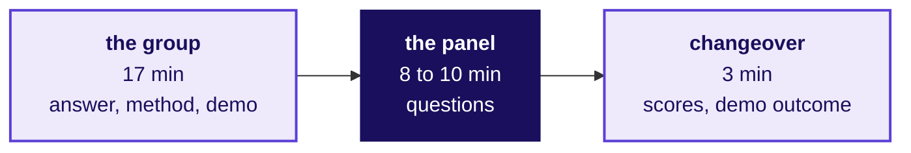

# Run sheet, Build 1 Saturday: how is every group heard, every grade closed and one change per group named for Build 2?

**TRAINER ONLY.** This page names what is planted in Build 1's data, with its numbers. Nothing on it
reaches a learner.

Posts to <!-- sync:module:W03/SAT -->Module 1: Foundations of AI and Data<!-- /sync:module:W03/SAT -->, on <!-- sync:day-date:W03/SAT -->Sat 24 Oct 2026<!-- /sync:day-date:W03/SAT -->.

There is no IITGN faculty block on this day. Build 1 is the programme's first build week: Kalpa
Health, a fictional US diagnostics business run from Kalpa's Global Capability Centre (GCC) in
Bengaluru, whose COO, Dr Priya Menon, asked why test volumes grew 5 percent from Q2 to Q3 of 2026
against a plan of 18, and which branch of her business is short. Nine groups of learners each took
one of her heads' five questions on Monday and answered it with the Weeks 1 and 2 method, on ten
synthetic data files exported on Friday 16 October 2026. Today is expert day two: the last group
discussions (GDs), every remaining presentation with a live demo, every Build 1 grade closed, and
one improvement per group named for Build 2. Nothing is taught. The approved spine,
`docs/detailing/W03_build1_spine.md`, sets the day.

**Who needs the answer.** The Programme Head, who runs the day and closes the grades; the industry
expert and the senior industry leader, who chair the two panels; the Principal Advisor, online for a
GD round; the trainer and the Academic TA, who scribe, keep time and run the close. A day that runs
late cuts the last groups' questions or pushes closure past the leader's flight, and a grade closed
on a wrong cell reaches a learner's record.

**The questions on the way.** Which questions does the day answer, in order? Where does Saturday
start and stop? Who runs what? How does one slot run? How do the rooms fill the 300 minutes? How does
a demo run cold, and what if it fails? How are scores recorded as the day rolls? What is planted, and
how does a chair recognise a finding? How do the grades close in 30 minutes? How does the week close
run? How does the interview question sound in one breath? What moves when the day goes wrong? Which
file serves which moment, and what follows the day?

## Which questions does Saturday answer, in the order the day asks them?

**Who needs the answer.** Every member of staff, before the opening: each part of the day answers
one question, and a part that wanders from its question eats another part's minutes.

**The questions on the way.** What is the day's question? Which questions does each slot answer?
Which questions close the day?

The day's question, in the room's words: **which branch of Kalpa Health is short, and does our
answer hold when a panel tests it live on the raw files?**

| Order | The question | Who asks it | Where it is answered |
|---|---|---|---|
| 1 | What did you find? | Dr Menon, through the panel | The group's one-slide answer, in its first two minutes |
| 2 | How sure are you? | The panel | The data made trustworthy, the analysis and the live demo |
| 3 | What would change your mind? | The panel's caveat challenge | The group's caveat, defended by every member |
| 4 | What do I do on Monday? | Dr Menon, through the panel | The action on the one-slide answer |
| 5 | Does every learner hold all their Build 1 scores? | The Programme Head | Grade closure, 30 minutes |
| 6 | What does each group change first in Build 2? | The trainer | The week close, 15 minutes |
| 7 | What comes on Monday? | The trainer | The bridge to Week 4, back in Kalpa Retail |

Questions 1 to 4 are Dr Menon's four, in the order the presentation format deck,
`slides/C2_W03_SAT_presentation_format_STUDENT.md`, teaches the groups to answer them. The chair asks
the group each one if the group has not answered it by the end of its 17 minutes.

## What does Saturday start from, and where does it stop?

**Who needs the answer.** The Programme Head, who decides what to cut when the day runs late.

**The questions on the way.** What is already done? How far does the day go? What must it not do?
What comes after it? What is cut first?

| | |
|---|---|
| **Start from** | Every group has its claim from Wednesday, its Mock R1 from Thursday, and its build frozen at Friday's close, with two cold runs logged. Seven GD rounds and a first tranche of up to three presentations ran on Friday, and Friday's close drew Saturday's presentation order (`content/W03/D5/trainer/C2_W03_D05_day_sheet_TRAINER.md`). |
| **Go as far as** | Every group presented, demoed live and defended; every learner holds a GD score, a mini project score in its two parts, and a Mock R1 score, or a recorded absence; the grades closed and signed; one improvement per group written up for Build 2. |
| **Stop before** | Any teaching, any finding named in the room, and any score read aloud. |
| **Comes later** | Week 4 Monday, 26 October: back in Kalpa Retail, where Meera Raghavan's growth plan needs its metric. |
| **Cut first** | A room's reserve, then the changeover from three minutes to one, then the week close from 15 minutes to 10. Never a group's question time below 8 minutes, never grade closure below 20, and never a group moved out of its sub-problem's run. |

The day stops when the closure is signed and the nine improvements are on the board.

## Who runs what today?

**Who needs the answer.** Each role, so that nobody scores, scribes or keeps time for two rooms at
once.

**The questions on the way.** Which role chairs, scribes, keeps time, checks machines and closes?

| Role | Today |
|---|---|
| The Programme Head | Runs the day, assigns the rooms, settles anything disputed after the room, and owns grade closure |
| The industry expert | Chairs the expert's room and the in-room GD rounds that remain |
| The senior industry leader | Flies in for the day and returns the same day; chairs the leader's room |
| The Principal Advisor | Online; runs a remaining GD round in parallel where the roster needs it |
| The trainer | Scribe and timekeeper in the expert's room; copies GD and mini project scores into the closure workbook; runs the week close |
| The Academic TA | Scribe and timekeeper in the leader's room; checks each demo machine before its slot; sits in on the separate questions to quiet members |

Each panel reads its pages of the question bank, `trainer/C2_W03_SAT_question_bank_TRAINER.md`,
before the first slot: about 15 minutes for its own sub-problems and the headline.

## How does one presentation slot run?

**Who needs the answer.** Both scribes, who keep the clock, and both chairs, who keep the questions.

**The questions on the way.** How are the 30 minutes split? What does the scribe say at 17? How is a
quiet member questioned?

| Part | Minutes | Who keeps it |
|---|---|---|
| The group's presentation, its live demo inside it | 17, a hard stop | The scribe shows a card at 5 minutes left and at 1 minute left, and stops the group at 17 |
| The panel's questions | 8 to 10 | The chair: at least four questions, by the question bank's third rule |
| The changeover: the chair scores, the scribe records the demo's outcome, the next group sets up | 3 | The scribe |
| **The slot** | **28 to 30** | |

**Words for the scribe at 17 minutes:** "Time for the group. The panel's questions now; the group keeps
its full question time."

**Quiet members.** During questions the chair names the member who has spoken least for the
quiet-member question in the bank, and the rest of the group stays silent while that member answers.
A member who still cannot answer is flagged on the scribe's list, and the same panel questions that
learner alone, for up to five minutes, in the room's next reserve, before that learner's
presentation and defence score is entered. The group's 34 marks do not wait.

A slot is 17 minutes of the group's answer, 8 to 10 of the panel's questions and 3 of changeover:
28 to 30 minutes.

## How do the two rooms fill the 300 minutes?

**Who needs the answer.** The Programme Head, before the room opens, and both chairs, who need to
know when they stop.

**The questions on the way.** Which groups go to which room? What does the likely Saturday look like?
What does the heaviest Saturday look like? When can the leader leave?

**The room rule.** Keep each sub-problem's groups together, in one room and back to back, so a panel
hears the honest alternatives on one question in sequence. Balance the rooms to within one group, and
give the leader's room the larger share, since the expert's room runs the GD rounds first. Where it
can be done without splitting a sub-problem, put sub-problems 1 (revenue) and 5 (the offer) before
the leader, whose questions are a board's, and 2 (bookings), 3 (billing) and 4 (no-shows) before the
expert. The allocation of groups to questions was the Programme Head's on Monday, so this sheet
assumes none, and Friday's draw already keeps the two Saturday GD groups out of their room's first
two slots.

The day runs a morning of 180 minutes and an afternoon of 120, with lunch between them, 300 minutes
of room time (`data/programme/facts.yaml`).

### What does the likely Saturday look like?

Friday's pack runs seven GD rounds and a first tranche of three presentations, so Saturday holds two
GD rounds and six presentations: 180 panel-minutes, 90 per room.

| Minutes | The leader's room | The expert's room |
|---|---|---|
| Morning 0 to 10 | The opening, both rooms together | (together) |
| 10 to 40 | Slot 1 | GD round 8 with the expert; GD round 9 online with the Principal Advisor at the same time |
| 40 to 70 | Slot 2 | Slot 1 |
| 70 to 100 | Slot 3 | Slot 2 |
| 100 to 130 | Reserve: quiet members' questions; the leader signs the room's scores | Slot 3 |
| 130 to 160 | The leader's work is done | Reserve: quiet members' questions; GD scores entered |
| 160 to 180 | Reserve for either room | Reserve for either room |
| Afternoon 0 to 30 | Grade closure, together | |
| 30 to 45 | The week close, together | |
| 45 to 120 | Reserve; unused, the day ends at 45 | |

### What does the heaviest Saturday look like?

Nobody presented on Friday and three GD rounds remain, so nine groups present today. How it runs
depends on the shape of Monday's allocation.

**Five questions, clusters of 2, 2, 2, 2 and 1.** Slots stay at 30 minutes.

| Minutes | The leader's room | The expert's room |
|---|---|---|
| Morning 0 to 10 | The opening, together | (together) |
| 10 to 160 | Five slots: two clusters of two and the single group | GD rounds 10 to 70: two with the expert, one online with the Principal Advisor from minute 10; then three slots, 70 to 160 |
| 160 to 180 | Reserve: quiet members; the leader signs | Reserve: quiet members; GD scores entered |
| Afternoon 0 to 30 | The leader joins the expert's room as a second pair of ears if still on campus | Slot 4, the last of its second cluster |
| 30 to 60 | Grade closure, together | |
| 60 to 75 | The week close, together | |
| 75 to 120 | Reserve; unused, the day ends at 75 | |

**Three questions, clusters of 3, 3 and 3.** Two clusters of three need 180 minutes at 30-minute
slots, which one morning cannot hold beside the opening, so every slot runs 28 minutes (17, then 8
of questions, then 3).

| Minutes | The leader's room | The expert's room |
|---|---|---|
| Morning 0 to 10 | The opening, together | (together) |
| 10 to 178 | Two clusters, six slots of 28 | GD rounds 10 to 70 as above; one cluster, three slots of 28, 70 to 154 |
| to 180 | The leader signs the room's scores | 154 to 180: reserve, GD scores entered |
| Afternoon 0 to 30 | Quiet members' questions for both rooms, then every score entered | |
| 30 to 60 | Grade closure, together | |
| 60 to 75 | The week close, together | |
| 75 to 120 | Reserve; unused, the day ends at 75 | |

The morning has no slack in this shape, so its overrun rule is strict: question time stops at 8
minutes, and anything the morning cannot hold moves to the afternoon's first 30.

**The opening, in words the Programme Head can say.** "Every group presents once, for 17 minutes,
with a live demo run cold on its raw files; a demo that fails has two minutes to recover, and after
that the group presents from its executed notebook. The panel then asks for eight to ten minutes, and
the panel chooses who answers. Where groups took the same question, they present one after the other,
so the panel hears more than one honest answer to it. Nobody hears anything about another group's
work until the week close."

At the likely load each room hears three groups in 90 minutes, and at the heaviest the leader's room
hears five or six and the expert's room four or three, with closure after lunch in every shape.

## How does a demo run cold, and what happens when it fails?

**Who needs the answer.** The Academic TA, who prepares every machine, and each chair, who applies
the rule in the minute it is needed.

**The questions on the way.** What is checked before the room opens? What is checked before each
slot? What is the rule when a demo fails? What if the machine, rather than the code, fails?

| Before | Who | Done when |
|---|---|---|
| The room opens: run the demo from the frozen commit for any group with no second cold run logged on Friday, as Friday's freeze requires; this is a rehearsal, and the group's one run before the panel is still to come | The Academic TA | Every group has a logged cold run on its frozen commit |
| The room opens: open each group's demo machine on a fresh Codespace at its frozen commit, the raw files in its data folder, and leave the notebook unrun | The Academic TA | Every group has a cold machine on its frozen commit |
| Each slot: check `git rev-parse HEAD` against Friday's freeze table | The Academic TA | The hash matches, or the panel has seen the difference and ruled on it |

**The rule, word for word**, which the orchestrating session set on 29 September 2026 for both expert
days: a group's demo runs once, cold, on its raw files. If it fails, the group has two minutes to
recover it live, as it would in front of a client. If it still fails, the group presents from its
executed notebook, and the panel scores the live demo in presentation and defence as not run cold.
The other 34 marks of the mini project are scored from the executed run, so a failed demo costs its
own marks and never the analysis.

**When the machine fails before the code runs.** If the hardware or the Codespace fails before the demo starts, the
Academic TA swaps in a spare machine; if none works, the group presents, and its demo runs cold in the
room's reserve before the same panel. Until it runs, the chair records "machine failed: demo waits for
the reserve", and no member's presentation and defence is scored.

A demo that still fails after its two minutes costs presentation and defence its demo and leaves the
group's 34 to the executed run.

## How are scores recorded as the day rolls?

**Who needs the answer.** Each chair and scribe, after every slot: a panel that scores six groups from
memory at the end of the morning scores the last two against the first four.

**The questions on the way.** Who scores what, where and when? What does the approved rubric say?
Where does a missed plant show, and where does a quiet member show?

| Step | Who | Where |
|---|---|---|
| The chair records the demo's outcome: ran cold, recovered within two minutes, still failed and presented from the executed notebook, or a machine failure waiting for the reserve | The chair, in the changeover | `rubrics/C2_W03_SAT_mini_project_scoring_TRAINER.xlsx`, sheet Groups, column Demo on the day |
| The chair scores the four group criteria once, out of 34, from the executed run whatever the demo did, and each learner's presentation and defence out of 6; the sheet flags full marks on presentation and defence after a demo that still failed | The chair, in the changeover, never in front of the group | The same workbook, sheets Groups and Learners; Friday's first tranche is already in it |
| The scribe copies each learner's group part and presentation and defence once into the closure workbook, and each group's demo outcome into its Demos sheet | The trainer in the expert's room, the Academic TA in the leader's room | `rubrics/C2_W03_SAT_grade_closure_TRAINER.xlsx`, sheets Scores and Demos |
| Each Saturday GD round is scored per learner, then each GD total out of 30 is copied once | The expert or the Principal Advisor scores; the trainer copies | Friday's sheet, `content/W03/D5/rubrics/C2_W03_D05_gd_scoring_sheet_TRAINER.xlsx`, then the closure workbook's GD column |
| A learner flagged quiet is questioned in the reserve before that learner's presentation and defence score is entered | The chair, with the scribe | Learners, then the closure workbook |

The requester approved Build 1's rubrics on 29 September 2026, and learners may see them:

<!-- sync:rubric:W03/mini-project -->
**Mini project, 40 marks.** The first four criteria are scored once for the group, and every member receives those 34 marks; presentation and defence is scored for each learner on 6 marks, so a silent teammate cannot ride the group's score.

| Criterion | Marks | What full marks look like |
|---|---|---|
| The question translated | 8 | Dr Menon's words are mapped to the right Weeks 1 and 2 method, with the metric defined and the decision it feeds named. |
| The data made trustworthy | 10 | The data is profiled before it is touched, every cleaning call is in the decisions log with its reason, and counts and dollars reconcile across files. |
| The analysis | 10 | The tree, ladder or fair comparison reaches the branch that explains the symptom, on the right denominator, with a chance test where one is needed. |
| The claim | 6 | One sentence carries its number, denominator, period and caveat, plus an action Dr Menon can take. |
| Presentation and defence | 6 | The live demo runs cold, and every member answers a challenge on the caveat. |
<!-- /sync:rubric:W03/mini-project -->

A missed plant shows in the group part, under the data made trustworthy and the analysis; a quiet
member shows only in that member's presentation and defence. How many marks below full a failed demo
costs is the panel's call: the sheet stops full marks and sets no number.

Every score is entered once, in the changeover after its slot, and the closure workbook receives it
from the scoring sheet.

## What is planted in the files, and how will a chair recognise a finding?

**Who needs the answer.** Both chairs and the trainer, who must recognise a finding when a group
describes it in its own words, and never name one a group did not reach.

**The questions on the way.** What is planted for each question, with its numbers? Which question
shows whether a group found it? What happens when nobody found it?

Every number here is recomputed from the ten files by `internal/C2_W03_SAT_witness_INTERNAL.py`,
which checks each against the spine and ends `RESULT: PASS`. The question bank carries each one in
full, with the questions in rising order. Percentages are changes from Q2 to Q3 unless the row says
otherwise.

| Question | What is planted | The numbers | The question that shows it |
|---|---|---|---|
| The headline, every group | Dr Menon's 5 percent counts retail tests booked in the old booking system only, a panel as its component tests | 5.1 percent on the dashboard's count (23,213 to 24,406 tests); 7.8 percent in tests booked across both systems, 8.6 in tests performed and 5.6 in bookings; all without the employer contract, whose 1,200 screenings of 5 tests add 6,000 tests to Q3 | "Dr Menon's 5 percent: what does it count, and did you reproduce it?" |
| 1 Revenue | One employer wellness contract in Q3, and panels billed as one claim line | Claim KH-CLM-007802, $180,000, 14.6 percent of Q3's $1,231,001 billed; billed charges grow 26.9 percent with it and 8.3 without; Q3 mean claim $210.50 with it and $179.75 without, median $150; 22,152 claim lines bill 46,867 tests on completed bookings; 60 amounts are text, such as "$265.00" | "What is the single largest claim in Q3, and what does your growth become without it?" |
| 2 Bookings | Chicago and Philadelphia moved to a new booking system on 18 September; the old export carries only its own bookings, repeats 180 ids, and the new system writes dates month first | The two metros fall 23.0 percent in the old export (1,415 to 1,090) and 12.2 percent across both systems (1,415 to 1,243) | "Show me bookings in the two metros day by day for September. What happens on the 18th?" |
| 3 Billing | Postings keyed as bare digits or CLM-numbers; duplicate ERA loads double-post; the employer claim has no posting; denials post with nothing paid | An exact join matches 216 of 11,343 postings, 1.9 percent, and every posting once normalised; 280 double posts worth $19,204.63; 105 reversals; 398 claims with no posting, $253,165; 1,175 retail claims denied, 10.4 percent; $801,314 collected net of double posts on $2,201,099 billed | "What share of postings matched on your first join, and what did you do next?" |
| 4 No-shows | KH-ATL-03 runs by appointment while the other centres' visits include walk-ins; the register is drawn from the bookings, so a rebooked patient's missed slot is a row beside the kept one | 18.8 against 7.9 percent on all visits; 19.0 percent (15 of 79 scheduled slots, beside 1 walk-in) against 15.1 on scheduled visits, a gap chance gives with probability 0.21 | "What is in the denominator of your no-show rate?" |
| 5 The offer | The offer went at random to half the patients in Dallas, Atlanta and Phoenix, metros already rising, and to a fifth elsewhere; inside those three metros an offered patient booked less | Offered patients book 9.0 percent more overall and less in every campaign metro (Dallas 10.8, Atlanta 19.9, Phoenix 13.0 percent less); the three metros rose 6.9 percent in the two months before the offer; New York's 23.5 percent more is chance, p about 0.03 | "Is the 9 percent the same inside each metro?" |

**When nobody found it.** The chair asks the question once and lets the answer stand; nothing is said
in the room. The chair's findings list for the week close records the group as having stopped at the
first cut, and the trainer names only what groups found. For Build 2's first-day sheet the Programme
Head may note the move the room missed, such as "profile every system's export before counting",
never the plant.

Each question's plant is one plausible wrong number and one Weeks 1 and 2 move that exposes it, and
the chair's job is to hear which of the two a group brought.

## How do the grades close in 30 minutes?

**Who needs the answer.** The Programme Head, who signs the closure, and every learner, whose Build 1
record depends on one cell typed right.

**The questions on the way.** Which components close today? Which step runs in which minutes, and
how does each one end? What is never done with the workbook?

The graded components that close today are the GD score, the mini project score including the
presentation, and the Mock R1 score. The closure workbook takes the mini project in its two parts,
the group's 34 and the learner's 6, so the demo rule holds at closure too.

| Minutes | Step | Who | The check that says it is done |
|---|---|---|---|
| 0 to 5 | Both scribes confirm every slot and every GD round is entered and every group's demo outcome is final on Demos, then read out each seat whose status is not COMPLETE | The trainer and the Academic TA | The Checks sheet lists each seat that is short, by seat, and each seat with an absence |
| 5 to 15 | Every flag is cleared at its source: MISSING means find the signed sheet and enter it; OVER MAX or NOT A SCORE means re-read the signed sheet and correct the one cell; DEMO RULE means the chair re-scores that learner's presentation and defence below full marks | The Programme Head, with the scribe who entered it and the chair | The Checks sheet's MISSING, OVER MAX, NOT A SCORE and DEMO RULE counts are all zero |
| 15 to 20 | A learner who missed an event has ABSENT typed in that event's cell and the Programme Head's decision in Notes; no make-up rule is published, so the sheet sets none | The Programme Head | Every seat listed with an absence carries a note |
| 20 to 25 | Each assessor role marks its row signed on the Sign-off sheet: the GD assessors, both panels and the mock assessors | Each assessor present; the Programme Head signs for any who have left, from their signed paper sheets | The Checks verdict reads READY TO SIGN |
| 25 to 30 | The Programme Head signs the closure and saves the signed copy where the programme keeps its grade records | The Programme Head | The Sign-off sheet reads CLOSED |

**Never commit the filled workbook to this repository.** It holds learners' scores, and the
repository is public. The committed file is the empty template, 35 seats and no names.

**No score is read aloud in the room.** How and when a learner sees their Build 1 scores is the
Programme Head's decision, and no source in this repository sets it.

Closure is done when the Sign-off sheet reads CLOSED, after 30 minutes at most.

## How does the week close run in 15 minutes?

**Who needs the answer.** The trainer, who runs it, and the room, which leaves with one change to make
in Build 2.

**The questions on the way.** What runs in each part of the 15 minutes, and from which files?

The deck is `slides/C2_W03_SAT_week_close_STUDENT.md`; the trainer's notes for it, with what the room
found and the words to say, are `trainer/C2_W03_SAT_week_close_notes_TRAINER.md`.

| Minutes | What happens |
|---|---|
| 0 to 4 | What the week trained: the same moves from Weeks 1 and 2, in a business nobody had seen |
| 4 to 12 | One improvement per group for Build 2: each group says its one change in one sentence, and the trainer writes all nine where the room can see them |
| 12 to 15 | The bridge: Monday is Week 4, back in Kalpa Retail, where Meera's growth plan needs its metric |

The close ends on nine sentences on the board and Monday's question left open.

## How does the interview question sound in one breath?

**Who needs the answer.** The trainer, who models it if the room asks, and the chairs, who hear it
done well or badly all day.

**The questions on the way.** What is the row's question, and what does a strong answer do?

**[S]** Present a finding to a panel and take a challenge on your caveat.

**A strong answer, in the trainee's voice.** "On Saturday I told the panel that bookings in Chicago and
Philadelphia fell 12.2 percent from Q2 to Q3 across both booking systems, against the 23.0 the old
export shows, so the operations head should not cut staff on the larger number. The expert challenged
my caveat: had we counted a booking twice, once in each system? I restated the claim with its count,
1,415 bookings in Q2 against 1,243 in Q3; I bounded it, since the old system stops on 17 September,
the new one starts on the 18th, and no id appears in both; and I offered the test, a match on patient
and date, which we had run and which found no booking in both systems. The claim stood, and I said
what it cannot show: why patients booked less."

What makes it strong: the claim with its denominator first, then Week 1 Friday's three moves (restate,
bound, offer the test), and the edge of the evidence said before anyone else says it.

## What moves when the day goes wrong?

**Who needs the answer.** The Programme Head, in the minute it goes wrong.

**The questions on the way.** What is cut first? What does each failure move?

| What happens | What moves |
|---|---|
| A group runs past 17 minutes | The scribe stops it at 17; the group keeps its question time, and nothing else in the room moves |
| A room is 10 minutes behind after two slots | The changeover drops to one minute for the rest of the morning, and scores go into the reserve |
| A room is 20 minutes behind at the end of the morning | The reserve absorbs it; at the likely load each room has at least 50 minutes of reserve, and in the heaviest shapes the afternoon's first 30 does |
| A GD round overruns | The next GD starts late and the expert's first slot slides with it; the leader's room does not move |
| More GD rounds remain than this sheet plans | The Principal Advisor runs each extra round online, in parallel with the expert's, from minute 10 |
| The leader is not in the room at the opening | The expert starts presentations in the expert's room at once, and the Principal Advisor takes the GDs online. The leader's room starts on arrival and slides by the delay: up to 30 minutes fits the likely load's reserve, and up to 20 the heaviest |
| The leader cannot come at all | The expert hears every group alone, the GD rounds go online with the Principal Advisor one after another from minute 10, the GD groups take the expert's last slots, and slots shrink: six slots of 28 run from minute 10 to 178 at the likely load; at the heaviest, nine slots of 26 (17, the full 8 of questions, a one-minute changeover) run six in the morning and three in the afternoon's first 78 minutes, closure keeps its 30 and the week close runs in 10 |
| The leader has to leave before the last slot | The leader's unheard groups move to the expert's room after its own slots, before closure; the leader signs the scores already given before leaving |
| A demo machine fails before the demo starts | A spare machine; if none works, the demo runs cold in the room's reserve, before the same panel |
| A group's demo code fails on its one run | The rule holds: two minutes to recover live, then the executed notebook, the live demo scored as not run cold, and the 34 scored from the executed run |
| A learner is absent | The group presents without them; at closure the event's cell reads ABSENT, and the Programme Head records the decision in Notes |
| A group disputes a score in the room | Nothing is argued in the room. The Programme Head notes the dispute and handles it after closure |
| The group count is not nine | The day holds nine groups. At the tracker's fifteen (`data/programme/facts.yaml`, conflict `groups`) it does not fit 300 minutes, and the Programme Head decides the cut before Friday's close |

Cut in this order and stop as soon as the room is back on time: the reserve, the changeover, the
week close's 15 minutes down to 10.

## Which file serves which moment of the day?

**Who needs the answer.** Whoever is holding the room when a file is needed.

**The questions on the way.** Which file goes with which part of the day, and who has it open?

| Moment | File | Who has it open |
|---|---|---|
| Before the room opens | This run sheet; Friday's freeze table and drawn order in `content/W03/D5/trainer/C2_W03_D05_day_sheet_TRAINER.md` | The Programme Head, the Academic TA |
| The panels' preparation | `trainer/C2_W03_SAT_question_bank_TRAINER.md` | Both chairs |
| Every slot | The group's own deck, notebook and files; the presentation format, `slides/C2_W03_SAT_presentation_format_STUDENT.md`, which the groups built on | The group; the chair may glance at the format |
| Every changeover | `rubrics/C2_W03_SAT_mini_project_scoring_TRAINER.xlsx` | The chair and the scribe |
| The Saturday GD rounds | The GD cards, the facilitation notes and the GD scoring sheet in `content/W03/D5/gd/` and `content/W03/D5/rubrics/` | The expert, the Principal Advisor |
| Grade closure | `rubrics/C2_W03_SAT_grade_closure_TRAINER.xlsx` | The Programme Head, both scribes |
| The week close | `slides/C2_W03_SAT_week_close_STUDENT.md` and `trainer/C2_W03_SAT_week_close_notes_TRAINER.md` | The trainer |
| Checking a number | `internal/C2_W03_SAT_witness_INTERNAL.py` | Anyone |

## What follows the day?

**Who needs the answer.** The Programme Head and whoever builds Build 2's first day.

**The questions on the way.** Where do the improvements, the flags and the board card go?

| What | Who |
|---|---|
| The nine improvements, as written on the board, go into Build 2's first-day sheet | The trainer |
| The flagged-quiet list, the absences and the signed workbook go to the Programme Head | The Academic TA |
| The day's board card moves on once the orchestrating session has reviewed the pack: `python3 scripts/board_sync.py --status W03/SAT review-1` | The orchestrating session |

Build 1 is closed when the workbook reads CLOSED and the nine improvements are in Build 2's first-day
sheet.
