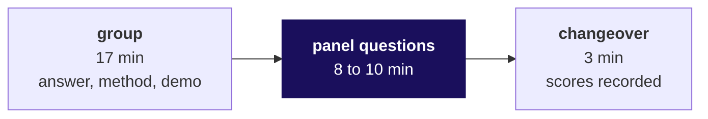
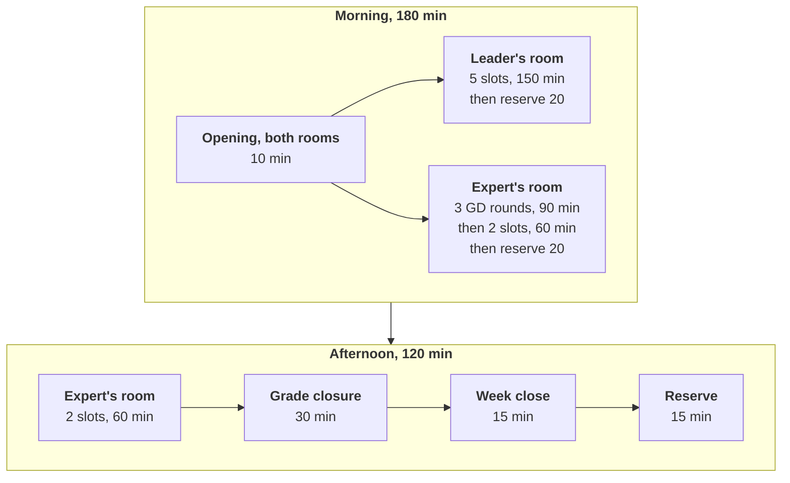

# Run sheet: Week 3, Saturday. Dr Menon's answers, and Build 1 closes

**TRAINER ONLY.** Nothing on this page reaches a learner.

Posts to <!-- sync:module:W03/SAT -->Module 1: Foundations of AI and Data<!-- /sync:module:W03/SAT -->, on <!-- sync:day-date:W03/SAT -->Sat 24 Oct 2026<!-- /sync:day-date:W03/SAT -->.

| | |
|---|---|
| **The day** | Dr Menon's question gets its answers. The remaining GD rounds close, every group presents with a live demo before one of two panels, scores roll as each slot ends, every Build 1 grade closes, and each group names one improvement for Build 2. |
| **Length** | 300 minutes of room time (`data/programme/facts.yaml`), run here as a morning of 180 and an afternoon of 120 with lunch between them. A build week's Saturday carries no recap paper, no Kahoot and no practice set. |
| **Who** | The Programme Head runs the day and owns grade closure. The industry expert chairs one panel and the remaining GDs; the senior industry leader, who flies in for the day and returns the same day, chairs the other panel. The Principal Advisor takes GD rounds online where the roster needs it. The trainer scribes for the expert's room and runs the week close; the Academic TA scribes for the leader's room, checks demo machines and runs the separate questions for silent teammates. |
| **Nothing is taught** | The only teaching moment is the week close, which names what the week trained and hands the room to Week 4. |
| **Interview angle** | [S] Present a finding to a panel and take a challenge on your caveat. |

**What each panel member reads before the first slot:** the question bank,
`trainer/C2_W03_SAT_question_bank_TRAINER.md` (ten minutes for their own sub-problems, five for the
headline), and the presentation format the groups built on,
`slides/C2_W03_SAT_presentation_format_STUDENT.md`, so they know the 17 minutes the group holds.

---

## The slot, which is the same in both rooms

| Part | Minutes | Who keeps it |
|---|---|---|
| The group's presentation, with its live demo inside it | 17, a hard stop | The room's scribe holds up a card at 15 and stops the group at 17 |
| The panel's questions | 8 to 10 | The panel chair; at least four questions, per the question bank's rule 3 |
| Changeover, while the panel records each learner's score and the next group sets up | 3 | The scribe |
| **The slot** | **28 to 30** | |

**Words for the scribe at 17 minutes:** "Time for the group. The panel's questions now; the group keeps
its full question time."

**Silent teammates.** During questions the chair names the member who has spoken least for the
silent-teammate question in the bank, and the rest of the group stays silent while that member
answers. A member who still cannot answer is flagged by the scribe on the room's list, and the same
panel questions that learner separately, alone, for up to five minutes in the room's next reserve
(see the timelines), before that group's scores are final.

---

## Before the day opens

| Step | Who | Done when |
|---|---|---|
| Read the presentation order drawn at Friday's close, strike the groups that presented Friday, and assign the rest to the two rooms by the rule below | Programme Head | Both room orders are printed and on each panel's table |
| Enter Friday's GD scores and Thursday's mock scores into the grade closure workbook from the signed sheets | Programme Head, with the Academic TA reading the sheets aloud | The workbook's Checks sheet shows no MISSING in the GD column for Friday's groups and none in the mock column |
| Open each group's demo machine on a fresh Codespace with the raw files in the data folder, and leave it closed and cold | Academic TA | Every group has a machine, and none has run the notebook |
| Put the question bank in front of each panel, marked with that room's sub-problems | Trainer | Each panel member has read their pages |

**The room rule.** Keep every sub-problem's groups together on one panel and back to back, so a
panel hears the alternate claims on one question in sequence. Balance the two rooms to within one
group, and give the leader's room the larger share, because the expert's room runs the remaining GDs
first. Where it can be done without splitting a sub-problem, put sub-problems 1 (revenue) and 5
(campaign) before the leader, whose questions are the board's, and 2 (bookings), 3 (billing) and 4
(no-shows) before the expert. The allocation that decides the clusters was made by the Programme Head
on Monday; this sheet does not assume it.

---

## Plan A: the clusters are 2, 2, 2, 2 and 1 (every sub-problem covered by nine groups)

The planning case assumes nobody presented on Friday and three GD rounds remain, which is the
heaviest Saturday the week can hand over. Every group Friday took off frees one slot of 30 minutes in
its room.

| Minutes from the start | Leader's room | Expert's room |
|---|---|---|
| 0 to 10 | Opening, together: the order, the slot, the demo rules, and the silent-teammate rule said aloud | (together) |
| 10 to 160 | Five slots of 30: the larger two clusters and the single group, or the cluster the room rule gives | GD rounds, 10 to 100: three of 30 minutes each |
| | | Two slots of 30, 100 to 160: the first cluster of two |
| 160 to 180 | Reserve: silent-teammate follow-ups, the leader's scores finalised and signed | Reserve: silent-teammate follow-ups, the GD scores entered |
| Lunch | The leader's scoring is complete; the leader may leave for the flight from here | |
| Afternoon 0 to 60 | The leader joins the expert's room if still on campus, as a second pair of ears; the expert's scores stand | Two slots of 30: the second cluster of two |
| 60 to 90 | Grade closure, together (steps below) | |
| 90 to 105 | Week close, together | |
| 105 to 120 | Reserve for anything that ran over; unused, the day ends here | |

**The opening, in words the Programme Head can say.** "Every group presents once, for 17 minutes,
with a live demo run cold on the raw files. The panel then asks for eight to ten minutes, and the
panel chooses who answers. Where two groups took the same sub-problem, they present one after the
other, so the panel hears two honest answers to the same question. Nobody is told anything about
another group's work until the week close."

## Plan B: the clusters are 3, 3 and 3 (three sub-problems, three groups each)

Three-group clusters need 90 minutes each at 30-minute slots, and two of them do not fit one
morning. So Plan B runs the slot at 28 minutes (17, then 8 of questions, then 3) and opens in five.

| Minutes from the start | Leader's room | Expert's room |
|---|---|---|
| 0 to 5 | Opening, together | (together) |
| 5 to 173 | Two clusters, six slots of 28: cluster one, then cluster two | GD rounds, 5 to 95: three of 30 minutes each |
| | | One cluster, three slots of 28, 95 to 179 |
| to 180 | The leader's scores signed | The expert's scores recorded |
| Afternoon 0 to 30 | Silent-teammate follow-ups for both rooms, then every score entered | |
| 30 to 60 | Reserve for anything the morning pushed | |
| 60 to 90 | Grade closure, together | |
| 90 to 105 | Week close, together | |
| 105 to 120 | Reserve; unused, the day ends here | |

The morning has no slack in Plan B, so its overrun rule is strict: question time stops at eight
minutes, and anything the morning cannot hold moves to the afternoon's first reserve.

---

## Scoring as it rolls

Each slot's score is recorded in its own changeover, because a panel that
scores nine groups from memory scores the last three against the first six.

| Step | Who | Where |
|---|---|---|
| The panel scores each learner in the group on the mini project scoring sheet the requester approves with the rubric | The panel chair | The paper or digital scoring sheet for that group, signed by the chair |
| The scribe enters each learner's mini project score out of 40, once, in the grade closure workbook | Trainer (expert's room), Academic TA (leader's room) | `rubrics/C2_W03_SAT_grade_closure_TRAINER.xlsx`, sheet Scores, column Mini project |
| After each GD round, the GD assessor's scores out of 30 are entered, once | Trainer, from the expert's or the Principal Advisor's signed sheet | The same workbook, column GD |
| A learner flagged silent is questioned in the reserve, and the panel confirms or changes that learner's score before it is entered | The panel chair, with the scribe | The same cell; it is entered once, after the follow-up |

**Marks are stated, criteria are not.** The events carry their locked marks: GD 30, mini project 40
including the presentation, and the mock 30. The criteria come from the rubrics once the requester
approves them; this pack states none, and a panel member who asks what earns which marks is pointed
to the approved scoring sheet.

---

## Grade closure, 30 minutes, step by step

The graded components that close today are the GD score, the mini project score including the
presentation, and the mock score. Every learner holds three scores when closure ends.

| Minutes | Step | Who | The check that says it is done |
|---|---|---|---|
| 0 to 5 | Both scribes confirm every slot and every GD round is entered, and read out any seat whose status is not COMPLETE | Trainer and Academic TA | The Checks sheet lists each seat that is short, by seat |
| 5 to 15 | Every flag is cleared at its source: MISSING means find the signed sheet and enter it; OVER MAX or NOT A SCORE means re-read the signed sheet and correct the one cell | Programme Head, with the scribe who entered it | The Checks sheet's MISSING, OVER MAX and NOT A SCORE counts are all zero |
| 15 to 20 | A learner who missed an event (absent for the mock or the GD) is recorded in the Notes column with the Programme Head's decision; this pack sets no make-up rule, because none is published | Programme Head | Every seat without three scores carries a note |
| 20 to 25 | Each assessor role marks its column signed, in the Sign-off sheet: the GD assessors, both panels and the mock assessors | Each assessor present; the Programme Head signs for any who have left, from their signed paper sheets | The Checks sheet's verdict reads READY TO SIGN |
| 25 to 30 | The Programme Head signs the closure and saves the signed copy where the programme keeps its grade records | Programme Head | The Sign-off sheet shows the closure signed |

**Never commit the filled workbook to this repository.** It holds learners' scores, and the
repository is public. The committed file is the empty template with 35 seats and no names.

**Scores are not read aloud in the room.** How and when a learner sees their Build 1 scores is the
Programme Head's decision, and no source in this repository sets it.

---

## The week close, 15 minutes

The deck is `slides/C2_W03_SAT_week_close_STUDENT.md`; the trainer's notes for it, which carry what
the room found, are `trainer/C2_W03_SAT_week_close_notes_TRAINER.md`.

| Minutes | What happens |
|---|---|
| 0 to 4 | What the week trained: the same method, in a business nobody had seen |
| 4 to 12 | One improvement per group for Build 2: each group says its one change in one sentence, and the trainer writes all nine where the room can see them |
| 12 to 15 | The bridge: Monday is Week 4, back in Kalpa Retail, where Meera's growth plan needs its metric |

---

## What moves when the day goes wrong

**The order of cuts, when a room runs late.** Cut in this order, and stop as soon as the room is back
on time: the room's reserve first; then the changeover, from three minutes to one, with scores
recorded in the next reserve; then the week close, from 15 minutes to 10, keeping the nine
improvements and saying the bridge in one sentence. Never cut a group's question time below eight
minutes, never cut grade closure below 20, and never move a group out of its sub-problem's run.

| What happens | What moves |
|---|---|
| A group runs past 17 minutes | The scribe stops it at 17; the group keeps its question time, and nothing else in the room moves. |
| A room is 10 minutes behind after two slots | The changeover drops to one minute for the rest of the morning, and scores go into the reserve. |
| A room is 20 minutes behind at the end of the morning | The reserve absorbs it; in Plan A the leader's room has 20, and in Plan B the afternoon's first 30. |
| A GD round overruns | The next GD starts late and the expert's first slot slides with it; the expert's afternoon slots stay where they are, because the leader's room has the slack. |
| More than three GD rounds remain | The Principal Advisor runs the fourth and any after it online, in parallel with the expert's rounds, from minute 10. |
| The leader is not in the room when the day opens | The expert starts presentations in the expert's room at once, and the Principal Advisor takes the remaining GDs online. The leader's room starts on arrival and slides by the delay; up to 20 minutes late fits the morning's reserve, and up to 80 fits once the afternoon's first hour takes the leader's last two slots. |
| The leader cannot come at all | The expert hears every group alone at 25-minute slots (17, then 6 of questions, then 2): six in the morning after the opening and three in the afternoon, with the GDs online with the Principal Advisor. Closure and the week close keep their 30 and 15. |
| The leader has to leave before their last slot | The leader's unheard groups move to the expert's afternoon, which holds two more slots before closure; the leader signs the scores already given before leaving. |
| A demo machine fails before the demo starts (hardware or Codespace, not the group's code) | The Academic TA swaps to a spare machine; if none works, the group presents and its demo runs in the room's reserve, cold, before the same panel. |
| A group's demo code fails on its one run | The rule holds: the group says in one sentence what broke and why, and goes to questions. There is no second run. |
| A learner is absent | The group presents without them; the Programme Head records the absence in the workbook's Notes column at closure. |
| A group disputes a score in the room | Nothing is argued in the room. The Programme Head notes the dispute and handles it after closure. |
| The group count is not nine | The day holds nine groups. At the tracker's fifteen (three per sub-problem, fifteen groups) it does not fit 300 minutes, and the Programme Head decides the cut before Friday's close. |

---

## After the day

| What | Who |
|---|---|
| The nine improvements, as written on the board, go into Build 2's first-day sheet | Trainer |
| The flagged-silent list and the absences go to the Programme Head with the signed workbook | Academic TA |
| The board card for this day moves on once the pack's pull request merges: `python3 scripts/board_sync.py --status W03/SAT review-1` | Whoever merges the pack |
