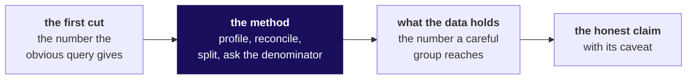

# The panel's question bank: Build 1, Kalpa Health

**TRAINER ONLY.** This page names what is planted in the data. It goes to the industry expert, the
senior industry leader, the Programme Head, the trainer and the Academic TA, and never to a learner
or a learner's screen.

Posts to <!-- sync:module:W03/SAT -->Module 1: Foundations of AI and Data<!-- /sync:module:W03/SAT -->, on <!-- sync:day-date:W03/SAT -->Sat 24 Oct 2026<!-- /sync:day-date:W03/SAT -->.

## What you are listening for

Every group was handed Dr Priya Menon's question: test volumes grew 5 percent against a plan of 18,
and which branch of her business is short. Each group took one of five sub-problems (1 revenue,
2 bookings, 3 billing, 4 no-shows, 5 campaign). Nothing new was taught this week, so every
sub-problem is the Weeks 1 and 2 method moved into a business the room had never seen, and the data
was built so that the method finds something the obvious first cut misses. This page tells you what
that something is for each sub-problem, with its numbers, so you can tell in a few questions whether
a group found it, found part of it, or stopped at the first cut.

Four rules for the questions, whichever panel you sit on:

1. **Ask so the group can show it, and never tell it.** A question such as "what does the denominator
   of that rate hold?" lets a group that found the trap show it. A question such as "did you remove
   the walk-ins?" hands the finding to a group that did not make it, and a later group on the same
   sub-problem may be sitting in the room.
2. **A narrower honest claim is a good answer.** A group that missed a trap but stated a claim its
   evidence supports, with the right caveat, has done the week's work. A group that found the trap
   and overclaimed from it has not. The panel's questions test the claim against the evidence.
3. **Every group gets four questions at least.** One on what the data holds, the caveat challenge,
   the silent-teammate question, and where the group shares its sub-problem with another group that
   has already presented, the separator. The evidence question below the headline suits every group.
4. **Do not correct a group in the room.** When a group has missed something, ask the question that
   would have found it and let the answer stand; the week close carries what the room found.

Every number on this page is recomputed from the ten files in `content/W03/D1/data/` by
`content/W03/SAT/internal/C2_W03_SAT_witness_INTERNAL.py`, which also checks each one against the
approved spine's witness. The files cover Q1 as 1 April to 30 June 2026 and Q2 as 1 July to
30 September 2026.

---

## The headline, which every group met on Monday

**What the data holds.** Dr Menon's 5 percent is the count her dashboard makes: tests booked by
retail patients in the old booking system only, with a package counted as its component tests.
Every other honest reading of "test volumes" grows faster, and every one of them is still short of
18, once the one corporate contract is set aside.

| Reading of "test volumes", Q1 to Q2, without the corporate contract | Q1 | Q2 | Change |
|---|---|---|---|
| The dashboard's count: tests booked, old system only | 23,213 | 24,406 | 5.1 percent |
| Tests booked, both systems | 23,213 | 25,022 | 7.8 percent |
| Tests performed (completed bookings), both systems | 22,468 | 24,399 | 8.6 percent |
| Bookings, both systems, repeats removed | 5,692 | 6,009 | 5.6 percent |

The corporate health-check contract adds 1,200 health checks of five tests each, which is 6,000
tests, in one booking on 6 August 2026 at the Bengaluru laboratory (KH-BLR-01, account CORP-0007).
With it, tests performed grow 35.3 percent, which beats the plan on paper and is one customer.

| Ask | What a group that found it says | What a group that stopped says |
|---|---|---|
| "Dr Menon's 5 percent: what does it count, and did you reproduce it?" | It counts tests booked in the old system, packages as their components, and the group can say which systems and which statuses it included. | It repeats 5 percent as a fact about the business, or cannot say whether it counts bookings, tests or revenue. |
| "Give me the one growth number you would put before her board, with its definition." | A number between 5.6 and 8.6 percent, with its definition said first, and short of 18 either way. | A number with no definition, or the 35 percent that includes one contract. |
| "If I count every test performed in Q2, growth beats the plan. Why do you say she is short?" | One contract of 1,200 health checks is 6,000 tests; it is one customer in one quarter, so the run rate is short of plan. | It has no answer, or it drops the contract without saying so. |

---

## Sub-problem 1: where lab revenue comes from, and which branch is short

**What the data holds.** One corporate health-check contract, billed as a single invoice line of
Rs 18,00,000 on 6 August 2026, is 16.2 percent of Q2 revenue. With it, revenue grows 29.8 percent,
from Rs 85,74,238 in Q1 to Rs 1,11,31,711 in Q2; without it, Q2 is Rs 93,31,711 and growth is
8.8 percent. The mean Q2 invoice is Rs 1,904 with the contract and Rs 1,596 without, while the
median is Rs 1,499 either way. Packages are billed as one line: 22,152 invoice lines outside the
contract sit behind 48,235 test rows in `booking_tests`. Thirty-five invoice amounts are written as
text with a comma (for example "2,600"), so a numeric read of the column drops or misreads them.

Without the contract, revenue by city moved as follows, which is the tree's city branch:

| City | Q1 to Q2, invoices without the contract |
|---|---|
| Hyderabad | 26.2 percent up |
| Mumbai | 16.6 percent up |
| Bengaluru | 12.7 percent up |
| Delhi | 5.4 percent up |
| Chennai | 5.4 percent down |
| Pune | 11.6 percent down |

**The trap, with its exact wrong number.** A group that sums the invoice column tells Dr Menon that
revenue grew 29.8 percent and that the typical invoice is Rs 1,904. Both would lead her to report a
healthy quarter and to price from an average that no retail patient pays. The check is to sort the
invoices by amount; the fix is to report with and without the contract and to use the median.

**Questions that test whether the group found it.**

1. "What is the single largest invoice in Q2, and what does your growth number become without it?"
   A group that found it names Rs 18 lakh and one corporate account, and gives 8.8 percent.
2. "Your revenue per test: is the denominator invoice lines or tests?" A group that found it says a
   package is one invoice line and up to twelve tests, so per line and per test differ by about
   a factor of two (22,152 lines against 48,235 test rows).
3. "What does a typical Kalpa Health invoice look like, and which statistic did you use?" The strong
   answer is the median, Rs 1,499, and why the mean moves with one invoice.
4. "Which branch of the tree is short?" The strong answer names Chennai and Pune on the city branch,
   and says whether it split by volume or by price per test.
5. "How many invoice amounts did your code read as numbers?" A group that profiled finds the 35 text
   amounts with commas; a group that did not may have lost them silently.

**The caveat challenge.** "Your claim leaves out the corporate contract. Finance says that is real
revenue. Defend the exclusion or bring it back." Listen for both numbers, said together: the contract
is real revenue and belongs in the quarter's total, and it is one customer in one quarter, so it
tells the board nothing about the run rate. A group that also found sub-problem 3's side of it says
the contract's invoice is still unpaid.

**The silent teammate.** "Take one package invoice line and tell me how many tests sit behind it,
and where in the files you found that." The answer is in `booking_tests`: a package header row, then
its component rows at zero price.

**The separator, for two groups on this sub-problem.** Group A says revenue grew about 30 percent,
ahead of plan; Group B says about 9 percent, short of plan. Ask the second group: "The group before
you said 30 percent. Can both be honest, and what sentence would both of you sign?" The strong answer
is that both are arithmetic on the same file, that 30 includes one contract and 9 does not, and that
the plan of 18 is a test-volume plan, so neither revenue figure is compared with it directly.

---

## Sub-problem 2: bookings fell in two cities in Q2

**What the data holds.** Chennai and Pune moved to the new booking system on 18 September 2026. The
old system's last booking in those two cities is dated 17 September, and the new system's export
holds 153 bookings (85 in Chennai, 68 in Pune) with its own identifiers (`NB/MAA/000001`), its own
centre codes (`MAA-01`, `PNQ-02`), dates written day first (`18/09/2026`), statuses `DONE` and
`CXL`, and its own channel words. The clinics file maps each new code to its old one. The old export
also repeats 180 booking identifiers: 145 of the repeated rows match on every field, 30 differ in
`updated_at` (one of them in `channel` as well), and 5 differ only in a `channel` one copy leaves blank.

| Chennai and Pune together | Q1 | Q2 | Change |
|---|---|---|---|
| Old system's export, repeats removed | 1,415 | 1,090 | 23.0 percent down |
| Both systems, repeats removed | 1,415 | 1,243 | 12.2 percent down |

| City | Q1 | Q2, old export | Q2, both systems | Real change |
|---|---|---|---|---|
| Chennai | 754 | 571 | 656 | 13.0 percent down |
| Pune | 661 | 519 | 587 | 11.2 percent down |

The fall is real, and it is about half the size the old export shows. The other four cities rose in
bookings: Hyderabad about 21 percent, Mumbai 13, Bengaluru 8 and Delhi 7.

**The trap, with its exact wrong number.** A group that reads only the old export tells Dr Menon the
two cities fell 23.0 percent, which would send her to fix a collapse twice the size of the real one.
With the repeats left in, the old export holds 1,099 rows for the two cities in Q2 and 1,450 in Q1,
a small shift that a group should still have removed. The check is a daily count, which drops to zero
in both cities after 17 September; the fix is to map the new export onto the old codes and union it.

**Questions that test whether the group found it.**

1. "Show me bookings in the two cities day by day for September. What happens on the 18th?" A group
   that found it describes the cliff and the second file.
2. "Which system does your Q2 count come from?" The strong answer is both, with the mapping named.
3. "How did you match `MAA-01` to a Kalpa clinic?" The answer is the `new_system_code` column of the
   clinics file.
4. "How many rows did you set aside as repeats, and what made them repeats?" The strong answer is
   180, the same booking identifier, and a word on the 35 that do not match on every field: 30 differ
   in their update time and 5 only in a channel one copy leaves blank.
5. "Is the fall real?" The strong answer is yes, about 12 percent, and it names what it cannot see:
   whether the new system misses bookings of its own.

**The caveat challenge.** "You added the new system's rows. How do you know you have not counted a
booking twice, once in each system?" Listen for the date boundary (the old system stops on the 17th
and the new one starts on the 18th), the absence of shared identifiers, and a patient-and-date check
if the group ran one.

**The silent teammate.** "Read me one booking from the new system's export and tell me every field
that differs in format from the old one." Identifier, patient number without its prefix, centre code,
date order, status word and channel word are the six.

**The separator.** Group A says bookings fell 23 percent; Group B says 12. Ask: "Can both numbers be
true?" The strong answer is yes, if Group A says "in the old system's export", and only Group B's
answers Dr Menon's question, because she asked about bookings, and a system change is not a patient
choosing not to book.

---

## Sub-problem 3: invoices and collections disagree

**What the data holds.** The payment feed keys invoices in its own format. Of 11,289 payment rows,
247 carry the invoice number as the billing export writes it (`KH/26-27/000001`), 1,972 carry an
`INV-` number with no leading zeros (`INV-1`), and 9,070 carry the bare six-digit serial (`000001`).
An exact join matches 247 payments, 2.2 percent. Normalised to the serial, every payment matches an
invoice. Gateway retries double-post: 229 successful payments repeat an earlier one on the same
reference for the same amount, each within two minutes, worth Rs 3,55,254. There are 102 refunds
worth Rs 1,60,164, and 398 invoices have no payment at all, worth Rs 24,47,805, of which the
corporate contract's invoice is Rs 18,00,000.

| Across both quarters | Amount |
|---|---|
| Invoiced, 11,356 invoices | Rs 1,97,05,949 |
| Successful payment rows as the feed sends them | Rs 1,76,13,398 |
| Less 229 double posts | Rs 3,55,254 |
| Less 102 refunds | Rs 1,60,164 |
| Net collected | Rs 1,70,97,980 |
| Invoices with no payment, 398 | Rs 24,47,805 |
| The corporate invoice among them | Rs 18,00,000 |

**The trap, with its exact wrong number.** A group that joins exactly tells the finance head that
only 2.2 percent of invoices are paid, which is absurd and should stop them; the subtler wrong number
is the group that normalises but keeps the double posts and reports collections overstated by
Rs 3,55,254. The check is the match rate after each join step and a count of same-reference,
same-amount pairs; the fix is to normalise the key and keep the first of each retry pair.

**Questions that test whether the group found it.**

1. "What share of payments matched on your first join, and what did you do next?" The strong answer
   names 2.2 percent and the three formats.
2. "Show me one payment reference in each of its formats." The group should produce all three.
3. "Two payments on the same invoice, same amount, two minutes apart: a second payment or a retry?
   How did you decide?" The strong answer names the rule and the count, 229.
4. "Which single unpaid invoice matters most?" The strong answer names the corporate invoice of
   Rs 18 lakh, and connects it to sub-problem 1.
5. "Give me the gap between invoiced and collected, and its parts." A group that reconciled gives the
   parts in the table above, or its own equivalent that adds up.

**The caveat challenge.** "You removed 229 payments as retries. What if some were patients paying
twice, and Kalpa owes them money?" Listen for the evidence (same reference, same amount, within two
minutes, and the invoice amount equal to one payment) and for the honest limit: a genuine double
payment would look the same, so the list goes to finance to check against the gateway's own records.

**The silent teammate.** "Normalise this reference for me, out loud: `INV-100`." The answer is
`KH/26-27/000100`, reached by padding the number to six digits and adding the export's prefix.

**The separator.** Group A says collections are short by several lakh and finance should chase
patients; Group B says nearly everything was collected, and the gap is one corporate invoice plus
retries and refunds. Ask: "What would each of you tell the finance head to do on Monday?" Both can
be honest if each says what it counted; the strong answer separates the Rs 18 lakh corporate invoice
(one call to one account) from Rs 6,47,805 across 397 retail invoices.

---

## Sub-problem 4: the no-show rate looks worse in one clinic

**What the data holds.** The appointments file holds Q2 visits to the twelve walk-in clinics. One
small Hyderabad clinic, KH-HYD-03, runs by appointment: 52 visits, of which 50 scheduled and 2
walk-ins. The other clinics' visit counts include hundreds of walk-ins each, and a walk-in is never a
no-show (all 3,042 walk-in rows are attended). So a rate over all visits compares unlike things.

| No-show rate | KH-HYD-03 | The other eleven clinics |
|---|---|---|
| Over all visits | 19.2 percent (10 of 52) | 8.7 percent |
| Over scheduled visits only | 20.0 percent (10 of 50) | 15.2 percent |

If KH-HYD-03's true rate were the others' 15.2 percent, chance alone would produce 10 or more
no-shows in 50 appointments with probability 0.22, about one time in five. To detect a gap of this
size with the usual confidence (5 percent significance, 80 percent power) takes about 480 scheduled
appointments, which at 50 a quarter is more than two years of this clinic's bookings.

**The trap, with its exact wrong number.** A group that divides no-shows by all visits tells Dr Menon
that one clinic's no-show rate is more than double the rest, 19.2 against 8.7 percent, which would
send the operations head after a clinic manager. The check is to ask what the denominator holds and
whether a walk-in can be a no-show; the fix is scheduled visits only, and then the chance question.

**Questions that test whether the group found it.**

1. "What is in the denominator of your no-show rate?" The strong answer is scheduled appointments,
   with the reason.
2. "Can a walk-in be a no-show?" A group that profiled says no, and that the file shows none.
3. "How many appointments does this clinic have, and how many no-shows?" The strong answer is 50
   and 10, said before any rate.
4. "How often would chance alone give you ten of fifty at the others' rate?" A group that ran the
   Week 1 Thursday test gives about one in five, by simulation or by formula.

**The caveat challenge.** "Chance produces it about one time in five, so you say it is noise. But 20
against 15 is a third worse. Do you tell Dr Menon to do nothing?" Listen for "not proven either way":
fifty appointments cannot separate this clinic from the rest in either direction, so the group proposes
watching it with more data and a cheap step, such as appointment reminders, rather than acting on the manager.

**The silent teammate.** "Why did you leave out the walk-ins, and what happens to every other
clinic's rate when you do?" The others' rate moves from 8.7 to 15.2 percent, which is most of the
original gap.

**The separator.** Group A says the clinic's no-show rate is double the others' and it needs action;
Group B says the gap cannot be told from chance. Ask Group A: "What is the rate if we count only
visits that could have been a no-show?" Group A's claim does not survive the denominator question;
a Group A that says "20 against 15, on scheduled visits" and stops there has a narrower claim that
is honest and incomplete.

---

## Sub-problem 5: the campaign "lifted bookings 9 percent"

**What the data holds.** The campaign file lists 2,381 patients offered free home collection between
15 July and 4 August 2026, of whom 948 took it up. The offer reached about half the patients in
Bengaluru, Hyderabad and Mumbai (49.5, 52.0 and 50.6 percent) and about a fifth elsewhere (Delhi 21.1,
Chennai 21.5, Pune 21.9 percent). Measured as bookings per patient from 15 July to 14 September,
offered patients book 9.0 percent more than patients not offered, which is marketing's number. Inside
each of the three cities where half were offered, offered patients book less.

| Bookings per patient, offered against not offered | Change |
|---|---|
| All cities together | 9.0 percent more |
| Bengaluru | 10.8 percent less |
| Hyderabad | 19.9 percent less |
| Mumbai | 13.0 percent less |

The three cities were already rising: their bookings per day rose 6.9 percent in the two months
before the offer (14 May to 14 July against 1 April to 13 May), and rose 7.4 percent from those two
months to the campaign window, against 3.0 percent in Delhi (710 against 689). The offer went to half
the patients in the three campaign cities and a fifth elsewhere, and in the three cities offered
patients booked less during the offer than patients who were not offered. A panel accepts neither
story about targeting: the files show who was offered and never how they were chosen. Delhi's offered
patients book 23.5 percent more than its others, on 316 offered against 1,184 not offered; Chennai and
Pune sit inside the booking-system change of sub-problem 2, so their figures carry that caveat.

**The trap, with its exact wrong number.** A group that compares offered with not offered across
the whole company confirms marketing's 9 percent lift, which would lead Dr Menon to fund the offer
again and more widely. The check is the same comparison inside each city, the Week 1 Thursday move;
the fix is to report the split and to say what a fair test (random assignment inside a city) needs.

**Questions that test whether the group found it.**

1. "Is the 9 percent the same inside each city?" A group that split names the sign change.
2. "Who was offered, and was it random?" The strong answer names the uneven share by city and says
   the file does not show how patients were chosen.
3. "What were bookings doing in these cities before the offer?" The strong answer gives the rise
   before 15 July.
4. "Would you fund the offer again?" The strong answer is not on this evidence, and describes the
   test that would settle it.

**The caveat challenge.** "Delhi's offered patients book 23 percent more. Does that not prove the
offer works?" Listen for the group separating a signal in one city from the pattern in three, and for
a claim narrowed to "the file does not show that the offer caused bookings".

**The silent teammate.** "Explain in one sentence how the offer can look positive for the whole
company and negative inside every city that ran it." The answer is that offered patients sit mostly in
the growing cities, so the company-wide comparison is a comparison of cities.

**The separator.** Group A confirms the 9 percent lift; Group B says the offer did not cause it. Ask
Group A: "What happens to your lift inside Bengaluru?" Group A's claim does not survive the split; a
Group A that says "offered patients booked more, and I cannot say why" is honest and narrow.

---

## Questions that suit any group

| Kind | The question | What a strong answer does |
|---|---|---|
| The evidence | "What is the denominator of that number, and over which window?" | It names both without looking them up. |
| The reconciliation | "Rows in, rows kept, rows set aside: do they add up?" | It gives three counts that add up, from the decisions log. |
| The decision you would defend | "Which row of your decisions log would you defend to Dr Menon's finance head?" | It reads the reason, and the reason says more than the issue. |
| The demo | "Change one input and rerun that cell: what should move?" | It predicts the direction before running, then checks. |
| Differently | "If you started again on Monday, what would you do first?" | It names a behaviour from the challenges log, never a feeling. |
| The interview angle | [S] "Present your finding to me as if I were the panel, and I will challenge your caveat." | It narrows the claim under challenge and names the check that would settle the rest. |

## When the slot goes wrong

| What happens | What the panel does |
|---|---|
| The demo fails on the cold run | The rule holds: a group's demo runs once, cold, on its raw files. If it fails, the group has two minutes to recover it live, as it would in front of a client. If it still fails, the group presents from its executed notebook, and the panel scores the live demo in presentation and defence as not run cold. The other 34 marks of the mini project are scored from the executed run, so a failed demo costs its own marks and never the analysis. |
| A group runs past 17 minutes | The panel's timekeeper stops the group at 17 and moves to questions; the group keeps its full question time. |
| One member answers every question | Name the next person for each question, and ask the silent-teammate question to the member who has spoken least; the Academic TA notes anyone still silent for the separate question at closure. |
| A group's claim is wrong and it defends it | Ask the question that would break it once, let the answer stand, and move on; never argue the claim in the room. |
| A group asks the panel for the right answer | Say that the week close carries what the room found, and ask what evidence would change the group's mind. |
