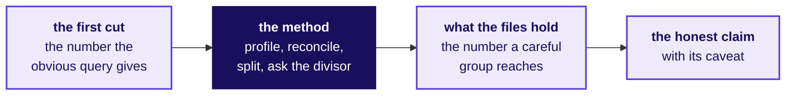

# What should the panel ask each group, and how will it know whether the group found what its files hold?

**TRAINER ONLY.** This page names everything planted in Build 1's data, with its numbers. It goes to
the industry expert, the senior industry leader, the Programme Head, the trainer and the Academic
TA, and never to a learner or a learner's screen. A learner who reads it has lost the week.

Posts to <!-- sync:module:W03/SAT -->Module 1: Foundations of AI and Data<!-- /sync:module:W03/SAT -->, on <!-- sync:day-date:W03/SAT -->Sat 24 Oct 2026<!-- /sync:day-date:W03/SAT -->.

**Who needs the answer.** The two panel chairs, who hear each group for 25 to 27 minutes, spend 8 to
10 of them asking questions, and then score every member on presentation and defence and the group on
the four group criteria. A question that hands a group the finding gives it marks for the panel's knowledge,
and a panel that never asks the question that would expose a wrong number lets that number reach Dr
Menon's board.

**The questions on the way.** What did Dr Menon ask, and what did her five heads ask? How does the
panel ask without handing over the answer? What does every group's headline rest on? For each of the
five questions: what do the files hold, which wrong number would a hurried group give, which
questions show whether the group found it, how does the panel push on the caveat and question the
quietest member, and what separates two honest answers? Which questions suit any group? How is what the panel heard scored,
and what does a failed demo cost? What does the panel do when a slot goes wrong?

Read the first three sections and the sections for your own room's questions: about 15 minutes.

## What did Dr Menon ask, and what did her five heads ask?

**Who needs the answer.** A panel member who has not seen the briefs. Every group answers one part
of one COO's question, in a business most of the room had never seen until Monday, and a question
from the panel that uses the wrong word for a claim or a visit costs the group a minute.

**The questions on the way.** What is Kalpa Health? What did Dr Menon ask? Which five questions did
her heads ask, in their own words? Which words will the groups use?

Kalpa Health is a fictional US diagnostics business inside Kalpa Group: a laboratory and two
patient service centres, where patients have blood drawn, in each of six US metro areas (Dallas,
Phoenix, New York, Chicago, Atlanta and Philadelphia). It bills patients' payers in dollars, and its
analytics and revenue-cycle work runs from Kalpa's Global Capability Centre (GCC) in Bengaluru,
where the learners work as trainee engineers. Every record in its ten data files is synthetic, and
the files are the export taken on Friday 16 October 2026. Q2 is April to June 2026 and Q3 is July to
September 2026.

Its COO, Dr Priya Menon, wrote: "My dashboard says test volumes grew 5 percent from Q2 to Q3. The
plan the board approved asks for 18. Which branch of my business is short, and what do I do next?"
Five of her heads each asked a question, and each group took one. Nothing new was taught this week:
every question is a move from Weeks 1 and 2, in a domain the room met on Monday.

| # | Who asks | Their words, as the brief gives them | The Week 1 or 2 move it asks for |
|---|---|---|---|
| 1 | The finance head | "The board will ask me where the plan's growth went. Where does our lab revenue actually come from, and which branch of it is short?" | Week 1 Monday's revenue tree, every branch a count over a denominator, and its question of which total is the typical one; Week 2 Monday's tree as queries |
| 2 | The patient service centres' operations head | "Bookings fell in two of our metros in Q3. Before I send a field team or cut staff there, I need to know how far they fell, and why." | Week 1 Tuesday's investigation ladder, rung 1 first ("Is the drop real?"), with Week 1 Wednesday's profile and reconcile across two systems |
| 3 | The finance head | "The claims we billed say one thing and the posting system says another. Which claims are unpaid, how much money is that, and can I trust the figure I report?" | Week 2 Tuesday's join, counted before anything is summed, on Week 1 Wednesday's reconciliation, the bridge that names every dollar between two totals |
| 4 | The patient service centres' operations head | "KH-ATL-03, one of our two Atlanta patient service centres, has the worst no-show rate on my Q3 report. I am being asked to add a receptionist there or close it. Is the centre really worse?" | Week 1 Thursday: a rate defined before it is counted, "Real, or the wobble?" (is the gap bigger than chance alone produces?), and how many people stand behind a percentage |
| 5 | The marketing head | "Our free at-home collection offer lifted bookings 9 percent. I want to offer it to every patient in all six metros. Can you confirm it worked?" | Week 1 Thursday's "Did the discount work?": the fair comparison inside each segment, then the chance check |

| Word | What it means at Kalpa Health |
|---|---|
| Booking | One patient's visit, or home collection, for one or more tests |
| Panel | Several tests ordered and priced under one name; it is billed as one claim line |
| Claim | The bill for one completed booking, sent to the payer at list prices, plus a $20 fee for a home draw |
| Payer | Who pays the claim: a commercial health plan, Medicare (federal, mostly people 65 and over), Medicaid (each state's programme for low incomes) or the patient (self-pay) |
| Remittance, posting | The payer's answer to a claim, and the row the posting system writes for each payment, denial or reversal |
| Allowed amount | What a payer's contract accepts for a claim; the rest of the billed amount is a contractual adjustment the lab never collects |
| Denial | A payer's refusal to pay a claim, with one of seven reason categories |
| No-show | A booked slot at a centre that the patient missed; a walk-in has no slot to miss |

The domain dossier the room read on Monday,
`content/W03/D1/study-notes/C2_W03_D01_domain_us_healthcare_STUDENT.md`, carries every term in
full; section 3 follows one claim from list price to cash, and section 5 gives each revenue-cycle
metric's formula.

## How does the panel ask without handing a group the answer?

**Who needs the answer.** Both chairs, before the first slot, who decide how every question is
worded. Several groups share a question and wait outside until their slot, so a finding the panel
names in a question can travel to a group that has not presented and become its finding without its
work.

**The questions on the way.** What is the panel listening for? Which four rules hold in every slot?
How many questions does each group get?

The files were built so that each question's obvious first cut gives a plausible wrong number, and
the Weeks 1 and 2 method finds what the first cut misses. The panel is listening for how far along
that line each group got.

1. Ask so the group can show it, and never tell it. "What does the denominator of that rate
   hold?" lets a group that found the walk-ins show it. "Did you take out the walk-ins?" hands the
   finding to a group that did not make it.
2. A narrower honest claim is a good answer. A group that missed a plant but stated a claim its
   evidence supports, with the caveat that bounds it, has done the week's work. A group that found
   the plant and then overclaimed from it has not.
3. Every group gets at least three questions: one on what the files hold, the caveat challenge,
   and the question to the member who has spoken least. Where another group has already presented
   on the same question, a fourth separates the two claims, worded so that it never quotes the other
   group's number.
4. Never correct a group in the room. When a group has missed something, ask the question that
   would have found it once, let the answer stand, and move on. The week close carries only what the
   groups found.

## What does every group's headline number rest on?

**Who needs the answer.** Every chair, for every group: each brief opens on Dr Menon's 5 percent,
and a group that repeats it as a fact about the business has answered with her dashboard's number.

**The questions on the way.** What does the 5 percent count? What do the other honest readings
give? What does the one employer contract do to them?

Dr Menon's 5 percent is her dashboard's count: tests booked by retail patients in the old booking
system only, with a panel counted as its component tests. Every other honest reading of "test
volumes" grows faster, and every one of them is short of 18 once the one employer contract is set
aside.

| Reading of "test volumes", Q2 to Q3, without the employer contract | Q2 | Q3 | Change |
|---|---|---|---|
| The dashboard's count: tests booked, old system only, one row per booking id | 23,213 | 24,406 | 5.1 percent |
| The same count on raw rows, with the old export's repeated rows left in | 23,788 | 24,556 | 3.2 percent |
| Tests booked, both booking systems | 23,213 | 25,022 | 7.8 percent |
| Tests performed (completed bookings), both systems | 22,468 | 24,399 | 8.6 percent |
| Bookings, both systems | 5,692 | 6,009 | 5.6 percent |

Q2's first and third rows match because the new booking system opened on 18 September. The employer
contract is one booking on 6 August 2026 at the Dallas laboratory (KH-DAL-01, account EMP-0007):
1,200 wellness screenings of 5 tests each, 6,000 tests. With it, tests booked grow 33.6 percent and
tests performed 35.3 percent, which beats the plan on paper and comes from one customer in one
quarter.

| Ask | A group that found it | A group that stopped at the first cut |
|---|---|---|
| "Dr Menon's 5 percent: what does it count, and did you reproduce it?" | Names tests booked in the old system, panels as their components, and reproduces 5.1 percent, or 3.2 on raw rows and says why it differs | Repeats 5 percent as a fact about the business, or cannot say whether it counts bookings, tests or dollars |
| "Give me the one growth number you would put before her board, and its definition." | Says the definition first, then a number between 5.6 and 8.6 percent, short of 18 either way | Gives a number with no definition, or 33.6 or 35.3 percent with the contract in it |
| "If I count every test performed in Q3, you beat the plan. Why do you say she is short?" | One contract of 1,200 screenings is 6,000 tests, one customer in one quarter, so the run rate is short | Has no answer, or drops the contract without saying so |

Every reading of test volumes without the contract grows between 3.2 and 8.6 percent, so every
honest headline is short of the plan of 18, and a group's job was to say which reading it used.

## Which branch of billed revenue is short, and how much of the gap does it explain?

**Who needs the answer.** The finance head, who writes the board's page on where the plan's growth
went, and Dr Menon, who moves the second half's recovery effort onto the branch named. A branch
named wrongly sends staff and money to a part of the business that was never short.

**The questions on the way.** What do the claims hold that a sum of billed dollars hides? Which wrong
number would a hurried group give about billed revenue? Which five questions show whether a group
found the contract and the panels? What if finance says the employer contract is real revenue? How
many tests sit behind one panel line? When one group says 27 percent and another 8, can both be
honest?

> "The board will ask me where the plan's growth went. Where does our lab revenue actually come
> from, and which branch of it is short?" The finance head, sub-problem 1

### What do the claims hold that a sum of billed dollars hides?

One employer wellness contract is a single claim: KH-CLM-007802, account EMP-0007, Dallas, service
date 6 August 2026, $180,000 for 1,200 screenings. It is 14.6 percent of Q3's billed charges of
$1,231,001. Billed charges grow 26.9 percent from Q2's $970,098 with it, which reads as ahead of
plan, and 8.3 percent without it ($1,051,001). The Q3 mean claim is $210.50 with it and $179.75
without; the median claim is $150 in both quarters, and Q2's mean is $176.13.

A panel is billed as one claim line. The 11,355 retail claims carry 22,152 lines: 21,050 tests or
panels and 1,102 lines of a $20 collection fee for a home draw, a fee no row of the price list
carries ($11,220 in Q2 and $10,820 in Q3). Those lines bill 46,867 tests on the completed bookings
behind them, or 48,235 counting cancelled bookings, which `booking_tests` also lists, so revenue
per line and revenue per test differ by about a factor of two. Sixty billed amounts are text with a
dollar sign, such as "$265.00", worth $10,559 in all (32 in Q2 and 28 in Q3); a numeric read drops
or misreads them.

Without the contract, the tree splits billed revenue into claims and billed per claim, and then by
metro or by payer:

| Branch, Q2 to Q3, retail claims only | Change |
|---|---|
| Billed charges | 8.3 percent, $970,098 to $1,051,001 |
| Claims | 6.2 percent, 5,508 to 5,847 |
| Billed per claim | 2.1 percent, $176.13 to $179.75 |
| By metro | Atlanta 26.4, Phoenix 16.2, Dallas 10.9 and New York 5.5 percent up; Chicago 6.5 and Philadelphia 10.9 percent down |
| By payer | Commercial 13.0, Medicare 6.0 and Medicaid 1.6 percent up; self-pay 2.2 percent down |

The finance head asked how much of the shortfall each branch explains, which growth rates alone do
not say. At 18 percent above Q2, retail claims would have billed $93,715 more in Q3 than they did. Each
branch's part of that gap is what it would have billed at 18 percent above its own Q2, less what it
billed; the same sum in tests performed (both booking systems, completed bookings) gives 2,113 tests
short.

| Branch, retail claims, Q2 to Q3 | Dollars short of 18 percent | Share of the dollar shortfall | Share of the shortfall in tests performed |
|---|---|---|---|
| Philadelphia | $32,999 | 35.2 percent | 44.4 percent |
| Chicago | $30,437 | 32.5 percent | 23.7 percent |
| New York | $21,909 | 23.4 percent | 28.5 percent |
| Dallas | $15,867 | 16.9 percent | 8.6 percent |
| Phoenix | $3,659 | 3.9 percent | 6.1 percent |
| Atlanta | $11,156 ahead of the plan | minus 11.9 percent | minus 11.2 percent |
| Medicare | $28,437 | 30.3 percent | 33.8 percent |
| Commercial | $25,562 | 27.3 percent | 21.2 percent |
| Medicaid | $23,672 | 25.3 percent | 28.2 percent |
| Self-pay | $16,044 | 17.1 percent | 16.9 percent |

By metro, Chicago and Philadelphia, the two metros whose bookings really fell (sub-problem 2), explain
67.7 percent of the dollar shortfall, and Atlanta runs ahead of the plan. By payer, every payer is
short and none carries the gap alone: Medicaid and self-pay grow slowest, yet together explain 42.4
percent, and Medicare, growing 6.0 percent, is the biggest single part at 30.3 percent. Either split is sound when the
group defines it and counts both quarters the same way. The board's 18 percent is a plan for test
volumes, so a group that compares billed dollars with it should say that, with prices and mix
unchanged, billed revenue would grow about as fast as volumes.

### Which wrong number would a hurried group give the finance head about billed revenue?

A group that sums the billed column tells the finance head that billed revenue grew 26.9 percent and
that the typical claim is $210.50. Both would have Dr Menon report a quarter ahead of plan and price
from an average no retail patient pays. The check is to sort the claims by amount, where the top one
is $180,000 and the next is $420; the fix is to report with and without the contract and to use the
median.

Two smaller wrong numbers follow the same file. Revenue per test computed per claim line is about
twice the real figure, because a panel is one line over several tests. Billed charges read with the
60 text amounts dropped are $10,559 short across the two quarters, a gap the reconciliation to the
file's row count exposes.

### Which five questions show whether a group found the contract and the panels?

Ask them in this order; each is harder than the one before it.

1. "What is the single largest claim in Q3, and what does your growth number become without it?" A
   group that found it names $180,000 and one employer account, and gives 8.3 percent.
2. "How many billed amounts did your code read as numbers?" A group that profiled first found the 60
   text amounts and converted them; a group that did not may have lost $10,559 silently.
3. "What does a typical Kalpa Health claim bill, and which statistic did you use?" The strong answer
   is the median, $150, and why the mean moves with one claim.
4. "Your revenue per test: is the denominator claim lines or tests?" A group that found it says a
   panel is one line and several tests, so 22,152 lines stand for 46,867 tests.
5. "Which branch is short, and how much of the gap to plan does it explain?" The strong answer names
   its split, the branch and its share of the dollars short: Chicago and Philadelphia about two
   thirds by metro, or, by payer, every payer short with none carrying it alone.

### What if finance says the employer contract is real revenue?

The caveat challenge: "Your claim leaves out the employer contract. Finance says that is real
revenue. Defend the exclusion or bring it back." Listen for both numbers said together: the contract
is real revenue and belongs in the quarter's total, and it is one customer in one quarter, so it
says nothing about the run rate. A group that also read the postings adds that the employer claim has
no posting at all yet (sub-problem 3).

### How many tests sit behind one panel line?

For the member who has spoken least: "Take one panel on a claim and tell me how many tests sit
behind its one line, and where in the files you found that." The answer is in `booking_tests`: a
`panel` row carrying the panel's price, then one `component` row per test at zero price.

### When one group says 27 percent and another 8, can both be honest?

Group A says billed revenue grew about 27 percent, ahead of plan; Group B says about 8, short of it.
Ask the second group, without quoting the first: "Another group reached a different growth figure from
the same claims file. What could make two honest figures differ, and which would you put before the
board?" The strong answer: one employer claim is in one figure and out of the other, and the plan of
18 counts test volumes, so no dollar figure meets it head on. A sentence both can sign: "Billed
charges grew 8.3 percent from Q2 to Q3 on retail claims, and 26.9 percent counting one $180,000
employer claim; Chicago and Philadelphia explain about two thirds of the $93,715 by which retail
billing fell short of 18 percent growth."

Sub-problem 1's answer: without the one employer claim, billed revenue grew 8.3 percent, $93,715
short of 18 percent growth; Chicago and Philadelphia explain 67.7 percent of that shortfall by metro,
and by payer every payer is short with none carrying it alone.

## How far did bookings really fall in Chicago and Philadelphia, and why?

**Who needs the answer.** The patient service centres' operations head, who decides this month
whether to send a field team to the two metros, cut staff there, or leave them alone. A fall read
too large cuts staff that patients still need; a fall read too small leaves a real decline running.

**The questions on the way.** What do the two booking files hold that one file hides? Which wrong
number would a hurried group give about the two metros' fall? Which five questions show whether a
group found the second system? Did the group count a booking twice? Which fields of a new-system
booking differ from the old export? When one group says 23 percent and another 12, can both be true?

> "Bookings fell in two of our metros in Q3. Before I send a field team or cut staff there, I need to
> know how far they fell, and why." The patient service centres' operations head, sub-problem 2

### What do the two booking files hold that one file hides?

Chicago and Philadelphia moved to the new booking system on 18 September 2026. The old system's last
booking in those two metros is dated 17 September, and its export carries only its own bookings. The
new system's export holds 153 bookings (85 in Chicago, 68 in Philadelphia), dated 09/18/2026 to
09/30/2026, written its own way: ids such as `NB/ORD/000001`, site codes such as `ORD-01` and
`PHL-02`, patient numbers without the `P-` prefix (`004857`), dates month first, states `DONE` and
`CXL`, and channels `WALKIN`, `WEB`, `CALL` and `MOBILEDRAW`. The sites file's `new_system_code`
column maps each new code to its old one.

The old export also repeats 180 booking ids from a re-export, booked 1 June to 26 September: it
holds 11,729 rows over 11,549 ids. Of the 180 repeated pairs, 145 match on every field and 35 do
not: 30 differ in `updated_at`, one of them in `channel` as well, and 5 differ only in `channel`,
where one copy leaves it blank.

| Retail bookings, one row per booking id | Q2 | Q3, old export | Q3, both systems | Change, old export | Change, both systems |
|---|---|---|---|---|---|
| Chicago | 754 | 571 | 656 | 24.3 percent down | 13.0 percent down |
| Philadelphia | 661 | 519 | 587 | 21.5 percent down | 11.2 percent down |
| The two metros together | 1,415 | 1,090 | 1,243 | 23.0 percent down | 12.2 percent down |

The other four metros' bookings rose: Dallas 7.7, Phoenix 13.0, New York 6.8 and Atlanta 21.2
percent. The fall in the two metros is real, and it is about half the size the old export shows.
The files show where it happened and say nothing about why patients booked less, so a group that
names a cause beyond the system change has gone past its evidence.

### Which wrong number would a hurried group give the operations head about the two metros' fall?

A group that counts the old export alone tells the operations head that the two metros fell 23.0
percent, which would send a field team, or a staff cut, after a collapse twice the size of the real
one. With the repeats left in, the old export shows 1,450 rows in Q2 and 1,099 in Q3 for the two
metros, a slightly different wrong number that the group should still have cleaned. The check is
rung 1 of Week 1 Tuesday's ladder, confirming the drop in every system: a daily count drops to zero
in both metros after 17 September. The fix is to map the new export onto the old codes and count
both.

### Which five questions show whether a group found the second system?

1. "Show me bookings in the two metros day by day for September. What happens on the 18th?" A group
   that found it describes the cliff and the second file.
2. "Which system does your Q3 count come from?" The strong answer is both, with the mapping named.
3. "How did you match `ORD-01` to a Kalpa Health site?" Through the sites file's `new_system_code`.
4. "How many rows did you set aside as repeats, and what made them repeats?" The strong answer is
   180, the same booking id twice, and a word on the 35 pairs that do not match on every field.
5. "Is the fall real, and is it the patients or the system?" The strong answer is real, about 12
   percent, with the system change explaining the rest of the 23, and it says what it cannot see:
   whether the new system misses bookings of its own.

### Did the group count a booking twice?

The caveat challenge: "You added the new system's rows. How do you know you have not counted a
booking twice?" Listen for three things. The double count actually in the files is the old export's
180 repeated ids, which a strong group set aside before counting. The date boundary keeps the two
systems apart: the old system stops on the 17th and the new one starts on the 18th. A patient-and-date
match across the two systems finds no booking in both. Shared ids prove nothing either way, since the
two systems write ids in different formats.

### Which fields of a new-system booking differ from the old export?

For the member who has spoken least: "Read me one booking from the new system's export and tell me
every field that differs in format from the old one." The six are the id, the patient number without
its prefix, the site code, the date order, the state word and the channel word.

### When one group says 23 percent and another 12, can both be true?

Group A says bookings fell 23 percent; Group B says 12. Ask the second group, without quoting the
first: "Another group reached a different fall for the same two metros. How could two honest counts
of the same bookings differ?" The strong answer: both are true if the larger one says "in the old
system's export", and only the both-systems count answers the operations head, who asked about
patients booking, while a system change leaves every patient's booking in place.

Sub-problem 2's answer: bookings in Chicago and Philadelphia fell 12.2 percent, and the old export
alone doubles that to 23.0 because both metros moved to a new booking system on 18 September.

## Which claims are unpaid, how many dollars is that, and can finance trust the figure?

**Who needs the answer.** The finance head, who reports the collections figure at the quarter's close
and decides which unpaid claims the revenue-cycle team chases first. A figure wrong in either
direction reaches the board under the finance head's name, and a claim chased late can pass its
payer's filing deadline and never be paid.

**The questions on the way.** What do the postings hold that one join hides? What is the money to
chase worth at what the contracts allow? Which wrong number would a hurried group give about
collections? Which six questions show whether a group matched and classified every posting? What if
some removed payments were real second payments? How does `CLM-100` become a claim id? When one group
says chase $1.4 million and another says chase a quarter of a million, which is honest?

> "The claims we billed say one thing and the posting system says another. Which claims are unpaid,
> how much money is that, and can I trust the figure I report?" The finance head, sub-problem 3

### What do the postings hold that one join hides?

The posting system keys claims three ways. Of 11,343 postings, 216 carry the claim id as the billing
system writes it (`KH-CLM-000013`), 2,269 a CLM-number without leading zeros (`CLM-1`), and 8,858 the
bare six-digit serial (`000002`). An exact join matches 216 postings, 1.9 percent; normalised to the
six-digit serial, every posting matches a claim.

A payer's electronic remittance advice (ERA) is the file that tells the lab what it paid on each
claim, and duplicate loads of it double-post: 280 payment postings repeat an earlier one on the same
claim reference for the same amount, every one through ERA and posted within two minutes of the first
(274 two minutes apart, 4 one minute apart and 2 in the same minute), worth $19,204.63. There are 105 reversals, worth $8,662.87. The claims file marks 1,175 of the 11,355
retail claims denied, 10.3 percent (Medicaid 14.9, commercial 11.3, Medicare 8.8 percent, self-pay
none), billing $230,132; 1,137 of them carry a denial posting that pays $0.00, and the other 38 have
no posting at all. In all, 398 claims have no posting, $253,165 billed, spread across all six months
of service: the $180,000 employer claim and 397 retail claims billing $73,165.

| From billed to collected, both quarters | Dollars |
|---|---|
| Billed on 11,356 claims | 2,201,099.00 |
| Payment postings as the feed sends them | 829,181.06 |
| Less 280 double posts | 19,204.63 |
| Less 105 reversals | 8,662.87 |
| Collected, net | 801,313.56, which is 36.4 percent of billed |
| The gap between billed and collected | 1,399,785.44 |
| of which contractual adjustments the lab never collects | 883,254.70 |
| of which billed on the 398 claims with no posting | 253,165.00 |
| of which billed on claims denied with a posting | 222,108.00 |
| of which patient shares, owed by patients | 32,594.87 |
| of which reversals | 8,662.87 |

### What is the money to chase worth at what the contracts allow?

Most of the gap is money the contracts never meant to pay, and the rest is worth less than its billed
dollars, since a payer pays only what its contract allows. On the claims they paid, Medicaid allowed
28 percent of the billed amount, Medicare 34, commercial plans 53 and self-pay patients 100. Applied
to what is still unpaid:

| Unpaid, both quarters | Claims | Billed | At what the contracts allow |
|---|---|---|---|
| Retail claims with no posting, the 38 denied with no posting among them | 397 | $73,165 | About $35,115 |
| The employer claim with no posting | 1 | $180,000 | $180,000, if the employer pays its invoice in full |
| Patient shares on paid commercial claims, owed by patients | 1,798 | | $32,594.87 |
| Claims reversed after payment and unpaid since | 105 | $19,293 | $8,662.87, the payments taken back |
| Before the 1,137 denials with a posting are worked | | | About $256,372 |
| Claims denied with a posting | 1,137 | $222,108 | Up to about $97,269, if every denial were overturned |

A group that sums every CO adjustment on the de-duplicated postings gets $1,096,542.70 of
"contractual" write-offs. $213,288 of that sits on denial postings, which the bridge counts as denied
dollars, so the contractual part is $883,254.70.

### Which wrong number would a hurried group give the finance head about collections?

A group that joins exactly finds 1.9 percent of postings matched, a number absurd enough to stop it.
The subtler wrong number comes from the group that normalises the key and keeps the double posts: it
reports collections of $820,518.19, overstated by $19,204.63, and that figure reaches the board. A
third wrong number counts every claim with a posting as paid, which settles 1,137 denied claims that
paid nothing. The checks are the match count after each join step, a count of same-claim,
same-amount payment pairs, and a count of postings by type before any sum; the fix is to normalise
the key, keep the first of each double post, and classify every claim as paid, part paid, denied or
with no posting.

### Which six questions show whether a group matched and classified every posting?

1. "What share of postings matched on your first join, and what did you do next?" The strong answer
   names 1.9 percent and the three key formats.
2. "Show me one claim in each of its three formats." For example `KH-CLM-000100`, `CLM-100` and
   `000100`.
3. "Two payments on one claim, the same amount, posted minutes apart: a second payment or a
   duplicate load? How did you decide?" The strong answer names the rule (same claim, same amount,
   both ERA, within two minutes) and the count, 280.
4. "A claim with a posting: is it paid?" A group that classified says no: 1,137 denial postings pay
   $0.00.
5. "Which single unpaid claim matters most?" The strong answer names the $180,000 employer claim and
   connects it to sub-problem 1.
6. "Give me the gap between billed and collected, and its parts." A group that reconciled gives the
   parts in the table above, or its own split that adds up to the same total.

### What if some removed payments were real second payments?

The caveat challenge: "You removed 280 payments as duplicates. What if some were real second
payments, and a payer is owed money back?" Listen for the evidence (same claim, same amount, both
ERA, within two minutes) and for the honest limit: a real second payment would look the same in this
file, so the list goes to the revenue-cycle team to check against each payer's own remittance files.

### How does `CLM-100` become a claim id?

For the member who has spoken least: "Normalise this reference for me, out loud: `CLM-100`." The
answer is `KH-CLM-000100`: pad the number to six digits and add the billing system's prefix.

### When one group says chase $1.4 million and another says chase a quarter of a million, which is honest?

Group A says $1.4 million is uncollected and finance should chase payers; Group B says most of that
gap was never owed, and the money to chase is $253,165 on 398 claims with no posting, plus the
denials. Ask the second group, without quoting the first: "Another group read the same postings
differently. What would you tell the finance head to do on Monday, and which part of the gap can the
lab still collect?" The strong answer
separates the $883,254.70 of contractual adjustments, which nobody chases, from what is still owed:
about $256,372 at what the contracts allow before the 1,137 denials with a posting are worked, $180,000 of it one
employer's invoice and one call, plus up to about $97,269 on denials worth appealing. Group B's
$253,165 names the right claims at their billed value, an honest and narrower answer.

Sub-problem 3's answer: Kalpa Health collected $801,314 net on $2,201,099 billed; 398 claims billing
$253,165 have no posting at all, worth about $215,115 at what the contracts allow, $180,000 of it one
employer's invoice, and the figure finance can trust drops 280 double posts first.

## Is KH-ATL-03 really worse at no-shows than the other eleven centres?

**Who needs the answer.** The patient service centres' operations head, who decides between a second
receptionist, new reminder calls and a closure notice for KH-ATL-03. A centre closed on a rate read
wrongly takes a neighbourhood's nearest blood draw away; a real problem left alone keeps costing
slots every day.

**The questions on the way.** What does the visit register hold that the Q3 report hides? Which wrong
number would a hurried group give about KH-ATL-03's rate? Which five questions show whether a group
defined the rate and ran the chance check? Does "not shown to be worse" mean doing nothing? What
happens to every other centre's rate without the walk-ins? When one group says double and another
says chance, which claim survives?

> "KH-ATL-03, one of our two Atlanta patient service centres, has the worst no-show rate on my Q3
> report. I am being asked to add a receptionist there or close it. Is the centre really worse?"
> The patient service centres' operations head, sub-problem 4

### What does the visit register hold that the Q3 report hides?

The visit register holds 3,685 Q3 rows at the twelve patient service centres. It is drawn from the
bookings: one row for every visit a booking brought to a centre, so a patient who missed a booked
slot and was rebooked has a row for the missed slot beside the kept one, and 253 bookings have two
rows. KH-ATL-03 runs by appointment: 80 visits, 79 scheduled and 1 walk-in. The other eleven centres'
visits include 1,720 walk-ins, and every walk-in row in the register (1,721 with KH-ATL-03's one) is
attended, since a walk-in has no slot to miss.

| No-show rate, Q3 | KH-ATL-03 | The other eleven centres | The next worst centre |
|---|---|---|---|
| Over all visits | 18.8 percent, 15 of 80 | 7.9 percent | 9.8 percent |
| Over scheduled visits only | 19.0 percent, 15 of 79 | 15.1 percent | 18.5 percent |

If KH-ATL-03's patients missed slots at the others' 15.1 percent, 15 or more no-shows in 79 slots
would happen with probability 0.21, about one time in five (binomial). Slots are not independent
tries: all 300 no-shows sit on scheduled slots, and 253 of them are the first slot of a booking that
was rebooked, so one patient's miss adds a second slot. Per booking, the cleaner unit, 15 of
KH-ATL-03's 64 scheduled bookings missed a slot against 17.3 percent elsewhere; if its bookings missed
at that rate, 15 or more would happen with probability 0.13, and the call is the same. The rate leads
on slots because the operations head's report counts visits.

Separating a gap this size from chance takes about 712 scheduled slots, about nine quarters of this
centre's pace. That is this programme's own arithmetic: the normal approximation at a two-sided 5
percent level with 80 percent power, taking the other centres' 15.1 percent as known. The exact
binomial test has power 0.77 at 712, and counting the other centres' own chance, as they keep adding
slots at their pace, needs about 745, so the answer is about nine quarters either way.

### Which wrong number would a hurried group give the operations head about KH-ATL-03's rate?

A group that divides no-shows by all visits tells the operations head that KH-ATL-03's rate is more
than double the rest, 18.8 against 7.9 percent, and runs the chance check on that footing: 15 or more
of 80 at 7.9 percent comes up with probability 0.0014, which reads as real. That sends a closure
notice or a receptionist to a centre that may be no worse than its neighbours. The check is to ask
what the rate is out of, and whether a walk-in can be a no-show; the fix is scheduled visits only,
then the chance check on 79 slots.

### Which five questions show whether a group defined the rate and ran the chance check?

1. "What is in the denominator of your no-show rate?" The strong answer is scheduled slots, with the
   reason.
2. "Can a walk-in be a no-show? What does the register say?" A group that profiled says none of the
   1,721 walk-in rows is a no-show.
3. "How many scheduled slots does KH-ATL-03 have, and how many were missed?" The strong answer is 79
   and 15, said before any rate.
4. "How often would chance alone give you 15 of 79 at the others' rate?" About one time in five, by
   simulation or by the binomial formula, the Week 1 Thursday check.
5. "Some bookings have two rows. Did you count slots or bookings, and does it change your answer?"
   The rate counts slots; a group that counted bookings says so and finds 15 of 64, the same call.

### Does "not shown to be worse" mean doing nothing?

The caveat challenge: "At the others' rate, a gap like yours turns up one time in five, so you call
it noise. But 19 is a quarter worse than 15. Do you tell the operations head to do nothing?" Listen
for "not proven either way": 79 slots cannot separate this centre from the rest in either direction,
so the group proposes a cheap step, such as reminder calls, and a re-count next quarter. A strong
group adds that a missed draw can mean a missed diagnosis, which argues for the reminders and against
acting on 79 slots alone.

### What happens to every other centre's rate without the walk-ins?

For the member who has spoken least: "Why did you leave out the walk-ins, and what happens to every
other centre's rate when you do?" The others' rate moves from 7.9 to 15.1 percent, which closes most
of the original gap.

### When one group says double and another says chance, which claim survives?

Group A says KH-ATL-03's rate is double the others' and needs action; Group B says the gap cannot be
told from chance. Ask Group A: "What does the denominator of your rate hold, row by row?" Group A's
claim does not survive that question once the walk-ins are in view; a Group A that says "19 against
15 percent on scheduled slots" and stops there has a narrower claim that is honest and incomplete.

Sub-problem 4's answer: on the slots a patient could miss, KH-ATL-03 runs 19.0 percent against 15.1;
at the others' rate a gap this size turns up about one time in five, so the centre is not shown to be
worse.

## Did the free at-home collection offer lift bookings 9 percent?

**Who needs the answer.** The marketing head, who wants to extend the offer to every patient in all six
metros, and Dr Menon, who signs its cost. Every free collection sends a phlebotomist to a patient's
home, so an offer extended on a lift it did not cause spends that money every week for nothing.

**The questions on the way.** What do the offer list and the bookings hold that the 9 percent hides?
Which wrong number would a hurried group give? Which five questions show whether a group compared
like with like? Does New York's p of 0.03 prove the offer works? How can the offer look positive
company-wide and negative inside the metros that ran it? When one group confirms the lift and another
rejects it, which claim survives?

> "Our free at-home collection offer lifted bookings 9 percent. I want to offer it to every patient in
> all six metros. Can you confirm it worked?" The marketing head, sub-problem 5

### What do the offer list and the bookings hold that the 9 percent hides?

Marketing's list holds 2,381 patients offered a free home collection between 15 July and 4 August
2026; 948 accepted (`took_up` is Y). At least 259 of those show a home collection between their offer
and 14 September, and the claims for at least 321 home collections carry no collection fee; both are
minimums, because 180 old-system rows carry no channel.

The offer reached about half the patients in Dallas, Atlanta and Phoenix (49.5, 52.0 and 50.6
percent) and about a fifth elsewhere (New York 21.1, Chicago 21.5 and Philadelphia 21.9 percent).
Measured as bookings per patient from 15 July to 14 September, offered patients book 9.0 percent more
than patients not offered, which is marketing's number. Inside each of the three metros where half
were offered, offered patients book less. The chance check shuffles who was offered inside a metro
20,000 times and counts how often the shuffled gap is at least as large (two-sided), the Week 1
Thursday permutation test.

| Bookings per patient, offered against not offered, 15 July to 14 September | Change | Chance check, p |
|---|---|---|
| All six metros together | 9.0 percent more | |
| All six metros, each offered patient held at their own metro's rate for patients not offered | 9.6 percent less | |
| Dallas, Atlanta and Phoenix together, held the same way | 14.1 percent less, against 3.0 percent less before the offer | About 0.007 |
| Dallas | 10.8 percent less | About 0.21 |
| Atlanta | 19.9 percent less | About 0.05 |
| Phoenix | 13.0 percent less | About 0.14 |
| Chicago | 4.8 percent less | About 0.77 |
| Philadelphia | 0.6 percent more | About 1 |
| New York | 23.5 percent more, on 316 offered against 1,184 not offered | About 0.03, and about 0.18 corrected for six metros tested |

Offered patients sit mostly in Dallas, Atlanta and Phoenix (1,642 of 2,381, 69 percent), and patients
there book more often per head: 0.76 bookings each in the window against 0.45 in the other three
metros. That difference was there before the offer, 1.16 against 0.81 per head from 1 April to 14 July (1.43
times), and it widened as the three metros rose: their bookings per day rose 6.9 percent in the two
months before the offer (14 May to 14 July against 1 April to 13 May) and a further 7.4 percent into
the offer's window, while bookings per day in the other three metros fell 3.4 percent (New York up
3.0, Chicago down 12.7 and Philadelphia down 2.9), taking the difference to 1.68 times. So the
company-wide comparison mostly compares metros, and held at each metro's own rate, offered patients
booked 9.6 percent less.

Before the offer, the offered and not-offered patients inside each campaign metro booked within about
6 percent of each other (Dallas 1.4 percent more, Atlanta 5.2 and Phoenix 6.1 percent less), and
nothing in the files shows how patients were chosen. No single metro's gap is clear on its own, so the
claim rests on the three metros together: 14.1 percent less, p about 0.007. New York's 23.5 percent
more has p of about 0.03 on its own; six metros were tested, and multiplied by six (the Bonferroni
correction) it is about 0.18, so it does not survive the correction. The files cannot show that New
York is a false positive, only that, once six metros are counted, it is too weak to show a lift.

### Which wrong number would a hurried group give the marketing head?

A group that compares offered with not offered across the whole company confirms the 9.0 percent
lift, which would have Dr Menon fund the offer in all six metros. The check is the same comparison
inside each metro, the Week 1 Thursday move on the discount; the fix is to report the split and to
say what a fair test needs: patients chosen at random inside each metro, a held-back group, and the
window fixed before the offer goes out.

### Which five questions show whether a group compared like with like?

1. "Is the 9 percent the same inside each metro?" A group that split names the sign change in
   Dallas, Atlanta and Phoenix, and checks the three together, since no one metro is clear alone.
2. "Who was offered, and how were they chosen?" The strong answer gives the shares by metro and says
   the files do not show how patients were chosen.
3. "What were bookings doing in those three metros before the offer?" The strong answer gives the
   higher bookings per patient there and the rise before 15 July.
4. "What does `took_up` tell you, and how many used the offer?" Accepted, 948; at least 259 show a
   home collection in the window.
5. "Would you extend the offer to every patient in all six metros?" The strong answer is not on this
   evidence, and describes the test that would settle it.

### Does New York's p of 0.03 prove the offer works?

The caveat challenge: "New York's offered patients book 23 percent more, and the test says p is 0.03.
Does that not prove the offer works?" Listen for the group separating one metro's signal from the
pattern in the three metros that got the offer in strength, and for the many-comparisons point: six
metros were tested, so New York's p multiplied by six is about 0.18, which does not survive. A strong
group narrows the claim to "the files do not show that the offer caused more bookings".

### How can the offer look positive company-wide and negative inside the metros that ran it?

For the member who has spoken least: "In one sentence: how can the offer look positive for the whole
company and negative inside every metro that ran it in strength?" The answer: most offered patients
live in the three metros whose patients book most often per head, so the company-wide comparison
compares metros; held at each metro's own rate, offered patients booked less.

### When one group confirms the lift and another rejects it, which claim survives?

Group A confirms the 9 percent lift; Group B says the files do not show the offer caused it. Ask
Group A: "Is your lift the same inside each metro, and how do you know a metro's own booking habits
are not doing the work?" Group A's claim does not survive the split; a Group A that says "offered
patients booked more, and we cannot say why" has an honest, narrower claim.

Sub-problem 5's answer: the 9.0 percent is real arithmetic and a comparison of metros; held at each
metro's own rate, offered patients booked 9.6 percent less, and 14.1 percent less inside Dallas,
Atlanta and Phoenix together (p about 0.007), so the files do not support extending the offer.

## Which questions suit any group?

**Who needs the answer.** Either chair, for the minutes left after the sub-problem questions, and for
a group whose question the chair knows least; a chair with nothing ready fills the minutes with a
question that tests nothing on the rubric.

**The questions on the way.** Which questions test the evidence, the data, the demo and the person,
and what does a strong answer do for each?

| Kind | The question | What a strong answer does |
|---|---|---|
| The evidence | "What is the denominator of that number, and over which window?" | Names both without looking them up |
| The reconciliation | "Rows in, rows kept, rows set aside: do they add up?" | Gives three counts that add up, from the decisions log |
| The decision you would defend | "Which row of your decisions log would you defend to Dr Menon's finance head?" | Reads the reason, and the reason says more than the issue |
| The demo | "Change one input and rerun that cell: what should move?" | Predicts the direction before it runs, then checks |
| Differently | "If you started again on Monday, what would you do first?" | Names a behaviour from the challenges log, with the entry that earned it |
| The cost of an error | "What changes because a wrong number here can mean a missed diagnosis rather than a missed sale?" | Names a check it ran twice, or a claim it narrowed, because of it |
| The interview angle | [S] "Present your finding to me as if I were the panel, and I will challenge your caveat." | Restates the claim, bounds it, and offers the test that would settle the rest |

The interview move the week asks for is the one Week 1 Friday rehearsed: restate the claim with its
denominator, bound what the data can and cannot say, and offer the test that would change it.

## How does the panel score what it heard, and what does a failed demo cost?

**Who needs the answer.** Both chairs, after each slot and never in front of the group, and the
Programme Head, who closes every Build 1 grade today; a score that departs from the rubric, or a
failed demo charged against the analysis, reaches a learner's grade and cannot be reopened after
sign-off.

**The questions on the way.** Which rubric does the panel score against? Where does a missed plant
show, and where does a silent teammate show? What does the rule for a failed demo take, and what
does it leave?

Build 1's rubrics were approved on 29 September 2026, and learners may see them:

<!-- sync:rubric:W03/mini-project -->
**Mini project, 40 marks.** The first four criteria are scored once for the group, and every member receives those 34 marks; presentation and defence is scored for each learner on 6 marks, so a silent teammate cannot ride the group's score.

| Criterion | Marks | What full marks look like |
|---|---|---|
| The question translated | 8 | Dr Menon's words are mapped to the right Weeks 1 and 2 method, with the metric defined and the decision it feeds named. |
| The data made trustworthy | 10 | The data is profiled before it is touched, every cleaning call is in the decisions log with its reason, and counts and dollars reconcile across files. |
| The analysis | 10 | The tree, ladder or fair comparison reaches the branch that explains the symptom, on the right denominator, with a chance test where one is needed. |
| The claim | 6 | One sentence carries its number, denominator, period and caveat, plus an action Dr Menon can take. |
| Presentation and defence | 6 | The live demo runs cold, and every member answers a challenge on the caveat. |
<!-- /sync:rubric:W03/mini-project -->

| What the panel heard | Where it shows on the rubric |
|---|---|
| A plant missed in the data (the contract, the second system, the key formats, the walk-ins, the offer's metros) | The data made trustworthy, and the analysis |
| The right number on the wrong denominator, or a gap read without the chance check | The analysis |
| A claim with no period, no denominator or no caveat | The claim |
| A member who cannot answer the caveat challenge alone | That member's presentation and defence |

### What does the rule for a demo that fails take, and what does it leave?

The rule, set on 29 September 2026, runs on both expert days: a group's demo runs once, cold, on its
raw files. If it fails, the
group has two minutes to recover it live, as it would in front of a client. If it still fails, the
group presents from its executed notebook, and the panel scores the live demo in presentation and
defence as not run cold. The other 34 marks of the mini project are scored from the executed run, so
a failed demo costs its own marks and never the analysis. In the scoring workbook,
`rubrics/C2_W03_SAT_mini_project_scoring_TRAINER.xlsx`, the chair records the demo's outcome for the
group, and a member of a group whose demo still failed cannot carry full marks on presentation and
defence, since full marks there begin with a demo that runs cold. The rule does not say how a demo
recovered inside the two minutes scores, so that mark is the panel's judgement within presentation
and defence.

## What does the panel do when a slot goes wrong?

**Who needs the answer.** The chair of the room where it happens, in the minute it happens, who
decides whether the slot goes on, waits for the reserve or changes speaker; a wrong call there costs
a group its marks or the room its schedule.

**The questions on the way.** What does the panel do for a failed demo, an overrun, a group with one
voice, a wrong claim defended, or a group asking for the right answer?

| What happens | What the panel does |
|---|---|
| The demo fails on its one cold run | The rule above holds: two minutes to recover live, then the executed notebook, the live demo scored as not run cold, and the 34 group marks scored from the executed run |
| The demo machine fails before the demo starts (the hardware or the Codespace, not the group's code) | The room's scribe swaps in a spare machine and the demo runs in the slot; only if no spare works does the group present and run its demo cold in the room's reserve, before the same panel |
| The Codespace is on a later commit than Friday's frozen one | The scribe shows the panel the change; the panel decides whether the group presents from the frozen commit |
| A group runs past 17 minutes | The scribe stops it at 17 and the panel moves to questions; the group keeps its full question time |
| One member answers every question | Name the next person for each question, and put the quietest-member question to whoever has spoken least; the scribe flags anyone still silent for the separate questions in the room's reserve |
| A group's claim is wrong and it defends it | Ask the question that would break it once, let the answer stand, and move on; never argue a claim in the room |
| A group asks the panel for the right answer | Say that the week close carries what the room found, and ask what evidence would change the group's mind |

## Where does every number on this page come from?

**Who needs the answer.** The Programme Head, before trusting a number on this page, and anyone who
regenerates the data pack; a number that moved with the data and stayed on this page sends a chair
to listen for a finding the files no longer hold.

**The questions on the way.** Which script recomputes these numbers, and what does it check them
against?

Every number on this page is recomputed from the ten CSV files in `content/W03/D1/data/` by
`content/W03/SAT/internal/C2_W03_SAT_witness_INTERNAL.py`, which reads only the files a group holds.
It checks each figure against the week's plan of what the data holds,
`docs/detailing/W03_build1_spine.md`, whose no-show row was revised on 1 October 2026 when the visit
register was drawn from the bookings, and against the further figures this page quotes, each to the
last place printed. It ends `RESULT: PASS (0 disagreements with the spine, the bank and the facts)`
while the data pack is unchanged, and prints a FAIL line for every number that moves if it is ever
regenerated. The retail denial rate, 1,175 of 11,355, is 10.348 percent, printed 10.3 here, on
Monday's day sheet and in the spine.
