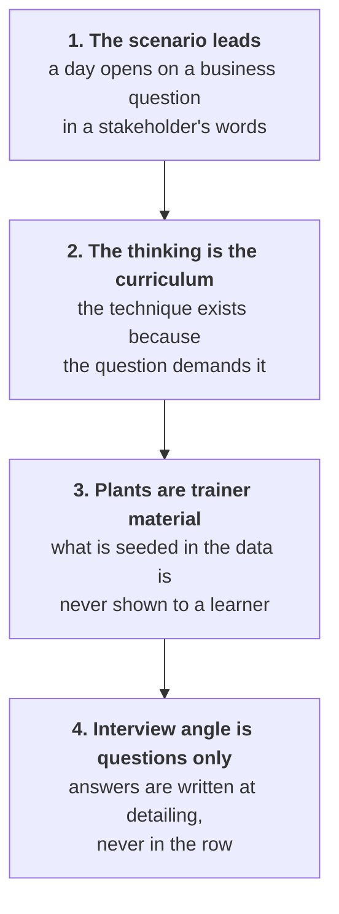

# CURRICULUM MAP SCHEMA
## How a curriculum row is laid out, and how a build session reads it

The curriculum lives in one workbook, `docs/curriculum/source.xlsx`, and is exported to markdown by
`python3 scripts/export_curriculum.py` so a build session reads rows as text rather than opening a
spreadsheet. **The workbook is the source and the markdown is a copy**, so a change made in the
markdown is lost at the next export.

This schema locked at v2 on 13 September 2026, following the 10 September curriculum review. The
change is not cosmetic: the day's business scenario and the thinking it trains now come **before**
the technique, because the review found that a day whose notebook runs but whose thinking is missing
teaches code rather than analysis.

---

## The tabs

| Tab | Shape | What it carries |
|---|---|---|
| `W1` to `W9`, one per week | A week title, a header row, a description row, then one row per day | Everything a day pack is built from |
| `Structure` | Component, status, detail | Week types, the Saturday shape, assessment status, the confirmed calendar |

Per-day build status used to live in a `Build Tracker` tab. It does not any more: the GitHub Project
board replaced it, one card per day pack, driven by `scripts/board_sync.py`. See
[`docs/agents/content-board.md`](agents/content-board.md).

---

## A week tab, row by row

```
row 1   IITGN COHORT 2 · WEEK 1 · DATA ANALYSIS FOUNDATIONS ·
        KALPA RETAIL: WHERE DOES OUR GROWTH COME FROM? · 28 SEP TO 03 OCT 2026
row 2   the column names, which the exporter reads by name and not by position
row 3   one line describing what each column must carry
row 4+  one row per day, including holidays and Saturdays
```

The week title now carries the **business question the week answers**, which is how a trainer can say
in one line what the week is for.

---

## The fifteen columns

They are in teaching order on purpose. A person reading a row left to right meets the business
problem, then the thinking, then the technique, which is the order the day itself runs in.

| # | Column | What it carries | What a build session does with it |
|---|---|---|---|
| 1 | **Day** | The date and the day type | Decides the folder: `content/W{ww}/D{d}/` or `content/W{ww}/SAT/` |
| 2 | **Business scenario of the day** | The situation in the stakeholders' words, with the questions they are asking | Opens the deck, the notebook and the day. It is the first thing built and the last thing cut. |
| 3 | **Day focus** | The slice of the week's focus this day carries, then what the day is about | The day heading, and the file's topic half |
| 4 | **Thinking we train, before any tool** | How an analyst or engineer breaks the scenario down | The teaching. The technique serves it, so this drives the whiteboard section and the first block. |
| 5 | **Trainer agenda** | The running order with durations | The block plan and the trainer day sheet |
| 6 | **Learner outcome** | Understands, can do, can handle, can defend | The close, the self-check spine, and what the exercises must actually test |
| 7 | **Subtopics** (technique in service of the scenario) | Everything covered, as bullets, in teaching order | The section order that the deck, the notebook and the exercises all share |
| 8 | **Trainer notes** | Start from, go as far as, stop before, comes later, what the data reveals, cut first | The scope fence, and the deliberate failure with its exact error text |
| 9 | **Client zero data** (TRAINER ONLY) | The dataset version and what is planted in it | The notebook's data, and the trainer note. **Never a student file.** |
| 10 | **In-session exercises** | Guided, unguided and mid-session work | The exercises family, guided and unguided folders |
| 11 | **After-class tasks** | Build, extend, read, watch, recap or set up | The take-home and the pre-read |
| 12 | **Interview angle** | The interview questions this day equips them for, questions only, tagged | The day's interview section, and the Saturday paper's source |
| 13 | **Trainer resources** | Verified links the builder and the trainer prepare from | The trainer pack. Every link carries the date it was verified. |
| 14 | **Student references** | Verified links learners watch or read after the session | The pre-read and the study notes |
| 15 | **Kahoot quiz plan** | What each item tests, plus the return question | The Kahoot pack, which is daily and ungraded |

---

## The four rules the schema enforces



**1. The scenario leads.** A day pack that opens on a technique has not been built from this row. If
column 2 is empty, the row is not ready and the build stops.

**2. The thinking is the curriculum.** Column 4 is the part a learner keeps. The canonical Week 1
example is the revenue tree: revenue is customers, times orders per customer, times items per order,
times price per item, less discounts. A learner who can state that tree, pick the branch the data
points at, and defend the choice has done data analysis, whatever the tool was.

**3. What is planted is never named to a learner.** Column 9 is labelled TRAINER ONLY in the header
for a reason. The room discovers the bulk order by sorting, the duplicates by reconciling and the
confounder by comparing. A slide that says "we planted 14 duplicate rows" has spent the lesson.

**4. Column 12 carries questions, never answers.** The tags are `[S]` staple asked everywhere, `[F]`
frequent in GCC and product screens, `[SV]` service-major screen opener, `[D]` differentiator. The
tagging is this programme's own calibration for 0 to 3 year Indian-market candidates, and it is
labelled as such wherever it is printed.

---

## What the workbook deliberately does not carry

| Not in a row | Why | Where it lives instead |
|---|---|---|
| Clock times | A pack with clock times goes stale the first time a schedule shifts, and it goes stale silently | Durations, in column 5 |
| Trainer names | Trainers change between cohorts. Fictional Kalpa stakeholders are a different thing and are named on purpose. | Role labels, and `docs/01_Programme_Facts_C2.md` for staffing |
| Marks, weights, percentages | Two weighting models are in circulation and neither is signed off | The `Structure` tab, which records that the split is pending |
| Answers to the interview questions | An answer in the row becomes the answer everybody gives | Written at detailing, in the day pack |
| Anything about a named real company as the thing the room computes on | Kalpa is the world; real cases are dated references in trainer notes | Column 13 |

---

## The checks

Run these after any workbook change, before the export is committed.

| Check | How |
|---|---|
| Every week tab still carries all fifteen columns | `python3 scripts/export_curriculum.py` exits with a FAIL naming the missing column |
| No export is left behind after a tab is renamed | The exporter lists stale files at the end; delete them in the same commit |
| The exported markdown matches the workbook | Re-run the exporter and check `git diff` is empty |
| Every URL carries a verified date | Read columns 13 and 14; an undated link is a build failure |
| No clock time, no trainer name, no weight | Scan columns 5, 8 and 9 |

---

## How a build session uses this

Given a week and a day, a session reads the day's row in `docs/curriculum/W{n}_*.md`, then the
`Structure` tab, then `docs/07_Client_Zero.md` for the dataset version named in column 9, then
`.claude/skills/day-pack-builder/SKILL.md`, and builds against `docs/03_Day_Pack_Spec.md`.

If the row is missing, if column 2 is empty, or if a reference in column 13 or 14 carries no verified
date, the session says so and stops rather than generating a plausible day.
