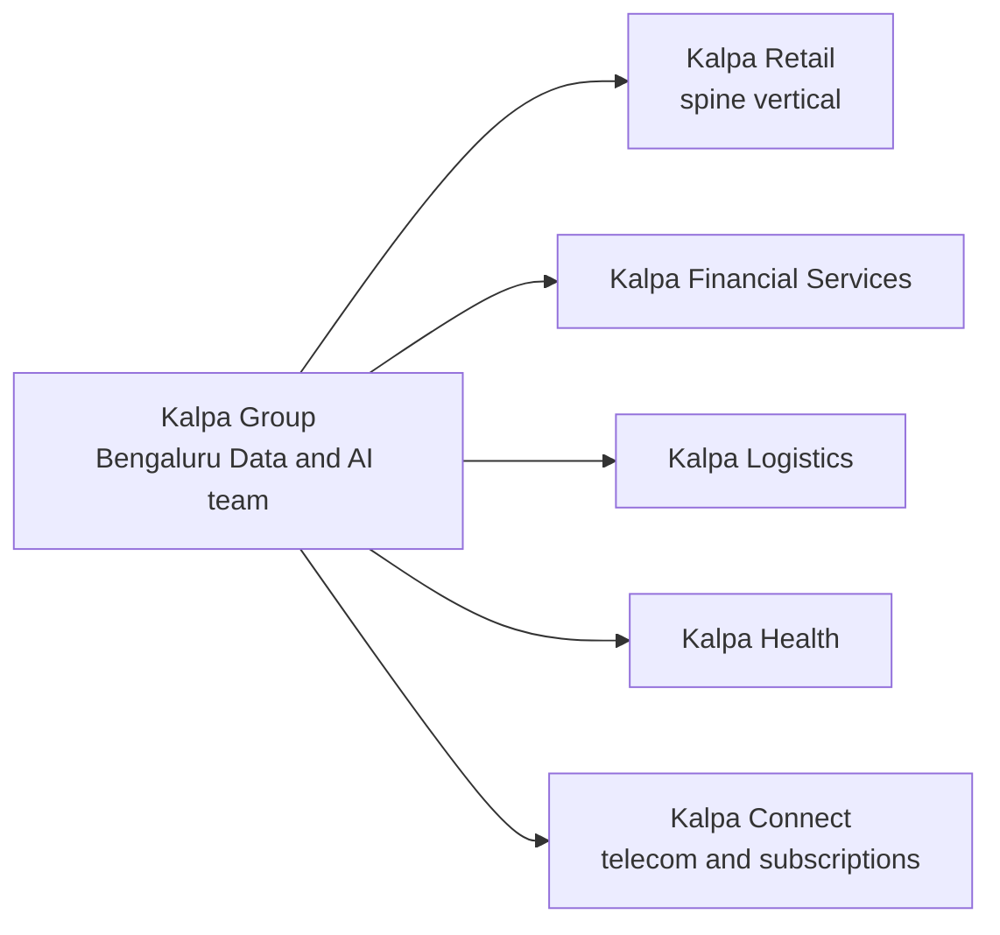
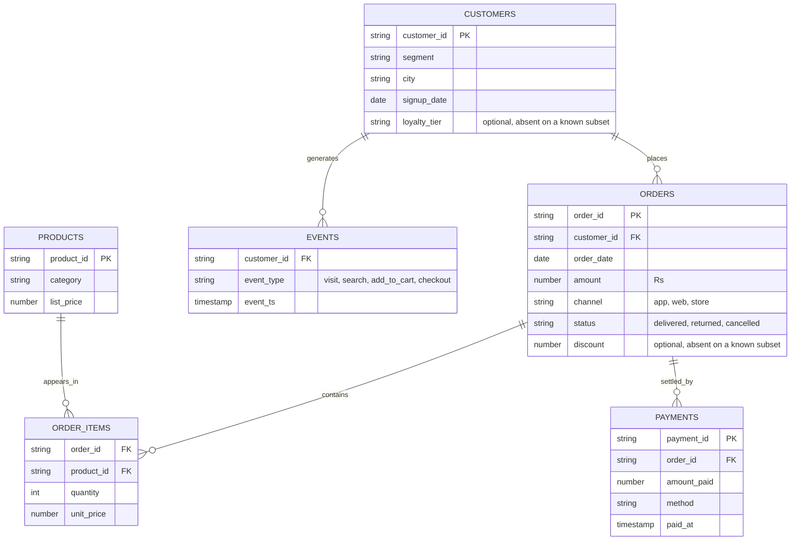

# CLIENT ZERO
## The one company every example in the programme lives inside

**Status: LOCKED, v1.1.** Every day pack builds against this file and nothing in it changes without a versioned edit recorded in section 9.

Locked by: Programme Head  Date: 09 September 2026

A role label stands in for a personal name. Replace it with a name if the record needs one.

Client zero is fictional. Any resemblance to a real company is coincidental, and the disclaimer travels with the name wherever it is printed.

---

## 1. The company

| Field | Value |
|---|---|
| Name | Kalpa Group, spoken as "Kalpa" in class |
| What it is | A diversified global conglomerate with five business units in five industries, headquartered in Singapore, with its largest engineering and data centre in Bengaluru |
| Where the cohort sits | The Data and AI team inside Kalpa's Bengaluru global capability centre, which serves all five business units |
| Business model, said from memory | Kalpa runs five businesses that share one customer base and one data platform. Each business unit owns its operations; the Bengaluru centre owns the data, the models and the AI systems that every unit runs on. The cohort is that centre's newest team. |
| Why this shape | It matches the Indian market the cohort is placed into, where most data and AI roles sit inside global capability centres serving several business lines, and it lets a learner grow inside one company for twenty weeks instead of re-orienting to a new firm every session. |

## 2. The five business units

One unit carries the teaching spine. The other four exist for build weeks, so learners tour the whole company at rising technical depth while the daily teaching never changes domain.

| Unit | Business in one line | Interview-classic case families it hosts in build weeks |
|---|---|---|
| Kalpa Retail | Online and in-store consumer commerce across India and South-East Asia | Basket analysis, returns, customer lifetime value, demand forecasting, product search and support assistants |
| Kalpa Financial Services | Payments and consumer lending | Fraud detection under imbalance, credit risk scoring with asymmetric error cost, transaction monitoring agents, policy document retrieval |
| Kalpa Logistics | Last-mile delivery and warehousing for all units | Delivery-time prediction, demand and capacity forecasting, route and slot optimisation, exception-handling agents |
| Kalpa Health | Diagnostic labs and clinic operations | Appointment no-show prediction, claims document processing, patient support assistants with strict refusal rules |
| Kalpa Connect | Mobile, broadband and subscription services | Churn prediction, plan recommendation, support ticket triage, network incident summarisation |

Every build week draws its five sub-problems one from each unit, each morphed from a case the Indian market actually interviews on, so a learner meets fraud, churn, no-shows, delivery times and baskets in the same company rather than in five unrelated datasets. Three groups take each sub-problem, so the panel hears alternate viewpoints on the same business problem back to back.

## 3. The entity model, Kalpa Retail

This is the world the teaching spine lives in from Week 1 to Week 15, re-expressed as the toolset grows: a list of dictionaries in Python, files on disk, tables in Postgres, a DataFrame in pandas, a feature table for models, and a document corpus for retrieval. The records stay recognisably the same throughout, which is what makes each new tool land.

Segments are four: Retail-Core, Retail-Plus, Business and Student.

Amounts are in Rs. A **typical** order sits between Rs 800 and Rs 3,000, and that band describes the
ordinary population rather than the whole file. Planted witnesses sit outside it on purpose: the
whale order in v1 is Rs 480,000 precisely because it is nothing like a typical order, and a dataset
where every value obeyed the band would carry no outlier to teach on.

Two optional fields exist and they are not the same thing. `discount` sits on the order and is absent
on a known subset from v0 onward, which is the Week 1 `.get()` lesson. `loyalty_tier` sits on the
customer and is untouched until a session needs it.

## 4. The spine dataset, version by version

The same records, growing in shape and dirtiness as the curriculum needs them. Every version is generated deterministically from one seed so all sixty learners hold identical data, and every planted defect is a witness for exactly one teaching point.

| Version | First used | Shape | Planted witnesses |
|---|---|---|---|
| v0 | Week 1, Monday and Tuesday | About 30 flat order records loaded by a setup cell, each with order_id, customer segment, amount, status and order_date, and a nested customer sub-record on some | One amount stored as the text "4500" (the type break); the optional field discount absent on a known subset (the KeyError and .get() lesson) |
| v1 | Week 1, Wednesday and Thursday | 50 records, first as a Python list, then as orders.csv and orders.json | One amount spelled "twelve"; one record missing a required field; a near-duplicate pair sharing an order_id with one differing order_date; one whale order of Rs 480,000; a Student segment of exactly 12 records so sample size bites; a truncated line in the JSON; a companion file with the header row duplicated |
| v2 | Week 2, Tuesday to Thursday | 1,000 orders and their customers as Postgres tables, plus a payments table | 50 orders with two payments each so a LEFT JOIN grows 1,000 rows to 1,450 and revenue doubles; a handful of orphan rows on each side; exact ties in amount so RANK returns 1, 1, 3; a segment composition that reverses at segment level for the Simpson demonstration |
| v3 | Week 2 Friday, Week 4 | The same tables plus order_items, products and events, and a monthly volume series | One very popular product that yields confidence 0.82 at lift 0.97 (the confidence trap); a growing new-cohort mix that holds blended retention flat at 41 percent while every cohort declines; one funnel stage whose drop is a denominator artefact |
| v4 | Week 4 Friday, Week 5 | The feature table per customer with a provided propensity score column and the modelling target | The return flag as the target at roughly 96 to 4 imbalance; a settlement_status field set after the outcome, which leaks; one curved relationship so residuals bow; two correlated features so a coefficient sign flips when both are included |
| corpus | Weeks 11 and 12 | Kalpa Retail's document estate: returns and refunds policy, delivery terms, the customer support playbook, product manuals, and a bank of anonymised support tickets | Two policy documents that contradict on one clause (the correct-source wrong-answer failure); a question the corpus cannot answer (the refusal lesson); a product manual that mentions a term found nowhere else (the grounding check) |

Build weeks do not use this dataset. They use real, messy data at scale, re-labelled into the Kalpa unit that hosts the sub-problem, because no concept is being taught for the first time and real data is what the brief rewards.

## 5. The metrics the cohort computes again and again

These recur from Week 1 through the capstone, each first done by hand and then automated by the next tool, so the answer is always already known before the new tool arrives.

| Metric | First computed | Returns in |
|---|---|---|
| Orders and revenue by segment | Week 1, plain Python | SQL in Week 2, pandas in Week 2, the feature table in Week 5 |
| Average order value, mean against median | Week 1 Thursday | The stakeholder sentence in Week 2, forecasting in Week 4 |
| Return rate with its denominator | Week 1 Thursday | The modelling target in Week 5 |
| Conversion through the funnel | Week 4 Thursday | Agent evaluation in Week 14 as a cost-per-task analogue |
| Retention by signup cohort | Week 4 Thursday | The churn family in Kalpa Connect build weeks |
| Basket lift | Week 4 Wednesday | Recommendation cases in Kalpa Retail build weeks |
| Cost per run of an AI feature | Week 8 Friday | Every agent and retrieval build from Week 12 onward |

## 6. Domain discipline

- The teaching spine is Kalpa Retail throughout. Teaching weeks never change domain.
- The sanctioned domain excursions are the second-example transfer moments in the doctrine, and they map to the other four units: when a session needs a transfer example after the concept has landed, it draws from Kalpa Financial Services, Logistics, Health or Connect, never from an outside company.
- Build weeks tour the units by design, one sub-problem per unit, and are the only place real data appears.
- Case studies about real companies remain welcome in trainer notes and slides as dated, verified references; they never replace Kalpa as the example the room computes on.

## 7. How the world is introduced

Day 1 opens on Kalpa as a story before any code runs: who the company is, what the five units sell, where the cohort's team sits, and the entity picture drawn on the board. The learner should be able to draw the company from memory by the end of Week 1, because every example for the next nineteen weeks lands inside it. The Day 1 introduction pack carries this narrative and is built only after this file is marked LOCKED.

## 8. What this lock produces next

1. `data/generate_client_zero.py` in the repository: one seeded generator that writes every version in section 4 with its witnesses, so the day packs read data rather than invent it.
2. The Day 1 introduction pack.
3. The Build 1 sub-problem set: five briefs, one per unit, each morphed from an interview-classic case into the Kalpa persona.

---

## 9. Version history and open conflicts

| Version | Date | Change |
|---|---|---|
| v1.0 | 09 September 2026 | Locked. Sections 1 to 8 frozen as written. |
| v1.1 | 09 September 2026 | The four conflicts raised at lock are ruled on and the file is edited to match. Section 3 gains `discount` on ORDERS and a paragraph separating the typical band from the planted witnesses. Section 4 moves v0 to Monday and Tuesday, moves v1 to Wednesday and Thursday, and describes the near-duplicate pair as differing on order_date. |

### The four conflicts, ruled on at v1.1

Each was found while building Week 1 against this file. The curriculum export outranks this file, so
each ruling moves this file rather than the curriculum, and each is now applied above.

| # | The conflict | Ruling | What changed |
|---|---|---|---|
| 1 | Section 4 placed v1's 50 records at "Tuesday to Thursday", while the Tuesday row says the data is "the same records" as Monday's and Monday's row says about 30 | The curriculum is right and the file was off by one day. Tuesday teaches on 30 orders because its subject is one record at a time, and 50 arrives on Wednesday because that is the day the subject becomes the dataset | Section 4 now reads v0 for Monday and Tuesday, v1 for Wednesday and Thursday |
| 2 | Section 4 said the near-duplicate pair differs on a "timestamp", which the section 3 entity model never gives ORDERS | The entity model is right. Adding a timestamp to ORDERS to justify one sentence would ripple into Week 2's Postgres tables for no teaching gain, and `order_date` carries the lesson intact | Section 4 now says the pair differs on `order_date` |
| 3 | Section 4 named `discount` as v0's optional field, while section 3 gave CUSTOMERS an optional `loyalty_tier` and no `discount` anywhere | Both fields are real and the entity model was simply incomplete. `discount` belongs on the order, since it is a property of what was bought rather than of who bought it | Section 3 gains `discount` on ORDERS as an optional field, and a paragraph says plainly which optional field is which |
| 4 | Section 3 caps a typical order at Rs 3,000, and v1 plants a Rs 480,000 whale | No conflict once the sentence is read as intended. The band describes the ordinary population, and the whale is a witness that exists precisely because it violates the band | Section 3 now says so explicitly, so the next reader does not have to rediscover it |

No conflicts are open. Anything found from here starts a new row in the table above and a new version.
