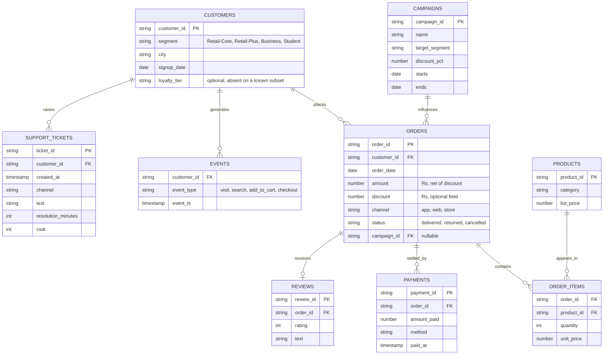

# CLIENT ZERO
## Kalpa Group, and the business problems the cohort solves inside it

**Status: LOCKED.** Version 2.2, locked 13 September 2026. Every day pack builds against this file. Changes ship as a new version with a date and a note of what they invalidate.

Version history: v1.0 proposed 9 September (company, units, entity model, spine dataset). v2.2 locked 13 September, superseding v2.1 the same day: the full nine-week ladder is fixed to the day, the stakeholder table adds Kavya Nair, Rohan Desai, Farhan Sheikh and Ananya Bose, the Build 2 and Build 3 sub-problems are seeded, and the reviews and tickets datasets have their entry days. v2.1: the week ladder is realigned to the 20-week plan's week focus (inference and causal reasoning sit in Week 1, Week 2 is data manipulation through a full Excel day), the named stakeholders are fixed, the campaigns table enters in Week 1, and the Kalpa Health sub-problems for Build 1 are seeded. v2.0: the storyline is now business-problem-first per the 10 September curriculum review, each day opens on a business question rather than a technique, three threads run across the modules, domain rotation is scheduled, three datasets are added, and planted defects are never shown to students.

Client zero is fictional. Any resemblance to a real company is coincidental, and the disclaimer travels with the name wherever it is printed.

---

## 1. The company, said from memory

Kalpa Group is a diversified global conglomerate headquartered in Singapore with five business units: Retail, Financial Services, Logistics, Health and Connect. Its largest engineering and data centre is in Bengaluru, and the cohort is the newest data and AI team there, serving all five units. Retail is where the team starts because it is the unit under the most pressure: revenue grew 4 percent last year against a plan of 15 percent, and the CEO of Kalpa Retail, Meera Raghavan, has asked the team one question before she approves any marketing spend: "Where does our growth actually come from, and where is it leaking?"

That question opens Day 1 and is never fully closed. Every module answers a harder version of it with a stronger tool, which is how a learner comes to see that data analysis, machine learning, deep learning and generative AI are successive answers to the same business problem rather than separate subjects.

## 1a. The people the room answers to

| Name | Role | What they keep asking |
|---|---|---|
| Meera Raghavan | CEO, Kalpa Retail | Where does growth come from, and what do I do about it? One page, two minutes. |
| Anand Iyer | Finance controller, Kalpa Retail | Do your numbers match my books, and can my analyst audit how you got them? |
| The head of Retail-Plus | Owner of the paid-membership tier | Is my tier the one slipping, and who do I protect first? |
| The marketing lead | Owner of acquisition and campaigns | Prove or disprove that we need more customers; did my campaign work? |
| The data platform lead | Owner of the warehouse | Query it, do not export it; tell me before you break it. |
| Kavya Nair | Senior analyst, Kalpa Retail data team | The in-story mentor: show me the baseline, show me the evidence, do it a third way and choose. |
| Dr Priya Menon | COO, Kalpa Health | The Build 1 stakeholder: the same growth question in a diagnostics business. |
| Rohan Desai | Head of risk, Kalpa Financial Services | Enters Week 5: the same model where a wrong call costs twenty times more one way than the other. The Build 2 stakeholder. |
| Farhan Sheikh | Head of customer support, Kalpa Retail | Enters Week 8: two thousand tickets a day; can the model read them, draft the reply, and what does it cost? Owns the assistant from Week 10. |
| Ananya Bose | COO, Kalpa Connect | The Build 3 stakeholder: the same text problems at telecom scale, under output contracts and cost ceilings. |

Names are fictional and stay consistent across every artifact; a trainer says them from memory.

## 2. The principle behind every day

Each teaching day opens on a business question in a stakeholder's words, trains the thinking an analyst uses to break that question down before any tool is touched, and only then teaches the technique that produces the answer. The technique exists because the question demands it. A day whose notebook runs but whose thinking is missing teaches code rather than analysis, and that is the failure the 10 September review named.

The thinking is the curriculum. The canonical Week 1 example: revenue is customers times orders per customer times items per order times price per item, less discounts. Growth can come from more customers, more orders per customer, bigger baskets, higher prices, or discounts that lift volume by more than they cost. An analyst who can state that tree, pick the branch the data points at, and defend the choice has done data analysis. That tree is also the profitability framework every case interview tests, so the learner is being trained for the room they will sit in.

## 3. Three threads that run the length of the programme

| Thread | The question it keeps asking | Weeks 1 to 4 | Weeks 5 to 9 | Weeks 10 to 15 |
|---|---|---|---|---|
| Growth | Where does growth come from, and how do we get more of it? | The revenue tree, which lever moved, which baskets and cohorts and thresholds | Target the customers most likely to buy again; where tabular models plateau, learn from text and images | Answer customers and upsell automatically through an assistant, then an agent |
| Trust | Can we believe this number? | Profiling, cleaning, reconciliation with Finance, sampling and significance | Honest evaluation, leakage, the metric that matches the business cost | Grounding, citations, evaluation harnesses, monitoring |
| Cost and risk | What does a wrong call cost, and who bears it? | Discounts that lose money, returns, the cost of a false alarm | Asymmetric error costs in credit and fraud, imbalance | Token budgets, guardrails, refusal, human-in-the-loop |

Two or three threads stay open at any time, per the review. Growth is the spine; Trust and Cost are the two questions a skeptic in the room raises against every Growth answer.

## 4. The business question ladder

Week 1 is fixed to the day because it is being built now. Weeks 2 to 9 are fixed to the week and get detailed to the day on go-ahead. Later weeks are outline.

| Week | Module | The business question the week answers | What it forces the learner to learn |
|---|---|---|---|
| 1 | Data analysis foundations | Where does our revenue come from, which lever moved, can we trust the numbers, is the gap real, did the discount cause the lift, and what do we tell the CEO on Monday? | The revenue tree, the sales-drop investigation ladder, descriptive statistics, profiling and reconciliation, hypothesis testing and the p-value, correlation against causation, the stakeholder note; Python as the vehicle |
| 2 | Data manipulation at depth | Finance wants the numbers from the warehouse every Monday. Are we collecting what we bill? Who are our top members and whose spend is falling? Marketing wants one row per customer, refreshed weekly. The leadership deck lives in Excel. | SQL from selection to CTEs, joins and validation, window functions, pandas groupby, merge and reshape, the three-tool re-expression, a full Excel-for-analysts day and the tool operating rule |
| 3 | Build 1 | Five Kalpa Health sub-problems, three groups each | Contextualising the Week 1 and 2 method in an unfamiliar domain, which is the interview skill the review named |
| 4 | Analyst craft | Which metric should the growth plan chase, which products lift order frequency, why did Retail-Plus frequency fall, and whom do we target with a discount when a wrong pick costs money? | Metric design, basket analysis, cohorts and retention, threshold selection, forecasting baselines |
| 5 | Applied Machine Learning | Can we predict who will buy again if nudged, and how good is that prediction honestly? Parallel: which loan applicants should Kalpa Financial approve? | The modelling loop, evaluation under imbalance, features and leakage, generalisation; the first domain transfer |
| 6 | Build 2 | Five Kalpa Financial Services sub-problems under injected constraints | Modelling judgment where the cost of an error is asymmetric |
| 7 | Deep Learning | The tabular model has plateaued; customers also leave reviews and photos. Can a network learn from those? | Networks, training, diagnostics and control, the bridge to sequence models; the reviews dataset enters |
| 8 | NLP and LLM internals | Support tickets and reviews arrive as text; what if the answers came automatically? | Tokens, attention, embeddings and semantic search over tickets, decoding, cost; the support-tickets dataset enters |
| 9 | Build 3 | Five Kalpa Connect sub-problems on text | Controlled LLM output on churn, triage and summarisation |
| 10 to 12 | Generative AI, Applied Generative AI, Build 4 | Build the assistant that answers customers from Kalpa's own policies with citations | Prompting, structured output, retrieval, grounding, evaluation |
| 13 to 15 | Agentic AI, Advanced Agentic AI, Build 5 | Let the assistant act: resolve tickets, issue refunds within limits, escalate | Agents, tools, state, guardrails, cost per task, operations |
| 16 to 20 | Production AI, Capstone | Propose, build, deploy and defend one Kalpa system end to end | Solution engineering, deployment, monitoring, defence |

### Week 1, day by day

| Day | Business scenario, in one line | Thinking trained | Technique that answers it |
|---|---|---|---|
| Mon 28 Sep | Meera: what is 'sales' made of, and is marketing's Rs 12 crore even aimed at the branch that is short? | The revenue driver tree; a business ask translated into measurable branches; refuse the average when one customer buys in bulk | Python values, loops, accumulators, records as dictionaries; count, sum, mean and median |
| Tue 29 Sep | Meera: Q1 to Q2 fell; which branch moved, and is Retail-Plus the tier slipping? | The sales-drop investigation ladder; like-with-like windows and denominators; describe each segment honestly | Grouping by key, descriptive statistics, functions, the first defensive conversion |
| Wed 30 Sep | Anand: your dashboard says 2.1 crore and my books say 1.9; reconcile before anyone acts | Profile before analysing; every cleaning act recorded; input equals clean plus rejected; the revenue bridge | Files in and out, profiling, missing values, types, duplicates, outliers, the rejects and decisions logs |
| Thu 1 Oct | Meera: is the gap real, should I fund Student, did the monsoon discount work; one page by Monday | The chance reference and the p-value; sample size; correlation against causation and the fair comparison; the four-part note | The permutation test in code, the rule of thumb, the campaign comparison by segment, claim-evidence-caveat-action |
| Fri 2 Oct | Gandhi Jayanti, no session | | |
| Sat 3 Oct | Recap paper and the interview-answer discussion | | |

### Week 2, day by day

| Day | Business scenario, in one line | Technique that answers it |
|---|---|---|
| Mon 5 Oct | Anand: the same numbers every Monday, from the warehouse itself | SQL from selection to CTEs; the Monday extraction suite |
| Tue 6 Oct | Anand: booked is not collected; show me the gap by order and channel | Joins, fan-out, validation, the anti-join, the booked-against-collected report |
| Wed 7 Oct | Marketing: the top fifty members per segment, who is falling two months running, and revenue against the plan line | Window functions: rank with the requested tie rule, LAG, running totals |
| Thu 8 Oct | The growth team: one row per customer, refreshed weekly; the senior analyst: do it a third way and choose | pandas groupby, merge with validate=, reshape; the three-tool re-expression and the tool-choice note |
| Fri 9 Oct | Meera's chief of staff: three things I can open without a login, recalculating live | The Excel-for-analysts day: pivots, XLOOKUP, presenting one number, the tool operating rule |
| Sat 10 Oct | Recap paper and the interview-answer discussion | |

### Build 1, Kalpa Health, sub-problem seeds

Dr Priya Menon's diagnostics business grew 5 percent against a plan of 18. Five sub-problems, three groups each: the revenue tree for a lab; bookings fell in two cities; invoices against collections; the no-show rate in one clinic, real or noise; the free-home-collection campaign, cause or coincidence. Each is the Week 1 and 2 method in a domain the room has never seen.

### Week 4, day by day (Dussehra Tuesday off)

| Day | Business scenario, in one line | Technique that answers it |
|---|---|---|
| Mon 19 Oct | Three departments want three targets; Meera wants one number and its guardrails | Metric design: north-star, guardrails, leading against lagging, the proxy test |
| Wed 21 Oct | Merchandising wants to bundle everything with the best-seller; which pairs actually lift frequency, and what is each worth | Support, confidence, lift; the confidence trap; the costed recommendation |
| Thu 22 Oct | The head of Retail-Plus: is it a cohort problem or an everyone problem, and where in the funnel is the loss | Cohorts, funnels, retention curves, the blended-against-cohort decomposition |
| Fri 23 Oct | Anand: two forecasts eighteen points apart; which goes to the board and how wrong could it be | Trend and seasonality, naive and seasonal-naive baselines, hold-out MAE, the good-enough call |
| Sat 24 Oct | The cross-domain transfer drill, then the recap paper | |

### Week 5, day by day (ME1 continuous, day not fixed)

| Day | Business scenario, in one line | Technique that answers it |
|---|---|---|
| Mon 26 Oct | Marketing: a score per customer for who will buy again in ninety days; Kavya: show me the baseline first | Framing, splits, baselines, regression and classification read honestly |
| Tue 27 Oct | The 96 percent model that found nobody; Anand's costs; Rohan asks whether it works for loans | The confusion matrix, metrics from costs, the 1-in-N threshold, the opposite threshold in lending |
| Wed 28 Oct | A feature lifts validation to 0.99 and is written after delivery | Feature engineering from the customer table, encoding, scaling, the prediction-time question |
| Thu 29 Oct | A tree at 100 on training and 61 on validation; one campaign budget | Learning curves, bias and variance, regularisation, cross-validation, the simpler-model comparison |
| Fri 30 Oct | The steering committee: which model, what it costs when wrong, how we know it is stale, what transfers to lending | The model justification memo and the transfer paragraph |
| Sat 31 Oct | Revision, the recap paper, the ME1 window | |

### Build 2, Kalpa Financial Services, sub-problem seeds

Rohan Desai's payments and lending business. Five sub-problems, each with a constraint written in: credit approval where a default costs twenty times a wrongful rejection; fraud at half a percent positives; collections prioritisation with a fixed team; churn on the payments app with the target defined first; the lending campaign that lifted approvals 9 percent, cause or mix.

### Week 7, day by day (Monday off for Diwali)

| Day | Business scenario, in one line | Technique that answers it |
|---|---|---|
| Tue 10 Nov | Marketing: forty thousand reviews and every product photo; can the model read them; Kavya: it must beat logistic on the numbers first | The neuron, layers, the forward pass, the collapse without activation, the honest comparison |
| Wed 11 Nov | An abandoned loop that goes to nan at step ten; the app team wants a run budget | Loss, backprop intuition, optimisers, the learning rate |
| Thu 12 Nov | Three runs, three stories; diagnose from the chart before touching a setting, and make the fix reproducible | Curve reading, gradient pathologies, the three brakes, seeds |
| Fri 13 Nov | The reviews enter as sequences; show the smallest thing that reads one and where it breaks | Next-token prediction, auto-regression, the long-range failure, why attention won |
| Sat 14 Nov | Recap paper and the interview-answer discussion | |

### Week 8, day by day

| Day | Business scenario, in one line | Technique that answers it |
|---|---|---|
| Mon 16 Nov | Farhan: two thousand tickets a day; what is a token, and why does the vendor bill by it | Tokenization, vocabularies, token counts against cost |
| Tue 17 Nov | Farhan's ticket that broke the rules-based triage: which 'it' does the customer mean | Self-attention, queries, keys, values, multi-head, position |
| Wed 18 Nov | Find the five past tickets most like this one; keyword search matched 'not working' with 'working fine' | The classical lineage, contextual embeddings, similarity and its limits |
| Thu 19 Nov | The draft reply invents a refund policy; make it repeatable and make it stop inventing | Decoding controls, determinism, stopping conditions |
| Fri 20 Nov | Two vendor bills five times apart; the assistant forgets the start of long tickets | Context windows, prompt against completion cost, latency, batching, the cost model |
| Sat 21 Nov | Recap paper and the interview-answer discussion | |

### Build 3, Kalpa Connect, sub-problem seeds

Ananya Bose's telecom and subscriptions business. Five sub-problems, each under an output contract and a cost ceiling: churn early warning from support text; ticket triage into a fixed schema; incident summarisation with a citation contract; plan recommendation with a refusal rule; reply drafting with a cost ceiling and repeatability. The AI-free observed debug drill runs Wednesday morning.

## 5. Domain rotation

- Module 1 (Weeks 1 to 4) teaches in Kalpa Retail only. The review was explicit that switching domain in the first module is unfair to a room still learning the tools.
- Build weeks use a different unit from the teaching that preceded them, so learners practise contextualising: Build 1 in Kalpa Health, Build 2 in Kalpa Financial Services, Build 3 in Kalpa Connect, later builds in Logistics and back to Retail at scale. This is deliberate training for the interview question the review quoted: "you are in a health company now, tell me how you would apply this to our data."
- From Week 5, the second worked example on a teaching day comes from another unit, progressively: Financial Services first (credit and fraud, where error costs are asymmetric), then Health (no-shows and claims), then Connect (churn and support).
- Real case studies about named companies remain welcome in trainer notes and slides as dated references; they never replace Kalpa as the data the room computes on.

## 6. The entity model, Kalpa Retail

Orders, customers, order items, payments, products and events carry Weeks 1 to 5. Campaigns enters on Week 1 Thursday for the discount question and returns in Week 2 as the exposure table. Reviews enter on Week 7 Friday and support tickets on Week 8 Monday, when the Growth thread turns to text. A typical order sits between Rs 800 and Rs 3,000.

## 7. The spine dataset and its hidden witnesses

Every version is generated deterministically from one seed so all sixty learners hold identical data. Every planted feature is a witness for exactly one teaching point, and, per the review, **students are never told what is planted**. The witness column is TRAINER material: it appears in trainer notes and nowhere a learner can read.

| Version | First used | Shape | Witnesses (trainer only) |
|---|---|---|---|
| v0 | Week 1, Mon | About 30 flat order records with segment attached, loaded by a setup cell | One corporate bulk order of Rs 480,000 that drags the mean order value far above the median (the honest-average lesson); one amount stored as the text "4500" |
| v1 | Week 1, Tue | 200 orders across two quarters with customer segment and month | Customer count flat quarter on quarter while orders per customer fall in Retail-Plus only, so the decomposition finds the frequency lever rather than acquisition; the optional discount field absent on a known subset |
| v2 | Week 1, Wed | The same two quarters as orders.csv and orders.json, exported "from the ERP" | 14 duplicated order rows in the earlier quarter that inflate its revenue, so the "drop" shrinks once cleaned; one amount spelled "twelve"; one record missing a required field; a near-duplicate pair sharing an order_id with one differing timestamp; a truncated JSON line; a companion file with the header duplicated |
| v3 | Week 1, Thu | The cleaned two quarters plus the Student segment, plus the campaigns table with August's monsoon sale for Retail-Plus | The Student segment holds exactly 12 orders so its impressive rate cannot be trusted; the Retail-Plus gap is real but modest; the monsoon sale lifts aggregate revenue 6 percent while every segment separately fell, because the treated group skews toward customers who would have bought anyway (the Simpson reversal and the confounder in one) |
| v4 | Week 2 | 1,000 de-duplicated orders, customers, payments, campaign exposure and a plan line in Postgres | 50 orders with two payment rows (gateway retries) so a LEFT JOIN grows 1,000 rows to 1,450 and collected revenue doubles; 30 delivered orders never paid; orphan payments; exact ties at the fiftieth position in Retail-Plus; three members whose spend fell two months running; duplicate keys in the exposure table so validate= raises; a raw export that double-counts in a pivot |
| v5 | Week 4 | Order items, products, events, a monthly series | One very popular product at confidence 0.82 and lift 0.97; a growing new-cohort mix that holds blended retention flat while every cohort declines; a funnel stage with a denominator artefact |
| v6 | Week 5 | The customer feature table with the modelling target | Repeat purchase within 90 days as the target at roughly 96 to 4; a settlement_status field set after the outcome, which leaks; two correlated features so a coefficient sign flips |
| text | Weeks 7 and 8 | Reviews with ratings; support tickets with resolution time and CSAT | Same-word opposite-meaning review pairs for the embedding lesson; a ticket class that rules-based triage cannot separate; a policy clause two documents contradict |
| corpus | Weeks 11 and 12 | Returns and refunds policy, delivery terms, the support playbook, product manuals, anonymised tickets | Two documents that contradict on one clause; a question the corpus cannot answer; a manual that uses a term found nowhere else |

Build weeks do not use this dataset. They use real messy data at scale, re-labelled into the Kalpa unit hosting the sub-problem.

## 8. Interview anchors carried by the threads

Each thread carries interview questions the Indian market asks at the 0 to 3 year band, and the weekly Saturday question sets draw from them. Growth: "How would you increase sales for an online retailer?", "Sales dropped 15 percent last month, how would you investigate?", "How would you measure the success of a new feature?", "Which customers would you target and why?". Trust: "How do you handle missing data?", "The dashboard and Finance disagree, what do you do?", "How do you know a change is significant?", "How do you evaluate a model honestly?". Cost and risk: "Precision or recall for fraud, and why?", "How do you set a threshold when errors cost differently?", "How do you keep an LLM feature inside budget?".

## 9. What this lock produces next

1. The Week 1 curriculum rebuilt to this storyline, then Weeks 2 to 9 on go-ahead.
2. `data/generate_client_zero.py`, one seeded generator writing every version above with its witnesses.
3. The Day 1 introduction pack, opening on the CEO's question.
4. The Build 1 sub-problem set in Kalpa Health.
