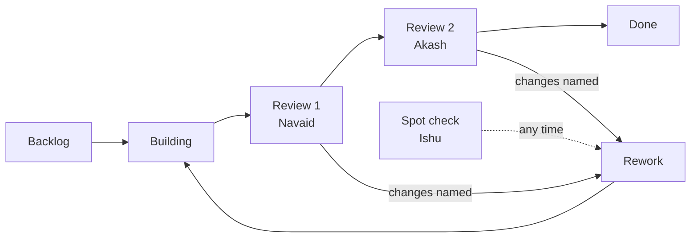

# The content board

The board tracks one card per day pack, because a day pack is what a session builds and what a
reviewer signs off. It lives on this repository, its cards are GitHub issues, and
`scripts/board_sync.py` keeps it in step with the day plan without anyone retyping a row.

## Where each thing lives

| Thing | Where | Who changes it |
|---|---|---|
| The cards | Issues on this repository | `scripts/board_sync.py`, or anyone typing in the issue |
| The status of a card | A `status:` label, mirrored by the board's Status column | Whoever holds the card |
| Who holds a card | An `owner:`, `review-1:`, `review-2:` or `spot:` label | Whoever hands it on |
| Which week a card belongs to | The milestone, one per week | `scripts/board_sync.py` |
| The board itself, its columns and its views | A GitHub Project on the `fde-academy-lab` account, linked to this repository | Set up once, by hand |

## The one manual step

A GitHub Project and its Status column are only reachable through the GraphQL API, and a Claude
Code session cannot open that. Everything else on this page is automated. The board is created
once, in about a minute, and then never again.

1. Open <https://github.com/orgs/fde-academy-lab/projects> (or the Projects tab on this
   repository) and choose **New project**, then the **Board** template.
2. Name it `C2 Content Build` and create it.
3. Open the project's **⋯ → Settings → Manage access**, and link this repository.
4. In the board's **Status** field, replace the three default options with these seven, in this
   order. The names must match the labels exactly, without the `status:` prefix.

   | Option | What it means | Who holds it |
   |---|---|---|
   | Backlog | Planned, nobody has started it | Nobody |
   | Building | The day pack is being built | Rushikesh, or Anmol |
   | Review 1 | First-level review: is it correct and complete | Navaid |
   | Review 2 | Second-level review: is it the right call for the programme | Akash |
   | Spot check | An ad hoc review raised outside the two levels | Ishu |
   | Rework | Sent back with the change named in a comment | Back to the builder |
   | Done | Signed off, gate green, shipped | Nobody |

5. Choose **Add item → Add items from repository**, pick `c2-content-factory`, and add every
   issue. New cards after this are added by the workflow in `.github/workflows/board-add.yml`
   once its secret is set, or by hand from the same menu.

Three views are worth saving on top of the default board, each one a **Save changes** away:

| View | Layout | Group by | Filter |
|---|---|---|---|
| Build board | Board | Status | `-label:type:holiday` |
| By week | Table | Milestone | none |
| Mine | Board | Status | `label:owner:rushikesh` and so on per person |

## The statuses, and how a card moves



A card only moves forward when the gate is green. `python3 scripts/verify.py content/W01/D3
--execute` is the one command that proves a day pack, and a pack that has not passed it is not
done whatever the board says.

A spot check is deliberately outside the line. Ishu can raise one against any card at any status;
it lands as a comment, the card goes to Rework, and the comment names the change. Nothing is
reworked on a feeling that something is off.

## The labels

| Group | Labels | Rule |
|---|---|---|
| Status | `status:backlog`, `status:building`, `status:review-1`, `status:review-2`, `status:spot-check`, `status:rework`, `status:done` | Exactly one per card |
| Who holds it | `owner:rushikesh`, `owner:anmol`, `owner:claude`, `review-1:navaid`, `review-2:akash`, `spot:ishu` | One owner, plus whoever currently holds it |
| Day shape | `type:teaching`, `type:saturday`, `type:build-week`, `type:holiday` | Exactly one, set by the day plan |
| Artifact | `artifact:deck`, `artifact:notebook`, `artifact:exercises`, `artifact:takehome`, `artifact:kahoot`, `artifact:preread`, `artifact:study-notes`, `artifact:cheatsheet`, `artifact:trainer`, `artifact:demos` | On follow-up issues a review raises, never on a day card |
| Gate and blocks | `gate:verify-pass`, `gate:verify-fail`, `blocked`, `curriculum-rework` | As they apply |

Artifact labels are not put on day cards on purpose. Every teaching day owes the same ten
families, so ten identical labels on every card colour the board and say nothing. They earn their
place on the follow-up issue a review raises, where "the deck needs another pass" is worth
filtering on.

## People

The five people are carried as labels rather than as GitHub assignees, because the board had to
work before every reviewer had an account on this repository.

| Person | Labels | Holds |
|---|---|---|
| Rushikesh | `owner:rushikesh` | Building the day pack |
| Anmol | `owner:anmol` | Building the day pack |
| Navaid | `review-1:navaid` | First-level review |
| Akash | `review-2:akash` | Second-level review, and the programme call |
| Ishu | `spot:ishu` | Spot checks, raised at will |

To swap in real assignees once the handles exist, add each person as a repository collaborator,
then run `python3 scripts/board_sync.py --week W02 --label owner:rushikesh` as usual and set the
assignee on the card. The labels stay; they are what the board filters on.

## Driving the board from Claude Code

```bash
# The one-time furniture. Safe to run again; it corrects drift and leaves the rest alone.
python3 scripts/board_sync.py --labels --milestones

# Open the cards for a week that is about to be built.
python3 scripts/board_sync.py --week W02 --set-status backlog

# Hand a week to its builder.
python3 scripts/board_sync.py --status W02 building
python3 scripts/board_sync.py --week W02 --label owner:rushikesh

# Move one day through the line.
python3 scripts/board_sync.py --status W02/D3 review-1
python3 scripts/board_sync.py --status W02/D3 review-2
python3 scripts/board_sync.py --status W02/D3 done

# See what a command would do and change nothing.
python3 scripts/board_sync.py --dry-run --all
```

Every run is safe to repeat. A card is matched on the marker `<!-- board:W02/D3 -->` in its body,
so a second run updates the card the first run made rather than opening a duplicate. Moving a card
to `done` closes it as completed; moving it to anything else reopens it.

## What the board does not do

It does not hold the content and it does not judge it. The content is the repository, and the
judgment is `scripts/verify.py`. The board says who is holding which day and what state it is in,
which is the one thing neither the files nor the gate can tell you.
