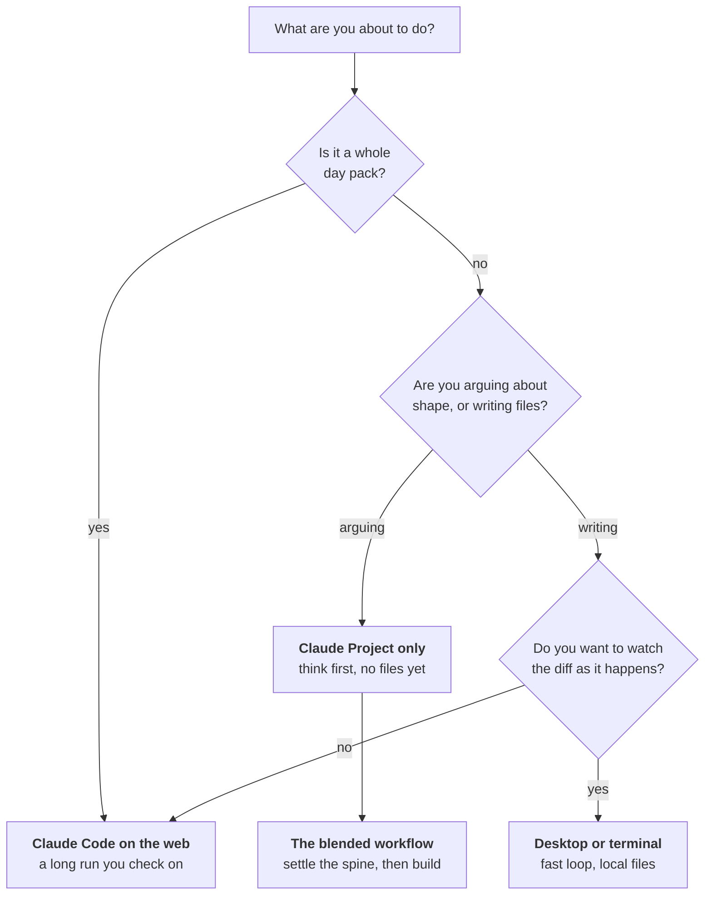
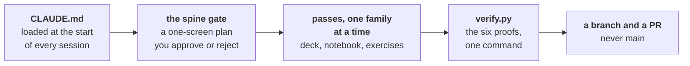

# Building content with Claude

Five ways to work. They differ in where the files live and how much you watch, and they all end at
the same place: **a branch, a passing gate, and a pull request somebody reviews.**

Everything on this page was checked against the official Claude Code documentation on
**10 September 2026**. Where a version or a command matters, the source is linked.

---

## Pick a lane in ten seconds



| Lane | Where files live | Watch it? | Best for |
|---|---|---|---|
| [Claude Code on the web](Claude-Code-on-the-web) | A cloud VM, pushed to a branch | Check back | A full day pack, the default |
| [Claude Code on desktop](Claude-Code-on-desktop) | Your machine | Yes, continuously | Fixing one artifact, a tight loop, anything visual |
| [Claude Project only](Claude-Project-only) | Nowhere, it is a conversation | Yes | Shaping a week, arguing about a spine, drafting before commitment |
| [The blended workflow](The-blended-workflow) | Both, in sequence | Both | What most real work turns out to be |
| [Manual steps and checks](Manual-steps-and-checks) | Your eyes | Always | The things no tool does for you |

---

## What is the same in every lane

Four things do not change, and they are the reason a session written by somebody else still lands.



1. **`CLAUDE.md` is read at the start of every session**, on every surface. It is the file that
   carries the naming rules, the folder layout, the banned words and the ground truth order. If a
   session is producing the wrong shape of thing, the fix usually belongs in `CLAUDE.md` rather than
   in the prompt.
2. **The spine gate is not optional.** A session states the envelope, the continuity and a
   one-screen spine, then stops. You approve or you reject. Nothing past the spine gets built
   without an explicit yes, because rejecting a spine costs a minute and rejecting a finished pack
   costs an afternoon.
3. **One artifact family per pass.** Decks, then notebooks, then the activity, then exercises with
   solutions, then the take-home, then the Kahoot pack, then study notes with the cheat sheet and
   the pre-read.
4. **`python3 scripts/verify.py content/W01/D3` is the gate.** One command runs all six proofs. A
   pack that has not passed is not done, and it is not reviewable.

---

## The one rule about sessions

**One session per day pack.** Do not continue yesterday's session for today's pack.

The reason is drift. A long session carries yesterday's decisions as context, and the second pack
starts inheriting the first pack's shape without anybody choosing that. Start fresh from
[`prompts/day_pack_prompt.md`](https://github.com/fde-academy-lab/c2-content-factory/blob/main/prompts/day_pack_prompt.md).

If you ask a session to build two days at once it should refuse and say why. That refusal is
correct behaviour, not a malfunction.

---

## What a good first message looks like

The worst opening is "build Week 3 Day 2". It gives the session nothing to check itself against.
A good opening does four things:

```
Build the day pack for W03/D2.

Envelope: who this is for, what slot it fills, how much of their
effort it can absorb, what runs before it and what runs after.

Sources: the links I have already verified are below. Use these as
the lock rather than as a starting point.
  - <link>  checked <date>
  - <link>  checked <date>

Continuity: what landed on D1 that this day builds on, and what
D3 needs this day to leave behind.

Stop at the spine. I will approve it before you build anything.
```

The fourth line is the one people drop, and it is the one that saves the afternoon.

---

## What the artifacts look like when it works

| | |
|---|---|
|  |  |
| A cheat sheet, authored as markdown and printed by `scripts/build_cheatsheet.py`. Panel one is the anchor and carries the day's picture. | A slide, authored as markdown and built by `scripts/build_deck.py` through the shared layout in `scripts/deck_layout.py`. |

Both are built from markdown by a script. **Neither is edited by hand in its final form**, because a
`.pptx` older than its markdown is stale, and the gate fails it.

---

## Where to go next

| You want to | Read |
|---|---|
| Run a full day pack from a browser | [Claude Code on the web](Claude-Code-on-the-web) |
| Fix one artifact quickly on your own machine | [Claude Code on desktop](Claude-Code-on-desktop) |
| Think about a week before anything is a file | [Claude Project only](Claude-Project-only) |
| Do both, in the order that works | [The blended workflow](The-blended-workflow) |
| Know what you still have to do yourself | [Manual steps and checks](Manual-steps-and-checks) |
