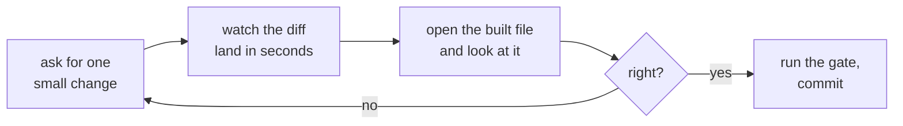

# Claude Code on desktop

**The fast loop.** Files on your machine, a diff you watch as it happens, and a rendered PDF you can
open the second it is written.

Verified against the official documentation on **10 September 2026**:
[Overview](https://code.claude.com/docs/en/overview),
[Desktop](https://code.claude.com/docs/en/desktop).

---

## Install once

The desktop app **includes Claude Code**, so there is no separate CLI install.

| Platform | Download |
|---|---|
| macOS, Intel and Apple Silicon | [Download the .dmg](https://claude.ai/api/desktop/darwin/universal/dmg/latest/redirect) |
| Windows x64 | [Download the installer](https://claude.ai/api/desktop/win32/x64/setup/latest/redirect) |
| Windows ARM64 | [Download the installer](https://claude.ai/api/desktop/win32/arm64/setup/latest/redirect) |
| Ubuntu or Debian | In beta, installed with apt. See [the Linux instructions](https://code.claude.com/docs/en/desktop-linux). |

Launch Claude, sign in, and click the **Code** tab. A paid subscription is required.

If you prefer a terminal, install the CLI directly instead:

```bash
# macOS, Linux, WSL
curl -fsSL https://claude.ai/install.sh | bash

# Windows PowerShell
irm https://claude.ai/install.ps1 | iex

# Homebrew
brew install --cask claude-code

# WinGet
winget install Anthropic.ClaudeCode
```

Then `cd` into the repository and run `claude`.

---

## Set the repository up once

```bash
git clone https://github.com/fde-academy-lab/c2-content-factory.git
cd c2-content-factory
bash setup.sh
```

`setup.sh` installs WeasyPrint, mermaid-cli, python-pptx, openpyxl and Playwright. It tolerates
failure and always exits zero, so read the `[setup]` lines rather than trusting the exit code.

If you would rather not install anything at all, the repository ships a devcontainer, so
**Open in GitHub Codespaces** from the README gives you the same environment in a browser tab.

---

## The loop this lane is for



The whole value is step C. A cheat sheet with a five-point label, a slide whose table has grown past
the footer, a diagram whose arrows cross: none of those are visible in a diff and all of them are
obvious in the PDF. This lane exists so you can look.

---

## What it is best at

| Job | Why desktop wins |
|---|---|
| Anything visual | You open the `.pdf` or the `.pptx` immediately, in the same second it is written |
| A single failing check | The loop is short enough to try three fixes in the time one cloud round trip takes |
| Reviewing somebody else's branch | `git checkout`, run the gate, open the files, comment with your eyes |
| Trying a change to a builder script | You can run `scripts/build_deck.py` on one file and see the result |
| Working without network | The generated data and every script run locally |

---

## Moving between surfaces

| From | To | Command |
|---|---|---|
| Terminal | Desktop app | `/desktop`, which continues the current session where you can review diffs visually. Needs a claude.ai subscription. Available on macOS and x64 Windows. |
| Terminal | Web | `claude --cloud "task"`. It clones the **GitHub remote at your current branch**, not your local checkout, so push first. |
| Web | Terminal | `claude --teleport`. See [Claude Code on the web](Claude-Code-on-the-web#moving-a-session-to-your-terminal). |
| Anywhere | A running cloud session | `claude -p "your message" --cloud <session-id>` posts one message and exits |

Session handoff from the CLI is one way: you can pull a cloud session down, and you cannot push a
terminal session up. The desktop app has a **Continue in** menu that can send a local session to the
web.

---

## Running several at once

Each `--cloud` command starts an independent session, so three artifact families can be built in
parallel when they genuinely do not depend on each other:

```bash
claude --cloud "Rebuild the W03/D2 cheat sheet PDF and report every label under 5.2pt"
claude --cloud "Run distractor_audit across content/W02 and fix every failure"
```

`/tasks` lists them. This is a real accelerator and it is also the fastest way to create a merge
conflict, so keep parallel sessions on genuinely separate folders.

**Two warnings that apply to this repository specifically.** Parallel sessions must not both build
day packs, because that is the drift the one-session rule exists to prevent. And nothing here pushes
to `main`, ever.

---

## What this lane is bad at

| Weakness | What to do instead |
|---|---|
| A long autonomous build while you do something else | [The web](Claude-Code-on-the-web), which keeps running with the laptop shut |
| Working from a machine you do not control | The web, or Codespaces |
| Anything where you would forget to push | The web, where the branch is the only place the work exists |
