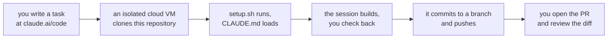

# Claude Code on the web

**The default for a whole day pack.** A browser, no local setup, and a session that keeps running
after you close the tab.

Verified against the official documentation on **10 September 2026**:
[Claude Code on the web](https://code.claude.com/docs/en/claude-code-on-the-web),
[Get started](https://code.claude.com/docs/en/web-quickstart).

> Claude Code on the web is in research preview for Pro, Max and Team users, and for Enterprise
> users with premium seats or Chat and Claude Code seats.

---

## How it works



The session runs on Anthropic-managed infrastructure. It persists when you close the browser, and
you can watch it from the Claude mobile app. There is no separate compute charge for the VM, and it
shares your account's rate limits with everything else.

---

## First time only: connect GitHub

There are two ways, and either is enough.

| Method | What you do | Best for |
|---|---|---|
| **GitHub App** | Authorise the Claude GitHub App during onboarding in the browser | Anyone starting in a browser. This is also what enables auto-fix on pull requests. |
| **`/web-setup`** | Run `/web-setup` in a terminal that already has the `gh` CLI signed in | People who already live in a terminal |

A cloud session can reach any repository the connecting GitHub account can see. Installing the app
on this repository turns on PR webhooks; it is not the thing that controls access.

---

## Running a day pack, start to finish

**1. Open [claude.ai/code](https://claude.ai/code) and start a task on `fde-academy-lab/c2-content-factory`.**

**2. Paste the opening message.** Use the shape from
[Building content with Claude](Building-content-with-Claude): envelope, verified sources with dates,
continuity, and the instruction to stop at the spine.

**3. Set the permission mode.** There is a mode dropdown, both when you create the task and while it
runs. For content work, a mode that asks before running commands is slower and safer on a first
session; once you trust the shape, loosen it.

**4. Wait for the spine, then judge it.** The session should come back with the envelope, the
continuity and a one-screen spine, and then stop. Read it against the day's row in
`docs/curriculum/`. Reject it if the four ideas are five, if the deliberate failure is missing, or
if the sources are not dated.

**5. Approve, and let it build.** Passes run one artifact family at a time. You can close the tab.

**6. Read the diff.** Each session shows a diff indicator like `+42 -18`. Open it, and leave inline
comments on specific lines. Those comments go to Claude with your next message, which is far more
precise than describing the problem in prose.

**7. Ask it to run the gate.** `python3 scripts/verify.py content/W03/D2`. A pack that has not
passed is not reviewable.

**8. Let it commit and push to a branch** named `w03-d2`. **In a cloud session it stops there.** You
open the pull request, so a human reads the diff before anything reaches `main`.

---

## Commands that behave differently here

| Command | In a cloud session |
|---|---|
| `/compact` | Works. Takes focus instructions, for example `/compact keep the verify output` |
| `/context` | Works. Shows what is in the context window right now |
| `/clear` | Does not work. Start a new session from the sidebar instead, which is what you want anyway |
| `/model`, `/effort`, `/rename` | Pass the value as an argument, for example `/model sonnet`, rather than opening a picker |
| `/config` | Opens your settings rather than setting a value. Configure a cloud session through environment variables or committed settings files |

Auto-compaction runs on its own as the context window fills, which is why a long build does not
simply stop.

---

## Moving a session to your terminal

If a session needs a fast local loop, pull it down rather than starting again.

```bash
claude --teleport            # interactive picker
claude --teleport <session>  # a specific session
```

Inside a CLI session, `/teleport` or `/tp` opens the same picker. From `/tasks`, press `t`. From the
web session menu, **Open in > Terminal** copies the command.

Four things must be true or teleport refuses:

| Requirement | What it means here |
|---|---|
| Clean git state | Commit or stash your local changes first |
| Correct repository | Run it from a checkout of `c2-content-factory`, not a fork |
| Branch pushed | The cloud session's branch has to exist on the remote |
| Same account | The claude.ai account that owns the session |

The terminal gets its own copy. Work you do locally after teleporting does not appear back in the
cloud session.

---

## When a session expires

Cloud sessions stop after a period of inactivity and the VM is reclaimed. The session shows as
expired in the list. Reopen it from [claude.ai/code](https://claude.ai/code) and a fresh VM is
provisioned with the conversation history restored.

**Anything still running when the VM was reclaimed is gone**, including background commands. This is
the practical reason to commit early and often inside a long build rather than at the end.

---

## What this lane is bad at

| Weakness | What to do instead |
|---|---|
| Anything you need to look at while it happens, such as a rendered PDF or a slide | Build on [desktop](Claude-Code-on-desktop), or have the web session commit and then open the file from the branch |
| Tight, five-second iteration on one paragraph | Desktop or terminal |
| Deciding what a week should even be | [Claude Project only](Claude-Project-only) first |
| Anything needing a package the environment does not have | Install it in the session with `pip install`, and say so in the reply so the next person knows |

---

## The environment this repository expects

Setup runs [`setup.sh`](https://github.com/fde-academy-lab/c2-content-factory/blob/main/setup.sh)
on container start, and it installs everything the builders need:

| Tool | Needed by | What it does |
|---|---|---|
| WeasyPrint | `scripts/build_cheatsheet.py` | Prints the cheat sheet PDF |
| mermaid-cli | Every diagram in a sheet or a deck | Renders a mermaid fence to SVG through the shared theme |
| python-pptx | `scripts/build_deck.py`, `scripts/deck_check.py` | Builds the slides and then measures them |
| openpyxl | `scripts/xlsx_recalc.py` | Recalculates the workbooks |
| Playwright | `scripts/html_sweep.py` | Clicks every control on a demo page |

`setup.sh` is written to **tolerate failure and keep going**, and it logs every step with a
`[setup]` prefix. It always exits zero, so a green setup does not mean everything installed. If a
build fails on a missing tool, read the setup log before assuming the script is broken: without root
or `sudo` in the environment, the system libraries behind WeasyPrint, the Playwright browsers and
mermaid rendering cannot be installed at all, and the log says so in those words.

A session that installs something itself says so in its reply. If a session needs the same package
every time, that belongs in `setup.sh` as a pull request rather than in every session.
