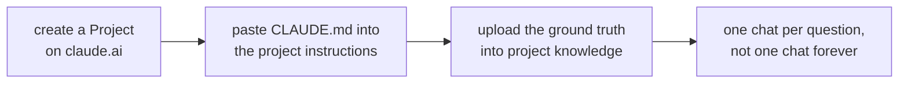
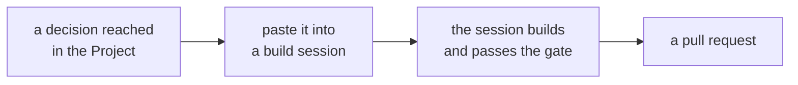

# Claude Project only

**No files, no branch, no gate.** A Project on [claude.ai](https://claude.ai) is a workspace with
its own chat history and its own knowledge base, and it is the right tool when the thing you are
doing is **deciding**, not building.

Verified on **10 September 2026** against
[the Projects help article](https://support.claude.com/en/articles/9517075-what-are-projects).

---

## When this is the right lane

| Use it for | Because |
|---|---|
| Arguing about what a week should contain | There is nothing to build yet, and a file would freeze a decision you have not made |
| Turning a curriculum row into a shape | The output is a paragraph you will paste into a build session |
| Pressure-testing a spine before you approve it | Rejecting a spine is the cheapest thing you will do all week |
| Writing an announcement, a concern reply, a debrief | Prose that never becomes a repository file |
| Thinking through a situation card's twist | The card is fifteen lines and the thinking is two hours |

**Do not use it to build a day pack.** It cannot run `verify.py`, it cannot execute a notebook, it
cannot render a diagram and it cannot open a pull request. A day pack that never passed the gate is
not a day pack.

---

## Setting the Project up

**1. Project instructions.** Paste the contents of
[`CLAUDE.md`](https://github.com/fde-academy-lab/c2-content-factory/blob/main/CLAUDE.md). That single
step gives every chat in the Project the ground truth order, the naming rules, the writing rules and
the banned word list. It is the difference between advice and advice that fits this programme.

**2. Project knowledge.** Upload the files a decision needs to be checked against:

| File | Why it is in the Project |
|---|---|
| `docs/01_Programme_Facts_C2.md` | The locked facts about the cohort and the week shape |
| `docs/07_Client_Zero.md` | Kalpa, locked at v1.1 |
| `docs/08_Modules_and_Credits.md` | The ten modules, their weeks and their assessments |
| `docs/02_Content_Doctrine.md` and `docs/06_Day_Pack_Method.md` | How a day is supposed to be built |
| The week tab from `docs/curriculum/` you are working on | The day's row is the contract |

Free accounts get five Projects. Paid plans get a larger knowledge capacity through retrieval, which
is what makes uploading the curriculum exports practical.

**3. One chat per question.** A Project's value is the shared knowledge base, not one endless
thread. Start a new chat for a new question and the old one stays readable.

---

## The three things worth asking a Project

**Grill the spine before you approve it.** Paste the spine a build session produced and ask for
every open branch: what is unstated, what two readings the day's row allows, what a trainer who did
not write it would guess wrong. This is the single highest-value use of this lane.

**Find the twist.** Paste a business complaint and ask what could make the obvious read wrong,
against the mechanisms in [The Situation Bank](The-Situation-Bank). Then write the card yourself,
because a card written entirely by a model tends to have a clean twist and no motive.

**Write the thing that is not a file.** An announcement about a schedule change, a reply to a
concerned learner, a debrief of a delivered session. None of those belong in `content/`.

---

## Getting the output back into the repository

The handoff is a paste, and it should carry three things: the decision, the reason, and the sources
with the dates they were checked. A decision that arrives without its reason gets re-litigated in
three weeks by somebody who was not in the chat.

If the decision is durable, it belongs in [What's changed](Whats-changed) as well, so nobody has to
find the chat.

---

## The honest limits

| Limit | What it means in practice |
|---|---|
| Nothing is executed | No notebook runs, no PDF is printed, no diagram is rendered, no check passes |
| Nothing is versioned | A chat is not a diff, and a decision in a chat is invisible to everybody else |
| Links are not verified | Every URL a Project suggests has to be opened and dated before it enters an artifact |
| No repository state | It cannot tell you what is already in `content/W03/`, so it will happily propose something that exists |

The fourth one causes the most rework. Check the folder before you accept a plan.
