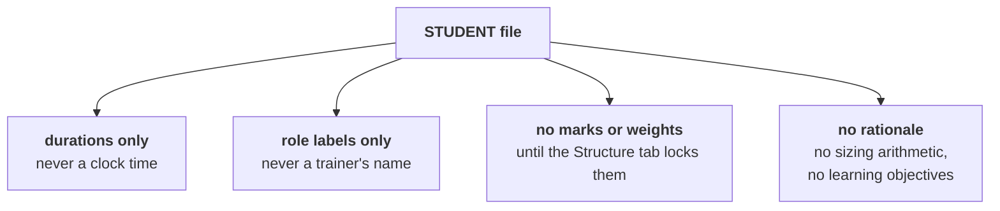

# Conventions and house style

Every rule here exists because something went wrong once. The rule is the short version; the reason
is the part that makes it stick.

The binding copy is
[`CLAUDE.md`](https://github.com/fde-academy-lab/c2-content-factory/blob/main/CLAUDE.md), which every
build session loads. **Where this page and `CLAUDE.md` disagree, `CLAUDE.md` wins and this page is
the bug.**

---

## Writing

| Rule | Why it exists |
|---|---|
| **No em-dashes anywhere.** Not in prose, not in tables, not in code, not in build scripts. | It is the single most reliable tell of unedited machine prose, and one in a client-facing deck undoes a lot of careful work. |
| **Full connected sentences**, in every bullet and every table cell | A clipped fragment reads as a label. A reader has to reconstruct the sentence, and half of them reconstruct it wrong. |
| **"Rs", never the currency glyph** | The glyph renders inconsistently across the fonts the decks and PDFs use, and a broken glyph in a printed sheet cannot be fixed after the print. |
| **No "not X, but Y" constructions** | It is a rhythm rather than an argument. Say the thing you mean. |
| **Banned words** | Listed below, each because it adds length without adding information |

The banned list, in full: *Additionally, Moreover, However, Hence, Thus, Nonetheless, Furthermore,
Accordingly, Indeed, Dynamic, comprehensive, robust, holistic, seamless*, and *leverage* used as a
verb.

Most of those are connective padding. Read a sentence with the word removed: if it still works, the
word was doing nothing. `comprehensive`, `robust` and `holistic` are different, and they are banned
because they are claims about quality made by the person who did the work.

**Plain connectives are fine.** So, since, for example, which means, and that is why.

---

## What never appears in a learner-facing file



| Rule | Why it exists |
|---|---|
| Durations, never clock times | Sessions move. A pack with clock times in it goes stale the first time a schedule shifts, and it goes stale silently. |
| Role labels, never trainer names in STUDENT files | Trainers change between cohorts, and a name in a student file is a promise nobody made. |
| No marks or weights anywhere until the Structure tab locks them | Two weighting models are in circulation and neither is signed off. A number stated in an artifact becomes the number people believe. |
| No rationale inside an artifact | Design rationale, sizing arithmetic, learning objectives and facilitation notes belong in the chat reply or the trainer file. Inside a document, "you" means the end reader. |

---

## Sources and links

| Rule | Why it exists |
|---|---|
| **Every URL was verified the day it entered, and carries that date** | A link from memory is a guess wearing a citation's clothes |
| **An unverified slot says "to be found"** | An empty slot is honest. A plausible-looking wrong link is not. |
| **Links the requester supplies are the lock**, not a starting point | A build session that goes looking for something better will find something, and it will not be better |
| **One written reference and one video per new topic**, and the product's own documentation for any tool used for the first time | Two modalities, and the primary source for anything that could have changed |

**The failure mode this prevents** is specific: a session three passes into a build that needs a
reference for slide eleven will produce something that looks exactly like a reference. Lock the
sources before the build starts.

---

## Naming and layout

```
content/W03/D2/slides/C2_W03_D02_joins_STUDENT.pptx
        │   │  │      │                  └── audience, never omitted
        │   │  │      └── week and day, two digits in the filename
        │   │  └── the subfolder that fits the artifact
        │   └── one digit in the folder name, by design
        └── two digits in the folder name
```

| Rule | Why it exists |
|---|---|
| `C2_W{ww}_D{dd}_{topic}_{AUDIENCE}.{ext}`, or `C2_W{ww}_SAT_...` on a Saturday | A file that leaves the folder still says what it is |
| `AUDIENCE` is `STUDENT`, `TRAINER` or `INTERNAL`, and is never omitted | An unlabelled file gets sent to the wrong person exactly once |
| The topic half carries **only what the folder and the extension do not already say** | `slides/..._slides_deck.pptx` says slides three times |
| **Nothing loose at the day folder root** | Every file lives in the subfolder that fits it. `ls content/W03/D2` should show only folders. |

The full layout, including the different shapes a build day and a Saturday take, is in
[`content/README.md`](https://github.com/fde-academy-lab/c2-content-factory/blob/main/content/README.md).

---

## Artifacts, and the source they are built from

| Artifact | Authored as | Built by | The staleness rule |
|---|---|---|---|
| Deck | Markdown | `scripts/build_deck.py`, using the shared layout in `scripts/deck_layout.py` | A `.pptx` older than its markdown is stale, and gets rebuilt rather than shipped |
| Cheat sheet | Markdown | `scripts/build_cheatsheet.py` | A sheet with no PDF beside it, or a PDF older than its markdown, fails the gate |
| Notebook | `.ipynb` | Executed before it ships | Every code cell carries its saved output, at least three diagrams render from code, at least five checks report and pass |
| Diagram | A mermaid fence, through the shared theme | The builders | Never a picture pasted in. Measured before it ships. |

**The measurement rule is the one people argue with.** A label that would print under about five
points on a sheet, or nine on a slide, means the diagram gets reshaped shorter or narrower. It never
means the page shrinks to fit it. A diagram nobody can read is a decoration.

---

## Content design

| Rule | Why it exists |
|---|---|
| Mental model first, spiral always | A learner who has the picture can hang the details on it. One who has the details first has a list. |
| At most four new ideas per two-hour block | Five is the number at which a room stops asking questions |
| Application before theory | The definition means something once you have needed it |
| One deliberate failure per block, **with the exact error text** | A failure described in prose is a warning. Reproduced verbatim, it is a skill. |
| Kahoot is daily and ungraded | Attention and retention signal, at low stakes |
| No tests in build weeks | The build is the assessment |

---

## The gate

```bash
python3 scripts/verify.py content/W03/D2
```

One command, six proofs, run on the folder rather than on a file. See
[Manual steps and checks](Manual-steps-and-checks) for what it proves and what it cannot.

**A pack that has not passed verify is not done**, and it is not reviewable either.

---

## Branches and commits

| Rule | Why |
|---|---|
| Branch named `w{ww}-d{d}`, or `w{ww}-sat` for a Saturday | The branch name says which board card it belongs to |
| Never commit directly to `main` | A human reads the diff before it reaches the branch everybody builds from |
| In a cloud session, stop after committing and let the reviewer open the pull request | The same reason |
| Small commits, with messages that say what changed | A reviewer reads messages before diffs |
| A proof that fails on a file you did not touch gets **reported**, never fixed silently | It is either a real defect somebody needs to know about or a change in the proof, and both deserve a sentence |
