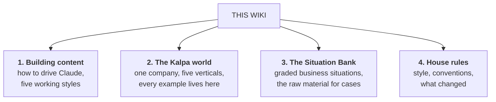
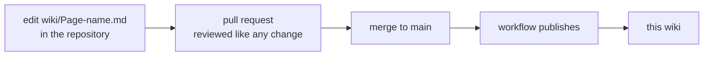

# The C2 Content Factory wiki

The handbook for everyone who **makes, checks or argues about** the teaching material in this
repository. The repository holds the artifacts and the proofs. This wiki holds the know-how: how to
drive the tools, what world every example lives in, and the bank of business situations the
programme is built to make a learner good at.

> **The repository answers "what is built".**
> **This wiki answers "how do we build it, and what should it be about".**

---

## Start here

| If you are | Read, in this order |
|---|---|
| **New, and about to build a day pack** | [Building content with Claude](Building-content-with-Claude) → the tool page that matches how you work → [Manual steps and checks](Manual-steps-and-checks) |
| **New, and about to review** | [The Kalpa world](The-Kalpa-world) → [Conventions and house style](Conventions-and-house-style) → the repo's [board guide](https://github.com/fde-academy-lab/c2-content-factory/blob/main/docs/agents/content-board.md) |
| **Designing a case, a GD or a build brief** | [The Situation Bank](The-Situation-Bank) → the module page you need → [Running a Situation Room](Running-a-Situation-Room) |
| **Wondering what an interview actually asks** | [Interview reality](Interview-reality) |
| **Coming back after a break** | [What's changed](Whats-changed) |

---

## The four sections

### 1. Building content

Five ways to work, because different jobs suit different tools. Every one of them ends at the same
place: a pull request that passes the gate.

| Page | Use it when |
|---|---|
| [Building content with Claude](Building-content-with-Claude) | The overview and the decision table. Start here. |
| [Claude Code on the web](Claude-Code-on-the-web) | You have a browser and no local setup. The default for a full day pack. |
| [Claude Code on desktop](Claude-Code-on-desktop) | You want speed, local files, and to watch the diff as it happens |
| [Claude Project only](Claude-Project-only) | You are drafting, thinking, or arguing about shape before anything is a file |
| [The blended workflow](The-blended-workflow) | The way most real work happens: think in a Project, build in Code |
| [Manual steps and checks](Manual-steps-and-checks) | The things no tool does for you, and the ones worth doing by eye |

### 2. The Kalpa world

Every example in twenty weeks lives inside one company. Not for tidiness: so that a learner in week
nineteen still stands on what they understood in week one.

| Page | What is in it |
|---|---|
| [The Kalpa world](The-Kalpa-world) | The company, the five units, and how a domain is chosen |
| [Kalpa Retail](Kalpa-Retail) | The teaching spine. Consumer commerce. |
| [Kalpa Financial Services](Kalpa-Financial-Services) | Payments and lending. Imbalance and asymmetric cost live here. |
| [Kalpa Logistics](Kalpa-Logistics) | Delivery and warehousing. Time, capacity and exceptions. |
| [Kalpa Health](Kalpa-Health) | Labs and clinics. Refusal rules and consequence asymmetry. |
| [Kalpa Connect](Kalpa-Connect) | Telecom and subscriptions. Churn and the survivorship traps. |

### 3. The Situation Bank

Business situations, graded, with the twist named. **Situations, never solutions.** A situation with
its answer attached is a worked example, and a worked example teaches nobody to think.

| Page | What is in it |
|---|---|
| [The Situation Bank](The-Situation-Bank) | The grading ladder, the card format, and how a situation becomes a case |
| [Situations: analytics](Situations-analytics) | Denominators, mix shift, confounding, the metric that lies |
| [Situations: machine learning](Situations-machine-learning) | Labels, leakage, imbalance, cost asymmetry, drift |
| [Situations: GenAI and agents](Situations-GenAI-and-agents) | Retrieval, refusal, evaluation, cost per task, the human in the loop |
| [Running a Situation Room](Running-a-Situation-Room) | The build-week group discussion format, and how to run one |
| [Interview reality](Interview-reality) | What is actually asked at FDE, ML engineer and ML scientist level |

### 4. House rules

| Page | What is in it |
|---|---|
| [Conventions and house style](Conventions-and-house-style) | Writing rules, naming, the banned list, and why each exists |
| [What's changed](Whats-changed) | A dated log of decisions, so nobody re-litigates a settled one |

---

## How this wiki is edited

The wiki's source lives in the repository at [`wiki/`](https://github.com/fde-academy-lab/c2-content-factory/tree/main/wiki),
and a workflow publishes it here on every merge to `main`.

That means a wiki change is a pull request: it gets reviewed, it is in the history, and Claude Code
can write it the same way it writes everything else. **Editing a page in the GitHub wiki UI will be
overwritten on the next merge.** Edit `wiki/` instead.

---

## Two rules that apply to every page here

1. **Mark what is what.** Established fact, contested call, or somebody's construction. A situation
   invented for teaching is labelled as invented. A number taken from a source carries the source
   and the date it was checked.
2. **No solutions in the Situation Bank.** Pain points, symptoms, what the stakeholder says, and
   what is actually true underneath. The moment a card carries a worked answer, the room stops
   thinking and starts reading.
