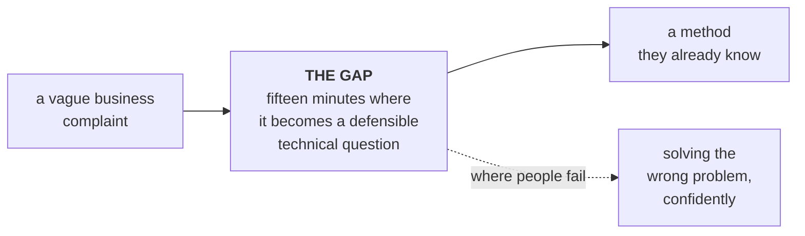

# Interview reality

What is actually asked at the level this cohort is aiming at, and what it means for the content we
build.

**Read the sourcing note first.** Everything on this page comes from public interview-preparation
guides and candidate reports, checked on **10 September 2026**. None of it is any employer's
published process, and no number here should be quoted to a learner as fact about a specific
company. It is the best available picture of a pattern, and it is labelled as that.

---

## The one finding that changes what we build

Across every source, the failure is in the same place, and it is not the algorithm.

Candidates arrive able to build the thing. They lose the round in the decomposition: they do not ask
clarifying questions, they do not name the trade-off, and they answer a question nobody asked.
That gap is what [The Situation Bank](The-Situation-Bank) exists to close.

---

## The Forward Deployed Engineer shape

Preparation guides describe a broadly consistent pipeline: a short recruiter screen, a technical
use-case screen, a coding round, a hiring manager round, and a final panel that pairs solution
design with a behavioural and values conversation. Candidate reports put the whole process at
roughly four to six weeks.

**The round that decides it is the ambiguous case study.** Guides describe it as 45 to 60 minutes in
which a hypothetical customer hands over a vague problem and the candidate has to decompose it into
a plan. The same sources report it as the stage with the lowest pass rate, around 40 percent, and
the heaviest weight, around 30 percent
([Aced, formerly Exponent](https://www.tryexponent.com/blog/forward-deployed-engineer-interview-the-definitive-2026-guide-fde),
[Perspective AI](https://getperspective.ai/blog/forward-deployed-engineer-interview-questions-2026-prep-guide),
checked 10 Sep 2026). Treat those two figures as reported rather than established.

What the same guides say interviewers are looking for:

| Behaviour | What it looks like in a room |
|---|---|
| **Clarifying questions before solutioning** | The first thing out of the candidate's mouth is a question about the business, not a proposal |
| **Clean decomposition** | The vague complaint becomes two or three separable questions, each of which can be answered |
| **Prioritisation** | They say which one to answer first and why, rather than promising all of it |
| **Transparent trade-offs** | They name what the chosen path gives up, without being asked |

Guides also describe the role itself as split roughly between building, customer-facing work and
internal feedback, with deliverables that increasingly include agent tooling. Being able to talk
fluently about tool schemas, decomposing work across sub-agents, context management, and where
agents fail is on-topic rather than a bonus.

**What this means for us:** every one of those four behaviours is trainable, and none of them is
trainable from a worked example. They need a room where the problem is genuinely under-specified.
That is the [Situation Room](Running-a-Situation-Room).

---

## The machine learning engineer and scientist shape

The published guidance is consistent on what separates candidates: metric choice, honest validation,
and leakage
([Data Interview](https://www.datainterview.com/blog/machine-learning-interview-questions),
[BuildML](https://buildml.substack.com/p/data-science-interview-guide-cracking),
checked 10 Sep 2026). A named common failure is claiming strong performance without having validated
properly.

| What is tested | The card that trains it |
|---|---|
| Picking a metric that matches the business decision | `S-FIN-ML-01`, where accuracy is 99.8 percent and useless |
| Building validation that resembles deployment | `S-LOG-ML-13`, a random split across time |
| Recognising leakage | `S-HLT-ML-02`, where the strongest feature is written after the outcome |
| Handling imbalance and asymmetric cost | `S-HLT-ML-14`, where the two errors cost different things |
| Knowing when a model is not the answer | `S-HLT-ML-02` escalated, where the arithmetic decides and the model does not |

The four questions at the foot of
[Situations: machine learning](Situations-machine-learning#the-question-to-teach-before-any-model)
are the compressed version, and they are worth teaching as a habit rather than as content.

---

## The AI and GenAI engineer shape

Preparation material for AI engineer roles is heavily weighted toward retrieval, evaluation and
production failure
([MyEngineeringPath](https://myengineeringpath.dev/genai-engineer/system-design-interview/),
[BuildML on RAG](https://buildml.substack.com/p/top-interview-questions-on-rag-for),
checked 10 Sep 2026). Three questions come up repeatedly:

1. **When an answer is wrong, was it retrieval or generation?** A candidate with no diagnosis path
   has nothing to say for the rest of the round.
2. **How do you evaluate beyond accuracy?** Faithfulness against a retrieved context, and the
   awkward fact that a faithful answer can still be wrong when the corpus is wrong.
3. **Which production failure modes can you name unprompted?** Hallucination is the one everybody
   says. Corpus drift, silent model version change, cost per resolved task and prompt injection are
   the ones that separate people.

The cards for all of those are on
[Situations: GenAI and agents](Situations-GenAI-and-agents), and `S-FIN-GA-02` is the one to save
for a candidate who is doing well.

---

## What the tough rounds actually feel like

The reason this bank leans on L3 and L4 cards is simple. Easy rounds are cleared by anyone who did
the reading. The rounds that decide an offer have one of these shapes:

| Shape | The question underneath | Where it lives |
|---|---|---|
| **Two right answers** | "Which do you report, and who is harmed by the other?" | `S-RET-AN-01`, `S-CON-AN-02` |
| **The metric is the wrong shape** | "What would you measure instead, and why does the current one look fine?" | `S-FIN-ML-01` |
| **The label is not what it says** | "When does this value become known, and to whom?" | `S-HLT-ML-02`, `S-CON-ML-10` |
| **The system creates its own data** | "What happens to the labels after you deploy?" | `S-FIN-ML-01` at L4, `S-CON-ML-12` |
| **The control is decorative** | "How would you find out whether that check does anything?" | `S-FIN-GA-02`, `S-CON-GA-16` |
| **You cannot measure the thing** | "There is no ground truth here. Now what?" | `S-HLT-GA-03` |

Somebody who has met all six and been wrong about them in a safe room has an intuition that no
amount of syllabus coverage produces. **That is the whole thesis of the bank:** prepare for the hard
ones and the easy ones take care of themselves.

---

## How the programme uses this

| Programme element | The interview behaviour it trains |
|---|---|
| The day's business question, which opens every teaching day | Reading a complaint as a question that needs decomposing |
| The deliberate failure, one per block with exact error text | Diagnosing rather than restarting |
| The closing sentence a learner would send a stakeholder | Saying a technical result in business words |
| The [Situation Room](Running-a-Situation-Room) on build-week Monday | Clarifying questions, prioritisation, trade-offs, and saying an unwelcome thing |
| Mock interviews during build weeks, individual and roughly 20 minutes | The case round itself, under time |
| The capstone panel defence | Solution design plus the defence of the choices in it |

---

## What this page is not

It is not a list of questions to drill. A learner who memorises `S-FIN-ML-01` has learned one card
and nothing else.

The transferable thing is the **first question**, and there are only about ten of them in the whole
bank. Divided by what. Compared with what. When does the label arrive. Who acts on this, and how
many can they act on. What does each error cost. What is missing from this data. Who is harmed if I
am wrong. When it is wrong, which half failed. What authorises that action. How would I know if this
got worse.

Teach the ten questions. The cards are practice.
