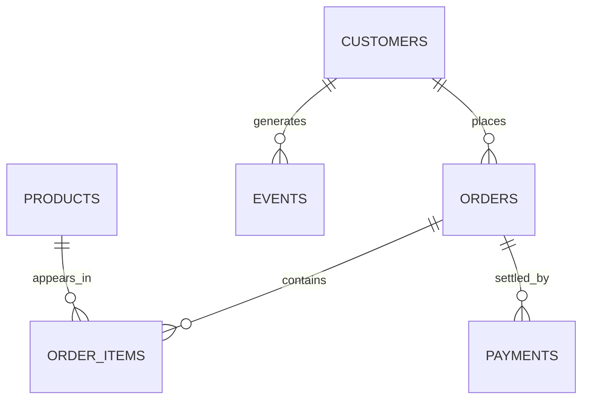

# Kalpa Retail

**The teaching spine.** Online and in-store consumer commerce across India and South-East Asia.
Every teaching day from Week 1 to Week 15 computes on this unit, so a learner meets exactly one new
idea at a time and never spends the first ten minutes re-learning a domain.

> Code `RET`. Ground truth is section 3 of
> [`docs/07_Client_Zero.md`](https://github.com/fde-academy-lab/c2-content-factory/blob/main/docs/07_Client_Zero.md).

---

## 1. Who runs it, and what each of them wants

| Role | Measured on | What they want to hear | What they will resist |
|---|---|---|---|
| Head of Retail Stores | Footfall and store revenue | That stores are healthy and the expansion plan should be approved | Any number that treats a closed store as a lost store |
| Head of Digital | App orders and conversion | That the channel shift is a win | Being asked to share credit for a customer who browsed in store |
| Category Managers | Margin and stock turn by category | That their category is performing | A margin number computed after returns and delivery |
| Head of Customer Experience | Contacts, satisfaction, deflection | That support is getting cheaper | A resolution metric that replaces deflection |
| Group CFO | Contribution per order across channels | The truth, and quickly | Nothing, which is what makes this the safest room and the least interesting one |

**The tension that generates most cards here:** stores and the app report to different people and
share one customer. Every metric that has to count that customer exactly once is contested by
somebody whose bonus depends on counting them twice.

---

## 2. The data estate

The entity model is the locked one, and it is what the whole programme grows through: a list of
dictionaries in Week 1, files on disk, Postgres tables, a pandas frame, a feature table, then a
document corpus.

Segments are four: Retail-Core, Retail-Plus, Business and Student. Amounts are in Rs, with a typical
order between Rs 800 and Rs 3,000.

**What is deliberately absent, and why that matters more than what is present:**

| Missing | The question it forces |
|---|---|
| Staffing per store | Was footfall down, or was there nobody to serve them? |
| Competitor openings | Did demand fall, or did it move across the road? |
| Cost of goods | Is the highest-revenue category the most profitable one? |
| Store catchment boundaries | Are app orders in a pincode cannibalising the store, or new demand? |
| Any link between a store visit and a later app order | Who gets credit for the sale? |

Asking for what is missing is half the skill this unit teaches. A learner who accepts the file as
given has already failed the interview version of the question.

---

## 3. The KPIs, and how each one is gamed

| KPI | What people say it is | The denominator that decides it | How it breaks or gets gamed |
|---|---|---|---|
| **Footfall** | People walking into stores | Per **open store-day**, never per store | Two stores closing shrinks the estate and the total falls while every surviving store improves. Staff entries get counted. |
| **Conversion** | Transactions divided by footfall | Which visits count, and whether a later app order counts | A group of four counts as one entry and one transaction, so family shopping inflates it. A promotion inflates the denominator faster than the numerator. |
| **Average order value** | Revenue divided by orders | Orders placed, delivered, or net of returns | A handful of bulk buyers moves the mean and leaves the median flat. Reporting the mean is the default and it is usually the wrong statistic. |
| **Return rate** | Returns divided by orders | Placed, shipped or delivered, and this changes in dashboard releases | Returns arrive weeks after the order, so the current month always looks clean and every past month keeps rising. |
| **Repeat purchase rate** | Customers with two or more orders | The signup cohort, by month | A wave of new customers holds the blended rate flat while every individual cohort declines. |
| **Basket lift** | Products bought together | Lift against the base rate, never confidence alone | A very popular item reaches confidence 0.82 at lift 0.97, which means the association is weaker than chance and looks strong. |
| **On-shelf availability** | Whether a customer can buy it | The shelf, not the warehouse | Measured at the distribution centre it is always excellent and always irrelevant. |
| **Contribution per order** | Revenue minus goods, delivery, returns and payment fees | Per order, after the return window closes | Almost nobody computes it, and it reverses the ranking of "best channel" more often than not. |

**The one to teach first is the denominator.** Six of these eight break on it.

---

## 4. Case families, mapped to modules

| Module | Case family here | The teaching version |
|---|---|---|
| 1 Foundations of AI and Data | Revenue by segment, average order value, return rate, funnel conversion, cohort retention | The spine for Weeks 1 to 3, computed by hand then by every new tool |
| 2 Applied Machine Learning | Return prediction, customer lifetime value, demand forecasting per store and SKU | The `v4` feature table, with its 96 to 4 imbalance and its planted leaking field |
| 3 Deep Learning and Neural Networks | Product similarity and sequence models over browsing events | The `EVENTS` table becomes a sequence rather than a count |
| 4 Natural Language Processing | Support ticket classification, review mining, search query understanding | The anonymised ticket bank |
| 5 and 6 Generative AI | Product search, the support assistant on the policy corpus | The Weeks 11 and 12 corpus, with its two contradicting policies and its unanswerable question |
| 7 Production AI | Cost per resolved contact, seasonal drift, the evaluation that can be re-run | The assistant built in Week 12, now measured |
| 8 and 9 Agentic AI | A returns-handling agent with a refund limit and an escalation path | Where authority stops being a prompt and becomes a tool boundary |

---

## 5. The situations hosted here

| Page | Cards |
|---|---|
| [Analytics](Situations-analytics) | `S-RET-AN-01` (the footfall that fell but did not), `S-RET-AN-04` to `S-RET-AN-07` |
| [Machine learning](Situations-machine-learning) | `S-RET-ML-07` to `S-RET-ML-09` |
| [GenAI and agents](Situations-GenAI-and-agents) | `S-RET-GA-01` (right about the wrong policy), `S-RET-GA-04` to `S-RET-GA-07` |

---

## 6. What Retail must never be used for

1. **A first teaching of an idea that belongs to another unit.** Imbalance is introduced in Financial
   Services, censoring in Logistics, refusal in Health. Retail can host the second example.
2. **Real data.** The spine is generated, seeded and identical for every learner. Real messy data
   appears only in build weeks.
3. **A case whose twist needs knowledge nobody in the room has.** If the answer turns on retail
   accounting conventions, it is a trivia question wearing a business costume.
